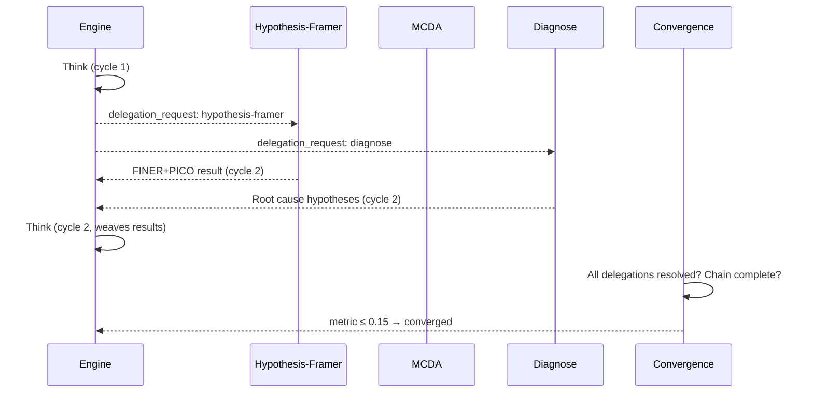

# Sequential Inquiry Skill

**The primary structured reasoning skill for hKask.** Provides dynamic chain-of-thought with branching, revision, and hypothesis verification. When the engine identifies a thought needing deeper analysis, it emits delegation requests; the flowdef dispatches to hypothesis-framer (FINER+PICO), mcda (weighted comparison), or diagnose (root-cause analysis). Results feed back into the next PDCA cycle.

**No pre-selection needed.** The engine decides at runtime whether to delegate. If no delegation requests are emitted, the delegate steps return `invoked: false` and the skill functions as pure sequential thinking. Use for any reasoning task — from simple decomposition to compound inquiry.

## Architecture

```
┌──────────────────────────────────────────────────────┐
│ Step 1: sequential-inquiry-engine (Think)            │
│   • decompose, branch, revise, hypothesize, verify   │
│   • emit delegation_requests when deep-dive needed   │
│   • on re-entry: weave prior_delegation_results into │
│     new thought chain                                │
├──────────────────────────────────────────────────────┤
│ Step 2: delegate-hypothesis-framer                   │
│   • no-op if no h-f request, else FINER + PICO       │
├──────────────────────────────────────────────────────┤
│ Step 3: delegate-mcda                                │
│   • no-op if no mcda request, else criteria weighting│
│     + scoring + compensation masking + sensitivity   │
├──────────────────────────────────────────────────────┤
│ Step 4: delegate-diagnose                            │
│   • no-op if no diagnose request, else repro strategy│
│     + ranked hypotheses + instrumentation plan       │
├──────────────────────────────────────────────────────┤
│ Step 5: convergence-check (10-criterion, 0.15)       │
├──────────────────────────────────────────────────────┤
│ Step 6: loop → Step 1                                │
└──────────────────────────────────────────────────────┘
```

## When to Use

Use sequential-inquiry for ANY structured reasoning task. The engine provides:
- **Decomposition + sorting** — break problems into ordered thought chains
- **Branching + revision** — explore alternatives, correct earlier reasoning
- **Hypothesis testing** — formulate, verify, and calibrate
- **Automatic deep-dive** — when a thought needs FINER+PICO, MCDA, or diagnosis, the engine delegates automatically

There is no separate "sequential-thinking" skill — sequential-inquiry handles both simple and complex reasoning. If no delegation is needed, the delegate steps return `invoked: false` and the skill behaves as pure chain-of-thought.

## Delegation Flow



## Registry Templates

| Template | Type | Purpose |
|----------|------|---------|
| `sequential-inquiry-engine.j2` | KnowAct | Inquiry engine with delegation awareness |
| `sequential-inquiry-delegate-hypothesis-framer.j2` | KnowAct | FINER + PICO delegate (no-op if not requested) |
| `sequential-inquiry-delegate-mcda.j2` | KnowAct | MCDA delegate (no-op if not requested) |
| `sequential-inquiry-delegate-diagnose.j2` | KnowAct | Diagnose delegate (no-op if not requested) |
| `sequential-inquiry-convergence-check.j2` | KnowAct | 10-criterion convergence with delegation resolution |

## Gas & Energy

| Resource | Cap | Per Iteration |
|----------|-----|---------------|
| Gas | 120,000 | 100 |
| rJoule | 2 |
| Max iterations | 3 | — |
| Engine timeout | 90s | — |
| Delegate timeout | 60s each | — |
| Check timeout | 30s | — |
