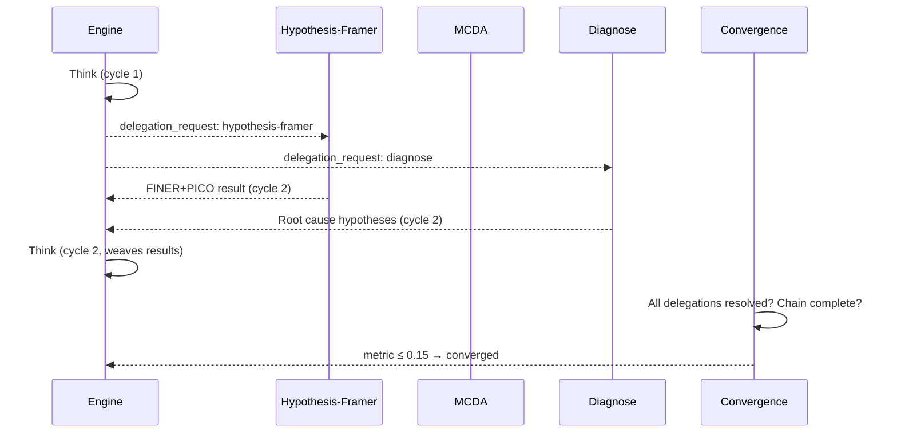

# Sequential Inquiry Skill

**Compound skill.** Wraps the sequential-thinking decomposition-and-sorting engine in a flowdef that also composes three deep-dive skills as delegation targets. When the engine identifies a thought that needs analysis beyond reasoning alone, it emits a delegation request; the flowdef dispatches to the requested sub-skill; results feed back into the engine on the next PDCA cycle.

## Architecture

```
┌──────────────────────────────────────────────────────┐
│ Step 1: sequential-inquiry-engine (Think)            │
│   • decompose, branch, revise, hypothesize, verify   │
│   • emit delegation_requests when deep-dive needed   │
│   • on re-entry: weave prior_delegation_results into │
│     new thought chain                                │
├──────────────────────────────────────────────────────┤
│ Step 2: delegate-hypothesis-framer                   │
│   • no-op if no h-f request, else FINER + PICO       │
├──────────────────────────────────────────────────────┤
│ Step 3: delegate-mcda                                │
│   • no-op if no mcda request, else criteria weighting│
│     + scoring + compensation masking + sensitivity   │
├──────────────────────────────────────────────────────┤
│ Step 4: delegate-diagnose                            │
│   • no-op if no diagnose request, else repro strategy│
│     + ranked hypotheses + instrumentation plan       │
├──────────────────────────────────────────────────────┤
│ Step 5: convergence-check (10-criterion, 0.15)       │
├──────────────────────────────────────────────────────┤
│ Step 6: loop → Step 1                                │
└──────────────────────────────────────────────────────┘
```

## vs. Sequential Thinking

| Dimension | sequential-thinking | sequential-inquiry |
|-----------|--------------------|--------------------|
| **Role** | Decomposition + sorting | Decomposition + sorting + deep-dive delegation |
| **Sub-skills** | None | hypothesis-framer, mcda, diagnose |
| **Delegation** | N/A | Engine emits `delegation_requests`, flowdef dispatches |
| **Convergence criteria** | 8 (hypothesis + chain) | 10 (+ delegation resolution) |
| **Gas cap** | 100,000 | 150,000 |
| **rJoule cap** | 24,000 | 32,000 |
| **Steps** | 3 | 6 |

## When to Use

Use **sequential-thinking** when the problem can be solved through pure reasoning — no structured methodology beyond CoT is needed.

Use **sequential-inquiry** when the problem likely requires:
- Formal hypothesis validation (hypothesis-framer)
- Weighted comparison of alternatives (mcda)
- Structured root-cause diagnosis (diagnose)

The engine decides which to invoke at runtime based on the thought content. You don't pre-select — the flowdef handles it.

## Delegation Flow



## Registry Templates

| Template | Type | Purpose |
|----------|------|---------|
| `sequential-inquiry-engine.j2` | KnowAct | Inquiry engine with delegation awareness |
| `sequential-inquiry-delegate-hypothesis-framer.j2` | KnowAct | FINER + PICO delegate (no-op if not requested) |
| `sequential-inquiry-delegate-mcda.j2` | KnowAct | MCDA delegate (no-op if not requested) |
| `sequential-inquiry-delegate-diagnose.j2` | KnowAct | Diagnose delegate (no-op if not requested) |
| `sequential-inquiry-convergence-check.j2` | KnowAct | 10-criterion convergence with delegation resolution |

## Gas & Energy

| Resource | Cap | Per Iteration |
|----------|-----|---------------|
| Gas | 120,000 | 100 |
| rJoule | 2 |
| Max iterations | 3 | — |
| Engine timeout | 90s | — |
| Delegate timeout | 60s each | — |
| Check timeout | 30s | — |
