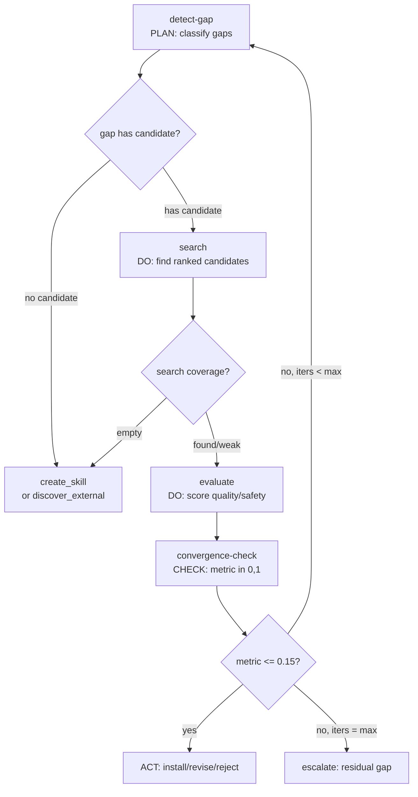
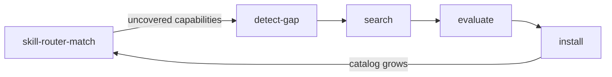

# Skill Discovery

Acquire NEW skills for hKask. Full lifecycle: detect capability gaps in the skill corpus, search the catalog for candidates that could fill each gap, evaluate candidates against format/quality/safety criteria, and guide installation. Distinct from skill-router (which matches tasks to EXISTING skills): skill-discovery acquires NEW skills. skill-router feeds uncovered capabilities to skill-discovery as gap signals.

## When to Use

- Detect capability gaps in the registry corpus by comparing task patterns an agent encounters against existing registry crates.
- Search the skill catalog for candidates that could fill an identified gap, ranked by fit score.
- Evaluate a candidate registry crate against format, quality, and safety criteria to determine whether it should be installed, revised, or rejected.
- Compute a normalized convergence metric for discovery iterations to assess whether an identified capability gap is sufficiently resolved.
- Consume gap signals from skill-router (uncovered capabilities) or task-breakdown (task patterns that no skill covers).

## Instructions

### skill-discovery-detect-gap

1. Map every task pattern to determine if an existing skill covers it fully, partially, or not at all.
2. Classify partial matches as Feature gaps rather than Coverage gaps.
3. Detect latent gaps where a quality or governance rule exists in `docs/architecture/PRINCIPLES.md` but no skill enforces it, classifying these as Governance gaps.
4. Score the impact of each gap on agent effectiveness as `critical`, `high`, `medium`, or `low`.
5. Prioritize gaps by impact, then by frequency of the associated task pattern.
6. Recommend an action per gap: `create_skill` (coverage gap), `extend_skill` (feature gap, needs new templates), `route_to_skill_router` (feature gap, existing skill not yet routed), `discover_external` (external crate), `automate` (automation gap), or `ignore` (low-impact only).
7. Respond with a JSON object containing the `gap_list` and `priority_ranking`.
8. Evaluate every task pattern without skipping niche patterns.
9. Ensure each gap references exactly one category, even if it spans multiple task patterns.
10. Justify impact scoring using task pattern frequency and consequence.
11. Do not recommend `ignore` for any gap with `critical` or `high` impact.

### skill-discovery-search

1. Given a gap description and the skill catalog, score each skill 0.0–1.0 on capability match (0.50 weight), lexicon overlap (0.25 weight), and trigger relevance (0.25 weight).
2. Compute composite fit_score as the weighted sum.
3. Rank candidates by fit_score descending. Return at most `max_candidates` (default 5), only those with fit_score ≥ 0.20.
4. Classify search coverage: `found` (fit ≥ 0.60), `weak` (0.30–0.59), `empty` (< 0.30 → recommend `create_skill`).
5. For each candidate, classify gap fill type: `direct` (fills as-is), `extension` (needs new templates), `adaptation` (existing templates reparameterized).
6. Respond with a JSON object containing `search_coverage`, `best_fit_score`, and `candidates`.
7. Score every skill in the catalog — do not skip entries.
8. Do not recommend skill-discovery or skill-router as candidates — they are meta-skills.

### skill-discovery-evaluate

1. Evaluate the candidate skill against format, quality, and safety criteria.
2. Validate the format by checking for YAML frontmatter, a valid name, a specific description, and the absence of deprecated markers.
3. Assess instruction quality to ensure steps are imperative, concrete, actionable, bounded in scope, and have clear trigger conditions.
4. Check Magna Carta compliance and system constraints, including user sovereignty (P1), affirmative consent (P2), generative space (P3), clear boundaries (P4), headless compliance, Regulation span validity, and crate path validity.
5. Score each check from 0 to 2, where 0 is fail, 1 is partial, and 2 is pass.
6. Respond with a JSON object containing `format_validation`, `quality_evaluation`, `safety_evaluation`, `overall_score`, and `recommendation`.
7. Score every check without omitting any.
8. Reject the skill if any safety check scores 0.
9. Revise the skill if the overall score is less than 16 but there are no safety failures.

### skill-discovery-convergence-check

1. Compute a normalized `convergence_metric` in the range [0,1], where 0 means the gap is sufficiently resolved and 1 means it is unresolved.
2. Start scoring at 1.0 and adjust downward based on candidate evaluation results.
3. Set the metric to 0.1 or lower if the recommendation is to install and safety checks pass.
4. Set the metric between 0.2 and 0.6 if the recommendation is to revise but the candidate is close.
5. Set the metric to 0.7 or higher if the recommendation is to reject and no fallback exists.
6. Clamp the final metric to the [0,1] range.
7. Return a JSON object containing the `convergence_metric`, `convergence_method`, `rationale`, `blockers`, and `remaining_gap`.

## PDCA Pipeline

## Integration with skill-router

- `skill-router` matches tasks to EXISTING skills. When it finds `coverage: none` or `partial`, it emits `uncovered_capabilities`.
- Those capabilities are consumed by `detect-gap` as `task_patterns`.
- `search` finds candidates in the catalog; `evaluate` vets them; `install` adds them.
- The catalog grows → future `skill-router` calls have better coverage.

## Registry Templates

| Template | Type | Purpose |
|----------|------|---------|
| `skill-discovery-detect-gap.j2` | KnowAct | Detect capability gaps in the registry corpus. Analyze task patterns against existing registry crate descriptions and template_type coverage. Classify gaps (coverage, feature, automation, knowledge, governance, quality) and prioritize by impact. Recommends actions including `route_to_skill_router` for feature gaps where an existing skill was not previously routed. |
| `skill-discovery-search.j2` | KnowAct | Search the skill catalog for candidates that could fill a capability gap. Score each skill 0.0–1.0 on capability match (0.50), lexicon overlap (0.25), and trigger relevance (0.25). Return ranked candidates with fit scores and gap_fill_type (direct/extension/adaptation). Classifies search coverage as found, weak, or empty. |
| `skill-discovery-evaluate.j2` | KnowAct | Evaluate a candidate registry crate against format, quality, and safety criteria. Check manifest structure, .j2 frontmatter validity, Magna Carta compliance, and Regulation span validity. Produce scored recommendation (install/revise/reject). |
| `skill-discovery-convergence-check.j2` | KnowAct | Compute a normalized convergence metric for discovery iterations. Synthesizes gap detection + candidate evaluation into `convergence_metric` in [0,1], where 0 means the capability gap is sufficiently resolved. |

## Constraints

- `skill-discovery-detect-gap.j2`: Public. Gap categories: coverage, feature, automation, knowledge, governance, quality (6 categories). Input `skill_catalog` is the same array passed to skill-discovery-search and skill-router-match (standardized naming across the routing/discovery ecosystem).
- `skill-discovery-search.j2`: Public. Scores all catalog entries; returns candidates with fit_score ≥ 0.20.
- `skill-discovery-evaluate.j2`: Public. 11 checks scored 0–2; max score 22; min installable 16; safety 0 → reject.
- `skill-discovery-convergence-check.j2`: Public. Metric in [0,1]; threshold 0.15; max 3 iterations.
- Registry is authoritative — when this SKILL.md disagrees with registry templates, the registry wins.