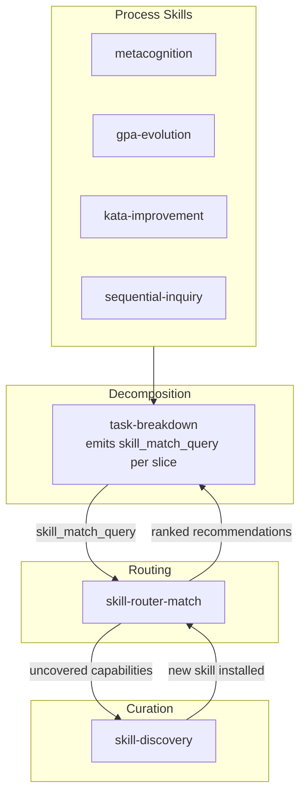

# Skill Router

Route tasks to installed skills. Given a task/slice description and the installed skill catalog, return ranked skill recommendations with fit scores, applicable templates, and invocation hints. Identifies uncovered capabilities (gap signals for skill-discovery). Primary integration: task-breakdown emits skill_match_query per slice, skill-router consumes them. Process skills inherit routing through task-breakdown.

## When to Use

- After task-breakdown produces slices — match each slice's `skill_match_query` to installed skills for execution guidance.
- When a process skill (metacognition, kata-improvement, sequential-inquiry) identifies a specific obstacle and needs to know which skill addresses it.
- When you need a ranked, scored recommendation of which skills to activate for a given task — not a single best-guess.
- When you want to detect that no installed skill covers a task (gap signal → skill-discovery).

## Instructions

### skill-router-match

1. Parse the task description to extract capability requirements — what the task needs to accomplish, what methods it implies.
2. Score each skill in the catalog across three dimensions: capability overlap (0.50 weight), lexicon alignment (0.25 weight), trigger alignment (0.25 weight). Each dimension is 0.0–1.0.
3. Compute composite fit_score = (capability × 0.50) + (lexicon × 0.25) + (trigger × 0.25).
4. Rank skills by fit_score descending. Return at most `max_recommendations` (default 3), only those with fit_score ≥ 0.30.
5. Classify coverage: `full` (≥1 skill at fit ≥ 0.80), `partial` (best fit 0.40–0.79), `none` (best fit < 0.40).
6. If coverage is partial or none, identify uncovered capabilities as gap signals for skill-discovery. Use `coverage` gap type when no skill addresses the capability; use `feature` when a skill partially addresses it.
7. Respond with a JSON object containing `coverage_assessment`, `recommendations`, and `uncovered_capabilities`.
8. Do not skip any skill in the catalog — score every entry, even if it seems irrelevant.
9. Do not recommend skill-router or skill-discovery — they are meta-skills, not task-execution skills.

### skill-router-convergence-check

1. Compute a normalized `convergence_metric` in [0,1], where 0 means a full-coverage match was found and 1 means no viable match.
2. Start at 1.0. If coverage is full (fit ≥ 0.80), metric ≤ 0.1. If partial and improving, metric in [0.3, 0.6]. If none and not improving, metric ≥ 0.7.
3. Clamp to [0,1].
4. If iterations are exhausted (≥ max_iterations) and coverage is still partial/none, the caller should hand uncovered_capabilities to skill-discovery rather than continuing to iterate.
5. Return a JSON object containing `convergence_metric`, `convergence_method`, `rationale`, `blockers`, and `remaining_gap`.

## Integration Architecture

**Layering rules:**
- Process skills (metacognition, gpa-evolution, kata-improvement, sequential-inquiry) call `task-breakdown` to decompose. They do not call `skill-router` directly unless they need ad-hoc skill guidance for a specific obstacle.
- `task-breakdown-decompose` emits `skill_match_query` per slice — a natural-language capability description. It does not do routing internally (keeps decomposition focused).
- `skill-router-match` consumes queries + catalog → ranked recommendations + uncovered capabilities.
- Uncovered capabilities feed `skill-discovery` as gap signals (coverage/feature gaps).
- `skill-discovery` installs new skills → the catalog grows → future `skill-router` calls have better coverage.

**Orchestrator responsibility — building skill_catalog:**
The `skill_catalog` input array is built by the orchestrator (agent runtime), not by any template. Each entry should contain: `name`, `description`, `template_type`, `lexicon_terms` (extracted from `registry/templates/*/manifest.yaml`), and `when_to_use` (extracted from the "## When to Use" section of each skill's `SKILL.md`). The `when_to_use` field is not a structured manifest field — it is prose extracted from the SKILL.md companion. This avoids a schema migration across 50+ manifests while giving skill-router the trigger-condition text it needs for the trigger-alignment scoring dimension.

**Distinct from skill-discovery:**
- `skill-router` matches tasks to EXISTING skills (routing).
- `skill-discovery` acquires NEW skills (curation: gap → search → evaluate → install).
- They compose: router finds gaps → discovery fills them → router has better coverage next time.

## Registry Templates

| Template | Type | Purpose |
|----------|------|---------|
| `skill-router-match.j2` | KnowAct | Match a task against the installed skill catalog. Score each skill 0.0–1.0 on capability overlap (0.50), lexicon alignment (0.25), and trigger alignment (0.25). Return top-N ranked recommendations with fit scores, match reasons, applicable templates, and invocation hints. Identify uncovered capabilities as gap signals for skill-discovery. |
| `skill-router-convergence-check.j2` | KnowAct | Compute normalized convergence metric for iterative skill routing refinement. 0.0 = full-coverage match found; 1.0 = no viable match. Used when match returns partial/none coverage and the caller refines and re-invokes. |

## Constraints

- Visibility is Public across all templates.
- Energy cap: 4096 for skill-router-match; 2048 for convergence-check.
- Do not recommend skill-router or skill-discovery as task-execution matches — they are meta-skills.
- Only recommend skills with fit_score ≥ 0.30.
- If coverage is "full", uncovered_capabilities must be empty.
- If coverage is "none", uncovered_capabilities must be non-empty.
- Do not execute arbitrary Python code in Jinja2 expressions (sandboxed execution).
- Registry is authoritative — when this SKILL.md disagrees with registry templates, the registry wins.