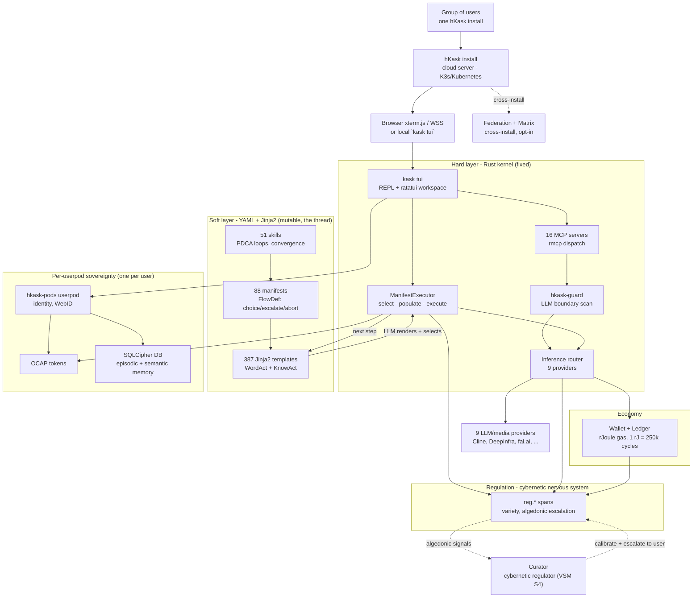

<p align="center">
  
</p>

# ℏKask - A Minimal Viable Container for Users and AI Tools

**Binary:** `kask` - **Crate prefix:** `hkask-` - **Version:** v0.31.0 - **License:** MIT

> A single hKask install deploys on a cloud server (Kubernetes / K3s) and
> serves a group of users. Each user gets exactly one userpod - a sovereign
> container with their own identity, memory, capabilities, and consent
> boundary - plus AI skills, 16 MCP servers, and multi-provider LLM access.
> Userpods, federation, and Matrix transport are the container's plumbing,
> not the point.[^arch-master]

---

## What hKask Is

hKask is a **minimal viable container for users and AI tools**. A single install
deploys on a cloud server (Kubernetes / K3s) and serves a group of users - each
one gets exactly **one userpod**: their own sovereign identity, encrypted memory,
capabilities, and consent boundary within the shared install. The deployment
unit is the install; the sovereignty unit is the userpod (1:1 per user).

It is not an agent platform or an agent framework. There is no autonomous
agent loop by default; the human is in the loop and skills escalate *to the
user*, not away from them. The Curator is the system's cybernetic regulator,
not an autonomous agent.

Three things sit between the user and a model:

1. **Skills** — 51 iterative PDCA loops (`.agents/skills/`) that compose
   Jinja2 templates into Plan-Do-Check-Act cycles with convergence thresholds,
   gas budgets, and escalation. Where other systems give you a prompt, hKask
   gives you a *process*.[^skills-model]
2. **MCP servers** — 16 built-in Model Context Protocol servers (research,
   memory, codegraph, media, filesystem, regulation, …) exposed as tools
   through `rmcp`.[^mcp]
3. **Inference routing** — one router across 9 providers (Cline, DeepInfra,
   fal.ai, KiloCode, Ollama, OpenAI, OpenRouter, Runpod, Together), with
   fusion, circuit breakers, and per-call gas accounting.

Everything else in the codebase - pods, federation, Matrix, wallet, ledger,
regulation, keystore - exists to keep each user's session **sovereign** within
the shared install: per-userpod SQLCipher, OCAP dual gate, visibility gating.
An install has two roles, **Admin** and **Member** (invite flow, `hkask-identity`),
but sovereignty is enforced below the role layer - the group install shares
infrastructure, never userpod data.

### What hKask Is Not

- Not an agent framework. There is no autonomous agent loop by default; the
  human is in the loop and skills escalate *to the user*, not away from them.
- Not a public multi-tenant SaaS. An install serves a defined group (an
  organization, a team, a household) via OAuth + invite, not arbitrary public
  sign-up. Per-userpod sovereignty is structural, not row-level.
- Not a single-user local-only tool. Local `kask tui` is supported, but the
  reference deployment is a cloud server accessed via browser (xterm.js + WSS)
  or Matrix. Federation links installs.

---

## Architecture Overview



<!-- DIAGRAM_ALIGNMENT
id: DIAG-README-001
verified_date: 2026-07-21
verified_against: Cargo.toml (workspace members); crates/hkask-cli/src/cli/mod.rs (Commands enum); crates/hkask-inference/src/ (9 backends); registry/templates/ (88 manifests, 387 .j2); .agents/skills/ (51); mcp-servers/ (16)
status: VERIFIED
-->

---

## Five Anchors

| # | Anchor | Implementation |
|---|--------|----------------|
| 1 | **Human sovereignty** | OCAP capability tokens, SQLCipher-at-rest, OS keychain, private/public gating — Magna Carta P1–P4[^magna-carta] |
| 2 | **Skills & composition** | 51 PDCA skill loops compose 88 registry manifests + 387 Jinja2 templates into iterative cycles — the soft layer that offloads selection intelligence to the LLM[^skills-model] |
| 3 | **Tools** | 16 MCP servers + inference router over 9 LLM/media providers[^mcp] |
| 4 | **Regulation** | `reg.*` span registry, variety counters, algedonic escalation — the cybernetic nervous system[^regulation] |
| 5 | **Economy** | rJoule gas accounting (1 rJ = 250 000 gas cycles), double-entry ledger, per-call circuit breakers |

---

## The Skills Model — WordAct / FlowDef / KnowAct

hKask distinguishes two layers that other systems conflate:

- **Templates** (387 Jinja2 `.j2`) — one-shot prompt executions. What Claude,
  ChatGPT, and most agent platforms call "skills." In hKask these are raw
  material: render once, return output, exit. Critically, **selection
  intelligence lives in the templates and the LLM, not in Rust** (P3 Generative
  Space) — the Rust kernel is a fixed loom; the Jinja2/YAML is the mutable thread
  that directs platform functions and absorbs complexity that would otherwise
  bloat the binary.
- **Skills** (51 PDCA loops) — iterative cycles that compose templates into
  search, learning, and implementation loops. A skill has a `manifest.yaml`
  with `convergence.threshold > 0`, a `gas.cap`, and a `loop` action. It runs
  until it converges on a quality threshold, exhausts its energy budget, or
  escalates to the user.

The tripartite template type system mirrors human cognition:[^skills-model]

| Type | Format | Governs |
|------|--------|---------|
| **WordAct** | Jinja2 `.j2` | "What to say" — system prompts, personas, performative utterances |
| **FlowDef** | YAML `.yaml` | "What to do" — `select → populate → execute` cascade, choice/escalate/abort/delegate verbs |
| **KnowAct** | Jinja2 `.j2` | "How to think" — classification, reflection, calibration |

| Layer | Format | Count | Behavior |
|-------|--------|-------|----------|
| Templates | `*.j2` (Jinja2) | 387 | One-shot: render → return output. Selection intelligence lives here, not in Rust (P3 Generative Space) |
| Skill manifests | `manifest.yaml` | 88 | FlowDef contracts, convergence, gas budget |
| Skills | `.agents/skills/` | 51 | PDCA loops: compose → iterate → converge \| max_out \| escalate |

The canonical source of truth for every skill is its **registry crate**
(`registry/templates/<name>/manifest.yaml` + `*.j2`). The `SKILL.md` file in
`.agents/skills/` is a generated companion for the Zed coding agent, not a
co-equal artifact.[^skills-model]

---

## Crate Structure

53 core crates + 16 MCP servers = 69 workspace members (excluding fuzz).

### Foundation
| Crate | Purpose |
|-------|--------|
| `hkask-types` | ID types, regulation-record, vocabulary, visibility, Regulation spans |
| `hkask-storage-core` | Storage foundation — `Database`, `Store` trait, locks, path sanitization |
| `hkask-storage` | SQLite + SQLCipher, triples, embeddings, blobs |
| `hkask-database` | Provider-agnostic database driver (SQLite, PostgreSQL) |
| `hkask-memory` | Semantic / episodic pipelines (consolidation: episodic → semantic) |
| `hkask-regulation` | Cybernetic nervous system — `reg.*` spans, loops, variety |
| `hkask-templates` | Registry, vocabulary, cascade, resolver |
| `hkask-pods` | Pod identity, WebID, bot/userpod, Curator persona |
| `hkask-keystore` | OS keychain, AES-256-GCM |
| `hkask-mcp` | MCP runtime, dispatch, security |
| `hkask-capability` | OCAP delegation tokens |
| `hkask-ports` | Hexagonal port traits |
| `hkask-cli` | CLI — 22 subcommands + REPL host |
| `hkask-api` | HTTP API, utoipa OpenAPI |

### Infrastructure
| Crate | Purpose |
|-------|--------|
| `hkask-inference` | Inference router — 9 provider backends, fusion, circuit breakers, fal.ai workflow DAGs |
| `hkask-communication` | Matrix transport, agent registry, 7R7 listener |
| `hkask-condenser` | Context condensation engine |
| `hkask-codegraph` | Native code understanding (tree-sitter, FTS5, recursive CTE, context assembly) |
| `hkask-acp` | Agent Client Protocol — IDE integration |
| `hkask-adapter` | Trained adapter lifecycle — store, expertise, endpoint, provider cost model |
| `hkask-guard` | Content safety — mandatory LLM boundary scanning, OWASP LLM Top 10 aligned |
| `hkask-repl` | Interactive REPL — slash commands, tab completion, fuzzy matching |
| `hkask-forecast` | Superforecasting engine (Fermi decomposition, Bayesian update, Brier scoring) |
| `hkask-storage-guard` | Autonomous disk-space loop — monitors `/data`, prunes old exports |
| `hkask-git-cas` | Git content-addressable storage (BLAKE3 object store) |
| `hkask-goal` | Goal specification and completion verification |
| `hkask-identity` | Human identity & access control (`HumanUser`, OAuth, roles) |
| `hkask-test-harness` | Test infrastructure (`TestDb`, `TestWebId`, mocks, strategies) |
| `hkask-mcp-cloud-gateway` | Cloud MCP gateway for remote tool dispatch |
| `hkask-tui` | Terminal UI (ratatui-based interactive workspace) |

### Services
| Crate | Purpose |
|-------|--------|
| `hkask-services-core` | Service-layer foundation — `ServiceError`, `ServiceConfig`, `HkaskSettings` |
| `hkask-services-context` | `AgentService` context, Regulation runtime, cybernetic loops |
| `hkask-services-runtime` | Runtime services — text classification, provider intelligence, daemon |
| `hkask-services-chat` | Chat session management and history |
| `hkask-services-compose` | Style composition — exemplar retrieval, prose generation, centroid-distance voice validation |
| `hkask-services-corpus` | Document corpus management and indexing |
| `hkask-services-inference` | Inference provider intelligence and dispatch |
| `hkask-services-kata-kanban` | Toyota Kata coaching/improvement + Kanban coordination |
| `hkask-services-onboarding` | First-run and user onboarding |
| `hkask-services-research` | Research pipeline (web search, extraction, feed management) |
| `hkask-services-self-heal` | Autonomous self-healing loop |
| `hkask-services-skill` | Skill discovery, publishing, hashing, auditing, bundle composition |
| `hkask-services-verification` | Magna Carta verification — manifest-driven structural audits |
| `hkask-services-wallet` | Gas budgeting, price feeds, Regulation integration |

### Wallet, Identity & Ledger
| Crate | Purpose |
|-------|--------|
| `hkask-wallet` | rJoule wallet — self-custody deposits, API key issuance |
| `hkask-wallet-types` | Wallet value types and data structures |
| `hkask-ledger` | Double-entry accounting ledger (cost, crypto, securities) |

### Ontology & Interface
| Crate | Purpose |
|-------|--------|
| `hkask-federation` | Cross-instance federation protocol (opt-in) |

### Ontology Bridges
| Crate | Purpose |
|-------|--------|
| `hkask-bridge-dublincore` | Dublin Core + BIBO + CiTO (bibliographic metadata, citations) |
| `hkask-bridge-eso` | Epistemic Science Ontology (hypotheses, evidence, falsification) |
| `hkask-bridge-fibo` | Financial Industry Business Ontology (valuation, capital, risk) |
| `hkask-bridge-golem` | GOLEM narrative/literary ontology (characters, themes, devices) |
| `hkask-bridge-pko` | Procedural Knowledge Ontology (procedures, steps, executions, feedback) |

### MCP Servers (16)
`hkask-mcp-codegraph` · `hkask-mcp-communication` · `hkask-mcp-companies` ·
`hkask-mcp-condenser` · `hkask-mcp-curator` · `hkask-mcp-docproc` ·
`hkask-mcp-filesystem` · `hkask-mcp-kata-kanban` · `hkask-mcp-media` ·
`hkask-mcp-memory` · `hkask-mcp-regulation` · `hkask-mcp-replica` ·
`hkask-mcp-research` · `hkask-mcp-scenarios` · `hkask-mcp-skill` ·
`hkask-mcp-training`

---

## Current Metrics

| Metric | Value |
|--------|-------|
| Core crates | 53 |
| MCP servers | 16 |
| Workspace members (excl. fuzz) | 69 |
| Skills | 51 PDCA loops (88 registry manifests, 387 Jinja2 templates) |
| Jinja2 templates | 387 (WordAct + KnowAct; selection intelligence offloaded to the LLM) |
| Skill manifests | 88 (FlowDef: select - populate - execute, convergence, gas budget) |
| CLI subcommands | 22 (`kask tui` is the primary entry point) |
| Inference providers | 9 (Cline, DeepInfra, fal.ai, KiloCode, Ollama, OpenAI, OpenRouter, Runpod, Together) |
| Codegraph MCP tools | 11 (query, traverse, impact, analysis, context, structure, stats, reindex, feedback, embed, dead_code) |
| QA pipeline | Fuzz triage, mutation analysis, autonomous script runner |
| Build / clippy / fmt / test / unused-deps | All passing |

---

## Commands

The primary entry point is `kask tui`, which embeds the REPL inside a ratatui
workspace. `kask serve` exposes the HTTP API; `kask daemon` runs the Unix-socket
auth + Regulation monitor. The remaining subcommands are administrative
(`pod`, `mcp`, `sovereignty`, `git`, `backup`, `federation`, `token`,
`userpod`, `keystore`, `skill`, `doctor`, `onboard`, `settings`, `init`,
`export`, `wallet`, `matrix`, `repair`, `deploy`).

```bash
# Verification
cargo check --workspace
cargo test --workspace
cargo clippy --workspace --all-targets -- -D warnings
cargo fmt --check

# Dependency hygiene (nightly)
RUSTFLAGS="-D unused_crate_dependencies" cargo +nightly check --workspace

# Documentation health
bash docs/ci/verify-docs.sh
bash docs/ci/check-links.sh
```

---

## Documentation

hKask follows the [Diataxis](https://diataxis.fr/) documentation methodology —
tutorials, how-to guides, reference, and explanation.[^diataxis] The portal at
[`docs/README.md`](docs/README.md) is the canonical entry point.

| Path | Contents |
|------|----------|
| [`AGENTS.md`](AGENTS.md) | Agent operating guide — capability catalog, tooling policy, prohibitions |
| [`docs/README.md`](docs/README.md) | Documentation portal (Diataxis index) |
| [`docs/how-to/`](docs/how-to/) | Task-oriented guides: install, configure, bootstrap MCP, invoke skills, audit sovereignty |
| [`docs/reference/`](docs/reference/) | API reference, skill registry, Regulation span registry, Magna Carta |
| [`docs/explanation/`](docs/explanation/) | Architecture decisions: hexagonal ports, Regulation loop, OCAP dispatch |
| [`docs/architecture/`](docs/architecture/) | ADRs, master architecture, provider/federation/database architecture |
| [`docs/specifications/DOCUMENTATION_STANDARDS.md`](docs/specifications/DOCUMENTATION_STANDARDS.md) | Documentation standards — metadata, citations, diagrams, lifecycle |
| [`.github/workflows/ci.yml`](.github/workflows/ci.yml) | CI pipeline (fmt → clippy + unused-deps + build → test + doc → invariants) |
| [`.github/workflows/audit.yml`](.github/workflows/audit.yml) | Weekly dependency audit (cargo-deny + cargo-audit) |

---

## Design Philosophy

**As simple as possible, but no simpler.**

- **No silent draws on reserve** — every change cited.
- **No hallucinations** — all features traceable to spec.
- **No speculation** — code not needed today is debt.
- **No ceremony** — direct, technical, concise.

**The loom and the thread:**

| Layer | Technology | Mutability |
|-------|------------|------------|
| Hard (kernel) | Rust | Fixed, stable |
| Soft (material) | YAML, Jinja2, Markdown | Mutable, evolving (88 manifests, 387 templates) |

Rust is the loom. YAML/Jinja2 is the thread. The users direct the weaving; the LLM renders the thread into action.

---

## Logo & Brand

The Kask logo synthesizes four elements into a single mark:

| Element | Represents | Visual form |
|---------|-----------|-------------|
| **The Kask (container)** | Typed container, governed surface | Rectangular amphora with handles |
| **Calligraphy (art)** | Human craft, temporal mark | Varied stroke width, pressure-sensitive |
| **Curator's eye (vision)** | Observation, governance, loyalty | Almond eye with iris, pupil, reflection |
| **Bitemporal shadow (perspective)** | Valid-time + transaction-time | Offset shadow, reduced opacity |

> *A simple container, drawn by hand, watching from within, remembering in two times.*

Core principles: recognition < 400 ms · scalable 16 px–16 ft · monochrome-first ·
no gradients/effects. Full design principles →
[`assets/LOGO-DESIGN-PRINCIPLES.md`](assets/LOGO-DESIGN-PRINCIPLES.md).

---

[^arch-master]: `docs/architecture/core/hKask-architecture-master.md` — "Primary user story" (v0.31.0).
[^skills-model]: `docs/architecture/core/hKask-architecture-master.md` § Pattern A — The Skills Model (WordAct / FlowDef / KnowAct).
[^mcp]: [Model Context Protocol specification](https://modelcontextprotocol.io/); runtime via the [`rmcp`](https://crates.io/crates/rmcp) crate.
[^magna-carta]: `docs/reference/magna-carta.md` — four inviolable sovereignty principles (P1–P4).
[^regulation]: `docs/reference/regulation-spans.md` — `reg.*` span catalog and canonical namespaces.
[^diataxis]: [Diátaxis documentation framework](https://diataxis.fr/) by Daniele Procida — four quadrants: tutorials, how-to guides, reference, explanation.

---

*ℏKask - A Minimal Viable Container for Users and AI Tools - v0.31.0*
*Rust is the loom. YAML/Jinja2 is the thread. The userpod is the container.*