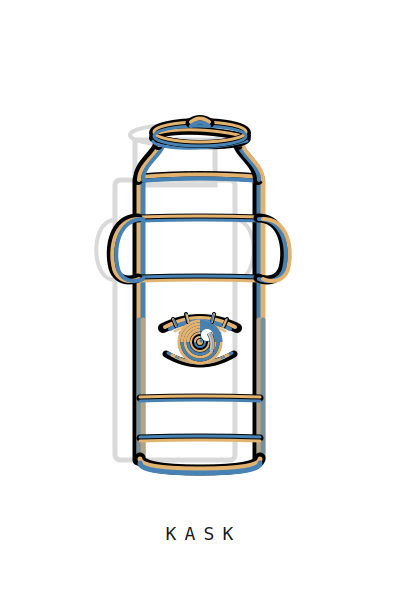

<p align="center">
  
</p>
# ℏKask - A Minimal Viable Container for Agents

**Version:** v0.28.0 | **Status:** Phase 8 complete — Distillation done, operational hardening in progress

---

## Logo & Brand

The Kask logo synthesizes four elements into a single mark:

| Element | Represents | Visual Form |
|---------|-----------|-------------|
| **The Kask (Container)** | Typed container, governed surface | Rectangular amphora with handles |
| **Calligraphy (Art)** | Human craft, temporal mark | Varied stroke width, pressure-sensitive |
| **Curator's Eye (Vision)** | Observation, governance, loyalty | Almond eye with iris, pupil, reflection |
| **Bitemporal Shadow (Perspective)** | Valid-time + transaction-time | Offset shadow, reduced opacity |

> *A simple container, drawn by hand, watching from within, remembering in two times.*

**Core principles:** Recognition <400ms | Scalable 16px–16ft | Monochrome-first | No gradients/effects

Full design principles → [`assets/LOGO-DESIGN-PRINCIPLES.md`](assets/LOGO-DESIGN-PRINCIPLES.md)

---

## Vision

hKask is the minimal viable unit of an agent platform from which a full agent ecosystem can be reconstructed.

**Design Philosophy:** Austere and efficient recombinatorial system. Rust is the loom (fixed logic). YAML/Jinja2 is the thread (mutable content).

---

## Five Anchors

| # | Anchor | Implementation |
|---|--------|----------------|
| 1 | **Agent Enablement** | Bots + Replicants in pods with WebID, ACP |
| 2 | **Essential Tools** | 11 MCP servers + Inference Router (DeepInfra, Together AI, fal.ai, OpenRouter) |
| 3 | **User Sovereignty** | OCAP, SQLCipher, private/public gating |
| 4 | **CNS** | `cns.*` spans, variety counters, algedonic alerts |
| 5 | **Composition** | Unified registry with template_type discriminator |

---

## Crate Structure

### Core (11 crates)
- `hkask-types` — ID types, nu-event, vocabulary, visibility
- `hkask-storage` — SQLite + SQLCipher, triples, embeddings, blobs, Git CAS
- `hkask-memory` — Semantic/episodic pipelines (memory consolidation: episodic → semantic)
- `hkask-cns` — Cybernetic Nervous System
- `hkask-templates` — Registry, vocabulary, cascade, resolver
- `hkask-agents` — Pods, ACP, bot/replicant, Curator
- `hkask-ensemble` — Multi-agent chat
- `hkask-keystore` — OS keychain, AES-256-GCM
- `hkask-mcp` — MCP runtime, dispatch, security
- `hkask-cli` — CLI commands
- `hkask-api` — HTTP API, utoipa OpenAPI

### MCP Servers (11 crates)
- `hkask-mcp-condenser` — Context condensation (thin wrapper around hkask-condenser domain crate)
- `hkask-mcp-research` — Web search, extraction, and feed-based research
- `hkask-mcp-spec` — Specification authoring, curation, and validation
- `hkask-mcp-companies` — Company financial data (FMP + EODHD dual-provider)
- `hkask-mcp-communication` — Thin MCP wrapper over core communication crate
- `hkask-mcp-media` — Media generation (image, video, audio, 3D via fal.ai, Together AI, OpenRouter, and other providers)
- `hkask-mcp-replica` — Authorial style embedding and prose composition
- `hkask-mcp-docproc` — Unified document processing (format conversion, OCR, chunking, parsing, QA generation)
- `hkask-mcp-memory` — Unified episodic + semantic memory with cloud backup
- `hkask-mcp-training` — Model training (QA pairs and training data ingestion for fine-tuning pipelines)
- `hkask-mcp-kanban` — Kanban board coordination

---

## Current Metrics

| Metric | Value |
|--------|-------|
| **Core LOC (Rust)** | ~40,814 |
| **MCP Server LOC (Rust)** | ~4,890 |
| **Test Files** | 36 |
| **Core Crates** | 11 (all complete) |
| **MCP Servers** | 11 (all complete) |
| **Build/Clippy/Fmt** | All passing |

---

## Implementation Roadmap

### Phase 0: Workspace Skeleton ✓
- [x] Virtual workspace at root
- [x] `[workspace.dependencies]` with pinned versions
- [x] Empty crate stubs for all 21 crates
- [x] CI verification: `cargo check`, `test`, `clippy`, `fmt`

### Phase 1: Security Foundation ✓
- [x] `hkask-keystore` — encrypted KV, interactive passphrase
- [x] `hkask-types` — ID types, nu-event, vocabulary enum
- [x] `hkask-storage` — SQLite + SQLCipher + sqlite-vec + BLAKE3 + gix
- [x] `hkask-memory` — semantic/episodic pipelines

### Phase 2: Bot System & A2A ✓
- [x] `hkask-agents` — pod lifecycle, ACP, bot/replicant, OCAP
- [x] `hkask-keystore` — OS keychain, AES-256-GCM

### Phase 3: Templates & Registry ✓
- [x] `hkask-templates` — registry, vocabulary, minijinja, cascade

### Phase 4: Security Hardening & Testing ✓
- [x] Comprehensive security hardening (ADR-022)
- [x] Test coverage across core crates

### Phase 5: CNS & Ensemble Integration ✓
- [x] `hkask-cns` — outcome ingestion, `cns.*` span emission, variety counters
- [x] `hkask-ensemble` — multi-agent chat, confidence escalation

### Phase 6: CLI/API Commands ✓
- [x] `hkask-mcp` — MCP runtime, dispatch, security
- [x] `hkask-api` — axum + utoipa, 12 route groups
- [x] `hkask-cli` — 14 subcommand groups + `/model` slash command

### Phase 7: Documentation Refresh ✓
- [x] DDMVSS-aligned architecture documentation (9/9 categories)
- [x] 94 documents archived, 36 active documents curated

### In Progress
- [x] Context condensation in condenser MCP server (7 tools, 51 tests)
- [ ] Integration tests for inference pipeline
- [ ] `hkask-storage` trait mismatches (goals.rs)

### Upcoming
- [ ] Seed templates (prompt/process/cognition)
- [ ] Curator instantiation
- [ ] Success criterion test (16 items from master spec)

---

## Success Criterion (17 Items)

hKask is "done" when a single user can:

1. Run `kask`, get prompted for passphrase, observe Curator pod start
2. Open `kask chat` and converse with Curator (episodic memory recorded)
3. Use `/model qwen` to fuzzy search models; `/model qwen3:8b` to switch the LLM
4. Observe ≥3 subsystem-curator bots spawn at startup
5. Trigger ensemble session with ≥2 subsystem-curators deliberating
6. Invoke any operation through CLI or HTTP API with identical behavior
7. Invoke any tool from 11 MCP set; observe routing
8. Compose two tools via process template
9. Record episodic memory with confidence
10. Retrieve memory; observe `as-of` query returns historical state
11. Observe another agent cannot read private memory without OCAP delegation
12. Generate embedding via embedding MCP; stored in same SQLite transaction
13. `fork` public template via storage MCP; observe divergent branch
14. Merge two branches; observe structural success + conflict requiring ensemble
15. Attempt to clone private artifact; observe OCAP rejection
16. Observe curator reflect on inference outcomes, propose template revision
17. CNS records change, observes new outcomes

---

## Commands

```bash
# Verification
cargo check
cargo test
cargo clippy -- -D warnings
cargo fmt --check

# Cybernetic unit tests (policy + disturbance + telemetry assertions)
cargo test -p hkask-cns cyber_
cargo test -p hkask-mcp cyber_
```

---

## Cybernetic Unit Tests

hKask now includes a minimal cybernetic test harness (`hkask-cybertest`) for unit-scale control-loop testing.

### Conventions

- Use `*_cybertests.rs` for cybernetic test files.
- Prefix test names with `cyber_` for selective execution.
- Each cybernetic test should define:
  - policy objective,
  - disturbance injected,
  - expected telemetry (`cns.*` spans),
  - adaptation/escalation expectation.

### Local commands

```bash
cargo test -p hkask-cns cyber_
cargo test -p hkask-mcp cyber_
```

---

## Documentation

- `docs/architecture/hKask-architecture-master.md` — Architecture index (v0.28.0)
- `docs/architecture/reference/hKask-erd.md` — Entity relationship diagrams
- `docs/architecture/interface-and-composition.md` — Registry & templating design
- `docs/status/PROJECT_STATUS.md` — Project status (single source of truth)
- `assets/LOGO-DESIGN-PRINCIPLES.md` — Logo design principles
- `AGENTS.md` — Agent operating guide

---

## Hallucinations to Avoid

**Do NOT implement:**
- Bot reputation systems
- Bot swarms / consensus mechanisms
- Cross-machine sync
- Bot marketplace
- Curator customization
- SemVer versioning (Git-only)
- Separate feedback crate (CNS handles all)
- Promotion pipeline (episodic/semantic categorical)
- Escalation primitive
- Visibility type system (OCAP-enforced)
- OCT-H currency
- Fine-tuning (axolotl)
- OpenCode-style condenser
- OpenHands-style condenser
- UCAN for hKask (OCAP-only)
- Three separate registries (unified with `template_type` discriminator)
- Rust-based template selection (selection intelligence in Jinja2/LLM)

---

## Design Philosophy

**As simple as possible, but no simpler.**

- **No silent draws on reserve** — Every change cited
- **No hallucinations** — All features traceable to spec
- **No speculation** — Code not needed today is debt
- **No ceremony** — Direct, technical, concise

**The Loom and the Thread:**

| Layer | Technology | Mutability |
|-------|------------|------------|
| **Hard (Kernel)** | Rust | Fixed, stable |
| **Soft (Material)** | YAML, Jinja2, MD | Mutable, evolving |

---

*ℏKask - A Minimal Viable Container for Agents — v0.28.0*
*Rust is the loom. YAML/Jinja2 is the thread.*
*Distillation complete. Operational hardening in progress.*
