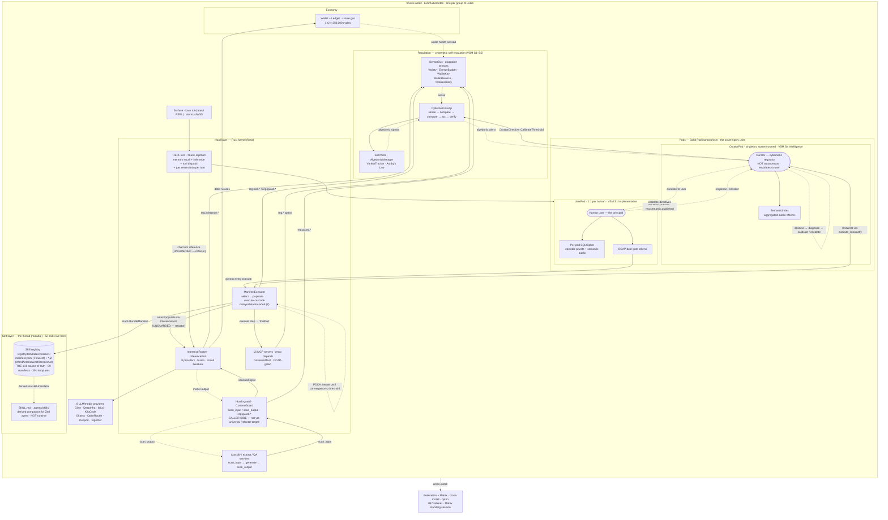

<p align="center">
  
</p>

# ℏKask - A Minimal Viable Container for Users and AI Tools

**Binary:** `kask` - **Crate prefix:** `hkask-` - **Version:** v0.31.0 - **License:** MIT

> A single hKask install deploys on a cloud server (Kubernetes / K3s) and
> serves a group of users. Each user gets exactly one userpod - a sovereign
> container with their own identity, memory, capabilities, and consent
> boundary - plus AI skills, 16 MCP servers, and multi-provider LLM access.
> Userpods, federation, and Matrix transport are the container's plumbing,
> not the point.[^arch-master]

---

## What hKask Is

hKask is a **minimal viable container for users and AI tools**. A single install
deploys on a cloud server (Kubernetes / K3s) and serves a group of users - each
one gets exactly **one userpod**: their own sovereign identity, encrypted memory,
capabilities, and consent boundary within the shared install. The deployment
unit is the install; the sovereignty unit is the userpod (1:1 per user).

It is not an agent platform or an agent framework. There is no autonomous
agent loop by default; the human is in the loop and skills escalate *to the
user*, not away from them. The Curator is the system's cybernetic regulator,
not an autonomous agent.

Three things sit between the user and a model:

1. **Skills** — 51 iterative PDCA loops (`.agents/skills/`) that compose
   Jinja2 templates into Plan-Do-Check-Act cycles with convergence thresholds,
   gas budgets, and escalation. Where other systems give you a prompt, hKask
   gives you a *process*.[^skills-model]
2. **MCP servers** — 16 built-in Model Context Protocol servers (research,
   memory, codegraph, media, filesystem, regulation, …) exposed as tools
   through `rmcp`.[^mcp]
3. **Inference routing** — one router across 8 providers (Cline, DeepInfra,
   fal.ai, KiloCode, Ollama, OpenRouter, Runpod, Together), with
   fusion, circuit breakers, and per-call gas accounting.

Everything else in the codebase - pods, federation, Matrix, wallet, ledger,
regulation, keystore - exists to keep each user's session **sovereign** within
the shared install: per-userpod SQLCipher, OCAP dual gate, visibility gating.
An install has two roles, **Admin** and **Member** (invite flow, `hkask-identity`),
but sovereignty is enforced below the role layer - the group install shares
infrastructure, never userpod data.

### What hKask Is Not

- Not an agent framework. There is no autonomous agent loop by default; the
  human is in the loop and skills escalate *to the user*, not away from them.
- Not a public multi-tenant SaaS. An install serves a defined group (an
  organization, a team, a household) via OAuth + invite, not arbitrary public
  sign-up. Per-userpod sovereignty is structural, not row-level.
- Not a single-user local-only tool. Local `kask tui` is supported, but the
  reference deployment is a cloud server accessed via browser (xterm.js + WSS)
  or Matrix. Federation links installs.

---

## Architecture Overview



<!-- DIAGRAM_ALIGNMENT
id: DIAG-README-001
verified_date: 2026-07-23
verified_against:
  - Cargo.toml (workspace members: 39 crates + 16 MCP = 55)
  - crates/hkask-cli/src/cli/mod.rs (Commands enum: 21 subcommands)
  - crates/hkask-inference/src/config.rs (ProviderId: 8 backends)
  - registry/templates/ (89 manifests, 391 .j2)
  - .agents/skills/ (52)
  - mcp-servers/ (16)
  - crates/hkask-templates/src/executor.rs (ManifestExecutor: InferencePort + ToolPort, execute_manifest / execute_knowact, matryoshka limit 7, PDCA convergence)
  - crates/hkask-templates/src/manifest_loader.rs (resolve_manifest reads BundleManifest from BundleRegistryIndex — skill manifests, not bare templates)
  - crates/hkask-pods/src/pod/deployment.rs (PodDeployment: PodKind::Curator + PodKind::UserPod two-pod architecture, Curator singleton)
  - docs/architecture/core/hKask-architecture-master.md (Pattern A skills=manifests+templates with SKILL.md derived; Pattern B CyberneticsLoop sense→compare→compute→act→verify; Pattern C Curator VSM S4 escalates to user; Pattern D UserPod = sovereignty unit, human is principal)
  - crates/hkask-guard/src/pipeline.rs (scan_input / scan_output at LLM I/O boundaries)
corrections_from_prior_diagram:
  - Pods moved to center; Human + Curator shown INSIDE their pods (UserPod VSM S1, CuratorPod VSM S4) — prior diagram had PerUser as a side subgraph fed by Tui
  - Skills no longer a separate side node: soft layer IS the skill registry (manifest.yaml + *.j2 = source of truth); SKILL.md shown as derived companion only
  - ManifestExecutor now loads BundleManifest from the skill registry and renders template_ref via InferencePort — prior diagram showed Templates→Executor with Skills→Manifests→Templates as a separate chain
  - InferenceRouter shown as cross-cutting (Executor + Curator both invoke it) — prior diagram had it only at the end of an Mcp→Guard→Router chain
  - hkask-guard moved to CALLER-SIDE (invoked by classify/extract/QA services, NOT by the router) and labeled 'not yet universal' — verified InferenceRouter has zero ContentGuard refs; Executor select/populate and REPL chat turn bypass it (refactor signal: GuardedInferencePort decorator)
  - Wallet edges fixed: Router debits rJoules, SensorBus senses wallet health (WalletKeyHealthSensor/WalletBalanceRatioSensor in CyberneticsLoop::build) — prior diagram had Cyber→Wallet (reversed)
  - SensorBus added as the sense mediation layer — spans land in RegulationLedger, sensors read from ledger/budget manager, CyberneticsLoop walks SensorBus (EnergyBudgetSensor, VarietySensor, WalletKeyHealthSensor, WalletBalanceRatioSensor, ToolReliabilitySensor)
  - REPL turn layer (hkask-repl/turn.rs) added between Surface and UserPod — prior diagram jumped Surface→UserPod, hiding the chat turn orchestration
  - Loops now visible: PDCA cascade self-loop on Executor; CyberneticsLoop↔VarietyTracker; Curator metacognition self-loop; Curator↔Human escalation/consent loop — prior diagram had no loops at all
  - Curator elevated to peer pod (CuratorPod, VSM S4) issuing CuratorDirective::CalibrateThreshold — prior diagram had it dangling at the bottom fed only by algedonic signals
  - OCAP shown governing every execute step from the UserPod — prior diagram had a static Executor→Ocap edge
  - Federation node now notes 7R7 listener + Matrix standing session (Pattern C communication layer)
inquiry_method: sequential-inquiry + grill-me (verified each edge against source)
refactor_signals:
  - STRONG: ContentGuard not universal — introduce GuardedInferencePort decorator at InferencePort seam; remove scattered scan_input/scan_output from classify_impl.rs and docproc (6 call sites)
  - LOW: REPL turn orchestration in hkask-repl/src/turn.rs could extract to hkask-services-turn to match hkask-services-* pattern and host the guarded port cleanly
status: VERIFIED
-->

---

## The Architecture — Four Essential Patterns

hKask is governed by **four irreducible patterns** that compose into a single
cybernetic whole. Remove any one and the system collapses into a qualitatively
different — and non-viable — system. The full treatment lives in the
[Architecture Master](docs/architecture/core/hKask-architecture-master.md);
this is the one-page synthesis.[^arch-master]

### Pattern A — Skills Model (WordAct / FlowDef / KnowAct / RenderAct)

A template type system that governs how hKask composes behavior. Where other
systems give you a prompt, hKask gives you a **process**: 52 PDCA skill loops
that iterate until they converge on a quality threshold, exhaust their energy
budget, or escalate to the user. Selection intelligence lives in the Jinja2
templates and the LLM — **not in Rust** (P3 Generative Space). The Rust kernel
is a fixed loom; the YAML/Jinja2 is the mutable thread.

### Pattern B — Regulation Feedback Loop

The autonomic nervous system: every tool call, inference, and memory operation
emits a `reg.*` span. `VarietyTracker` counts behavioral diversity (Ashby's
Law); `AlgedonicManager` fires on deficit; `SetPointCalibrator` self-tunes the
set-points, closing the Conant-Ashby loop. Not passive monitoring — active
regulation.

### Pattern C — Cybernetic Mediation (Curator + 7R7)

The **Curator** is the system's cybernetic mediator (VSM S4 — Intelligence),
**not an autonomous agent**. It observes, assesses, escalates *to the user*, and
tunes Regulation set-points — but it never bypasses OCAP, never acts without
capability tokens, and never removes the human from the loop. Exactly one
Curator per install (singleton invariant). The 7R7 listener is a dumb pipe by
design: transport moves messages; agents decide what they mean.

### Pattern D — Sovereign Identity & Memory (UserPod)

The human user gets a single **userpod** — a sovereign container with its own
identity, encrypted memory, capabilities, and consent boundary. The userpod is
**not an autonomous agent**; it is the user's sovereign surface through which
skills, tools, and inference act under the user's authority and consent.

#### Sovereignty Grounded in the Solid Pod Isomorphism

The userpod is architecturally grounded in the five invariants that define a
W3C **Solid Pod**: (1) WebID-grounded identity, (2) self-contained storage
(per-userpod SQLCipher file), (3) capability-based access control (OCAP dual
gate), (4) interoperable data as linked-data triples (`hMem`), (5) the pod IS
the deployment unit (`PodDeployment` owns its storage, Regulation, and tools).

This isomorphism is the structural guarantee of Magna Carta P1 (User
Sovereignty): an install shares infrastructure, **never userpod data**. Data
isolation is structural (one encrypted database per userpod), not row-level.
Backup is a portable encrypted archive — export from one server, upload to
another. The pod is portable; the user owns it.

### Inference Routing

One `InferenceRouter` across **8 providers** (Cline, DeepInfra, fal.ai,
KiloCode, Ollama, OpenRouter, Runpod, Together). Model names carry a two-letter
prefix (`DI/`, `FA/`, `TG/`, `RP/`, `OR/`, `KC/`, `OM/`, `CL/`) that routes to
the correct backend; unprefixed names use the configured default. Each backend
is gated on configuration (an API key), not reachability — unavailable providers
are silently skipped. **Fusion** orchestrates multi-model deliberation (panel →
synthesis/judge modes) provider-agnostically. Per-provider circuit breakers and
rJoule gas accounting bound every call.

---

## Five Anchors

| # | Anchor | Implementation |
|---|--------|----------------|
| 1 | **User sovereignty** | Solid Pod isomorphism — per-userpod WebID, SQLCipher-at-rest, OCAP dual gate, OS keychain, private/public gating — Magna Carta P1–P4. The install shares infrastructure, never userpod data. |
| 2 | **Skills & composition** | 52 PDCA skill loops compose 89 registry manifests + 391 Jinja2 templates into iterative cycles — the soft layer that offloads selection intelligence to the LLM[^skills-model] |
| 3 | **Tools** | 16 MCP servers + inference router over 8 LLM/media providers with fusion and per-provider circuit breakers[^mcp] |
| 4 | **Regulation** | `reg.*` span registry, variety counters, algedonic escalation — the cybernetic nervous system[^regulation] |
| 5 | **Economy** | rJoule gas accounting (1 rJ = 250 000 gas cycles), double-entry ledger, per-call circuit breakers |

---

## The Skills Model - WordAct / FlowDef / KnowAct / RenderAct

hKask distinguishes two layers that other systems conflate:

- **Templates** (391 Jinja2 `.j2`) — one-shot prompt executions. What Claude,
  ChatGPT, and most agent platforms call "skills." In hKask these are raw
  material: render once, return output, exit. Critically, **selection
  intelligence lives in the templates and the LLM, not in Rust** (P3 Generative
  Space) — the Rust kernel is a fixed loom; the Jinja2/YAML is the mutable thread
  that directs platform functions and absorbs complexity that would otherwise
  bloat the binary.
- **Skills** (52 PDCA loops) — iterative cycles that compose templates into
  search, learning, and implementation loops. A skill has a `manifest.yaml`
  with `convergence.threshold > 0`, a `gas.cap`, and a `loop` action. It runs
  until it converges on a quality threshold, exhausts its energy budget, or
  escalates to the user.

The template type system spans four roles - the cognitive-act triad plus a non-inference render layer:[^skills-model]

| Type | Format | Governs |
|------|--------|---------|
| **WordAct** | Jinja2 `.j2` | "What to say" - system prompts, personas, performative utterances (inference-invoked) |
| **FlowDef** | YAML `.yaml` | "What to do" - `select - populate - execute` cascade, choice/escalate/abort/delegate verbs |
| **KnowAct** | Jinja2 `.j2` | "How to think" - classification, reflection, calibration (inference-invoked) |
| **RenderAct** | Jinja2 `.j2` | "What to render" - non-inference content: macro libraries, error views, reference material. Never sent to the LLM; loaded for rendering/reference only |

| Layer | Format | Count | Behavior |
|-------|--------|-------|----------|
| Templates | `*.j2` (Jinja2) | 391 | One-shot: render → return output. Selection intelligence lives here, not in Rust (P3 Generative Space) |
| Skill manifests | `manifest.yaml` | 89 | FlowDef contracts, convergence, gas budget |
| Skills | `.agents/skills/` | 52 | PDCA loops: compose → iterate → converge \| max_out \| escalate |

> The canonical source of truth for every skill is its **registry crate**
> (`registry/templates/<name>/manifest.yaml` + `*.j2`). The `SKILL.md` file in
> `.agents/skills/` is a generated companion for the Zed coding agent, not a
> co-equal artifact.[^skills-model]

---

## Crate Structure

39 core crates + 16 MCP servers = 55 workspace members (excluding fuzz).

### Foundation
| Crate | Purpose |
|-------|--------|
| `hkask-types` | ID types, regulation-record, vocabulary, visibility, Regulation spans |
| `hkask-storage` | SQLite + SQLCipher, triples, embeddings, blobs (`Store` trait, locks, path sanitization) |
| `hkask-memory` | Semantic / episodic pipelines (consolidation: episodic → semantic) |
| `hkask-regulation` | Cybernetic nervous system — `reg.*` spans, loops, variety |
| `hkask-templates` | Registry, vocabulary, cascade, resolver |
| `hkask-pods` | Pod identity, WebID, bot/userpod, Curator persona, `PodDeployment` |
| `hkask-keystore` | OS keychain, AES-256-GCM |
| `hkask-mcp` | MCP runtime, dispatch, security |
| `hkask-mcp-server` | MCP server framework + shared utilities for the 16 servers |
| `hkask-capability` | OCAP delegation tokens |
| `hkask-cli` | CLI — 21 subcommands + REPL host |
| `hkask-api` | HTTP API, utoipa OpenAPI |

### Infrastructure
| Crate | Purpose |
|-------|--------|
| `hkask-inference` | Inference router — 8 provider backends, 2-letter prefix routing, fusion, per-provider circuit breakers, fal.ai workflow DAGs, dynamic model discovery |
| `hkask-communication` | Matrix transport, agent registry, 7R7 listener |
| `hkask-condenser` | Context condensation engine |
| `hkask-acp` | Agent Client Protocol — IDE integration |
| `hkask-guard` | Content safety — mandatory LLM boundary scanning, OWASP LLM Top 10 aligned |
| `hkask-repl` | Interactive REPL — slash commands, tab completion, fuzzy matching, TUI module (feature-gated) |
| `hkask-forecast` | Superforecasting engine (Fermi decomposition, Bayesian update, Brier scoring) |
| `hkask-git-cas` | Git content-addressable storage (BLAKE3 object store) |
| `hkask-goal` | Goal specification and completion verification |
| `hkask-identity` | Human identity & access control (`HumanUser`, OAuth, roles) |
| `hkask-test-harness` | Test infrastructure (`TestDb`, `TestWebId`, mocks, strategies) |
| `hkask-mcp-cloud-gateway` | Cloud MCP gateway for remote tool dispatch |


### Services
| Crate | Purpose |
|-------|--------|
| `hkask-services-core` | Service-layer foundation — `ServiceError`, `ServiceConfig`, `HkaskSettings` |
| `hkask-services-context` | `AgentService` context, Regulation runtime, cybernetic loops, storage guard |
| `hkask-services-runtime` | Runtime services — text classification, provider intelligence, daemon |
| `hkask-services-chat` | Chat session management and history |
| `hkask-services-compose` | Style composition — exemplar retrieval, prose generation, centroid-distance voice validation |
| `hkask-services-corpus` | Document corpus management and indexing |
| `hkask-services-inference` | Inference provider intelligence and dispatch |
| `hkask-services-kata-kanban` | Toyota Kata coaching/improvement + Kanban coordination |
| `hkask-services-onboarding` | First-run and user onboarding |
| `hkask-services-self-heal` | Autonomous self-healing loop |
| `hkask-services-skill` | Skill discovery, publishing, hashing, auditing, bundle composition |
| `hkask-services-wallet` | Gas budgeting, price feeds, Regulation integration |

### Wallet, Identity & Ledger
| Crate | Purpose |
|-------|--------|
| `hkask-wallet` | rJoule wallet — self-custody deposits, API key issuance |
| `hkask-ledger` | Double-entry accounting ledger (cost, crypto, securities) |

### Ontology Bridges
| Crate | Purpose |
|-------|--------|
| `hkask-bridge-dublincore` | Dublin Core + BIBO + CiTO (bibliographic metadata, citations) |

### MCP Servers (16)
`hkask-mcp-codegraph` · `hkask-mcp-communication` · `hkask-mcp-companies` ·
`hkask-mcp-condenser` · `hkask-mcp-curator` · `hkask-mcp-docproc` ·
`hkask-mcp-filesystem` · `hkask-mcp-kata-kanban` · `hkask-mcp-media` ·
`hkask-mcp-memory` · `hkask-mcp-regulation` · `hkask-mcp-replica` ·
`hkask-mcp-research` · `hkask-mcp-scenarios` · `hkask-mcp-skill` ·
`hkask-mcp-training`

---

## Current Metrics

| Metric | Value |
|--------|-------|
| Core crates | 39 |
| MCP servers | 16 |
| Workspace members (excl. fuzz) | 55 |
| Skills | 52 PDCA loops (89 registry manifests, 391 Jinja2 templates) |
| Jinja2 templates | 391 (WordAct + KnowAct + RenderAct; selection intelligence offloaded to the LLM) |
| Skill manifests | 89 (FlowDef: select - populate - execute, convergence, gas budget) |
| CLI subcommands | 21 (`kask tui` is the primary entry point) |
| Inference providers | 8 (Cline, DeepInfra, fal.ai, KiloCode, Ollama, OpenRouter, Runpod, Together) |
| Codegraph MCP tools | 11 (query, traverse, impact, analysis, context, structure, stats, reindex, feedback, embed, dead_code) |
| QA pipeline | Fuzz triage, mutation analysis, autonomous script runner |
| Build / clippy / fmt / test / unused-deps | All passing |

---

## Commands

The primary entry point is `kask tui`, which embeds the REPL inside a ratatui
workspace. `kask serve` exposes the HTTP API; `kask daemon` runs the Unix-socket
auth + Regulation monitor. The remaining subcommands are administrative
(`pod`, `mcp`, `sovereignty`, `git`, `backup`, `token`, `userpod`, `keystore`,
`skill`, `doctor`, `onboard`, `settings`, `init`, `export`, `wallet`, `matrix`,
`repair`, `deploy`).

```bash
# Verification
cargo check --workspace
cargo test --workspace
cargo clippy --workspace --all-targets -- -D warnings
cargo fmt --check

# Dependency hygiene (nightly)
RUSTFLAGS="-D unused_crate_dependencies" cargo +nightly check --workspace

# Documentation health
bash docs/ci/verify-docs.sh
bash docs/ci/check-links.sh
```

---

## Documentation

hKask follows the [Diataxis](https://diataxis.fr/) documentation methodology —
tutorials, how-to guides, reference, and explanation.[^diataxis] The portal at
[`docs/README.md`](docs/README.md) is the canonical entry point.

| Path | Contents |
|------|----------|
| [`AGENTS.md`](AGENTS.md) | Agent operating guide — capability catalog, tooling policy, prohibitions |
| [`docs/README.md`](docs/README.md) | Documentation portal (Diataxis index) |
| [`docs/how-to/`](docs/how-to/) | Task-oriented guides: install, configure, bootstrap MCP, invoke skills, audit sovereignty |
| [`docs/reference/`](docs/reference/) | API reference, skill registry, Regulation span registry, Magna Carta |
| [`docs/explanation/`](docs/explanation/) | Architecture decisions: hexagonal ports, Regulation loop, OCAP dispatch |
| [`docs/architecture/`](docs/architecture/) | ADRs, master architecture, provider/federation/database architecture |
| [`docs/specifications/DOCUMENTATION_STANDARDS.md`](docs/specifications/DOCUMENTATION_STANDARDS.md) | Documentation standards — metadata, citations, diagrams, lifecycle |
| [`.github/workflows/ci.yml`](.github/workflows/ci.yml) | CI pipeline (fmt → clippy + unused-deps + build → test + doc → invariants) |
| [`.github/workflows/audit.yml`](.github/workflows/audit.yml) | Weekly dependency audit (cargo-deny + cargo-audit) |

---

## Design Philosophy

**As simple as possible, but no simpler.**

- **No silent draws on reserve** — every change cited.
- **No hallucinations** — all features traceable to spec.
- **No speculation** — code not needed today is debt.
- **No ceremony** — direct, technical, concise.

**The loom and the thread:**

| Layer | Technology | Mutability |
|-------|------------|------------|
| Hard (kernel) | Rust | Fixed, stable |
| Soft (material) | YAML, Jinja2, Markdown | Mutable, evolving (89 manifests, 391 templates) |

Rust is the loom. YAML/Jinja2 is the thread. The users direct the weaving; the LLM renders the thread into action.

---

## Logo & Brand

The Kask logo synthesizes four elements into a single mark:

| Element | Represents | Visual form |
|---------|-----------|-------------|
| **The Kask (container)** | Typed container, governed surface | Rectangular amphora with handles |
| **Calligraphy (art)** | Human craft, temporal mark | Varied stroke width, pressure-sensitive |
| **Curator's eye (vision)** | Observation, governance, loyalty | Almond eye with iris, pupil, reflection |
| **Bitemporal shadow (perspective)** | Valid-time + transaction-time | Offset shadow, reduced opacity |

> *A simple container, drawn by hand, watching from within, remembering in two times.*

Core principles: recognition < 400 ms · scalable 16 px–16 ft · monochrome-first ·
no gradients/effects. Full design principles →
[`assets/LOGO-DESIGN-PRINCIPLES.md`](assets/LOGO-DESIGN-PRINCIPLES.md).

---

[^arch-master]: `docs/architecture/core/hKask-architecture-master.md` — "Primary user story" and "The Four Essential Patterns" (v0.31.0). The one-page synthesis is in [§ The Architecture — Four Essential Patterns](#the-architecture--four-essential-patterns) above.
[^skills-model]: `docs/architecture/core/hKask-architecture-master.md` § Pattern A - The Skills Model (WordAct / FlowDef / KnowAct / RenderAct; RenderAct is the non-inference render layer).
[^mcp]: [Model Context Protocol specification](https://modelcontextprotocol.io/); runtime via the [`rmcp`](https://crates.io/crates/rmcp) crate.
[^magna-carta]: `docs/reference/magna-carta.md` — four inviolable sovereignty principles (P1–P4).
[^regulation]: `docs/reference/regulation-spans.md` — `reg.*` span catalog and canonical namespaces.
[^diataxis]: [Diátaxis documentation framework](https://diataxis.fr/) by Daniele Procida — four quadrants: tutorials, how-to guides, reference, explanation.

---

*ℏKask - A Minimal Viable Container for Users and AI Tools - v0.31.0*
*Rust is the loom. YAML/Jinja2 is the thread. The userpod is the container.*