# hKask Documentation Portal

**Purpose:** Single entry point indexing every active document in `docs/`, tagged by [MDS](architecture/core/MDS.md) category. hKask v0.31.0 - a minimal viable container for users and AI tools: one install serves a group of users, each with a sovereign userpod, AI skills, MCP servers, and LLM access.

### Diataxis Structure

Documentation is organized by [Diataxis](https://diataxis.fr/) quadrants — tutorials, how-to guides, reference, and explanation — supplemented by architecture, specifications, and the diagram verification registry.

```mermaid
flowchart TD
    Root["docs/<br/>Documentation Portal"]

    Root --> HowTo["how-to/<br/>Task-oriented guides"]
    Root --> Reference["reference/<br/>Neutral, descriptive"]
    Root --> Explanation["explanation/<br/>Background, reasoning"]
    Root --> Architecture["architecture/<br/>ADRs + master spec"]
    Root --> Specifications["specifications/<br/>Standards + specs"]
    Root --> Status["status/<br/>Point-in-time reports"]
    Root --> Plans["plans/<br/>Forward-looking designs"]
    Root --> Research["research/<br/>Source material"]
    Root --> Generated["generated/<br/>Auto-generated docs"]
    Root --> CI["ci/<br/>Verification scripts"]

    HowTo --> HowToGS["getting-started.md<br/>End-to-end tutorial"]
    HowTo --> HowToGuides["7 guides<br/>install, skills, training..."]

    Reference --> RefAPI["api-reference.md<br/>54 crates catalogued"]
    Reference --> RefReg["regulation-spans.md<br/>Span registry"]
    Reference --> RefMC["magna-carta.md<br/>P1-P4 principles"]
    Reference --> RefMCP["mcp-servers/<br/>16 MCP servers"]
    Reference --> RefSkills["skills/<br/>Skills registry"]

    Explanation --> ExplArch["architecture-patterns.md<br/>Hexagonal ports, VSM"]
    Explanation --> ExplReg["regulation-and-loops.md<br/>Homeostatic regulation"]
    Explanation --> ExplSov["sovereignty-and-ocap.md<br/>OCAP dispatch"]
    Explanation --> ExplFed["federation-and-transport.md<br/>Federation protocol"]
    Explanation --> ExplEnergy["energy-and-economy.md<br/>Gas + ledger system"]
    Explanation --> ExplCog["cognition-and-replica.md<br/>Memory + forecasting"]

    Architecture --> ArchCore["core/<br/>Master spec + MDS + principles"]
    Architecture --> ArchADRs["ADRs/<br/>24 decision records"]
    ArchCore --> ArchMaster["hKask-architecture-master.md<br/>Authoritative index"]

    Specifications --> SpecDocs["DOCUMENTATION_STANDARDS.md<br/>This document's rules"]
    Specifications --> SpecReq["REQUIREMENTS.md<br/>Goal specs"]
    Specifications --> SpecREPL["REPL-specification.md"]
    Specifications --> SpecWallet["wallet-specification.md"]
    Specifications --> SpecSalience["salience-specification.md"]

    Status --> StatusProj["PROJECT_STATUS.md<br/>Build + test health"]
    Status --> StatusReports["Point-in-time audits<br/>and inventories"]

    Generated --> GenCLI["cli-reference.md<br/>kask --help output"]
    Generated --> GenOpenAPI["openapi.json<br/>HTTP API spec"]

    CI --> CIVerify["verify-docs.sh<br/>10-step health check"]
    CI --> CILinks["check-links.sh<br/>Hyperlink integrity"]
    CI --> CICitations["check-citations.sh<br/>PS-07 compliance"]
```



<!-- DIAGRAM_ALIGNMENT
id: DIAG-DOC-001
verified_date: 2026-07-21
verified_against: docs/README.md; docs/specifications/DOCUMENTATION_STANDARDS.md; docs/ directory listing (16 MCP servers, 24 ADRs, 7 how-to guides)
status: VERIFIED
-->

> **Lifecycle:** Retired documents are removed; git history preserves all versions.
>
> **Diagram policy:** Per `DOCUMENTATION_STANDARDS.md` §1, Mermaid diagrams are inline in the documents they describe. The `docs/diagrams/` directory is now empty — all standalone diagrams have been inlined or deleted as duplicates. See [`DIAGRAMS_INDEX.md`](DIAGRAMS_INDEX.md) for the verification registry.

---

## Tutorial

| Document | Description |
|----------|-------------|
| [`how-to/getting-started.md`](how-to/getting-started.md) | End-to-end walkthrough — install, configure, first chat |

---

## How-To Guides (`how-to/`)

| Guide | What You'll Do |
|-------|----------------|
| [`install-and-configure.md`](how-to/install-and-configure.md) | Install hKask, configure, and run your first session (includes bootstrap diagram) |
| [`skills-and-composition.md`](how-to/skills-and-composition.md) | Install, invoke, compose skills; run Kata cycles (includes 2 kata/skills diagrams) |
| [`deployment-and-transport.md`](how-to/deployment-and-transport.md) | Deploy on Kubernetes, configure Matrix transport, OAuth/invite flow (includes 6 deployment diagrams) — opt-in infrastructure |
| [`training-and-adapters.md`](how-to/training-and-adapters.md) | Train Qwen3.6-27B on RunPod with Unsloth; LoRA adapter training (includes 6 training diagrams + Qwen3.6 hyperparameter reference) |
| [`sovereignty-and-observability.md`](how-to/sovereignty-and-observability.md) | Audit sovereignty compliance, read Regulation alerts |

---

## Reference (`reference/`)

| Document | Description |
|----------|-------------|
| [`api-reference.md`](reference/api-reference.md) | API reference for hKask crates (includes 9 inlined CodeGraph + TUI diagrams) |
| [`regulation-spans.md`](reference/regulation-spans.md) | Regulation span catalog and namespaces |
| [`magna-carta.md`](reference/magna-carta.md) | Magna Carta — 4 inviolable sovereignty principles |
| [`mcp-servers/README.md`](reference/mcp-servers/README.md) | MCP server reference — 16 built-in servers (see catalog) |
| [`skills/README.md`](reference/skills/README.md) | Skills registry — manifests and metadata |

---

## Explanation (`explanation/`)

| Document | Topic |
|----------|-------|
| [`architecture-patterns.md`](explanation/architecture-patterns.md) | Hexagonal ports, service layer, template cascade, MCP dispatch patterns (includes 7 inlined diagrams + template authorship) |
| [`regulation-and-loops.md`](explanation/regulation-and-loops.md) | Regulation homeostatic regulation, algedonic escalation, loop action lifecycle (includes 8 inlined diagrams) |
| [`cognition-and-replica.md`](explanation/cognition-and-replica.md) | Memory pipeline, classification, embedding architecture (includes 4 inlined diagrams) |
| [`sovereignty-and-ocap.md`](explanation/sovereignty-and-ocap.md) | OCAP attenuation, consent flow, guard pipeline (includes 4 inlined diagrams) |
| [`federation-and-transport.md`](explanation/federation-and-transport.md) | Federation dispatch model, adapter lifecycle (includes 1 inlined diagram) |
| [`energy-and-economy.md`](explanation/energy-and-economy.md) | Energy and gas payment system |

---

## Architecture (`architecture/`)

| Document | Description |
|----------|-------------|
| [`core/hKask-architecture-master.md`](architecture/core/hKask-architecture-master.md) | Authoritative architecture index — 4 patterns, four-loop decomposition, economic layer, skills/MCP dispatch, Curator persona. Includes merged sections: Database Providers, Matrix Integration, Well Wallet, Scenarios–Companies bridge, and inlined storage/database/scenarios diagrams. |
| [`DIAGRAMS_INDEX.md`](DIAGRAMS_INDEX.md) | Mermaid diagram verification registry — all diagrams now inline |

### Core (`architecture/core/`)

| Document | Description |
|----------|-------------|
| [`FUNCTIONAL_SPECIFICATION.md`](architecture/core/FUNCTIONAL_SPECIFICATION.md) | Functional specification — 26 domains, 14 inline ERD/flowchart diagrams. Includes merged Bloom QA Pipeline and Cross-Reference QA sections. |
| [`magna-carta.md`](architecture/core/magna-carta.md) | User sovereignty charter — 4 inviolable principles |
| [`PRINCIPLES.md`](architecture/core/PRINCIPLES.md) | Architecture principles (P1-P12), dual-axis framework |
| [`MDS.md`](architecture/core/MDS.md) | Minimal Domain Specification — 5 categories |
| [`TESTING_DISCIPLINE.md`](architecture/core/TESTING_DISCIPLINE.md) | Contract-anchored testing — DbC, PBT, fuzz, mutation |

### ADRs (`architecture/ADRs/`)

24 ADRs covering consolidation authorization, server mode, gix migration, BLAKE3 content addressing, dynamic model discovery, port promotion, database driver, nested runtime panics, ledger-wallet separation, CLI bootstrap, REPL extraction, storage modularization, Regulation type decomposition, ledger database driver compliance, ontology-anchored embedding, SQLite vector optimization, per-provider circuit breakers, Ashby-aligned loop regulation, cybernetic naming, and Qwen3.6 chat template / training gap analysis. See directory for full index.

---

## Specifications (`specifications/`)

| Document | Description |
|----------|-------------|
| [`DOCUMENTATION_STANDARDS.md`](specifications/DOCUMENTATION_STANDARDS.md) | Metadata, citation, diagram, lifecycle mandates |
| [`REQUIREMENTS.md`](specifications/REQUIREMENTS.md) | Implemented requirements as goal specs |
| [`REPL-specification.md`](specifications/REPL-specification.md) | REPL specification — `kask chat` |
| [`wallet-specification.md`](specifications/wallet-specification.md) | Wallet crate specification |
| [`salience-specification.md`](specifications/salience-specification.md) | Passage salience algorithm |

---

## Other Documents

| Document | Description |
|----------|-------------|
| [`OPEN_QUESTIONS.md`](OPEN_QUESTIONS.md) | Underspecified aspects — open crossroads and future design decisions |
| [`DIAGRAMS_INDEX.md`](DIAGRAMS_INDEX.md) | Mermaid diagram verification registry — diagrams inline in parent documents |

---

## Verification

```bash
bash docs/ci/check-links.sh      # link integrity — zero broken links
bash docs/ci/verify-docs.sh      # Tier 1 code-anchored claim verification
```

ℏKask v0.31.0 - A Minimal Viable Container for Users and AI Tools - Diataxis-structured documentation portal