# TOGAF-Lite Documentation Scaffold

**Version:** 1.0.0  
**Last-Updated:** 2026-05-22  
**Status:** Active  
**Audience:** Architects, documentation maintainers  
**TOGAF Phase:** Preliminary  
**Domain:** Cross-cutting

---

## 1. Purpose

This document defines the TOGAF-Lite structural skeleton for hKask documentation. It maps ADM phases to directory locations and enforces the lifecycle policy from [`DOCUMENTATION_STANDARDS.md`](standards/DOCUMENTATION_STANDARDS.md).

**TOGAF Reference:** The Open Group Architecture Framework (TOGAF) Standard, Version 9.1[^togaf]

---

## 2. ADM Phase → Directory Mapping

| TOGAF Phase | Description | Directory | Documents |
|-------------|-------------|-----------|-----------|
| **Preliminary** | Architecture principles, standards | `docs/standards/` | `DOCUMENTATION_STANDARDS.md`, `WRITING_EXCELLENCE.md`, `GOVERNANCE.md`, `PRINCIPLES.md` |
| **Phase A** | Architecture vision | `docs/architecture/` | `hKask-architecture-master.md`, `magna-carta.md`, `PRINCIPLES.md` |
| **Phase B** | Business architecture | `docs/architecture/` | `business-architecture.md` |
| **Phase C — Data** | Data architecture | `docs/architecture/` | `data-architecture.md`, `hKask-erd.md`, `registry-erd.md` |
| **Phase C — Application** | Application architecture | `docs/architecture/` | `application-architecture.md`, `hKask-hLexicon.md`, `registry-templating-prompt-v2.md` |
| **Phase D** | Technology architecture | `docs/architecture/` | `TECHNOLOGY.md` |
| **Phase E** | Opportunities and solutions | `docs/plans/` | `roadmap.md`, `backstory-r7.md` |
| **Phase F** | Migration planning | *(none — MVP in progress)* | |
| **Phase G** | Implementation governance | `docs/user-guides/` | `SECURITY.md`, `README-AGENT-PODS.md`, `AGENT-POD-CREATION-GUIDE.md` |
| **Phase H** | Architecture change management | `docs/standards/` | `GOVERNANCE.md` |
| **Requirements Management** | Cross-cutting | `docs/specifications/` | `MODEL_CATALOG.md` |

---

## 3. Document Lifecycle

Per [`DOCUMENTATION_STANDARDS.md`](standards/DOCUMENTATION_STANDARDS.md) §3:

```mermaid
stateDiagram-v2
    [*] --> Draft
    Draft --> Active: first merged revision
    Active --> Active: content edits (PATCH/MINOR)
    Active --> Deprecated: replacement written
    Active --> Superseded: wholesale rewrite at new path
    Deprecated --> Removed: git rm in follow-up commit
    Superseded --> Removed: git rm; replacement carries Replaces: header
    Removed --> [*]
```



<!-- DIAGRAM_ALIGNMENT
id: DIAG-TOGAF-001
verified_date: 2026-05-22
verified_against: docs/standards/DOCUMENTATION_STANDARDS.md:82-91
status: VERIFIED
-->

**Git History:** The Git repository is the Architecture Repository of record. Retired documents are recoverable via:

```bash
git log --diff-filter=D --name-only | grep docs/
git show <commit-sha>:docs/<path>/<file>.md
```

---

## 4. Scaling-Tier Assessment

Per TOGAF-Lite scaling guidance, documentation collections are assessed by document count:

| Tier | Document Count | Governance |
|------|----------------|------------|
| **Minimal** | 1–29 | Single maintainer, informal review |
| **Standard** | 30–74 | Review required, quality gates |
| **Scaled** | 75+ | Architecture board, formal governance |

**Current Assessment:** 49 active documents (after 2026-05-24 refresh) → **Standard tier**

**Quality Gates (Standard Tier):**
- Metadata headers mandatory (6 fields)
- Citation density: ≥1 per `##` section
- Diagram alignment metadata required
- Link integrity check (`.github/scripts/check_links.sh`)
- Writing Excellence: 3-of-4 dimensions passing

---

## 5. Three-Pillar Framework

This scaffold operationalizes:

1. **TOGAF-Lite Structure** — ADM phase → directory mapping, scaled governance
2. **Anne Gentle Voice** — Documentation as living system, docs-like-code workflow[^gentle]
3. **Hackos Lifecycle** — Information Process Maturity Model (IPMM) Level 3 enforcement[^hackos]

**Writing Excellence Protocol:** Defined in [`WRITING_EXCELLENCE.md`](standards/WRITING_EXCELLENCE.md), operationalizing four dimensions:
- Hopper (accessibility)
- Lovelace (precision)
- Schriver (findability)
- Gentle (agent-correctness)

---

## 6. Verification

```bash
# Count active documents
find docs -type f -name "*.md" ! -path "docs/archive/*" | wc -l

# Verify metadata headers
grep -L "^Version:\|^version:" docs/**/*.md 2>/dev/null

# Check link integrity
.github/scripts/check_links.sh

# Verify TOGAF phase alignment
grep -r "TOGAF Phase:" docs/ | grep -v archive
```

---

## 7. References

[^togaf]: The Open Group. (2011). *TOGAF Standard, Version 9.1*. <https://pubs.opengroup.org/architecture/togaf9-doc/arch/index.html>.

[^gentle]: Gentle, A. (2017). *Docs Like Code: Collaborate and Automate to Improve Technical Documentation*. Just Write Click. <https://www.docslikecode.com/book/>.

[^hackos]: Hackos, J. (2006). *Information Development: Managing Your Documentation Projects, Portfolio, and People*. Wiley.

---

*This scaffold derives from the actual document set. When documents change, this scaffold regenerates.*
