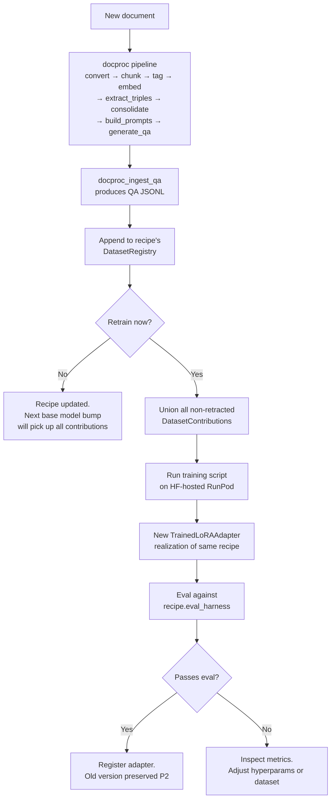

# ADR-055: Adapter Lifecycle and Recipe Separation

**Date:** 2026-07-17
**Status:** Draft
**Supersedes:** —
**Related:** ADR-050 (Ontology-Anchored Embedding), ADR-053 (Corpus Pipeline Input Guard Toggle)

## Context

hKask's adapter story was designed around durable expertise: train a LoRA on a large Rust corpus once, serve it for months. Two forces invalidate that assumption:

1. **Base model cadence has compressed.** Qwen3.6 → Qwen3.7 → Qwen4 is happening on a 3–6 month cycle. Every base bump invalidates every trained adapter — the weights are tied to a specific base model family and cannot be ported. An adapter built today on Qwen3.6 will be unusable the day Qwen3.7 ships.
2. **The Sakana D2L paper (Charakorn et al., ICML 2026)**[^d2l] reframes what adapters are for. D2L trains a hypernetwork to *generate* a LoRA from a document in a single forward pass, achieving near-perfect needle-in-a-haystack recall at 4× the base model's native context window. The paper's evaluation is a retrieval task — "did the adapter encode this specific fact from this specific document?" — not an expertise-acquisition task. This exposes a category of adapter hKask does not currently model: **ephemeral context-internalization adapters**, distinct from durable expertise adapters.

The current `TrainedLoRAAdapter` struct (`crates/hkask-adapter/src/adapter_store.rs`) treats the trained weights as the primary asset and training provenance as metadata. Under a 3–6 month base model cadence, this is inverted: the **training recipe** (dataset + hyperparams + eval harness) is the durable asset, and the **weights** are a regenerable cache that must be rebuilt when the base model bumps.

**Problem Statement:** The adapter store conflates durable training recipes with ephemeral weight artifacts, has no concept of adapter lifecycle class (durable expertise vs. ephemeral context), and has no incremental-update path that preserves prior training investment across base model generations.

**Stakeholders:** Adapter operators (retraining workflow); inference router (lifecycle-aware adapter selection); security reviewers (ephemeral adapters need TTL enforcement); future contributors (recipe reproducibility).

**Constraints:**

- P1 (User Sovereignty): adapter lifecycle class must be operator-chosen, never implicitly reassigned.
- P2 (Affirmative Consent): retraining an adapter on a new base model must not silently supersede the prior version.
- P5 (Essentialism): no pass-through abstractions — a recipe store that merely wraps a shell script is prohibited.
- P7 (Prefer deletion over deprecation): the existing `TrainedLoRAAdapter` schema evolves in place; no parallel "v2" table.
- Python is not an acceptable project dependency (AGENTS.md). Training execution remains outsourced to HF-hosted shell scripts; hKask stores *recipes*, not *training code*.
- The `docproc_ingest_qa` tool already produces training-ready JSONL. The dataset registry must consume this format without conversion.

## Decision

Three coupled changes to `hkask-adapter`, introduced together because they form a single coherent model:

### 1. Separate `TrainingRecipe` (durable) from `TrainedLoRAAdapter` (ephemeral output)

Introduce a `TrainingRecipe` struct that captures the full reproducible inputs to a training run, independent of any specific output. A `TrainedLoRAAdapter` becomes *one realization* of a recipe against a specific base model.

```rust
/// Durable, reproducible training recipe. Survives base model bumps.
/// The recipe is the asset; the adapter is the cached output.
pub struct TrainingRecipe {
    /// Unique identifier
    pub id: Uuid,
    /// Human-readable name (e.g. "rust-coding-v1")
    pub name: String,
    /// MDS domain this recipe targets
    pub domain: MdsDomain,
    /// Ordered list of dataset contributions (append-only registry)
    pub dataset: DatasetRegistry,
    /// Hyperparameters as JSON (LR, rank, alpha, epochs, seq_len, ...)
    /// Stored as opaque JSON to avoid coupling to harness-specific param names
    /// (see TRN-001: harness-specific optimizer naming is a harness concern)
    pub hyperparams: serde_json::Value,
    /// Eval harness identifier + version (e.g. "strandset-rust-v1-eval@2026-07-10")
    pub eval_harness: String,
    /// Recipe version, caller-managed (P2)
    pub version: Option<String>,
    /// Owner (P12 — no anonymous recipes)
    pub owner: WebID,
    pub created_at: String,
}

/// One realization of a recipe against a specific base model.
/// This is the existing TrainedLoRAAdapter, now with a recipe FK and lifecycle.
pub struct TrainedLoRAAdapter {
    // ... existing fields ...
    /// FK to the recipe that produced this adapter
    pub recipe_id: Uuid,
    /// Lifecycle class — see §2 below
    pub lifecycle: AdapterLifecycle,
    /// Optional TTL for ephemeral adapters (Unix epoch seconds).
    /// None for Durable adapters. Some(epoch) for Ephemeral.
    #[serde(default)]
    pub expires_at: Option<u64>,
}
```

The `trained_adapters` table gains `recipe_id`, `lifecycle`, and `expires_at` columns. A new `training_recipes` table stores recipes. The existing `training_run_id`, `training_source`, `completed_at`, `dataset_hash`, `training_metrics` fields stay on `TrainedLoRAAdapter` — they describe *this realization*, not the recipe.

### 2. Add `AdapterLifecycle` enum: `Durable` vs `Ephemeral`

```rust
/// Adapter lifecycle class. Operator-chosen at training time (P1).
pub enum AdapterLifecycle {
    /// Long-lived expertise adapter. Trained on large curated corpora.
    /// No TTL. Survives across sessions. Example: rust-coding-lora.
    Durable,
    /// Short-lived context-internalization adapter. Trained on a single
    /// document or small corpus. Has a TTL. Discarded when expired or
    /// when the context is no longer relevant. Example: a low-rank adapter
    /// trained on a 100K-token codebase for a two-week sprint.
    Ephemeral,
}
```

This is the conceptual contribution of the D2L analysis: **adapters are a retrieval medium with a lifecycle.** D2L uses a hypernetwork to produce ephemeral adapters in one forward pass; hKask produces them via a short docproc → low-rank SFT run. The mechanism differs; the lifecycle class is the same.

The inference router gains a lifecycle-aware selection rule: when both a Durable and an Ephemeral adapter match a query, the Ephemeral one takes precedence if not expired (it carries more specific context). Expired Ephemeral adapters are never selected and are candidates for garbage collection.

### 3. `DatasetRegistry`: append-only dataset tracking per recipe

```rust
/// Append-only registry of dataset contributions to a recipe.
/// Each contribution is one docproc_ingest_qa output.
/// Retraining = union of all contributions.
pub struct DatasetRegistry {
    /// Ordered list of contributions. Append-only — entries are never
    /// deleted (P2: no implicit supersession). A retraction is a new
    /// entry with `retracted: true`.
    pub contributions: Vec<DatasetContribution>,
}

pub struct DatasetContribution {
    /// SHA-256 of the source document (pre-chunking)
    pub source_doc_hash: String,
    /// Path to the QA JSONL produced by docproc_ingest_qa
    pub qa_jsonl_path: String,
    /// When this contribution was added
    pub ingested_at: String,
    /// If true, this contribution is excluded from retraining runs.
    /// Retractions are append-only — the original entry is preserved.
    #[serde(default)]
    pub retracted: bool,
}
```

This enables **Method A incremental updates** (replay-based retraining): when new documents arrive, run them through `docproc` → `ingest_qa` → append to the recipe's `DatasetRegistry` → retrain on the union. Catastrophic forgetting is handled by replay because the full prior dataset is included. Cost is O(full_dataset) per update, which is acceptable given the 3–6 month base model cadence (you retrain at most a few times per base model generation).

The `dataset_hash` field on `TrainedLoRAAdapter` (currently a single optional hash) becomes a hash over the *sorted union* of all non-retracted `DatasetContribution` hashes — a content-addressed fingerprint of the exact dataset this adapter was trained on.

## Incremental Update Path (Method A)



## Successor Adapter Path (Base Model Bump)

When the base model evolves (e.g., Qwen3.6 → Qwen3.7):

1. **Same family, minor bump:** Re-run the existing `TrainingRecipe` against the new base model. Only `base_model_family` changes in the new `TrainedLoRAAdapter`. Hyperparams may need tuning (TRN-001), but the dataset and eval harness transfer directly.
2. **Different family (Qwen → Llama):** The QA pairs transfer (they are model-agnostic instruction/output pairs), but hyperparams likely need adjustment. Clone the `TrainingRecipe`, modify `hyperparams`, produce a new adapter. The old adapter remains registered (P2).
3. **Distillation from prior adapter (future):** Run the old adapter over a held-out prompt set, capture its outputs, add them as an additional `DatasetContribution` to the new recipe. This lets the old adapter "vote" on the new one's training — behavioral continuity across base model jumps. This is a future tool (`docproc_distill_from_adapter`), not part of this ADR.

## The Medium-Durability Gap (D2L's Real Lesson)

hKask currently has two context-handling paths:

| Path | Cost | Latency | Durability | Recall |
|------|------|---------|------------|--------|
| Token-concat RAG (memory server, codegraph, condenser) | Low | ms | Per-query | Medium (KV cache pressure, attention dilution on large contexts) |
| Full docproc → SFT (this pipeline) | High | Hours | Months | High (encoded in weights) |

D2L exposes the gap between these: a 100K-token codebase you're working in for a two-week sprint is too big for efficient token-concat RAG but too transient for a full SFT cycle. The `Ephemeral` lifecycle class addresses this with a **lighter-weight training mode** (not specified in this ADR — future work):

- Lower LoRA rank (4–8, not 16)
- Shorter training run (100–500 steps, not 3 epochs)
- Single-document or small-corpus input
- TTL of days to weeks, not months

This is "D2L for poor people" — same lifecycle concept, different mechanism (short SFT vs. hypernetwork forward pass). The `AdapterLifecycle::Ephemeral` enum variant is the contract; the training-mode implementation is deferred.

**What this ADR does not adopt from D2L:** the hypernetwork architecture itself. D2L is Python (93.8%), MIT-licensed, coupled to Gemma, and requires 80K-checkpoint meta-training. hKask prohibits Python dependencies (AGENTS.md) and has no in-repo GPU training infrastructure. The hypernetwork is a research artifact; the lifecycle concept is the transferable insight.

**Chosen Approach:** Separate recipe (durable) from adapter (ephemeral output); add lifecycle class; add append-only dataset registry for incremental updates via replay retraining.

**Alternatives Considered:**

1. *Adopt D2L hypernetwork directly* — rejected: Python dependency (AGENTS.md prohibition), coupled to Gemma base model, 80K-checkpoint meta-training cost, no in-repo GPU infrastructure. The hypernetwork is a mechanism; hKask needs the lifecycle concept, not the mechanism.
2. *LoRA merging (TIES/DARE via mergekit)* — deferred: viable for disjoint additions (Method B), but merge quality degrades after 3–5 merges and doesn't handle contradictory data. Replay retraining (Method A) is simpler and sufficient at the current update cadence. Revisit when retraining cost becomes painful.
3. *Continual learning with replay buffer* — rejected for now: requires training harness modifications (Unsloth/Axolotl replay sampling) that are out of scope. The replay buffer concept is partially captured by `DatasetRegistry` — the full dataset *is* the replay buffer at this cadence.
4. *Keep `TrainedLoRAAdapter` as-is, track recipes in a separate doc* — rejected: violates P8 (Semantic Grounding). Recipes without a typed store become drift-prone documentation. The recipe is a first-class artifact.
5. *Add a `lifecycle` string field without an enum* — rejected: violates the `enum_str_ops!` convention. Free-form strings invite typo-driven bugs in lifecycle-aware selection.

**Rationale:** The 3–6 month base model cadence inverts the asset/cache relationship: the recipe is the asset, the weights are the cache. Separating them makes base model bumps a one-command re-run rather than a re-derivation. The lifecycle enum captures the D2L insight (adapters as retrieval medium) without adopting D2L's mechanism. The append-only `DatasetRegistry` enables incremental updates with the simplest possible method (replay retraining) using infrastructure hKask already has (`docproc_ingest_qa`).

## Consequences

### Positive

- Base model bumps become a recipe re-run, not a re-derivation from scratch. Prior training investment (curated datasets, tuned hyperparams, eval harness) is preserved across generations.
- Incremental dataset additions are tracked with full provenance. Retraining is deterministic given a recipe + base model.
- The `Ephemeral` lifecycle class creates a contract for the medium-durability gap (short SFT on a single document) without committing to an implementation now.
- Old adapters are never implicitly superseded (P2). A base model bump produces a *new* `TrainedLoRAAdapter` linked to the *same* `TrainingRecipe` — both remain queryable.
- Dataset retractions are append-only, preserving full audit history of what was trained on and when.

### Negative

- Schema migration: `trained_adapters` gains 3 columns (`recipe_id`, `lifecycle`, `expires_at`); a new `training_recipes` table is added. Existing rows must be backfilled with a default recipe per adapter (one recipe per existing adapter, `lifecycle = Durable`, `expires_at = NULL`).
- The `DatasetRegistry` is append-only, so a retracted contribution still occupies space in the JSON. Mitigated: retractions are rare and the JSON is small relative to the QA JSONL files it references.
- Two adapter lifecycle regimes (Durable vs Ephemeral) now exist; the inference router must implement lifecycle-aware selection. This is a new code path with its own test surface.
- `TrainingRecipe.hyperparams` is opaque JSON to avoid harness coupling (TRN-001), which means no compile-time validation of hyperparameter names. Mitigated: the training script validates before execution; the recipe stores what was used, not what is valid.

### Neutral

- `TrainedLoRAAdapter` gains a `recipe_id` FK but does not enforce it via SQLite foreign key (hKask does not enable FK enforcement by default — see ADR-043). The application-layer invariant is: every adapter has a recipe.
- The `docproc_distill_from_adapter` tool (successor adapter distillation) is explicitly out of scope. This ADR creates the *shape* it would fill (a `DatasetContribution` sourced from an old adapter's outputs) without building the tool.

## Compliance

### Constraint-Driven Design Principles

| Principle | Compliance | Evidence |
|-----------|-----------|----------|
| **P1** (No trait without two consumers) | ✅ | `AdapterLifecycle` consumed by adapter store (persistence) and inference router (selection) |
| **P2** (No generic without two instantiations) | ✅ | `DatasetRegistry` instantiated for both Durable (multi-contribution) and Ephemeral (single-contribution) recipes |
| **P3** (No module directory without encapsulation) | ✅ | `TrainingRecipe` encapsulates recipe fields; `DatasetRegistry` encapsulates contribution list |
| **P5** (No feature flag without activator) | ✅ | `lifecycle` is operator-chosen at training time, not a runtime flag |
| **P7** (Prefer deletion over deprecation) | ✅ | `TrainedLoRAAdapter` evolves in place; no deprecated parallel struct |
| **P8** (Semantic Grounding) | ✅ | Recipe is content-addressed via dataset hash union; adapter is content-addressed via weights checksum |

### Magna Carta

| Principle | Compliance | Evidence |
|-----------|-----------|----------|
| **P1** (User Sovereignty) | ✅ | Lifecycle class is operator-chosen; never implicitly reassigned |
| **P2** (Affirmative Consent) | ✅ | Base model bump produces a new adapter, never supersedes the old; `version` is caller-managed |
| **P4** (Clear Boundaries) | ✅ | Recipe (durable) vs adapter (ephemeral) boundary is explicit in the type system |

## Verification

```bash
# Schema migration compiles and applies
cargo test -p hkask-adapter -- --nocapture

# New types are present
grep -rn "pub struct TrainingRecipe" crates/hkask-adapter/src/
grep -rn "pub enum AdapterLifecycle" crates/hkask-adapter/src/
grep -rn "pub struct DatasetRegistry" crates/hkask-adapter/src/

# Existing adapter tests still pass (backfill preserves prior behavior)
cargo test -p hkask-adapter

# Inference router handles lifecycle-aware selection
grep -rn "AdapterLifecycle" crates/hkask-inference/src/

# No Python dependency introduced
grep -rn "python\|pyo3\|tokio-python" crates/hkask-adapter/Cargo.toml mcp-servers/hkask-mcp-training/Cargo.toml
```

**Expected Results:**

- `cargo test -p hkask-adapter`: all existing tests pass; new tests for `TrainingRecipe`, `DatasetRegistry`, `AdapterLifecycle` pass.
- `grep TrainingRecipe`: 1 struct definition + store methods + tests.
- `grep AdapterLifecycle`: 1 enum definition + inference router selection logic + tests.
- `grep python`: 0 matches in adapter and training crate Cargo.toml files.

## Implementation Phasing

| Phase | Scope | ADR Section |
|-------|-------|-------------|
| **Phase 1** (this ADR) | `TrainingRecipe`, `DatasetRegistry`, `AdapterLifecycle` types; schema migration with backfill; store CRUD | §1, §2, §3 |
| **Phase 2** (future) | Inference router lifecycle-aware selection; ephemeral adapter TTL enforcement + GC | §2 |
| **Phase 3** (future) | Ephemeral training mode (low-rank, short-run) in HF-hosted training scripts | "Medium-Durability Gap" |
| **Phase 4** (future) | `docproc_distill_from_adapter` tool for successor-adapter distillation | "Successor Adapter Path" §3 |

Phase 1 is self-contained: it adds types and storage without changing runtime behavior. Existing adapters are backfilled as `Durable` with a single-contribution `DatasetRegistry`. No inference router changes are required until Phase 2.

## Related Documents

- [ADR-050: Ontology-Anchored Embedding](ADR-050-ontology-anchored-embedding.md) — the docproc pipeline that produces QA pairs consumed by `DatasetRegistry`
- [ADR-053: Corpus Pipeline Input Guard Toggle](ADR-053-corpus-input-guard-toggle.md) — guard policy for the corpus pipeline that feeds this training pipeline
- [`docs/how-to/training-and-adapters.md`](../../how-to/training-and-adapters.md) — current training workflow (will be updated in Phase 1)
- [`crates/hkask-adapter/src/adapter_store.rs`](../../../crates/hkask-adapter/src/adapter_store.rs) — `TrainedLoRAAdapter` struct and schema (migration target)
- [`crates/hkask-adapter/src/expertise.rs`](../../../crates/hkask-adapter/src/expertise.rs) — `Expertise`, `TrainingProvenance`, `MdsDomain` (recipe references these)
- [SakanaAI/Doc-to-LoRA](https://github.com/SakanaAI/Doc-to-LoRA) — the paper that motivated the lifecycle distinction (not adopted as code)

## References

[^d2l]: Charakorn, R., Cetin, E., Uesaka, S., & Lange, R. T. (2026). *Doc-to-LoRA: Learning to Instantly Internalize Contexts.* ICML 2026. arXiv:2602.15902 — the hypernetwork paper whose evaluation framing (adapters as retrieval medium) motivated the `AdapterLifecycle` distinction. The mechanism (hypernetwork) is not adopted; the lifecycle concept is.

[^ousterhout]: Ousterhout, J. (2018). *A Philosophy of Software Design.* — deep-module discipline applied here: `TrainingRecipe` is a deep module (small interface — `name`, `domain`, `dataset`, `hyperparams`, `eval_harness` — hiding the full complexity of dataset provenance and retraining logic).

[^replay]: French, R. M. (1999). *Catastrophic forgetting in connectionist networks.* Trends in Cognitive Sciences, 3(4), 128–135. — the canonical reference for the catastrophic forgetting problem that replay-based retraining (Method A) addresses.

---

*ℏKask - A Minimal Viable Container for Replicants — v0.31.0*
*Adapters are a retrieval medium with a lifecycle.*
