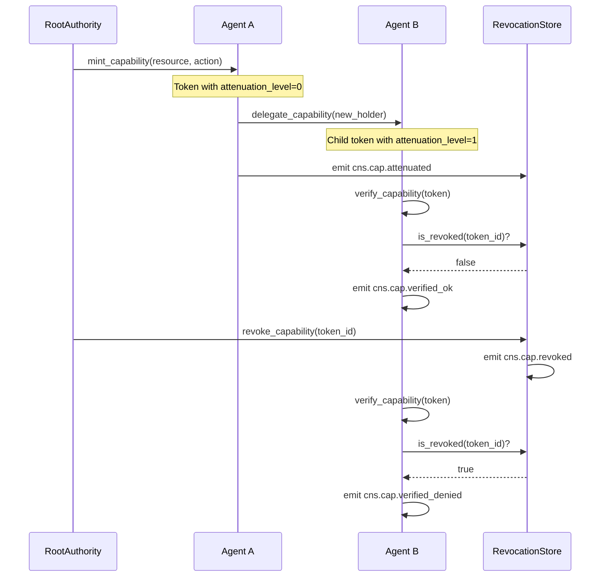
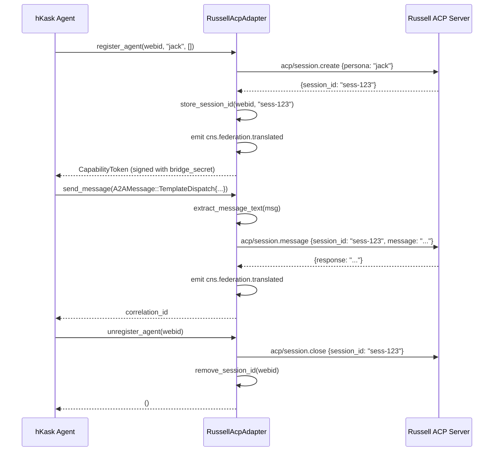

<!-- TOGAF_DOMAIN: Application -->
<!-- VERSION: 2.0.0 -->
<!-- STATUS: Active -->
<!-- LAST_UPDATED: 2026-05-24 -->

# Agent Pod Implementation

**Purpose:** Comprehensive guide to hKask agent pod lifecycle, capability management, and federation following ADV-REVIEW-F2 security hardening.

**Related:** [`security-architecture.md`](security-architecture.md), [`ports-inventory.md`](ports-inventory.md), [`../plans/ADV-REVIEW-F2.md`](../plans/ADV-REVIEW-F2.md)

---

## Executive Summary

Agent pods are the fundamental execution unit in hKask, encapsulating bot and replicant agents with WebID-based identity, capability-gated MCP access, and A2A communication via the Agent Communication Protocol (ACP).

**Core Lifecycle:**
```
Populated → Registered → Activated → Deactivated
```

**Key Advances (Post ADV-REVIEW-F2):**
- **Unified capability primitive:** Single `CapabilityToken` with caveats (T08)
- **Deterministic identity:** WebID derivation via UUID v5 from persona content (T06)
- **OCAP enforcement:** Token-based access control at all boundaries (T02, T03, T04)
- **Secure memory:** `Arc<Zeroizing<Vec<u8>>>` for secrets (T07)
- **Async purity:** All ports use `#[async_trait]` (T10)
- **Persistent revocation:** SQLite-backed token revocation tracking (T12)
- **CNS observability:** Spans emitted on all capability mutations (T13)
- **Russell federation:** Bidirectional ACP bridge with session lifecycle (T14)

**Implementation:** ~1,200 LOC across `hkask-agents` crate

---

## 1. Pod Lifecycle

### 1.1 State Machine

```mermaid
stateDiagram-v2
    [*] --> Populated: PodManager::create_pod()
    Populated --> Registered: register()
    Registered --> Activated: activate()
    Activated --> Deactivated: deactivate()
    Deactivated --> [*]
    
    note right of Populated
        Persona loaded from YAML
        WebID derived (UUID v5)
        Capability token minted
    end note
    
    note right of Registered
        ACP runtime registered
        Capability tokens stored
        CNS span: cns.agent_pod.registered
    end note
    
    note right of Activated
        MCP tools accessible
        A2A messaging enabled
        CNS span: cns.agent_pod.activated
    end note
    
    note right of Deactivated
        Capabilities revoked
        MCP access removed
        CNS span: cns.agent_pod.deactivated
    end note
```

<!-- DIAGRAM_ALIGNMENT
id: DIAG-POD-001
verified_date: 2026-05-24
verified_against: crates/hkask-agents/src/pod.rs:PodLifecycleState
status: VERIFIED
-->

### 1.2 Lifecycle Methods

| Method | Purpose | CNS Span |
|--------|---------|----------|
| `PodManager::create_pod()` | Instantiate pod from persona YAML | `cns.agent_pod.created` |
| `AgentPod::register()` | Register with ACP runtime | `cns.agent_pod.registered` |
| `AgentPod::activate()` | Enable MCP tools and A2A messaging | `cns.agent_pod.activated` |
| `AgentPod::deactivate()` | Revoke capabilities, disable access | `cns.agent_pod.deactivated` |
| `AgentPod::delegate()` | Attenuate capability to another agent | `cns.cap.attenuated` |

---

## 2. Identity and WebIDs

### 2.1 Deterministic Derivation (T06)

WebIDs are derived deterministically from persona content using UUID v5:

```rust
// crates/hkask-types/src/id.rs
impl WebID {
    pub fn from_persona(persona_bytes: &[u8]) -> Self {
        let namespace = Uuid::parse_str("686b6173-6b2d-7065-7273-6f6e612d6e73")
            .expect("Invalid namespace UUID");
        Self(Uuid::new_v5(&namespace, persona_bytes))
    }
}
```

**Properties:**
- Same persona YAML → same WebID (across processes, restarts)
- Different personas → different WebIDs
- Enables audit trail continuity and capability binding

### 2.2 Root Authority

```rust
// crates/hkask-agents/src/acp.rs
impl AcpRuntime {
    pub fn new(secret: &[u8], rate_limit_config: Option<RateLimitConfig>) -> Self {
        let root_persona = b"hkask-root-authority";
        let root_webid = WebID::from_persona(root_persona);
        let root_authority = Arc::new(RootAuthority::new(root_webid, secret));
        // ...
    }
}
```

---

## 3. Capability System

### 3.1 Unified Primitive (T08)

All access control uses `CapabilityToken` with caveats:

```rust
// crates/hkask-types/src/capability.rs
pub struct CapabilityToken {
    pub id: String,
    pub resource: CapabilityResource,  // Tool, Template, Manifest, Registry, Cascade, Spec
    pub resource_id: String,
    pub action: CapabilityAction,      // Read, Write, Execute, Render, Compose, Attenuate, Validate
    pub delegated_from: WebID,
    pub delegated_to: WebID,
    pub signature: String,             // HMAC-SHA256
    pub expires_at: Option<i64>,
    pub attenuation_level: u8,         // Current depth (0 = root)
    pub max_attenuation: u8,           // Maximum allowed (default: 7)
    pub context_nonce: String,
    pub caveats: Vec<Caveat>,          // Additional restrictions
}
```

### 3.2 Caveat Types

| Caveat | Purpose | Example |
|--------|---------|---------|
| `expiration` | Time-based expiry | `Caveat::expiration(1735689600)` |
| `operation` | Specific operation allowed | `Caveat::operation("generate")` |
| `template` | Template ID scope | `Caveat::template("template:greeting")` |
| `visibility` | Visibility level | `Caveat::visibility("private")` |

### 3.3 Capability Lifecycle



<!-- DIAGRAM_ALIGNMENT
id: DIAG-POD-002
verified_date: 2026-05-24
verified_against: crates/hkask-agents/src/acp.rs; crates/hkask-agents/src/revocation_store.rs
status: VERIFIED
-->

---

## 4. OCAP Enforcement

### 4.1 Enforcement Points

| Boundary | Enforcement Function | Location |
|----------|---------------------|----------|
| **MCP tools** | `verify_tool_capability` | `hkask-mcp/src/dispatch.rs` |
| **Template execution** | `CapabilityAwareValidator` | `hkask-templates/src/capability_validator.rs` |
| **ACP messaging** | `AcpRuntime::verify_capability` | `hkask-agents/src/acp.rs` |
| **Memory storage** | `MemoryStoragePort::store_artifact` | `hkask-agents/src/adapters/memory_storage.rs` |

### 4.2 Verification Flow

```rust
// OCAP-idiomatic verification (T02)
pub fn verify_tool_capability(
    &self,
    token: &CapabilityToken,
    expected_holder: &WebID,
    resource: CapabilityResource,
    resource_id: &str,
    action: CapabilityAction,
) -> bool {
    // 1. Verify signature (constant-time comparison)
    if !self.verify_with_time(token, current_time) {
        return false;
    }
    
    // 2. Verify holder matches
    if token.delegated_to != *expected_holder {
        return false;
    }
    
    // 3. Verify resource/action match
    if !token.is_valid_for(resource, resource_id, action) {
        return false;
    }
    
    // 4. Check revocation (persistent store)
    if self.revocation_store.is_revoked(&token.id).await? {
        return false;
    }
    
    true
}
```

### 4.3 Security Invariants

| Invariant | Enforcement |
|-----------|-------------|
| No wildcard capabilities | `AcpRuntime::register_agent` rejects `"*"` |
| No ambient authority | Every operation requires capability presentation |
| Constant-time signature comparison | `subtle::ConstantTimeEq` prevents timing attacks |
| Persistent revocation | `RevocationStore` survives restarts |
| Attenuation limit | `attenuation_level < max_attenuation` (default: 7) |

---

## 5. Hexagonal Ports

### 5.1 Port Inventory

| Port | Purpose | Adapters |
|------|---------|----------|
| `AcpPort` | Agent registration, A2A messaging | `AcpRuntime`, `RussellAcpAdapter` |
| `GitCASPort` | Template crate loading | `GitCasAdapter`, `MockGitCas` |
| `MCPRuntimePort` | Tool invocation | `McpRuntimeAdapter` |
| `MemoryStoragePort` | Artifact persistence | `MemoryStorageAdapter` |
| `CnsEmit` | Observability spans | `CnsEmitterAdapter` |
| `KeystorePort` | Secret management | `KeychainAdapter` |
| `SovereigntyPort` | Consent management | `ConsentManager` |

### 5.2 Async Purity (T10)

All ports use `#[async_trait]`:

```rust
#[async_trait::async_trait]
pub trait AcpPort: Send + Sync {
    async fn register_agent(
        &self,
        webid: WebID,
        agent_type: &str,
        capabilities: Vec<String>,
    ) -> Result<CapabilityToken, AcpError>;
    
    async fn send_message(&self, msg: A2AMessage) -> Result<String, AcpError>;
    // ...
}
```

**No `block_in_place` or `block_on` in library code.**

---

## 6. Federation

### 6.1 Russell ACP Bridge (T14)

Bidirectional communication with Russell's ACP server:

```rust
// crates/hkask-agents/src/adapters/russell_acp.rs
pub struct RussellAcpAdapter {
    child: Mutex<Option<Child>>,
    russell_binary: String,
    macaroon_token: Option<String>,
    cns_emitter: Option<Arc<dyn hkask_cns::CnsEmit + Send + Sync>>,
    sessions: Arc<RwLock<HashMap<WebID, String>>>,  // WebID → session_id
    bridge_secret: Arc<Zeroizing<Vec<u8>>>,
}
```

**Protocol:**
- JSON-RPC 2.0 over stdio
- Macaroon authentication
- Session lifecycle management
- CNS spans for cross-system translation

### 6.2 Session Lifecycle



<!-- DIAGRAM_ALIGNMENT
id: DIAG-POD-003
verified_date: 2026-05-24
verified_against: crates/hkask-agents/src/adapters/russell_acp.rs; russell/crates/russell-acp-server/src/handler.rs
status: VERIFIED
-->

---

## 7. Memory Integration

### 7.1 MemoryStoragePort (T11)

Pods persist artifacts to episodic and semantic memory:

```rust
// crates/hkask-agents/src/pod.rs
impl PodManager {
    pub async fn activate_pod(&self, pod_id: &PodID) -> AgentPodResult<()> {
        let mut pods = self.pods.write().await;
        let pod = pods.get_mut(pod_id).ok_or_else(|| /* ... */)?;
        
        pod.activate(&self.mcp_runtime, &self.cns_emitter)?;
        
        // Persist activation event
        let event = serde_json::json!({
            "entity": pod.webid.to_string(),
            "attribute": "lifecycle_event",
            "value": {
                "event": "activated",
                "pod_id": pod.id.to_string(),
                "timestamp": chrono::Utc::now().to_rfc3339(),
            }
        });
        
        let memory = self.memory_storage.lock().await;
        let _ = memory.store_artifact(
            pod.webid,
            "episodic_triple",
            event,
            "private",
            &pod.capability_token,
        );
        
        Ok(())
    }
}
```

### 7.2 Visibility Enforcement

| Visibility | Scope | Access |
|------------|-------|--------|
| `private` | Agent only | Agent's own WebID |
| `shared` | Pod group | Agents with shared capability |
| `public` | All agents | Any agent with read capability |

---

## 8. Error Handling

### 8.1 Typed Errors (T15)

No `unwrap()` on hot paths:

```rust
// crates/hkask-agents/src/pod.rs
pub enum AgentPodError {
    #[error("ACP registration failed: {0}")]
    ACPRegistrationError(String),
    
    #[error("MCP tool access denied: {0}")]
    MCPToolAccessDenied(String),
    
    #[error("Capability delegation failed: {0}")]
    CapabilityDelegationFailed(String),
    
    #[error("Git CAS error: {0}")]
    GitCASError(String),
    
    #[error("Memory storage error: {0}")]
    MemoryStorageError(String),
    
    #[error("CNS emission error: {0}")]
    CNSEmissionError(String),
    
    #[error("Keystore error: {0}")]
    KeystoreError(String),
    
    #[error("Clock error: {0}")]
    ClockError(String),
}
```

### 8.2 Error Recovery

| Error | Recovery Path |
|-------|---------------|
| `ACPRegistrationError` | Retry registration or escalate to human |
| `MCPToolAccessDenied` | Request capability delegation |
| `CapabilityDelegationFailed` | Check attenuation limit, request root delegation |
| `GitCASError` | Retry or use cached template |
| `MemoryStorageError` | Log and continue (non-fatal) |
| `ClockError` | Halt pod (security-critical) |

---

## 9. Testing

### 9.1 Test Coverage

```bash
# Unit tests
cargo test -p hkask-agents

# Integration tests
cargo test -p hkask-testing

# Workspace tests
cargo test --workspace
```

**Current Status:** 31 tests passing in `hkask-agents`, 238 total across workspace

### 9.2 Test Categories

| Category | Count | Purpose |
|----------|-------|---------|
| Pod lifecycle | 8 | State transitions, registration, activation |
| Capability management | 10 | Minting, delegation, verification, revocation |
| ACP messaging | 5 | Message routing, correlation |
| Russell federation | 7 | Session lifecycle, message translation |
| Error handling | 1 | Typed errors, recovery paths |

---

## 10. Security Considerations

### 10.1 Threat Model

| Threat | Mitigation |
|--------|-----------|
| Capability forgery | HMAC-SHA256 signatures with constant-time comparison |
| Capability replay | Persistent revocation tracking |
| Privilege escalation | Attenuation limit enforcement (max 7 levels) |
| Identity spoofing | Deterministic WebID derivation |
| Secret extraction | `Arc<Zeroizing<Vec<u8>>>` prevents byte copying |
| DoS via messaging | Per-agent rate limiting (100 msg/min) |

### 10.2 Secure Memory

```rust
// Secrets wrapped in Arc<Zeroizing<Vec<u8>>>
pub struct AcpRuntime {
    secret: Arc<Zeroizing<Vec<u8>>>,
    // ...
}

// Clone shares the Arc, not the bytes
impl Clone for AcpRuntime {
    fn clone(&self) -> Self {
        Self {
            secret: Arc::clone(&self.secret),
            // ...
        }
    }
}
```

**Memory zeroized on drop via `zeroize` crate.**

---

## 11. Observability

### 11.1 CNS Spans (T13)

All capability mutations emit spans:

| Span | Emitted On | Data |
|------|-----------|------|
| `cns.cap.minted` | Token creation | `token_id`, `holder`, `resource`, `action` |
| `cns.cap.attenuated` | Delegation | `parent_id`, `child_id`, `attenuation_level`, `holder` |
| `cns.cap.revoked` | Revocation | `token_id` |
| `cns.cap.verified_ok` | Successful verification | `token_id`, `holder`, `resource` |
| `cns.cap.verified_denied` | Failed verification | `token_id`, `holder`, `resource` |
| `cns.agent_pod.registered` | Pod registration | `webid`, `agent_type` |
| `cns.agent_pod.activated` | Pod activation | `webid`, `pod_id` |
| `cns.agent_pod.deactivated` | Pod deactivation | `webid`, `pod_id` |
| `cns.federation.translated` | Russell bridge | `direction`, `method`, `session_id` |

### 11.2 Audit Trail

`AuditLogPort` writes to both in-memory cache and SQLite storage:

```rust
impl AuditLogPort for AuditLog {
    async fn log(&self, entry: AuditLogEntry) {
        // Write to persistent storage if available
        if let Some(ref store) = self.store {
            let storage_entry = hkask_storage::AuditEntry::new(
                &entry.from.to_string(),
                &entry.message_type,
                &entry.event_type,
                &entry.correlation_id,
            );
            let _ = store.insert(&storage_entry);
        }
        
        // Write to in-memory cache
        let mut entries = self.entries.write().await;
        entries.push(entry);
    }
}
```

---

## 12. Known Limitations

1. **No cross-machine ACP:** Transport layer designed for single-machine deployment
2. **No CRDT merge:** Revocation is centralized per runtime instance
3. **No hardware keystore:** Uses OS keychain (not TPM/SE)
4. **No capability delegation across systems:** Russell bridge uses separate macaroon auth
5. **Rate limiting is per-instance:** No distributed rate limiting

---

## 13. Future Work

1. **Cross-machine ACP:** Distributed transport with gossip protocol
2. **CRDT revocation:** Eventually consistent revocation across instances
3. **Hardware keystore:** TPM/SE integration for root secrets
4. **Distributed rate limiting:** Redis-backed rate limiting across instances
5. **Capability delegation across systems:** Unified macaroon verification

---

## References

[^hewitt-actor]: Hewitt, C. (2010). *Actor Model of Computation: Robust Scalable Distributed Programming*. MIT CSAIL.
[^miller-ocap]: Miller, M. S. (2006). *Robust composition: Towards a unified approach to access control and concurrency control* [Doctoral dissertation, Johns Hopkins University].
[^cockburn-hexagonal]: Cockburn, A. (2005). *Hexagonal Architecture*. http://alistair.cockburn.us/Hexagonal+architecture
[^beer-vsm]: Beer, S. (1972). *Brain of the Firm*. Penguin Books.

---

*ℏKask — Planck's Constant of Agent Systems — v0.21.0*
*Agent pods: the minimal viable unit of agent execution.*
