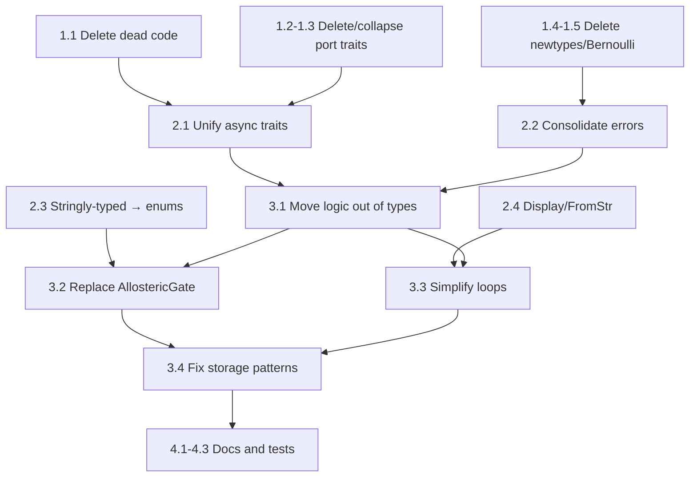

# Idiomatic Rust Simplification — Implementation Plan

**Source:** Adversarial review of hKask v0.23.0, applying Graydon Hoare's design
principles (zero-cost abstraction, deletion over deprecation, minimal surface area,
every abstraction must earn its keep as a semantic transformation).

**Goal:** Reduce codebase complexity by ~30-40% while preserving all runtime behavior.
Every change in this plan either (a) removes code that does no semantic work, or
(b) replaces a gratuitous abstraction with a simpler one that does the same work.

**Constraint:** No feature changes. No behavior changes. This is purely structural.

---

## Dependency Graph (affects ordering)

```
hkask-types          ← leaf (no hkask deps)
  ↑
hkask-keystore       ← depends on types
hkask-storage        ← depends on types, keystore
hkask-cns            ← depends on types
hkask-memory         ← depends on types, storage
hkask-templates      ← depends on types, storage
hkask-ensemble       ← depends on types
hkask-mcp            ← depends on types, templates, keystore, storage, cns
hkask-agents         ← depends on types, mcp, cns, keystore, storage, memory
hkask-api            ← depends on types, agents, templates, mcp, cns, ensemble, keystore, storage, memory
hkask-cli            ← depends on everything
```

**Rule:** Changes to `hkask-types` must land first because every crate depends on it.

---

## Phase 1: Deletion Pass — Remove Dead and Speculative Code

**Duration:** 1-2 days  
**Risk:** Zero (deleting unused code cannot change runtime behavior)  
**Verification:** `cargo check --workspace` after every step

### 1.1 Delete all `#[allow(dead_code)]` items

The project's own P6 constraint: "Delete stubs, don't publish them."

| File | Items to delete | What |
|------|----------------|------|
| `hkask-types/src/curation.rs:31` | `OcapTokenKind` variant + TODO | Never consumed |
| `hkask-types/src/capability/mod.rs:170` | `add_caveat()` method | Never called |
| `hkask-types/src/capability/mod.rs:543` | `caveats()` method | Never called |
| `hkask-types/src/capability/mod.rs:582` | `Caveat` methods | Never called |
| `hkask-types/src/capability/hmac_ops.rs:56` | `HmacBuilder::update()` | Never called |
| `hkask-types/src/capability/hmac_ops.rs:78` | `HmacBuilder::finalize_raw()` | Never called |
| `hkask-types/src/allosteric/mwc.rs:95` | `mwc_sensitivity()` | Never called |
| `hkask-types/src/loops/curation.rs:43` | `CuratorHandle::new()` | Never called |
| `hkask-cns/src/dampener.rs:131` | `Dampener::reset()` | Never called |
| `hkask-mcp/src/dispatch.rs:56` | `DispatchRouter::route_all()` | Never called |
| `hkask-api/src/routes/cns.rs:166` | `CnsRoutes::health_detail()` | Never called |
| `hkask-memory/src/consolidation.rs:35` | `SemanticConsolidationError` | Symmetric counterpart, unused |
| `hkask-templates/src/embedding_port.rs:238` | `OkapiEmbedding::dimensions()` | Never called |
| `hkask-agents/src/pod/nu_event.rs:81` | `PodEventEmitter::emit_custom()` | Never called |
| `hkask-cli/src/repl/tool_augmented.rs:314` | `ToolAugmented::tool_results()` | Never called |

**Special case:** `hkask-cli/src/commands/embed_corpus.rs` has **12** `#[allow(dead_code)]`
annotations on `CorpusConfig` deserialization fields. These are YAML schema fields
that are deserialized but never read. Fix: add `#[serde(deny_unknown_fields)]` and
remove the dead struct fields, or use `#[serde(skip)]` if the YAML must still parse.

**Steps:**
1. Delete each dead item listed above.
2. Run `cargo check --workspace`.
3. Run `cargo test --workspace`.

### 1.2 Delete `CnsPort` trait (0 implementations)

`CnsPort` is defined in `hkask-types/src/ports.rs:32` with 3 async methods
(`health`, `variety`, `increment_variety`). It has **zero** implementations in the
codebase (the `CnsRuntime` impl at `hkask-cns/src/runtime.rs:344` was found to
implement the trait, but verify this — if it does, this trait has exactly 1 impl
and falls under step 1.3 instead).

**Steps:**
1. Search for all `CnsPort` references.
2. If `CnsRuntime` does implement it, skip deletion and classify under 1.3.
3. Otherwise, delete the trait and all `use` statements.
4. Remove `CnsPort` from `hkask-types/src/lib.rs` re-exports.
5. Remove `CnsPort` from `hkask-cns/src/lib.rs` re-exports.

### 1.3 Collapse single-impl port traits to concrete types

For each trait with exactly **one** implementation, replace `Arc<dyn Trait>` usage
with `Arc<ConcreteType>` (or just the concrete type), then delete the trait.

| Trait | Single impl | Used as `dyn`? | Action |
|-------|------------|-----------------|--------|
| `GitCASPort` | `GitCasAdapter` | Yes (in `hkask-api`, `hkask-mcp`) | Replace `Arc<dyn GitCASPort>` with `Arc<GitCasAdapter>`, delete trait |
| `StandingSessionPort` | `StandingSessionStore` | Yes (in `hkask-api`, `hkask-ensemble`, `hkask-cli`) | Replace `Arc<dyn StandingSessionPort>` with `Arc<StandingSessionStore>`, delete trait |
| `ConsolidationPort` | `ConsolidationBridge` | Yes (in `hkask-memory`) | Replace `Arc<dyn ConsolidationPort>` with `Arc<ConsolidationBridge>`, delete trait |
| `EmbeddingPort` | `EmbeddingStore` | Yes (in `hkask-memory`) | Replace `Arc<dyn EmbeddingPort>` with `Arc<EmbeddingStore>`, delete trait |
| `EmbeddingGenerationPort` | `OkapiEmbedding` | Yes (in `hkask-templates`) | Replace `Arc<dyn EmbeddingGenerationPort>` with `Arc<OkapiEmbedding>`, delete trait |
| `AgentRegistrationPort` | `AgentRegistryStore` | No dyn found | Delete trait, add methods directly to `AgentRegistryStore` |

**Pattern for each trait:**
1. Find all `Arc<dyn $TRAIT>` usage sites.
2. Replace with `Arc<$CONCRETE>`.
3. Move the trait method signatures onto the concrete type as inherent `impl` methods.
4. Delete the trait definition.
5. Remove from re-exports.
6. `cargo check --workspace`.

**Note:** If a second implementation is expected soon (next 30 days per C3), keep
the trait. But the project has been at v0.23.0 with single impls — the prophecy
has not arrived. Delete and re-extract when the second consumer appears.

### 1.4 Delete gratuitous newtype wrappers

| Type | File | Replacement |
|------|------|-------------|
| `AcquisitionResistance(bool)` | `hkask-types/src/sovereignty.rs` | Replace with `acquisition_resistance: bool` field on `DataSovereigntyBoundary` |
| `KillZoneConfig = KillZoneState` | `hkask-types/src/sovereignty.rs` | Use `KillZoneState` directly everywhere |

### 1.5 Delete `BernoulliDistribution` struct

File: `hkask-types/src/allosteric/distribution.rs` (54 lines)

`BernoulliDistribution` wraps a single `f64` field `r_bar` and has one meaningful
method `expected_r_bar()` that returns that field. It's used only in `AllostericGate`
to store the gate's output distribution. Replace with a bare `f64` field.

**Steps:**
1. In `hkask-types/src/allosteric/gate.rs`, replace `distribution: BernoulliDistribution`
   with `r_bar: f64`.
2. Delete `hkask-types/src/allosteric/distribution.rs`.
3. Remove `mod distribution` from `hkask-types/src/allosteric/mod.rs`.
4. Remove `BernoulliDistribution` from all re-exports.
5. Update `hkask-cns/src/allosteric/` mirror (if it duplicates the types crate version).

---

## Phase 2: Consistency Pass — One Pattern Per Concept

**Duration:** 2-3 days  
**Risk:** Low (refactoring, no behavior change)  
**Verification:** `cargo check --workspace` + `cargo test --workspace` after every step

### 2.1 Unify async trait strategy to native `async fn`

Current state: **4 different strategies** in `hkask-types/src/ports.rs` alone.

| Strategy | Current users | Target |
|----------|--------------|--------|
| `#[async_trait::async_trait]` | `Loop`, `CnsObserver`, 7 impl blocks across crates | Native `async fn` |
| `Pin<Box<dyn Future>>` | `InferencePort` | Native `async fn` |
| RPITIT (`impl Future + Send`) | `ToolPort` | Native `async fn` |
| Native `async fn` + `#[allow(async_fn_in_trait)]` | `CnsPort` | Keep (canonical) |

**Steps:**

1. **`InferencePort`** (`hkask-types/src/ports.rs:157`):
   - Replace `fn generate(&self, ...) -> Pin<Box<dyn Future<Output = Result<...>> + Send + '_>>`
     with `async fn generate(&self, ...) -> Result<InferenceResult, InferenceError>`.
   - Same for `generate_n()`.
   - Delete `use std::pin::Pin` and `use std::future::Future` from this file.
   - Update all `impl InferencePort` blocks to use `async fn`.

2. **`Loop` trait** (`hkask-types/src/loops/mod.rs:201`):
   - Remove `#[async_trait::async_trait]` attribute.
   - Change method signatures to native `async fn sense(&self) -> Vec<Signal>`, etc.
   - Remove `Send + Sync` supertraits (native async fn in trait requires Send bounds
     to be expressed differently — use `+ Send` on the trait or rely on Rust 2024 edition).

3. **`CnsObserver`** (`hkask-types/src/ports.rs:519`):
   - Remove `#[async_trait::async_trait]`.
   - Convert to native `async fn`.

4. **All `impl` blocks with `#[async_trait]`** (17 sites found):
   - `hkask-memory/src/episodic_loop.rs:77`
   - `hkask-memory/src/semantic_loop.rs:94`
   - `hkask-cns/src/runtime.rs:385`
   - `hkask-cns/src/cybernetics_loop.rs:716`
   - `hkask-api/src/routes/cns.rs:70`
   - `hkask-ensemble/src/adapters.rs:38,126`
   - `hkask-ensemble/src/ports.rs:45`
   - `hkask-agents/src/ports/acp.rs:17`
   - `hkask-agents/src/curator/curation_loop.rs:293`
   - `hkask-agents/src/loop_system.rs:27,420`
   - Remove `#[async_trait]` / `#[async_trait::async_trait]` from each.
   - Convert method signatures to native `async fn`.

5. **Remove `async-trait` from workspace `Cargo.toml`:**
   - Remove `async-trait = "0.1"` from `[workspace.dependencies]`.
   - Remove from each crate's `Cargo.toml` that lists it.

6. **Verify:** `cargo check --workspace`. If Rust 2024 edition native async fn in trait
   causes object-safety issues for `Arc<dyn HkaskLoop>`, keep `HkaskLoop` as the one
   trait that needs `async_trait` and document why. All others should migrate.

### 2.2 Consolidate error enums — one per crate

**Current state:** 53 error enums across 11 crates.

**Target:** One error enum per crate (max two: infra + domain).

| Crate | Current error enums | Target |
|-------|-------------------|--------|
| `hkask-types` | `InfrastructureError`, `McpErrorKind`, `HkaskError`, `GitError`, `CapabilityParseError`, `InferenceError`, `RegistryError`, `SessionStoreError`, `ToolPortError`, `EmbeddingError`, `EmbeddingGenerationError`, `AllostericError` | `HkaskError` (merge all into variants) |
| `hkask-storage` | `DatabaseError`, `AgentRegistryError`, `ConsentStoreError`, `GoalRepositoryError`, `NuEventError`, `SovereigntyStoreError`, `StandingSessionError`, `TripleError`, `UserStoreError`, `SpecError` | `StorageError` |
| `hkask-cns` | `GasError` (only one, leave it) | Keep `GasError` |
| `hkask-agents` | `EscalationError`, `ConsentError`, `AcpError`, `MetacognitionError`, `RegistryLoaderError`, `McpError`, `MemoryError`, `RegistryError`, `AgentPodError` | `AgentError` |
| `hkask-cli` | `BootstrapError`, `OnboardingError`, `AgentError`, `EnsembleError`, `CuratorError`, `RegistryError`, `UserError`, `MapperError` | `CliError` |
| `hkask-ensemble` | `ImprovError<E>`, `StandingSessionError`, `EnsembleError` | `EnsembleError` |
| `hkask-keystore` | `KeychainError`, `KeystoreError`, `EncryptionError` | `KeystoreError` |
| `hkask-memory` | `EpisodicMemoryError`, `SemanticMemoryError` | `MemoryError` |
| `hkask-templates` | `TemplateError` (only one, leave it) | Keep `TemplateError` |
| `hkask-mcp` | `ServerStartError` (only one, leave it) | Keep `ServerStartError` |
| `hkask-api` | `ValidationErrorType` (only one, leave it) | Keep |

**Pattern for each consolidation:**
1. Define the new single error enum with variants from all merged types.
2. Add `#[from]` on each variant that corresponds to a sub-error.
3. Replace all `Result<T, OldError>` with `Result<T, NewError>`.
4. Replace all `OldError::Variant` matches with `NewError::Variant`.
5. Delete the old error enum.
6. Run `cargo check -p $CRATE` after each crate.
7. Run `cargo test -p $CRATE` after each crate.

**Order:** Bottom-up (types first, then storage, then up the dependency chain).

### 2.3 Convert stringly-typed config fields to enums

File: `hkask-types/src/bundle.rs`

| Field | Current type | Enum to create | Values |
|-------|-------------|----------------|--------|
| `ErrorHandlingConfig::on_gas_exceeded` | `String` | `GasExceededAction` | `Abort`, `Degrade` |
| `ErrorHandlingConfig::on_timeout` | `String` | `TimeoutAction` | `Abort`, `Retry`, `Fallback` |
| `ErrorHandlingConfig::on_validation_failure` | `String` | `ValidationFailureAction` | `Abort`, `Log`, `Skip` |
| `ErrorHandlingConfig::on_not_reached` | `String` | `NotReachedAction` | `Abort`, `Skip`, `Default` |
| `OcapConfig::signature_algorithm` | `String` | `SignatureAlgorithm` | `Ed25519` |
| `CnsConfig::log_level` | `String` | `tracing::Level` (use std) | `Trace`, `Debug`, `Info`, `Warn`, `Error` |
| `CnsConfig::span_namespace` | `String` | Keep as `String` (open set) | — |
| `CnsConfig::escalation_target` | `String` | `EscalationTarget` | `Curator`, `Human`, `Log` |
| `AuditConfig::on_audit_failure` | `String` | `AuditFailureAction` | `Log`, `Abort`, `Skip` |

**Steps:**
1. Define each enum with `#[derive(Debug, Clone, serde::Deserialize, serde::Serialize)]`.
2. For each, derive or implement `Display` and `FromStr` for error messages.
3. Replace the `String` fields in the config structs.
4. Update all code that matches on string values.
5. Verify YAML deserialization still works (serde enum support is automatic).

### 2.4 Replace `as_str()`/`parse_str()` with `Display`/`FromStr`

At least 12 enums in `hkask-types` define both custom `as_str()`/`parse_str()` methods
and `Display`/`FromStr` trait impls, often inconsistently. `Phase::from_str()` even has
`#[allow(clippy::should_implement_trait)]` because it doesn't return `Result`.

**Rule:** If an enum needs string conversion, implement `Display` + `FromStr`. Delete
custom `as_str()` and `parse_str()`. If case-insensitive parsing is needed, implement
it inside `FromStr`.

**Steps:**
1. Audit all enums with `as_str()` or `parse_str()` methods.
2. For each, verify `Display` and `FromStr` provide the same functionality.
3. If `FromStr` is missing or incomplete, implement it.
4. Replace all call sites of `.as_str()` with `.to_string()` or format `"{enum}"`.
5. Replace all call sites of `parse_str()` with `.parse::<EnumType>()`.
6. Delete the `as_str()` and `parse_str()` methods.

---

## Phase 3: Structural Simplification — Replace Gratuitous Abstractions

**Duration:** 3-5 days  
**Risk:** Medium (behavior should be identical, but these touch core architecture)  
**Verification:** `cargo check --workspace` + `cargo test --workspace` + manual smoke test

### 3.1 Move service logic out of `hkask-types`

The types crate must contain only data definitions and trivial constructors.
Currently it contains 1,400+ lines of service logic.

| Logic to move | Lines | From | To |
|---------------|-------|------|----|
| `DelegationToken` signing, verification, attenuation, base64 | ~710 | `hkask-types/src/capability/mod.rs` | `hkask-keystore` (already depends on `hkask-types`, already has crypto deps) |
| `CapabilityChecker` (6 `grant_*` methods) | ~120 | `hkask-types/src/capability/verification.rs` | `hkask-keystore` |
| `AllostericGate` runtime (mutable state, temporal dynamics) | ~290 | `hkask-types/src/allosteric/gate.rs` | `hkask-cns` (already depends on `hkask-types`, already has the gate in `src/allosteric/`) |
| `mwc_state_function` | ~60 | `hkask-types/src/allosteric/mwc.rs` | `hkask-cns` |
| `BundleManifest::validate()` | ~155 | `hkask-types/src/bundle.rs` | `hkask-templates` (only consumer) |
| `SpecStore` / `SpecCurator` traits | ~30 | `hkask-storage/src/spec_types.rs` | `hkask-types/src/ports.rs` (hexagonal boundary fix — trait belongs in port layer) |

**Steps for `DelegationToken` move:**

1. In `hkask-types/src/capability/mod.rs`, keep only the data types:
   - `CapabilitySpec`, `CapabilityParseError`, `DelegationResource`, `DelegationAction`
   - `SigningPayload` (if it's an internal type of the signing logic, move it too)
   - `Caveat` (data type only, delete methods if they're logic)

2. Move the following to `hkask-keystore/src/capability.rs` (new file):
   - `DelegationToken` struct + `impl` blocks (sign, verify, attenuate, base64, fingerprint)
   - `DelegationTokenBuilder`
   - `CapabilityChecker` + all `grant_*` methods
   - `HmacBuilder` + `hmac_ops.rs`

3. In `hkask-keystore/Cargo.toml`, add:
   - `blake3`, `hmac`, `sha2`, `base64`, `subtle`, `zeroize` (from workspace deps)
   - These are already workspace deps, just add to keystore's Cargo.toml.

4. Update imports in downstream crates:
   - `hkask-cns/src/governed_tool.rs`: `use hkask_keystore::capability::DelegationToken`
   - `hkask-api/src/middleware/auth.rs`: `use hkask_keystore::capability::DelegationToken`
   - `hkask-api/src/lib.rs`: `use hkask_keystore::CapabilityChecker`
   - `hkask-mcp/src/governor.rs`: `use hkask_keystore::{CapabilityChecker, DelegationToken}`

5. Delete the moved code from `hkask-types`.
6. Remove crypto deps from `hkask-types/Cargo.toml` (`blake3`, `hmac`, `sha2`, `subtle`).

**Steps for `AllostericGate` move:**

1. `hkask-cns/src/allosteric/` already has a mirror of the gate. Merge:
   - Move `AllostericGate` runtime logic to `hkask-cns/src/allosteric/gate.rs`.
   - Keep `AllostericGateConfig` data type in `hkask-types/src/allosteric/gate.rs`.
   - Delete `mwc_state_function` from `hkask-types` (move to `hkask-cns` if still needed).
   - Delete `hkask-types/src/allosteric/mwc.rs` and `distribution.rs`.

2. Update re-exports:
   - `hkask-types`: export only `AllostericGateConfig`, `AllostericError`
   - `hkask-cns`: export `AllostericGate`, `BernoulliDistribution` (or just `f64`)

**Steps for `BundleManifest::validate()` move:**

1. Move the `validate()` method from `hkask-types/src/bundle.rs` to
   `hkask-templates/src/validation.rs` (new file).
2. Have it as a free function: `pub fn validate_manifest(m: &BundleManifest) -> ValidationResult`.
3. Update call sites in `hkask-templates`.

### 3.2 Replace `AllostericGate` with `RegulatoryGate`

**Current:** 577 lines across 3 files in `hkask-types`, plus mirror in `hkask-cns`.
MWC conformational dynamics, sigmoid functions, hysteresis, cooperativity constants.

**Actual behavior:** `gate.is_open()` → `bool`. The gate opens/closes based on a
threshold with hysteresis.

**Replacement:**

```rust
/// Regulatory gate with hysteresis cooldown.
///
/// Replaces AllostericGate's MWC model with a simple threshold + cooldown.
/// The gate opens when `metric > open_threshold` and closes when
/// `metric < close_threshold`, with a minimum `cooldown` duration
/// between state transitions to prevent oscillation.
pub struct RegulatoryGate {
    open: bool,
    open_threshold: f64,
    close_threshold: f64,
    last_transition: Option<tokio::time::Instant>,
    cooldown: std::time::Duration,
}

impl RegulatoryGate {
    pub fn new(open_threshold: f64, close_threshold: f64, cooldown: Duration) -> Self {
        Self { open: false, open_threshold, close_threshold, last_transition: None, cooldown }
    }

    pub fn is_open(&self) -> bool { self.open }

    pub fn update(&mut self, metric: f64) {
        let now = tokio::time::Instant::now();
        let can_transition = self.last_transition.is_none()
            || now.duration_since(self.last_transition.unwrap()) >= self.cooldown;
        if !can_transition { return; }
        if self.open && metric < self.close_threshold {
            self.open = false;
            self.last_transition = Some(now);
        } else if !self.open && metric > self.open_threshold {
            self.open = true;
            self.last_transition = Some(now);
        }
    }
}
```

**This is ~30 lines vs 577.** The `open_threshold`/`close_threshold` naturally
provides hysteresis (the gap between them). The `cooldown` provides the
anti-oscillation guarantee that `Dampener` and MWC dynamics currently provide.

**Steps:**
1. Create `RegulatoryGate` in `hkask-cns/src/regulatory_gate.rs`.
2. Replace `AllostericGate` usage in `hkask-cns/src/algedonic.rs`:
   - `AllostericGate::new(&AllostericGateConfig { ... })` →
     `RegulatoryGate::new(threshold, close_threshold, cooldown)`
   - `gate.is_open()` → `gate.is_open()` (same interface)
   - `gate.update(r_bar)` → `gate.update(metric)` (same interface)
3. Delete `hkask-types/src/allosteric/` entirely (after 3.1 moves the config type).
4. Delete `hkask-cns/src/allosteric/` mirror.
5. Remove `AllostericGate`, `BernoulliDistribution`, `mwc_state_function`,
   `AllostericError` from all re-exports.

### 3.3 Simplify the loop architecture: 6 loops → 3

**Current:** Inference, Episodic, Semantic, Communication, Curation, Cybernetics
(all implement `HkaskLoop`, wired through `LoopSystem`).

**Target:** Inference, Memory, Regulation.

| New loop | Absorbs | Responsibility |
|----------|---------|---------------|
| **Inference** | old Inference | Model calls, gas budget, circuit breaker |
| **Memory** | old Episodic + Semantic | Episodic write → semantic consolidation |
| **Regulation** | old Cybernetics + Curation + Communication | Variety monitoring, algedonic escalation, gas override, message routing |

**Rationale:**
- The Communication Loop is just a `tokio::mpsc` router — it doesn't need to be
  a full `HkaskLoop` implementation. Replace with direct channel usage.
- Curation's only runtime behavior is issuing `OverrideGasBudget` directives.
  This is a regulation action, not a separate loop.
- Cybernetics' variety sensing + algedonic escalation + gas regulation are all
  monitoring/regulation concerns that belong together.
- Episodic and Semantic are both memory operations. Episodic → semantic
  consolidation is their only cross-dependency.

**Steps:**

1. **Replace `LoopSystem` with direct channel wiring:**
   - Delete `hkask-agents/src/loop_system.rs`.
   - In the REPL/bootstrap code, replace `LoopSystem::new()` with:
     ```rust
     let (regulation_tx, regulation_rx) = tokio::sync::mpsc::channel(256);
     let (memory_tx, memory_rx) = tokio::sync::mpsc::channel(64);
     ```
   - Each loop's `run()` method takes its `rx` end and processes messages.

2. **Merge Episodic + Semantic → Memory:**
   - Create `hkask-memory/src/memory_loop.rs`.
   - It receives `MemoryPayload` (enum with `Episodic(EpisodicEvent)`, `Consolidate`, `SemanticQuery`).
   - On `Episodic`, persist to `NuEventStore` + emit to consolidation pipeline.
   - On `Consolidate`, run episodic → semantic consolidation.
   - On `SemanticQuery`, query `SemanticMemory`.
   - Delete `hkask-memory/src/episodic_loop.rs` and `semantic_loop.rs`.

3. **Merge Cybernetics + Curation → Regulation:**
   - Create `hkask-cns/src/regulation_loop.rs`.
   - It receives `RegulationPayload` (enum with `VarietyReport`, `AlgedonicAlert`, `OverrideRequest`, `GasReport`).
   - Replace the 1,684-line `cybernetics_loop.rs` with this focused loop.
   - Move gas budget logic from `cybernetics_loop.rs` into `energy.rs` methods.
   - Move override recording into a simple `HashMap<WebID, OverrideRecord>`.
   - Delete `hkask-agents/src/curator/curation_loop.rs` (674 lines).
   - The CurationLoop's logic (override issuance) becomes a method on
     the Regulation loop, triggered by `AlgedonicAlert` above threshold.

4. **Delete the Communication Loop:**
   - `hkask-agents/src/communication/communication_loop.rs` → delete.
   - Replace `MessageDispatch` with direct `tokio::mpsc::Sender` passing.
   - Loops that need to send messages to other loops hold `Sender<_>` handles.

5. **Update `HkaskLoop` trait:**
   - Simplify to 3 loop IDs: `Inference`, `Memory`, `Regulation`.
   - Update `LoopId` enum in `hkask-types/src/loops/mod.rs`.
   - Delete `LoopPayload` variants that no longer apply.

### 3.4 Fix `hkask-storage` patterns

#### 3.4.1 Replace `define_store!` with a `Store` trait + flexible construction

**Current:** The macro generates a struct with `conn: Arc<Mutex<Connection>>` and
a `Store` impl. It cannot accommodate extra fields, forcing `EmbeddingStore` and
`SqliteGoalRepository` to break the pattern.

**Replacement:**

```rust
pub trait Store: Send + Sync {
    fn conn(&self) -> &Arc<Mutex<Connection>>;
    fn lock_conn(&self) -> MutexGuard<'_, Connection> {
        self.conn().lock().expect("connection lock poisoned")
    }
}

// Each store just implements Store manually:
pub struct AgentRegistryStore { conn: Arc<Mutex<Connection>> }
impl Store for AgentRegistryStore {
    fn conn(&self) -> &Arc<Mutex<Connection>> { &self.conn }
}
```

This is 4 lines per store vs 1 macro invocation, but it's explicit and flexible.

**Steps:**
1. Expand all `define_store!` invocations to manual struct + `impl Store`.
2. Delete `hkask-storage/src/store_macros.rs`.
3. Delete `define_store!` and `impl_from_rusqlite!` macros.
4. Replace `impl_from_rusqlite!` with `impl From<rusqlite::Error> for StorageError`
   (single error enum from Phase 2).

#### 3.4.2 Extract `triples.rs` row-mapping helper

**Current:** The row-mapping closure (10 lines extracting columns into `TripleRow`)
is copy-pasted 6 times across `query_by_entity`, `query_by_entity_attribute`,
`query_by_perspective`, `get_by_id`, `query_semantic_lowest_confidence`,
`query_semantic_below_confidence`.

**Replacement:**

```rust
fn query_triples(
    conn: &Connection,
    sql: &str,
    params: &[&dyn rusqlite::types::ToSql],
) -> Result<Vec<Triple>, TripleError> {
    let mut stmt = conn.prepare(sql)?;
    let rows = stmt.query_map(params, |row| {
        // Single row-mapping closure
        Ok(Triple { /* ... */ })
    })?;
    rows.collect::<Result<Vec<_>, _>>().map_err(Into::into)
}
```

**Steps:**
1. Extract the helper.
2. Delete `TripleRow` intermediate struct.
3. Replace all 6 query methods with calls to the helper.

#### 3.4.3 Replace manual `BEGIN/COMMIT` with `conn.transaction()`

**Current:** `EmbeddingStore::store()` and `delete()` use manual transaction management.
`UserStore::register_replicant()` uses `conn.transaction()` correctly.

**Fix:** Replace all manual `BEGIN TRANSACTION` / `ROLLBACK` / `COMMIT` with
`let tx = conn.transaction()?; ... tx.commit()?;`.

**Steps:**
1. Search for `execute_batch("BEGIN` in `hkask-storage/`.
2. Replace each with `conn.transaction()?`.
3. Verify tests pass.

#### 3.4.4 Fix `TripleStore::row_to_triple` silent `Utc::now()` fallback

**Current:** If `valid_from` timestamp is corrupt, the code substitutes `Utc::now()`.
This is a bug — corrupt data should be an error.

**Fix:** Return `Err(TripleError::CorruptRow(...))` instead.

#### 3.4.5 Fix `StandingSessionPort` adapter hardcoding

**Current:** `key_version: 1` and `sealed: false` are hardcoded when converting
from `SessionRecord` to `StoredSession`. This silently discards key rotation state.

**Fix:** Add `key_version` and `sealed` to `SessionRecord` in `hkask-types/src/ports.rs`.

#### 3.4.6 Simplify `query_algedonic` dynamic SQL

**Current:** Builds `Vec<Box<dyn ToSql>>` for a 4-element compile-time constant.

**Fix:** Use a static SQL string:
```sql
WHERE span_category IN ('energy', 'variety', 'killzone', 'agent_pod')
```
No dynamic param construction needed.

---

## Phase 4: Documentation and Test Alignment

**Duration:** 1-2 days  
**Risk:** Zero (docs don't affect runtime)  
**Verification:** Manual review

### 4.1 Reduce architecture documentation

| Current | Target | Action |
|---------|--------|--------|
| 23 architecture documents | 4 spec docs + 1 principles doc | Merge DDMVSS framework, loop-architecture, magna-carta into the 4 spec docs |
| DDMVSS.md (9-category framework) | Delete | The 4 spec docs already cover the categories; the framework doc adds process overhead |
| 10 ADRs | Keep (compact format) | ADRs are decisions, not process |
| 7 reference artifacts | 2 (ERD + hLexicon) | Delete ports-inventory, utoipa-implementation, template-header-standard, Curator-persona, distillation-erd; merge okapi-integration into trust spec |
| 82 markdown files total | ~20 | Delete specifications/ subdirectory if redundant with architecture docs |
| ~28,000 doc lines | ~10,000 | Target: 2.5:1 doc-to-code ratio (currently ~1.7:1 with YAML, 0.5:1 with just Rust) |

### 4.2 Update AGENTS.md to reflect simplified architecture

- Update crate map (if crate structure changes).
- Update loop wiring section (6 → 3).
- Update MCP server count (unchanged).
- Update CNS section (remove allosteric references).

### 4.3 Add test coverage for untested crates

| Crate | Current tests | Target | Priority files |
|-------|--------------|--------|----------------|
| `hkask-keystore` | 0 | 20 | `encryption.rs`, `master_key.rs`, `keychain.rs` |
| `hkask-mcp` | 0 | 15 | `dispatch.rs`, `governor.rs`, `security.rs` |
| `hkask-memory` | 3 | 30 | `consolidation.rs`, `episodic.rs`, `semantic.rs` |
| `hkask-api` | 5 | 20 | Route handlers, auth middleware |

---

## Execution Order and Dependencies



### Phase 1 can be parallelized:

- Steps 1.1, 1.4, 1.5 are independent — do them in parallel.
- Step 1.2 depends on verifying `CnsPort` impl count.
- Step 1.3 is large but mechanical — do after 1.1.

### Phase 2 ordering:

- 2.1 (async traits) should go first — it affects every crate.
- 2.2 (error consolidation) must go bottom-up (types → storage → up).
- 2.3 and 2.4 are independent of each other.

### Phase 3 ordering:

- 3.1 (move logic out of types) must complete before 3.2 and 3.3.
- 3.2 and 3.3 can proceed in parallel after 3.1.
- 3.4 (storage fixes) can happen anytime after Phase 2.

### Phase 4:

- Can start as soon as Phase 3 stabilizes.

---

## Expected Outcomes

| Metric | Before | After | Reduction |
|--------|--------|-------|-----------|
| Core crate Rust lines | ~56,000 | ~35,000 | ~37% |
| Error enums | 53 | ~11 | ~79% |
| Port traits | 14 | ~7 | ~50% |
| Async trait strategies | 4 | 1 | ~75% |
| Loop implementations | 9 | 3 | ~67% |
| `#[allow(dead_code)]` items | 28+ | 0 | 100% |
| Allosteric subsystem lines | ~577 | ~30 | ~95% |
| Architecture docs | 23 | ~5 | ~78% |
| Documentation lines | ~28,000 | ~10,000 | ~64% |
| Test count | 266 | ~350 | +32% |

---

## Rollback Strategy

Git is the rollback. No `From<OldError>` bridges, no backward-compat shims — rip and replace.
If any step breaks `cargo test --workspace`, fix before proceeding.

---

*"When in doubt, cut." — ESR. "Technology from the past come to save the future from itself." — Graydon Hoare.*