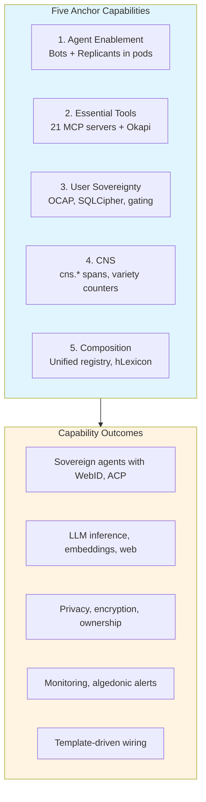

# hKask Architecture Principles

**Purpose:** Foundational principles governing hKask architecture, derived from cybernetic first principles and constraint-driven design.

**Related:** [`AGENTS.md`](../../AGENTS.md), [`hKask-architecture-master.md`](hKask-architecture-master.md)  
**Verification:** `cargo check --workspace`

---

## 1. Five Anchor Capabilities

hKask is built on five non-negotiable anchor capabilities that define the system's boundaries and purpose.[^cybernetics]



<!-- DIAGRAM_ALIGNMENT
id: DIAG-PRIN-001
verified_date: 2026-06-07
verified_against: AGENTS.md; crates/hkask-agents/src/pod.rs; crates/hkask-agents/src/bot.rs; crates/hkask-agents/src/replicant.rs
status: VERIFIED
-->

### 1.1 Agent Enablement

**Principle:** Every agent (bot or replicant) is a sovereign entity with WebID, UCAN capabilities, and ACP communication.[^webid][^ucan][^acp]

**Implementation:**
- Bot/Replicant taxonomy in `hkask-agents` crate
- Agent pods with isolated execution
- A2A (machine-to-machine) and H2A (human-to-agent) interaction modes

**Constraint:** No escalation primitive between bots and replicants. Algedonic alerts handle severity escalation to human.

### 1.2 Essential Tools

**Principle:** Twenty-one MCP servers provide all external tooling — no direct HTTP calls from agents.[^mcp]

**Implementation (21 Total):**

**Enabled (21):**
- `hkask-mcp-inference` — Okapi LLM inference
- `hkask-mcp-condenser` — Context condensation (reranking and compression of the active conversation window)
- `hkask-mcp-web` — Search, scrape, extract
- `hkask-mcp-ocap` — Capability management (Cybernetics, L6)
- `hkask-mcp-keystore` — OS keychain (Cybernetics, L6)
- `hkask-mcp-cns` — CNS operations
- `hkask-mcp-git` — Git CAS
- `hkask-mcp-registry` — Registry operations (cross-loop bridge, L1↔L5)
- `hkask-mcp-spec` — DDMVSS spec capture
- `hkask-mcp-goal` — Goal coordination
- `hkask-mcp-github` — GitHub integration
- `hkask-mcp-fmp` — FMP integration
- `hkask-mcp-telnyx` — Telnyx integration
- `hkask-mcp-fal` — FAL integration
- `hkask-mcp-rss-reader` — RSS feeds
- `hkask-mcp-ensemble` — Multi-agent chat coordination
- `hkask-mcp-episodic` — Episodic memory (private, perspective-bound)
- `hkask-mcp-semantic` — Semantic memory (public, shared)
- `hkask-mcp-replicant` — Replicant chat (MCP bridge for external integrations)
- `hkask-mcp-doc-knowledge` — Document parsing and chunking (HTML/text extraction, multi-tier chunking)
- `hkask-mcp-markitdown` — Document format conversion and OCR (PDF/MD/HTML/TXT + vision OCR fallback)

**Constraint:** All MCP servers are `hkask-*` crates — no external MCP dependencies.

### 1.3 User Sovereignty

**Principle:** Users own their data, control delegation, and enforce privacy through OCAP capability attenuation.[^ocap]

**Implementation:**
- SQLCipher encryption with passphrase-derived keys
- Visibility gating (private/public/semantic/episodic)
- Capability tokens attenuate on each recursive delegation

**Constraint:** No cross-machine sync. Git handles backup. Local-first architecture.

### 1.4 Cybernetic Nervous System (CNS)

**Principle:** All system telemetry flows through CNS spans with variety counters and algedonic alerts.[^beer-cybernetics]

**Implementation:**
- Namespace: `cns.*` (replaces deprecated `okh.*`)
- Spans: `cns.tool.*`, `cns.prompt.*`, `cns.inference.*`, `cns.agent_pod.*`, `cns.connector.*`, `cns.pipeline.*`, `cns.gas.*`, `cns.review.*`, `cns.template.*`, `cns.curation.*`, `cns.variety.*`, `cns.sovereignty.*`, `cns.goal.*`, `cns.spec.*`, `cns.test.*`, `cns.hhh.gate.*`, `cns.hhh.persona.*`, `cns.cybernetics.backpressure`, `cns.memory.encode`, `cns.memory.budget`
- **This is the authoritative CNS span registry.** See `hkask-types::event::CANONICAL_NAMESPACES` for the code-level source of truth.
- Algedonic Alert: Variety deficit > threshold/2 (50 default) → escalate to Curator; deficit > threshold (100 default) → escalate to human

**Constraint:** CNS monitors production system health. Tests verify correctness. Separate concerns.

### 1.5 Composition

**Principle:** Unified registry with `template_type` discriminator enables self-wiring templates.[^jinja2]

**Implementation:**
- Single registry (not three separate)
- Template types: `Prompt`, `Process`, `Cognition`, `Specification`
- hLexicon grounding (75 terms allocated across 3 domains)
- Jinja2 rendering with LLM-based selection

**Constraint:** Selection intelligence in Jinja2/LLM, not Rust code.

### 1.6 Headless System Constraint

**Principle:** hKask has **no visual user interface** — all interaction is through CLI, MCP, or API.[^headless]

**Implementation:**
- `hkask-cli` — Terminal-based REPL and subcommands
- `hkask-mcp-*` — Machine-to-machine tool calls (21 servers)
- `hkask-api` — HTTP API with auto-generated OpenAPI docs

**Constraints:**
- No Grafana, dashboards, or visualization tooling
- No web frontend or GUI components
- No Prometheus/Alertmanager infrastructure
- CNS provides programmatic observability only (spans, variety counters, algedonic alerts)

**Rationale:** Visual interfaces add complexity without enabling core agent platform capabilities. All monitoring, debugging, and operation occurs through:
1. Structured logs (CNS spans)
2. Programmatic queries (CNS APIs)
3. CLI commands (kask subcommands)
4. MCP tool calls (machine-to-machine)

**Verification Command:**
```bash
# Check for visual UI violations
if grep -r "grafana\|prometheus\|dashboard\|visual.*ui\|web.*frontend" crates/ --include="*.rs"; then
  echo "VIOLATION: Visual UI detected"
  exit 1
fi
```

### §1.7 Loop Mapping

The five anchors ground in the [six-loop authority model](loop-architecture.md):

| Anchor | Loop(s) | Rationale |
|--------|---------|-----------|
| 1. Agent Enablement | Curation (Loop 5) | Bot/Replicant pods, ACP, persona — the Curator enables agents |
| 2. Essential Tools | Inference (L1) + Communication (L4) + Cybernetics (L6) + Episodic (L2) | 21 MCP servers span multiple loops: inference (L1), dispatch (L4), OCAP/keystore enforcement (L6), condenser (L2), registry bridge (L1↔L5). See [loop-architecture.md §3.4](loop-architecture.md) for per-server assignments. |
| 3. User Sovereignty | Cybernetics (Loop 6) | OCAP, SQLCipher, affirmative consent, gating — all regulation is Cybernetics |
| 4. CNS | Cybernetics (Loop 6) | Homeostatic self-regulation IS the Cybernetics loop |
| 5. Composition | Semantic (Loop 2b) | Unified registry, hLexicon, cascade — shared knowledge composition |

---

## 2. Constraint-Driven Design (P1–P7, C1–C7)

**Purpose:** Tailoring rules that prevent architectural decay and maintain minimal viable complexity.[^constraints]

### 2.1 Process Constraints (P1–P8)

| # | Constraint | Enforcement |
|---|------------|-------------|
| **P1** | No trait without two consumers | Compiler error if unused |
| **P2** | No generic without two instantiations | Dead code warning |
| **P3** | No module directory without encapsulation | Architecture review |
| **P4** | No builder without fallibility or complexity | Lint rule |
| **P5** | No feature flag without an activator | `cargo deny` check |
| **P6** | Delete stubs, don't publish them | PR review gate |
| **P7** | Prefer deletion over deprecation | Migration strategy |
| **P8** | No test without an invariant | Every `#[test]` verifies a stated behavioral property of a public seam; tests without invariants are structural and must be rewritten or removed |

### 2.2 Conceptual Constraints (C1–C8)

| # | Constraint | Enforcement |
|---|------------|-------------|
| **C1** | A type must be worn before it's tailored | Use before abstract |
| **C2** | Distinguish dead from unwired | Dead code = removed; Unwired = shelf life |
| **C3** | Unwired code has a shelf life | 30-day limit |
| **C4** | Repetition is a missing primitive | DRY violation → extract |
| **C5** | Every error variant is a unique recovery path | No catch-all variants |
| **C6** | A stub is a debt receipt | Track in OPEN_QUESTIONS.md |
| **C7** | When implementations diverge, one must yield | Consolidation required |
| **C8** | Test depth matches module depth | Shallow modules get shallow tests; deep modules get deep tests. If a module is hard to test, deepen the module first (per improve-codebase-architecture skill), then test the deep seam |

**Verification Command:**
```bash
# Check for unused traits (P1)
cargo check --workspace 2>&1 | grep "never used"

# Check for stubs (P6)
grep -r "todo!\|unimplemented!\|FIXME" crates/ --include="*.rs"

# Check for deprecations (P7)
grep -r "#\[deprecated\]" crates/ --include="*.rs"

# Check for tests without invariants (P8)
# A test without a stated behavioral property in its name or doc comment
# is structural and must be rewritten. This check identifies test functions
# that lack a doc comment describing the invariant they verify.
for f in $(find crates/ mcp-servers/ -name '*.rs' -exec grep -l '#\[cfg(test)\]' {} \;); do
  # Report test functions that have no doc comment above them
  awk '/\/\//!/ { doc=$0; next } /#\[test\]/ { getline; if (doc !~ /\/\//) print FILENAME ":" NR ": test without invariant doc: " $0; doc=""; next } !/\/\// { doc="" }' "$f"
done
```

---

## 3. Hexagonal Boundaries

**Principle:** hKask uses ports and adapters pattern to isolate domain logic from external systems.[^cockburn-hexagonal]

```mermaid
graph TD
    subgraph External[External Systems]
        LLM[Okapi LLM]
        MCP_EXT[MCP Servers]
        GIT[Git CAS]
        KEYCHAIN[OS Keychain]
        WEB[Web Search]
    end
    
    subgraph Adapters[Adapters Layer]
        LLM_ADAPTER[LLM Adapter<br/>OkapiConnector]
        MCP_ADAPTER[MCP Adapter<br/>McpRuntime]
        GIT_ADAPTER[Git Adapter<br/>ArtifactStore]
        KEY_ADAPTER[Key Adapter<br/>KeystoreService]
        WEB_ADAPTER[Web Adapter<br/>SearchConnector]
    end
    
    subgraph Ports[Ports Layer]
        INFERENCE_PORT[Inference Port<br/>InferenceProvider]
        STORAGE_PORT[Storage Port<br/>StorageProvider]
        MEMORY_PORT[Memory Port<br/>MemoryProvider]
        SECURITY_PORT[Security Port<br/>SecurityAdapter]
    end
    
    subgraph Domain[Domain Layer — hKask Kernel]
        TEMPLATES[Template Registry<br/>Cascade Engine]
        CNS[CNS<br/>Variety Counters]
        AGENTS[Agent Pods<br/>ACP]
        CAPABILITIES[Capability Model<br/>OCAP]
    end
    
    External --> Adapters
    Adapters --> Ports
    Ports --> Domain
    
    style Domain fill:#e1f5ff
    style Ports fill:#fff3e1
    style Adapters fill:#f3e1ff
```



<!-- DIAGRAM_ALIGNMENT
id: DIAG-PRIN-002
verified_date: 2026-06-07
verified_against: crates/hkask-agents/src/adapters/mod.rs; crates/hkask-mcp/src/runtime.rs; crates/hkask-templates/src/ports.rs
status: VERIFIED
-->

### 3.1 What Crosses the Boundary

| crosses | Type | Direction | Example |
|---------|------|-----------|---------|
| Templates | Inbound | External → Domain | `.j2`, `.yaml` files |
| Capabilities | Outbound | Domain → External | OCAP token delegation |
| ν-events | Outbound | Domain → CNS | `cns.tool.*` spans |
| Embeddings | Bidirectional | Both | Vector storage/retrieval |

### 3.2 What Does NOT Cross the Boundary

| Does Not Cross | Reason |
|----------------|--------|
| Direct HTTP calls | All external I/O via MCP |
| Global state | OCAP discipline |
| Ambient authority | Capabilities required |
| Raw SQL | Storage port abstraction |

---

## 4. Stewardship Principles

**Purpose:** Principles for documentation and collaboration stewardship, derived from the Peripheral project pattern.[^peripheral]

| # | Principle | Statement |
|---|-----------|-----------|
| **PS-01** | Declare Shared Goal | Every collaboration context states its purpose |
| **PS-02** | Document Bounded Lexicon | Domain terms defined in hLexicon |
| **PS-03** | Name Mode of Play | Interaction mode (A2A, H2A) explicit |
| **PS-04** | Prefer Invitational Voice | "Consider" over "must" for human-facing |
| **PS-05** | Procedural Rhetoric in ADRs | Decision consequences articulated |
| **PS-06** | Living Documentation | Docs share code lifecycle (Gentle) |
| **PS-07** | Sourced Ideas | Every ## section has external citation |
| **PS-08** | Mermaid-First | Diagrams inline, not external links |
| **PS-09** | DIAGRAM_ALIGNMENT | Every diagram verified with metadata |
| **PS-10** | Writing Excellence | 3 of 4 dimensions pass (Hopper/Lovelace/Schriver/Gentle) |
| **PS-11** | DDMVSS Alignment | Every document classified by DDMVSS category |
| **PS-12** | Git is Archive | Retired docs recoverable via `git show` |

**Verification Command:**
```bash
# Check PS-07: Citation density
for f in docs/architecture/*.md docs/specifications/*.md; do
  citations=$(grep -c '\[\^' "$f")
  sections=$(grep -c '^## ' "$f")
  [ "$citations" -lt "$sections" ] && echo "MISSING CITATIONS: $f"
done

# Check PS-09: DIAGRAM_ALIGNMENT
for f in docs/**/*.md; do
  if grep -q '```mermaid' "$f"; then
    grep -A5 '```mermaid' "$f" | grep -q 'DIAGRAM_ALIGNMENT' || echo "MISSING: $f"
  fi
done
```

---

## 5. Anti-Patterns (Hallucinations)

**Purpose:** Explicitly excluded patterns that violate hKask minimal design.[^minimalism]

| Anti-Pattern | Status | Rationale |
|--------------|--------|-----------|
| Bot reputation systems | ❌ Excluded | Not MVP |
| Bot swarms / consensus | ❌ Excluded | NO swarms per spec |
| Cross-machine sync | ❌ Excluded | Local-first, Git backup |
| Bot marketplace | ❌ Excluded | Not MVP |
| Curator customization | ❌ Excluded | Single system persona |
| SemVer versioning | ❌ Excluded | Git-only (SHA-based) |
| Separate feedback crate | ❌ Excluded | CNS handles all |
| Promotion pipeline | ❌ Excluded | Episodic/semantic categorical |
| Escalation primitive | ❌ Excluded | Algedonic alerts only |
| Visibility type system | ❌ Excluded | OCAP-enforced |
| OCT-H currency | ❌ Excluded | Not implemented |
| Fine-tuning (axolotl) | ❌ Excluded | Out of scope |
| OpenCode/OpenHands condenser | ❌ Excluded | Out of scope |
| UCAN for hKask | ❌ Excluded | OCAP-only for v0.21.0 |
| Three separate registries | ❌ Excluded | Unified registry |
| Rust-based template selection | ❌ Excluded | Jinja2/LLM selection |
| **Visual UI / dashboards** | ❌ Excluded | Headless system — CLI/MCP/API only |
| **Grafana / monitoring stacks** | ❌ Excluded | CNS provides programmatic observability |
| **Prometheus integration** | ❌ Excluded | Not minimal for MVP; CNS handles telemetry |
| **Alertmanager / alerting infrastructure** | ❌ Excluded | Algedonic alerts are programmatic, not external |

**Verification Command:**
```bash
# Check for anti-pattern implementation
grep -r "reputation\|swarm\|marketplace\|OCT-H\|axolotl" crates/ --include="*.rs"

# Check for visual UI / monitoring infrastructure
grep -r "grafana\|prometheus\|dashboard\|visual.*ui" crates/ docs/ --include="*.rs" --include="*.md"
```

---

## 7. References

[^cybernetics]: Wiener, N. (1948). *Cybernetics: Or Control and Communication in the Animal and the Machine*. MIT Press.
[^headless]: Raymond, E. S. (2003). *The Art of Unix Programming*. Addison-Wesley. Rule of Diversity: "Trust complexity to self-assemble."
[^webid]: Berners-Lee, T. (2009). *WebID: Secure, decentralized, human-friendly identification*. W3C. <https://www.w3.org/2005/Incubator/webid/>.
[^ucan]: Dialo, D. (2021). *UCAN: User-Controlled Authorization Networks*. Protocol Labs. <https://github.com/ucan-wg/spec>.
[^acp]: ACP Runtime. (2026). *Agent Communication Protocol Specification*. <https://github.com/acp-runtime/acp>.
[^mcp]: Model Context Protocol. (2026). *MCP Specification*. <https://modelcontextprotocol.io/>.
[^ocap]: Miller, M. S. (2006). *Robust Composition: Towards a Unified Approach to Access Control and Concurrency Control*. Johns Hopkins University.
[^beer-cybernetics]: Beer, S. (1972). *Brain of the Firm*. Penguin Books. Algedonic alerts defined in Chapter 12.
[^jinja2]: Jinja2 Developers. (2026). *Jinja Template Designer Reference*. <https://jinja.palletsprojects.com/>.
[^constraints]: Gabriel, R. P. (1991). *The Rise of "Worse is Better"*. Lisp Pointers.
[^cockburn-hexagonal]: Cockburn, A. (2005). *Hexagonal Architecture*. <https://alistair.cockburn.us/hexagonal-architecture/>.
[^peripheral]: Peripheral Project. (2026). *Stewardship Principles*. Documented in `docs/standards/STEWARDSHIP.md`.
[^minimalism]: Raymond, E. S. (2001). *The Art of Unix Programming*. Addison-Wesley. Rule: "When in doubt, cut."
[^testing]: hKask Project. (2026). *AGENTS.md §Workspace Integrity*. `/home/mdz-axolotl/Clones/hKask/AGENTS.md`.

---

*These principles are the foundation for all hKask architecture decisions. Deviations require ADR with procedural rhetoric.*
