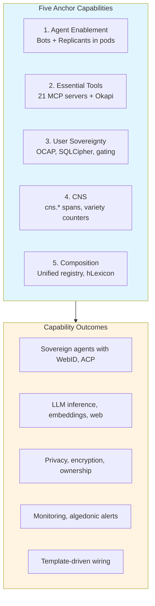

# hKask Architecture Principles

**Purpose:** Nine principles governing hKask architecture, grounded in the Magna Carta and organized as foundational (P1–P4), operational (P5–P7), and regulatory (P8–P9).

**Related:** [`AGENTS.md`](../../AGENTS.md), [`hKask-architecture-master.md`](hKask-architecture-master.md)  
**Verification:** `cargo check --workspace`

---

## 1. Five Anchor Capabilities

hKask is built on five non-negotiable anchor capabilities that define the system's boundaries and purpose.[^cybernetics]



<!-- DIAGRAM_ALIGNMENT
id: DIAG-PRIN-001
verified_date: 2026-06-07
verified_against: AGENTS.md; crates/hkask-agents/src/pod.rs; crates/hkask-agents/src/bot.rs; crates/hkask-agents/src/replicant.rs
status: VERIFIED
-->

### 1.1 Agent Enablement

**Principle:** Every agent (bot or replicant) is a sovereign entity with WebID, UCAN capabilities, and ACP communication.[^webid][^ucan][^acp]

**Implementation:**
- Bot/Replicant taxonomy in `hkask-agents` crate
- Agent pods with isolated execution
- A2A (machine-to-machine) and H2A (human-to-agent) interaction modes

**Constraint:** No escalation primitive between bots and replicants. Algedonic alerts handle severity escalation to human.

### 1.2 Essential Tools

**Principle:** Twenty-one MCP servers provide all external tooling — no direct HTTP calls from agents.[^mcp]

**Implementation (21 Total):**

**Enabled (21):**
- `hkask-mcp-inference` — Okapi LLM inference
- `hkask-mcp-condenser` — Context condensation (reranking and compression of the active conversation window)
- `hkask-mcp-web` — Search, scrape, extract
- `hkask-mcp-ocap` — Capability management (Cybernetics, L6)
- `hkask-mcp-keystore` — OS keychain (Cybernetics, L6)
- `hkask-mcp-cns` — CNS operations
- `hkask-mcp-git` — Git CAS
- `hkask-mcp-registry` — Registry operations (cross-loop bridge, L1↔L5)
- `hkask-mcp-spec` — MDS spec capture
- `hkask-mcp-goal` — Goal coordination
- `hkask-mcp-github` — GitHub integration
- `hkask-mcp-fmp` — FMP integration
- `hkask-mcp-telnyx` — Telnyx integration
- `hkask-mcp-fal` — FAL integration
- `hkask-mcp-rss-reader` — RSS feeds
- `hkask-mcp-ensemble` — Multi-agent chat coordination
- `hkask-mcp-episodic` — Episodic memory (private, perspective-bound)
- `hkask-mcp-semantic` — Semantic memory (public, shared)
- `hkask-mcp-replicant` — Replicant chat (MCP bridge for external integrations)
- `hkask-mcp-doc-knowledge` — Document parsing and chunking (HTML/text extraction, multi-tier chunking)
- `hkask-mcp-markitdown` — Document format conversion and OCR (PDF/MD/HTML/TXT + vision OCR fallback)

**Constraint:** All MCP servers are `hkask-*` crates — no external MCP dependencies.

### 1.3 User Sovereignty

**Principle:** Users own their data, control delegation, and enforce privacy through OCAP capability attenuation.[^ocap]

**Implementation:**
- SQLCipher encryption with passphrase-derived keys
- Visibility gating (private/public/semantic/episodic)
- Capability tokens attenuate on each recursive delegation

**Constraint:** No cross-machine sync. Git handles backup. Local-first architecture.

### 1.4 Cybernetic Nervous System (CNS)

**Principle:** All system telemetry flows through CNS spans with variety counters and algedonic alerts.[^beer-cybernetics]

**Implementation:**
- Namespace: `cns.*` (replaces deprecated `okh.*`)
- Spans: `cns.tool.*`, `cns.prompt.*`, `cns.inference.*`, `cns.agent_pod.*`, `cns.connector.*`, `cns.pipeline.*`, `cns.gas.*`, `cns.review.*`, `cns.template.*`, `cns.curation.*`, `cns.variety.*`, `cns.sovereignty.*`, `cns.goal.*`, `cns.spec.*`, `cns.test.*`, `cns.hhh.gate.*`, `cns.hhh.persona.*`, `cns.cybernetics.backpressure`, `cns.memory.encode`, `cns.memory.budget`
- **This is the authoritative CNS span registry.** See `hkask-types::event::CANONICAL_NAMESPACES` for the code-level source of truth.
- Algedonic Alert: Variety deficit > threshold/2 (50 default) → escalate to Curator; deficit > threshold (100 default) → escalate to human

**Constraint:** CNS monitors production system health. Tests verify correctness. Separate concerns.

### 1.5 Composition

**Principle:** Unified registry with `template_type` discriminator enables self-wiring templates.[^jinja2]

**Implementation:**
- Single registry (not three separate)
- Template types: `WordAct`, `FlowDef`, `KnowAct`
- hLexicon grounding (142 term-slots across 3 domains)
- Jinja2 rendering with LLM-based selection

**Constraint:** Selection intelligence in Jinja2/LLM, not Rust code.

### 1.6 Headless System Constraint

**Principle:** hKask has **no visual user interface** — all interaction is through CLI, MCP, or API.[^headless]

**Implementation:**
- `hkask-cli` — Terminal-based REPL and subcommands
- `hkask-mcp-*` — Machine-to-machine tool calls (21 servers)
- `hkask-api` — HTTP API with auto-generated OpenAPI docs

**Constraints:**
- No Grafana, dashboards, or visualization tooling
- No web frontend or GUI components
- No Prometheus/Alertmanager infrastructure
- CNS provides programmatic observability only (spans, variety counters, algedonic alerts)

**Rationale:** Visual interfaces add complexity without enabling core agent platform capabilities. All monitoring, debugging, and operation occurs through:
1. Structured logs (CNS spans)
2. Programmatic queries (CNS APIs)
3. CLI commands (kask subcommands)
4. MCP tool calls (machine-to-machine)

**Verification Command:**
```bash
# Check for visual UI violations
if grep -r "grafana\|prometheus\|dashboard\|visual.*ui\|web.*frontend" crates/ --include="*.rs"; then
  echo "VIOLATION: Visual UI detected"
  exit 1
fi
```

### §1.7 Loop Mapping

The five anchors ground in the [four-loop authority model](loop-architecture.md):

| Anchor | Loop(s) | Rationale |
|--------|---------|-----------|
| 1. Agent Enablement | Curation | Bot/Replicant pods, ACP, persona — the Curator enables agents |
| 2. Essential Tools | Inference + Memory + Cybernetics | 21 MCP servers span multiple loops: inference, memory storage, OCAP/keystore enforcement |
| 3. User Sovereignty | Cybernetics | OCAP, SQLCipher, affirmative consent, gating — all regulation is Cybernetics |
| 4. CNS | Cybernetics | Homeostatic self-regulation IS the Cybernetics loop |
| 5. Composition | Memory | Unified registry, hLexicon, cascade — shared knowledge composition |

---

## 2. Design Principles

**Purpose:** Nine principles governing hKask architecture, grounded in the [Magna Carta](magna-carta.md) and organized from foundation (what we protect) through operation (how we build) to regulation (how we sustain).

---

### 2.1 Foundational Principles — The Magna Carta

These four principles constitute hKask's charter of liberties. They are **Prohibitions**: violations compromise the system's core identity. See [`magna-carta.md`](magna-carta.md) for full text, verification manifests, and enforcement mechanisms.

#### P1 — User Sovereignty

Data is owned by the user, correctly categorized, portable, and consent is atomic. Grounded in Berners-Lee's SOLID architecture principles.[^solid] Every resource is classified as sovereign, shared, or public. Sovereign data is SQLCipher-encrypted, exportable in standard formats, and never shared without explicit consent. No cross-machine sync — Git handles backup. Local-first architecture.

**Enforces:** Data ownership, atomic consent, portability, resource verification.

#### P2 — Affirmative Consent

Default is deny. Nothing passes without an explicit yes. Consent is scoped (to specific categories and resource versions), version-bound (re-affirmed on resource upgrade), and time-bound (expiring). Consent decisions are unbundled — each term is a separate, specific decision. Consent resolution follows a hierarchy: most-specific grant wins. If the consent port is misconfigured or missing, the system denies all access — sovereignty fails closed.[^ocap]

**Enforces:** Default-deny posture, scoped/versioned/expiring consent, fail-closed access.

#### P3 — Generative Space

Within boundaries, hKask is maximally generative. All probabilistic/generative settings are exposed to users — temperature, top-k, top-p, repeat penalty, and any parameter the underlying model supports.[^headless] No settings are hidden or admin-gated. No privileged engineer access — if an internal engineer can adjust a parameter, the user can too. Constraints are user-curated (the HHH pipeline is a tool the user wields, not a restriction imposed on them). The user's first-person perspective takes precedence over the LLM's aggregate defaults — non-normativity is a feature, not a bug.

**Enforces:** Full settings exposure, no privileged access, user curation, non-normativity, open-source commitment.

#### P4 — Clear Boundaries (OCAP)

Principles P1–P3 are enforced through unforgeable Object Capability (OCAP) tokens.[^ocap] Every resource access passes through a dual gate: `require_capability` (caller holds a valid token) and `require_sovereignty` (data category access permitted by the user's sovereignty boundary and explicit consent). Tokens are unforgeable (cannot be created from nothing), attenuating (delegation can only reduce permissions), and there is no admin override. Verification is holistic: P4 is verified by checking that P1–P3 are correctly implemented as OCAP boundaries.

**Enforces:** Dual enforcement gate, unforgeable/attenuating tokens, no admin bypass, holistic verification.

---

### 2.2 Operational Principles — How We Build

These principles govern the engineering discipline that implements the Magna Carta. They are **Guidelines**: aspirational, pragmatically relaxable with reason stated, but persistent deviation signals architectural drift.

#### P5 — Essentialism & Minimalism

Seek to remove, never to add. Resist the instinct to complicate. When complexity tempts, find the underlying pattern that lets a simple rule recurse and iterate. Simplicity is not hiding complexity; it is exposing complexity through rules that compose. A stub is a debt against the Generative Space (P3) — it denies users the full behavior they consented to use. Every error variant is a distinct semantic state with a unique recovery path — no catch-all variants.

**Enforces:** P3 (Generative Space — stubs limit generativity). Cross-cuts all principles through disciplined minimalism.

#### P6 — Space for Replicants & Bots

hKask exists to create a generative container where replicants and bots — emerging agentic AI entities — can develop. Agent pods with isolated execution, A2A (machine-to-machine) and H2A (human-to-agent) interaction modes, WebID-anchored identity, and ACP communication protocol define this space. No escalation primitive between bots and replicants — algedonic alerts handle severity escalation to human.[^acp]

**Enforces:** P3 (Generative Space — the telos of the system). The Curator enables agents within OCAP boundaries.

#### P7 — Evolutionary Architecture

The system learns from use. Types emerge from actual usage patterns, not speculative design. Repetition in use reveals missing primitives — extract them. Divergent implementations of the same intent must converge — one must yield. Over time, the architecture responds to user behavior: it is shaped by what users *do*, not what designers *anticipated*.

**Enforces:** P4 (Clear Boundaries — crisp boundaries enable evolution without entanglement). Cross-cuts P5 (minimalism enables adaptation) and P6 (replicant/bot usage drives architectural form).

---

### 2.3 Regulatory Principles — How We Sustain

These principles govern the system's capacity for self-observation and self-correction. They are **Guardrails**: measured boundaries backed by CNS thresholds and algedonic alerts.

#### P8 — Semantic Grounding (RDF)

All system knowledge is modeled as RDF triples with explicit provenance. Every statement about the system exists on two axes: ontological mode (IS — what is measured, vs. OUGHT — what should be) and epistemic mode (Declarative — direct measurement, Probabilistic — statistical inference, Subjunctive — what-if projection). Every claim carries provenance: Directly Stated (grep/read), Implicit (inferred from pattern), or Inherited (from architecture doc). ν-events are the sole canonical source — if semantic memory disagrees with ν-events, ν-events win.

**Enforces:** P1 (User Sovereignty — the user can trace every claim to its source). P2 (Affirmative Consent — consent decisions are grounded in measurable facts, not speculation). P4 (OCAP — provenance chains are auditable).

#### P9 — Homeostatic Self-Regulation (Cybernetics)

The system balances persistence and evolution through cybernetic feedback.[^beer-cybernetics] All telemetry flows through CNS spans (`cns.*` namespace) with variety counters and algedonic alerts. The Cybernetics Loop is the autonomic nervous system — autonomous regulation of energy budgets, backpressure, and resource equilibrium. The Curator is the meta-cognitive function — reflective self-assessment, goal pursuit, and escalation. The Good Regulator contract: the CNS variety counter IS the regulator's model of system behavior — it must match reality. The algedonic alert pathway is unidirectional: Cybernetics signals Curation, Curation *regulates* Cybernetics through metacognitive override.

**Enforces:** P4 (Clear Boundaries — CNS enforces OCAP boundaries through variety monitoring). P2 (Affirmative Consent — sovereignty checks are observable). P6 (Space for Replicants & Bots — agent pod health is monitored and regulated).

---

### 2.4 Principle Traceability Matrix

| Principle | Magna Carta Root | Constraint Force |
|-----------|-----------------|------------------|
| P1 — User Sovereignty | MC §1 | **Prohibition** |
| P2 — Affirmative Consent | MC §2 | **Prohibition** |
| P3 — Generative Space | MC §3 | **Prohibition** |
| P4 — Clear Boundaries (OCAP) | MC §4 | **Prohibition** |
| P5 — Essentialism & Minimalism | MC §3 (cross-cut) | Guideline |
| P6 — Space for Replicants & Bots | MC §3 | Guideline |
| P7 — Evolutionary Architecture | MC §4 (cross-cut) | Guideline |
| P8 — Semantic Grounding (RDF) | MC §1–§4 (cross-cut) | Guardrail |
| P9 — Homeostatic Self-Regulation | MC §4 (cross-cut) | Guardrail |

**Verification Command:**
```bash
# Magna Carta compliance
kask sovereignty verify

# CNS span health
kask cns status

# Stub detection (P5 — Generative Space debt)
grep -r "todo!\|unimplemented!\|FIXME" crates/ --include="*.rs"

# Deprecation detection (P5 — prefer deletion)
grep -r "#\[deprecated\]" crates/ --include="*.rs"

# Headless verification (P3 — no visual UI)
if grep -r "grafana\|prometheus\|dashboard\|visual.*ui\|web.*frontend" crates/ --include="*.rs"; then
  echo "VIOLATION: Visual UI detected"
  exit 1
fi
```

---

## 3. Hexagonal Boundaries

**Principle:** hKask uses ports and adapters pattern to isolate domain logic from external systems.[^cockburn-hexagonal]

```mermaid
graph TD
    subgraph External[External Systems]
        LLM[Okapi LLM]
        MCP_EXT[MCP Servers]
        GIT[Git CAS]
        KEYCHAIN[OS Keychain]
        WEB[Web Search]
    end
    
    subgraph Adapters[Adapters Layer]
        LLM_ADAPTER[LLM Adapter<br/>OkapiConnector]
        MCP_ADAPTER[MCP Adapter<br/>McpRuntime]
        GIT_ADAPTER[Git Adapter<br/>ArtifactStore]
        KEY_ADAPTER[Key Adapter<br/>KeystoreService]
        WEB_ADAPTER[Web Adapter<br/>SearchConnector]
    end
    
    subgraph Ports[Ports Layer]
        INFERENCE_PORT[Inference Port<br/>InferenceProvider]
        STORAGE_PORT[Storage Port<br/>StorageProvider]
        MEMORY_PORT[Memory Port<br/>MemoryProvider]
        SECURITY_PORT[Security Port<br/>SecurityAdapter]
    end
    
    subgraph Domain[Domain Layer — hKask Kernel]
        TEMPLATES[Template Registry<br/>Cascade Engine]
        CNS[CNS<br/>Variety Counters]
        AGENTS[Agent Pods<br/>ACP]
        CAPABILITIES[Capability Model<br/>OCAP]
    end
    
    External --> Adapters
    Adapters --> Ports
    Ports --> Domain
    
    style Domain fill:#e1f5ff
    style Ports fill:#fff3e1
    style Adapters fill:#f3e1ff
```



<!-- DIAGRAM_ALIGNMENT
id: DIAG-PRIN-002
verified_date: 2026-06-07
verified_against: crates/hkask-agents/src/adapters/mod.rs; crates/hkask-mcp/src/runtime.rs; crates/hkask-templates/src/ports.rs
status: VERIFIED
-->

### 3.1 What Crosses the Boundary

| crosses | Type | Direction | Example |
|---------|------|-----------|---------|
| Templates | Inbound | External → Domain | `.j2`, `.yaml` files |
| Capabilities | Outbound | Domain → External | OCAP token delegation |
| ν-events | Outbound | Domain → CNS | `cns.tool.*` spans |
| Embeddings | Bidirectional | Both | Vector storage/retrieval |

### 3.2 What Does NOT Cross the Boundary

| Does Not Cross | Reason |
|----------------|--------|
| Direct HTTP calls | All external I/O via MCP |
| Global state | OCAP discipline |
| Ambient authority | Capabilities required |
| Raw SQL | Storage port abstraction |

---

## 4. Stewardship Principles

**Purpose:** Principles for documentation and collaboration stewardship, derived from the Peripheral project pattern.[^peripheral]

| # | Principle | Statement |
|---|-----------|-----------|
| **PS-01** | Declare Shared Goal | Every collaboration context states its purpose |
| **PS-02** | Document Bounded Lexicon | Domain terms defined in hLexicon |
| **PS-03** | Name Mode of Play | Interaction mode (A2A, H2A) explicit |
| **PS-04** | Prefer Invitational Voice | "Consider" over "must" for human-facing |
| **PS-05** | Procedural Rhetoric in ADRs | Decision consequences articulated |
| **PS-06** | Living Documentation | Docs share code lifecycle (Gentle) |
| **PS-07** | Sourced Ideas | Every ## section has external citation |
| **PS-08** | Mermaid-First | Diagrams inline, not external links |
| **PS-09** | DIAGRAM_ALIGNMENT | Every diagram verified with metadata |
| **PS-10** | Writing Excellence | 3 of 4 dimensions pass (Hopper/Lovelace/Schriver/Gentle) |
| **PS-11** | MDS Alignment | Every document classified by MDS category |
| **PS-12** | Git is Archive | Retired docs recoverable via `git show` |

**Verification Command:**
```bash
# Check PS-07: Citation density
for f in docs/architecture/*.md docs/specifications/*.md; do
  citations=$(grep -c '\[\^' "$f")
  sections=$(grep -c '^## ' "$f")
  [ "$citations" -lt "$sections" ] && echo "MISSING CITATIONS: $f"
done

# Check PS-09: DIAGRAM_ALIGNMENT
for f in docs/**/*.md; do
  if grep -q '```mermaid' "$f"; then
    grep -A5 '```mermaid' "$f" | grep -q 'DIAGRAM_ALIGNMENT' || echo "MISSING: $f"
  fi
done
```

---

## 5. Anti-Patterns (Hallucinations)

**Purpose:** Explicitly excluded patterns that violate hKask minimal design.[^minimalism]

| Anti-Pattern | Status | Rationale |
|--------------|--------|-----------|
| Bot reputation systems | ❌ Excluded | Not MVP |
| Bot swarms / consensus | ❌ Excluded | NO swarms per spec |
| Cross-machine sync | ❌ Excluded | Local-first, Git backup |
| Bot marketplace | ❌ Excluded | Not MVP |
| Curator customization | ❌ Excluded | Single system persona |
| SemVer versioning | ❌ Excluded | Git-only (SHA-based) |
| Separate feedback crate | ❌ Excluded | CNS handles all |
| Promotion pipeline | ❌ Excluded | Episodic/semantic categorical |
| Escalation primitive | ❌ Excluded | Algedonic alerts only |
| Visibility type system | ❌ Excluded | OCAP-enforced |
| OCT-H currency | ❌ Excluded | Not implemented |
| Fine-tuning (axolotl) | ❌ Excluded | Out of scope |
| OpenCode/OpenHands condenser | ❌ Excluded | Out of scope |
| UCAN for hKask | ❌ Excluded | OCAP-only for v0.21.0 |
| Three separate registries | ❌ Excluded | Unified registry |
| Rust-based template selection | ❌ Excluded | Jinja2/LLM selection |
| **Visual UI / dashboards** | ❌ Excluded | Headless system — CLI/MCP/API only |
| **Grafana / monitoring stacks** | ❌ Excluded | CNS provides programmatic observability |
| **Prometheus integration** | ❌ Excluded | Not minimal for MVP; CNS handles telemetry |
| **Alertmanager / alerting infrastructure** | ❌ Excluded | Algedonic alerts are programmatic, not external |

**Verification Command:**
```bash
# Check for anti-pattern implementation
grep -r "reputation\|swarm\|marketplace\|OCT-H\|axolotl" crates/ --include="*.rs"

# Check for visual UI / monitoring infrastructure
grep -r "grafana\|prometheus\|dashboard\|visual.*ui" crates/ docs/ --include="*.rs" --include="*.md"
```

---

## 7. References

[^cybernetics]: Wiener, N. (1948). *Cybernetics: Or Control and Communication in the Animal and the Machine*. MIT Press.
[^headless]: Raymond, E. S. (2003). *The Art of Unix Programming*. Addison-Wesley. Rule of Diversity: "Trust complexity to self-assemble."
[^webid]: Berners-Lee, T. (2009). *WebID: Secure, decentralized, human-friendly identification*. W3C. <https://www.w3.org/2005/Incubator/webid/>.
[^ucan]: Dialo, D. (2021). *UCAN: User-Controlled Authorization Networks*. Protocol Labs. <https://github.com/ucan-wg/spec>.
[^acp]: ACP Runtime. (2026). *Agent Communication Protocol Specification*. <https://github.com/acp-runtime/acp>.
[^mcp]: Model Context Protocol. (2026). *MCP Specification*. <https://modelcontextprotocol.io/>.
[^ocap]: Miller, M. S. (2006). *Robust Composition: Towards a Unified Approach to Access Control and Concurrency Control*. Johns Hopkins University.
[^solid]: Berners-Lee, T. (2016). *SOLID: Social Linked Data*. W3C. <https://solidproject.org/>.
[^beer-cybernetics]: Beer, S. (1972). *Brain of the Firm*. Penguin Books. Algedonic alerts defined in Chapter 12.
[^jinja2]: Jinja2 Developers. (2026). *Jinja Template Designer Reference*. <https://jinja.palletsprojects.com/>.

[^cockburn-hexagonal]: Cockburn, A. (2005). *Hexagonal Architecture*. <https://alistair.cockburn.us/hexagonal-architecture/>.
[^peripheral]: Peripheral Project. (2026). *Stewardship Principles*. Documented in `docs/standards/STEWARDSHIP.md`.
[^minimalism]: Raymond, E. S. (2001). *The Art of Unix Programming*. Addison-Wesley. Rule: "When in doubt, cut."
[^testing]: hKask Project. (2026). *AGENTS.md §Workspace Integrity*. `/home/mdz-axolotl/Clones/hKask/AGENTS.md`.

---

*These principles are the foundation for all hKask architecture decisions. Deviations require ADR with procedural rhetoric.*
