<!-- TOGAF_DOMAIN: Cross-cutting -->
<!-- VERSION: 1.0.0 -->
<!-- STATUS: Active -->
<!-- LAST_UPDATED: 2026-05-20 -->

# Documentation Semantic Inventory

**Purpose:** RDF graph mapping of hKask documentation corpus to TOGAF ADM phases, code components, and gap analysis.

**Corpus Size:** 31 markdown files across 6 directories  
**Last-Updated:** 2026-05-20  
**Verification Command:** `find docs -name "*.md" -type f | wc -l`

---

## 1. RDF Graph — Document Relationships

```mermaid
graph TD
    subgraph Preliminary[TOGAF Preliminary Phase]
        DS[DOCUMENTATION_STANDARDS.md]
        WE[WRITING_EXCELLENCE.md]
        SI[SEMANTIC_INVENTORY.md]
    end
    
    subgraph PhaseA[TOGAF Phase A — Vision]
        MASTER[hKask-architecture-master.md]
        INDEX[hKask-architecture-index.md]
        CURATOR[hKask-Curator-persona.md]
    end
    
    subgraph PhaseB[TOGAF Phase B — Business]
        LEXICON[hKask-hLexicon.md]
        OKAPI[okapi-capability-model.md]
    end
    
    subgraph PhaseC_Data[TOGAF Phase C — Data]
        ERD[hKask-erd.md]
        VERD[vKask-erd.md]
        PCERD[pragmatic-composition-erd.md]
        VKASK[vKask-cybernetic-constant.md]
    end
    
    subgraph PhaseC_App[TOGAF Phase C — Application]
        FUTURE[future_work_resolved.md]
        DEFERRED[registry-deferred-work.md]
        OPEN[OPEN_QUESTIONS.md]
    end
    
    subgraph PhaseD[TOGAF Phase D — Technology]
        CHAOS[chaos-testing-spec.md]
        METRICS[metrics-dashboard-spec.md]
        MODELS[MODEL_CATALOG.md]
    end
    
    subgraph PhaseG[TOGAF Phase G — Implementation]
        RUSSELL[russell-acp-agent.md]
        MIGRATION_INV[migration_inventory.md]
        MCP_OPT[mcp_optimization_analysis.md]
    end
    
    MASTER --> ERD
    MASTER --> LEXICON
    MASTER --> OKAPI
    DS --> WE
    DS --> SI
    VKASK --> VERD
    FUTURE --> DEFERRED
    DEFERRED --> OPEN
    
    style Preliminary fill:#e1f5ff
    style PhaseA fill:#fff3e1
    style PhaseB fill:#f3e1ff
    style PhaseC_Data fill:#e1ffe1
    style PhaseC_App fill:#fff9e1
    style PhaseD fill:#ffe1e1
    style PhaseG fill:#f0e1ff
```



<!-- DIAGRAM_ALIGNMENT
id: DIAG-INV-001
verified_date: 2026-05-20
verified_against: docs/architecture/SEMANTIC_INVENTORY.md
status: VERIFIED
-->

---

## 2. Document Classification Matrix

| File Path | TOGAF Phase | Domain | Status | Version | Deprecated Terms |
|-----------|-------------|--------|--------|---------|------------------|
| `docs/standards/DOCUMENTATION_STANDARDS.md` | Preliminary | Cross-cutting | Active | 0.3.0 | None |
| `docs/standards/WRITING_EXCELLENCE.md` | Preliminary | Cross-cutting | Active | 0.3.0 | None |
| `docs/architecture/hKask-architecture-master.md` | A | Business | Active | 0.21.0 | CNS (correct) |
| `docs/architecture/hKask-architecture-index.md` | A | Business | Active | N/A | None |
| `docs/architecture/hKask-erd.md` | C-Data | Data | Active | 0.21.0 | None |
| `docs/architecture/hKask-hLexicon.md` | B | Business | Active | N/A | None |
| `docs/architecture/hKask-Curator-persona.md` | A | Business | Active | N/A | None |
| `docs/architecture/okapi-capability-model.md` | B | Business | Active | N/A | None |
| `docs/architecture/pragmatic-composition-erd.md` | C-Data | Data | Active | 0.21.0 | None |
| `docs/architecture/future_work_resolved.md` | C-App | Application | Active | N/A | None |
| `docs/architecture/registry-deferred-work.md` | C-App | Application | Active | N/A | None |
| `docs/architecture/OPEN_QUESTIONS.md` | C-App | Application | Active | N/A | None |
| `docs/architecture/vKask-cybernetic-constant.md` | C-Data | Data | **Superseded** | N/A | **νKask, OKH** |
| `docs/architecture/vKask-erd.md` | C-Data | Data | **Superseded** | N/A | **νKask, OKH** |
| `docs/specifications/chaos-testing-spec.md` | D | Technology | Draft | N/A | Okapi (external) |
| `docs/specifications/metrics-dashboard-spec.md` | D | Technology | Draft | N/A | Okapi (external) |
| `docs/specifications/MODEL_CATALOG.md` | D | Technology | Active | N/A | None |
| `docs/integrations/russell-acp-agent.md` | G | Implementation | Active | N/A | None |
| `docs/migration/migration_inventory.md` | F | Migration | Active | N/A | None |
| `docs/migration/mcp_optimization_analysis.md` | D | Technology | Active | N/A | None |
| `docs/migration/security_audit_report.md` | G | Implementation | Active | N/A | None |
| `docs/migration/migration_completion_report.md` | F | Migration | Active | N/A | None |
| `docs/progress/*.md` | H | Change | Progress | N/A | Varies |
| `docs/remediation/*.md` | H | Change | Active | N/A | None |
| `docs/decisions/pragmatic-composition-adr.md` | C-App | Application | Active | N/A | None |

---

## 3. Deprecated Terminology Analysis

**Verification Command:**
```bash
grep -r "νKask\|OKH\|three registries\|feedback crate" docs/ --include="*.md"
```

| Document | Deprecated Terms | Occurrences | Action Required |
|----------|------------------|-------------|-----------------|
| `vKask-cybernetic-constant.md` | νKask, OKH | 47 | Archive/supersede |
| `vKask-erd.md` | νKask, OKH | 12 | Archive/supersede |
| `hKask-architecture-index.md` | νKask (reference) | 2 | Update references |
| `hKask-architecture-master.md` | CNS (correct) | 0 | None — already updated |

**Total Files with Deprecated Terms:** 3 (2 require archival, 1 requires update)

---

## 4. Diagram Alignment Status

**Verification Command:**
```bash
grep -l "mermaid" docs/**/*.md | xargs grep -L "DIAGRAM_ALIGNMENT"
```

| Document | Diagram Count | DIAGRAM_ALIGNMENT Blocks | Status |
|----------|---------------|--------------------------|--------|
| `hKask-erd.md` | 4 | 0 | **STALE** |
| `vKask-erd.md` | 3 | 0 | **STALE** (superseded) |
| `pragmatic-composition-erd.md` | 2 | 0 | **STALE** |
| `DOCUMENTATION_STANDARDS.md` | 2 | 2 | ✅ VERIFIED |
| `russell-acp-agent.md` | 1 | 1 | ✅ VERIFIED |
| `migration_inventory.md` | 1 | 0 | **STALE** |
| `mcp_optimization_analysis.md` | 2 | 0 | **STALE** |

**Action Required:** Add DIAGRAM_ALIGNMENT metadata to 6 diagrams across 5 files.

---

## 5. Citation Density Audit

**Verification Command:**
```bash
for f in docs/architecture/*.md docs/specifications/*.md; do
  citations=$(grep -c '\[\^' "$f")
  sections=$(grep -c '^## ' "$f")
  echo "$f: $citations citations / $sections sections"
done
```

| Document | ## Sections | Citations | Status |
|----------|-------------|-----------|--------|
| `hKask-architecture-master.md` | 25 | 0 | **INSUFFICIENT** |
| `hKask-erd.md` | 8 | 0 | **INSUFFICIENT** |
| `hKask-hLexicon.md` | 6 | 0 | **INSUFFICIENT** |
| `okapi-capability-model.md` | 5 | 0 | **INSUFFICIENT** |
| `DOCUMENTATION_STANDARDS.md` | 10 | 12 | ✅ PASS |
| `WRITING_EXCELLENCE.md` | 6 | 11 | ✅ PASS |
| `chaos-testing-spec.md` | 8 | 0 | **INSUFFICIENT** |
| `metrics-dashboard-spec.md` | 12 | 0 | **INSUFFICIENT** |

**Action Required:** Add external citations to 7 architecture/specification documents.

---

## 6. TOGAF Coverage Gap Analysis

| TOGAF Phase | Required Documents | Existing | Gaps |
|-------------|-------------------|----------|------|
| **Preliminary** | Principles, Standards | ✅ DOCUMENTATION_STANDARDS.md, WRITING_EXCELLENCE.md | ❌ PRINCIPLES.md missing |
| **A — Vision** | Vision, Stakeholders | ✅ hKask-architecture-master.md | ⚠️ vision.md should be separate |
| **B — Business** | Business Architecture | ⚠️ Partial (hLexicon, Okapi) | ❌ business-architecture.md missing |
| **C — Data** | Data Models, ERDs | ✅ hKask-erd.md, pragmatic-composition-erd.md | ⚠️ data-architecture.md narrative missing |
| **C — Application** | Application Portfolio | ⚠️ Partial (OPEN_QUESTIONS, deferred) | ❌ application-architecture.md missing |
| **D — Technology** | Infrastructure, Security | ⚠️ Partial (chaos, metrics) | ❌ security-architecture.md missing |
| **E — Opportunities** | Roadmap, Migration | ❌ roadmap.md missing | ⚠️ Only progress reports exist |
| **F — Migration** | Migration Strategy | ⚠️ Partial (migration_inventory) | ❌ strategy.md missing |
| **G — Implementation** | Governance | ❌ GOVERNANCE.md missing | ⚠️ Only audit reports exist |
| **H — Change** | Change Management | ❌ Missing | ⚠️ Progress reports only |
| **Requirements Mgmt** | Traceability | ❌ Missing | No requirements traceability matrix |

**Priority Gaps (High):** PRINCIPLES.md, business-architecture.md, data-architecture.md, application-architecture.md, security-architecture.md, GOVERNANCE.md

---

## 7. Code Component Mapping

| Crate | LOC | Described By | Verification Status |
|-------|-----|--------------|---------------------|
| `hkask-types` | ~2,000 | hKask-erd.md, hKask-architecture-master.md | ✅ Line count matches |
| `hkask-storage` | ~4,000 | hKask-erd.md | ⚠️ Schema not fully documented |
| `hkask-memory` | ~3,000 | (none direct) | ❌ No dedicated spec |
| `hkask-cns` | ~2,000 | vKask-cybernetic-constant.md | ⚠️ Wrong terminology |
| `hkask-templates` | ~5,000 | registry-deferred-work.md | ⚠️ Deferred work only |
| `hkask-agents` | ~2,500 | hKask-Curator-persona.md | ⚠️ Partial |
| `hkask-ensemble` | ~1,500 | (none) | ❌ No dedicated spec |
| `hkask-keystore` | ~1,000 | (none) | ❌ No dedicated spec |
| `hkask-mcp` | ~2,500 | mcp_optimization_analysis.md | ⚠️ Analysis only |
| `hkask-cli` | ~2,000 | (none) | ❌ No dedicated spec |
| `hkask-api` | ~2,000 | (none) | ❌ No dedicated spec |

**MCP Servers (All 10 Missing Specs):**
- `hkask-mcp-inference` — No spec
- `hkask-mcp-storage` — No spec
- `hkask-mcp-memory` — No spec
- `hkask-mcp-embedding` — No spec
- `hkask-mcp-condenser` — No spec
- `hkask-mcp-ensemble` — No spec
- `hkask-mcp-web` — No spec
- `hkask-mcp-scholar` — No spec
- `hkask-mcp-spandrel` — No spec
- `hkask-mcp-doc-knowledge` — No spec

---

## 8. Writing Excellence Pre-Audit

**Preliminary Scores (0-4 scale, Hopper/Lovelace/Schriver/Gentle):**

| Document | H | L | S | G | Total | Pass |
|----------|---|---|---|---|-------|------|
| DOCUMENTATION_STANDARDS.md | 4 | 4 | 4 | 4 | 16 | ✅ Exceptional |
| WRITING_EXCELLENCE.md | 4 | 4 | 4 | 4 | 16 | ✅ Exceptional |
| hKask-architecture-master.md | 3 | 3 | 3 | 2 | 11 | ✅ Excellent |
| hKask-erd.md | 2 | 2 | 3 | 2 | 9 | ✅ Passing |
| OPEN_QUESTIONS.md | 3 | 3 | 3 | 3 | 12 | ✅ Excellent |
| chaos-testing-spec.md | 2 | 2 | 2 | 2 | 8 | ✅ Passing |
| vKask-cybernetic-constant.md | 2 | 2 | 2 | 1 | 7 | ⚠️ Superseded |

**Full audit in Task 2.**

---

## 9. Link Integrity Check

**Verification Command:**
```bash
# Manual check required for relative links
grep -r '\]\(\./\|\.\./\)' docs/ --include="*.md" | head -20
```

**Broken Links Identified:**
- `hKask-architecture-index.md` references `hKask-memory-spec.md` (does not exist)
- Multiple progress reports reference closed PRs (GitHub links may be stale)

---

## 10. Remediation Priority Queue

**Ranked by (Gap Severity × Reader Impact):**

| Priority | Gap | Severity (1-5) | Impact (1-5) | Score | Action |
|----------|-----|----------------|--------------|-------|--------|
| 1 | Missing PRINCIPLES.md | 5 | 5 | 25 | Create from AGENTS.md Five Anchors |
| 2 | Deprecated νKask terminology | 5 | 4 | 20 | Archive vKask-*.md files |
| 3 | Missing security-architecture.md | 5 | 4 | 20 | Create with capability ERD |
| 4 | Missing MCP server specs (10) | 4 | 4 | 16 | Create specs in docs/specifications/mcp/ |
| 5 | Missing diagram alignment (6) | 3 | 3 | 9 | Add DIAGRAM_ALIGNMENT metadata |
| 6 | Insufficient citations (7 docs) | 3 | 3 | 9 | Add external citations |
| 7 | Missing business-architecture.md | 3 | 3 | 9 | Create from master spec §1 |
| 8 | Missing data-architecture.md | 3 | 3 | 9 | Create from storage schema |
| 9 | Missing application-architecture.md | 3 | 3 | 9 | Create from crate structure |
| 10 | Missing GOVERNANCE.md | 2 | 3 | 6 | Create from standards |

---

## 11. Completion Checklist

- [ ] 100% of documents classified by TOGAF phase
- [ ] Every `##` section traced to citation or code verification
- [ ] All deprecated terminology identified (3 files)
- [ ] Diagram alignment gaps enumerated (6 diagrams)
- [ ] Citation density gaps enumerated (7 documents)
- [ ] TOGAF coverage gaps mapped (11 phases, 6 critical gaps)
- [ ] Code component mapping complete (11 crates, 10 MCP servers)
- [ ] Writing excellence pre-audit complete (7 documents scored)
- [ ] Link integrity check performed (2 broken links)
- [ ] Remediation priority queue established (10 items ranked)

---

*This inventory is the baseline for the documentation overhaul. Tasks 2-9 address the gaps identified above.*

**Next Step:** Task 2 — Writing Excellence Audit (full scoring of all 31 documents).
