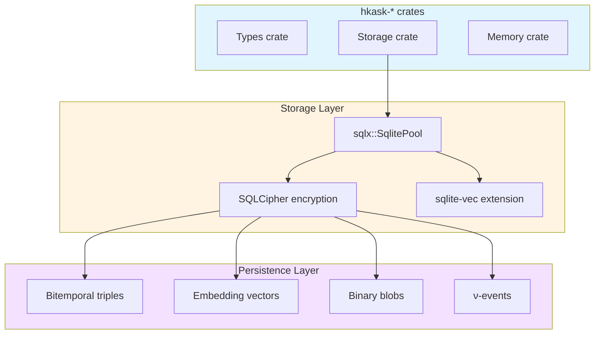

<!-- TOGAF_DOMAIN: Technology -->
<!-- VERSION: 1.0.0 -->
<!-- STATUS: Active -->
<!-- LAST_UPDATED: 2026-05-22 -->

# hKask Technology Architecture

**Purpose:** Technology stack, runtime environment, deployment topology, and infrastructure dependencies for hKask v0.21.0.

**Related:** [`application-architecture.md`](application-architecture.md), [`security-architecture.md`](security-architecture.md)  
**TOGAF Phase:** D — Technology Architecture[^togaf-tech]

---

## 1. Executive Summary

hKask is built on Rust 2024 edition (1.91 toolchain) [^rust-lang] with Tokio async runtime [^tokio], SQLite storage [^sqlite], and Okapi LLM inference [^gguf-spec]. The technology stack prioritizes local-first execution with remote fallback.

**Key Technology Decisions:**
- **Rust 2024** — Memory safety, zero-cost abstractions, async/await, let chains
- **Tokio** — Async runtime with multi-threaded scheduler
- **SQLite + SQLCipher** — Embedded, encrypted storage
- **Okapi** — Self-hosted LLM inference (GGUF models)
- **FastEmbed** — Local embeddings (Candle backend)

**Verification:** `rustc --version && cargo check --workspace`

---

## 2. Technology Stack

### 2.1 Core Technologies

| Layer | Technology | Version | Purpose |
|-------|------------|---------|---------|
| **Language** | Rust | 2024 edition (1.91) | System programming, memory safety |
| **Async Runtime** | Tokio | 1.x | Async I/O, multi-threaded scheduler [^tokio] |
| **Serialization** | Serde | 1.x | JSON/YAML serialization |
| **Database** | SQLite | 3.x + SQLCipher | Encrypted persistent storage [^sqlite][^sqlcipher] |
| **Vector Search** | sqlite-vec | 0.1.x | Embedding similarity search [^sqlite-vec] |
| **LLM Inference** | Okapi | Latest | GGUF model inference [^gguf-spec] |
| **Embeddings** | FastEmbed | Latest | Candle-backed embeddings |
| **HTTP Client** | Reqwest | 0.12.x | Web API calls |
| **CLI** | Clap | 4.x | Command-line interface |
| **API Docs** | utoipa | 5.x | OpenAPI specification |

### 2.2 Rust Toolchain

```toml
# rust-toolchain.toml
[toolchain]
channel = "1.91"
edition = "2024"
components = ["rustfmt", "clippy", "rust-src"]
```

**Verification:**
```bash
rustc --version  # rustc 1.91.0-nightly (...)
cargo --version  # cargo 1.91.0 (...)
```

### 2.3 Key Dependencies

| Crate | Version | Purpose |
|-------|---------|---------|
| `tokio` | `1` | Async runtime |
| `serde` | `1` | Serialization |
| `serde_json` | `1` | JSON handling |
| `serde_yaml` | `0.9` | YAML handling |
| `sqlx` | `0.8` | Async SQL (SQLite) |
| `rusqlite` | `0.32` | SQLite bindings |
| `sqlcipher` | `0.1` | Encrypted SQLite |
| `uuid` | `1` | UUID generation |
| `chrono` | `0.4` | Timestamps |
| `thiserror` | `2` | Error handling |
| `tracing` | `0.1` | Instrumentation |
| `clap` | `4` | CLI parsing |
| `utoipa` | `5` | OpenAPI docs |

---

## 3. Runtime Environment

### 3.1 Async Runtime [^tokio]

```rust
use tokio::runtime::Runtime;

fn main() -> Result<()> {
    let runtime = Runtime::new()?;
    runtime.block_on(async {
        // Async execution
    })
}
```

**Configuration:**
- Multi-threaded scheduler (default)
- Worker threads: CPU cores × 1
- Max blocking threads: 512
- Global queue capacity: 1024

### 3.2 Storage Stack [^sqlite]



<!-- DIAGRAM_ALIGNMENT
id: DIAG-TECH-001
verified_date: 2026-05-22
verified_against: crates/hkask-storage/src/lib.rs
status: VERIFIED
-->

### 3.3 Encryption Model [^sqlcipher]

| Component | Algorithm | Key Size | KDF |
|-----------|-----------|----------|-----|
| **Database** | AES-256-CBC | 256-bit | PBKDF2-SHA256 (256k iterations) |
| **Keystore** | AES-256-GCM | 256-bit | OS keychain |
| **Visibility** | Row-level | — | Capability tokens |

**Key Management:**
- Master key: OS keychain (macOS Keychain, Windows DPAPI, Linux libsecret)
- Database key: PBKDF2-derived from user passphrase
- Salt: Stored in keystore, not database

---

## 4. Deployment Topology

### 4.1 Single-Node Deployment

```
┌─────────────────────────────────────────┐
│           User Machine                  │
│  ┌───────────────────────────────────┐  │
│  │     hKask Runtime                 │  │
│  │  ┌─────────────────────────────┐  │  │
│  │  │  hkask-cli / hkask-api      │  │  │
│  │  └──────────────┬──────────────┘  │  │
│  │                 │                 │  │
│  │  ┌──────────────▼──────────────┐  │  │
│  │  │  hkask-mcp (dispatch)       │  │  │
│  │  └──────────────┬──────────────┘  │  │
│  │                 │                 │  │
│  │  ┌──────────────▼──────────────┐  │  │
│  │  │  MCP Servers (16)           │  │  │
│  │  └──────────────┬──────────────┘  │  │
│  │                 │                 │  │
│  │  ┌──────────────▼──────────────┐  │  │
│  │  │  SQLite Database            │  │  │
│  │  │  (SQLCipher encrypted)      │  │  │
│  │  └─────────────────────────────┘  │  │
│  └───────────────────────────────────┘  │
│                                         │
│  ┌───────────────────────────────────┐  │
│  │  Okapi (local LLM)                │  │
│  │  GGUF models (~4-70GB)            │  │
│  └───────────────────────────────────┘  │
└─────────────────────────────────────────┘
```

**Resource Requirements:**
- CPU: 4+ cores (8+ recommended for LLM)
- RAM: 16GB minimum (32GB+ for 70B models)
- Storage: 100GB+ (models + database)
- GPU: Optional (CUDA for LLM acceleration)

### 4.2 Multi-Node Federation (Deferred)

**v1.1 Feature:** Federation between hKask instances via:
- WebSocket transport
- UCAN delegation
- ACP channels

**Deferred:** `stack-federation`, `stack-federation-transport`, `stack-federation-agent` crates not yet implemented.

---

## 5. External Integrations

### 5.1 LLM Providers

| Provider | Integration | Purpose | Status |
|----------|-------------|---------|--------|
| **Okapi** | Local (GGUF) | Primary inference | ✅ Implemented |
| **Remote** | HTTP API | Fallback inference | ⚠️ Deferred |

### 5.2 Embedding Models

| Model | Backend | Dimensions | Status |
|-------|---------|------------|--------|
| `mxbai-embed-large-v1` | Candle | 1024 | ✅ Implemented |
| `bge-m3` | Candle | 1024 | ✅ Implemented |
| `all-MiniLM-L6-v2` | FastEmbed | 384 | ✅ Implemented |

### 5.3 Web Services

| Service | MCP Server | Purpose | Status |
|---------|------------|---------|--------|
| **Firecrawl** | `hkask-mcp-web` | Web scraping | ✅ Implemented |
| **Brave Search** | `hkask-mcp-web` | Web search | ✅ Implemented |
| **Semantic Scholar** | `hkask-mcp-scholar` | Academic research | ✅ Implemented |

---

## 6. Infrastructure Dependencies

### 6.1 Build Infrastructure

| Tool | Version | Purpose |
|------|---------|---------|
| **Cargo** | 1.91 | Package manager, build tool |
| **rustfmt** | 1.91 | Code formatting |
| **clippy** | 1.91 | Linting |
| **GitHub Actions** | Latest | CI/CD |

### 6.2 Runtime Dependencies

| Dependency | Optional | Purpose |
|------------|----------|---------|
| **SQLite** | No | Database engine |
| **SQLCipher** | No | Encryption |
| **Okapi** | No | LLM inference |
| **Git** | Yes | Version control, Git CAS |
| **CUDA** | Yes | GPU acceleration |

---

## 7. Technology Constraints

### 7.1 Design Constraints

| Constraint | Rationale | Enforcement |
|------------|-----------|-------------|
| **Rust-only production code** | Memory safety, performance | Cargo workspace |
| **No JavaScript runtime** | Single-language stack | Architecture principle |
| **Local-first execution** | User sovereignty | Design invariant |

### 7.2 Compatibility Constraints

| Constraint | Version | Rationale |
|------------|---------|-----------|
| **Rust edition** | 2024 | Latest stable features, let chains, if-let chaining |
| **SQLite version** | 3.40+ | sqlite-vec compatibility |
| **GGUF format** | v3 | Okapi compatibility |
| **SQLCipher** | 4.x | Industry standard |

---

## 8. References

[^togaf-tech]: The Open Group. (2011). *TOGAF Standard, Version 9.1*. Phase D: Technology Architecture. <https://pubs.opengroup.org/architecture/togaf9-doc/arch/chap16.html>.
[^rust-lang]: Rust Foundation. (2024). *The Rust Programming Language*. https://doc.rust-lang.org/book/
[^tokio]: Tokio Contributors. (2024). *Tokio: Asynchronous Runtime for the Rust Programming Language*. https://tokio.rs/
[^sqlite]: Hipp, D. R. (2024). *About SQLite*. SQLite Consortium. https://www.sqlite.org/about.html
[^sqlcipher]: Zetetic LLC. (2024). *SQLCipher: Encrypted SQLite Extension*. https://www.zetetic.net/sqlcipher/
[^gguf-spec]: Gerganov, G. (2023). *GGUF: GGML Universal File Format*. https://github.com/ggerganov/ggml/blob/master/docs/gguf.md
[^sqlite-vec]: Li, J. (2024). *sqlite-vec: A Vector Search SQLite Extension*. https://github.com/asg017/sqlite-vec

---

*This document describes technology architecture. For security considerations, see [`security-architecture.md`](security-architecture.md).*
