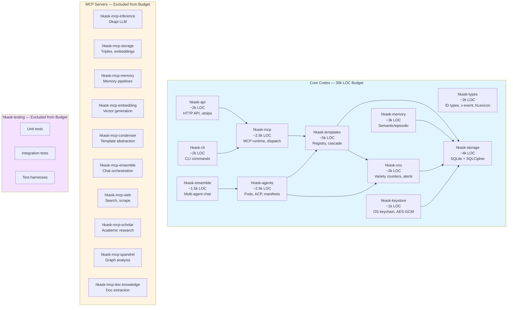
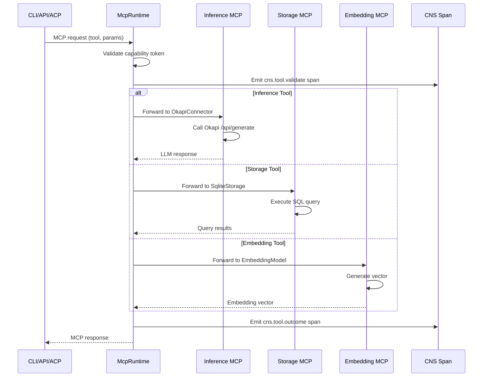
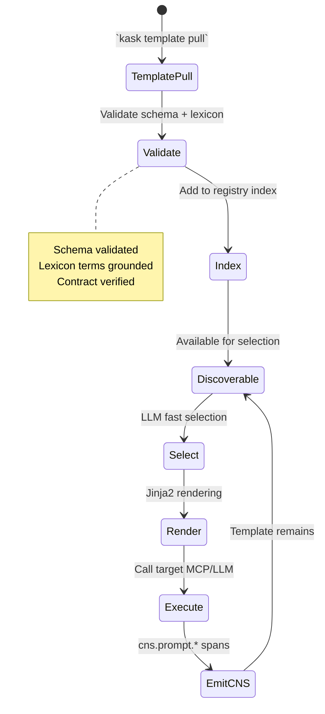

<!-- TOGAF_DOMAIN: Application -->
<!-- VERSION: 1.0.0 -->
<!-- STATUS: Active -->
<!-- LAST_UPDATED: 2026-05-20 -->

# hKask Application Architecture

**Purpose:** 21-crate dependency graph, MCP server dispatch pattern, unified template registry, and bot manifest lifecycle.

**Related:** [`business-architecture.md`](business-architecture.md), [`data-architecture.md`](data-architecture.md)  
**TOGAF Phase:** C — Application Architecture[^togaf-app]

---

## 1. Executive Summary

hKask application architecture consists of 21 Rust crates organized into three layers: Core (11 crates, ≤30k LOC budget), MCP Servers (10 crates, excluded from budget), and Testing (1 crate, excluded from budget).

**Key Design Decisions:**
- **Unified registry** — Single registry with `template_type` discriminator (not three separate)
- **MCP dispatch** — Port/adapter pattern for all 10 MCP servers
- **Bot manifests** — Pull/edit/push lifecycle with YAML validation
- **Template cascade** — Jinja2 rendering with LLM-based selection

**Current LOC:** ~6,400 lines Rust (21% of 30,000 budget)  
**Tests:** 237 passing across workspace

**Verification:** `cargo check --workspace && cargo test --workspace`

---

## 2. Crate Dependency Graph



<!-- DIAGRAM_ALIGNMENT
id: DIAG-APP-001
verified_date: 2026-05-20
verified_against: Cargo.toml workspace definition; docs/architecture/hKask-architecture-master.md:86-123
status: VERIFIED
-->

### 2.1 Crate Responsibilities

| Crate | LOC | Purpose | Key Types |
|-------|-----|---------|-----------|
| `hkask-types` | ~2,000 | ID types, ν-event, hLexicon, visibility | `WebID`, `NuEvent`, `Visibility`, `hLexiconTerm` |
| `hkask-storage` | ~4,000 | SQLite + SQLCipher, triples, vectors, blobs | `TripleStore`, `EmbeddingStore`, `SqliteConnection` |
| `hkask-memory` | ~3,000 | Semantic/episodic pipelines | `SemanticPipeline`, `EpisodicPipeline`, `PromotionRule` |
| `hkask-cns` | ~2,000 | CNS, variety counters, algedonic alerts | `CnsSpan`, `VarietyCounter`, `AlgedonicAlert` |
| `hkask-templates` | ~5,000 | Registry, hLexicon, cascade, resolver | `TemplateRegistry`, `CascadeExecutor`, `hLexiconGrounding` |
| `hkask-agents` | ~2,500 | Pods, ACP, bot/replicant, manifests | `AgentPod`, `BotManifest`, `AcpChannel` |
| `hkask-ensemble` | ~1,500 | Multi-agent chat (NO swarms) | `ChatOrchestrator`, `MultiAgentSession` |
| `hkask-keystore` | ~1,000 | OS keychain, AES-256-GCM | `KeystoreService`, `EncryptionKey` |
| `hkask-mcp` | ~2,500 | MCP runtime, dispatch, security | `McpRuntime`, `DispatchHandler`, `SecurityAdapter` |
| `hkask-cli` | ~2,000 | CLI commands | `KaskCli`, `BotManifestCommand`, `ChatCommand` |
| `hkask-api` | ~2,000 | HTTP API, utoipa OpenAPI | `ApiServer`, `OpenApiSpec`, `HttpHandler` |

---

## 3. MCP Server Dispatch Pattern

### 3.1 Dispatch Architecture



<!-- DIAGRAM_ALIGNMENT
id: DIAG-APP-002
verified_date: 2026-05-20
verified_against: crates/hkask-mcp/src/dispatch.rs
status: VERIFIED
-->

### 3.2 MCP Server Catalog

| Server | Port Trait | Adapter | Tools |
|--------|------------|---------|-------|
| `hkask-mcp-inference` | `InferenceProvider` | `OkapiConnector` | `generate`, `chat`, `complete` |
| `hkask-mcp-storage` | `StorageProvider` | `SqliteStorage` | `store_triple`, `query_triples`, `store_blob` |
| `hkask-mcp-memory` | `MemoryProvider` | `MemoryPipeline` | `promote`, `retrieve`, `condense` |
| `hkask-mcp-embedding` | `EmbeddingProvider` | `EmbeddingModel` | `embed`, `similarity` |
| `hkask-mcp-condenser` | `CondenserProvider` | `TemplateAbstraction` | `abstract`, `summarize` |
| `hkask-mcp-ensemble` | `EnsembleProvider` | `ChatOrchestrator` | `chat`, `coordinate` |
| `hkask-mcp-web` | `WebProvider` | `FirecrawlConnector` | `search`, `scrape`, `extract` |
| `hkask-mcp-scholar` | `ScholarProvider` | `SemanticScholarApi` | `search_papers`, `get_citations` |
| `hkask-mcp-spandrel` | `GraphProvider` | `GraphAnalyzer` | `centrality`, `cluster`, `pathfinding` |
| `hkask-mcp-doc-knowledge` | `DocProvider` | `DocumentParser` | `parse_pdf`, `extract_text` |

---

## 4. Unified Template Registry

### 4.1 Registry Schema

```rust
pub struct Template {
    pub id: TemplateId,
    pub template_type: TemplateType,  // Prompt | Process | Cognition
    pub domain: String,
    pub lexicon_terms: Vec<String>,
    pub contract: TemplateContract,
    pub source_path: PathBuf,
    pub content_type: ContentType,  // Jinja2 | YAML | Markdown
    pub git_sha: Option<String>,
    pub created_by: WebID,
    pub created_at: Timestamp,
}

pub enum TemplateType {
    Prompt,     // LLM prompting
    Process,    // Multi-step workflows
    Cognition,  // Metacognition, reflection
}
```

**Unified Registry:** Single registry with `template_type` discriminator — not three separate registries.[^registry]

### 4.2 Template Lifecycle



<!-- DIAGRAM_ALIGNMENT
id: DIAG-APP-003
verified_date: 2026-05-20
verified_against: crates/hkask-templates/src/registry.rs
status: VERIFIED
-->

---

## 5. Bot Manifest Lifecycle

### 5.1 Manifest Schema

```yaml
# dispatch.yaml example
manifest_version: "1.0"
name: "dispatch-bot"
description: "Routes prompts to appropriate templates"
template_type: Process
steps:
  - name: select
    action: select
    template_ref: "selector.j2"
    model_tier: fast_local
    mcp: inference
  
  - name: populate
    action: populate
    template_ref: "${selected_template_id}"
    bindings:
      prompt: "{{ raw_prompt }}"
  
  - name: execute
    action: execute
    target: "{{ selected_template.contract.target }}"
    mcp: "${selected_template.contract.mcp}"

confidence:
  threshold: 0.75
  escalate_to_model: "qwen3:70b"
```

### 5.2 Lifecycle Commands

| Command | Purpose | Validation |
|---------|---------|------------|
| `kask bot manifest pull <path>` | Load manifest from Git/path | Schema validation |
| `kask bot manifest edit <id>` | Edit manifest (Curator/human only) | Lexicon grounding |
| `kask bot manifest push <remote>` | Push to Git CAS | Provenance tracking |
| `kask bot manifest validate <id>` | Validate manifest | Contract verification |

**Git CAS Bootstrap (Deferred):** v1.0 uses convention-based fixed paths. Git CAS with provenance tracking deferred to v1.1.[^git-cas]

---

## 6. Application Components

### 6.1 Core Components

| Component | Crate | Purpose | Interfaces |
|-----------|-------|---------|------------|
| **Template Registry** | `hkask-templates` | Index, discover, resolve templates | `list()`, `get()`, `select()` |
| **Cascade Executor** | `hkask-templates` | Render templates, execute steps | `execute_cascade()` |
| **Agent Pod** | `hkask-agents` | Bot/replicant lifecycle | `init()`, `delegate()`, `execute()` |
| **CNS Span Emitter** | `hkask-cns` | Record telemetry | `emit_span()`, `check_variety()` |
| **Capability Checker** | `hkask-ensemble` | OCAP verification | `verify()`, `attenuate()` |
| **Security Adapter** | `hkask-mcp` | Path/Jinja2 sanitization | `validate_path()`, `sanitize_jinja2()` |

### 6.2 Component Interaction

```mermaid
componentDiagram
    component [CLI/API/ACP] as Client
    component [MCP Runtime] as Runtime
    component [Template Registry] as Registry
    component [Cascade Executor] as Cascade
    component [Agent Pod] as Pod
    component [CNS] as Cns
    component [MCP Servers] as Mcps
    
    Client --> Runtime
    Runtime --> Registry
    Runtime --> Mcps
    Registry --> Cascade
    Cascade --> Mcps
    Cascade --> Pod
    Pod --> Cns
    Mcps --> Cns
```

<!-- DIAGRAM_ALIGNMENT
id: DIAG-APP-004
verified_date: 2026-05-20
verified_against: crates/hkask-mcp/src/lib.rs
status: VERIFIED
-->

---

## 7. References

[^togaf-app]: The Open Group. (2011). *TOGAF Standard, Version 9.1*. Phase C: Application Architecture. <https://pubs.opengroup.org/architecture/togaf9-doc/arch/chap15.html>.
[^registry]: hKask Project. (2026). *AGENTS.md*. `/home/mdz-axolotl/Clones/hKask/AGENTS.md`.
[^git-cas]: hKask Project. (2026). *docs/architecture/registry-deferred-work.md*. `/home/mdz-axolotl/Clones/hKask/docs/architecture/registry-deferred-work.md`.

---

*This document describes application components. For security architecture, see [`security-architecture.md`](security-architecture.md).*

**Next:** Task 6 — Create `security-architecture.md`.
