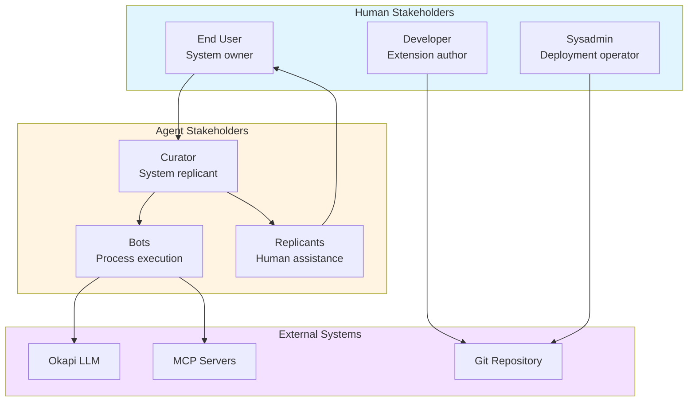
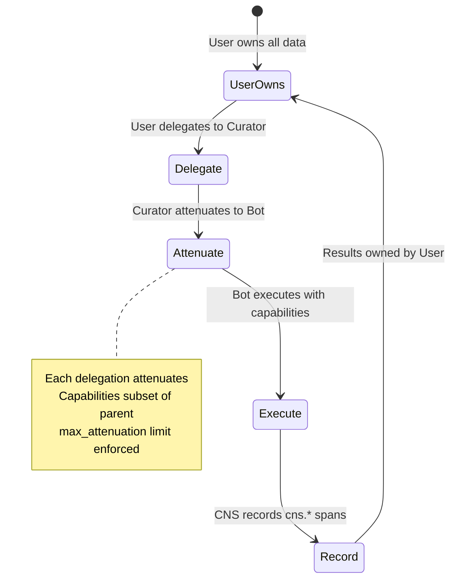
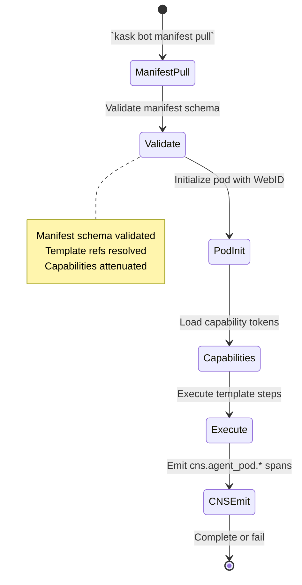

<!-- TOGAF_DOMAIN: Business -->
<!-- VERSION: 1.0.0 -->
<!-- STATUS: Active -->
<!-- LAST_UPDATED: 2026-05-20 -->

# hKask Business Architecture

**Purpose:** Business capabilities, stakeholder map, and OCAP delegation flows for hKask v0.21.0.

**Related:** [`PRINCIPLES.md`](PRINCIPLES.md), [`hKask-architecture-master.md`](hKask-architecture-master.md)  
**TOGAF Phase:** B — Business Architecture[^togaf-adm]

---

## 1. Executive Summary

hKask is a **minimal agent-native container platform** enabling sovereign agents (bots and replicants) to communicate, compose capabilities, and learn through unified template-driven architecture.

**Business Value:**
- Reduces agent integration complexity from weeks to hours via self-wiring templates
- Enables user sovereignty through OCAP capability attenuation
- Provides cybernetic monitoring via CNS with algedonic alerts
- Maintains minimal footprint (≤30,000 LOC Rust kernel)

**Verification:** `cargo check --workspace`

---

## 2. Stakeholder Map



<!-- DIAGRAM_ALIGNMENT
id: DIAG-BIZ-001
verified_date: 2026-05-20
verified_against: docs/architecture/hKask-architecture-master.md:34-46
status: VERIFIED
-->

### 2.1 Human Stakeholders

| Stakeholder | Role | Interaction Mode | Capabilities |
|-------------|------|------------------|--------------|
| **End User** | System owner | H2A via Curator | Own data, delegate capabilities, view CNS alerts |
| **Developer** | Extension author | Git commits | Create templates, modify crates, write tests |
| **Sysadmin** | Deployment operator | CLI, config files | Configure security adapter, backup SQLCipher DB |

### 2.2 Agent Stakeholders

| Stakeholder | Type | Purpose | Visibility |
|-------------|------|---------|------------|
| **Curator** | Replicant | System persona, user counterpart | Public (system-wide) |
| **Bots** | Bot | Process execution (Memory, Spandrel, Scholar) | Public/Shared |
| **Replicants** | Replicant | Human assistance (user-created) | Episodic=Private, Semantic=Public |

**Key Principle:** Bot vs Replicant distinction is **design intent**, not implementation. Both use same pod infrastructure.[^agents]

---

## 3. Business Capabilities

### 3.1 Core Capabilities (19 MCP Servers)

| Capability | MCP Server | Business Service | Status |
|------------|------------|------------------|--------|
| **Embedding** | `hkask-mcp-embedding` | Vector generation, similarity search | ✅ Enabled |
| **Condenser** | `hkask-mcp-condenser` | Template abstraction, summarization | ✅ Enabled |
| **Web** | `hkask-mcp-web` | Search, scrape, extract | ✅ Enabled |
| **Scholar** | `hkask-mcp-scholar` | Academic research | ✅ Enabled |
| **OCAP** | `hkask-mcp-ocap` | Capability management | ✅ Enabled |
| **Keystore** | `hkask-mcp-keystore` | OS keychain operations | ✅ Enabled |
| **CNS** | `hkask-mcp-cns` | CNS operations | ✅ Enabled |
| **Git** | `hkask-mcp-git` | Git CAS operations | ✅ Enabled |
| **Registry** | `hkask-mcp-registry` | Registry operations | ✅ Enabled |
| **GML** | `hkask-mcp-gml` | GML operations | ✅ Enabled |
| **GitHub** | `hkask-mcp-github` | GitHub integration | ✅ Enabled |
| **FMP** | `hkask-mcp-fmp` | FMP integration | ✅ Enabled |
| **Telnyx** | `hkask-mcp-telnyx` | Telnyx integration | ✅ Enabled |
| **FAL** | `hkask-mcp-fal` | FAL integration | ✅ Enabled |
| **RSS Reader** | `hkask-mcp-rss-reader` | RSS feed reading | ✅ Enabled |
| **LLM Inference** | `hkask-mcp-inference` | Okapi-backed text generation | ⚠️ Exists, commented |
| **Storage** | `hkask-mcp-storage` | Bitemporal triples, embeddings, blobs | ⚠️ Exists, commented |
| **Memory** | `hkask-mcp-memory` | Semantic/episodic pipelines | ⚠️ Exists, commented |
| **Ensemble** | `hkask-mcp-ensemble` | Multi-agent chat orchestration | ⚠️ Exists, commented |

**Converted to Templates (per AGENTS.md):**
- `hkask-mcp-spandrel` → Graph analysis templates
- `hkask-mcp-doc-knowledge` → Document extraction templates

### 3.2 OCAP Delegation Flows



<!-- DIAGRAM_ALIGNMENT
id: DIAG-BIZ-002
verified_date: 2026-05-20
verified_against: crates/hkask-ensemble/src/capability.rs
status: VERIFIED
-->

**Ownership Model:**
- User owns all data (triples, embeddings, blobs)
- Modification rights conferred by ownership (no CNS gating)
- OCAP delegation attenuates on each recursive call
- Visibility gating enforced (private/public/semantic/episodic)

---

## 4. Agent Taxonomy

### 4.1 Bot vs Replicant Intent

| Dimension | Bot | Replicant |
|-----------|-----|-----------|
| **Purpose** | Process/task execution | Human assistance |
| **Interaction** | A2A (machine-to-machine) | H2A (human-to-agent) |
| **Default Visibility** | Public/Shared | Episodic=Private, Semantic=Public |
| **Examples** | Memory Bot, Spandrel Bot, Scholar Bot | Curator (default), user-created replicants |
| **Escalation** | Algedonic alerts only | Curator loops human via `kask chat` |

**Key Principles:**
- No escalation primitive between bots and replicants
- Curator's role: loop human into ongoing agent discussion
- Bots produce public artifacts; replicants produce private-by-default (episodic) or public-by-default (semantic/templates)
- Ownership confers modification rights (no CNS gating, no approval flow)[^taxonomy]

### 4.2 Agent Pod Lifecycle



<!-- DIAGRAM_ALIGNMENT
id: DIAG-BIZ-003
verified_date: 2026-05-20
verified_against: docs/architecture/hKask-architecture-master.md:48-78
status: VERIFIED
-->

---

## 5. Capability Domains

### 5.1 Domain Map

| Domain | Bot | Templates | MCP Servers |
|--------|-----|-----------|-------------|
| **Memory** | Memory Bot | `memory/retrieve.j2`, `memory/store.j2` | `hkask-mcp-memory`, `hkask-mcp-storage` |
| **Graph** | Spandrel Bot | `graph/analyze.j2`, `graph/cluster.j2` | `hkask-mcp-spandrel` |
| **Research** | Scholar Bot | `scholar/search.j2`, `scholar/summarize.j2` | `hkask-mcp-scholar`, `hkask-mcp-web` |
| **Inference** | Okapi Bot | `inference/select.j2`, `inference/generate.j2` | `hkask-mcp-inference` |
| **Ensemble** | Ensemble Bot | `ensemble/chat.j2`, `ensemble/coordinate.j2` | `hkask-mcp-ensemble` |

### 5.2 Bot-Mediated Subsystem Pattern

**Pattern:** Each capability domain has an expert bot curator. Curator bots communicate A2A via template-mediated coordination — replacing hand-wired code with self-describing templates.[^bot-mediated]

**Example Flow:**
1. User asks Curator: "Research quantum computing trends"
2. Curator delegates to Scholar Bot: `template:scholar/search`
3. Scholar Bot calls Web MCP, Scholar MCP
4. Results condensed by Condenser MCP
5. Curator presents synthesized answer to user

**Benefit:** No manual code wiring. Templates self-describe inputs, outputs, and contracts.

---

## 6. Security Boundaries

### 6.1 OCAP Enforcement

| Boundary | Enforcement | Adapter |
|----------|-------------|---------|
| **Path Traversal** | Block `../`, absolute paths | `SecurityAdapter::validate_path()` |
| **Jinja2 Injection** | Block `{{ config }}`, `__class__` | `SecurityAdapter::sanitize_jinja2_input()` |
| **Capability Attenuation** | Reduce on delegation | `CascadeContext::child_context()` |
| **Visibility Gating** | Enforce private/public | SQLCipher row-level security |

**Verification:**
```bash
# Test security adapter
cargo test -p hkask-templates test_cascade_security_path_traversal_blocked
cargo test -p hkask-templates test_cascade_context_child_with_attenuation
```

### 6.2 CNS Monitoring

**Spans:**
- `cns.tool.*` — Tool governance, invocation
- `cns.prompt.*` — Render, validate, outcome
- `cns.agent_pod.*` — Lifecycle, delegation
- `cns.connector.*` — External I/O (LLM, embeddings)

**Algedonic Alert:** Variety deficit >100 → escalate to Curator/human[^beer-algedonic]

---

## 7. References

[^togaf-adm]: The Open Group. (2011). *TOGAF Standard, Version 9.1*. Phase B: Business Architecture. <https://pubs.opengroup.org/architecture/togaf9-doc/arch/chap12.html>.
[^agents]: hKask Project. (2026). *AGENTS.md*. `/home/mdz-axolotl/Clones/hKask/AGENTS.md`.
[^taxonomy]: hKask Project. (2026). *hKask Architecture — Master Specification v0.21.0*. §1.2 Agent Taxonomy.
[^bot-mediated]: hKask Project. (2026). *hKask Architecture — Master Specification v0.21.0*. §1.3 Bot-Mediated Subsystem Pattern.
[^beer-algedonic]: Beer, S. (1972). *Brain of the Firm*. Penguin Books. Chapter 12: The Algedonic Alert.

---

*This document describes business capabilities and stakeholder relationships. For data architecture, see [`data-architecture.md`](data-architecture.md).*

**Next:** Task 3.4 — Create `data-architecture.md` (TOGAF Phase C-Data).
