# Semantic Graph Condensation — Task 1

**Provenance key:**
- **DS** = Directly Stated (grep/read verified)
- **IM** = Implicit (inferred from pattern)
- **IH** = Inherited (from architecture doc)
- **USR** = Directly Stated by user (grill-me session)

---

## 1a — RDF Triple Decomposition

### Crate-Level Concepts

#### hkask-types

| Concept | Semantic Role | Duplicates In | Projected From | Force | Prov. | IS/OUGHT |
|---------|--------------|---------------|----------------|-------|-------|----------|
| `WebID` | DomainEntity | — | — | Prohibition | DS | IS |
| `Id<T>` / `BotID` / etc. | DomainEntity | — | — | Guideline | DS | IS |
| `NuEvent` | Sensor | `Span` (same crate) | Event reporting requirement | Hypothesis | USR | OUGHT |
| `Span` / `SpanNamespace` | Sensor | `NuEvent` (same crate) | Event reporting requirement | Hypothesis | USR | OUGHT |
| `CurationDecision` | Regulator | — | — | Guideline | DS | IS |
| `OcapTokenKind` | Regulator | — | — | Prohibition | IH | IS |
| `OCAPBoundary` | Regulator | `SovereigntyChecker` (agents) | — | Prohibition | IH | IS |
| `Visibility` (3 variants) | DomainEntity | — | User's 2-tier model | Guideline | USR | OUGHT |
| `Goal` / `GoalState` | DomainEntity | — | — | Guideline | DS | IS |
| `AgentKind` | DomainEntity | — | — | Guideline | DS | IS |
| `AgentDefinition` / `Charter` / `PersonaConstraints` | DomainEntity | — | — | Guideline | DS | IS |
| `LoopMessage` / `Signal` / `LoopId` / `WorkerKind` | PassThrough | `tokio::mpsc` | Standard async channels | Hypothesis | USR | OUGHT |
| `AuthContext` | Adapter | — | — | Guardrail | DS | IS |
| `TemporalBounds` | DomainEntity | — | — | Guideline | DS | IS |
| `Confidence` | DomainEntity | — | — | Guideline | DS | IS |
| `BundleManifest` / `BundleSkill` | DomainEntity | — | — | Guideline | DS | IS |
| `AllostericGate` | Regulator | — | — | Guardrail | IH | IS |
| `HkaskError` | DomainEntity | `ServiceError` (services) | — | Guideline | DS | IS |
| `LLMParameters` | DomainEntity | — | — | Guideline | DS | IS |

#### hkask-storage

| Concept | Semantic Role | Duplicates In | Force | Prov. | IS/OUGHT |
|---------|--------------|---------------|-------|-------|----------|
| `Triple` / `TripleStore` | DomainEntity | — | Guardrail | DS | IS |
| `NuEventStore` | Sensor | — | Guardrail | DS | IS |
| `Spec` / `SpecId` / `SpecCategory` | DomainEntity | — | Guideline | DS | IS |
| `GoalSpec` / `Criterion` | DomainEntity | — | Guideline | DS | IS |
| `SpecCurationRecord` | Regulator | — | Guideline | DS | IS |
| `EmbeddingStore` | Adapter | — | Guideline | DS | IS |
| `ConsentStore` | Regulator | — | Prohibition | IH | IS |
| `SovereigntyBoundaryStore` | Regulator | — | Prohibition | IH | IS |

#### hkask-memory

| Concept | Semantic Role | Force | Prov. | IS/OUGHT |
|---------|--------------|-------|-------|----------|
| `EpisodicMemory` | DomainEntity | Guideline | DS | IS |
| `SemanticMemory` | DomainEntity | Guideline | DS | IS |
| `ConsolidationBridge` | PassThrough | Guideline | DS | IS |
| `EpisodicLoop` | Regulator | Guideline | IH | IS |
| `SemanticLoop` | Regulator | Guideline | IH | IS |

#### hkask-cns

| Concept | Semantic Role | Force | Prov. | IS/OUGHT |
|---------|--------------|-------|-------|----------|
| `CnsRuntime` | Regulator | Guardrail | DS | IS |
| `CyberneticsLoop` | Regulator | Guardrail | IH | IS |
| `VarietyMonitor` / `VarietyTracker` | Sensor | Guardrail | DS | IS |
| `EnergyBudget` / `EnergyBudgetManager` | Regulator | Guardrail | DS | IS |
| `GovernedTool` | Regulator | Prohibition | IH | IS |
| `CircuitBreaker` | Regulator | Guardrail | DS | IS |
| `AllostericGate` | Regulator | Guardrail | IH | IS |
| `SetPoints` | Regulator | Guardrail | DS | IS |
| `RuntimeAlert` | Sensor | Guardrail | DS | IS |

#### hkask-agents (⚠️ OVERLOADED — 3+ loop domains)

| Concept | Semantic Role | Force | Prov. | IS/OUGHT |
|---------|--------------|-------|-------|----------|
| `AgentPod` / `PodLifecycleState` | DomainEntity | Guideline | USR | OUGHT |
| `PodManager` | Regulator | Guideline | DS | IS |
| `AcpRuntime` / `A2AMessage` | Adapter | Guideline | DS | IS |
| `MessageDispatch` | PassThrough | Hypothesis | USR | OUGHT |
| `CuratorAgent` / `DefaultSpecCurator` | Regulator | Guideline | DS | IS |
| `CurationLoop` | Regulator | Guideline | IH | IS |
| `InferenceLoop` | Regulator | Guideline | IH | IS |
| `LoopSystem` | Regulator | Guideline | DS | IS |
| `SovereigntyChecker` | Regulator | Prohibition | IH | IS |
| `ConsentManager` | Regulator | Prohibition | IH | IS |
| `EnsembleChat` / `StandingSession` | DomainEntity | Guideline | DS | IS |
| `EscalationQueue` | Regulator | Guardrail | DS | IS |

#### hkask-services (Strangler Fig — extracted domain operations)

| Concept | Semantic Role | Force | Prov. | IS/OUGHT |
|---------|--------------|-------|-------|----------|
| `ServiceContext` | Adapter | Guideline | DS | IS |
| `ServiceConfig` | Adapter | Guideline | DS | IS |
| `ServiceError` | Adapter | Guideline | DS | IS |
| `ChatService` | DomainEntity | Guideline | DS | IS |
| `InferenceService` | DomainEntity | Guideline | DS | IS |
| `ComposeService` | DomainEntity | Guideline | DS | IS |
| `EmbedService` | DomainEntity | Guideline | DS | IS |
| `VerificationService` | Regulator | Prohibition | IH | IS |
| `OnboardingService` | Adapter | Guideline | DS | IS |

---

## 1b — Redundancy Detection (Root-Cause Drilldown)

### Ranked Subsumption Candidates

#### #1 — Visibility: 3 variants → 2 ⭐⭐⭐ DECLARATIVE

```
:Visibility-3variants  hkask:isRedundantProjectionOf  :Visibility-2tier .
:Shared                hkask:subsumedBy               :Public .
```

**Test:** Can `Shared` behavior be reconstructed from `Public`? **Yes.** Both mean "accessible to all agents." The 3-variant enum is a hallucinated over-specification.

**Action:** Merge `Shared` → `Public`. Result: `Visibility { Public, Private }`.

**Risk:** Minimal. Same access semantics under a unified name.

---

#### #2 — NuEvent/Span dual event-reporting ⭐⭐ PROBABILISTIC

```
:NuEvent            hkask:overlapsWith  :Span .
:EventReportingReq  hkask:subsumes      :NuEvent, :Span .
```

Both are event-reporting abstractions. The user states neither was explicitly designed — both are agent fabrications.

**Test:** Can behavior be reconstructed from one type with a category field? **Likely yes.** NuEvent with `category: EventCategory` covers both. Code verification needed to confirm Span doesn't carry unique data NuEvent doesn't.

**Action:** Examine both types in code. If Span is purely taxonomic, collapse into NuEvent with category discriminator. If Span carries unique payload, document the split rationale.

**Risk:** Medium. CNS and Curation both consume these — changes must preserve both paths.

---

#### #3 — LoopMessage/Signal → tokio channels ⭐⭐ PROBABILISTIC

```
:LoopMessage  hkask:isRedundantProjectionOf  :tokio_mpsc .
:Signal       hkask:isRedundantProjectionOf  :tokio_mpsc .
:WorkerKind   hkask:isRedundantProjectionOf  :tokio_task .
```

Custom loop messaging infrastructure is a reimplementation of Rust's async primitives. With Communication demoted from a loop to transport, these become redundant.

**Test:** Can loop communication be implemented with `tokio::mpsc` + `tokio::task`? **Likely yes.** The `LoopPayload` variants may need preservation as channel message types.

**Action:** Code verification for any unique behavior in loop message types (priority routing, typed dispatch). Replace with standard channels if no unique semantics found.

**Risk:** Medium-High. Infrastructure touching every crate. Must preserve all message semantics.

---

#### #4 — Pod/Agent/Service model restructuring ⭐⭐⭐ DECLARATIVE

Not a subsumption — structural clarification of muddled boundaries in `hkask-agents`.

**User's model:**
- **Pod:** isolated execution container
- **Agent:** entity with WebID, capabilities — lives in a pod
- **Services:** what the pod provides access to (inference, memory, tools)
- **ACP:** agent-to-agent communication — separate from pod lifecycle

**Risk:** Medium. Same entities, clarified boundaries.

---

#### #5 — EnergyBudget ↔ EnergyBudget naming drift ⭐⭐⭐ DECLARATIVE

```
:EnergyBudget  hkask:sameAs  :EnergyBudget .
```

Loop-architecture.md §1 uses "EnergyBudget." Code uses "EnergyBudget." Same concept, different name.

**Action:** Reconcile naming. No code change needed.

**Risk:** Minimal.

---

### Summary

| Rank | Candidate | Confidence | Action | Risk |
|------|-----------|------------|--------|------|
| #1 | Visibility 3→2 | ⭐⭐⭐ Declarative | Delete `Shared` variant | Minimal |
| #2 | NuEvent/Span unification | ⭐⭐ Probabilistic | Examine code; collapse if possible | Medium |
| #3 | LoopMessage → tokio | ⭐⭐ Probabilistic | Replace custom messaging | Medium-High |
| #4 | Pod/Agent/Service | ⭐⭐⭐ Declarative | Clarify model boundaries | Medium |
| #5 | EnergyBudget naming | ⭐⭐⭐ Declarative | Reconcile naming only | Minimal |

---

## 1c — Structural Mermaid ERD

```mermaid
erDiagram
    hkask-types ||--o{ WebID : "defines"
    hkask-types ||--o{ Id-T : "defines"
    hkask-types ||--o{ "NuEvent ⚠️" : "defines"
    hkask-types ||--o{ "Span ⚠️" : "defines"
    hkask-types ||--o{ "Visibility(3) ⚠️" : "defines"
    hkask-types ||--o{ OcapTokenKind : "defines"
    hkask-types ||--o{ OCAPBoundary : "defines"
    hkask-types ||--o{ Goal : "defines"
    hkask-types ||--o{ AgentDefinition : "defines"
    hkask-types ||--o{ "LoopMessage ⚠️" : "defines"
    hkask-types ||--o{ Signal : "defines"
    hkask-types ||--o{ Confidence : "defines"
    hkask-types ||--o{ HkaskError : "defines"

    "NuEvent ⚠️" ||--|| "Span ⚠️" : "overlaps-with"
    "Visibility(3) ⚠️" ||--|| "User-2-tier" : "projected-from"
    "LoopMessage ⚠️" ||--|| "tokio-mpsc" : "projected-from"

    hkask-storage ||--o{ Triple : "persists"
    hkask-storage ||--o{ NuEventStore : "persists"
    hkask-storage ||--o{ Spec : "persists"
    hkask-storage ||--o{ ConsentStore : "enforces"

    hkask-memory ||--o{ EpisodicMemory : "Loop-2a"
    hkask-memory ||--o{ SemanticMemory : "Loop-2b"
    hkask-memory ||--o{ ConsolidationBridge : "bridges"
    EpisodicMemory ||--|| SemanticMemory : "consolidates-into"

    hkask-cns ||--o{ CnsRuntime : "Loop-6"
    hkask-cns ||--o{ CyberneticsLoop : "orchestrates"
    hkask-cns ||--o{ VarietyMonitor : "senses"
    hkask-cns ||--o{ "EnergyBudget ⚠️" : "regulates"
    hkask-cns ||--o{ GovernedTool : "enforces"
    hkask-cns ||--o{ CircuitBreaker : "protects"
    hkask-cns ||--o{ AllostericGate : "regulates"
    hkask-cns ||--o{ RuntimeAlert : "emits"

    "EnergyBudget ⚠️" ||--|| "EnergyBudget(doc)" : "sameAs"

    hkask-agents ||--o{ AgentPod : "⚠️overloaded"
    hkask-agents ||--o{ PodManager : "⚠️overloaded"
    hkask-agents ||--o{ AcpRuntime : "⚠️overloaded"
    hkask-agents ||--o{ CuratorAgent : "⚠️overloaded"
    hkask-agents ||--o{ CurationLoop : "Loop-5"
    hkask-agents ||--o{ InferenceLoop : "Loop-1"
    hkask-agents ||--o{ LoopSystem : "⚠️overloaded"
    hkask-agents ||--o{ SovereigntyChecker : "⚠️overloaded"
    hkask-agents ||--o{ ConsentManager : "⚠️overloaded"
    hkask-agents ||--o{ EnsembleChat : "⚠️overloaded"

    hkask-templates ||--o{ Registry : "provides"
    hkask-templates ||--o{ ManifestExecutor : "executes"
    hkask-templates ||--o{ OkapiInference : "adapts"

    hkask-services ||--o{ ServiceContext : "✅extracted"
    hkask-services ||--o{ ChatService : "✅extracted"
    hkask-services ||--o{ InferenceService : "✅extracted"
    hkask-services ||--o{ ComposeService : "✅extracted"
    hkask-services ||--o{ EmbedService : "✅extracted"
    hkask-services ||--o{ VerificationService : "✅extracted"

    hkask-cli ||--|| hkask-services : "depends-on"
    hkask-api ||--|| hkask-services : "depends-on"

    hkask-services ||--|| hkask-agents : "depends-on"
    hkask-services ||--|| hkask-cns : "depends-on"
    hkask-services ||--|| hkask-memory : "depends-on"
    hkask-services ||--|| hkask-templates : "depends-on"
    hkask-services ||--|| hkask-storage : "depends-on"
```



**Legend:**
- 🔴 `⚠️` — Candidate for subsumption/deletion (Task 1b)
- 🟡 `⚠️overloaded` — `hkask-agents` contains 3+ loop domains
- 🟢 `✅extracted` — Already in `hkask-services` (Strangler Fig)
- 🔵 `sameAs / projected-from` — Subsumption relationship

---

## Next: User Approval

Per the task specification, **present ranked subsumption candidates for approval before any deletion.**

**Awaiting your decision on candidates #1–#5 above.** Which proceed to Task 3 (Service-Layer Condensation)?
