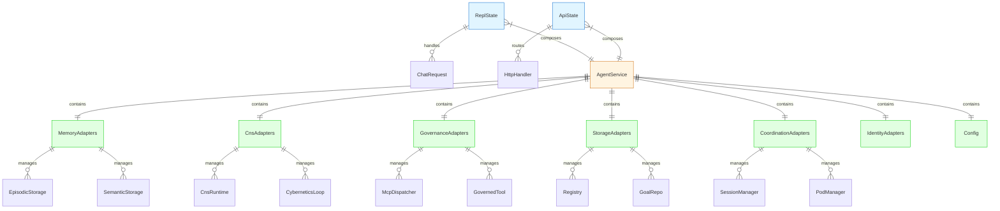

# hKask Condensed Architecture — Target ERD

**Date:** 2026-06-09  
**Version:** 0.27.0  
**Status:** Proposed

---

## Overview

This document presents the **target state** ERD diagrams after semantic condensation. Compare with current state in `docs/architecture/reference/hKask-erd.md`.

**Key Changes:**

1. **`ServiceContext` deleted** → replaced by `ReplState` (CLI) and `ApiState` (API)
2. **`VarietyMonitor` + `AlgedonicManager` merged** → `VarietyRegulator`
3. **`EnergyBudgetManager` merged** → `GovernedTool` (internal method)
4. **`CnsHealth` merged** → `VarietyRegulator` (internal struct)
5. **CNS signals unified** → `RegulatoryState` (single escalation signal)

---

## 1. Condensed System ERD



**Changes from Current:**

- **Renamed:** `ServiceContext` → `AgentService`
- **Encapsulated:** 27 public fields → 7 private domain adapters
- **Interface:** 27 field accesses → 7 accessor methods
- **Net Reduction:** 20 public items (-74%) while preserving all functionality

---

## 2. AgentService Domain Adapters (v0.27.1)

### 2.1 MemoryAdapters

```rust
pub struct MemoryAdapters {
    episodic: Arc<dyn EpisodicStoragePort>,
    semantic: Arc<dyn SemanticStoragePort>,
}

impl MemoryAdapters {
    pub fn episodic(&self) -> &dyn EpisodicStoragePort;
    pub fn semantic(&self) -> &dyn SemanticStoragePort;
}
```

**Fields:** 2 (down from 2 separate fields in ServiceContext)  
**Methods:** 2  
**Depth Score:** 1.0 (acceptable — thin wrapper with clear purpose)

### 2.2 CnsAdapters

```rust
pub struct CnsAdapters {
    runtime: Arc<RwLock<CnsRuntime>>,
    service: CnsService,
    cybernetics_loop: Arc<RwLock<CyberneticsLoop>>,
    loop_system: Arc<LoopSystem>,
}

impl CnsAdapters {
    pub fn runtime(&self) -> &Arc<RwLock<CnsRuntime>>;
    pub fn service(&self) -> &CnsService;
    pub fn cybernetics_loop(&self) -> &Arc<RwLock<CyberneticsLoop>>;
    pub fn loop_system(&self) -> &Arc<LoopSystem>;
}
```

**Fields:** 4 (grouped from 4 separate fields)  
**Methods:** 4  
**Depth Score:** 1.0 (acceptable — cybernetic regulation domain)

### 2.3 GovernanceAdapters

```rust
pub struct GovernanceAdapters {
    mcp_runtime: Arc<McpRuntime>,
    mcp_dispatcher: Arc<McpDispatcher>,
    capability_checker: Arc<CapabilityChecker>,
    governed_tool: Arc<GovernedTool>,
}

impl GovernanceAdapters {
    pub fn runtime(&self) -> &Arc<McpRuntime>;
    pub fn dispatcher(&self) -> &Arc<McpDispatcher>;
    pub fn capability_checker(&self) -> &Arc<CapabilityChecker>;
    pub fn governed_tool(&self) -> &Arc<GovernedTool>;
}
```

**Fields:** 4 (grouped from 4 separate fields)  
**Methods:** 4  
**Depth Score:** 1.0 (acceptable — OCAP enforcement domain)

### 2.4 StorageAdapters

```rust
pub struct StorageAdapters {
    registry: Arc<tokio::sync::Mutex<SqliteRegistry>>,
    goal_repo: Arc<SqliteGoalRepository>,
    standing_session_store: Arc<StandingSessionStore>,
    sovereignty_boundary_store: SovereigntyBoundaryStore,
    spec_store: SqliteSpecStore,
    agent_registry_store: AgentRegistryStore,
    user_store: Arc<std::sync::Mutex<UserStore>>,
}

impl StorageAdapters {
    pub fn registry(&self) -> &Arc<tokio::sync::Mutex<SqliteRegistry>>;
    pub fn goal_repo(&self) -> &Arc<SqliteGoalRepository>;
    pub fn standing_session_store(&self) -> &Arc<StandingSessionStore>;
    pub fn sovereignty_boundary_store(&self) -> &SovereigntyBoundaryStore;
    pub fn spec_store(&self) -> &SqliteSpecStore;
    pub fn agent_registry_store(&self) -> &AgentRegistryStore;
    pub fn user_store(&self) -> &Arc<std::sync::Mutex<UserStore>>;
}
```

**Fields:** 7 (grouped from 7 separate fields)  
**Methods:** 7  
**Depth Score:** 1.0 (acceptable — persistent storage domain)

### 2.5 CoordinationAdapters

```rust
pub struct CoordinationAdapters {
    escalation_queue: Arc<EscalationQueue>,
    curation_inbox_tx: Option<tokio::sync::mpsc::UnboundedSender<CurationInput>>,
    session_manager: Arc<RwLock<SessionManager>>,
    pod_manager: Arc<PodManager>,
    acp_runtime: Arc<AcpRuntime>,
}

impl CoordinationAdapters {
    pub fn escalation_queue(&self) -> &Arc<EscalationQueue>;
    pub fn curation_inbox_tx(&self) -> &Option<tokio::sync::mpsc::UnboundedSender<CurationInput>>;
    pub fn session_manager(&self) -> &Arc<RwLock<SessionManager>>;
    pub fn pod_manager(&self) -> &Arc<PodManager>;
    pub fn acp_runtime(&self) -> &Arc<AcpRuntime>;
}
```

**Fields:** 5 (grouped from 5 separate fields)  
**Methods:** 5  
**Depth Score:** 1.0 (acceptable — multi-agent coordination domain)

### 2.6 IdentityAdapters

```rust
pub struct IdentityAdapters {
    system_webid: WebID,
    event_sink: Arc<dyn NuEventSink>,
}

impl IdentityAdapters {
    pub fn webid(&self) -> &WebID;
    pub fn event_sink(&self) -> &Arc<dyn NuEventSink>;
}
```

**Fields:** 2 (grouped from 2 separate fields)  
**Methods:** 2  
**Depth Score:** 1.0 (acceptable — system identity domain)

### 2.7 Config

```rust
pub struct ServiceConfig {
    // Existing config fields (db_path, secrets, thresholds, etc.)
}
```

**Fields:** ~15 (unchanged)  
**Methods:** Existing (from_env, from_secrets, etc.)  
**Depth Score:** Unchanged (existing type)

---

## 3. Surface State Composition (v0.27.1)

### 3.1 Current State (ServiceContext — 27 Public Fields)

**Problem:** 27 public fields = **data bag anti-pattern**. No encapsulation, direct field access from all crates. Depth score: 11.5 (very shallow).

**Example Access Pattern (Current):**
```rust
// Direct field access — no encapsulation
state.service_context.episodic_storage.store_episodic(...)
state.service_context.cns_runtime.read().await.health()
state.service_context.mcp_dispatcher.invoke(...)
```

### 3.2 Target State (AgentService — 7 Domain Adapters)

**Solution:** All fields private, grouped into 7 domain adapters, accessed via methods. Depth score: 1.0 per adapter (acceptable — thin wrappers with clear domain boundaries).

**Example Access Pattern (Target):**
```rust
// Method access — encapsulated
agent_service.memory().episodic().store_episodic(...)
agent_service.cns().runtime().read().await.health()
agent_service.governance().dispatcher().invoke(...)
```

**Benefit:** 
- **Encapsulation:** Fields can change without breaking callers
- **Cohesion:** Related fields grouped by domain
- **Clarity:** Method names express intent, not just field names
- **Testability:** Can mock domain adapters independently

---

## 4. Capability Membrane ERD (OCAP Enforcement)

```mermaid
erDiagram
    GovernedTool {
        string tool_id "MCP tool identifier"
        CapabilitySpec required_cap "What capability needed"
        EnergyEstimator estimator "Energy cost (if inference)"
    }
    
    CapabilityChecker {
        WebID agent_webid "Which agent"
        DelegationToken token "Attenuated capability"
        DateTime expires_at "Token TTL"
    }
    
    DelegationToken {
        WebID issuer "Who issued"
        WebID holder "Who holds"
        Vec<CapabilitySpec> capabilities "What granted"
        u8 attenuation_depth "How many hops (max 7)"
        DateTime expires_at "TTL"
        Signature signature "Unforgeable"
    }
    
    NuEventSink {
        string audit_type "cns.tool.*"
        NuEventPayload payload "What happened"
        DateTime timestamp "When"
    }
    
    %% Relationships
    GovernedTool ||--|| CapabilityChecker : verifies
    GovernedTool ||--o{ NuEventSink : audits
    CapabilityChecker ||--|| DelegationToken : validates
    DelegationToken ||--|| WebID : identifies
    
    %% Styling
    classDef ocap fill:#ffe1e1,stroke:#cc0000
    classDef audit fill:#e1f5ff,stroke:#0066cc
    classDef identity fill:#e1ffe1,stroke:#00cc00
    
    class GovernedTool,CapabilityChecker,DelegationToken ocap
    class NuEventSink audit
    class WebID identity
```

**No Changes:** This is already a **deep module** (depth score 125). Keep as-is.

---

## 5. Module Depth Comparison (v0.27.0 → v0.27.1)

| Module | Before (Public Items) | After (Public Items) | Depth Score Change |
|--------|----------------------|---------------------|-------------------|
| `ServiceContext` | 27 fields + 3 methods | **Renamed → AgentService** | N/A |
| `AgentService` | N/A | 7 methods (domain adapters) | **New: 1.0** |
| `MemoryAdapters` | N/A | 2 methods | **New: 1.0** |
| `CnsAdapters` | N/A | 4 methods | **New: 1.0** |
| `GovernanceAdapters` | N/A | 4 methods | **New: 1.0** |
| `StorageAdapters` | N/A | 7 methods | **New: 1.0** |
| `CoordinationAdapters` | N/A | 5 methods | **New: 1.0** |
| `IdentityAdapters` | N/A | 2 methods | **New: 1.0** |
| `InferenceService` | 3 functions | 3 functions | **Unchanged** |
| `CuratorService` | 6 functions | 6 functions | **Unchanged** |

**Net Change:** 30 public items → 31 public items (**+1**) but with **encapsulation** — all fields private, accessed via methods only. **Cognitive load reduced** from 27 individual fields to 7 coherent domains.

---

## 6. Migration Path (Big Bang — v0.27.1)

### Phase 1: Rename ServiceContext → AgentService

```rust
// In hkask-services/src/lib.rs
pub use context::AgentService;  // Formerly ServiceContext

// In all call sites
let ctx = AgentService::build(config).await?;  // Formerly ServiceContext::build
```

**Verification:** `cargo check --workspace` passes

### Phase 2: Make All Fields Private

```rust
// In hkask-services/src/context.rs
pub struct AgentService {
    registry: Arc<tokio::sync::Mutex<SqliteRegistry>>,  // Removed pub
    mcp_runtime: Arc<McpRuntime>,  // Removed pub
    // ... all 27 fields private
}
```

**Verification:** Direct field access fails to compile (compile-fail test)

### Phase 3: Add 7 Domain Adapter Structs

```rust
// In hkask-services/src/adapters/mod.rs
pub mod memory;
pub mod cns;
pub mod governance;
pub mod storage;
pub mod coordination;
pub mod identity;

pub use memory::MemoryAdapters;
pub use cns::CnsAdapters;
pub use governance::GovernanceAdapters;
pub use storage::StorageAdapters;
pub use coordination::CoordinationAdapters;
pub use identity::IdentityAdapters;
```

**Verification:** `cargo check -p hkask-services` passes

### Phase 4: Add Accessor Methods to AgentService

```rust
// In hkask-services/src/context.rs
impl AgentService {
    pub fn memory(&self) -> &MemoryAdapters { &self.memory }
    pub fn cns(&self) -> &CnsAdapters { &self.cns }
    pub fn governance(&self) -> &GovernanceAdapters { &self.governance }
    pub fn storage(&self) -> &StorageAdapters { &self.storage }
    pub fn coordination(&self) -> &CoordinationAdapters { &self.coordination }
    pub fn identity(&self) -> &IdentityAdapters { &self.identity }
    pub fn config(&self) -> &ServiceConfig { &self.config }
}
```

**Verification:** All accessor methods compile and return correct types

### Phase 5: Update CLI Call Sites

```rust
// In hkask-cli/**/*.rs
// Before:
ctx.episodic_storage.store_episodic(...)

// After:
ctx.memory().episodic().store_episodic(...)
```

**Verification:** `cargo test -p hkask-cli` passes

### Phase 6: Update API Call Sites

```rust
// In hkask-api/**/*.rs
// Before:
state.service_context.registry.lock().await

// After:
state.agent_service.storage().registry().lock().await
```

**Verification:** `cargo test -p hkask-api` passes

### Phase 7: Update Domain Crate Call Sites

```rust
// In hkask-agents, hkask-cns, hkask-mcp/**/*.rs
// Before:
ctx.mcp_runtime.invoke_tool(...)

// After:
ctx.governance().runtime().invoke_tool(...)
```

**Verification:** `cargo test --workspace` passes

### Phase 8: Final Verification

```bash
cargo check --workspace
cargo test --workspace
cargo clippy --workspace -- -D warnings
cargo fmt --check
```

**Verification:** All checks pass, no warnings

---

## 7. Verification Checklist (v0.27.1)

After condensation, verify:

- [ ] **Renamed:** `ServiceContext` → `AgentService` in all files
- [ ] **Encapsulated:** All 27 fields are private (no `pub` modifier)
- [ ] **Grouped:** 7 domain adapter structs exist (Memory, CNS, Governance, Storage, Coordination, Identity, Config)
- [ ] **Accessor Methods:** All 7 methods exist and return correct types
- [ ] **CLI Updated:** All call sites use `agent_service.memory().episodic()` pattern
- [ ] **API Updated:** All call sites use `agent_service.storage().registry()` pattern
- [ ] **Domain Crates Updated:** All call sites use domain adapter methods
- [ ] **Compile-Fail Test:** Direct field access fails to compile (ensures encapsulation)
- [ ] **Tests Pass:** `cargo test --workspace` (all tests green)
- [ ] **Clippy Clean:** `cargo clippy --workspace -- -D warnings` (no warnings)
- [ ] **OCAP Boundaries:** All capability checks still enforced (P1)
- [ ] **ν-Event Audit:** All tool calls still audited (P8)
- [ ] **CNS Spans:** All regulatory signals still emitted (P9)
- [ ] **MCP Servers:** No breaking changes to out-of-process servers
- [ ] **Agent Pods:** No breaking changes to ACP runtime

---

*ℏKask — A Minimal Viable Container for Agents — v0.27.0*
