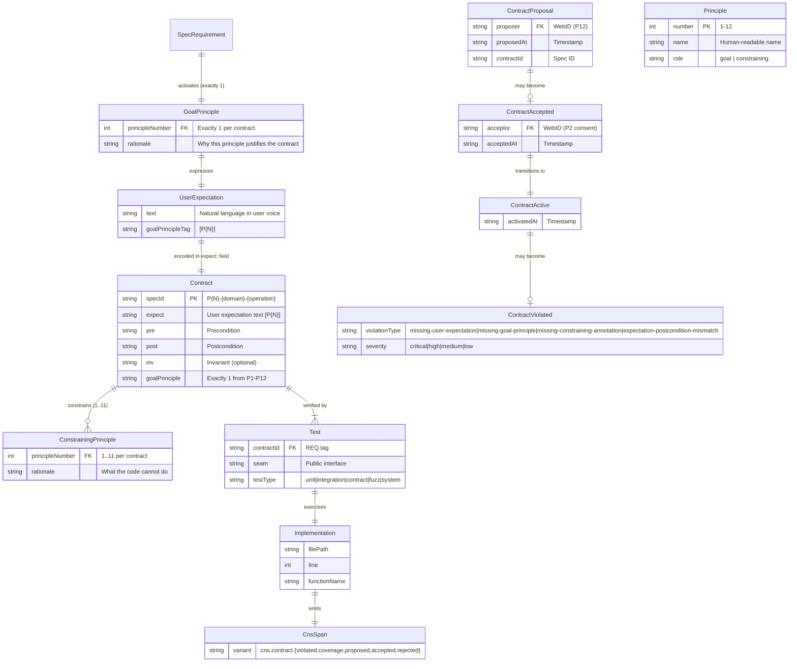
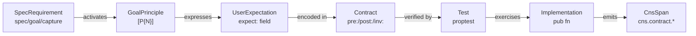
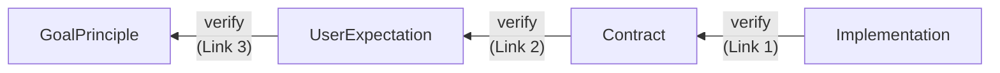
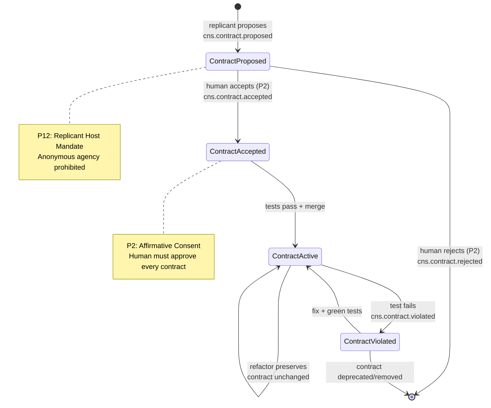
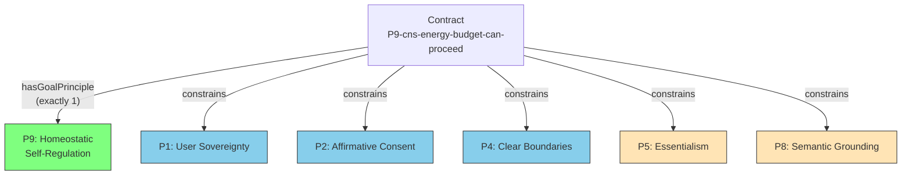

# Contract Traceability Entity-Relationship Diagram

Rendered from `hkask-types::cns::CnsSpan` variants. All edges are materialized by the contract-audit toolchain.

## Forward Chain (Top-Down Traceability)

## Reverse Verification Chain (Bottom-Up)

## Contract Lifecycle State Machine

## Constraining Principle Fan-Out

## RDF Triple Graph — Gap Detection Model

Every gap is a missing or broken triple in the contract graph:

| Gap | Missing Triple |
|-----|---------------|
| Missing `expect:` field | `Contract → hasUserExpectation → EMPTY` |
| Missing `[P{N}]` tag | `UserExpectation → hasGoalPrinciple → EMPTY` |
| Wrong goal principle | `Contract → hasGoalPrinciple → WRONG_Principle` |
| Missing constraining annotation | `Contract → hasConstrainingPrinciple → MISSING` |
| Unanchored test | `Test → verifiesContract → EMPTY` (no REQ tag) |
| Expectation-postcondition mismatch | `UserExpectation` text ≠ `Postcondition` semantics |

## CNS Span ↔ Template Mapping

| CNS Span | Template(s) That Emit |
|----------|----------------------|
| `cns.contract.violated` | tdd-verify (missing fields, mismatches), tdd-gap-check (constraint gaps), contract-audit.sh --principles |
| `cns.contract.coverage` | tdd-verify (coverage ratio), contract-audit.sh --expect |
| `cns.contract.proposed` | tdd-tracer (new contract), Phase B2 workflow |
| `cns.contract.accepted` | tdd-plan (approval gate), Phase B3 consent workflow |
| `cns.contract.rejected` | tdd-verify (rejected proposals), Phase B3 consent workflow |
