# hKask Functional Specification

**Version:** v0.31.0
**Created:** 2026-06-16
**Status:** Active — anchor for the Testing Discipline. Contracts use `expect:` + `[P{N}]` annotations with CNS-observed behavioral contracts.
**Last Updated:** 2026-07-12
**Decision:** 2026-06-21 — Contract system simplified. REQ tags and contract IDs removed. Contracts use `expect:` + `[P{N}]` annotations directly on functions. Enforcement is through CNS span observation and property-based testing.

> This document maps the complete system to its motivating principles and enumerates functional requirements per domain. Every contract carries a **goal principle** (the explicit user functional expectation the contract enforces) and **constraining principles** (the other principles that constrain how the goal is achieved). See [`TESTING_DISCIPLINE.md`](TESTING_DISCIPLINE.md) for the definitive contract standard — this document defines the *domain-to-contract mapping*, not the contract format itself.

---

## 1. Domain Breakdown

### Domain Map

| # | Domain | Short Tag | Crate | Contracts | User Expectation | Goal Principle |
|---|---------|-----------|-------|-----------|-----------------|----------------------|
| 1 | Energy Budgeting | `energy` | hkask-cns | 20 | System prevents runaway agent resource consumption | P9 (Homeostatic Self-Regulation) |
| 2 | Algedonic Signalling | `algedonic` | hkask-cns | 4 | System alerts when regulation thresholds are breached | P9 (Homeostatic Self-Regulation) |
| 3 | Runtime Observability | `runtime` | hkask-cns | 24 | System provides unified CNS observability and regulation feedback | P9 (Homeostatic Self-Regulation) |
| 4 | Tool Governance | `gov-tool` | hkask-cns | 3 | System gates tool execution behind OCAP capability checks | P9 (Homeostatic Self-Regulation) |
| 5 | Inference Governance | `gov-inf` | hkask-cns | 2 | System gates inference calls behind gas budget checks | P9 (Homeostatic Self-Regulation) |
| 6 | Circuit Breaking | `circuit` | hkask-cns | 3 | System prevents cascading failures in external service calls | P9 (Homeostatic Self-Regulation) |
| 7 | API Metering | `api` | hkask-cns | 8 | System enforces per-key rate limits and gas tracking | P9 (Homeostatic Self-Regulation) |
| 8 | Energy Estimation | `est` | hkask-cns | 2 | System estimates energy costs for regulated operations | P9 (Homeostatic Self-Regulation) |
| 9 | Cybernetics Loop | `loop` | hkask-cns | 1 | System maintains homeostatic regulation via feedback loops | P9 (Homeostatic Self-Regulation) |
| 10 | Wallet | `wallet` | hkask-wallet | 23 | System manages rJoule balances and energy-based payments | P9 (Homeostatic Self-Regulation) |
| 11 | Storage | `storage` | hkask-storage | 168 | System provides durable hMem storage across all domains | P3 (Generative Space) |
| 12 | Memory | `memory` | hkask-memory | 68 | System stores and retrieves episodic and semantic knowledge | P3 (Generative Space) |
| 13 | Inference Engine | `inference` | hkask-inference | 94 | System regulates LLM calls across provider boundaries | P9 + P4 (Homeostatic + Boundary) |
| 14 | Template Engine | `templates` | hkask-templates | 53 | System renders skill templates into executable prompts | P3 (Generative Space) |
| 15 | MCP Servers | `mcp` | mcp-servers/ | 41 | System provides single-responsibility tool servers | P5 (Essentialism) |
| 16 | Service Layer | `services` | the service layer subcrates | 305+ | System composes a single service layer shared by CLI and API (10 subcrates: core, chat, compose, context, corpus, kata-kanban, onboarding, runtime, skill, wallet) | P5 + P7 (Essentialism + Evolution) |
| 17 | Agent Runtime | `agents` | hkask-agents | 159 | User's agents operate within sovereignty boundaries | P1 (User Sovereignty) |
| 18 | Communication | `comm` | hkask-communication | 25 | Agents communicate through user-owned channels | P1 (User Sovereignty) |
| 19 | Keystore | `keystore` | hkask-keystore | 5 | User's keys are generated, stored, and rotated securely | P1 (User Sovereignty) |
| 20 | Type System | `types` | hkask-types | 40 | System types are semantically grounded and provenance-aware | P8 (Semantic Grounding) |
| 21 | API Surface | `api` | hkask-api | 28 | User accesses all functionality through a REST API with sovereignty enforcement and streaming WebSocket chat | P1 + P4 (Sovereignty + Boundaries) |
| 22 | CLI Surface | `cli` | kask | 12 | User accesses all functionality through a single binary CLI | P3 (Generative Space) |
| 23 | Web Interface | `web` | hkask-api | 21 | User signs in via OAuth and gets a browser terminal with streaming WSS chat | P1 + P4 (Sovereignty + Boundaries) |
| 24 | Multi-User | `multi-user` | hkask-api + hkask-storage | 12 | Users share a server with scoped data and admin-managed membership | P1 (User Sovereignty) + P2 (Affirmative Consent) |
| 25 | Backup & Migration | `backup` | hkask-storage + hkask-api | 14 | User exports and migrates their data as a portable encrypted archive | P1 (User Sovereignty) + P3 (Generative Space) |
| 26 | Deployment | `deploy` | hkask-cli + hkask-agents | 20 | User deploys pods with a single binary and one command | P5 (Essentialism) + P3 (Generative Space) |
| 27 | Code Understanding | `codegraph` | hkask-codegraph | 10 | Agents query, traverse, and analyze the codebase through a semantic code graph | P3 (Generative Space) + P9 (Homeostatic Self-Regulation) |
| 28 | Dual-Model Classification | `classify` | hkask-services-runtime | 9 | System classifies text using two peer models from different jurisdictions, integrating extractions with divergence detection — no single model is the sole gate to semantic memory | P3 (Generative Space) + P8 (Semantic Grounding) |
| 29 | Content Safety Guard | `guard` | hkask-guard | 6 | System enforces mandatory content safety controls — prompt injection, role override, and secret leakage detection are always active and cannot be disabled | P3.1 (Social Generativity) |
| 30 | Memory Remember (Dual-Model) | `memory-remember` | hkask-templates | 3 | System extracts episodic and semantic hMems from agent operations using dual-model classification — both peer models render the same template and outputs are integrated | P3.1 (Social Generativity) + P8 (Semantic Grounding) |

### Domain Anchoring Rules

Each domain's contracts trace upward through constraining principles to a single goal principle, which itself traces to a Magna Carta principle (P1–P4). The user expectation column above captures the OUGHT that drives principle selection per domain. Key anchoring rules:

1. **P9 (Homeostatic Self-Regulation)** owns all CNS regulation-loop contracts: energy, algedonic, runtime, circuit breaker, API metering, energy estimation, tool governance, inference governance
2. **P4 (Clear Boundaries)** is the primary constraining principle on CNS governance contracts — the OCAP membrane that enforces boundaries. It does not serve as a goal principle in CNS.
3. **P8 (Semantic Grounding)** owns all type-level identity contracts: `GasCost`, `EnergyDelta` newtypes
4. **P12 (Subscriber Consent)** owns all subscriber/consent contracts: `subscribe`, `subscribe_async`
5. **P3 (Generative Space)** owns all sync/blocking variants and content-domain contracts: blocking accessors, storage, memory, CLI
6. **P7 (Evolutionary Architecture)** owns all configurable-from-real-usage contracts: threshold calibration, replenish rate tuning
7. **P1 (User Sovereignty) + P2 (Affirmative Consent)** own the web interface, multi-user, and backup domains: OAuth sessions, PTY terminals, role assignment, invitation flow, portable sovereignty archives
8. **P5 (Essentialism) + P3 (Generative Space)** own the deployment domain: single-binary packaging, sidecar generation, systemd integration

A contract has **exactly one goal principle** and **1 to 11 constraining principles**. Constraining principles appear as `[P{N}]` annotations in the contract body.

---

## 1.5 Service Layer Architecture

**Crates:** `hkask-services-core` through `hkask-services-wallet` — 10 subcrates providing shared business logic for CLI and API surfaces.

**MCP layer distinction:** `hkask-mcp` is the runtime library (`McpRuntime`, `McpDispatcher`, `RawMcpToolPort`) linked in-process by `AgentService`. The `mcp-servers/` directory contains individual out-of-process server implementations (`hkask-mcp-codegraph`, `hkask-mcp-research`, etc.) that never depend on `AgentService` (P1 Prohibition — out-of-process isolation).

**Canonical specification:** This Service Layer Architecture section — full domain spec, accessor methods, depth test results, and service boundary definitions.

### 1.5.1 AgentService Structure

`AgentService` is the canonical service layer owning all shared infrastructure. All **9 fields** are **private** — four nested sub-context structs (`InfraContext`, `GovernanceContext`, `CnsContext`, `StorageContext`) consolidate domain-coherent infrastructure, while five cross-cutting fields hold WebID, curator signal, config, inference loop, and governed tool state. `AgentService::build(config)` assembles all shared infrastructure once at startup.

#### Sub-Contexts

| Sub-Context | Field | Contains |
|-------------|-------|----------|
| `InfraContext` | `infra` | `inference`, `episodic`, `semantic`, `mcp` (McpRuntime), `pods` (ActivePods), `wallet`, `daemon`, `matrix`, `seams` (SeamWatcher), `wallet_gas`, `federation` |
| `GovernanceContext` | `governance` | `checker` (CapabilityChecker), `consent` (ConsentManager), `dispatcher` (McpDispatcher), `a2a` (A2ARuntime), `escalations` (EscalationQueue), `events`, `curation_tx` |
| `CnsContext` | `cns` | `runtime` (CnsRuntime), `cybernetics` (CyberneticsLoop), `loops` (LoopSystem), `events` (NuEventSink), `energy` (CalibratedEnergyEstimator), `tool_stats` (ToolStats) |
| `StorageContext` | `storage` | `registry` (SqliteRegistry), `goals` (SqliteGoalRepository), `agents` (AgentRegistryStore), `users` (UserStore), `sovereignty` (SovereigntyBoundaryStore), `wallet` (WalletStore) |

#### Public Methods (20)

| Method | Returns | Group |
|--------|---------|-------|
| `build(config)` | `Result<Self, ServiceError>` (async) | Construction |
| `infra()` | `&InfraContext` | Context accessor |
| `governance()` | `&GovernanceContext` | Context accessor |
| `cns()` | `&CnsContext` | Context accessor |
| `storage()` | `&StorageContext` | Context accessor |
| `config()` | `&ServiceConfig` | Identity |
| `webid()` | `&WebID` | Identity |
| `identity()` | `(&WebID, &Arc<A2ARuntime>)` | Identity |
| `seam_summary()` | `Option<SeamSummary>` (async) | CNS / Infra |
| `curator_ready()` | `Result<(), String>` (async, `&mut self`) | CNS / Infra |
| `governed_tool(webid)` | `Arc<GovernedTool<RawMcpToolPort>>` | CNS / Infra |
| `inference_loop()` | `Option<&Arc<InferenceLoop>>` | CNS / Infra |
| `set_inference_loop(il)` | `()` (`&mut self`) | CNS / Infra |
| `inference_port()` | `Option<Arc<dyn InferencePort>>` | CNS / Infra |
| `gas_remaining()` | `Option<u64>` | CNS / Infra |
| `gas_cap()` | `Option<u64>` | CNS / Infra |
| `build_per_agent_memory(db, sink)` | `PerAgentMemory` (assoc. fn) | Memory |
| `per_agent_memory(agent_name)` | `Result<PerAgentMemory, ServiceError>` | Memory |
| `consolidate_agent_memory(agent_name, request)` | `Result<ConsolidationOutcome, ServiceError>` | Memory |
| `consolidation_status_for(agent_name)` | `Result<(usize, usize, usize), ServiceError>` | Memory |

**Design rationale:** The nested sub-context pattern groups domain-coherent infrastructure into deep modules (Ousterhout) — callers access a sub-context once and navigate its public fields, rather than calling individual accessors for every field. Cross-cutting concerns (gas, governed tool, per-agent memory consolidation) remain direct methods on `AgentService` because they span multiple sub-contexts or require coordination logic.

Both CLI and API surfaces compose `AgentService` and add only presentation-specific fields:

- `ReplState` = `AgentService` + REPL fields (prompt history, input state)
- `ApiState` = `Arc<AgentService>` + HTTP fields (router, OpenAPI spec) + surface-specific stores

### 1.5.2 Dependency Direction

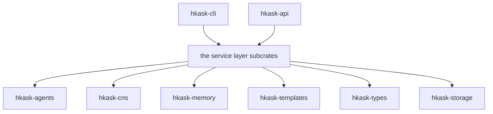
<!-- DIAGRAM_ALIGNMENT
id: DIAG-FS-001
verified_date: 2026-07-12
verified_against: crates/hkask-types/src/lib.rs, crates/hkask-cns/src/lib.rs
status: VERIFIED
-->

Domain crates **never** depend on service layer subcrates. MCP servers **never** depend on service layer subcrates for orchestration (P1 Prohibition — out-of-process isolation). Tri-surface exception: `hkask-mcp-replica` imports for delegation only.

### 1.5.3 Loop Architecture Membrane

The transport layer uses `tokio::mpsc` channels to route between loops without creating cross-loop authority:

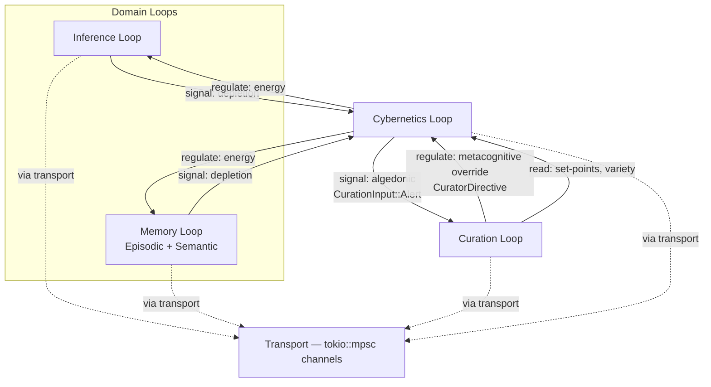
<!-- DIAGRAM_ALIGNMENT
id: DIAG-FS-002
verified_date: 2026-07-12
verified_against: crates/hkask-types/src/lib.rs, crates/hkask-cns/src/lib.rs
status: VERIFIED
-->

**Key rules:** Domain loops signal their governing meta loop but never each other directly. Transport is a dumb pipe, not a regulator. The Curation Loop is the single authority that can override any meta loop's decision.

### 1.5.4 Strangler Fig Extraction Log

The service layer was extracted from duplicated surface logic using the **strangler fig pattern** (Fowler, 2004): incremental replacement with both paths active, delegate before delete.[^fowler-strangler]

| Service | Extracted From | When | Constraint |
|---------|---------------|------|------------|
| `hkask-storage` (backup was absorbed, v0.31.0) | former monolithic service crate | v0.27.0 | P5 (Essentialism — parallel compilation benefit) |
| `AgentService` (9-field consolidation, 4 nested sub-contexts) | CLI + API duplicate chains | v0.28.0 | P7 (Evolutionary Architecture — seam emerged from real usage) |
| Nested sub-context pattern (`InfraContext`, `GovernanceContext`, `CnsContext`, `StorageContext`) | Flat 28-field struct with individual accessors | v0.31.0 | P5 (Essentialism — deep modules, callers navigate sub-context fields directly) |
| `AgentService::consolidate_agent_memory` | `hkask-memory::consolidation_ops` direct DB open bypass | v0.30.0 | P2 (Affirmative Consent) + P4 (Clear Boundaries) — single consent-checked, OCAP-gated entry point |

### 1.5.5 Pod Export & K8s Deployment (v0.31.0)

The CLI provides two pod export paths for cloud deployment. Both are implemented in `hkask-cli::commands::pod`:

| Command | Source | Output | Validates |
|---------|--------|--------|-----------|
| `kask pod export-container <pod_id>` | `ActivePods::export_container()` → `PodFactory` | Containerfile + pod files (DB, WebID, salt) | Pod existence |
| `kask pod export-k8s <pod_id>` | Copies canonical manifests from `deploy/k8s/` | All files from `deploy/k8s/` directory | Pod existence via `pod_manager().get_pod_status()` |

**Canonical deployment manifests** live in `deploy/k8s/` -- single source of truth. The directory contains a complete K8s deployment: single-container pod (kask + Conduit + Litestream via supervisord), ConfigMap, Secret, PVC, Service, Ingress with cert-manager TLS, Kustomization, entrypoint script, and templated config files. See `deploy/k8s/README.md` for the full deployment guide.

**CNS spans:** `CnsSpan::SessionOpen`, `CnsSpan::SessionClose`, `CnsSpan::BackupExport`, `CnsSpan::BackupAutoExport`, `CnsSpan::BackupUpload` — deployment lifecycle observability.

**Curator init flow:** `kask curator init` calls `export_k8s(&curator_dir)` → `kubectl apply -f <manifests_dir>`. The `PodService` abstraction was removed in v0.31.0 per P5 (Essentialism) — pod management is now direct calls to `ActivePods` + `PodFactory`.


## CNS Domain Specification

> **Incorporated from:** docs/architecture/core/CNS-DOMAIN-SPECIFICATION.md

**Purpose:** A formal specification of the 8 cybernetic sub-domains implementing hKask's autonomous nervous system in `hkask-cns`. Each sub-domain maps to an authoritative principle from [`PRINCIPLES.md`](PRINCIPLES.md). 76 `expect:`-annotated contracts encode user functional expectations.

### Sub-Domain Architecture

The CNS is structured into 8 sub-domains, each implementing a specific cybernetic function. Each sub-domain is implemented in a single Rust file (or a tight cluster of files), following deep-module discipline (Ousterhout). The public surface is ≤ 7 items per module; internal plumbing is `pub(crate)`.

```
hkask-cns/src/
├── algedonic.rs                  ← 4 contracts   — P9: Alert creation, escalation, severity classification
├── runtime.rs                    ← 24 contracts  — P9: Variety monitoring, outcome tracking, gas budgets
├── governed_tool.rs              ← 3 contracts   — P4: Tool membrane, OCAP gate, consumption channels
├── governed_inference.rs         ← 2 contracts   — P4: Inference membrane, agent attribution
├── circuit_breaker.rs            ← 3 contracts   — P4: Failure gating, state transitions
├── api_metering.rs               ← 8 contracts   — P9: Rate limiting, span creation, alert classification
├── energy.rs                     ← 16 contracts  — P9/P8: Gas budget types, delta, reserve, settle, repl
├── dynamic_gas_table.rs          ← P9: Per-server gas cost calibration from CNS settled events
├── gas_report.rs                 ← P9: Aggregate gas queries across agents and time windows
├── calibrated_energy_estimator.rs ← P9: Self-regulating per-server gas cost estimator
├── composite_energy_estimator.rs ← P9: Routes inference to token estimator, others to table
├── wallet_budget.rs              ← P9/P4: Wallet-backed gas budget (rJoule debits)
├── wallet_energy_estimator.rs    ← P9: Wallet-aware composite estimator with gas→rJoule rate
└── wallet_gas_calibrator.rs      ← P9: Runtime calibration of wallet gas→rJoule conversion
```

### Sub-Domain Contract Summary

| Sub-Domain | Principle | Core Module | Contracts | Key Function |
|------------|-----------|-------------|-----------|--------------|
| 1. Algedonic | P9 | `algedonic.rs` | 4 | Alert creation, escalation, severity classification |
| 2. Runtime | P9 | `runtime.rs` | 24 | Variety monitoring, outcome tracking, gas budget registration |
| 3. Governed Tool | P4 | `governed_tool.rs` | 3 | Tool membrane, OCAP gate, consumption channels |
| 4. Governed Inference | P4 | `governed_inference.rs` | 2 | Inference membrane, agent attribution |
| 5. Circuit Breaker | P4 | `circuit_breaker.rs` | 3 | Failure gating, state transitions |
| 6. API Metering | P9 | `api_metering.rs` | 8 | Rate limiting, span creation, alert classification |
| 7. Gas Cost Calibration | P9 | `dynamic_gas_table.rs` + `gas_report.rs` + `calibrated_energy_estimator.rs` | 4 | Per-server gas cost calibration via EMA |
| 8. Wallet-Backed Energy | P9 + P4 | `wallet_budget.rs` + `wallet_energy_estimator.rs` + `wallet_gas_calibrator.rs` | 3 | Wallet-backed gas budget with gas→rJoule conversion |

**Codebase Reference:** `crates/hkask-cns/src/` — 76 `expect:`-annotated contracts across 8 sub-domains.

### CNS Spans

The `CnsSpan` enum (`crates/hkask-types/src/cns.rs`) defines the canonical CNS span registry with 7 core variants (reduced from 72+ per ADR-048). The 133 `CANONICAL_NAMESPACES` entries in `crates/hkask-types/src/event.rs` provide hierarchical domain namespaces that subsystem spans target. Exhaustive test in `cns_span_tests` verifies Display → FromStr round-trip for all variants.

Key deployment-related spans added in v0.31.0:

| Span | Sub-Domain | Trigger |
|------|-----------|---------|
| `cns.gas.calibrated` | Gas Cost Calibration | `CalibratedEnergyEstimator` adjusts per-server costs |
| `cns.wallet.conversion.calibrated` | Wallet-Backed Energy | `WalletGasCalibrator` adjusts gas→rJoule rate |
| `cns.deploy.session_open` | Deployment | User OAuth sign-in session created |
| `cns.deploy.session_close` | Deployment | User session closed (logout or expiry) |
| `cns.deploy.backup_export` | Backup | Sovereignty backup export created |
| `cns.deploy.backup_auto_export` | Backup | Scheduled auto-export triggered |
| `cns.deploy.backup_upload` | Backup | Sovereignty backup uploaded to server |

### Memory Verb Contracts

> **Incorporated from:** `docs/architecture/core/CNS_MEMORY_VERB_CONTRACTS.md`

13 CNS `MemoryEncode` NuEvents emitted by autonomous memory operations:

| # | Verb | Source | Trigger |
|---|------|--------|---------|
| 1 | `episodic_stored` | `episodic.rs` | `store()` succeeds |
| 2 | `semantic_stored` | `semantic.rs` | `store()` succeeds |
| 3 | `consolidated` | `semantic.rs` | `store_consolidated()` succeeds |
| 4 | `episodic_consolidated` | `episodic_loop.rs` | Consolidation bridge, outcome > 0 |
| 5 | `episodic_consolidation_failed` | `episodic_loop.rs` | Bridge returns Err |
| 6 | `episodic_budget_exceeded_no_bridge` | `episodic_loop.rs` | Budget exceeded, no bridge |
| 7 | `episodic_calibrate` | `episodic_loop.rs` | Non-budget calibration action |
| 8 | `episodic_regulate` | `episodic_loop.rs` | Unhandled regulatory action |
| 9 | `confidence_decayed` | `episodic.rs` | Wozniak-Gorzelanczyk forgetting curve R(t)=exp(-t/S) applied at recall |
| 10 | `semantic_condensed` | `semantic_loop.rs` | Old hMems condensed |
| 11 | `semantic_budget_enforced` | `semantic_loop.rs` | Low-confidence review deletes |
| 12 | `consolidation_completed` | `consolidation.rs` | Bridge finishes |
| 13 | `consolidation_service_completed` | `consolidation_service.rs` | Service finishes all 3 phases |

The Episodic Loop emits `cns.memory.life` carrying memory life S in days (Wozniak-Gorzelanczyk, 1995). Default 180 days. Configurable via `HKASK_MEMORY_LIFE_DAYS` env var or `ServiceConfig.memory_life_days`.

### Verification

```bash
cargo check -p hkask-cns
cargo test -p hkask-cns
kask cns health
```

---

## 2. Functional Requirements by Domain

### 2.1 Energy Budgeting (`energy`)

**Goal Principle:** P9 (Homeostatic Self-Regulation) — gas budget enforcement prevents runaway agents
**Constraining Principle:** P8 (Semantic Grounding) — type-level identity for energy cost types
**Crate:** `hkask-cns` | **Source:** `src/energy.rs`

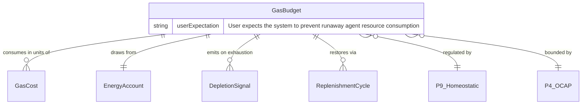
<!-- DIAGRAM_ALIGNMENT
id: DIAG-FS-003
verified_date: 2026-07-12
verified_against: crates/hkask-types/src/lib.rs, crates/hkask-cns/src/lib.rs
status: VERIFIED
-->

#### Production Contracts (16)

| FR# | Function | Principle Annotations |
|-----|----------|---------------------|
| FR-E1 | [P8] Goal: Semantic Grounding — type-level identity preservation; [P5] Constraining: Essentialism |
| FR-E2 | [P8] Goal: Semantic Grounding — symmetric type-level identity; [P5] Constraining: Essentialism |
| FR-E3 | [P8] Goal: Semantic Grounding — type-level identity for f64 newtype; [P5] Constraining: Essentialism |
| FR-E4 | [P8] Goal: Semantic Grounding — symmetric type-level identity; [P5] Constraining: Essentialism |
| FR-E5 | [P9] Goal: Homeostatic Self-Regulation — lazy universe compliance detection; [P8] Constraining: Semantic Grounding |
| FR-E6 | [P9] Goal: Homeostatic Self-Regulation — anti-lazy detection triggers alert; [P8] Constraining: Semantic Grounding |
| FR-E7 | [P9] Goal: Homeostatic Self-Regulation — budget creation enables regulation; [P4] Constraining: Clear Boundaries — cap enforces OCAP boundary |
| FR-E8 | [P9] Goal: Homeostatic Self-Regulation — observability without throttling; [P4] Constraining: Clear Boundaries |
| FR-E9 | [P9] Goal: Homeostatic Self-Regulation — configurable replenishment knob; [P7] Constraining: Evolutionary Architecture — emerged from real usage |
| FR-E10 | [P9] Goal: Homeostatic Self-Regulation — configurable alert threshold; [P7] Constraining: Evolutionary Architecture |
| FR-E11 | [P9] Goal: Homeostatic Self-Regulation — boundary enforcement toggle; [P4] Constraining: Clear Boundaries |
| FR-E12 | [P9] Goal: Homeostatic Self-Regulation — check-before-execute gateway; [P4] Constraining: Clear Boundaries |
| FR-E13 | [P9] Goal: Homeostatic Self-Regulation — visible state for feedback loops; [P4] Constraining: Clear Boundaries |
| FR-E14 | [P9] Goal: Homeostatic Self-Regulation — hold-settle pattern; [P4] Constraining: Clear Boundaries |
| FR-E15 | [P9] Goal: Homeostatic Self-Regulation — completes hold-settle cycle; [P4] Constraining: Clear Boundaries |
| FR-E16 | [P9] Goal: Homeostatic Self-Regulation — immediate deduction path; [P4] Constraining: Clear Boundaries |
| FR-E17 | [P9] Goal: Homeostatic Self-Regulation — regulation cycle; [P4] Constraining: Clear Boundaries |
| FR-E18 | [P9] Goal: Homeostatic Self-Regulation — targeted curation replenishment; [P4] Constraining: Clear Boundaries |
| FR-E19 | [P9] Goal: Homeostatic Self-Regulation — priority-weighted replenishment; [P4] + [P7] Constraining |

#### Test Contracts (4)

| FR# | Test Name |
|-----|-----------|
| FR-E-T1 | budget_never_exceeds_cap — property test: remaining + reserved ≤ cap |
| FR-E-T2 | available_never_negative — property test: available ≥ 0 |
| FR-E-T3 | replenish_never_exceeds_cap — property test: remaining ≤ cap after replenish |
| FR-E-T4 | `GasCost` newtype contract test |


### 2.2 Algedonic Signalling (`algedonic`)

**Goal Principle:** P9 (Homeostatic Self-Regulation) — algedonic feedback loop for variety deficit escalation
**Constraining Principle:** P4 (Clear Boundaries) — cap enforcement through binary classification
**Crate:** `hkask-cns` | **Source:** `src/algedonic.rs`

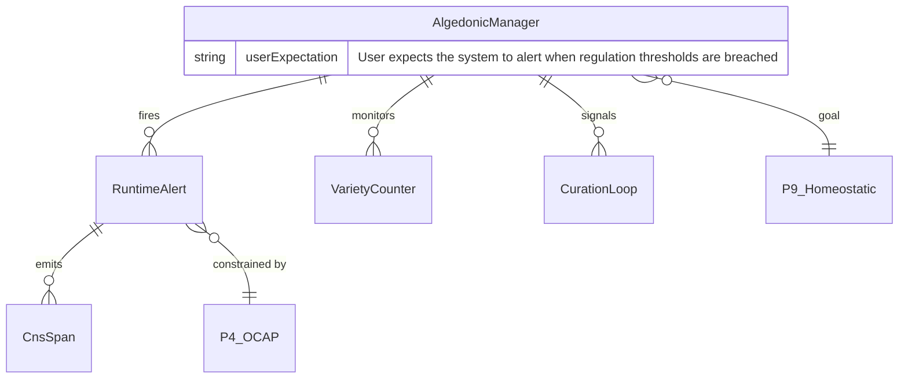
<!-- DIAGRAM_ALIGNMENT
id: DIAG-FS-004
verified_date: 2026-07-12
verified_against: crates/hkask-types/src/lib.rs, crates/hkask-cns/src/lib.rs
status: VERIFIED
-->

#### Production Contracts (4)

| FR# | Function | Principle Annotations |
|-----|----------|---------------------|
| FR-A1 | `RuntimeAlert::new(domain, deficit, threshold) -> Self` | [P9] Goal: Homeostatic Self-Regulation — alert construction for feedback; [P4] Constraining: Clear Boundaries |
| FR-A2 | `RuntimeAlert::should_escalate() -> bool` | [P9] Goal: Homeostatic Self-Regulation — escalation feedback loop; [P4] Constraining: Clear Boundaries |
| FR-A3 | `RuntimeAlert::is_critical() -> bool` | [P9] Goal: Homeostatic Self-Regulation — critical threshold detection; [P4] Constraining: Clear Boundaries |
| FR-A4 | `RuntimeAlert::is_warning() -> bool` | [P9] Goal: Homeostatic Self-Regulation — warning threshold detection; [P4] Constraining: Clear Boundaries |

#### Test Contracts (5)

| FR# | Test Name |
|-----|-----------|
| FR-A-T1 | binary_threshold_classifies_critical_and_warning |
| FR-A-T2 | algedonic_manager_accumulates_alerts_across_domains |
| FR-A-T3 | check_outcome_classifies_success_rate_correctly |
| FR-A-T4 | check_outcome_alert_message_includes_domain_and_rate |
| FR-A-T5 | check_outcome_domain_prefixed_with_outcome |


### 2.3 Runtime Observability (`runtime`)

**Goal Principle:** P9 (Homeostatic Self-Regulation) — single entry point for CNS observability and regulation
**Constraining Principles:** P3 (Generative Space — sync variants), P7 (Evolutionary Architecture — calibrate), P12 (Affirmative Consent — subscribe)
**Crate:** `hkask-cns` | **Source:** `src/runtime.rs`

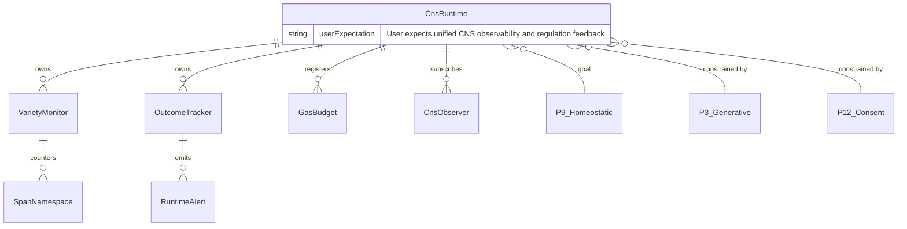
<!-- DIAGRAM_ALIGNMENT
id: DIAG-FS-005
verified_date: 2026-07-12
verified_against: crates/hkask-types/src/lib.rs, crates/hkask-cns/src/lib.rs
status: VERIFIED
-->

#### P9 Production Contracts (18)

| FR# | Function | Principle Annotations |
|-----|----------|---------------------|
| FR-R1 | `VarietyMonitor::new() -> Self` | [P9] Goal: Homeostatic Self-Regulation — monitor enables feedback loops; [P5] Constraining: Essentialism |
| FR-R2 | `VarietyMonitor::variety_for_domain(domain) -> u64` | [P9] Goal: Homeostatic Self-Regulation — variety measurement drives loop closure; [P8] Constraining: Semantic Grounding |
| FR-R3 | `VarietyMonitor::domains() -> Vec<&str>` | [P9] Goal: Homeostatic Self-Regulation — domain enumeration enables loop feedback; [P8] Constraining: Semantic Grounding |
| FR-R4 | `CnsRuntime::with_threshold(threshold) -> Self` | [P9] Goal: Homeostatic Self-Regulation — runtime creation enables regulation; [P7] Constraining: Evolutionary Architecture |
| FR-R5 | `CnsRuntime::health() -> CnsHealth` | [P9] Goal: Homeostatic Self-Regulation — health query drives loop decisions; [P8] Constraining: Semantic Grounding |
| FR-R6 | `CnsRuntime::alerts() -> Vec<RuntimeAlert>` | [P9] Goal: Homeostatic Self-Regulation — alert retrieval enables loop response; [P8] Constraining: Semantic Grounding |
| FR-R7 | `CnsRuntime::default_threshold() -> u64` | [P9] Goal: Homeostatic Self-Regulation — threshold config enables loop tuning; [P7] Constraining: Evolutionary Architecture |
| FR-R8 | `CnsRuntime::critical_alerts() -> Vec<RuntimeAlert>` | [P9] Goal: Homeostatic Self-Regulation — critical alert filtering enables prioritised response; [P8] Constraining: Semantic Grounding |
| FR-R9 | `CnsRuntime::variety() -> HashMap<SpanNamespace, u64>` | [P9] Goal: Homeostatic Self-Regulation — variety measurement drives loop closure; [P8] Constraining: Semantic Grounding |
| FR-R10 | `CnsRuntime::variety_for_domain(domain) -> u64` | [P9] Goal: Homeostatic Self-Regulation — domain-specific variety; [P8] Constraining: Semantic Grounding |
| FR-R11 | `CnsRuntime::record_outcome(domain, success, err) -> ()` | [P9] Goal: Homeostatic Self-Regulation — outcome tracking enables quality-based regulation; [P4] Constraining: Clear Boundaries |
| FR-R12 | `CnsRuntime::check_outcome(domain) -> Option<RuntimeAlert>` | [P9] Goal: Homeostatic Self-Regulation — outcome check drives loop decisions; [P4] Constraining: Clear Boundaries |
| FR-R13 | `CnsRuntime::outcome_success_rate(domain) -> Option<f64>` | [P9] Goal: Homeostatic Self-Regulation — success rate is a feedback metric; [P8] Constraining: Semantic Grounding |
| FR-R14 | `CnsRuntime::increment_variety(domain, state_name)` | [P9] Goal: Homeostatic Self-Regulation — variety counter drives loop closure; [P4] Constraining: Clear Boundaries |
| FR-R15 | `CnsRuntime::check_variety(domain) -> Option<RuntimeAlert>` | [P9] Goal: Homeostatic Self-Regulation — variety check drives loop closure; [P4] Constraining: Clear Boundaries |
| FR-R16 | `CnsRuntime::register_energy_budget(agent, budget)` | [P9] Goal: Homeostatic Self-Regulation — budget registration enables energy tracking; [P4] Constraining: Clear Boundaries |
| FR-R17 | `CnsRuntime::replenish_agent_budget(agent, amount) -> GasCost` | [P9] Goal: Homeostatic Self-Regulation — budget replenishment drives energy loop; [P4] Constraining: Clear Boundaries |
| FR-R18 | `CnsRuntime::agent_gas_status(agent) -> Option<AgentEnergyStatus>` | [P9] Goal: Homeostatic Self-Regulation — gas status query drives energy loop; [P8] Constraining: Semantic Grounding |

#### P3 Blocking Variants (1)

| FR# | Function | Principle Annotations |
|-----|----------|---------------------|
| FR-R19 | `CnsRuntime::blocking_variety_for_domain(domain) -> u64` | [P3] Goal: Generative Space — sync access preserves generative capability; [P7] Constraining: Evolutionary Architecture — blocking variant emerged from real usage; [P4] Constraining: Clear Boundaries — must not be called from async context |


#### P7 Calibrate & P3 Blocking Variants (2)

| FR# | Function | Principle Annotations |
|-----|----------|---------------------|
| FR-R20 | `CnsRuntime::calibrate_threshold(domain, new_threshold)` | [P7] Goal: Evolutionary Architecture — threshold parameter emerged from real usage; [P4] Constraining: Clear Boundaries |
| FR-R21 | `CnsRuntime::calibrate_threshold_blocking(domain, new_threshold)` | [P3] Goal: Generative Space — sync access preserves generative capability; [P7] Constraining: Evolutionary Architecture — blocking variant emerged from real usage; [P4] Constraining: Clear Boundaries |

#### P12 Subscriber Contracts (3)

| FR# | Function | Principle Annotations |
|-----|----------|---------------------|
| FR-R22 | `CnsRuntime::subscribe(observer: Arc<dyn CnsObserver>)` | [P12] Goal: Affirmative Consent — observer registration requires explicit subscription; [P2] Constraining: User Sovereignty |
| FR-R23 | `CnsRuntime::subscribe_async(observer: Arc<dyn CnsObserver>)` | [P12] Goal: Affirmative Consent — observer registration requires explicit subscription; [P2] Constraining: User Sovereignty |
| FR-R24 | `CnsRuntime::emit_backpressure(signal: BackpressureSignal)` | [P9] Goal: Homeostatic Self-Regulation — backpressure signal closes the regulation loop; [P4] Constraining: Clear Boundaries |

#### Test Contracts (6)

| FR# | Test Name |
|-----|-----------|
| FR-R-T1 | variety_monitor_tracks_distinct_states |
| FR-R-T2 | variety_tracker_deficit_calculation |
| FR-R-T3 | variety_monitor_multi_domain_isolation |
| FR-R-T4 | outcome_tracker_success_rate_calculation |
| FR-R-T5 | outcome_tracker_error_kind_breakdown |
| FR-R-T6 | outcome_tracker_window_reset |


### 2.4 Tool Governance (`gov-tool`)

**Goal Principle:** P9 (Homeostatic Self-Regulation) — tool execution gated by gas budget and OCAP checks
**Constraining Principles:** P4 (Clear Boundaries — OCAP membrane enforcement), P12 (Affirmative Consent — agent identity is the consent anchor)
**Crate:** `hkask-cns` | **Source:** `src/governed_tool.rs`

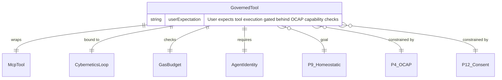
<!-- DIAGRAM_ALIGNMENT
id: DIAG-FS-006
verified_date: 2026-07-12
verified_against: crates/hkask-types/src/lib.rs, crates/hkask-cns/src/lib.rs
status: VERIFIED
-->

#### Production Contracts (3)

| FR# | Function | Principle Annotations |
|-----|----------|---------------------|
| FR-GT1 | `GovernedTool::new(inner, cybernetics, sink, est, agent) -> Self` | [P9] Goal: Homeostatic Self-Regulation — tool governance enables feedback loops; [P4] Constraining: Clear Boundaries — cybernetics binding enforces OCAP boundary |
| FR-GT2 | `GovernedTool::with_tool_consumption_channel(tx) -> Self` | [P9] Goal: Homeostatic Self-Regulation — consumption channel closes cybernetic feedback loop; [P4] Constraining: Clear Boundaries — channel ownership tracks consumer identity |
| FR-GT3 | `GovernedTool::with_agent(agent) -> Self` | [P12] Goal: Affirmative Consent — agent identity is the consent anchor; [P4] Constraining: Clear Boundaries — OCAP gate enforces boundary per invocation |

#### Test Contracts (4)

| FR# | Test Name |
|-----|-----------|
| FR-GT-T1 | legacy_exact_match_grants_correct_tool — OCAP Path 1 |
| FR-GT-T2 | legacy_exact_match_denies_wrong_tool — OCAP Path 1 denial |
| FR-GT-T3 | domain_capability_matches_mcp_tool_domain — OCAP Path 2 |
| FR-GT-T4 | domain_capability_denies_different_domain — OCAP Path 2 denial |


### 2.5 Inference Governance (`gov-inf`)

**Goal Principle:** P9 (Homeostatic Self-Regulation) — inference calls gated by gas budget and provider membrane
**Constraining Principles:** P4 (Clear Boundaries — provider membrane), P12 (Affirmative Consent — agent identity is required for attribution)
**Crate:** `hkask-cns` | **Source:** `src/governed_inference.rs`

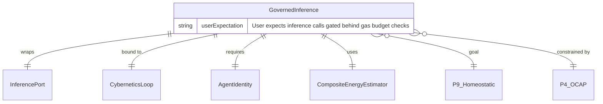
<!-- DIAGRAM_ALIGNMENT
id: DIAG-FS-007
verified_date: 2026-07-12
verified_against: crates/hkask-types/src/lib.rs, crates/hkask-cns/src/lib.rs
status: VERIFIED
-->

#### Production Contracts (2)

| FR# | Function | Principle Annotations |
|-----|----------|---------------------|
| FR-GI1 | `GovernedInference::new(inner, cybernetics, sink, agent) -> Self` | [P9] Goal: Homeostatic Self-Regulation — inference governance enables cybernetic control; [P4] Constraining: Clear Boundaries — membrane wraps inner InferencePort at OCAP boundary; [P12] Constraining: Affirmative Consent |
| FR-GI2 | `GovernedInference::with_agent(agent) -> Self` | [P12] Goal: Affirmative Consent — agent identity is the consent anchor; [P4] Constraining: Clear Boundaries — OCAP gate enforces boundary per inference call |

#### Test Contracts (2)

| FR# | Test Name |
|-----|-----------|
| FR-GI-T1 | estimate_inference_cost_uses_max_tokens — cost estimation uses max_tokens|
| FR-GI-T2 | estimate_inference_cost_floors_at_one — cost estimation floors at 1 |


### 2.6 Circuit Breaker (`circuit`)

**Goal Principle:** P9 (Homeostatic Self-Regulation) — CNS regulation loop enforces homeostasis over external service calls
**Constraining Principle:** P4 (Clear Boundaries) — circuit state transitions are boundary conditions
**Crate:** `hkask-cns` | **Source:** `src/circuit_breaker.rs`

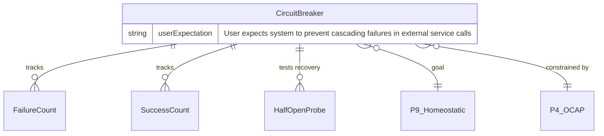
<!-- DIAGRAM_ALIGNMENT
id: DIAG-FS-008
verified_date: 2026-07-12
verified_against: crates/hkask-types/src/lib.rs, crates/hkask-cns/src/lib.rs
status: VERIFIED
-->

#### Production Contracts (3)

| FR# | Function | Principle Annotations |
|-----|----------|---------------------|
| FR-CB1 | `CircuitBreaker::default_for_inference(name) -> Self` | [P9] Goal: Homeostatic Self-Regulation — CNS regulation loop enforces boundary; [P4] Constraining: Clear Boundaries — default thresholds establish failure boundary |
| FR-CB2 | `CircuitBreaker::allow_request() -> bool` | [P9] Goal: Homeostatic Self-Regulation — check-before-execute gateway; [P4] Constraining: Clear Boundaries — state-driven gating enforces the boundary |
| FR-CB3 | `CircuitBreaker::record_success()` | [P9] Goal: Homeostatic Self-Regulation — success count drives loop closure; [P4] Constraining: Clear Boundaries — threshold-based state transition enforces boundary |


### 2.7 API Metering (`api`)

**Goal Principle:** P9 (Homeostatic Self-Regulation) — per-key rate limiting, gas tracking, and CNS spans
**Constraining Principles:** P7 (Evolutionary Architecture — hardcoded endpoint weight table, configurable later), P4 (Clear Boundaries — rate limit thresholds are boundary conditions)
**Crate:** `hkask-cns` | **Source:** `src/api_metering.rs`

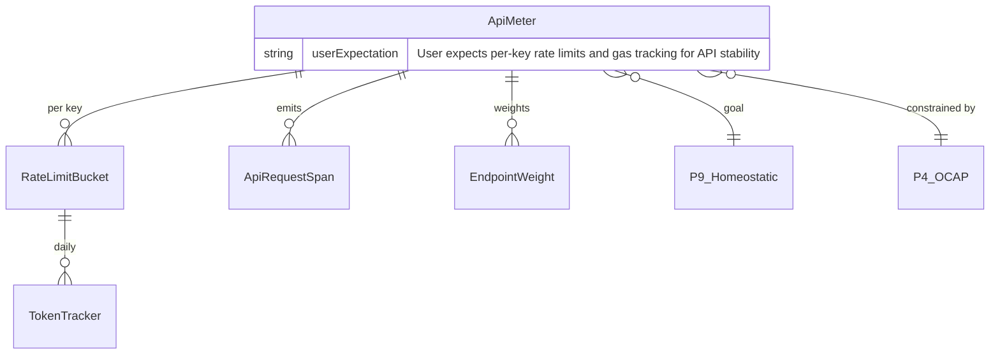
<!-- DIAGRAM_ALIGNMENT
id: DIAG-FS-009
verified_date: 2026-07-12
verified_against: crates/hkask-types/src/lib.rs, crates/hkask-cns/src/lib.rs
status: VERIFIED
-->

#### Production Contracts (8)

| FR# | Function | Principle Annotations |
|-----|----------|---------------------|
| FR-AM1 | `endpoint_weight(path) -> EndpointWeight` | [P9] Goal: Homeostatic Self-Regulation — per-request rate limiting for API stability; [P7] Constraining: Evolutionary Architecture — hardcoded table to be configurable later |
| FR-AM2 | `RateLimitStatus::as_str() -> &'static str` | [P9] Goal: Homeostatic Self-Regulation — rate limit status feedback for CNS; [P8] Constraining: Semantic Grounding — string representation must be stable across versions |
| FR-AM3 | `ApiMeter::new() -> Self` | [P9] Goal: Homeostatic Self-Regulation — empty meter ready for per-key tracking; [P5] Constraining: Essentialism — minimal constructor with empty buckets map |
| FR-AM4 | `ApiMeter::check_and_record(key_id, max_rpm, max_tokens, tokens) -> RateLimitStatus` | [P9] Goal: Homeostatic Self-Regulation — rate limit enforcement is the CNS check; [P4] Constraining: Clear Boundaries — rate limit thresholds are boundary conditions |
| FR-AM5 | `ApiMeter::current_rpm(key_id) -> u32` | [P9] Goal: Homeostatic Self-Regulation — current rate is the cybernetic state; [P8] Constraining: Semantic Grounding — RPM count must be stable and accurate |
| FR-AM6 | `ApiRequestSpan::new(key_id, endpoint, matched, gas, enc, status) -> Self` | [P9] Goal: Homeostatic Self-Regulation — span creation is the CNS observation layer; [P8] Constraining: Semantic Grounding — span fields must be traceable to source |
| FR-AM7 | `ApiMeteringAlert::alert_type() -> &'static str` | [P9] Goal: Homeostatic Self-Regulation — alert type is the CNS classification; [P8] Constraining: Semantic Grounding — alert type labels must be stable across versions |
| FR-AM8 | `ApiMeteringAlert::severity() -> &'static str` | [P9] Goal: Homeostatic Self-Regulation — severity is the algedonic signal; [P8] Constraining: Semantic Grounding — severity labels must be stable across versions |

#### Test Contracts (8)

| FR# | Test Name |
|-----|-----------|
| FR-AM-T1 | endpoint_weight_embed_corpus_is_heavy |
| FR-AM-T2 | endpoint_weight_default_is_one |
| FR-AM-T3 | rate_limit_bucket_prunes_old_requests |
| FR-AM-T4 | rate_limit_bucket_enforces_rpm |
| FR-AM-T5 | token_tracking_resets_on_new_day |
| FR-AM-T6 | api_meter_enforces_limits |
| FR-AM-T7 | api_request_span_serialization |
| FR-AM-T8 | alert_severity_levels |


### 2.8 Energy Estimation (`est`)

**Goal Principle:** P9 (Homeostatic Self-Regulation) — composite estimator routes inference and table estimation
**Crate:** `hkask-cns` | **Source:** `src/composite_energy_estimator.rs`, `src/wallet_energy_estimator.rs`

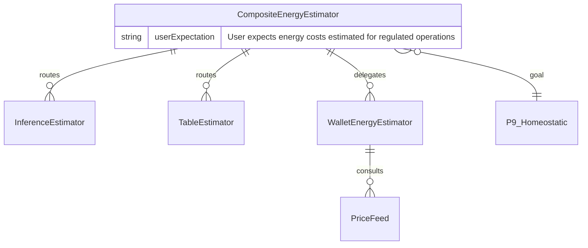
<!-- DIAGRAM_ALIGNMENT
id: DIAG-FS-010
verified_date: 2026-07-12
verified_against: crates/hkask-types/src/lib.rs, crates/hkask-cns/src/lib.rs
status: VERIFIED
-->

#### Production Contracts (2)

| FR# | Function | Principle Annotations |
|-----|----------|---------------------|
| FR-EE1 | `CompositeEnergyEstimator::new() -> Self` | [P9] Goal: Homeostatic Self-Regulation — composite estimator enables feedback loops; [P5] Constraining: Essentialism — minimal constructor, empty estimators |
| FR-EE2 | `WalletEnergyEstimator::calibrate(observed_ratio) -> bool` | [P9] Goal: Homeostatic Self-Regulation — Good Regulator feedback loop closure; [P4] Constraining: Clear Boundaries — threshold tolerance enforces boundary; [P7] Constraining: Evolutionary Architecture — EMA parameters emerged from real usage |

#### Test Contracts (5)

| FR# | Test Name |
|-----|-----------|
| FR-EE-T1 | calibrate_first_observation_initializes_EMA |
| FR-EE-T2 | calibrate_within_tolerance_no_adjustment |
| FR-EE-T3 | calibrate_EMA_smooths_observations |
| FR-EE-T4 | calibrate_clamps_extreme_ratios |
| FR-EE-T5 | calibrate_floors_gas_per_rjoule_at_one |

---

## 3. Non-CNS Domain Stubs

These domains are documented here for completeness. The canonical contract format uses `expect:` + `[P{N}]` annotations. The service layer (`the service layer subcrates` subcrates) has the largest remaining annotation surface.

### 3.1 Wallet (`hkask-wallet`)

**Goal Principle:** P9 (Homeostatic Self-Regulation) — rJoule balance, encumbrance, and fee estimation form the wallet's energy regulation loop
**Constraining Principles:** P1 (User Sovereignty), P2 (Affirmative Consent), P4 (Clear Boundaries), P8 (Semantic Grounding)
**Crate:** `hkask-wallet`
**Sources:** `src/manager.rs`, `src/issuer.rs`, `src/signing.rs`, `src/hinkal.rs`, `src/price_feed.rs`, `src/hedera.rs`, `tests/hinkal_adapter.rs`

#### Production Contracts (59)

| FR# | Function | Principle Annotations |
|-----|----------|---------------------|
| FR-W1 | `WalletManager` struct | [P9] Goal: Homeostatic Self-Regulation — wallet is the energy regulation anchor; [P1] Constraining: User Sovereignty — wallet_seed is user-owned and zeroized |
| FR-W2 | `WalletManager::build(...)` | [P9] Goal: Homeostatic Self-Regulation — wallet construction; [P1] Constraining: User Sovereignty — wallet_seed resolved and zeroized |
| FR-W3 | `WalletManager::get_balance(wallet_id)` | [P9] Goal: Homeostatic Self-Regulation — balance is the cybernetic state; [P8] Constraining: Semantic Grounding — gas/USDC equivalents derive deterministically |
| FR-W4 | `WalletManager::get_api_key(key_id)` | [P9] Goal: Homeostatic Self-Regulation — API key health state for feedback loops; [P4] Constraining: Clear Boundaries — revoked keys are excluded |
| FR-W5 | `WalletManager::emit_chain_error_for_actor` | [P9] Goal: Homeostatic Self-Regulation — chain errors feed the CNS sense loop; [P12] Constraining: Subscriber Consent — actor identity is recorded |
| FR-W6 | `WalletManager::can_afford(wallet_id, cost_rj)` | [P9] Goal: Homeostatic Self-Regulation — optimistic hold-settle prevents overspend; [P4] Constraining: Clear Boundaries — cannot reserve beyond balance |
| FR-W7 | `WalletManager::reserve_rjoules(wallet_id, amount)` | [P9] Goal: Homeostatic Self-Regulation — optimistic hold-settle prevents overspend; [P4] Constraining: Clear Boundaries — cannot reserve beyond balance |
| FR-W8 | `WalletManager::settle_rjoules(wallet_id, reserved, actual)` | [P9] Goal: Homeostatic Self-Regulation — optimistic hold-settle prevents overspend; [P4] Constraining: Clear Boundaries — cannot reserve beyond balance |
| FR-W9 | `WalletManager::encumber(wallet_id, key_id, amount)` | [P9] Goal: Homeostatic Self-Regulation — encumbrance locks energy for API keys; [P4] Constraining: Clear Boundaries — only the entitled key can consume; [P8] Constraining: Semantic Grounding — atomic consume/release preserves balance |
| FR-W10 | `WalletManager::release_encumbrance(key_id)` | [P9] Goal: Homeostatic Self-Regulation — encumbrance locks energy for API keys; [P4] Constraining: Clear Boundaries — only the entitled key can consume; [P8] Constraining: Semantic Grounding — atomic consume/release preserves balance |
| FR-W11 | `WalletManager::consume(key_id, gas_rj)` | [P9] Goal: Homeostatic Self-Regulation — encumbrance locks energy for API keys; [P4] Constraining: Clear Boundaries — only the entitled key can consume; [P8] Constraining: Semantic Grounding — atomic consume/release preserves balance |
| FR-W12 | `WalletManager::get_encumbrance(key_id)` | [P9] Goal: Homeostatic Self-Regulation — encumbrance locks energy for API keys; [P4] Constraining: Clear Boundaries — only the entitled key can consume; [P8] Constraining: Semantic Grounding — atomic consume/release preserves balance |
| FR-W13 | `WalletManager::estimate_withdrawal_fee` | [P9] Goal: Homeostatic Self-Regulation — fee estimate enables cost-aware withdrawal; [P8] Constraining: Semantic Grounding — derived from live/native USD rate |
| FR-W14 | `WalletManager::emit_key_alert` | [P9] Goal: Homeostatic Self-Regulation — algedonic feedback closure for API key lifecycle; [P12] Constraining: Subscriber Consent — emits span only if sink subscribed |
| FR-W15 | `WalletManager::generate_deposit_reference` HKDF context | [P9] Goal: Homeostatic Self-Regulation — deposit attribution supports energy inflow; [P4] Constraining: Clear Boundaries — nonce binds reference to specific invocation |
| FR-W16 | `ApiKeyIssuer` struct | [P9] Goal: Homeostatic Self-Regulation — API keys scope and limit agent energy access; [P2] Constraining: Affirmative Consent — keys are explicitly scoped, revocable, and user-issued; [P4] Constraining: Clear Boundaries — spending limits and expiry enforce capability boundaries; [P1] Constraining: User Sovereignty — private keys are returned once and never stored |
| FR-W17 | `ApiKeyIssuer::new(store)` | [P9] Goal: Homeostatic Self-Regulation — API keys scope and limit agent energy access; [P1] Constraining: User Sovereignty — wallet_seed resolved and zeroized |
| FR-W18 | `ApiKeyIssuer::create_key(...)` | [P9] Goal: Homeostatic Self-Regulation — API keys scope and limit agent energy access; [P2] Constraining: Affirmative Consent — keys are explicitly scoped, revocable, and user-issued; [P4] Constraining: Clear Boundaries — spending limits and expiry enforce capability boundaries; [P1] Constraining: User Sovereignty — private keys are returned once and never stored |
| FR-W19 | `ApiKeyIssuer::revoke_key(key_id)` | [P9] Goal: Homeostatic Self-Regulation — API keys scope and limit agent energy access; [P2] Constraining: Affirmative Consent — revocable capabilities; [P1] Constraining: User Sovereignty — unspent balance returned |
| FR-W20 | `ApiKeyIssuer::list_keys(wallet_id)` | [P9] Goal: Homeostatic Self-Regulation — API key inventory for feedback loops; [P4] Constraining: Clear Boundaries — only active keys returned |
| FR-W21 | `ApiKeyIssuer::create_key` key generation | [P1] Constraining: User Sovereignty — Ed25519 seed wrapped in Zeroizing for automatic zeroize on drop |
| FR-W22 | `sign_withdrawal(chain, tx_bytes)` | [P9] Goal: Homeostatic Self-Regulation — signing authorizes energy outflow; [P1] Constraining: User Sovereignty — treasury key derived from user master key; [P4] Constraining: Clear Boundaries — key material never leaves this module |
| FR-W23 | `sign_message(message)` | [P9] Goal: Homeostatic Self-Regulation — Hinkal session signing authorizes privacy-layer flow; [P4] Constraining: Clear Boundaries — message is opaque bytes; signature proves treasury origin |
| FR-W24 | `sign_capability(capability)` | [P9] Goal: Homeostatic Self-Regulation — signing authorizes API key capability; [P1] Constraining: User Sovereignty — treasury key derived from user master key; [P4] Constraining: Clear Boundaries — key material never leaves this module |
| FR-W25 | `LoadedKey` Debug impl | [P2] Constraining: Affirmative Consent — key material redacted from debug output |
| FR-W26 | `LoadedKey` never leaves `signing.rs` | [P2] Constraining: Affirmative Consent — no un-zeroized key material crosses module boundary |
| FR-W27 | `HinkalPort::new` | [P9] Goal: Homeostatic Self-Regulation — privacy port is part of the energy loop; [P4] Constraining: Clear Boundaries — HTTPS-only and non-empty treasury pubkey |

#### Test Contracts (36)

| FR# | Test Name |
|-----|-----------|
| FR-W-T1 | gas_to_rjoules_conversion |
| FR-W-T2 | rjoules_to_gas_conversion |
| FR-W-T3 | estimate_withdrawal_fee_uses_price_feed |
| FR-W-T4 | can_afford_checks_balance |
| FR-W-T5 | reserve_rejects_insufficient_balance |
| FR-W-T6 | settle_debits_actual_cost |
| FR-W-T7 | deposit_reference_generation |
| FR-W-T8 | balance_conservation_under_encumbrance_lifecycle |
| FR-W-T9 | deposit_monitor_credits_and_is_idempotent |
| FR-W-T10 | poll_deposits_once_multi_chain |
| FR-W-T11 | end_to_end_payment_lifecycle |
| FR-W-T12 | encumbrance_status_state_machine_no_released_to_active |
| FR-W-T13 | withdraw_full_pipeline_success |
| FR-W-T14 | withdraw_rejects_insufficient_balance |
| FR-W-T15 | withdraw_rejects_unsupported_chain |
| FR-W-T16 | withdraw_shielded_hinkal_uses_privacy_path |
| FR-W-T17 | shield_assets_uses_privacy_path |
| FR-W-T18 | create_key_produces_valid_keypair |
| FR-W-T19 | create_key_with_expiry |
| FR-W-T20 | revoke_key_returns_unspent_rjoules |
| FR-W-T21 | list_keys_returns_active_keys |
| FR-W-T22 | sign_withdrawal_produces_signature |
| FR-W-T23 | sign_withdrawal_differs_per_chain |
| FR-W-T24 | sign_capability_produces_hex_signature |
| FR-W-T25 | sign_withdrawal_all_chains |
| FR-W-T26 | sign_withdrawal_empty_tx_bytes |
| FR-W-T27 | sign_message_produces_signature |
| FR-W-T28 | sign_capability_tampered_produces_different_signature |
| FR-W-T29 | static_price_feed_returns_expected_rates |
| FR-W-T30 | fee_estimation_produces_non_zero_fee |
| FR-W-T31 | fee_estimation_floors_at_one_rj |
| FR-W-T32 | different_chains_produce_same_fees |
| FR-W-T33 | eodhd_feed_parses_close_field |
| FR-W-T34 | coingecko_feed_parses_usd_field |
| FR-W-T35 | composite_returns_from_primary_source_on_success |
| FR-W-T36 | composite_falls_back_when_primary_fails |

> **Note:** Chain-adapter integration tests for Hedera and Hinkal use `P9-wallet-hedera-*` and `P9-wallet-hinkal-*` test IDs.

### 3.2 Storage (`hkask-storage`)

**213 expect:-annotated contracts** — storage spans multiple principles:
- **P3 (Generative Space)** — CRUD stores: agent registry, embeddings, gallery, goals, hMems, wallet store, kata history, escalation, NuEvent store, spec store
- **P1 (User Sovereignty)** — user store, sovereignty boundaries, wallet-store tests
- **P2 (Affirmative Consent)** — consent store
- **P4 (Clear Boundaries)** — lock helpers, path safety, encrypted database, service→storage contract tests
- **P8 (Semantic Grounding)** — spec types, embedding/gallery/hMem counts

**Crate:** `hkask-storage` | **Sources:** all `src/*.rs` and `tests/contract/services_storage_contract.rs`

#### Production Contracts (168 unique IDs)

| Domain | Principle | Contract Count | Representative IDs |
|--------|-----------|----------------|-------------------|
| Lock helpers | P4 | 3 | `P4-sto-lock-mutex`, `P4-sto-lock-read`, `P4-sto-lock-write` |
| Path safety | P4 | 1 | `P4-sto-path-safe-join` |
| Consent store | P2 | 4 | `P2-sto-consent-schema`, `P2-sto-consent-store`, `P2-sto-consent-get`, `P2-sto-consent-delete` |
| Sovereignty boundaries | P1 | 4 | `P1-sto-sovereignty-schema`, `P1-sto-sovereignty-store`, `P1-sto-sovereignty-get`, `P1-sto-sovereignty-delete` |
| NuEvent store | P3/P9 | 5 | `P3-sto-nu-event-replay`, `P3-sto-nu-event-decay`, `P3-sto-nu-event-cursor-store`, `P3-sto-nu-event-cursor-load`, `P3-sto-nu-event-algedonic-query` |
| Spec store | P3 | 6 | `P3-sto-spec-schema`, `P3-sto-spec-curation-*` |
| Spec types | P8 | 6 | `P8-sto-spec-str-enum-*`, `P8-sto-spec-id-*`, `P8-sto-spec-category-*`, `P8-sto-spec-infer-category` |
| Database | P4 | 7 | `P4-sto-database-open`, `P4-sto-database-in-memory`, `P4-sto-database-conn-arc`, `P4-sto-database-*-unwrap` |
| Kata history | P3 | 7 | `P3-sto-kata-record`, `P3-sto-kata-list-agent`, `P3-sto-kata-count-*`, `P3-sto-kata-last`, `P3-sto-kata-range`, `P3-sto-kata-delete-before` |
| Embeddings | P3 | 8 | `P3-sto-embedding-new`, `P3-sto-embedding-store`, `P3-sto-embedding-get`, `P3-sto-embedding-search`, `P3-sto-embedding-delete`, `P3-sto-embedding-count`, `P3-sto-embedding-prefix` |
| Escalation | P3 | 10 | `P3-sto-escalation-pending`, `P3-sto-escalation-queue-new`, `P3-sto-escalation-add`, `P3-sto-escalation-list-pending`, `P3-sto-escalation-get`, `P3-sto-escalation-resolve`, `P3-sto-escalation-dismiss`, `P3-sto-escalation-stats`, `P3-sto-escalation-summary-new`, `P3-sto-escalation-summary-text` |
| User store | P1 | 13 | `P1-sto-user-schema`, `P1-sto-user-register`, `P1-sto-user-login`, `P1-sto-user-logout`, `P1-sto-user-passphrase-change`, `P1-sto-user-passphrase-expired`, `P1-sto-user-session-get`, `P1-sto-user-session-list`, `P1-sto-user-replicant-get`, `P1-sto-user-human-get`, `P1-sto-user-replicant-list`, `P1-sto-user-wallet-get`, `P1-sto-user-wallet-set` |
| Gallery | P3 | 14 | `P3-sto-gallery-mode-str`, `P3-sto-gallery-schema`, `P3-sto-gallery-create`, `P3-sto-gallery-add-image`, `P3-sto-gallery-get-image`, `P3-sto-gallery-tag-image`, `P3-sto-gallery-get-tags`, `P3-sto-gallery-get`, `P3-sto-gallery-all-tags`, `P3-sto-gallery-face-register`, `P3-sto-gallery-face-list`, `P3-sto-gallery-face-get`, `P3-sto-gallery-face-remove`, `P3-sto-gallery-face-update` |
| Agent registry | P3 | 15 | `P3-sto-agent-registry-schema`, `P3-sto-agent-registry-insert`, `P3-sto-agent-registry-get`, `P3-sto-agent-registry-list`, `P3-sto-agent-registry-list-by-kind`, `P3-sto-agent-registry-remove`, `P3-sto-agent-registry-profile-*`, `P3-sto-agent-registry-contact-*`, `P3-sto-agent-registry-task-*` |
| Goals | P3 | 18 | `P3-sto-goal-repo-new`, `P3-sto-goal-repo-telemetry`, `P3-sto-goal-try-row`, `P3-sto-goal-row-parse`, `P3-sto-goal-create`, `P3-sto-goal-get`, `P3-sto-goal-update-state`, `P3-sto-goal-list`, `P3-sto-goal-criterion-add`, `P3-sto-goal-artifact-add`, `P3-sto-goal-criteria-get`, `P3-sto-goal-artifacts-get`, `P3-sto-goal-subgoal-create`, `P3-sto-goal-subgoal-list`, `P3-sto-goal-delete`, `P3-sto-goal-quarantine`, `P3-sto-goal-repair`, `P3-sto-goal-quarantine-list` |
| hMems | P3 | 22 | `P3-sto-hmem-new`, `P3-sto-hmem-with-*`, `P3-sto-hmem-is-episodic`, `P3-sto-hmem-is-semantic`, `P3-sto-hmem-insert`, `P3-sto-hmem-query-*`, `P3-sto-hmem-update`, `P3-sto-hmem-get-id`, `P3-sto-hmem-low-confidence`, `P3-sto-hmem-count-*`, `P3-sto-hmem-query-below`, `P3-sto-hmem-soft-delete`, `P3-sto-hmem-hard-delete`, `P3-sto-hmem-delete-prefix` |
| Wallet store | P3 | 25 | `P3-sto-wallet-wal-mode`, `P3-sto-wallet-balance-get`, `P3-sto-wallet-ensure`, `P3-sto-wallet-list-ids`, `P3-sto-wallet-credit`, `P3-sto-wallet-debit`, `P3-sto-wallet-tx-record`, `P3-sto-wallet-tx-list`, `P3-sto-wallet-tx-hash-exists`, `P3-sto-wallet-api-key-*`, `P3-sto-wallet-spent-rj-update`, `P3-sto-wallet-address-*`, `P3-sto-wallet-reference-*`, `P3-sto-wallet-encumber`, `P3-sto-wallet-encumbrance-release`, `P3-sto-wallet-encumbrance-consume`, `P3-sto-wallet-encumbrance-get` |

> **Note:** Storage is the largest domain with **213 `expect:`-annotated functions**.

#### Agent Registry Schema (Canonical)

- **Canonical types:** `hkask_types::agent_registry::{AgentDefinition, Charter, Right, Responsibility, RegisteredAgent, UserProfile, Contact, ScheduledTask}`.
- **Persistence:** `hkask-storage` re-exports these types and stores the full `AgentDefinition` parsed from YAML (no flattening).
- **Rights/Responsibilities:** Tagged enum entries only. Example keys: `read`, `write`, `execute`, `coordinate`, `escalate_to` for rights; `monitor`, `synthesize`, `perform`, `calibrate`, `escalate`, `maintain`, `emit`, `orchestrate`, `record`, `produce` for responsibilities.
- **Charter:** `description`, `archetype`, `visibility` only. Legacy `purpose` and `constraints` fields are not supported.

##### Agent Registry YAML Schema (Canonical)

```yaml
agent:
  name: Curator
  type: Replicant
  binding_contract: true
  editor: hKask-Administrator

charter:
  description: "System curator — metacognitive oversight"
  archetype: MaintenanceAdvisory
  visibility: Primary

capabilities:
  - tool:cns:emit
  - tool:memory:recall

rights:
  - read: cns_spans_all
  - write: public_semantic_memory
  - execute: system_calibration
  - escalate_to: hKask-Administrator

responsibilities:
  - monitor: system_health_via_cns
  - synthesize: bot_reports_into_system_state
  - perform: metacognition_on_system_performance
  - emit: cns.prompt.metacognition

persona:
  tone: Direct and to the point
  verbosity: Minimal
  formatting: GitHub-flavored markdown
  forbidden: [preamble, postamble, emojis]
  required: [direct answers, technical precision]

depends_on:
  - R7.1

process_manifest: registry/manifests/curator-metacognition.yaml

voice_description: "Neutral, calm, technical"
voice_id: "local-tts-001"
```

**Allowed rights keys:** `read`, `write`, `execute`, `coordinate`, `escalate_to`.

**Allowed responsibility keys:** `monitor`, `synthesize`, `perform`, `calibrate`, `escalate`, `maintain`, `emit`, `orchestrate`, `record`, `produce`.

### 3.3 Memory (`hkask-memory`)

**51 expect:-annotated production contracts** — P3 (Generative Space)

**Crate:** `hkask-memory` | **Sources:** `src/recall_dedup.rs`, `src/consolidation.rs`, `src/consolidation_service.rs`, `src/episodic.rs`, `src/episodic_loop.rs`, `src/semantic.rs`, `src/semantic_loop.rs`, `src/salience.rs`, `src/ranking.rs`

Memory provides the generative substrate for experience and knowledge: episodic first-person storage, semantic shared storage, consolidation bridges, salience-based budget gating, and cybernetic regulation loops.

#### Production Contracts (51)

| FR# | Function | Principle Annotations |
|-----|----------|---------------------|
| FR-M001 | `new()` | [P3] Goal: Generative Space — bridges episodic experience into shared semantic memory; [P4] Constraining: Clear Boundaries — links stores without bypassing their membranes |
| FR-M002 | `consolidate()` | [P3] Goal: Generative Space — promotes sovereign episodic hMems to shared knowledge; [P1] Constraining: User Sovereignty — strips perspective only under Curator authority; [P4] Constraining: Clear Boundaries — requires ConsolidationToken from expected curator |
| FR-M003 | `consolidation_candidate_count()` | [P3] Goal: Generative Space — surfaces how much episodic content is ready for promotion; [P9] Constraining: Homeostatic Self-Regulation — count-only query avoids loading full store |
| FR-M004 | `AgentService::consolidate_agent_memory()` | [P3] Goal: Generative Space — canonical user-facing entry point for memory consolidation and cleanup; [P2] Constraining: Affirmative Consent — checks `EpisodicMemory` + `SemanticMemory` consent for the target agent; [P4] Constraining: Clear Boundaries — opens the per-agent DB and runs `ConsolidationService`; no direct `Database::open` bypass remains |
| FR-M005 | `ConsolidationService::consolidate()` | [P3] Goal: Generative Space — combines episodic promotion with semantic cleanup; [P9] Constraining: Homeostatic Self-Regulation — enforces confidence floor and max hMem limits; [P4] Constraining: Clear Boundaries — delegates to the bridge after consent is verified at the service boundary |
| FR-M006 | `consolidation_candidate_count()` | [P3] Goal: Generative Space — reports how many episodic hMems can be promoted; [P9] Constraining: Homeostatic Self-Regulation — count-only, graceful degradation on error |
| FR-M007 | `semantic_low_confidence_count()` | [P3] Goal: Generative Space — reports low-confidence semantic hMems for cleanup; [P9] Constraining: Homeostatic Self-Regulation — threshold-driven pruning signal |
| FR-M008 | `semantic_h_mem_count()` | [P3] Goal: Generative Space — reports total semantic memory size; [P9] Constraining: Homeostatic Self-Regulation — count used for budget monitoring |
| FR-M009 | `new()` | [P3] Goal: Generative Space — creates a sovereign first-person experience store; [P9] Constraining: Homeostatic Self-Regulation — default decay and budget are regulation defaults |
| FR-M010 | `store()` | [P3] Goal: Generative Space — stores a first-person experience hMem; [P1] Constraining: User Sovereignty — rejects Public visibility (episodic is sovereign); [P4] Constraining: Clear Boundaries — requires perspective owner |
| FR-M011 | `query_for_deduped()` | [P3] Goal: Generative Space — recalls deduplicated episodic hMems for an entity; [P9] Constraining: Homeostatic Self-Regulation — applies confidence decay and temporal attention at recall |
| FR-M012 | `storage_usage()` | [P3] Goal: Generative Space — reports episodic storage usage per perspective; [P9] Constraining: Homeostatic Self-Regulation — COUNT query avoids loading full store |
| FR-M013 | `storage_budget()` | [P3] Goal: Generative Space — exposes the episodic storage set-point; [P9] Constraining: Homeostatic Self-Regulation — budget bounds per-agent experience growth |
| FR-M014 | `consolidation_candidate_count()` | [P3] Goal: Generative Space — reports how many episodic hMems are eligible for consolidation; [P9] Constraining: Homeostatic Self-Regulation — uses decayed confidence for prioritization |
| FR-M015 | `new()` | [P3] Goal: Generative Space — wraps episodic memory in a regulated generative loop; [P9] Constraining: Homeostatic Self-Regulation — storage_budget is the cybernetic set-point |
| FR-M016 | `with_consolidation()` | [P3] Goal: Generative Space — enables promotion path when episodic budget is exceeded; [P9] Constraining: Homeostatic Self-Regulation — consolidation bridge fires only under token authority |
| FR-M017 | `storage_budget()` | [P3] Goal: Generative Space — exposes the generative budget set-point for context assembly; [P9] Constraining: Homeostatic Self-Regulation — budget value is immutable after construction |
| FR-M018 | `rrf_score()` | [P3] Goal: Generative Space — fuses rank positions for context retrieval; [P8] Constraining: Semantic Grounding — reciprocal rank fusion is a standard ranking signal |
| FR-M019 | `parse_age_to_days()` | [P3] Goal: Generative Space — converts human-readable age strings into comparable temporal signals; [P5] Constraining: Essentialism — returns -1.0 for unparseable input, no exceptions |
| FR-M020 | `normalize_date_bucket()` | [P3] Goal: Generative Space — buckets parsed age into human-readable recency labels; [P8] Constraining: Semantic Grounding — five fixed buckets preserve stable ordering |
| FR-M021 | `eav_hash()` | [P3] Goal: Generative Space — canonical recall dedup enables reuse of factual content across memory; [P8] Constraining: Semantic Grounding — deterministic BLAKE3 hash over canonical EAV content |
| FR-M022 | `dedup_h_mems()` | [P3] Goal: Generative Space — deduplication preserves generative storage budget; [P5] Constraining: Essentialism — first-seen wins, no speculative retention policy |
| FR-M023 | `compute_method_signals()` | [P3] Goal: Generative Space — extracts cheap stylometric signals for method-aware retrieval; [P8] Constraining: Semantic Grounding — signals are deterministic heuristics over raw text |
| FR-M024 | `matches()` | [P3] Goal: Generative Space — matches passage signals against declared method thresholds; [P8] Constraining: Semantic Grounding — unconfigured thresholds are always satisfied |
| FR-M025 | `tag_entities()` | [P3] Goal: Generative Space — tags passages with declared entities for the salience graph; [P8] Constraining: Semantic Grounding — case-insensitive substring matching |
| FR-M026 | `all_tags()` | [P3] Goal: Generative Space — flattens entity categories for graph construction; [P5] Constraining: Essentialism — minimal iterator over existing vectors |
| FR-M027 | `tag_count()` | [P3] Goal: Generative Space — counts distinct tags across all categories; [P5] Constraining: Essentialism — simple sum of category lengths |
| FR-M028 | `compute_salience_batch()` | [P3] Goal: Generative Space — scores passage salience to gate hMem storage budget; [P9] Constraining: Homeostatic Self-Regulation — graph centrality bounded by neighbor sampling |
| FR-M029 | `resolve()` | [P3] Goal: Generative Space — resolves passage count into absolute hMem budget; [P9] Constraining: Homeostatic Self-Regulation — budget caps generative storage growth |
| FR-M030 | `new()` | [P3] Goal: Generative Space — creates shared semantic knowledge store; [P8] Constraining: Semantic Grounding — unifies hMem and embedding stores |
| FR-M031 | `query_deduped()` | [P3] Goal: Generative Space — recalls deduplicated public semantic hMems; [P4] Constraining: Clear Boundaries — filters to Public visibility |
| FR-M032 | `store()` | [P3] Goal: Generative Space — stores shared semantic hMem; [P4] Constraining: Clear Boundaries — requires Public visibility and no perspective |
| FR-M033 | `h_mem_count()` | [P3] Goal: Generative Space — reports total shared knowledge hMems; [P9] Constraining: Homeostatic Self-Regulation — count feeds storage budget loop |
| FR-M034 | `h_mem_count_for_entity()` | [P3] Goal: Generative Space — reports semantic hMems per entity; [P9] Constraining: Homeostatic Self-Regulation — per-entity budget monitoring |
| FR-M035 | `query_by_attribute()` | [P3] Goal: Generative Space — queries shared hMems by attribute; [P8] Constraining: Semantic Grounding — attribute-based recall expands context |
| FR-M036 | `store_embedding()` | [P3] Goal: Generative Space — indexes embedding vector for similarity retrieval; [P8] Constraining: Semantic Grounding — vector indexed by hMem entity_ref |
| FR-M037 | `search_similar()` | [P3] Goal: Generative Space — KNN search augments recall beyond exact matches; [P8] Constraining: Semantic Grounding — results ordered by embedding distance |
| FR-M038 | `embedding_count()` | [P3] Goal: Generative Space — reports indexed embedding count; [P9] Constraining: Homeostatic Self-Regulation — count used for embedding budget monitoring |
| FR-M039 | `embedding_store()` | [P3] Goal: Generative Space — exposes embedding store for advanced operations; [P5] Constraining: Essentialism — direct accessor avoids duplicate wrappers |
| FR-M040 | `compute_centroid()` | [P3] Goal: Generative Space — computes mean style vector for corpus validation; [P8] Constraining: Semantic Grounding — arithmetic mean over matching embeddings |
| FR-M041 | `purge_by_prefix()` | [P3] Goal: Generative Space — purges embeddings for idempotent re-ingest; [P5] Constraining: Essentialism — prefix-based deletion, count of successes returned |
| FR-M042 | `chunk_text()` | [P3] Goal: Generative Space — chunks text into passage-sized units for embedding; [P5] Constraining: Essentialism — paragraph/sentence boundary splitting with min/max words |
| FR-M043 | `strip_gutenberg_headers()` | [P3] Goal: Generative Space — removes boilerplate for clean corpus ingestion; [P5] Constraining: Essentialism — marker-based trim, no regex |
| FR-M044 | `delete_h_mem()` | [P3] Goal: Generative Space — deletes semantic hMem for budget enforcement or cleanup; [P9] Constraining: Homeostatic Self-Regulation — used by regulation loops to free space |
| FR-M045 | `lowest_confidence_h_mems()` | [P3] Goal: Generative Space — identifies lowest-confidence hMems for pruning; [P9] Constraining: Homeostatic Self-Regulation — ordered by confidence and age |
| FR-M046 | `low_confidence_count()` | [P3] Goal: Generative Space — counts uncertain semantic hMems; [P9] Constraining: Homeostatic Self-Regulation — threshold-driven count |
| FR-M047 | `low_confidence_h_mems()` | [P3] Goal: Generative Space — retrieves uncertain semantic hMems for review; [P9] Constraining: Homeostatic Self-Regulation — bounded by threshold and limit |
| FR-M048 | `new()` | [P3] Goal: Generative Space — wraps semantic memory in a regulated knowledge loop; [P9] Constraining: Homeostatic Self-Regulation — default budget and low-confidence threshold are set-points |
| FR-M049 | `with_budget()` | [P3] Goal: Generative Space — customizes storage budget per user or agent; [P9] Constraining: Homeostatic Self-Regulation — configurable set-point for memory homeostasis |
| FR-M050 | `with_budget_and_threshold()` | [P3] Goal: Generative Space — customizes both budget and cleanup threshold; [P7] Constraining: Evolutionary Architecture — thresholds emerge from usage patterns |
| FR-M051 | `storage_budget()` | [P3] Goal: Generative Space — exposes the semantic storage set-point; [P9] Constraining: Homeostatic Self-Regulation — immutable budget reference for regulation |
| FR-M052 | `low_confidence_threshold()` | [P3] Goal: Generative Space — exposes the low-confidence cleanup set-point; [P9] Constraining: Homeostatic Self-Regulation — threshold triggers pruning of uncertain knowledge |

#### Test Contracts (16 unique IDs)

| FR# | Test Name |
|-----|-----------|
| FR-MT001 | `method_signals_hemingway_like()` |
| FR-MT002 | `method_signals_wilde_like()` |
| FR-MT003 | `declared_method_matches()` |
| FR-MT004 | `salience_zero_for_empty_tags()` |
| FR-MT005 | `salience_increases_with_shared_entities()` |
| FR-MT006 | `clustering_zero_when_neighbors_disconnected()` |
| FR-MT007 | `bridge_scores_higher_than_dense_clique()` |
| FR-MT008 | `methods_participate_in_graph()` |
| FR-MT009 | `budget_per_page_resolve()` |
| FR-MT010 | `budget_absolute()` |
| FR-MT011 | `entity_tagging_case_insensitive()` |
| FR-MT012 | `dialogue_ratio_detection()` |
| FR-MT013 | `salience_scores_in_valid_range()` |
| FR-MT014 | `empty_tags_produce_zero_salience()` |
| FR-MT015 | `centroid_accumulation_skips_out_of_range_dimensions()` |
| FR-MT016 | `centroid_accumulation_handles_short_embedding()` |

> **Note:** The original handoff estimated ~8 memory contracts; the actual source contains **52 production** and **16 test** annotated functions.

### 3.4 Inference (`hkask-inference`)

**Goal Principles:** P9 (Homeostatic Self-Regulation) + P4 (Clear Boundaries — provider membrane)
**Crate:** `hkask-inference` | **Sources:** `src/*.rs`, `tests/*.rs`

**63 production contracts** + **31 test contracts**.

#### Production Contracts

| FR# | Function | Principle Annotations |
|-----|----------|---------------------|
| FR-I001 | `build_chat_request()` | [P9] Goal: Homeostatic Self-Regulation — constructs regulated LLM request payload |
| FR-I002 | `map_tool_calls()` | [P9] Goal: Homeostatic Self-Regulation — structured tool-call results for routing |
| FR-I003 | `map_token_probs()` | [P9] Goal: Homeostatic Self-Regulation — token probability metadata for monitoring |
| FR-I004 | `chat_response_to_result()` | [P9] Goal: Homeostatic Self-Regulation — normalizes provider response for monitoring |
| FR-I005 | `parse_sse_stream()` | [P9] Goal: Homeostatic Self-Regulation — parses streaming response chunks for regulated output |
| FR-I006 | `validate_prompt()` | [P9] Goal: Homeostatic Self-Regulation — input validation prevents token overconsumption |
| FR-I007 | `parse_from_model()` | [P9] Goal: Homeostatic Self-Regulation — model-name routing to provider boundary |
| FR-I008 | `prefix_model()` | [P9] Goal: Homeostatic Self-Regulation — canonical provider-prefixed model naming |
| FR-I009 | `as_str()` | [P9] Goal: Homeostatic Self-Regulation — stable provider code for routing |
| FR-I010 | `from_env()` | [P9] Goal: Homeostatic Self-Regulation — inference configuration resolved from environment |
| FR-I011 | `build_client()` | [P9] Goal: Homeostatic Self-Regulation — bounded HTTP client for regulated requests |
| FR-I012 | `new()` | [P4] Goal: Clear Boundaries — DeepInfra provider membrane requires valid API key |
| FR-I013 | `generate()` | [P9] Goal: Homeostatic Self-Regulation — regulated text generation |
| FR-I014 | `generate_vision()` | [P9] Goal: Homeostatic Self-Regulation — regulated multimodal generation |
| FR-I015 | `generate_stream()` | [P9] Goal: Homeostatic Self-Regulation — regulated streaming text generation |
| FR-I016 | `list_models()` | [P9] Goal: Homeostatic Self-Regulation — model variety discovery with freshness filter |
| FR-I017 | `remove_background()` | [P9] Goal: Homeostatic Self-Regulation — regulated image transformation |
| FR-I018 | `generate_image()` | [P9] Goal: Homeostatic Self-Regulation — regulated image generation |
| FR-I019 | `image_to_image()` | [P9] Goal: Homeostatic Self-Regulation — regulated image editing |
| FR-I020 | `generate_speech()` | [P9] Goal: Homeostatic Self-Regulation — regulated speech synthesis |
| FR-I021 | `transcribe()` | [P9] Goal: Homeostatic Self-Regulation — regulated speech transcription |
| FR-I022 | `new()` | [P4] Goal: Clear Boundaries — embedding provider membrane gated by API key |
| FR-I023 | `embed_sentences()` | [P9] Goal: Homeostatic Self-Regulation — regulated batch embedding generation |
| FR-I024 | `embed_sentence()` | [P9] Goal: Homeostatic Self-Regulation — regulated single embedding generation |
| FR-I025 | `new()` | [P4] Goal: Clear Boundaries — fal.ai provider membrane requires valid API key |
| FR-I026 | `generate()` | [P9] Goal: Homeostatic Self-Regulation — regulated text generation |
| FR-I027 | `generate_vision()` | [P9] Goal: Homeostatic Self-Regulation — regulated multimodal generation |
| FR-I028 | `generate_stream()` | [P9] Goal: Homeostatic Self-Regulation — regulated streaming text generation |
| FR-I029 | `list_models()` | [P9] Goal: Homeostatic Self-Regulation — static model catalog for variety |
| FR-I030 | `generate_image()` | [P9] Goal: Homeostatic Self-Regulation — regulated image generation |
| FR-I031 | `image_to_image()` | [P9] Goal: Homeostatic Self-Regulation — regulated image editing |
| FR-I032 | `remove_background()` | [P9] Goal: Homeostatic Self-Regulation — regulated image transformation |
| FR-I033 | `upscale()` | [P9] Goal: Homeostatic Self-Regulation — regulated image upscaling |
| FR-I034 | `generate_video()` | [P9] Goal: Homeostatic Self-Regulation — regulated video generation |
| FR-I035 | `image_to_video()` | [P9] Goal: Homeostatic Self-Regulation — regulated video generation |
| FR-I036 | `segment_object()` | [P9] Goal: Homeostatic Self-Regulation — regulated image segmentation |
| FR-I037 | `generate_speech()` | [P9] Goal: Homeostatic Self-Regulation — regulated speech synthesis |
| FR-I038 | `transcribe()` | [P9] Goal: Homeostatic Self-Regulation — regulated speech transcription |
| FR-I039 | `new()` | [P4] Goal: Clear Boundaries — multi-provider membrane assembled from configured boundaries |
| FR-I040 | `list_models()` | [P9] Goal: Homeostatic Self-Regulation — aggregated model variety across providers |
| FR-I041 | `search_models()` | [P9] Goal: Homeostatic Self-Regulation — searchable model catalog for routing |
| FR-I042 | `list_vision_models()` | [P9] Goal: Homeostatic Self-Regulation — vision-capable model discovery |
| FR-I043 | `generate_vision()` | [P9] Goal: Homeostatic Self-Regulation — regulated multimodal dispatch |
| FR-I044 | `generate_image()` | [P9] Goal: Homeostatic Self-Regulation — regulated image generation dispatch |
| FR-I045 | `image_to_image()` | [P9] Goal: Homeostatic Self-Regulation — regulated image editing dispatch |
| FR-I046 | `remove_background()` | [P9] Goal: Homeostatic Self-Regulation — regulated background removal dispatch |
| FR-I047 | `upscale()` | [P9] Goal: Homeostatic Self-Regulation — regulated upscaling dispatch |
| FR-I048 | `generate_video()` | [P9] Goal: Homeostatic Self-Regulation — regulated video generation dispatch |
| FR-I049 | `image_to_video()` | [P9] Goal: Homeostatic Self-Regulation — regulated video generation dispatch |
| FR-I050 | `generate_speech()` | [P9] Goal: Homeostatic Self-Regulation — regulated speech synthesis dispatch |
| FR-I051 | `segment_object()` | [P9] Goal: Homeostatic Self-Regulation — regulated segmentation dispatch |
| FR-I052 | `transcribe()` | [P9] Goal: Homeostatic Self-Regulation — regulated transcription dispatch |
| FR-I053 | `embed_text()` | [P9] Goal: Homeostatic Self-Regulation — placeholder for regulated embedding dispatch |
| FR-I054 | `infer_vision_support()` | [P9] Goal: Homeostatic Self-Regulation — heuristic routing for multimodal models |
| FR-I055 | `new()` | [P4] Goal: Clear Boundaries — Together AI provider membrane requires valid API key |
| FR-I056 | `generate()` | [P9] Goal: Homeostatic Self-Regulation — regulated text generation |
| FR-I057 | `generate_stream()` | [P9] Goal: Homeostatic Self-Regulation — regulated streaming text generation |
| FR-I058 | `list_models()` | [P9] Goal: Homeostatic Self-Regulation — model variety discovery |
| FR-I059 | `new()` | [P4] Goal: Clear Boundaries — OpenRouter provider membrane requires valid API key |
| FR-I060 | `generate()` | [P9] Goal: Homeostatic Self-Regulation — regulated text generation |
| FR-I061 | `generate_stream()` | [P9] Goal: Homeostatic Self-Regulation — regulated streaming text generation |
| FR-I062 | `generate_vision()` | [P9] Goal: Homeostatic Self-Regulation — regulated multimodal generation |
| FR-I063 | `list_models()` | [P9] Goal: Homeostatic Self-Regulation — model variety discovery |

#### Test Contracts

| FR# | Test Name |
|-----|-----------|
| FR-IT001 | `chat_response_deserializes_openai_format()` |
| FR-IT002 | `build_chat_request_stream_false()` |
| FR-IT003 | `validate_prompt_rejects_invalid()` |
| FR-IT004 | `disable_thinking_maps_to_wire_format()` |
| FR-IT005 | `enable_thinking_omitted_when_true()` |
| FR-IT006 | `validate_prompt_contract()` |
| FR-IT007 | `parse_provider_prefix()` |
| FR-IT008 | `parse_no_prefix_returns_none()` |
| FR-IT009 | `parse_empty_model_returns_none()` |
| FR-IT010 | `parse_too_short_returns_none()` |
| FR-IT011 | `parse_unknown_prefix_returns_none()` |
| FR-IT012 | `prefix_model_format()` |
| FR-IT013 | `parse_fal_prefix()` |
| FR-IT014 | `parse_provider_code_all_codes()` |
| FR-IT015 | `resolve_api_key_primary_env()` |
| FR-IT016 | `resolve_api_key_fallback_env()` |
| FR-IT017 | `resolve_api_key_empty_when_missing()` |
| FR-IT018 | `resolve_api_key_primary_wins_over_fallback()` |
| FR-IT019 | `construction_fails_without_api_key()` |
| FR-IT020 | `construction_succeeds_with_api_key()` |
| FR-IT021 | `static_catalog_returns_vision_models()` |
| FR-IT022 | `vision_support_heuristic_recognizes_fal_models()` |
| FR-IT023 | `routing_by_provider_prefix()` |
| FR-IT024 | `unavailable_backend_returns_error()` |
| FR-IT025 | `default_provider_routing()` |
| FR-IT026 | `model_override_routing()` |
| FR-IT027 | `list_models_graceful_degradation()` |
| FR-IT028 | `disable_thinking_flows_to_wire_format()` |
| FR-IT029 | `deepinfra_summarization()` |
| FR-IT030 | `together_summarization()` |

> **Note:** The original handoff estimated ~87 inference contract occurrences; the actual source contains **63 production** and **30 test** annotated functions. Backend constructors and the router constructor are P4 (boundary); all other production contracts and all tests are P9 (homeostatic). Cloud-only deployment. OpenRouter was added in v0.30.x, adding 5 production contracts (FR-I059 through FR-I063).

### 3.5 Templates (`hkask-templates`)

**Goal Principle:** P3 (Generative Space) — template registry, vocabulary, and execution substrate
**Crate:** `hkask-templates` | **Sources:** `src/*.rs`, `tests/*.rs`

**53 production contracts** + **25 test contracts**.

#### Production Contracts

| FR# | Function | Principle Annotations |
|-----|----------|---------------------|
| FR-T001 | `new()` | [P3] Goal: Generative Space — registration-time OCAP gate for template capabilities; [P4] Constraining: Clear Boundaries — validator establishes capability boundary |
| FR-T002 | `validate_capabilities()` | [P3] Goal: Generative Space — checks template capability requirements against held tokens; [P4] Constraining: Clear Boundaries — action hierarchy enforcement (Execute ≥ Write ≥ Read) |
| FR-T003 | `new()` | [P3] Goal: Generative Space — passthrough validator for unconstrained registration; [P4] Constraining: Clear Boundaries — default Warn mode allows registration |
    | FR-T004 | `P3-tpl-contract-validator-with-mode` | `with_mode()` | [P3] Goal: Generative Space — configures validation strictness |
    | FR-T005 | `P3-tpl-contract-validator-validate-terms` | `validate_terms()` | [P3] Goal: Generative Space — declaration consistency passthrough |
| FR-T007 | `new()` | [P3] Goal: Generative Space — executor for template manifest cascades; [P4] Constraining: Clear Boundaries — requires ACP secret for delegation |
| FR-T006 | `resolve_manifest()` | [P3] Goal: Generative Space — resolves template manifest references; [P8] Constraining: Semantic Grounding — manifest terms validated against lexicon |
| FR-T015 | `from_input()` | [P3] Goal: Generative Space — constructs prompt strategy from user input |
| FR-T016 | `frame()` | [P3] Goal: Generative Space — frames prompt for a strategy step |
| FR-T017 | `name()` | [P3] Goal: Generative Space — names the selected strategy |
| FR-T018 | `new()` | [P3] Goal: Generative Space — in-memory template registry |
| FR-T013 | `reload()` | [P3] Goal: Generative Space — refreshes registry from filesystem |
| FR-T021 | `validate_template_path()` | [P3] Goal: Generative Space — path safety for template discovery; [P4] Constraining: Clear Boundaries — rejects paths outside template root |
| FR-T022 | `register()` | [P3] Goal: Generative Space — registers a template in the registry |
| FR-T023 | `get()` | [P3] Goal: Generative Space — retrieves a registered template |
| FR-T024 | `count()` | [P3] Goal: Generative Space — reports registry size |
| FR-T025 | `list_skills()` | [P3] Goal: Generative Space — lists registered skills |
| FR-T026 | `list_skills_by_visibility()` | [P3] Goal: Generative Space — visibility-filtered skill listing |
| FR-T027 | `remove_skill()` | [P3] Goal: Generative Space — removes a skill from registry |
| FR-T028 | `register_skill()` | [P3] Goal: Generative Space — registers a skill with metadata |
| FR-T029 | `get_skill()` | [P3] Goal: Generative Space — retrieves skill metadata |
| FR-T030 | `skills_by_domain()` | [P3] Goal: Generative Space — domain-filtered skill listing |
| FR-T031 | `skills_referencing_template()` | [P3] Goal: Generative Space — reverse skill lookup by template |
| FR-T032 | `register_bundle()` | [P3] Goal: Generative Space — registers a skill bundle |
| FR-T033 | `get_bundle()` | [P3] Goal: Generative Space — retrieves a skill bundle |
| FR-T034 | `list_bundles()` | [P3] Goal: Generative Space — lists registered bundles |
| FR-T035 | `remove_bundle()` | [P3] Goal: Generative Space — removes a bundle |
| FR-T036 | `find_bundle_by_skills()` | [P3] Goal: Generative Space — finds bundle matching skill set |
| FR-T037 | `bootstrap()` | [P3] Goal: Generative Space — seeds registry from workspace templates |
| FR-T038 | `new()` | [P3] Goal: Generative Space — SQLite-backed template registry |
| FR-T039 | `new_with_conn()` | [P3] Goal: Generative Space — SQLite registry from existing connection |
| FR-T040 | `register()` | [P3] Goal: Generative Space — persists template registration |
| FR-T042 | `get_entry()` | [P3] Goal: Generative Space — retrieves persisted template entry |
| FR-T043 | `delete_entry()` | [P3] Goal: Generative Space — removes persisted template entry |
| FR-T034 | `search_by_lexicon()` | [P3] Goal: Generative Space — vocabulary-aware template search; [P8] Constraining: Semantic Grounding — search uses lexicon terms |
| FR-T045 | `count()` | [P3] Goal: Generative Space — reports persisted registry size |
| FR-T046 | `get_skill_owned()` | [P3] Goal: Generative Space — retrieves owned skill record |
| FR-T047 | `list_skills_owned()` | [P3] Goal: Generative Space — lists owned skill records |
| FR-T048 | `skills_by_domain_owned()` | [P3] Goal: Generative Space — domain-filtered owned skill listing |
| FR-T049 | `skills_referencing_template_owned()` | [P3] Goal: Generative Space — reverse owned skill lookup |
| FR-T050 | `new()` | [P3] Goal: Generative Space — loader for skill registry entries |
| FR-T051 | `load_into()` | [P3] Goal: Generative Space — loads skill into registry |
| FR-T052 | `infer_domain_from_registry()` | [P3] Goal: Generative Space — infers skill domain from registry contents |
| FR-T053 | `parse_front_matter()` | [P3] Goal: Generative Space — parses skill front matter metadata |

#### Test Contracts

| FR# | Test Name |
|-----|-----------|
| FR-TT001 | `empty_requirements_always_pass()` |
| FR-TT002 | `satisfied_requirement_passes()` |
| FR-TT003 | `unsatisfied_requirement_fails()` |
| FR-TT004 | `execute_token_satisfies_read_requirement()` |
| FR-TT005 | `write_token_satisfies_read_requirement()` |
| FR-TT006 | `read_token_does_not_satisfy_write_requirement()` |
| FR-TT007 | `malformed_requirement_returns_error()` |
| FR-TT008 | `multiple_requirements_all_must_be_satisfied()` |
| FR-TT009 | `no_held_tokens_with_requirements_fails()` |
| FR-TT010 | `validator_without_lexicon_always_passes()` |
| FR-TT011 | `validator_warn_mode_reports_unknown_terms()` |
| FR-TT012 | `validator_reject_mode_blocks_unknown_terms()` |
| FR-TT013 | `validator_accepts_known_terms()` |
| FR-TT014 | `validator_default_is_passthrough()` |
| FR-TT015 | `validator_never_panics()` |
| FR-TT016 | `known_terms_always_accepted()` |
| FR-TT017 | `parse_catalog_extracts_terms()` |
| FR-TT018 | `parse_catalog_skips_non_term_rows()` |
| FR-TT019 | `parse_catalog_empty_input_returns_error()` |
| FR-TT016 | `all_templates_render()` |
| FR-TT025 | `all_skill_manifests_are_well_formed()` |

> **Note:** The original handoff estimated 10 template contracts; the actual source contains **53 production** and **25 test** annotated functions. All carry P3 as the motivating principle; boundary/semantic concerns appear as P4/P8 constraining annotations.

### 3.6 MCP Servers (`mcp-servers/`)

**18 contracts** — P5 (Essentialism)
- `hkask-mcp-research` — web research agent (P5)
- `hkask-mcp-condenser` — context compression and saliency scoring (P5, P5.4). Provides three compression algorithms (`rtk_style`, `word_rank`, `flashrank`) and `condenser_score_saliency`: ontology graph proximity scoring for CAT communication posture — persona (charter-anchored), episodic memory (PKO process domain), and semantic memory (DC+BIBO document domain).
- Tool registration, capability declaration, resource serving

### 3.7 Service Layer (`the service layer subcrates` subcrates)

**65 expect:-annotated contracts** — P5 + P7 (Essentialism + Evolution) plus mixed P1/P2/P3/P4/P9 concerns. The service layer wraps many underlying domains with `expect:` annotations distributed across 10 subcrates.

The crate uses `expect:` + `[P{N}]` annotations across its surface. This is the largest remaining annotation target.

Representative domains:
- `AgentLifecycleService` — agent creation, monitoring, teardown
- `CnsService` — CNS health, alerts, variety, budget queries
- `KeystoreService` — key management and signing operations
- `WalletService` — wallet operation orchestration
- `BackupService`, `BundleService`, `ChatService`, `ComposeService`, `CuratorService`, `DiscoverService`, `EmbedService`, `KataEngine`, `OnboardingService`, `SkillService`, `SovereigntyService`, `VerificationService`
- Service registration pattern: all services are discovered, not coupled

### 3.8 Agents (`hkask-agents`)

**142 expect:-annotated contracts** — agents span five motivating principles:
- **P1 (User Sovereignty)** — `AgentPod`, `PodDeployment`, `PodFactory`, `ActivePods`, `PodRegistry`, `SovereigntyChecker`
- **P2 (Affirmative Consent)** — `ConsentRecord`, `ConsentManager`
- **P4 (Clear Boundaries)** — `PodKind` (Curator/Team/Replicant), A2A runtime, MCP capability adapters, `PerPodToolBinding`
- **P9 (Homeostatic Self-Regulation)** — `CuratorSync`, `SemanticIndex`, Curator, Metacognition, LoopSystem, BotHealth, prompt classification
- **P11 (Digital Sphere)** — `PerPodStorage`, `PerPodCnsRuntime`, per-pod SQLCipher files

**Crate:** `hkask-agents` | **Sources:** `src/consent.rs`, `src/sovereignty.rs`, `src/loop_system.rs`, `src/prompt_analysis.rs`, `src/registry_loader.rs`, `src/acp/**/*.rs`, `src/curator/**/*.rs`, `src/curator_agent/**/*.rs`, `src/pod/**/*.rs`, `src/adapters/**/*.rs`, `src/ports/memory_storage.rs`, `tests/agent_pod_integration.rs`

#### Production Contracts

| Domain | Principle | Functions |
|--------|-----------|-----------|
| Consent | P2 | ConsentRecord (new, grant, revoke, is-active, has-category), ConsentManager (new, with-sink, grant, revoke, check, granted-categories) |
| Sovereignty | P1 | SovereigntyChecker (new, can-access, can-perform) |
| Loop System | P9 | LoopSystem (new, interval, register, cancel-token, run, tick, run-ticks, stop, count, ids) |
| Prompt Analysis | P9 | PromptClassify |
| Registry | P3 | RegistryLoader (new, restore, load, store), RegistrySource (new) |
| ACP | P4 | AcpAudit (new, append), AcpMessage (visit, sender, id, type), A2aRuntime (new), AcpSecret (derive), AcpToken (issue), AcpAgent (unregister), Agents (restore, list), AcpRoot (new, token-issue) |
| MCP Adapters | P4 | McpCapabilityAdapter (new), McpFullAdapter (new) |
| Memory Adapter | P3 | MemoryAdapter (new, in-memory, in-memory-unwrap, encrypted) |
| Memory Ports | P3 | MemoryRequest (new, episodic, semantic), ConfidenceMap, Recall (episodic, semantic) |
| Curator | P9 | CuratorPersona (check, strip), CuratorLoop (new, new-with-consolidation, with-auto-consolidation, inbox, context, handle, restore-cursor), CuratorContext (new, with-store, with-acp, with-consent-manager, handle, directive) |
| Curator Agent | P9 | CuratorAgent (escalation-check, meta-new, tick, summary, direct, issue-directive, new, new-with-config, new-with-consolidation, curation-loop, metacognition-loop, context, spec-curator, spec-new, spec-calibrate, spec-with-config, spec-drift-threshold, spec-with-sink, spec-channel, spec-check) |
| Bot Health | P9 | BotHealth (classify) |
| Semantic Sync | P9, P1, P11 | CuratorSync (new, run, tick, pod), SemanticIndex (new, insert, query, cursor) |
| Pod Lifecycle | P1 | Pod (new, register, activate, deactivate, delegate, is-active, state, enter-server-mode, enter-chat-mode, exit-mode, is-server-mode, set-voice, get-voice, voice-description, is-chat-mode, check-sovereignty) |
| Pod Deployment | P1, P4, P11 | PodDeployment (new), PodFactory (deploy), PodKind, PerPodStorage, PerPodCnsRuntime, PerPodToolBinding, PodRegistry (scan, scan-by-kind, find-curator, find-teams), ActivePods (new, context, create-pod, activate-pod, deactivate-pod, status, list-pods, find-by-name, webid, has-role, has-capability, assign-role, set-mode), PodContext (new, store-semantic, recall-semantic, invoke-tool) |
| Pod Types | P4 | PodLifecycle (can-transition) |

> **Note:** `hkask-agents/src/` contains **142 `expect:`-annotated contracts**.

### 3.2 Storage (`hkask-storage`)
### 3.9 Communication (`hkask-communication`)

**25 contracts** — P1 (User Sovereignty)
- `Channel` — message passing between agents (P1)
- `Broadcast` — pub/sub event distribution (P1)
- `MatrixTransport` — Matrix/Conduit messaging, 7R7 listener, CNS bridge
- `CommunicationEvent` → `CurationInput::Communication` → `MetacognitionLoop`
- **CAT engagement gate**: `cat::evaluate()` pure-function speak/silent decision driven by `convergence_bias` modulated by `condenser/condenser_score_saliency` (ontology graph proximity, P5.4)
- Message serialization, delivery guarantees

### 3.10 Keystore (`hkask-keystore`)

**5 contracts** — P1 (User Sovereignty)
- `KeyManagement` — key generation, storage, rotation (P1)
- `SigningKey` — delegation token signing (P1)
- Key derivation, expiry, revocation

### 3.11 Types (`hkask-types`)

**40 contracts** — P8 (Semantic Grounding)
- `CnsSpan` — canonical span registry (P8)
- `WebID` — agent identity type (P8)
- `NuEvent` — event type system (P8)
- Port definitions, error types, serialization

### 3.12 API Surface (`hkask-api`)

**28 contracts** — P1 + P4 (Sovereignty + Boundaries)
- REST endpoints for all service operations (P1)
- MCP protocol handler (P1)
- WebSocket chat endpoint (`GET /api/v1/chat/ws`) with MCP tool auto-discovery and streaming inference (P3, P4)
- WebSocket terminal endpoint (`GET /api/v1/terminal/ws`) for browser-based PTY sessions (P3)
- Authentication, authorization, rate limiting

### 3.13 CLI (`kask`)

**12 contracts** — P3 (Generative Space)
- `kask` binary — the user-facing command entry point (P3)
- Subcommands: `agent`, `cns`, `wallet`, `keystore` (P3)
- Flag parsing, help text, error reporting

### 3.14 Test Harness

**Cross-cutting** — shared across all crates
- `hkask-test-harness` — integration test infrastructure
- Test fixtures, mock implementations, property-based testing

### 3.15 Web Interface (`hkask-api`)

**Goal Principles:** P1 (User Sovereignty) + P4 (Clear Boundaries) — browser-based terminal and streaming chat access via OAuth sessions scoped to user WebID
**Constraining Principles:** P2 (Affirmative Consent) — OAuth flow requires explicit user authorization; P12 (Subscriber Consent) — terminal and chat sessions emit CNS observability
**Crates:** `hkask-api` | **Reference:** `docs/plans/deployment-and-backup.md`, `docs/plans/wss-chat-endpoint.md`

The web interface provides two browser-based surfaces: (1) an xterm.js terminal connected via WebSocket to a server-spawned `kask repl` PTY, and (2) a persistent WSS chat endpoint (`GET /api/v1/chat/ws`) for bidirectional streaming agent conversation with MCP tool auto-discovery. There is no client binary — the browser is the client.

#### Production Contracts (12)

| FR# | Function | Principle Annotations |
|-----|----------|---------------------|
| FR-WEB1 | `OAuthProvider` enum (`GitHub`, `Google`) | [P1] Goal: User Sovereignty — user chooses identity provider; [P4] Constraining: Clear Boundaries — provider scope is fixed |
| FR-WEB2 | `OAuthConfig::new(client_id, client_secret, redirect_uri)` | [P4] Goal: Clear Boundaries — provider membrane established from admin configuration; [P1] Constraining: User Sovereignty — secrets stored in OS keychain only |
| FR-WEB3 | `GET /api/v1/auth/login?provider={github\|google}` | [P1] Goal: User Sovereignty — initiates OAuth flow; user redirects to provider; [P2] Constraining: Affirmative Consent — provider scopes explicitly requested |
| FR-WEB4 | `GET /api/v1/auth/callback?provider={github\|google}&code=...` | [P1] Goal: User Sovereignty — OAuth callback creates/loads HumanUser, provisions WebID + default replicant + wallet on first sign-in; [P2] Constraining: Affirmative Consent — session cookie set only after verified callback |
| FR-WEB5 | Session cookie set after OAuth callback | [P1] Goal: User Sovereignty — cookie scoped to user's WebID; [P4] Constraining: Clear Boundaries — `HttpOnly`, `Secure`, `SameSite=Strict` |
| FR-WEB6 | `GET /api/v1/auth/session` | [P1] Goal: User Sovereignty — returns current session info (WebID, provider, session expiry) |
| FR-WEB7 | `POST /api/v1/auth/logout` | [P1] Goal: User Sovereignty — destroys session; [P12] Constraining: Subscriber Consent — emits `SessionClose` CNS span |
| FR-WEB8 | `GET /api/v1/terminal/ws` (WebSocket upgrade) | [P1] Goal: User Sovereignty — verifies session cookie, extracts WebID, spawns PTY; [P4] Constraining: Clear Boundaries — WebSocket scoped to authenticated WebID |
| FR-WEB9 | PTY spawn: `kask repl --webid <webid>` | [P1] Goal: User Sovereignty — each user gets a process scoped to their WebID; [P4] Constraining: Clear Boundaries — PTY I/O piped over WebSocket, no filesystem access beyond user scope |
| FR-WEB10 | Static `/terminal` page serving xterm.js | [P4] Goal: Clear Boundaries — single static HTML file (~50 lines), no JavaScript framework; [P5] Constraining: Essentialism — xterm.js loaded from CDN or bundled as static asset |
| FR-WEB11 | `CnsSpan::SessionOpen { user_id, provider }` | [P1] Goal: User Sovereignty — every session open is observable; [P12] Constraining: Subscriber Consent — emitted only if CNS sink subscribed |
| FR-WEB12 | All hMemStore queries scoped `WHERE owner_webid = ?` | [P1] Goal: User Sovereignty — users only access own hMems, pods, wallet; [P4] Constraining: Clear Boundaries — per-user resource isolation |
| FR-WEB13 | Tiled/tabbed terminal layout: 1/2/4 tiles, up to 6 tabs per tile, max 24 terminals | [P1] User Sovereignty — user controls workspace; [P5] Essentialism — client-side DOM, no server multiplexing |
| FR-WEB14 | Each new tab opens WebSocket to `/api/v1/terminal/ws` with existing session cookie | [P1] User Sovereignty — auto-authenticated; [P4] Clear Boundaries — each tab is independent PTY process |
| FR-WEB15 | Layout preference persisted in browser localStorage, restored on next visit | [P1] User Sovereignty — user workspace preference; [P5] Essentialism — no server-side layout state |

#### Test Contracts (3)

| FR# | Test Name |
|-----|-----------|
| FR-WEB-T1 | oauth_callback_creates_user_and_session |
| FR-WEB-T2 | websocket_pty_pipes_io |
| FR-WEB-T3 | user_a_cannot_access_user_b_triples |
| FR-WEB-T4 | terminal_layout_tabs_spawn_independent_pty |

### 3.16 Multi-User (`hkask-api` + `hkask-storage`)

**Goal Principles:** P1 (User Sovereignty) + P2 (Affirmative Consent) — two-role authorization model with admin-managed membership
**Constraining Principles:** P4 (Clear Boundaries) — admin endpoints gated by role check; P12 (Subscriber Consent) — invitation lifecycle emits CNS observability
**Crates:** `hkask-api`, `hkask-storage` | **Reference:** `docs/plans/deployment-and-backup.md`

hKask supports exactly two roles: **Admin** and **Member**. Admin is the user who runs `kask init --profile server`. All subsequent users are Members. Admins can view/modify server config (including toggling between open and closed registration), invite new members, and view all active sessions. Members can only view/modify their own settings.

The server registration mode (`open` or `closed`, default: `closed`) is set during `kask init` and can be changed at runtime via `PATCH /api/v1/admin/config`. In open mode, anyone with an OAuth account can sign in and create replicants. In closed mode, only users with a valid admin-issued invite code can join.

#### Production Contracts (16)

| FR# | Function | Principle Annotations |
|-----|----------|--------------------|
| FR-MU1 | `HumanUser.role` field (`Admin` \| `Member`) | [P1] Goal: User Sovereignty — role is an identity attribute; [P4] Constraining: Clear Boundaries — role stored in HumanUser record |
| FR-MU2 | Role assigned at `kask init --profile server` (Admin) / first OAuth sign-in (Member) | [P1] Goal: User Sovereignty — role determined by provisioning path; [P12] Constraining: Subscriber Consent — emits `RoleAssigned` CNS span |
| FR-MU3 | `GET /api/v1/admin/config` (Admin-only) | [P1] Goal: User Sovereignty — admin can view server configuration; [P4] Constraining: Clear Boundaries — gated by role check |
| FR-MU4 | `PATCH /api/v1/admin/config` (Admin-only) — toggle registration mode | [P1] Goal: User Sovereignty — admin can modify server configuration; [P4] Constraining: Clear Boundaries — gated by role check |
| FR-MU5 | `POST /api/v1/admin/invite` + `kask replicant invite --by <name>` (Admin-only) | [P2] Goal: Affirmative Consent — admin explicitly invites new members; [P12] Constraining: Subscriber Consent — emits `InviteSent` CNS span |
| FR-MU6 | `GET /api/v1/auth/accept-invite?code=` — invitee clicks link, OAuth flow, account linked | [P2] Goal: Affirmative Consent — invitee explicitly accepts; [P12] Constraining: Subscriber Consent — emits `InviteAccepted` CNS span |
| FR-MU7 | `GET /api/v1/admin/sessions` (Admin-only) | [P1] Goal: User Sovereignty — admin can view all active sessions; [P4] Constraining: Clear Boundaries — Member cannot access this endpoint |
| FR-MU8 | `GET/PATCH /api/v1/user/settings` (Member: own settings only) | [P1] Goal: User Sovereignty — user controls own settings; [P4] Constraining: Clear Boundaries — WebID-scoped, cannot modify other users |
| FR-MU9 | `CnsSpan::RoleAssigned { webid, role }` | [P1] Goal: User Sovereignty — role assignment is observable; [P12] Constraining: Subscriber Consent — emitted at provisioning time |
| FR-MU10 | `CnsSpan::InviteSent { email, invited_by }`, `CnsSpan::InviteAccepted { email, webid }` | [P1] Goal: User Sovereignty — invitation lifecycle is observable; [P12] Constraining: Subscriber Consent — both spans emitted only if CNS sink subscribed |
| FR-MU11 | `ServerConfig.registration` field (`open` \| `closed`) — controls self-registration | [P1] Goal: User Sovereignty — admin chooses membership model; [P4] Constraining: Clear Boundaries — stored in `~/.config/hkask/config.json` |
| FR-MU12 | Open registration: OAuth callback auto-provisions user without invite check | [P3] Goal: Generative Space — frictionless onboarding for open communities; [P1] Constraining: User Sovereignty — user still authenticates via OAuth |
| FR-MU13 | Closed registration: OAuth callback requires valid invite cookie or returns 403 | [P2] Goal: Affirmative Consent — admin controls membership; [P4] Constraining: Clear Boundaries — gate enforced before user creation |
| FR-MU14 | Invite cookie flow: `hkask_invite_code` HttpOnly cookie with 10-min TTL carries code through OAuth roundtrip | [P2] Goal: Affirmative Consent — invite persists across OAuth redirect; [P4] Constraining: Clear Boundaries — cookie cleared after callback |
| FR-MU15 | Matrix account registration (fire-and-forget): after OAuth sign-in, `tokio::spawn` registers human + replicant on Conduit | [P5] Goal: Essentialism — non-blocking; user can sign in even if Conduit is offline; [P12] Constraining: Subscriber Consent — CNS span pending |
| FR-MU16 | Server chat room: curator creates "hKask Server Chat" room on first sign-in, stores `conduit_room_id` in ServerConfig, auto-invites new members | [P3] Goal: Generative Space — team chat available immediately; [P4] Constraining: Clear Boundaries — room managed by curator's Matrix credentials |
| FR-MU17 | `PATCH /api/v1/admin/members/{user_id}` — promote/demote member (Admin-only, refuses to demote last admin) | [P1] Goal: User Sovereignty — admin succession is explicit; [P4] Constraining: Clear Boundaries — prevents zero-admin state |

#### Test Contracts (4)

| FR# | Test Name |
|-----|-----------|
| FR-MU-T1 | member_cannot_access_admin_endpoints |
| FR-MU-T2 | invite_accept_provisions_member |
| FR-MU-T3 | open_registration_allows_self_signup |
| FR-MU-T4 | closed_registration_rejects_without_invite |

### 3.17 Backup & Migration (`hkask-storage` + `hkask-api`)

**Goal Principles:** P1 (User Sovereignty) + P3 (Generative Space) — portable sovereignty archive enables user-mediated server migration
**Constraining Principles:** P2 (Affirmative Consent) — backup export requires explicit user passphrase; P4 (Clear Boundaries) — archive scoped to authenticated WebID
**Crates:** `hkask-storage`, `hkask-api` | **Reference:** `docs/plans/deployment-and-backup.md`

The backup archive is a single SQLCipher-encrypted SQLite file containing the user's full live hMem set plus a `backup_meta` table. It is the P1 data portability artifact — download from one server, upload to another, resume. Replicant name collisions on upload trigger auto-rename. No server-to-server protocol.

#### Production Contracts (11)

| FR# | Function | Principle Annotations |
|-----|----------|---------------------|
| FR-BK1 | `BackupArchive` — wraps SQLCipher `Database` | [P1] Goal: User Sovereignty — archive is user-owned and encrypted with user-provided passphrase; [P4] Constraining: Clear Boundaries — server never stores passphrase |
| FR-BK2 | `BackupArchive::create(user_passphrase, hMems)` | [P3] Goal: Generative Space — writes snapshot of user's live hMem set; [P2] Constraining: Affirmative Consent — export requires explicit passphrase entry |
| FR-BK3 | `BackupArchive::open(user_passphrase) -> Result<Self>` | [P3] Goal: Generative Space — decrypts archive for migration; [P4] Constraining: Clear Boundaries — wrong passphrase returns error |
| FR-BK4 | `kask backup export --passphrase <p>` / `POST /api/v1/backup/export` | [P1] Goal: User Sovereignty — user downloads their own data; [P4] Constraining: Clear Boundaries — `SELECT ... WHERE owner_webid = ? AND tombstone = false` |
| FR-BK5 | `GET /api/v1/backup/download` | [P1] Goal: User Sovereignty — download latest backup archive; [P4] Constraining: Clear Boundaries — scoped to authenticated WebID |
| FR-BK6 | `kask backup upload --server <url>` / `POST /api/v1/backup/upload` | [P1] Goal: User Sovereignty — user mediates server migration; [P3] Constraining: Generative Space — idempotent `INSERT OR REPLACE` merge |
| FR-BK7 | `kask config set backup.auto-export.frequency <daily\|weekly>` | [P1] Goal: User Sovereignty — scheduled exports for convenience; [P4] Constraining: Clear Boundaries — archives stored server-side, encrypted |
| FR-BK8 | `kask replicate rename <from> <to>` / `POST /api/v1/replicants/rename` | [P3] Goal: Generative Space — user renames replicant entity; [P1] Constraining: User Sovereignty — only own replicants |
| FR-BK9 | `kask replicate merge --from <source> --into <target>` / `POST /api/v1/replicants/merge` | [P3] Goal: Generative Space — idempotent upsert of all hMems from source into target; [P1] Constraining: User Sovereignty — source unchanged after merge |
| FR-BK10 | `kask replicate delete <name>` / `DELETE /api/v1/replicants/{name}` | [P3] Goal: Generative Space — user removes replicant and all its hMems; [P1] Constraining: User Sovereignty — only own replicants |
| FR-BK11 | Auto-rename on replicant collision: `"ada" → "ada-migrated-20260617"` | [P3] Goal: Generative Space — prevents data loss on migration; [P1] Constraining: User Sovereignty — returns `MigrationReceipt { renamed_replicants }` |

#### CNS Span Contracts (4)

| FR# | Span | Fields |
|-----|------|--------|
| FR-BK-C1 | `CnsSpan::BackupExport` | `{ h_mem_count, bytes, duration_ms }` |
| FR-BK-C2 | `CnsSpan::BackupAutoExport` | `{ webid, h_mem_count, bytes, duration_ms }` |
| FR-BK-C3 | `CnsSpan::BackupUpload` | `{ h_mem_count, bytes_sent, duration_ms }` |
| FR-BK-C4 | `CnsSpan::ReplicantMerge` | `{ source, target, h_mem_count, duration_ms }` |

#### Test Contracts (3)

| FR# | Test Name |
|-----|-----------|
| FR-BK-T1 | export_archive_encrypted_with_passphrase |
| FR-BK-T2 | upload_merge_idempotent_converges |
| FR-BK-T3 | replicant_collision_auto_renames |

#### 3.17a Pod-Directory Git Backup

The operational backup system tracks pod directories via `GixCasAdapter`. One git repo per pod — the pod directory IS the unit. `snapshot_pod_dir()` walks the directory tree recursively, creates git blobs and trees, and commits. `restore_file_from_commit()` checks out individual files (e.g. `pod.db`) from prior commits. Date-based restore via `resolve_date()` finds the nearest commit to a target date. A 24h daemon loop (`pod_backup_daemon`) in `hkask-services-context` snapshots all pods automatically.

This is distinct from the sovereignty export (SQLCipher archive) described in §3.17: the sovereignty export handles user-mediated portability of the full hMem set, while the git backup provides continuous automated operational snapshots of pod directories with git-commit changelogs and CNS-monitored health. See [`docs/architecture/hKask-architecture-master.md`](../hKask-architecture-master.md) §Backup Subsystem for full details.

---

3.18 Deployment (`deploy`)

**Goal Principle:** P5 (Essentialism) — single binary, zero-config deployment, sidecar generation
**Constraining Principles:** P4 (Clear Boundaries) — Caddy TLS perimeter, Conduit Matrix boundary; P1 (User Sovereignty) — OAuth sign-in per user; P12 (Replicant Host Mandate) — every session has an owner
**Crates:** `hkask-api`, `kask` (CLI) | **Reference:** `docs/plans/deployment-and-backup.md`, `docs/guides/DEPLOYMENT.md`

The deployment domain covers the cloud server provisioning model: one `kask` binary, one server, multi-user access via browser terminal. Two deployment paths are supported: **Docker Compose** (single VPS with systemd, generated via `kask matrix deploy-sidecar`) and **Kubernetes** (cluster deployment with 18 YAML manifests in `deploy/k8s/`, including Litestream S3 backup, NetworkPolicies, PDB, and health probes). There is no client binary. The browser is the client.

**Deployment topology:**

```mermaid
erDiagram

#### Production Contracts (18)
    CloudServer ||--|| Caddy : "TLS + reverse proxy"
    CloudServer ||--|| Conduit : "Matrix homeserver"
    CloudServer ||--o{ UserSession : "spawns per user"
    UserSession ||--|| WebID : "scoped to"
    UserSession ||--|| PTY : "pipes kask repl"
    CloudServer ||--o{ hMemStore : "partitions by owner_webid"
    CloudServer ||--|| Wallet : "cloud-only"
    UserSession }o--|| P3_Generative : "goal"
    UserSession }o--|| P1_Sovereignty : "constrains"
    UserSession }o--|| P2_Consent : "constrains"
    UserSession }o--|| P12_ReplicantHost : "constrains"
    CloudServer {
        string binary "single kask binary"
        string access "browser xterm.js via WebSocket"
    }
    Caddy {
        int port_80
        int port_443
        string tls "auto Let's Encrypt"
    }
    Conduit {
        int port_8008
        string database "SQLite-backed"
    }
    UserSession {
        string webid FK
        string provider "GitHub | Google"
    }
    hMemStore {
        string owner_webid PK
        string encryption "SQLCipher"
    }
    Wallet {
        string location "cloud-only"
    }
```
<!-- DIAGRAM_ALIGNMENT
id: DIAG-FS-011
verified_date: 2026-07-12
verified_against: crates/hkask-types/src/lib.rs, crates/hkask-cns/src/lib.rs
status: VERIFIED
-->

#### Production Contracts (12)

| FR# | Function | Principle Annotations |
|-----|----------|---------------------|
| FR-DP1 | Single `kask` binary contains daemon + API + MCP servers + agents | [P5] Goal: Essentialism — single binary eliminates multi-component deployment complexity; [P4] Constraining: Clear Boundaries — features enabled by runtime mode, not compile flags |
| FR-DP2 | `kask init --profile server` provisions server config, master passphrase, OAuth providers | [P4] Goal: Clear Boundaries — server profile establishes OCAP perimeter; [P1] Constraining: User Sovereignty — admin is the first human user |
| FR-DP3 | `kask matrix deploy-sidecar --domain <domain>` generates `docker-compose.yml` + Caddy/Conduit config | [P5] Goal: Essentialism — generated config, not checked-in IaC; [P4] Constraining: Clear Boundaries — Caddy TLS + reverse proxy perimeter |
| FR-DP4 | Generated `docker-compose.yml`: Caddy (ports 80/443) + Conduit (port 8008) | [P4] Goal: Clear Boundaries — containerized sidecar perimeter; [P5] Constraining: Essentialism — Docker Compose, not Kubernetes |
| FR-DP5 | Generated `Caddyfile`: auto Let's Encrypt TLS, reverse proxy to `kask daemon` | [P5] Goal: Essentialism — zero-config TLS; [P4] Constraining: Clear Boundaries — HTTPS-only external surface |
| FR-DP6 | Generated `conduit.toml`: SQLite-backed Matrix homeserver, localhost-only | [P5] Goal: Essentialism — Rust-native Matrix, no Synapse dependency; [P4] Constraining: Clear Boundaries — internal-only Matrix transport |
| FR-DP7 | systemd service unit: `Type=simple`, `Restart=on-failure`, `User=hkask` | [P4] Goal: Clear Boundaries — process lifecycle gated by systemd; [P5] Constraining: Essentialism — single service, no orchestration |
| FR-DP8 | Multi-stage Docker build: `rust:1.91-slim` builder → `debian:bookworm-slim` runtime | [P5] Goal: Essentialism — single Dockerfile for reproducible builds; [P4] Constraining: Clear Boundaries — non-root user, minimal attack surface |
| FR-DP9 | OAuth config (GitHub + Google client ID/secret) stored in OS keychain | [P1] Goal: User Sovereignty — OAuth credentials user-owned, not in config files; [P4] Constraining: Clear Boundaries — secrets gated by OS keychain |
| FR-DP10 | OAuth callback provisions `HumanUser` record, default replicant, wallet on first sign-in | [P1] Goal: User Sovereignty — auto-provisioning from verified identity; [P2] Constraining: Affirmative Consent — user explicitly clicks "Sign in with GitHub" |
| FR-DP11 | `GET /api/cns/health` returns `{ overall_deficit, critical_count, warning_count, healthy }` | [P4] Goal: Clear Boundaries — health check is the deployment liveness probe; [P9] Constraining: Homeostatic Self-Regulation — CNS drives health signal |
| FR-DP12 | Zero client-side install: browser terminal via xterm.js + WebSocket | [P5] Goal: Essentialism — no client binary, no SSH setup required; [P3] Constraining: Generative Space — user gets full `kask repl` via browser |
| FR-DP13 | `GET /health` returns `{ healthy, db, conduit }` — DB query + Matrix/Conduit reachability check | [P4] Goal: Clear Boundaries — readiness probe gates traffic until all dependencies are reachable; [P9] Constraining: Homeostatic Self-Regulation — fail closed when dependencies degraded |
| FR-DP14 | K8s Deployment with Litestream sidecar + init container: WAL replication to S3, restore on restart | [P5] Goal: Essentialism — one PVC, one SQLite, one backup stream; [P1] Constraining: User Sovereignty — database survives node loss |
| FR-DP15 | K8s NetworkPolicies restrict ingress: `hkask` namespace only from ingress controller, Conduit namespace (named `hkask` + `-conduit`, not an hKask crate) only from ingress + `hkask` | [P4] Goal: Clear Boundaries — network isolation enforces namespace separation; [P1] Constraining: User Sovereignty — compromised Conduit cannot reach kask API |
| FR-DP16 | K8s PodDisruptionBudget (`maxUnavailable: 0`) prevents voluntary eviction of sole kask pod | [P5] Goal: Essentialism — single replica, no need for HA complexity; [P9] Constraining: Homeostatic Self-Regulation — cluster must not sacrifice the sole regulator |
| FR-DP17 | K8s init container (`wait-for-conduit`) polls Matrix homeserver before kask starts | [P4] Goal: Clear Boundaries — startup ordering enforced at infrastructure level, not application retry logic |
| FR-DP18 | `InferenceThrottleMode` enum (`Off`, `Autonomous`, `CuratorMediated { timeout }`) controls budget guardrail behavior via `SetPointsConfig` | [P2] Constraining: Affirmative Consent — throttling requires opt-in; `Off` by default. `CuratorMediated` escalates to Curator with budget options before acting. |

#### Test Contracts (5)

| FR# | Test Name |
|-----|-----------|
| FR-DP-T1 | `init_server_creates_config_and_keychain_entries` |
| FR-DP-T2 | `deploy_sidecar_generates_valid_docker_compose` |
| FR-DP-T3 | `oauth_callback_provisions_human_user_and_session` |
| FR-DP-T4 | `health_endpoint_returns_cns_status` |
| FR-DP-T5 | `integration_e2e` — 9 HTTP tests against in-memory server (landing, terminal, health, auth-gating, CNS) |

### 3.18 CodeGraph (`hkask-codegraph`)

**Goal Principle:** P3 (Generative Space) — agents query, traverse, and analyze the codebase through a semantic code graph to generate informed responses; P9 (Homeostatic Self-Regulation) — index staleness tracked via CNS spans, stale indices trigger algedonic alerts
**Constraining Principles:** P5 (Essentialism) — two-crate pattern (domain + thin MCP wrapper), no service layer, no external graph database; P4 (Clear Boundaries) — OCAP-gated MCP tools, capability tier enforcement per replicant
**Crate:** `hkask-codegraph` (domain), `hkask-mcp-codegraph` (MCP server)
**Sources:** `crates/hkask-codegraph/src/graph/schema.rs`, `crates/hkask-codegraph/src/indexer/pipeline.rs`, `crates/hkask-codegraph/src/graph/search.rs`, `crates/hkask-codegraph/src/graph/traversal.rs`, `crates/hkask-codegraph/src/graph/context.rs`, `crates/hkask-codegraph/src/graph/analysis.rs`, `mcp-servers/hkask-mcp-codegraph/src/lib.rs`

#### Production Contracts (10)

| FR# | Function | Principle Annotations |
|-----|----------|---------------------|
| FR-CG1 | `codegraph_query` — FTS5 keyword search with BM25 ranking over symbols.name, signature, doc_comment | [P3] Goal: Generative Space — agents discover code symbols by natural language or exact name; [P4] Constraining: Clear Boundaries — lazy index via ensure_indexed(), no read without prior index |
| FR-CG2 | `codegraph_traverse` — recursive CTE traversal forward (dependencies) or reverse (callers), max_depth bounded | [P3] Goal: Generative Space — agents trace dependency chains without loading entire graph into memory; [P9] Constraining: Homeostatic Self-Regulation — depth bound prevents unbounded recursion |
| FR-CG3 | `codegraph_impact` — reverse traversal with risk classification (Critical/High/Medium/Low) based on symbol kind + visibility | [P3] Goal: Generative Space — agents assess blast radius before suggesting code changes; [P4] Constraining: Clear Boundaries — risk is classification, not authorization |
| FR-CG4 | `codegraph_analysis` — dead code detection (zero inbound non-test edges) and complexity hotspots (cyclomatic > 10, cognitive > 5) | [P5] Goal: Essentialism — identify code that can be deleted; [P9] Constraining: Homeostatic Self-Regulation — test code excluded, visibility-gated |
| FR-CG5 | `codegraph_context` — token-budgeted context assembly: FTS5 search → PageRank sort → budget cap (Minimal 512 / Focused 2048 / Standard 4096 / Full 8192 tokens) | [P3] Goal: Generative Space — agents receive code-anchored context for LLM prompts without exceeding context windows; [P9] Constraining: Homeostatic Self-Regulation — budget tiers prevent runaway token consumption |
| FR-CG6 | `codegraph_feedback` — records context_id → symbols_used ratio, emits CNS span for signal-to-noise tracking | [P9] Goal: Homeostatic Self-Regulation — feedback loop tunes future context assembly; [P12] Constraining: Subscriber Consent — spans only emitted if CNS sink subscribed |
| FR-CG7 | `IndexPipeline::index_file` — SHA-256 content hash, skip unchanged files, tree-sitter parse + extract, batch insert, emit CNS span per file | [P5] Goal: Essentialism — incremental indexing avoids re-parsing unchanged code; [P9] Constraining: Homeostatic Self-Regulation — per-file CNS span for index health monitoring |
| FR-CG8 | `IndexPipeline::finalize` — compute PageRank, rebuild FTS5, reset staleness timestamp, emit index_health CNS event | [P9] Goal: Homeostatic Self-Regulation — staleness and health are observable; [P3] Constraining: Generative Space — PageRank enables importance-weighted context assembly |
| FR-CG9 | `GraphStore::initialize_schema` — idempotent schema creation: 3 tables, 2 virtual tables (FTS5 + sqlite-vec), 9 indexes, 3 FTS5 sync triggers, WAL mode | [P5] Goal: Essentialism — single SQLite file, no external graph database; [P4] Constraining: Clear Boundaries — foreign keys enforced, ON DELETE CASCADE |
| FR-CG10 | `codegraph_index_embeddings` — Jinja2 template rendering per symbol → embedding API → sqlite-vec storage, phased lock/release for non-blocking embedding generation | [P3] Goal: Generative Space — semantic vector search enables similarity-based code discovery; [P9] Constraining: Homeostatic Self-Regulation — embedding batch size bounded, embedding router requires API key |

#### Test Contracts (3)

| FR# | Test Name |
|-----|-----------|
| FR-CG-T1 | `component1_parser.rs` — tree-sitter parsing and symbol extraction correctness |
| FR-CG-T2 | `component3_pipeline.rs` — incremental indexing pipeline with hash-based skip |
| FR-CG-T3 | `component7_impact.rs` — impact analysis risk classification accuracy |

---

### 3.19 Algo-Style Classification (`hkask-services-runtime`)

**Goal Principle:** P3 (Generative Space) — classification enriches semantic memory without single-model bias
**Constraining Principle:** P8 (Semantic Grounding) — extracted triples carry cross-jurisdiction provenance
**Crate:** `hkask-services-runtime` | **Source:** `src/classify_impl.rs`

The former dual classifier (`dual_classify.rs`) with Jaccard scoring, divergence detection, and drift detection has been removed. The corpus pipeline now uses `merge_extractions()` for algo-style dual-model merge — union of concepts/entities/relationships, case-insensitive dedup, diverging fields annotated `[A:... B:...]`. No Jaccard, no drift detection, no CNS fidelity spans.

---

### 3.20 Content Safety Guard (`hkask-services-runtime::guard`)

**Goal Principle:** P3.1 (Social Generativity) — core content safety controls are mandatory, not optional
**Constraining Principle:** P4 (Clear Boundaries) — guard enforces the boundary between generative and destructive use
**Crate:** `hkask-services-runtime` | **Source:** `src/guard.rs`

#### Architecture

Powered by `llm-guard` (pure Rust, zero-copy, sub-millisecond scanners). Two
pipeline stages:

- **Input pipeline** (before model API calls): prompt injection, role override,
  deobfuscated injection patterns, token limit. First-hit mode — refuses
  immediately on any violation.
- **Output pipeline** (before shared memory storage): secret leakage detection.
  All-hits mode — collects all violations, strips detected secrets.

Core scanners are ALWAYS active via `LazyLock<ContentGuard>` — no configuration
can disable them. The guard is wired into `classify_one()` and
`extract_triples_one()` at the call boundary.

#### Production Contracts (6)

| FR# | Contract | Principles |
|-----|----------|------------|
| FR-GD1 | `ContentGuard::mandatory()` — constructs guard with core scanners (injection, role override, deobfuscation, secrets, token limit); always active, not configurable off | [P3.1] Goal: Social Generativity — core controls are the floor; [P4] Constraining: Clear Boundaries — explicit gate between safe and unsafe input |
| FR-GD2 | `ContentGuard::scan_input()` — first-hit pipeline; refuses content containing prompt injection, role override, or deobfuscated injection patterns; returns `GuardResult` with violations | [P3.1] Goal: Social Generativity; [P4] Constraining: Clear Boundaries |
| FR-GD3 | `ContentGuard::scan_output()` — all-hits pipeline; detects secrets (API keys, JWTs, PEMs) in model output; strips detected secrets, returns sanitized content | [P3.1] Goal: Social Generativity — secrets must not enter shared memory; [P4] Constraining: Clear Boundaries |
| FR-GD4 | Input guard in `classify_one()` — `GUARD.scan_input()` called before every HTTP request to classifier API; refused input returns fallback category | [P3.1] Goal; [P4] Constraining |
| FR-GD5 | Input guard in `extract_triples_one()` — `GUARD.scan_input()` called before every hMem extraction request; refused input returns empty `TripleExtraction` | [P3.1] Goal; [P4] Constraining |
| FR-GD6 | Output guard in both classification functions — `GUARD.scan_output()` scans model output before parsing; sanitized content used when secrets are stripped | [P3.1] Goal; [P4] Constraining |

#### Test Contracts (6)

| FR# | Test Name |
|-----|-----------|
| FR-GD-T1 | `clean_input_passes_guard` |
| FR-GD-T2 | `prompt_injection_is_blocked` |
| FR-GD-T3 | `role_override_is_blocked` |
| FR-GD-T4 | `empty_input_passes` |
| FR-GD-T5 | `clean_output_passes_output_guard` |
| FR-GD-T6 | `api_key_in_output_is_detected` |

---

### 3.21 Memory Remember — Algo Fusion Agent Memory (`hkask-templates`)

**Goal Principle:** P3.1 (Social Generativity) — agent memory formation requires dual-model classification
**Constraining Principle:** P8 (Semantic Grounding) — extracted triples carry cross-jurisdiction provenance
**Manifest:** `registry/manifests/memory_remember.yaml` | **Templates:** `registry/templates/memory/templates/`

#### Architecture

FlowDef manifest with `fusion: true` and `judge: algo` on all three steps:

1. **operation-selector.j2** — classifies the operation and routes to episodic or semantic extraction
2. **remember-episodic.j2** — first-person episodic hMem extraction
3. **remember-semantic.j2** — third-person semantic hMem extraction

Each step renders the same Jinja2 template with two peer models, merges JSON
outputs via case-insensitive set union (entities, concepts, relationships),
and stores the integrated result in shared memory.

Dual-model routing is handled by the fusion orchestrator with `judge: algo`. When
a second inference port is configured, `orchestrate()` dispatches to algo_merge
for parallel inference with `merge_json_values()` integration in the fusion orchestrator.

#### Production Contracts (3)

| FR# | Contract | Principles |
|-----|----------|------------|
| FR-MR1 | Fusion orchestrator with `judge: algo` — attaches second `InferencePort` for algo fusion rendering; gated by fusion config | [P3.1] Goal: Social Generativity — fusion must be explicitly configured; [P4] Constraining: Clear Boundaries |
| FR-MR2 | `orchestrate()` algo fusion path — when `judge` is `algo`, dispatches to algo_merge for parallel inference, parses both JSON outputs, merges via `merge_json_values()` in the fusion orchestrator | [P3.1] Goal; [P8] Constraining — integration preserves both viewpoints |
| FR-MR3 | `merge_json_values()` (in fusion orchestrator) — recursive JSON merge: objects merge keys, arrays concatenate with case-insensitive string dedup, diverging strings annotated with `[A:... B:...]` | [P8] Goal: Semantic Grounding — divergence is explicit, not silent |

---

## 4. Entity Relationship Diagrams

### 4.1 Core Domain Entity Model


<!-- DIAGRAM_ALIGNMENT
id: DIAG-FS-012
verified_date: 2026-07-12
verified_against: crates/hkask-types/src/lib.rs, crates/hkask-cns/src/lib.rs
status: VERIFIED
-->

### 4.2 Deployment Domain Entity Model

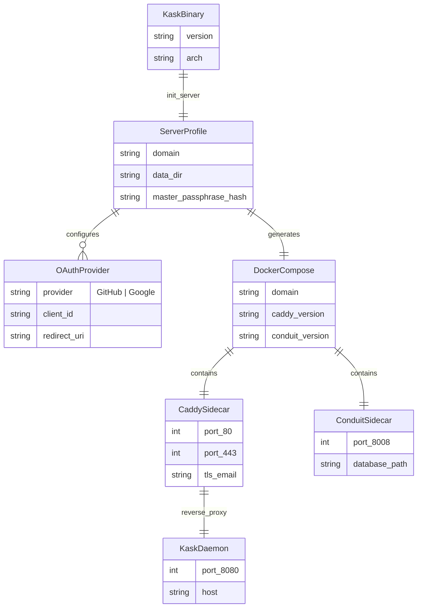
<!-- DIAGRAM_ALIGNMENT
id: DIAG-FS-013
verified_date: 2026-07-12
verified_against: crates/hkask-types/src/lib.rs, crates/hkask-cns/src/lib.rs
status: VERIFIED
-->

### 4.3 Contract-Anchoring ERD

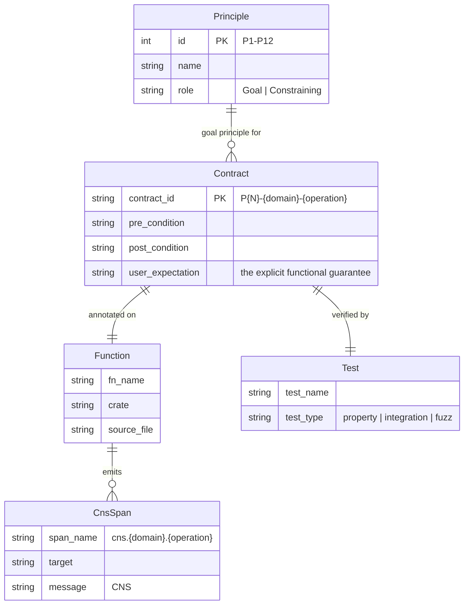
<!-- DIAGRAM_ALIGNMENT
id: DIAG-FS-014
verified_date: 2026-07-12
verified_against: crates/hkask-types/src/lib.rs, crates/hkask-cns/src/lib.rs
status: VERIFIED
-->

---

## Future Work

The following items are identified but deferred. They are documented here to preserve design intent and prevent rediscovery.


### 3. ER Diagram → Code Synchronization

ER diagrams in `FUNCTIONAL_SPECIFICATION.md` §2–§4 are documentation artifacts; they can drift from the actual type definitions in `hkask-types`. A future graph query tool could verify diagram-to-code alignment automatically by parsing Rust type definitions.

### 4. Deployment Domain Implementation

Domain 26 (Deployment) is implemented through Phase 5 (end-to-end HTTP integration tests, K8s manifest hardening, health endpoint with DB + Conduit checks). The deployment plan (`docs/plans/deployment-and-backup.md`) is Active status. K8s manifests live in `deploy/k8s/` (18 YAML files). Phase 6 (hardening: interruption testing, multi-user isolation stress tests, backup auto-export tuning) is deferred.

### 5. Principle Conflict Resolution Formalization

When constraining principles conflict (e.g., P1 sovereignty vs P4 OCAP boundary), the resolution rules are implicit in the existing codebase (higher-ranked principle dominates per Optimality Theory ranking). Formalizing this as a decision procedure in `PRINCIPLES.md` is future work — the current "Goal Principle Anchoring" rule (`PRINCIPLES.md` §1.6) covers the uncontested case.

### 6. Domain ER Diagrams — Non-CNS Domains

ER diagrams have been added for all 8 CNS domains (§2) and the deployment domain (§3.18). The remaining 18 non-CNS domains (§3) have entity models described in contract tables but not yet diagrammed. Adding compact ER diagrams for these domains is a deferred documentation task.

---

## Appendix A: Document Metadata

| Field | Value |
|-------|-------|
| Version | v0.31.0 |
| Created | 2026-06-16 |
| Status | Active — anchor for contract vocabulary and the Testing Discipline |
| Last Updated | 2026-07-05 |
| Contract Count | 99 CNS + wallet/agents/storage/memory/inference(cloud-only)/templates (complete) + deployment (17 production, 5 test) + codegraph (10 production, 3 test) + classify (algo merge, no separate test) + guard (6 production, 6 test) + memory-remember (3 production) |
| Build Status | `cargo check` workspace — PASS |
| Governance | PRINCIPLES.md §0–§1.4 |
| Deployment Reference | §3.18 deployment domain, `docs/plans/deployment-and-backup.md`, `deploy/k8s/README.md`, `docs/diagrams/` |
| ERDs | §2 — 8 CNS domain ER diagrams; §3.18 — deployment domain ER diagram; §4 — Core domain model, deployment model, contract-anchoring model; `docs/diagrams/erd-codegraph-schema.md` — codegraph schema ERD |


## Appendix B: Validation Checklist

- [x] All 99 CNS contracts carry principle annotations
- [x] Build passes clean: `cargo check --workspace`
- [x] All test IDs updated to new format
- [x] Domain map complete (27 domains — 22 existing + 5 new: web, multi-user, backup, deployment, codegraph)
- [x] FR tables complete (all 8 CNS domains + 11 non-CNS domains)
- [x] Realignment status table complete
- [x] Non-CNS domain contracts (wallet, storage, memory, inference, templates) — realigned and verified
- [x] User Expectation column added to domain map (§1)
- [x] Service Layer Architecture section added (§1.5) — AgentService structure, dependency direction, loop membrane, strangler fig log
- [x] Domain ER diagrams added for 8 CNS domains (§2) + deployment (§3.18)
- [x] `expect:` syntax documented in TESTING_DISCIPLINE.md §1.2
- [x] Goal Principle Anchoring rule added to PRINCIPLES.md §1.6
- [x] All document metadata updated (version, status, cross-references) across 8 documents
- [x] Future Work section added (§Future Work)
- [x] Deployment domain specification (§3.18) — 12 production contracts, 4 test contracts
- [x] Web Interface specification — OAuth, xterm.js terminal, WebSocket PTY (planned — see `docs/plans/deployment-and-backup.md`)
- [x] Multi-User specification — Admin/Member roles, invite flow, admin-only endpoints (planned)
- [x] Backup & Migration specification — SQLCipher archive, export/upload, replicant operations (planned)

## Appendix C: Key References

- [PRINCIPLES.md](PRINCIPLES.md) — 12 governing principles
- [MDS.md](MDS.md) — Minimum Definition Specification
- [TESTING_DISCIPLINE.md](TESTING_DISCIPLINE.md) — Contract testing discipline
- [TESTING_DISCIPLINE.md](TESTING_DISCIPLINE.md) — Definitive contract standard
- [hKask Architecture Master](../hKask-architecture-master.md) — Full architecture reference

[^fowler-strangler]: Fowler, M. (2004). "StranglerFigApplication." martinfowler.com. <https://martinfowler.com/bliki/StranglerFigApplication.html>.

---

---

## Bloom QA Pipeline (Merged from BLOOM_QA_PIPELINE.md)


# Capabilities Researcher — Bloom QA Pipeline

**Version:** 4.0 | **Pipeline:** `corpus/pipeline-capabilities-researcher.yaml`

## Persona

**Business and Economics Researcher** — analyzes the gap between what organizations, markets, and systems are capable of and what they actually achieve. Draws on economic theory, systems thinking, computing principles, scientific method, and institutional analysis. Core question: *What is the economic significance of unrealized potential?*

## Analytical Framework

```
Capabilities (what a system CAN do)
    ├── Economic: transaction costs, agency, information asymmetry
    ├── Systems: feedback loops, emergence, path dependence
    ├── Computing: information theory, algorithmic efficiency
    ├── Scientific: hypothesis testing, empirical evidence
    └── Institutional: culture, governance, historical context
    │
    ▼
Performance (what a system ACTUALLY achieves)
    │
    ▼
GAP ← Economic significance? Why does it exist? How to close it?
```

## Bloom's Taxonomy (Capability-Performance Frame)

| Level | Application |
|-------|------------|
| **Factual** | Identify capabilities, resources, performance metrics, gap measurements |
| **Conceptual** | Explain mechanisms linking capabilities to outcomes. What models fit? |
| **Analyze** | Compare capability-performance relationships across contexts. Find patterns. |
| **Evaluate** | Assess evidence for gap explanations. Critique frameworks. Judge significance. |
| **Create** | Design interventions. Synthesize multi-domain strategies. Formulate hypotheses. |

## Pipeline (8 Phases)

| Phase | Input | Output |
|-------|-------|--------|
| 0 | 105 source files (PDF/HTML) | Extracted text |
| 1 | Extracted text | Chunks (~500 tokens) |
| 2 | Chunks | Embeddings + salience tags |
| 3 | Tagged chunks | Bloom taxonomy prompts (3× per chunk) |
| 4 | Prompts | Generated QAs (DeepSeek V4 Pro) |
| 5 | Raw QAs | Balanced train/val/test (1,000/level) |
| 6 | Training set | h_mems + embedding vectors |
| 7 | Embeddings | John Brooks persona centroids |
| 8 | Chat format QAs | LoRA adapter (Qwen3.6-27B, RunPod/Unsloth) |

## Artifacts

| File | Purpose |
|------|---------|
| `corpus/qa_pairs/prompts_bloom.jsonl` | Bloom taxonomy prompts |
| `corpus/qa_pairs/train_chat.jsonl` | Training QAs (chat format) |
| `corpus/qa_pairs/val_chat.jsonl` | Validation QAs |
| `corpus/qa_pairs/test_chat.jsonl` | Test QAs |
| `corpus/memory/corpus_memory.db` | Semantic memory + embeddings |
| `corpus/replica/john-brooks.yaml` | Persona build config |

---

## Cross-Reference QA (Merged from CROSS_REFERENCE_QA.md)


# Cross-Reference QA Generation — Design Note

**Added:** 2026-07-09 | **Flag:** `corpus-ingest build-prompts --cross-reference`  
**Research Basis:** RA-DIT (Lin et al., 2024), Self-RAG (Asai et al., 2023)

## Problem

Standard QA generation from individual text chunks produces shallow QAs that test recall of single passages. Investment reasoning requires synthesis across sources — comparing Damodaran's DCF to Fabozzi's RIM, diagnosing competitive position from Greenwald's framework applied to Porter's five forces. Single-chunk QAs cannot capture this.

## Solution

`build-prompts --cross-reference` groups tagged chunks by shared investment concepts, selects the top-N most salient chunks per concept group, and generates prompts that require the LLM to synthesize across multiple passages with explicit source citation.

### Algorithm

```
1. Group all qualifying chunks by shared concepts (HashMap<concept, Vec<chunk>>)
2. Filter to groups with 2+ chunks
3. Sort groups by: (a) chunk count descending, (b) max salience descending
4. For each group:
   a. Sort chunks by salience, take top-N (default: 3)
   b. Assign QA type by rotation: comparative → diagnostic → causal → applied
   c. Generate prompt with all passages + citation requirement
   d. Append to prompts.jsonl with `"cross_reference": true` marker
```

### Prompt Structure

The system prompt explicitly requires:
- Synthesis across multiple passages
- Source citation per claim ("Per Passage 1, ... while Passage 3 notes ...")
- Grounding in provided text, not invented facts
- QA types that inherently require multi-source reasoning: comparative (contrast perspectives), diagnostic (identify cross-source patterns/tensions), causal (trace idea connections), applied (multi-source diagnosis of a scenario)

### Traceability

Each cross-reference prompt records:
- `chunk_refs: ["corpus:book:damodaran:12", "corpus:book:fabozzi:45", ...]` — all source chunks
- `concept: "valuation_methods"` — the shared concept anchoring the synthesis
- `cross_reference: true` — flag distinguishing from single-chunk prompts

## Research Basis

**RA-DIT** (Lin et al., 2024, "RA-DIT: Retrieval-Augmented Dual Instruction Tuning") demonstrates that retrieval-augmented generation quality improves when the LLM is explicitly trained/fine-tuned to attend across multiple retrieved passages rather than treating them as independent context blocks. Cross-reference prompting implements this at the generation level — requiring the LLM to compare, contrast, and synthesize before generating.

**Self-RAG** (Asai et al., 2023, "Self-RAG: Learning to Retrieve, Generate, and Critique through Self-Reflection") shows that models trained to cite sources produce more factually grounded outputs. The mandatory citation requirement ("cite which passages") reduces hallucination.

**GraphRAG** (Microsoft Research, 2024) demonstrates that knowledge-graph-structured retrieval (our concept-grouped chunks) outperforms flat KNN for multi-hop reasoning tasks. Our concept grouping via `EntityTags` provides lightweight graph structure without a full knowledge graph.

## Usage

```bash
corpus-ingest build-prompts \
  --cross-reference \
  --cross-ref-max-chunks 3 \
  --cross-ref-max-prompts 500 \
  --min-salience 0.05 \
  --min-concepts 2
```

Expected output: ~500 cross-reference prompts appended to `corpus/qa_pairs/prompts.jsonl`, interleaved with standard single-chunk prompts. The LLM consuming these prompts generates QAs that test synthesis, not recall.
