# hKask Functional Specification

**Version:** v0.28.0
**Created:** 2026-06-16
**Status:** Active — anchor for the Testing Discipline and rSolidity (formally adopted as the contracting language)  
**Last Updated:** 2026-06-18  
**Decision:** 2026-06-18 — rSolidity is formally adopted as the contracting language for hKask. The contract standard is defined in [`CONTRACT_GUIDE.md`](../../../guides/CONTRACT_GUIDE.md). `#[contract(id=..., principle=...)]` is the target contract identity marker; `/// REQ:` is the transitional convention.

> This document maps the complete system to its motivating principles, enumerates functional requirements per domain, and links each requirement to the contracts that implement it. Every contract carries a **goal principle** (the explicit user functional expectation the contract enforces) and **constraining principles** (the other principles that constrain how the goal is achieved). See [`CONTRACT_GUIDE.md`](../../../guides/CONTRACT_GUIDE.md) for the definitive contract standard — this document defines the *domain-to-contract mapping*, not the contract format itself.

---

## 1. Domain Breakdown

### Domain Map

| # | Domain | Short Tag | Crate | Contracts | User Expectation | Goal Principle |
|---|---------|-----------|-------|-----------|-----------------|----------------------|
| 1 | Energy Budgeting | `energy` | hkask-cns | 20 | System prevents runaway agent resource consumption | P9 (Homeostatic Self-Regulation) |
| 2 | Algedonic Signalling | `algedonic` | hkask-cns | 4 | System alerts when regulation thresholds are breached | P9 (Homeostatic Self-Regulation) |
| 3 | Runtime Observability | `runtime` | hkask-cns | 24 | System provides unified CNS observability and regulation feedback | P9 (Homeostatic Self-Regulation) |
| 4 | Tool Governance | `gov-tool` | hkask-cns | 3 | System gates tool execution behind OCAP capability checks | P9 (Homeostatic Self-Regulation) |
| 5 | Inference Governance | `gov-inf` | hkask-cns | 2 | System gates inference calls behind energy budget checks | P9 (Homeostatic Self-Regulation) |
| 6 | Circuit Breaking | `circuit` | hkask-cns | 3 | System prevents cascading failures in external service calls | P9 (Homeostatic Self-Regulation) |
| 7 | API Metering | `api` | hkask-cns | 8 | System enforces per-key rate limits and gas tracking | P9 (Homeostatic Self-Regulation) |
| 8 | Energy Estimation | `est` | hkask-cns | 2 | System estimates energy costs for regulated operations | P9 (Homeostatic Self-Regulation) |
| 9 | Cybernetics Loop | `loop` | hkask-cns | 1 | System maintains homeostatic regulation via feedback loops | P9 (Homeostatic Self-Regulation) |
| 10 | Wallet | `wallet` | hkask-wallet | 23 | System manages rJoule balances and energy-based payments | P9 (Homeostatic Self-Regulation) |
| 11 | Storage | `storage` | hkask-storage | 168 | System provides durable triple storage across all domains | P3 (Generative Space) |
| 12 | Memory | `memory` | hkask-memory | 68 | System stores and retrieves episodic and semantic knowledge | P3 (Generative Space) |
| 13 | Inference Engine | `inference` | hkask-inference | 94 | System regulates LLM calls across provider boundaries | P9 + P4 (Homeostatic + Boundary) |
| 14 | Template Engine | `templates` | hkask-templates | 53 | System renders skill templates into executable prompts | P3 (Generative Space) |
| 15 | MCP Servers | `mcp` | mcp-servers/ | 41 | System provides single-responsibility tool servers | P5 (Essentialism) |
| 16 | Service Layer | `services` | hkask-services | 305+ | System composes a single service layer shared by CLI and API | P5 + P7 (Essentialism + Evolution) |
| 17 | Agent Runtime | `agents` | hkask-agents | 159 | User's agents operate within sovereignty boundaries | P1 (User Sovereignty) |
| 18 | Communication | `comm` | hkask-comm | 6 | Agents communicate through user-owned channels | P1 (User Sovereignty) |
| 19 | Keystore | `keystore` | hkask-keystore | 5 | User's keys are generated, stored, and rotated securely | P1 (User Sovereignty) |
| 20 | Type System | `types` | hkask-types | 40 | System types are semantically grounded and provenance-aware | P8 (Semantic Grounding) |
| 21 | API Surface | `api` | hkask-api | 25 | User accesses all functionality through a REST API with sovereignty enforcement | P1 + P4 (Sovereignty + Boundaries) |
| 22 | CLI Surface | `cli` | kask | 12 | User accesses all functionality through a single binary CLI | P3 (Generative Space) |
| 23 | Web Interface | `web` | hkask-api + hkask-web | 19 | User signs in via OAuth and gets a browser terminal | P1 (User Sovereignty) + P4 (Clear Boundaries) |
| 24 | Multi-User | `multi-user` | hkask-api + hkask-storage | 12 | Users share a server with scoped data and admin-managed membership | P1 (User Sovereignty) + P2 (Affirmative Consent) |
| 25 | Backup & Migration | `backup` | hkask-storage + hkask-api | 14 | User exports and migrates their data as a portable encrypted archive | P1 (User Sovereignty) + P3 (Generative Space) |
| 26 | Deployment | `deploy` | hkask-api + kask | 16 | User deploys hKask with a single binary and one command | P5 (Essentialism) + P3 (Generative Space) |

### Domain Anchoring Rules

Each domain's contracts trace upward through constraining principles to a single goal principle, which itself traces to a Magna Carta principle (P1–P4). The user expectation column above captures the OUGHT that drives principle selection per domain. Key anchoring rules:

1. **P9 (Homeostatic Self-Regulation)** owns all CNS regulation-loop contracts: energy, algedonic, runtime, circuit breaker, API metering, energy estimation, tool governance, inference governance
2. **P4 (Clear Boundaries)** is the primary constraining principle on CNS governance contracts — the OCAP membrane that enforces boundaries. It does not serve as a goal principle in CNS.
3. **P8 (Semantic Grounding)** owns all type-level identity contracts: `EnergyCost`, `EnergyDelta` newtypes
4. **P12 (Subscriber Consent)** owns all subscriber/consent contracts: `subscribe`, `subscribe_async`
5. **P3 (Generative Space)** owns all sync/blocking variants and content-domain contracts: blocking accessors, storage, memory, CLI
6. **P7 (Evolutionary Architecture)** owns all configurable-from-real-usage contracts: threshold calibration, replenish rate tuning
7. **P1 (User Sovereignty) + P2 (Affirmative Consent)** own the web interface, multi-user, and backup domains: OAuth sessions, PTY terminals, role assignment, invitation flow, portable sovereignty archives
8. **P5 (Essentialism) + P3 (Generative Space)** own the deployment domain: single-binary packaging, sidecar generation, systemd integration

A contract has **exactly one goal principle** and **1 to 11 constraining principles**. The goal principle determines the ID prefix (`P{N}`). Constraining principles appear as `[P{N}]` annotations in the contract body.

---

## 1.5 Service Layer Architecture

**Crate:** `hkask-services` — shared business logic for CLI and API surfaces.

**Canonical specification:** [`MDS-agent-service.md`](../../specifications/specs/MDS-agent-service.md) — full domain spec, accessor methods, depth test results, and service boundary definitions.

### 1.5.1 AgentService Structure

`AgentService` is the canonical service layer owning all shared infrastructure. All **28 fields** are **private** and exposed through **individual named accessor methods** (replacing the earlier grouped-tuple pattern). `AgentService::build(config)` assembles all shared infrastructure once at startup.

| Method | Returns | Category |
|--------|---------|----------|
| `config()` | `&ServiceConfig` | Configuration |
| `wallet()` | `Option<&Arc<WalletService>>` | Payments |
| `wallet_store()` | `Option<&Arc<WalletStore>>` | Payments |
| `memory()` | `(&Arc<dyn EpisodicStoragePort>, &Arc<dyn SemanticStoragePort>)` | Memory |
| `registry()` | `&Arc<tokio::sync::Mutex<SqliteRegistry>>` | Storage |
| `goal_repo()` | `&Arc<SqliteGoalRepository>` | Storage |
| `cns_runtime()` | `&Arc<RwLock<CnsRuntime>>` | CNS |
| `cybernetics_loop()` | `&Arc<RwLock<CyberneticsLoop>>` | CNS |
| `loop_system()` | `&Arc<LoopSystem>` | CNS |
| `event_sink()` | `&Arc<dyn NuEventSink>` | CNS |
| `seam_watcher()` | `&Arc<RwLock<Option<SeamWatcher>>>` | CNS |
| `capability_checker()` | `&Arc<CapabilityChecker>` | Governance |
| `mcp_dispatcher()` | `&Arc<McpDispatcher>` | Governance |
| `escalation_queue()` | `&Arc<EscalationQueue>` | Governance |
| `inference_port()` | `Option<Arc<dyn InferencePort>>` | Coordination |
| `mcp_runtime()` | `&Arc<McpRuntime>` | Coordination |
| `pod_factory()` | `&Arc<PodFactory>` | Coordination |
| `active_pods()` | `&Arc<ActivePods>` | Coordination |
| `identity()` | `(&WebID, &Arc<hkask_agents::A2ARuntime>)` | Identity |
| `sovereignty()` | `SovereigntyService` | Sovereignty |
| `curation_inbox_tx()` | `&Option<mpsc::UnboundedSender<CurationInput>>` | Internal |
| `sovereignty_boundary_store()` | `&SovereigntyBoundaryStore` | Sovereignty |
| `spec_store()` | `&SqliteSpecStore` | Surface-specific |
| `agent_registry_store()` | `&hkask_storage::AgentRegistryStore` | Surface-specific |
| `user_store()` | `&Arc<std::sync::Mutex<UserStore>>` | Surface-specific |
| `daemon_handler()` | `&Arc<ServiceDaemonHandler>` | Daemon |
| `matrix_transport()` | `Option<&Arc<tokio::sync::Mutex<MatrixTransport>>>` | Communication |

Both CLI and API surfaces compose `AgentService` and add only presentation-specific fields:

- `ReplState` = `AgentService` + REPL fields (prompt history, input state)
- `ApiState` = `Arc<AgentService>` + HTTP fields (router, OpenAPI spec) + surface-specific stores

### 1.5.2 Dependency Direction

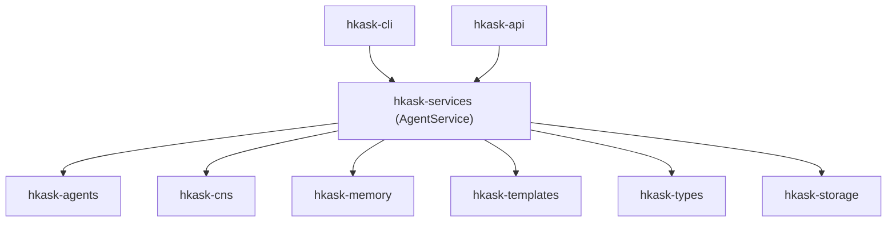

Domain crates **never** depend on `hkask-services`. MCP servers **never** depend on `hkask-services` for orchestration (P1 Prohibition — out-of-process isolation). Tri-surface exception: `hkask-mcp-replica` and `hkask-mcp-spec` import for delegation only.

### 1.5.3 Loop Architecture Membrane

The transport layer uses `tokio::mpsc` channels to route between loops without creating cross-loop authority:

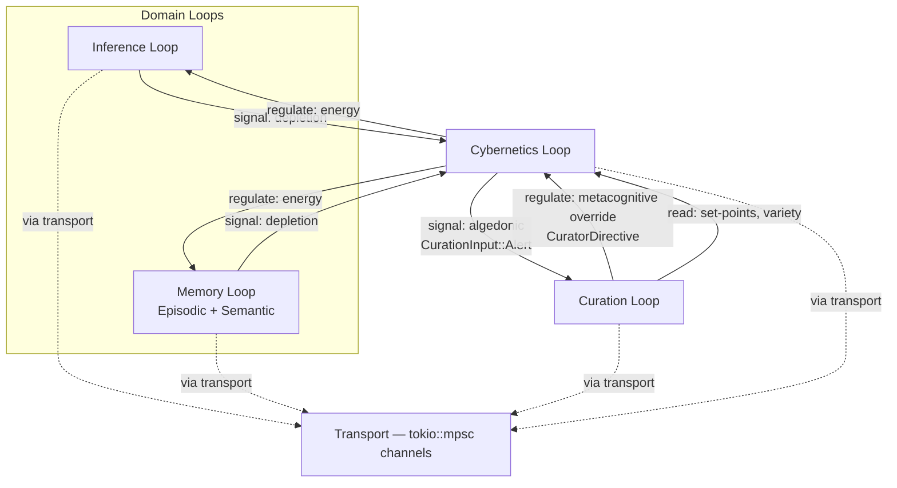

**Key rules:** Domain loops signal their governing meta loop but never each other directly. Transport is a dumb pipe, not a regulator. The Curation Loop is the single authority that can override any meta loop's decision.

### 1.5.4 Strangler Fig Extraction Log

The service layer was extracted from duplicated surface logic using the strangler fig pattern:

| Service | Extracted From | When | Constraint |
|---------|---------------|------|------------|
| `hkask-services-backup` | `hkask-services` | v0.27.0 | P5 (Essentialism — parallel compilation benefit) |
| `AgentService` (28-field consolidation) | CLI + API duplicate chains | v0.28.0 | P7 (Evolutionary Architecture — seam emerged from real usage) |
| Named accessor pattern (individual methods) | 8-group-method tuple pattern | v0.28.0 | P5 (Essentialism — callers typically need one field, not a group) |

---

## 2. Functional Requirements by Domain

### 2.1 Energy Budgeting (`energy`)

**Goal Principle:** P9 (Homeostatic Self-Regulation) — gas budget enforcement prevents runaway agents
**Constraining Principle:** P8 (Semantic Grounding) — type-level identity for energy cost types
**Crate:** `hkask-cns` | **Source:** `src/energy.rs`

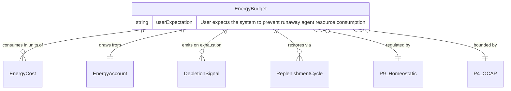

#### Production Contracts (16)

| FR# | Contract ID | Function | Principle Annotations |
|-----|------------|----------|---------------------|
| FR-E1 | `P8-cns-energy-cost-from-raw` | `EnergyCost::from_raw(u64) -> Self` | [P8] Goal: Semantic Grounding — type-level identity preservation; [P5] Constraining: Essentialism |
| FR-E2 | `P8-cns-energy-cost-as-raw` | `EnergyCost::as_raw() -> u64` | [P8] Goal: Semantic Grounding — symmetric type-level identity; [P5] Constraining: Essentialism |
| FR-E3 | `P8-cns-energy-delta-from-raw` | `EnergyDelta::from_raw(f64) -> Self` | [P8] Goal: Semantic Grounding — type-level identity for f64 newtype; [P5] Constraining: Essentialism |
| FR-E4 | `P8-cns-energy-delta-as-raw` | `EnergyDelta::as_raw() -> f64` | [P8] Goal: Semantic Grounding — symmetric type-level identity; [P5] Constraining: Essentialism |
| FR-E5 | `P9-cns-energy-delta-descending` | `EnergyDelta::is_descending() -> bool` | [P9] Goal: Homeostatic Self-Regulation — lazy universe compliance detection; [P8] Constraining: Semantic Grounding |
| FR-E6 | `P9-cns-energy-delta-ascending` | `EnergyDelta::is_ascending() -> bool` | [P9] Goal: Homeostatic Self-Regulation — anti-lazy detection triggers alert; [P8] Constraining: Semantic Grounding |
| FR-E7 | `P9-cns-energy-budget-new` | `EnergyBudget::new(cap) -> Self` | [P9] Goal: Homeostatic Self-Regulation — budget creation enables regulation; [P4] Constraining: Clear Boundaries — cap enforces OCAP boundary |
| FR-E8 | `P9-cns-energy-budget-unlimited` | `EnergyBudget::unlimited() -> Self` | [P9] Goal: Homeostatic Self-Regulation — observability without throttling; [P4] Constraining: Clear Boundaries |
| FR-E9 | `P9-cns-energy-budget-with-replenish-rate` | `EnergyBudget::with_replenish_rate(rate) -> Self` | [P9] Goal: Homeostatic Self-Regulation — configurable replenishment knob; [P7] Constraining: Evolutionary Architecture — emerged from real usage |
| FR-E10 | `P9-cns-energy-budget-with-alert-threshold` | `EnergyBudget::with_alert_threshold(threshold) -> Self` | [P9] Goal: Homeostatic Self-Regulation — configurable alert threshold; [P7] Constraining: Evolutionary Architecture |
| FR-E11 | `P9-cns-energy-budget-with-hard-limit` | `EnergyBudget::with_hard_limit(hard) -> Self` | [P9] Goal: Homeostatic Self-Regulation — boundary enforcement toggle; [P4] Constraining: Clear Boundaries |
| FR-E12 | `P9-cns-energy-budget-can-proceed` | `EnergyBudget::can_proceed(gas) -> bool` | [P9] Goal: Homeostatic Self-Regulation — check-before-execute gateway; [P4] Constraining: Clear Boundaries |
| FR-E13 | `P9-cns-energy-budget-available` | `EnergyBudget::available() -> EnergyCost` | [P9] Goal: Homeostatic Self-Regulation — visible state for feedback loops; [P4] Constraining: Clear Boundaries |
| FR-E14 | `P9-cns-energy-budget-reserve` | `EnergyBudget::reserve(gas) -> Result` | [P9] Goal: Homeostatic Self-Regulation — hold-settle pattern; [P4] Constraining: Clear Boundaries |
| FR-E15 | `P9-cns-energy-budget-settle` | `EnergyBudget::settle(reserved, actual) -> Result` | [P9] Goal: Homeostatic Self-Regulation — completes hold-settle cycle; [P4] Constraining: Clear Boundaries |
| FR-E16 | `P9-cns-energy-budget-consume` | `EnergyBudget::consume(gas) -> Result` | [P9] Goal: Homeostatic Self-Regulation — immediate deduction path; [P4] Constraining: Clear Boundaries |
| FR-E17 | `P9-cns-energy-budget-replenish` | `EnergyBudget::replenish()` | [P9] Goal: Homeostatic Self-Regulation — regulation cycle; [P4] Constraining: Clear Boundaries |
| FR-E18 | `P9-cns-energy-budget-replenish-by` | `EnergyBudget::replenish_by(amount)` | [P9] Goal: Homeostatic Self-Regulation — targeted curation replenishment; [P4] Constraining: Clear Boundaries |
| FR-E19 | `P9-cns-energy-budget-replenish-by-weighted` | `EnergyBudget::replenish_by_weighted(amount, prio) -> EnergyCost` | [P9] Goal: Homeostatic Self-Regulation — priority-weighted replenishment; [P4] + [P7] Constraining |

#### Test Contracts (4)

| FR# | Contract ID | Test Name |
|-----|------------|-----------|
| FR-E-T1 | `P9-cns-energy-budget-invariant-test` | budget_never_exceeds_cap — property test: remaining + reserved ≤ cap |
| FR-E-T2 | `P9-cns-energy-budget-available-test` | available_never_negative — property test: available ≥ 0 |
| FR-E-T3 | `P9-cns-energy-budget-replenish-test` | replenish_never_exceeds_cap — property test: remaining ≤ cap after replenish |
| FR-E-T4 | (included above) | `EnergyCost` newtype contract test |


### 2.2 Algedonic Signalling (`algedonic`)

**Goal Principle:** P9 (Homeostatic Self-Regulation) — algedonic feedback loop for variety deficit escalation
**Constraining Principle:** P4 (Clear Boundaries) — cap enforcement through binary classification
**Crate:** `hkask-cns` | **Source:** `src/algedonic.rs`

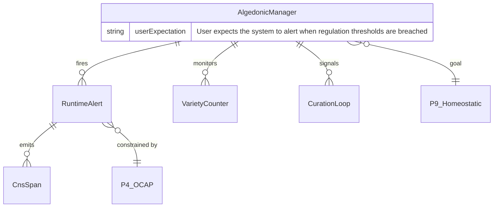

#### Production Contracts (4)

| FR# | Contract ID | Function | Principle Annotations |
|-----|------------|----------|---------------------|
| FR-A1 | `P9-cns-algedonic-alert-new` | `RuntimeAlert::new(domain, deficit, threshold) -> Self` | [P9] Goal: Homeostatic Self-Regulation — alert construction for feedback; [P4] Constraining: Clear Boundaries |
| FR-A2 | `P9-cns-algedonic-alert-should-escalate` | `RuntimeAlert::should_escalate() -> bool` | [P9] Goal: Homeostatic Self-Regulation — escalation feedback loop; [P4] Constraining: Clear Boundaries |
| FR-A3 | `P9-cns-algedonic-alert-is-critical` | `RuntimeAlert::is_critical() -> bool` | [P9] Goal: Homeostatic Self-Regulation — critical threshold detection; [P4] Constraining: Clear Boundaries |
| FR-A4 | `P9-cns-algedonic-alert-is-warning` | `RuntimeAlert::is_warning() -> bool` | [P9] Goal: Homeostatic Self-Regulation — warning threshold detection; [P4] Constraining: Clear Boundaries |

#### Test Contracts (5)

| FR# | Contract ID | Test Name |
|-----|------------|-----------|
| FR-A-T1 | `P9-cns-algedonic-binary-threshold-test` | binary_threshold_classifies_critical_and_warning |
| FR-A-T2 | `P9-cns-algedonic-accumulation-test` | algedonic_manager_accumulates_alerts_across_domains |
| FR-A-T3 | `P9-cns-outcome-classify-test` | check_outcome_classifies_success_rate_correctly |
| FR-A-T4 | `P9-cns-outcome-message-test` | check_outcome_alert_message_includes_domain_and_rate |
| FR-A-T5 | `P9-cns-outcome-prefix-test` | check_outcome_domain_prefixed_with_outcome |


### 2.3 Runtime Observability (`runtime`)

**Goal Principle:** P9 (Homeostatic Self-Regulation) — single entry point for CNS observability and regulation
**Constraining Principles:** P3 (Generative Space — sync variants), P7 (Evolutionary Architecture — calibrate), P12 (Affirmative Consent — subscribe)
**Crate:** `hkask-cns` | **Source:** `src/runtime.rs`

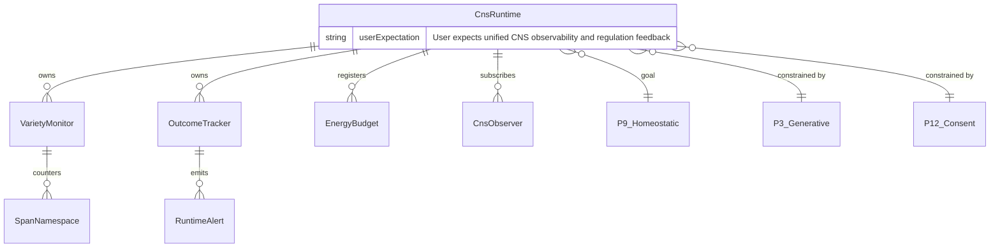

#### P9 Production Contracts (18)

| FR# | Contract ID | Function | Principle Annotations |
|-----|------------|----------|---------------------|
| FR-R1 | `P9-cns-runtime-variety-monitor-new` | `VarietyMonitor::new() -> Self` | [P9] Goal: Homeostatic Self-Regulation — monitor enables feedback loops; [P5] Constraining: Essentialism |
| FR-R2 | `P9-cns-runtime-variety-for-domain` | `VarietyMonitor::variety_for_domain(domain) -> u64` | [P9] Goal: Homeostatic Self-Regulation — variety measurement drives loop closure; [P8] Constraining: Semantic Grounding |
| FR-R3 | `P9-cns-runtime-variety-monitor-domains` | `VarietyMonitor::domains() -> Vec<&str>` | [P9] Goal: Homeostatic Self-Regulation — domain enumeration enables loop feedback; [P8] Constraining: Semantic Grounding |
| FR-R4 | `P9-cns-runtime-with-threshold` | `CnsRuntime::with_threshold(threshold) -> Self` | [P9] Goal: Homeostatic Self-Regulation — runtime creation enables regulation; [P7] Constraining: Evolutionary Architecture |
| FR-R5 | `P9-cns-runtime-health` | `CnsRuntime::health() -> CnsHealth` | [P9] Goal: Homeostatic Self-Regulation — health query drives loop decisions; [P8] Constraining: Semantic Grounding |
| FR-R6 | `P9-cns-runtime-alerts` | `CnsRuntime::alerts() -> Vec<RuntimeAlert>` | [P9] Goal: Homeostatic Self-Regulation — alert retrieval enables loop response; [P8] Constraining: Semantic Grounding |
| FR-R7 | `P9-cns-runtime-default-threshold` | `CnsRuntime::default_threshold() -> u64` | [P9] Goal: Homeostatic Self-Regulation — threshold config enables loop tuning; [P7] Constraining: Evolutionary Architecture |
| FR-R8 | `P9-cns-runtime-critical-alerts` | `CnsRuntime::critical_alerts() -> Vec<RuntimeAlert>` | [P9] Goal: Homeostatic Self-Regulation — critical alert filtering enables prioritised response; [P8] Constraining: Semantic Grounding |
| FR-R9 | `P9-cns-runtime-variety` | `CnsRuntime::variety() -> HashMap<SpanNamespace, u64>` | [P9] Goal: Homeostatic Self-Regulation — variety measurement drives loop closure; [P8] Constraining: Semantic Grounding |
| FR-R10 | `P9-cns-runtime-variety-for-domain` | `CnsRuntime::variety_for_domain(domain) -> u64` | [P9] Goal: Homeostatic Self-Regulation — domain-specific variety; [P8] Constraining: Semantic Grounding |
| FR-R11 | `P9-cns-runtime-record-outcome` | `CnsRuntime::record_outcome(domain, success, err) -> ()` | [P9] Goal: Homeostatic Self-Regulation — outcome tracking enables quality-based regulation; [P4] Constraining: Clear Boundaries |
| FR-R12 | `P9-cns-runtime-check-outcome` | `CnsRuntime::check_outcome(domain) -> Option<RuntimeAlert>` | [P9] Goal: Homeostatic Self-Regulation — outcome check drives loop decisions; [P4] Constraining: Clear Boundaries |
| FR-R13 | `P9-cns-runtime-outcome-success-rate` | `CnsRuntime::outcome_success_rate(domain) -> Option<f64>` | [P9] Goal: Homeostatic Self-Regulation — success rate is a feedback metric; [P8] Constraining: Semantic Grounding |
| FR-R14 | `P9-cns-runtime-increment-variety` | `CnsRuntime::increment_variety(domain, state_name)` | [P9] Goal: Homeostatic Self-Regulation — variety counter drives loop closure; [P4] Constraining: Clear Boundaries |
| FR-R15 | `P9-cns-runtime-check-variety` | `CnsRuntime::check_variety(domain) -> Option<RuntimeAlert>` | [P9] Goal: Homeostatic Self-Regulation — variety check drives loop closure; [P4] Constraining: Clear Boundaries |
| FR-R16 | `P9-cns-runtime-register-energy-budget` | `CnsRuntime::register_energy_budget(agent, budget)` | [P9] Goal: Homeostatic Self-Regulation — budget registration enables energy tracking; [P4] Constraining: Clear Boundaries |
| FR-R17 | `P9-cns-runtime-replenish-agent-budget` | `CnsRuntime::replenish_agent_budget(agent, amount) -> EnergyCost` | [P9] Goal: Homeostatic Self-Regulation — budget replenishment drives energy loop; [P4] Constraining: Clear Boundaries |
| FR-R18 | `P9-cns-runtime-agent-gas-status` | `CnsRuntime::agent_gas_status(agent) -> Option<AgentEnergyStatus>` | [P9] Goal: Homeostatic Self-Regulation — gas status query drives energy loop; [P8] Constraining: Semantic Grounding |

#### P3 Blocking Variants (1)

| FR# | Contract ID | Function | Principle Annotations |
|-----|------------|----------|---------------------|
| FR-R19 | `P3-cns-runtime-blocking-variety-for-domain` | `CnsRuntime::blocking_variety_for_domain(domain) -> u64` | [P3] Goal: Generative Space — sync access preserves generative capability; [P7] Constraining: Evolutionary Architecture — blocking variant emerged from real usage; [P4] Constraining: Clear Boundaries — must not be called from async context |


#### P7 Calibrate & P3 Blocking Variants (2)

| FR# | Contract ID | Function | Principle Annotations |
|-----|------------|----------|---------------------|
| FR-R20 | `P7-cns-runtime-calibrate-threshold` | `CnsRuntime::calibrate_threshold(domain, new_threshold)` | [P7] Goal: Evolutionary Architecture — threshold parameter emerged from real usage; [P4] Constraining: Clear Boundaries |
| FR-R21 | `P3-cns-runtime-calibrate-threshold-blocking` | `CnsRuntime::calibrate_threshold_blocking(domain, new_threshold)` | [P3] Goal: Generative Space — sync access preserves generative capability; [P7] Constraining: Evolutionary Architecture — blocking variant emerged from real usage; [P4] Constraining: Clear Boundaries |

#### P12 Subscriber Contracts (3)

| FR# | Contract ID | Function | Principle Annotations |
|-----|------------|----------|---------------------|
| FR-R22 | `P12-cns-runtime-subscribe` | `CnsRuntime::subscribe(observer: Arc<dyn CnsObserver>)` | [P12] Goal: Affirmative Consent — observer registration requires explicit subscription; [P2] Constraining: User Sovereignty |
| FR-R23 | `P12-cns-runtime-subscribe-async` | `CnsRuntime::subscribe_async(observer: Arc<dyn CnsObserver>)` | [P12] Goal: Affirmative Consent — observer registration requires explicit subscription; [P2] Constraining: User Sovereignty |
| FR-R24 | `P9-cns-runtime-emit-backpressure` | `CnsRuntime::emit_backpressure(signal: BackpressureSignal)` | [P9] Goal: Homeostatic Self-Regulation — backpressure signal closes the regulation loop; [P4] Constraining: Clear Boundaries |

#### Test Contracts (6)

| FR# | Contract ID | Test Name |
|-----|------------|-----------|
| FR-R-T1 | `P9-cns-runtime-variety-monitor-test-001` | variety_monitor_tracks_distinct_states |
| FR-R-T2 | `P9-cns-runtime-variety-deficit-test-002` | variety_tracker_deficit_calculation |
| FR-R-T3 | `P9-cns-runtime-variety-isolation-test-003` | variety_monitor_multi_domain_isolation |
| FR-R-T4 | `P9-cns-runtime-outcome-rate-test-004` | outcome_tracker_success_rate_calculation |
| FR-R-T5 | `P9-cns-runtime-outcome-breakdown-test-005` | outcome_tracker_error_kind_breakdown |
| FR-R-T6 | `P9-cns-runtime-outcome-window-test-006` | outcome_tracker_window_reset |


### 2.4 Tool Governance (`gov-tool`)

**Goal Principle:** P9 (Homeostatic Self-Regulation) — tool execution gated by energy budget and OCAP checks
**Constraining Principles:** P4 (Clear Boundaries — OCAP membrane enforcement), P12 (Affirmative Consent — agent identity is the consent anchor)
**Crate:** `hkask-cns` | **Source:** `src/governed_tool.rs`

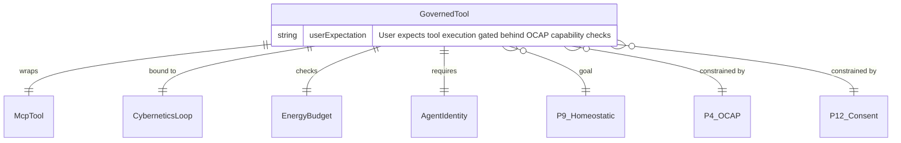

#### Production Contracts (3)

| FR# | Contract ID | Function | Principle Annotations |
|-----|------------|----------|---------------------|
| FR-GT1 | `P9-cns-gov-tool-new` | `GovernedTool::new(inner, cybernetics, sink, est, agent) -> Self` | [P9] Goal: Homeostatic Self-Regulation — tool governance enables feedback loops; [P4] Constraining: Clear Boundaries — cybernetics binding enforces OCAP boundary |
| FR-GT2 | `P9-cns-gov-tool-consumption-channel` | `GovernedTool::with_tool_consumption_channel(tx) -> Self` | [P9] Goal: Homeostatic Self-Regulation — consumption channel closes cybernetic feedback loop; [P4] Constraining: Clear Boundaries — channel ownership tracks consumer identity |
| FR-GT3 | `P12-cns-gov-tool-with-agent` | `GovernedTool::with_agent(agent) -> Self` | [P12] Goal: Affirmative Consent — agent identity is the consent anchor; [P4] Constraining: Clear Boundaries — OCAP gate enforces boundary per invocation |

#### Test Contracts (4)

| FR# | Contract ID | Test Name |
|-----|------------|-----------|
| FR-GT-T1 | `P9-cns-gov-tool-legacy-exact-match-test` | legacy_exact_match_grants_correct_tool — OCAP Path 1 |
| FR-GT-T2 | `P9-cns-gov-tool-legacy-denies-test` | legacy_exact_match_denies_wrong_tool — OCAP Path 1 denial |
| FR-GT-T3 | `P9-cns-gov-tool-domain-capability-test` | domain_capability_matches_mcp_tool_domain — OCAP Path 2 |
| FR-GT-T4 | `P9-cns-gov-tool-domain-denies-test` | domain_capability_denies_different_domain — OCAP Path 2 denial |


### 2.5 Inference Governance (`gov-inf`)

**Goal Principle:** P9 (Homeostatic Self-Regulation) — inference calls gated by energy budget and provider membrane
**Constraining Principles:** P4 (Clear Boundaries — provider membrane), P12 (Affirmative Consent — agent identity is required for attribution)
**Crate:** `hkask-cns` | **Source:** `src/governed_inference.rs`

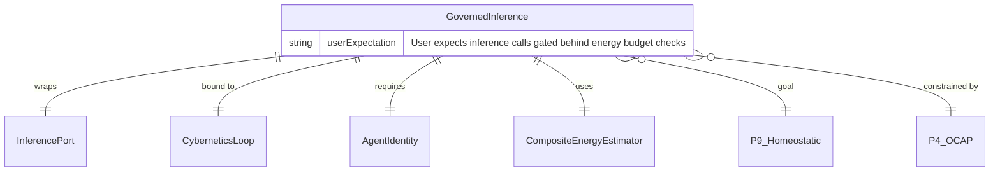

#### Production Contracts (2)

| FR# | Contract ID | Function | Principle Annotations |
|-----|------------|----------|---------------------|
| FR-GI1 | `P9-cns-gov-inf-new` | `GovernedInference::new(inner, cybernetics, sink, agent) -> Self` | [P9] Goal: Homeostatic Self-Regulation — inference governance enables cybernetic control; [P4] Constraining: Clear Boundaries — membrane wraps inner InferencePort at OCAP boundary; [P12] Constraining: Affirmative Consent |
| FR-GI2 | `P12-cns-gov-inf-with-agent` | `GovernedInference::with_agent(agent) -> Self` | [P12] Goal: Affirmative Consent — agent identity is the consent anchor; [P4] Constraining: Clear Boundaries — OCAP gate enforces boundary per inference call |

#### Test Contracts (2)

| FR# | Contract ID | Test Name |
|-----|------------|-----------|
| FR-GI-T1 | `P9-cns-gov-inf-est-cost-max-tokens` | estimate_inference_cost_uses_max_tokens — cost estimation uses max_tokens|
| FR-GI-T2 | `P9-cns-gov-inf-est-cost-floors-at-one` | estimate_inference_cost_floors_at_one — cost estimation floors at 1 |


### 2.6 Circuit Breaker (`circuit`)

**Goal Principle:** P9 (Homeostatic Self-Regulation) — CNS regulation loop enforces homeostasis over external service calls
**Constraining Principle:** P4 (Clear Boundaries) — circuit state transitions are boundary conditions
**Crate:** `hkask-cns` | **Source:** `src/circuit_breaker.rs`

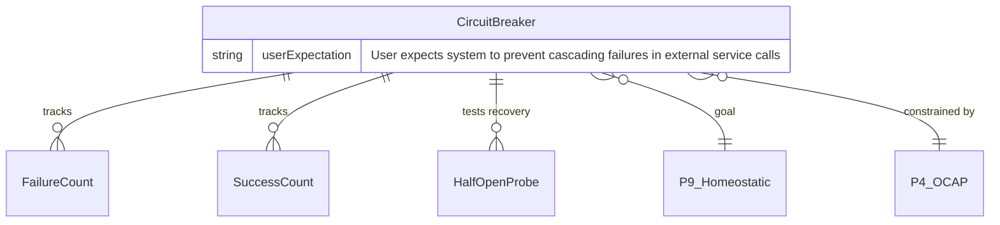

#### Production Contracts (3)

| FR# | Contract ID | Function | Principle Annotations |
|-----|------------|----------|---------------------|
| FR-CB1 | `P9-cns-circuit-default-for-inference` | `CircuitBreaker::default_for_inference(name) -> Self` | [P9] Goal: Homeostatic Self-Regulation — CNS regulation loop enforces boundary; [P4] Constraining: Clear Boundaries — default thresholds establish failure boundary |
| FR-CB2 | `P9-cns-circuit-allow-request` | `CircuitBreaker::allow_request() -> bool` | [P9] Goal: Homeostatic Self-Regulation — check-before-execute gateway; [P4] Constraining: Clear Boundaries — state-driven gating enforces the boundary |
| FR-CB3 | `P9-cns-circuit-record-success` | `CircuitBreaker::record_success()` | [P9] Goal: Homeostatic Self-Regulation — success count drives loop closure; [P4] Constraining: Clear Boundaries — threshold-based state transition enforces boundary |


### 2.7 API Metering (`api`)

**Goal Principle:** P9 (Homeostatic Self-Regulation) — per-key rate limiting, gas tracking, and CNS spans
**Constraining Principles:** P7 (Evolutionary Architecture — hardcoded endpoint weight table, configurable later), P4 (Clear Boundaries — rate limit thresholds are boundary conditions)
**Crate:** `hkask-cns` | **Source:** `src/api_metering.rs`

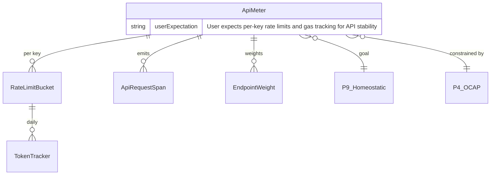

#### Production Contracts (8)

| FR# | Contract ID | Function | Principle Annotations |
|-----|------------|----------|---------------------|
| FR-AM1 | `P9-cns-api-meter-endpoint-weight` | `endpoint_weight(path) -> EndpointWeight` | [P9] Goal: Homeostatic Self-Regulation — per-request rate limiting for API stability; [P7] Constraining: Evolutionary Architecture — hardcoded table to be configurable later |
| FR-AM2 | `P9-cns-api-meter-rate-limit-status` | `RateLimitStatus::as_str() -> &'static str` | [P9] Goal: Homeostatic Self-Regulation — rate limit status feedback for CNS; [P8] Constraining: Semantic Grounding — string representation must be stable across versions |
| FR-AM3 | `P9-cns-api-meter-new` | `ApiMeter::new() -> Self` | [P9] Goal: Homeostatic Self-Regulation — empty meter ready for per-key tracking; [P5] Constraining: Essentialism — minimal constructor with empty buckets map |
| FR-AM4 | `P9-cns-api-meter-check-and-record` | `ApiMeter::check_and_record(key_id, max_rpm, max_tokens, tokens) -> RateLimitStatus` | [P9] Goal: Homeostatic Self-Regulation — rate limit enforcement is the CNS check; [P4] Constraining: Clear Boundaries — rate limit thresholds are boundary conditions |
| FR-AM5 | `P9-cns-api-meter-current-rpm` | `ApiMeter::current_rpm(key_id) -> u32` | [P9] Goal: Homeostatic Self-Regulation — current rate is the cybernetic state; [P8] Constraining: Semantic Grounding — RPM count must be stable and accurate |
| FR-AM6 | `P9-cns-api-meter-span-new` | `ApiRequestSpan::new(key_id, endpoint, matched, gas, enc, status) -> Self` | [P9] Goal: Homeostatic Self-Regulation — span creation is the CNS observation layer; [P8] Constraining: Semantic Grounding — span fields must be traceable to source |
| FR-AM7 | `P9-cns-api-meter-alert-type` | `ApiMeteringAlert::alert_type() -> &'static str` | [P9] Goal: Homeostatic Self-Regulation — alert type is the CNS classification; [P8] Constraining: Semantic Grounding — alert type labels must be stable across versions |
| FR-AM8 | `P9-cns-api-meter-alert-severity` | `ApiMeteringAlert::severity() -> &'static str` | [P9] Goal: Homeostatic Self-Regulation — severity is the algedonic signal; [P8] Constraining: Semantic Grounding — severity labels must be stable across versions |

#### Test Contracts (8)

| FR# | Contract ID | Test Name |
|-----|------------|-----------|
| FR-AM-T1 | `P9-cns-api-meter-endpoint-weight` | endpoint_weight_embed_corpus_is_heavy |
| FR-AM-T2 | `P9-cns-api-meter-endpoint-weight` | endpoint_weight_default_is_one |
| FR-AM-T3 | `P9-cns-api-meter-check-and-record` | rate_limit_bucket_prunes_old_requests |
| FR-AM-T4 | `P9-cns-api-meter-check-and-record` | rate_limit_bucket_enforces_rpm |
| FR-AM-T5 | `P9-cns-api-meter-check-and-record` | token_tracking_resets_on_new_day |
| FR-AM-T6 | `P9-cns-api-meter-check-and-record` | api_meter_enforces_limits |
| FR-AM-T7 | `P9-cns-api-meter-span-new` | api_request_span_serialization |
| FR-AM-T8 | `P9-cns-api-meter-alert-severity` | alert_severity_levels |


### 2.8 Energy Estimation (`est`)

**Goal Principle:** P9 (Homeostatic Self-Regulation) — composite estimator routes inference and table estimation
**Crate:** `hkask-cns` | **Source:** `src/composite_energy_estimator.rs`, `src/wallet_energy_estimator.rs`

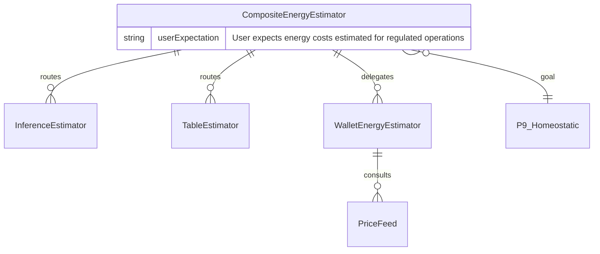

#### Production Contracts (2)

| FR# | Contract ID | Function | Principle Annotations |
|-----|------------|----------|---------------------|
| FR-EE1 | `P9-cns-est-composite-new` | `CompositeEnergyEstimator::new() -> Self` | [P9] Goal: Homeostatic Self-Regulation — composite estimator enables feedback loops; [P5] Constraining: Essentialism — minimal constructor, empty estimators |
| FR-EE2 | `P9-cns-wallet-est-calibrate` | `WalletEnergyEstimator::calibrate(observed_ratio) -> bool` | [P9] Goal: Homeostatic Self-Regulation — Good Regulator feedback loop closure; [P4] Constraining: Clear Boundaries — threshold tolerance enforces boundary; [P7] Constraining: Evolutionary Architecture — EMA parameters emerged from real usage |

#### Test Contracts (5)

| FR# | Contract ID | Test Name |
|-----|------------|-----------|
| FR-EE-T1 | `P9-cns-est-wallet-001` | calibrate_first_observation_initializes_EMA |
| FR-EE-T2 | `P9-cns-est-wallet-002` | calibrate_within_tolerance_no_adjustment |
| FR-EE-T3 | `P9-cns-est-wallet-003` | calibrate_EMA_smooths_observations |
| FR-EE-T4 | `P9-cns-est-wallet-004` | calibrate_clamps_extreme_ratios |
| FR-EE-T5 | `P9-cns-est-wallet-005` | calibrate_floors_gas_per_rjoule_at_one |

---

## 3. Non-CNS Domain Stubs

These domains are documented here for completeness. Most contracts are already realigned to `P{N}-*-` namespaces; the remaining cleanup is the legacy `SVC-*`, `svc-*`, `MUST-*`, and bare `P9`/`P3` IDs in `hkask-services` plus any straggler non-`P{N}` IDs in `hkask-agents` and `hkask-inference`.

### 3.1 Wallet (`hkask-wallet`)

**Goal Principle:** P9 (Homeostatic Self-Regulation) — rJoule balance, encumbrance, and fee estimation form the wallet's energy regulation loop
**Constraining Principles:** P1 (User Sovereignty), P2 (Affirmative Consent), P4 (Clear Boundaries), P8 (Semantic Grounding)
**Crate:** `hkask-wallet`
**Sources:** `src/manager.rs`, `src/issuer.rs`, `src/signing.rs`, `src/hinkal.rs`, `src/price_feed.rs`, `src/hedera.rs`, `src/solana.rs`, `tests/hinkal_adapter.rs`

#### Production Contracts (27)

| FR# | Contract ID | Function | Principle Annotations |
|-----|------------|----------|---------------------|
| FR-W1 | `P9-wallet-mgr-struct` | `WalletManager` struct | [P9] Goal: Homeostatic Self-Regulation — wallet is the energy regulation anchor; [P1] Constraining: User Sovereignty — wallet_seed is user-owned and zeroized |
| FR-W2 | `P9-wallet-mgr-build` | `WalletManager::build(...)` | [P9] Goal: Homeostatic Self-Regulation — wallet construction; [P1] Constraining: User Sovereignty — wallet_seed resolved and zeroized |
| FR-W3 | `P9-wallet-mgr-balance` | `WalletManager::get_balance(wallet_id)` | [P9] Goal: Homeostatic Self-Regulation — balance is the cybernetic state; [P8] Constraining: Semantic Grounding — gas/USDC equivalents derive deterministically |
| FR-W4 | `P9-wallet-mgr-api-key-get` | `WalletManager::get_api_key(key_id)` | [P9] Goal: Homeostatic Self-Regulation — API key health state for feedback loops; [P4] Constraining: Clear Boundaries — revoked keys are excluded |
| FR-W5 | `P9-wallet-mgr-chain-error-span` | `WalletManager::emit_chain_error_for_actor` | [P9] Goal: Homeostatic Self-Regulation — chain errors feed the CNS sense loop; [P12] Constraining: Subscriber Consent — actor identity is recorded |
| FR-W6 | `P9-wallet-mgr-can-afford` | `WalletManager::can_afford(wallet_id, cost_rj)` | [P9] Goal: Homeostatic Self-Regulation — optimistic hold-settle prevents overspend; [P4] Constraining: Clear Boundaries — cannot reserve beyond balance |
| FR-W7 | `P9-wallet-mgr-reserve` | `WalletManager::reserve_rjoules(wallet_id, amount)` | [P9] Goal: Homeostatic Self-Regulation — optimistic hold-settle prevents overspend; [P4] Constraining: Clear Boundaries — cannot reserve beyond balance |
| FR-W8 | `P9-wallet-mgr-settle` | `WalletManager::settle_rjoules(wallet_id, reserved, actual)` | [P9] Goal: Homeostatic Self-Regulation — optimistic hold-settle prevents overspend; [P4] Constraining: Clear Boundaries — cannot reserve beyond balance |
| FR-W9 | `P9-wallet-mgr-encumber` | `WalletManager::encumber(wallet_id, key_id, amount)` | [P9] Goal: Homeostatic Self-Regulation — encumbrance locks energy for API keys; [P4] Constraining: Clear Boundaries — only the entitled key can consume; [P8] Constraining: Semantic Grounding — atomic consume/release preserves balance |
| FR-W10 | `P9-wallet-mgr-release-encumbrance` | `WalletManager::release_encumbrance(key_id)` | [P9] Goal: Homeostatic Self-Regulation — encumbrance locks energy for API keys; [P4] Constraining: Clear Boundaries — only the entitled key can consume; [P8] Constraining: Semantic Grounding — atomic consume/release preserves balance |
| FR-W11 | `P9-wallet-mgr-consume` | `WalletManager::consume(key_id, gas_rj)` | [P9] Goal: Homeostatic Self-Regulation — encumbrance locks energy for API keys; [P4] Constraining: Clear Boundaries — only the entitled key can consume; [P8] Constraining: Semantic Grounding — atomic consume/release preserves balance |
| FR-W12 | `P9-wallet-mgr-get-encumbrance` | `WalletManager::get_encumbrance(key_id)` | [P9] Goal: Homeostatic Self-Regulation — encumbrance locks energy for API keys; [P4] Constraining: Clear Boundaries — only the entitled key can consume; [P8] Constraining: Semantic Grounding — atomic consume/release preserves balance |
| FR-W13 | `P9-wallet-mgr-fee-estimate` | `WalletManager::estimate_withdrawal_fee` | [P9] Goal: Homeostatic Self-Regulation — fee estimate enables cost-aware withdrawal; [P8] Constraining: Semantic Grounding — derived from live/native USD rate |
| FR-W14 | `P9-wallet-mgr-key-alert-span` | `WalletManager::emit_key_alert` | [P9] Goal: Homeostatic Self-Regulation — algedonic feedback closure for API key lifecycle; [P12] Constraining: Subscriber Consent — emits span only if sink subscribed |
| FR-W15 | `P9-wallet-mgr-deposit-ref-nonce` | `WalletManager::generate_deposit_reference` HKDF context | [P9] Goal: Homeostatic Self-Regulation — deposit attribution supports energy inflow; [P4] Constraining: Clear Boundaries — nonce binds reference to specific invocation |
| FR-W16 | `P9-wallet-issuer-struct` | `ApiKeyIssuer` struct | [P9] Goal: Homeostatic Self-Regulation — API keys scope and limit agent energy access; [P2] Constraining: Affirmative Consent — keys are explicitly scoped, revocable, and user-issued; [P4] Constraining: Clear Boundaries — spending limits and expiry enforce capability boundaries; [P1] Constraining: User Sovereignty — private keys are returned once and never stored |
| FR-W17 | `P9-wallet-issuer-new` | `ApiKeyIssuer::new(store)` | [P9] Goal: Homeostatic Self-Regulation — API keys scope and limit agent energy access; [P1] Constraining: User Sovereignty — wallet_seed resolved and zeroized |
| FR-W18 | `P9-wallet-issuer-create-key` | `ApiKeyIssuer::create_key(...)` | [P9] Goal: Homeostatic Self-Regulation — API keys scope and limit agent energy access; [P2] Constraining: Affirmative Consent — keys are explicitly scoped, revocable, and user-issued; [P4] Constraining: Clear Boundaries — spending limits and expiry enforce capability boundaries; [P1] Constraining: User Sovereignty — private keys are returned once and never stored |
| FR-W19 | `P9-wallet-issuer-revoke-key` | `ApiKeyIssuer::revoke_key(key_id)` | [P9] Goal: Homeostatic Self-Regulation — API keys scope and limit agent energy access; [P2] Constraining: Affirmative Consent — revocable capabilities; [P1] Constraining: User Sovereignty — unspent balance returned |
| FR-W20 | `P9-wallet-issuer-list-keys` | `ApiKeyIssuer::list_keys(wallet_id)` | [P9] Goal: Homeostatic Self-Regulation — API key inventory for feedback loops; [P4] Constraining: Clear Boundaries — only active keys returned |
| FR-W21 | `P9-wallet-issuer-zeroize-seed` | `ApiKeyIssuer::create_key` key generation | [P1] Constraining: User Sovereignty — Ed25519 seed wrapped in Zeroizing for automatic zeroize on drop |
| FR-W22 | `P9-wallet-sign-withdrawal` | `sign_withdrawal(chain, tx_bytes)` | [P9] Goal: Homeostatic Self-Regulation — signing authorizes energy outflow; [P1] Constraining: User Sovereignty — treasury key derived from user master key; [P4] Constraining: Clear Boundaries — key material never leaves this module |
| FR-W23 | `P9-wallet-sign-hinkal-message` | `sign_message(message)` | [P9] Goal: Homeostatic Self-Regulation — Hinkal session signing authorizes privacy-layer flow; [P4] Constraining: Clear Boundaries — message is opaque bytes; signature proves treasury origin |
| FR-W24 | `P9-wallet-sign-capability` | `sign_capability(capability)` | [P9] Goal: Homeostatic Self-Regulation — signing authorizes API key capability; [P1] Constraining: User Sovereignty — treasury key derived from user master key; [P4] Constraining: Clear Boundaries — key material never leaves this module |
| FR-W25 | `P2-wallet-signing-debug-redact` | `LoadedKey` Debug impl | [P2] Constraining: Affirmative Consent — key material redacted from debug output |
| FR-W26 | `P2-wallet-signing-key-boundary` | `LoadedKey` never leaves `signing.rs` | [P2] Constraining: Affirmative Consent — no un-zeroized key material crosses module boundary |
| FR-W27 | `P9-wallet-hinkal-port-new` | `HinkalPort::new` | [P9] Goal: Homeostatic Self-Regulation — privacy port is part of the energy loop; [P4] Constraining: Clear Boundaries — HTTPS-only and non-empty treasury pubkey |

#### Test Contracts (36)

| FR# | Contract ID | Test Name |
|-----|------------|-----------|
| FR-W-T1 | `P9-wallet-mgr-gas-conversion-test` | gas_to_rjoules_conversion |
| FR-W-T2 | `P9-wallet-mgr-rjoules-to-gas-test` | rjoules_to_gas_conversion |
| FR-W-T3 | `P9-wallet-mgr-fee-estimate-test` | estimate_withdrawal_fee_uses_price_feed |
| FR-W-T4 | `P9-wallet-mgr-can-afford-test` | can_afford_checks_balance |
| FR-W-T5 | `P9-wallet-mgr-reserve-rejects-test` | reserve_rejects_insufficient_balance |
| FR-W-T6 | `P9-wallet-mgr-settle-debits-test` | settle_debits_actual_cost |
| FR-W-T7 | `P9-wallet-mgr-deposit-ref-gen-test` | deposit_reference_generation |
| FR-W-T8 | `P9-wallet-mgr-balance-conservation-pbt` | balance_conservation_under_encumbrance_lifecycle |
| FR-W-T9 | `P9-wallet-mgr-deposit-monitor-idempotent-test` | deposit_monitor_credits_and_is_idempotent |
| FR-W-T10 | `P9-wallet-mgr-multi-chain-deposit-test` | poll_deposits_once_multi_chain |
| FR-W-T11 | `P9-wallet-mgr-payment-lifecycle-test` | end_to_end_payment_lifecycle |
| FR-W-T12 | `P9-wallet-mgr-encumbrance-state-machine-test` | encumbrance_status_state_machine_no_released_to_active |
| FR-W-T13 | `P9-wallet-mgr-withdraw-pipeline-test` | withdraw_full_pipeline_success |
| FR-W-T14 | `P9-wallet-mgr-withdraw-insufficient-test` | withdraw_rejects_insufficient_balance |
| FR-W-T15 | `P9-wallet-mgr-withdraw-unsupported-chain-test` | withdraw_rejects_unsupported_chain |
| FR-W-T16 | `P9-wallet-mgr-shielded-withdraw-privacy-test` | withdraw_shielded_hinkal_uses_privacy_path |
| FR-W-T17 | `P9-wallet-mgr-shielded-deposit-test` | shield_assets_uses_privacy_path |
| FR-W-T18 | `P9-wallet-issuer-create-keypair-test` | create_key_produces_valid_keypair |
| FR-W-T19 | `P9-wallet-issuer-expiry-test` | create_key_with_expiry |
| FR-W-T20 | `P9-wallet-issuer-revoke-unspent-test` | revoke_key_returns_unspent_rjoules |
| FR-W-T21 | `P9-wallet-issuer-list-active-test` | list_keys_returns_active_keys |
| FR-W-T22 | `P9-wallet-sign-withdrawal-signature-test` | sign_withdrawal_produces_signature |
| FR-W-T23 | `P9-wallet-sign-withdrawal-per-chain-test` | sign_withdrawal_differs_per_chain |
| FR-W-T24 | `P9-wallet-sign-capability-hex-test` | sign_capability_produces_hex_signature |
| FR-W-T25 | `P9-wallet-sign-withdrawal-all-chains-test` | sign_withdrawal_all_chains |
| FR-W-T26 | `P9-wallet-sign-withdrawal-empty-test` | sign_withdrawal_empty_tx_bytes |
| FR-W-T27 | `P9-wallet-sign-hinkal-message-signature-test` | sign_message_produces_signature |
| FR-W-T28 | `P9-wallet-sign-capability-tamper-test` | sign_capability_tampered_produces_different_signature |
| FR-W-T29 | `P9-wallet-price-static-rate-test` | static_price_feed_returns_expected_rates |
| FR-W-T30 | `P9-wallet-price-fee-nonzero-test` | fee_estimation_produces_non_zero_fee |
| FR-W-T31 | `P9-wallet-price-fee-floor-test` | fee_estimation_floors_at_one_rj |
| FR-W-T32 | `P9-wallet-price-chain-diff-test` | different_chains_produce_different_fees |
| FR-W-T33 | `P9-wallet-price-eodhd-parse-test` | eodhd_feed_parses_close_field |
| FR-W-T34 | `P9-wallet-price-coingecko-parse-test` | coingecko_feed_parses_usd_field |
| FR-W-T35 | `P9-wallet-price-composite-primary-test` | composite_returns_from_primary_source_on_success |
| FR-W-T36 | `P9-wallet-price-composite-fallback-test` | composite_falls_back_when_primary_fails |

> **Note:** Chain-adapter integration tests for Hedera, Solana, and Hinkal are realigned to `P9-wallet-hedera-*`, `P9-wallet-solana-*`, and `P9-wallet-hinkal-*` test IDs and are enumerated in the contract inventory. They are omitted above for brevity; see `docs/architecture/core/REQ_CONTRACT_INVENTORY.md` for the complete list.

### 3.2 Storage (`hkask-storage`)

**168 contracts** — storage spans multiple principles:
- **P3 (Generative Space)** — CRUD stores: agent registry, embeddings, gallery, goals, triples, wallet store, kata history, escalation, NuEvent store, spec store
- **P1 (User Sovereignty)** — user store, sovereignty boundaries, wallet-store tests
- **P2 (Affirmative Consent)** — consent store
- **P4 (Clear Boundaries)** — lock helpers, path safety, encrypted database, service→storage contract tests
- **P8 (Semantic Grounding)** — spec types, embedding/gallery/triple counts

**Crate:** `hkask-storage` | **Sources:** all `src/*.rs` and `tests/contract/services_storage_contract.rs`

#### Production Contracts (168 unique IDs)

| Domain | Principle | Contract Count | Representative IDs |
|--------|-----------|----------------|-------------------|
| Lock helpers | P4 | 3 | `P4-sto-lock-mutex`, `P4-sto-lock-read`, `P4-sto-lock-write` |
| Path safety | P4 | 1 | `P4-sto-path-safe-join` |
| Consent store | P2 | 4 | `P2-sto-consent-schema`, `P2-sto-consent-store`, `P2-sto-consent-get`, `P2-sto-consent-delete` |
| Sovereignty boundaries | P1 | 4 | `P1-sto-sovereignty-schema`, `P1-sto-sovereignty-store`, `P1-sto-sovereignty-get`, `P1-sto-sovereignty-delete` |
| NuEvent store | P3/P9 | 5 | `P3-sto-nu-event-replay`, `P3-sto-nu-event-decay`, `P3-sto-nu-event-cursor-store`, `P3-sto-nu-event-cursor-load`, `P3-sto-nu-event-algedonic-query` |
| Spec store | P3 | 6 | `P3-sto-spec-schema`, `P3-sto-spec-curation-*` |
| Spec types | P8 | 6 | `P8-sto-spec-str-enum-*`, `P8-sto-spec-id-*`, `P8-sto-spec-category-*`, `P8-sto-spec-infer-category` |
| Database | P4 | 7 | `P4-sto-database-open`, `P4-sto-database-in-memory`, `P4-sto-database-conn-arc`, `P4-sto-database-*-unwrap` |
| Kata history | P3 | 7 | `P3-sto-kata-record`, `P3-sto-kata-list-agent`, `P3-sto-kata-count-*`, `P3-sto-kata-last`, `P3-sto-kata-range`, `P3-sto-kata-delete-before` |
| Embeddings | P3 | 8 | `P3-sto-embedding-new`, `P3-sto-embedding-store`, `P3-sto-embedding-get`, `P3-sto-embedding-search`, `P3-sto-embedding-delete`, `P3-sto-embedding-count`, `P3-sto-embedding-prefix` |
| Escalation | P3 | 10 | `P3-sto-escalation-pending`, `P3-sto-escalation-queue-new`, `P3-sto-escalation-add`, `P3-sto-escalation-list-pending`, `P3-sto-escalation-get`, `P3-sto-escalation-resolve`, `P3-sto-escalation-dismiss`, `P3-sto-escalation-stats`, `P3-sto-escalation-summary-new`, `P3-sto-escalation-summary-text` |
| User store | P1 | 13 | `P1-sto-user-schema`, `P1-sto-user-register`, `P1-sto-user-login`, `P1-sto-user-logout`, `P1-sto-user-passphrase-change`, `P1-sto-user-passphrase-expired`, `P1-sto-user-session-get`, `P1-sto-user-session-list`, `P1-sto-user-replicant-get`, `P1-sto-user-human-get`, `P1-sto-user-replicant-list`, `P1-sto-user-wallet-get`, `P1-sto-user-wallet-set` |
| Gallery | P3 | 14 | `P3-sto-gallery-mode-str`, `P3-sto-gallery-schema`, `P3-sto-gallery-create`, `P3-sto-gallery-add-image`, `P3-sto-gallery-get-image`, `P3-sto-gallery-tag-image`, `P3-sto-gallery-get-tags`, `P3-sto-gallery-get`, `P3-sto-gallery-all-tags`, `P3-sto-gallery-face-register`, `P3-sto-gallery-face-list`, `P3-sto-gallery-face-get`, `P3-sto-gallery-face-remove`, `P3-sto-gallery-face-update` |
| Agent registry | P3 | 15 | `P3-sto-agent-registry-schema`, `P3-sto-agent-registry-insert`, `P3-sto-agent-registry-get`, `P3-sto-agent-registry-list`, `P3-sto-agent-registry-list-by-kind`, `P3-sto-agent-registry-remove`, `P3-sto-agent-registry-profile-*`, `P3-sto-agent-registry-contact-*`, `P3-sto-agent-registry-task-*` |
| Goals | P3 | 18 | `P3-sto-goal-repo-new`, `P3-sto-goal-repo-telemetry`, `P3-sto-goal-try-row`, `P3-sto-goal-row-parse`, `P3-sto-goal-create`, `P3-sto-goal-get`, `P3-sto-goal-update-state`, `P3-sto-goal-list`, `P3-sto-goal-criterion-add`, `P3-sto-goal-artifact-add`, `P3-sto-goal-criteria-get`, `P3-sto-goal-artifacts-get`, `P3-sto-goal-subgoal-create`, `P3-sto-goal-subgoal-list`, `P3-sto-goal-delete`, `P3-sto-goal-quarantine`, `P3-sto-goal-repair`, `P3-sto-goal-quarantine-list` |
| Triples | P3 | 22 | `P3-sto-triple-new`, `P3-sto-triple-with-*`, `P3-sto-triple-is-episodic`, `P3-sto-triple-is-semantic`, `P3-sto-triple-insert`, `P3-sto-triple-query-*`, `P3-sto-triple-update`, `P3-sto-triple-get-id`, `P3-sto-triple-low-confidence`, `P3-sto-triple-count-*`, `P3-sto-triple-query-below`, `P3-sto-triple-soft-delete`, `P3-sto-triple-hard-delete`, `P3-sto-triple-delete-prefix` |
| Wallet store | P3 | 25 | `P3-sto-wallet-wal-mode`, `P3-sto-wallet-balance-get`, `P3-sto-wallet-ensure`, `P3-sto-wallet-list-ids`, `P3-sto-wallet-credit`, `P3-sto-wallet-debit`, `P3-sto-wallet-tx-record`, `P3-sto-wallet-tx-list`, `P3-sto-wallet-tx-hash-exists`, `P3-sto-wallet-api-key-*`, `P3-sto-wallet-spent-rj-update`, `P3-sto-wallet-address-*`, `P3-sto-wallet-reference-*`, `P3-sto-wallet-encumber`, `P3-sto-wallet-encumbrance-release`, `P3-sto-wallet-encumbrance-consume`, `P3-sto-wallet-encumbrance-get` |

> **Note:** The original handoff estimated 12 storage contracts; the actual source contains **168 unique contract IDs**. Storage is the largest domain. All have been realigned to `P{N}-sto-*`.

### 3.3 Memory (`hkask-memory`)

**52 production contracts** + **16 test contracts** — P3 (Generative Space)

**Crate:** `hkask-memory` | **Sources:** `src/recall_dedup.rs`, `src/consolidation.rs`, `src/consolidation_service.rs`, `src/episodic.rs`, `src/episodic_loop.rs`, `src/semantic.rs`, `src/semantic_loop.rs`, `src/salience.rs`, `src/ranking.rs`

Memory provides the generative substrate for experience and knowledge: episodic first-person storage, semantic shared storage, consolidation bridges, salience-based budget gating, and cybernetic regulation loops.

#### Production Contracts (52 unique IDs)

| FR# | Contract ID | Function | Principle Annotations |
|-----|------------|----------|---------------------|
| FR-M001 | `P3-mem-consolidation-bridge-new` | `new()` | [P3] Goal: Generative Space — bridges episodic experience into shared semantic memory; [P4] Constraining: Clear Boundaries — links stores without bypassing their membranes |
| FR-M002 | `P3-mem-consolidation-bridge-consolidate` | `consolidate()` | [P3] Goal: Generative Space — promotes sovereign episodic triples to shared knowledge; [P1] Constraining: User Sovereignty — strips perspective only under Curator authority; [P4] Constraining: Clear Boundaries — requires ConsolidationToken from expected curator |
| FR-M003 | `P3-mem-consolidation-candidate-count` | `consolidation_candidate_count()` | [P3] Goal: Generative Space — surfaces how much episodic content is ready for promotion; [P9] Constraining: Homeostatic Self-Regulation — count-only query avoids loading full store |
| FR-M004 | `P3-mem-consolidation-service-new` | `new()` | [P3] Goal: Generative Space — user-facing entry point for memory consolidation and cleanup; [P4] Constraining: Clear Boundaries — requires Curator-issued ConsolidationToken |
| FR-M005 | `P3-mem-consolidation-service-consolidate` | `consolidate()` | [P3] Goal: Generative Space — combines episodic promotion with semantic cleanup; [P9] Constraining: Homeostatic Self-Regulation — enforces confidence floor and max triple limits; [P4] Constraining: Clear Boundaries — delegates to token-gated bridge |
| FR-M006 | `P3-mem-consolidation-service-candidate-count` | `consolidation_candidate_count()` | [P3] Goal: Generative Space — reports how many episodic triples can be promoted; [P9] Constraining: Homeostatic Self-Regulation — count-only, graceful degradation on error |
| FR-M007 | `P3-mem-consolidation-service-low-confidence-count` | `semantic_low_confidence_count()` | [P3] Goal: Generative Space — reports low-confidence semantic triples for cleanup; [P9] Constraining: Homeostatic Self-Regulation — threshold-driven pruning signal |
| FR-M008 | `P3-mem-consolidation-service-triple-count` | `semantic_triple_count()` | [P3] Goal: Generative Space — reports total semantic memory size; [P9] Constraining: Homeostatic Self-Regulation — count used for budget monitoring |
| FR-M009 | `P3-mem-episodic-memory-new` | `new()` | [P3] Goal: Generative Space — creates a sovereign first-person experience store; [P9] Constraining: Homeostatic Self-Regulation — default decay and budget are regulation defaults |
| FR-M010 | `P3-mem-episodic-store` | `store()` | [P3] Goal: Generative Space — stores a first-person experience triple; [P1] Constraining: User Sovereignty — rejects Public visibility (episodic is sovereign); [P4] Constraining: Clear Boundaries — requires perspective owner |
| FR-M011 | `P3-mem-episodic-query-deduped` | `query_for_deduped()` | [P3] Goal: Generative Space — recalls deduplicated episodic triples for an entity; [P9] Constraining: Homeostatic Self-Regulation — applies confidence decay and temporal attention at recall |
| FR-M012 | `P3-mem-episodic-storage-usage` | `storage_usage()` | [P3] Goal: Generative Space — reports episodic storage usage per perspective; [P9] Constraining: Homeostatic Self-Regulation — COUNT query avoids loading full store |
| FR-M013 | `P3-mem-episodic-storage-budget` | `storage_budget()` | [P3] Goal: Generative Space — exposes the episodic storage set-point; [P9] Constraining: Homeostatic Self-Regulation — budget bounds per-agent experience growth |
| FR-M014 | `P3-mem-episodic-candidate-count` | `consolidation_candidate_count()` | [P3] Goal: Generative Space — reports how many episodic triples are eligible for consolidation; [P9] Constraining: Homeostatic Self-Regulation — uses decayed confidence for prioritization |
| FR-M015 | `P3-mem-episodic-loop-new` | `new()` | [P3] Goal: Generative Space — wraps episodic memory in a regulated generative loop; [P9] Constraining: Homeostatic Self-Regulation — storage_budget is the cybernetic set-point |
| FR-M016 | `P3-mem-episodic-loop-with-consolidation` | `with_consolidation()` | [P3] Goal: Generative Space — enables promotion path when episodic budget is exceeded; [P9] Constraining: Homeostatic Self-Regulation — consolidation bridge fires only under token authority |
| FR-M017 | `P3-mem-episodic-loop-storage-budget` | `storage_budget()` | [P3] Goal: Generative Space — exposes the generative budget set-point for context assembly; [P9] Constraining: Homeostatic Self-Regulation — budget value is immutable after construction |
| FR-M018 | `P3-mem-ranking-rrf-score` | `rrf_score()` | [P3] Goal: Generative Space — fuses rank positions for context retrieval; [P8] Constraining: Semantic Grounding — reciprocal rank fusion is a standard ranking signal |
| FR-M019 | `P3-mem-ranking-parse-age` | `parse_age_to_days()` | [P3] Goal: Generative Space — converts human-readable age strings into comparable temporal signals; [P5] Constraining: Essentialism — returns -1.0 for unparseable input, no exceptions |
| FR-M020 | `P3-mem-ranking-normalize-date-bucket` | `normalize_date_bucket()` | [P3] Goal: Generative Space — buckets parsed age into human-readable recency labels; [P8] Constraining: Semantic Grounding — five fixed buckets preserve stable ordering |
| FR-M021 | `P3-mem-recall-eav-hash` | `eav_hash()` | [P3] Goal: Generative Space — canonical recall dedup enables reuse of factual content across memory; [P8] Constraining: Semantic Grounding — deterministic BLAKE3 hash over canonical EAV content |
| FR-M022 | `P3-mem-recall-dedup-triples` | `dedup_triples()` | [P3] Goal: Generative Space — deduplication preserves generative storage budget; [P5] Constraining: Essentialism — first-seen wins, no speculative retention policy |
| FR-M023 | `P3-mem-salience-method-signals` | `compute_method_signals()` | [P3] Goal: Generative Space — extracts cheap stylometric signals for method-aware retrieval; [P8] Constraining: Semantic Grounding — signals are deterministic heuristics over raw text |
| FR-M024 | `P3-mem-salience-declared-method-matches` | `matches()` | [P3] Goal: Generative Space — matches passage signals against declared method thresholds; [P8] Constraining: Semantic Grounding — unconfigured thresholds are always satisfied |
| FR-M025 | `P3-mem-salience-tag-entities` | `tag_entities()` | [P3] Goal: Generative Space — tags passages with declared entities for the salience graph; [P8] Constraining: Semantic Grounding — case-insensitive substring matching |
| FR-M026 | `P3-mem-salience-all-tags` | `all_tags()` | [P3] Goal: Generative Space — flattens entity categories for graph construction; [P5] Constraining: Essentialism — minimal iterator over existing vectors |
| FR-M027 | `P3-mem-salience-tag-count` | `tag_count()` | [P3] Goal: Generative Space — counts distinct tags across all categories; [P5] Constraining: Essentialism — simple sum of category lengths |
| FR-M028 | `P3-mem-salience-compute-batch` | `compute_salience_batch()` | [P3] Goal: Generative Space — scores passage salience to gate triple storage budget; [P9] Constraining: Homeostatic Self-Regulation — graph centrality bounded by neighbor sampling |
| FR-M029 | `P3-mem-salience-budget-resolve` | `resolve()` | [P3] Goal: Generative Space — resolves passage count into absolute triple budget; [P9] Constraining: Homeostatic Self-Regulation — budget caps generative storage growth |
| FR-M030 | `P3-mem-semantic-memory-new` | `new()` | [P3] Goal: Generative Space — creates shared semantic knowledge store; [P8] Constraining: Semantic Grounding — unifies triple and embedding stores |
| FR-M031 | `P3-mem-semantic-query-deduped` | `query_deduped()` | [P3] Goal: Generative Space — recalls deduplicated public semantic triples; [P4] Constraining: Clear Boundaries — filters to Public visibility |
| FR-M032 | `P3-mem-semantic-store` | `store()` | [P3] Goal: Generative Space — stores shared semantic triple; [P4] Constraining: Clear Boundaries — requires Public visibility and no perspective |
| FR-M033 | `P3-mem-semantic-triple-count` | `triple_count()` | [P3] Goal: Generative Space — reports total shared knowledge triples; [P9] Constraining: Homeostatic Self-Regulation — count feeds storage budget loop |
| FR-M034 | `P3-mem-semantic-triple-count-entity` | `triple_count_for_entity()` | [P3] Goal: Generative Space — reports semantic triples per entity; [P9] Constraining: Homeostatic Self-Regulation — per-entity budget monitoring |
| FR-M035 | `P3-mem-semantic-query-attribute` | `query_by_attribute()` | [P3] Goal: Generative Space — queries shared triples by attribute; [P8] Constraining: Semantic Grounding — attribute-based recall expands context |
| FR-M036 | `P3-mem-semantic-store-embedding` | `store_embedding()` | [P3] Goal: Generative Space — indexes embedding vector for similarity retrieval; [P8] Constraining: Semantic Grounding — vector indexed by triple entity_ref |
| FR-M037 | `P3-mem-semantic-search-similar` | `search_similar()` | [P3] Goal: Generative Space — KNN search augments recall beyond exact matches; [P8] Constraining: Semantic Grounding — results ordered by embedding distance |
| FR-M038 | `P3-mem-semantic-embedding-count` | `embedding_count()` | [P3] Goal: Generative Space — reports indexed embedding count; [P9] Constraining: Homeostatic Self-Regulation — count used for embedding budget monitoring |
| FR-M039 | `P3-mem-semantic-embedding-store` | `embedding_store()` | [P3] Goal: Generative Space — exposes embedding store for advanced operations; [P5] Constraining: Essentialism — direct accessor avoids duplicate wrappers |
| FR-M040 | `P3-mem-semantic-compute-centroid` | `compute_centroid()` | [P3] Goal: Generative Space — computes mean style vector for corpus validation; [P8] Constraining: Semantic Grounding — arithmetic mean over matching embeddings |
| FR-M041 | `P3-mem-semantic-purge-prefix` | `purge_by_prefix()` | [P3] Goal: Generative Space — purges embeddings for idempotent re-ingest; [P5] Constraining: Essentialism — prefix-based deletion, count of successes returned |
| FR-M042 | `P3-mem-semantic-chunk-text` | `chunk_text()` | [P3] Goal: Generative Space — chunks text into passage-sized units for embedding; [P5] Constraining: Essentialism — paragraph/sentence boundary splitting with min/max words |
| FR-M043 | `P3-mem-semantic-strip-gutenberg` | `strip_gutenberg_headers()` | [P3] Goal: Generative Space — removes boilerplate for clean corpus ingestion; [P5] Constraining: Essentialism — marker-based trim, no regex |
| FR-M044 | `P3-mem-semantic-delete-triple` | `delete_triple()` | [P3] Goal: Generative Space — deletes semantic triple for budget enforcement or cleanup; [P9] Constraining: Homeostatic Self-Regulation — used by regulation loops to free space |
| FR-M045 | `P3-mem-semantic-lowest-confidence` | `lowest_confidence_triples()` | [P3] Goal: Generative Space — identifies lowest-confidence triples for pruning; [P9] Constraining: Homeostatic Self-Regulation — ordered by confidence and age |
| FR-M046 | `P3-mem-semantic-low-confidence-count` | `low_confidence_count()` | [P3] Goal: Generative Space — counts uncertain semantic triples; [P9] Constraining: Homeostatic Self-Regulation — threshold-driven count |
| FR-M047 | `P3-mem-semantic-low-confidence-triples` | `low_confidence_triples()` | [P3] Goal: Generative Space — retrieves uncertain semantic triples for review; [P9] Constraining: Homeostatic Self-Regulation — bounded by threshold and limit |
| FR-M048 | `P3-mem-semantic-loop-new` | `new()` | [P3] Goal: Generative Space — wraps semantic memory in a regulated knowledge loop; [P9] Constraining: Homeostatic Self-Regulation — default budget and low-confidence threshold are set-points |
| FR-M049 | `P3-mem-semantic-loop-with-budget` | `with_budget()` | [P3] Goal: Generative Space — customizes storage budget per user or agent; [P9] Constraining: Homeostatic Self-Regulation — configurable set-point for memory homeostasis |
| FR-M050 | `P3-mem-semantic-loop-with-budget-threshold` | `with_budget_and_threshold()` | [P3] Goal: Generative Space — customizes both budget and cleanup threshold; [P7] Constraining: Evolutionary Architecture — thresholds emerge from usage patterns |
| FR-M051 | `P3-mem-semantic-loop-storage-budget` | `storage_budget()` | [P3] Goal: Generative Space — exposes the semantic storage set-point; [P9] Constraining: Homeostatic Self-Regulation — immutable budget reference for regulation |
| FR-M052 | `P3-mem-semantic-loop-low-confidence-threshold` | `low_confidence_threshold()` | [P3] Goal: Generative Space — exposes the low-confidence cleanup set-point; [P9] Constraining: Homeostatic Self-Regulation — threshold triggers pruning of uncertain knowledge |

#### Test Contracts (16 unique IDs)

| FR# | Contract ID | Test Name |
|-----|------------|-----------|
| FR-MT001 | `P3-mem-salience-hemingway-test` | `method_signals_hemingway_like()` |
| FR-MT002 | `P3-mem-salience-wilde-test` | `method_signals_wilde_like()` |
| FR-MT003 | `P3-mem-salience-declared-method-test` | `declared_method_matches()` |
| FR-MT004 | `P3-mem-salience-zero-empty-test` | `salience_zero_for_empty_tags()` |
| FR-MT005 | `P3-mem-salience-shared-entities-test` | `salience_increases_with_shared_entities()` |
| FR-MT006 | `P3-mem-salience-clustering-zero-test` | `clustering_zero_when_neighbors_disconnected()` |
| FR-MT007 | `P3-mem-salience-bridge-higher-test` | `bridge_scores_higher_than_dense_clique()` |
| FR-MT008 | `P3-mem-salience-methods-graph-test` | `methods_participate_in_graph()` |
| FR-MT009 | `P3-mem-salience-budget-per-page-test` | `budget_per_page_resolve()` |
| FR-MT010 | `P3-mem-salience-budget-absolute-test` | `budget_absolute()` |
| FR-MT011 | `P3-mem-salience-tag-case-insensitive-test` | `entity_tagging_case_insensitive()` |
| FR-MT012 | `P3-mem-salience-dialogue-ratio-test` | `dialogue_ratio_detection()` |
| FR-MT013 | `P3-mem-salience-valid-range-test` | `salience_scores_in_valid_range()` |
| FR-MT014 | `P3-mem-salience-empty-tags-proptest` | `empty_tags_produce_zero_salience()` |
| FR-MT015 | `P3-mem-semantic-centroid-dimensions-test` | `centroid_accumulation_skips_out_of_range_dimensions()` |
| FR-MT016 | `P3-mem-semantic-centroid-short-test` | `centroid_accumulation_handles_short_embedding()` |

> **Note:** The original handoff estimated ~8 memory contracts; the actual source contains **52 production** and **16 test** unique contract IDs. All have been realigned to `P3-mem-*`.

### 3.4 Inference (`hkask-inference`)

**Goal Principles:** P9 (Homeostatic Self-Regulation) + P4 (Clear Boundaries — provider membrane)
**Crate:** `hkask-inference` | **Sources:** `src/*.rs`, `tests/*.rs`

**63 production contracts** + **31 test contracts**.

#### Production Contracts

| FR# | Contract ID | Function | Principle Annotations |
|-----|------------|----------|---------------------|
| FR-I001 | `P9-inf-build-chat-request` | `build_chat_request()` | [P9] Goal: Homeostatic Self-Regulation — constructs regulated LLM request payload |
| FR-I002 | `P9-inf-map-tool-calls` | `map_tool_calls()` | [P9] Goal: Homeostatic Self-Regulation — structured tool-call results for routing |
| FR-I003 | `P9-inf-map-token-probs` | `map_token_probs()` | [P9] Goal: Homeostatic Self-Regulation — token probability metadata for monitoring |
| FR-I004 | `P9-inf-chat-response-to-result` | `chat_response_to_result()` | [P9] Goal: Homeostatic Self-Regulation — normalizes provider response for monitoring |
| FR-I005 | `P9-inf-parse-sse-stream` | `parse_sse_stream()` | [P9] Goal: Homeostatic Self-Regulation — parses streaming response chunks for regulated output |
| FR-I006 | `P9-inf-validate-prompt` | `validate_prompt()` | [P9] Goal: Homeostatic Self-Regulation — input validation prevents token overconsumption |
| FR-I007 | `P9-inf-parse-provider-from-model` | `parse_from_model()` | [P9] Goal: Homeostatic Self-Regulation — model-name routing to provider boundary |
| FR-I008 | `P9-inf-prefix-model` | `prefix_model()` | [P9] Goal: Homeostatic Self-Regulation — canonical provider-prefixed model naming |
| FR-I009 | `P9-inf-provider-as-str` | `as_str()` | [P9] Goal: Homeostatic Self-Regulation — stable provider code for routing |
| FR-I010 | `P9-inf-config-from-env` | `from_env()` | [P9] Goal: Homeostatic Self-Regulation — inference configuration resolved from environment |
| FR-I011 | `P9-inf-build-http-client` | `build_client()` | [P9] Goal: Homeostatic Self-Regulation — bounded HTTP client for regulated requests |
| FR-I012 | `P4-inf-deepinfra-backend-new` | `new()` | [P4] Goal: Clear Boundaries — DeepInfra provider membrane requires valid API key |
| FR-I013 | `P9-inf-deepinfra-generate` | `generate()` | [P9] Goal: Homeostatic Self-Regulation — regulated text generation |
| FR-I014 | `P9-inf-deepinfra-generate-vision` | `generate_vision()` | [P9] Goal: Homeostatic Self-Regulation — regulated multimodal generation |
| FR-I015 | `P9-inf-deepinfra-generate-stream` | `generate_stream()` | [P9] Goal: Homeostatic Self-Regulation — regulated streaming text generation |
| FR-I016 | `P9-inf-deepinfra-list-models` | `list_models()` | [P9] Goal: Homeostatic Self-Regulation — model variety discovery with freshness filter |
| FR-I017 | `P9-inf-deepinfra-remove-background` | `remove_background()` | [P9] Goal: Homeostatic Self-Regulation — regulated image transformation |
| FR-I018 | `P9-inf-deepinfra-generate-image` | `generate_image()` | [P9] Goal: Homeostatic Self-Regulation — regulated image generation |
| FR-I019 | `P9-inf-deepinfra-image-to-image` | `image_to_image()` | [P9] Goal: Homeostatic Self-Regulation — regulated image editing |
| FR-I020 | `P9-inf-deepinfra-generate-speech` | `generate_speech()` | [P9] Goal: Homeostatic Self-Regulation — regulated speech synthesis |
| FR-I021 | `P9-inf-deepinfra-transcribe` | `transcribe()` | [P9] Goal: Homeostatic Self-Regulation — regulated speech transcription |
| FR-I022 | `P4-inf-embedding-router-new` | `new()` | [P4] Goal: Clear Boundaries — embedding provider membrane gated by API key |
| FR-I023 | `P9-inf-embed-sentences` | `embed_sentences()` | [P9] Goal: Homeostatic Self-Regulation — regulated batch embedding generation |
| FR-I024 | `P9-inf-embed-sentence` | `embed_sentence()` | [P9] Goal: Homeostatic Self-Regulation — regulated single embedding generation |
| FR-I025 | `P4-inf-fal-backend-new` | `new()` | [P4] Goal: Clear Boundaries — fal.ai provider membrane requires valid API key |
| FR-I026 | `P9-inf-fal-generate` | `generate()` | [P9] Goal: Homeostatic Self-Regulation — regulated text generation |
| FR-I027 | `P9-inf-fal-generate-vision` | `generate_vision()` | [P9] Goal: Homeostatic Self-Regulation — regulated multimodal generation |
| FR-I028 | `P9-inf-fal-generate-stream` | `generate_stream()` | [P9] Goal: Homeostatic Self-Regulation — regulated streaming text generation |
| FR-I029 | `P9-inf-fal-list-models` | `list_models()` | [P9] Goal: Homeostatic Self-Regulation — static model catalog for variety |
| FR-I030 | `P9-inf-fal-generate-image` | `generate_image()` | [P9] Goal: Homeostatic Self-Regulation — regulated image generation |
| FR-I031 | `P9-inf-fal-image-to-image` | `image_to_image()` | [P9] Goal: Homeostatic Self-Regulation — regulated image editing |
| FR-I032 | `P9-inf-fal-remove-background` | `remove_background()` | [P9] Goal: Homeostatic Self-Regulation — regulated image transformation |
| FR-I033 | `P9-inf-fal-upscale` | `upscale()` | [P9] Goal: Homeostatic Self-Regulation — regulated image upscaling |
| FR-I034 | `P9-inf-fal-generate-video` | `generate_video()` | [P9] Goal: Homeostatic Self-Regulation — regulated video generation |
| FR-I035 | `P9-inf-fal-image-to-video` | `image_to_video()` | [P9] Goal: Homeostatic Self-Regulation — regulated video generation |
| FR-I036 | `P9-inf-fal-segment-object` | `segment_object()` | [P9] Goal: Homeostatic Self-Regulation — regulated image segmentation |
| FR-I037 | `P9-inf-fal-generate-speech` | `generate_speech()` | [P9] Goal: Homeostatic Self-Regulation — regulated speech synthesis |
| FR-I038 | `P9-inf-fal-transcribe` | `transcribe()` | [P9] Goal: Homeostatic Self-Regulation — regulated speech transcription |
| FR-I039 | `P4-inf-inference-router-new` | `new()` | [P4] Goal: Clear Boundaries — multi-provider membrane assembled from configured boundaries |
| FR-I040 | `P9-inf-router-list-models` | `list_models()` | [P9] Goal: Homeostatic Self-Regulation — aggregated model variety across providers |
| FR-I041 | `P9-inf-router-search-models` | `search_models()` | [P9] Goal: Homeostatic Self-Regulation — searchable model catalog for routing |
| FR-I042 | `P9-inf-router-list-vision-models` | `list_vision_models()` | [P9] Goal: Homeostatic Self-Regulation — vision-capable model discovery |
| FR-I043 | `P9-inf-router-generate-vision` | `generate_vision()` | [P9] Goal: Homeostatic Self-Regulation — regulated multimodal dispatch |
| FR-I044 | `P9-inf-router-generate-image` | `generate_image()` | [P9] Goal: Homeostatic Self-Regulation — regulated image generation dispatch |
| FR-I045 | `P9-inf-router-image-to-image` | `image_to_image()` | [P9] Goal: Homeostatic Self-Regulation — regulated image editing dispatch |
| FR-I046 | `P9-inf-router-remove-background` | `remove_background()` | [P9] Goal: Homeostatic Self-Regulation — regulated background removal dispatch |
| FR-I047 | `P9-inf-router-upscale` | `upscale()` | [P9] Goal: Homeostatic Self-Regulation — regulated upscaling dispatch |
| FR-I048 | `P9-inf-router-generate-video` | `generate_video()` | [P9] Goal: Homeostatic Self-Regulation — regulated video generation dispatch |
| FR-I049 | `P9-inf-router-image-to-video` | `image_to_video()` | [P9] Goal: Homeostatic Self-Regulation — regulated video generation dispatch |
| FR-I050 | `P9-inf-router-generate-speech` | `generate_speech()` | [P9] Goal: Homeostatic Self-Regulation — regulated speech synthesis dispatch |
| FR-I051 | `P9-inf-router-segment-object` | `segment_object()` | [P9] Goal: Homeostatic Self-Regulation — regulated segmentation dispatch |
| FR-I052 | `P9-inf-router-transcribe` | `transcribe()` | [P9] Goal: Homeostatic Self-Regulation — regulated transcription dispatch |
| FR-I053 | `P9-inf-router-embed-text` | `embed_text()` | [P9] Goal: Homeostatic Self-Regulation — placeholder for regulated embedding dispatch |
| FR-I054 | `P9-inf-infer-vision-support` | `infer_vision_support()` | [P9] Goal: Homeostatic Self-Regulation — heuristic routing for multimodal models |
| FR-I055 | `P4-inf-together-backend-new` | `new()` | [P4] Goal: Clear Boundaries — Together AI provider membrane requires valid API key |
| FR-I056 | `P9-inf-together-generate` | `generate()` | [P9] Goal: Homeostatic Self-Regulation — regulated text generation |
| FR-I057 | `P9-inf-together-generate-stream` | `generate_stream()` | [P9] Goal: Homeostatic Self-Regulation — regulated streaming text generation |
| FR-I058 | `P9-inf-together-list-models` | `list_models()` | [P9] Goal: Homeostatic Self-Regulation — model variety discovery |

#### Test Contracts

| FR# | Contract ID | Test Name |
|-----|------------|-----------|
| FR-IT001 | `P9-inf-test-chat-response-deserializes` | `chat_response_deserializes_openai_format()` |
| FR-IT002 | `P9-inf-test-build-chat-request-stream-false` | `build_chat_request_stream_false()` |
| FR-IT003 | `P9-inf-test-validate-prompt-rejects` | `validate_prompt_rejects_invalid()` |
| FR-IT004 | `P9-inf-test-disable-thinking-wire` | `disable_thinking_maps_to_wire_format()` |
| FR-IT005 | `P9-inf-test-enable-thinking-omitted` | `enable_thinking_omitted_when_true()` |
| FR-IT006 | `P9-inf-validate-prompt` | `validate_prompt_contract()` |
| FR-IT007 | `P9-inf-test-parse-provider-prefix` | `parse_provider_prefix()` |
| FR-IT008 | `P9-inf-test-unprefixed-model-none` | `parse_no_prefix_returns_none()` |
| FR-IT009 | `P9-inf-test-empty-model-none` | `parse_empty_model_returns_none()` |
| FR-IT010 | `P9-inf-test-too-short-none` | `parse_too_short_returns_none()` |
| FR-IT011 | `P9-inf-test-unknown-prefix-none` | `parse_unknown_prefix_returns_none()` |
| FR-IT012 | `P9-inf-test-prefix-model-format` | `prefix_model_format()` |
| FR-IT013 | `P9-inf-test-fal-prefix` | `parse_fal_prefix()` |
| FR-IT014 | `P9-inf-test-provider-code` | `parse_provider_code_all_codes()` |
| FR-IT015 | `P9-inf-test-resolve-api-key-primary` | `resolve_api_key_primary_env()` |
| FR-IT016 | `P9-inf-test-resolve-api-key-fallback` | `resolve_api_key_fallback_env()` |
| FR-IT017 | `P9-inf-test-resolve-api-key-empty` | `resolve_api_key_empty_when_missing()` |
| FR-IT018 | `P9-inf-test-resolve-api-key-priority` | `resolve_api_key_primary_wins_over_fallback()` |
| FR-IT019 | `P9-inf-test-fal-backend-new-fails` | `construction_fails_without_api_key()` |
| FR-IT020 | `P9-inf-test-fal-backend-new-succeeds` | `construction_succeeds_with_api_key()` |
| FR-IT021 | `P9-inf-test-fal-static-catalog` | `static_catalog_returns_vision_models()` |
| FR-IT022 | `P9-inf-test-fal-vision-support` | `vision_support_heuristic_recognizes_fal_models()` |
| FR-IT023 | `P9-inf-test-routing-by-provider-prefix` | `routing_by_provider_prefix()` |
| FR-IT024 | `P9-inf-test-unavailable-backend-error` | `unavailable_backend_returns_error()` |
| FR-IT025 | `P9-inf-test-default-provider-routing` | `default_provider_routing()` |
| FR-IT026 | `P9-inf-test-model-override-routing` | `model_override_routing()` |
| FR-IT027 | `P9-inf-test-list-models-degradation` | `list_models_graceful_degradation()` |
| FR-IT028 | `P9-inf-test-thinking-disable-flow` | `disable_thinking_flows_to_wire_format()` |
| FR-IT029 | `P9-inf-test-deepinfra-live-summary` | `deepinfra_summarization()` |
| FR-IT030 | `P9-inf-test-together-live-summary` | `together_summarization()` |

> **Note:** The original handoff estimated ~87 inference contract occurrences; the actual source contains **58 production** and **30 test** unique contract IDs. Backend constructors and the router constructor are P4 (boundary); all other production contracts and all tests are P9 (homeostatic). Cloud-only deployment.

### 3.5 Templates (`hkask-templates`)

**Goal Principle:** P3 (Generative Space) — template registry, vocabulary, and execution substrate
**Crate:** `hkask-templates` | **Sources:** `src/*.rs`, `tests/*.rs`

**53 production contracts** + **25 test contracts**.

#### Production Contracts

| FR# | Contract ID | Function | Principle Annotations |
|-----|------------|----------|---------------------|
| FR-T001 | `P3-tpl-capability-validator-new` | `new()` | [P3] Goal: Generative Space — registration-time OCAP gate for template capabilities; [P4] Constraining: Clear Boundaries — validator establishes capability boundary |
| FR-T002 | `P3-tpl-validate-capabilities` | `validate_capabilities()` | [P3] Goal: Generative Space — checks template capability requirements against held tokens; [P4] Constraining: Clear Boundaries — action hierarchy enforcement (Execute ≥ Write ≥ Read) |
| FR-T003 | `P3-tpl-contract-validator-new` | `new()` | [P3] Goal: Generative Space — passthrough validator for unconstrained registration; [P4] Constraining: Clear Boundaries — default Warn mode allows registration |
    | FR-T004 | `P3-tpl-contract-validator-with-mode` | `with_mode()` | [P3] Goal: Generative Space — configures validation strictness |
    | FR-T005 | `P3-tpl-contract-validator-validate-terms` | `validate_terms()` | [P3] Goal: Generative Space — declaration consistency passthrough |
| FR-T007 | `P3-tpl-manifest-executor-new` | `new()` | [P3] Goal: Generative Space — executor for template manifest cascades; [P4] Constraining: Clear Boundaries — requires ACP secret for delegation |
| FR-T006 | `P3-tpl-resolve-manifest` | `resolve_manifest()` | [P3] Goal: Generative Space — resolves template manifest references; [P8] Constraining: Semantic Grounding — manifest terms validated against lexicon |
| FR-T015 | `P3-tpl-prompt-strategy-from-input` | `from_input()` | [P3] Goal: Generative Space — constructs prompt strategy from user input |
| FR-T016 | `P3-tpl-prompt-strategy-frame` | `frame()` | [P3] Goal: Generative Space — frames prompt for a strategy step |
| FR-T017 | `P3-tpl-prompt-strategy-name` | `name()` | [P3] Goal: Generative Space — names the selected strategy |
| FR-T018 | `P3-tpl-registry-new` | `new()` | [P3] Goal: Generative Space — in-memory template registry |
| FR-T013 | `P3-tpl-registry-reload` | `reload()` | [P3] Goal: Generative Space — refreshes registry from filesystem |
| FR-T021 | `P3-tpl-registry-validate-template-path` | `validate_template_path()` | [P3] Goal: Generative Space — path safety for template discovery; [P4] Constraining: Clear Boundaries — rejects paths outside template root |
| FR-T022 | `P3-tpl-registry-register` | `register()` | [P3] Goal: Generative Space — registers a template in the registry |
| FR-T023 | `P3-tpl-registry-get` | `get()` | [P3] Goal: Generative Space — retrieves a registered template |
| FR-T024 | `P3-tpl-registry-count` | `count()` | [P3] Goal: Generative Space — reports registry size |
| FR-T025 | `P3-tpl-registry-list-skills` | `list_skills()` | [P3] Goal: Generative Space — lists registered skills |
| FR-T026 | `P3-tpl-registry-list-skills-by-visibility` | `list_skills_by_visibility()` | [P3] Goal: Generative Space — visibility-filtered skill listing |
| FR-T027 | `P3-tpl-registry-remove-skill` | `remove_skill()` | [P3] Goal: Generative Space — removes a skill from registry |
| FR-T028 | `P3-tpl-registry-register-skill` | `register_skill()` | [P3] Goal: Generative Space — registers a skill with metadata |
| FR-T029 | `P3-tpl-registry-get-skill` | `get_skill()` | [P3] Goal: Generative Space — retrieves skill metadata |
| FR-T030 | `P3-tpl-registry-skills-by-domain` | `skills_by_domain()` | [P3] Goal: Generative Space — domain-filtered skill listing |
| FR-T031 | `P3-tpl-registry-skills-referencing-template` | `skills_referencing_template()` | [P3] Goal: Generative Space — reverse skill lookup by template |
| FR-T032 | `P3-tpl-registry-register-bundle` | `register_bundle()` | [P3] Goal: Generative Space — registers a skill bundle |
| FR-T033 | `P3-tpl-registry-get-bundle` | `get_bundle()` | [P3] Goal: Generative Space — retrieves a skill bundle |
| FR-T034 | `P3-tpl-registry-list-bundles` | `list_bundles()` | [P3] Goal: Generative Space — lists registered bundles |
| FR-T035 | `P3-tpl-registry-remove-bundle` | `remove_bundle()` | [P3] Goal: Generative Space — removes a bundle |
| FR-T036 | `P3-tpl-registry-find-bundle-by-skills` | `find_bundle_by_skills()` | [P3] Goal: Generative Space — finds bundle matching skill set |
| FR-T037 | `P3-tpl-registry-bootstrap` | `bootstrap()` | [P3] Goal: Generative Space — seeds registry from workspace templates |
| FR-T038 | `P3-tpl-registry-sqlite-new` | `new()` | [P3] Goal: Generative Space — SQLite-backed template registry |
| FR-T039 | `P3-tpl-registry-sqlite-new-with-conn` | `new_with_conn()` | [P3] Goal: Generative Space — SQLite registry from existing connection |
| FR-T040 | `P3-tpl-registry-sqlite-register` | `register()` | [P3] Goal: Generative Space — persists template registration |
| FR-T042 | `P3-tpl-registry-sqlite-get-entry` | `get_entry()` | [P3] Goal: Generative Space — retrieves persisted template entry |
| FR-T043 | `P3-tpl-registry-sqlite-delete-entry` | `delete_entry()` | [P3] Goal: Generative Space — removes persisted template entry |
| FR-T034 | `P3-tpl-registry-sqlite-search-by-lexicon` | `search_by_lexicon()` | [P3] Goal: Generative Space — vocabulary-aware template search; [P8] Constraining: Semantic Grounding — search uses lexicon terms |
| FR-T045 | `P3-tpl-registry-sqlite-count` | `count()` | [P3] Goal: Generative Space — reports persisted registry size |
| FR-T046 | `P3-tpl-registry-sqlite-get-skill-owned` | `get_skill_owned()` | [P3] Goal: Generative Space — retrieves owned skill record |
| FR-T047 | `P3-tpl-registry-sqlite-list-skills-owned` | `list_skills_owned()` | [P3] Goal: Generative Space — lists owned skill records |
| FR-T048 | `P3-tpl-registry-sqlite-skills-by-domain-owned` | `skills_by_domain_owned()` | [P3] Goal: Generative Space — domain-filtered owned skill listing |
| FR-T049 | `P3-tpl-registry-sqlite-skills-referencing-template-owned` | `skills_referencing_template_owned()` | [P3] Goal: Generative Space — reverse owned skill lookup |
| FR-T050 | `P3-tpl-skill-loader-new` | `new()` | [P3] Goal: Generative Space — loader for skill registry entries |
| FR-T051 | `P3-tpl-skill-loader-load-into` | `load_into()` | [P3] Goal: Generative Space — loads skill into registry |
| FR-T052 | `P3-tpl-skill-loader-infer-domain` | `infer_domain_from_registry()` | [P3] Goal: Generative Space — infers skill domain from registry contents |
| FR-T053 | `P3-tpl-skill-loader-parse-front-matter` | `parse_front_matter()` | [P3] Goal: Generative Space — parses skill front matter metadata |

#### Test Contracts

| FR# | Contract ID | Test Name |
|-----|------------|-----------|
| FR-TT001 | `P3-tpl-test-empty-requirements-pass` | `empty_requirements_always_pass()` |
| FR-TT002 | `P3-tpl-test-satisfied-requirement-passes` | `satisfied_requirement_passes()` |
| FR-TT003 | `P3-tpl-test-unsatisfied-requirement-fails` | `unsatisfied_requirement_fails()` |
| FR-TT004 | `P3-tpl-test-execute-satisfies-read` | `execute_token_satisfies_read_requirement()` |
| FR-TT005 | `P3-tpl-test-write-satisfies-read` | `write_token_satisfies_read_requirement()` |
| FR-TT006 | `P3-tpl-test-read-not-satisfies-write` | `read_token_does_not_satisfy_write_requirement()` |
| FR-TT007 | `P3-tpl-test-malformed-requirement-error` | `malformed_requirement_returns_error()` |
| FR-TT008 | `P3-tpl-test-multiple-requirements` | `multiple_requirements_all_must_be_satisfied()` |
| FR-TT009 | `P3-tpl-test-no-held-tokens-fail` | `no_held_tokens_with_requirements_fails()` |
| FR-TT010 | `P3-tpl-test-contract-validator-passthrough` | `validator_without_lexicon_always_passes()` |
| FR-TT011 | `P3-tpl-test-contract-validator-warn-reports` | `validator_warn_mode_reports_unknown_terms()` |
| FR-TT012 | `P3-tpl-test-contract-validator-reject-blocks` | `validator_reject_mode_blocks_unknown_terms()` |
| FR-TT013 | `P3-tpl-test-contract-validator-accepts-known` | `validator_accepts_known_terms()` |
| FR-TT014 | `P3-tpl-test-contract-validator-default-passthrough` | `validator_default_is_passthrough()` |
| FR-TT015 | `P3-tpl-test-contract-validate-terms-never-panics` | `validator_never_panics()` |
| FR-TT016 | `P3-tpl-test-contract-known-terms-accepted` | `known_terms_always_accepted()` |
| FR-TT017 | `P3-tpl-test-parse-catalog-extracts-terms` | `parse_catalog_extracts_terms()` |
| FR-TT018 | `P3-tpl-test-parse-catalog-skips-non-terms` | `parse_catalog_skips_non_term_rows()` |
| FR-TT019 | `P3-tpl-test-parse-catalog-empty-error` | `parse_catalog_empty_input_returns_error()` |
| FR-TT016 | `P3-tpl-test-template-rendering-correctness` | `all_templates_render()` |
| FR-TT025 | `P3-tpl-test-manifest-schema-validation` | `all_skill_manifests_are_well_formed()` |

> **Note:** The original handoff estimated 10 template contracts; the actual source contains **53 production** and **25 test** unique contract IDs. All carry P3 as the motivating principle; boundary/semantic concerns appear as P4/P8 constraining annotations. Pre-existing ID collisions (`TPL-001`/`TPL-002`/`TPL-011` reused across unrelated functions) were resolved by assigning distinct `P3-tpl-*` IDs.

### 3.6 MCP Servers (`mcp-servers/`)

**18 contracts** — P5 (Essentialism)
- `hkask-mcp-research` — web research agent (P5)
- `hkask-mcp-spec` — specification document server (P5)
- `hkask-mcp-condenser` — context compression agent (P5)
- Tool registration, capability declaration, resource serving

### 3.7 Service Layer (`hkask-services`)

**305+ contracts** — P5 + P7 (Essentialism + Evolution) plus mixed P1/P2/P3/P4/P9 concerns because the service layer wraps many underlying domains.

The crate currently contains legacy ID namespaces (`SVC-*`, `svc-*`, `MUST-*`, `MDS-*`, `BACKUP-*`, `lifecycle-*`, `services-settings-*`, bare `P9`/`P3`) that need migration to the canonical `P{N}-svc-*` form. This is the largest remaining realignment target.

Representative domains:
- `AgentLifecycleService` — agent creation, monitoring, teardown
- `CnsService` — CNS health, alerts, variety, budget queries
- `KeystoreService` — key management and signing operations
- `WalletService` — wallet operation orchestration
- `BackupService`, `BundleService`, `ChatService`, `ComposeService`, `CuratorService`, `DiscoverService`, `EmbedService`, `GoalService`, `KataEngine`, `OnboardingService`, `PodService`, `SchedulerService`, `SkillService`, `SovereigntyService`, `SpecService`, `VerificationService`
- Service registration pattern: all services are discovered, not coupled

### 3.8 Agents (`hkask-agents`)

**30 contracts** — agents span four motivating principles:
- **P1 (User Sovereignty)** — `AgentPod`, `PodDeployment`, `PodFactory`, `SovereigntyChecker`
- **P2 (Affirmative Consent)** — `ConsentRecord`, `ConsentManager`
- **P4 (Clear Boundaries)** — A2A runtime, root authority, MCP capability adapters
- **P9 (Homeostatic Self-Regulation)** — Curator, Metacognition, LoopSystem, BotHealth, prompt classification

**Crate:** `hkask-agents` | **Sources:** `src/consent.rs`, `src/sovereignty.rs`, `src/loop_system.rs`, `src/prompt_analysis.rs`, `src/registry_loader.rs`, `src/acp/**/*.rs`, `src/curator/**/*.rs`, `src/curator_agent/**/*.rs`, `src/pod/**/*.rs`, `src/adapters/**/*.rs`, `src/ports/memory_storage.rs`, `tests/agent_pod_integration.rs`

#### Production Contracts (30 unique IDs)

| Domain | Principle | Contract IDs |
|--------|-----------|-------------|
| Consent | P2 | `P2-agt-consent-record-new`, `P2-agt-consent-record-grant`, `P2-agt-consent-record-revoke`, `P2-agt-consent-record-is-active`, `P2-agt-consent-record-has-category`, `P2-agt-consent-manager-new`, `P2-agt-consent-manager-with-sink`, `P2-agt-consent-manager-grant`, `P2-agt-consent-manager-revoke`, `P2-agt-consent-manager-check`, `P2-agt-consent-manager-granted-categories` |
| Sovereignty | P1 | `P1-agt-sovereignty-checker-new`, `P1-agt-sovereignty-checker-can-access`, `P1-agt-sovereignty-checker-can-perform` |
| Loop System | P9 | `P9-agt-loop-id`, `P9-agt-loop-system-new`, `P9-agt-loop-system-interval`, `P9-agt-loop-system-register`, `P9-agt-loop-system-cancel-token`, `P9-agt-loop-system-run`, `P9-agt-loop-system-tick`, `P9-agt-loop-system-run-ticks`, `P9-agt-loop-system-stop`, `P9-agt-loop-system-count`, `P9-agt-loop-system-ids` |
| Prompt Analysis | P9 | `P9-agt-prompt-classify` |
| Registry | P3 | `P3-agt-registry-loader-new`, `P3-agt-registry-loader-restore`, `P3-agt-registry-loader-load`, `P3-agt-registry-loader-store`, `P3-agt-registry-source-new` |
| ACP | P4 | `P4-agt-acp-audit-new`, `P4-agt-acp-audit-append`, `P4-agt-acp-message-visit`, `P4-agt-acp-message-sender`, `P4-agt-acp-message-id`, `P4-agt-acp-message-type`, `P4-agt-a2a-runtime-new`, `P4-agt-acp-secret-derive`, `P4-agt-acp-token-issue`, `P4-agt-acp-agent-unregister`, `P4-agt-acp-agents-restore`, `P4-agt-acp-agents-list`, `P4-agt-acp-root-new`, `P4-agt-acp-root-token-issue` |
| MCP Adapters | P4 | `P4-agt-mcp-capability-adapter-new`, `P4-agt-mcp-full-adapter-new` |
| Memory Adapter | P3 | `P3-agt-memory-adapter-new`, `P3-agt-memory-adapter-in-memory`, `P3-agt-memory-adapter-in-memory-unwrap`, `P3-agt-memory-adapter-encrypted` |
| Memory Ports | P3 | `P3-agt-memory-request-new`, `P3-agt-memory-request-episodic`, `P3-agt-memory-request-semantic`, `P3-agt-memory-confidence-map`, `P3-agt-memory-recall-episodic`, `P3-agt-memory-recall-semantic` |
| Curator | P9 | `P9-agt-curator-persona-check`, `P9-agt-curator-persona-strip`, `P9-agt-curator-loop-new`, `P9-agt-curator-loop-new-with-consolidation`, `P9-agt-curator-loop-inbox`, `P9-agt-curator-loop-context`, `P9-agt-curator-loop-handle`, `P9-agt-curator-loop-restore-cursor`, `P9-agt-curator-context-new`, `P9-agt-curator-context-with-store`, `P9-agt-curator-context-with-acp`, `P9-agt-curator-context-handle`, `P9-agt-curator-context-directive` |
| Curator Agent | P9 | `P9-agt-curator-agent-escalation-check`, `P9-agt-curator-agent-meta-new`, `P9-agt-curator-agent-tick`, `P9-agt-curator-agent-summary`, `P9-agt-curator-agent-direct`, `P9-agt-curator-agent-issue-directive`, `P9-agt-curator-agent-new`, `P9-agt-curator-agent-new-with-config`, `P9-agt-curator-agent-new-with-consolidation`, `P9-agt-curator-agent-curation-loop`, `P9-agt-curator-agent-metacognition-loop`, `P9-agt-curator-agent-context`, `P9-agt-curator-agent-spec-curator`, `P9-agt-curator-agent-spec-new`, `P9-agt-curator-agent-spec-calibrate`, `P9-agt-curator-agent-spec-with-config`, `P9-agt-curator-agent-spec-drift-threshold`, `P9-agt-curator-agent-spec-with-sink`, `P9-agt-curator-agent-spec-channel`, `P9-agt-curator-agent-spec-check` |
| Bot Health | P9 | `P9-agt-bot-health-classify` |
| Pod Lifecycle | P1 | `P1-agt-pod-new`, `P1-agt-pod-register`, `P1-agt-pod-activate`, `P1-agt-pod-deactivate`, `P1-agt-pod-delegate`, `P1-agt-pod-is-active`, `P1-agt-pod-state`, `P1-agt-pod-enter-server-mode`, `P1-agt-pod-enter-chat-mode`, `P1-agt-pod-exit-mode`, `P1-agt-pod-is-server-mode`, `P1-agt-pod-set-voice`, `P1-agt-pod-get-voice`, `P1-agt-pod-voice-description`, `P1-agt-pod-is-chat-mode`, `P1-agt-pod-check-sovereignty` |
| Pod Manager | P1 | `P1-agt-pod-manager-new`, `P1-agt-pod-manager-with-consent`, `P1-agt-pod-manager-activation-hook`, `P1-agt-pod-manager-with-checker`, `P1-agt-pod-manager-with-sink`, `P1-agt-pod-manager-with-governed-tool`, `P1-agt-pod-manager-with-ports`, `P1-agt-pod-manager-inference-port`, `P1-agt-pod-manager-sovereignty-checker`, `P1-agt-pod-manager-default`, `P1-agt-pod-manager-create-pod`, `P1-agt-pod-manager-activate-pod`, `P1-agt-pod-manager-deactivate-pod`, `P1-agt-pod-manager-recall-lifecycle`, `P1-agt-pod-manager-status`, `P1-agt-pod-manager-list-status`, `P1-agt-pod-manager-acp-port`, `P1-agt-pod-manager-find-by-name`, `P1-agt-pod-manager-webid`, `P1-agt-pod-manager-has-role`, `P1-agt-pod-manager-has-capability`, `P1-agt-pod-manager-assign-role`, `P1-agt-pod-manager-set-mode` |
| Pod Types | P4 | `P4-agt-pod-lifecycle-can-transition` |

> **Note:** The inventory generator reports 30 contracts because it groups by unique ID. Production contract occurrences in `hkask-agents` total **174** (including repeated annotations on struct + impl + tests). Each production function retains the same contract ID across its struct comment, impl comment, and test comment.

### 3.2 Storage (`hkask-storage`)
### 3.9 Communication (`hkask-comm`)

**6 contracts** — P1 (User Sovereignty)
- `Channel` — message passing between agents (P1)
- `Broadcast` — pub/sub event distribution (P1)
- Message serialization, delivery guarantees

### 3.10 Keystore (`hkask-keystore`)

**5 contracts** — P1 (User Sovereignty)
- `KeyManagement` — key generation, storage, rotation (P1)
- `SigningKey` — delegation token signing (P1)
- Key derivation, expiry, revocation

### 3.11 Types (`hkask-types`)

**40 contracts** — P8 (Semantic Grounding)
- `CnsSpan` — canonical span registry (P8)
- `WebID` — agent identity type (P8)
- `NuEvent` — event type system (P8)
- Port definitions, error types, serialization

### 3.12 API Surface (`hkask-api`)

**25 contracts** — P1 + P4 (Sovereignty + Boundaries)
- REST endpoints for all service operations (P1)
- MCP protocol handler (P1)
- Authentication, authorization, rate limiting

### 3.13 CLI (`kask`)

**12 contracts** — P3 (Generative Space)
- `kask` binary — the user-facing command entry point (P3)
- Subcommands: `agent`, `cns`, `wallet`, `keystore` (P3)
- Flag parsing, help text, error reporting

### 3.14 Test Harness

**Cross-cutting** — shared across all crates
- `hkask-test-harness` — integration test infrastructure
- Test fixtures, mock implementations, property-based testing

### 3.15 Web Interface (`hkask-api` + `hkask-web`)

**Goal Principles:** P1 (User Sovereignty) + P4 (Clear Boundaries) — browser-based terminal access via OAuth sessions scoped to user WebID
**Constraining Principles:** P2 (Affirmative Consent) — OAuth flow requires explicit user authorization; P12 (Subscriber Consent) — terminal sessions emit CNS observability
**Crates:** `hkask-api`, `hkask-web` | **Reference:** `docs/plans/deployment-and-backup.md`

The web interface is the primary deployment surface: users visit a URL, sign in with GitHub or Google, and get an xterm.js terminal connected via WebSocket to a server-spawned `kask repl` PTY. There is no client binary — the browser is the client. SSH is an optional power-user feature (`kask ssh-key add`), not the primary access method.

#### Production Contracts (12)

| FR# | Contract ID | Function | Principle Annotations |
|-----|------------|----------|---------------------|
| FR-WEB1 | `P1-web-oauth-provider-enum` | `OAuthProvider` enum (`GitHub`, `Google`) | [P1] Goal: User Sovereignty — user chooses identity provider; [P4] Constraining: Clear Boundaries — provider scope is fixed |
| FR-WEB2 | `P4-web-oauth-config-new` | `OAuthConfig::new(client_id, client_secret, redirect_uri)` | [P4] Goal: Clear Boundaries — provider membrane established from admin configuration; [P1] Constraining: User Sovereignty — secrets stored in OS keychain only |
| FR-WEB3 | `P1-web-oauth-login` | `GET /api/v1/auth/login?provider={github\|google}` | [P1] Goal: User Sovereignty — initiates OAuth flow; user redirects to provider; [P2] Constraining: Affirmative Consent — provider scopes explicitly requested |
| FR-WEB4 | `P1-web-oauth-callback` | `GET /api/v1/auth/callback?provider={github\|google}&code=...` | [P1] Goal: User Sovereignty — OAuth callback creates/loads HumanUser, provisions WebID + default replicant + wallet on first sign-in; [P2] Constraining: Affirmative Consent — session cookie set only after verified callback |
| FR-WEB5 | `P1-web-session-create` | Session cookie set after OAuth callback | [P1] Goal: User Sovereignty — cookie scoped to user's WebID; [P4] Constraining: Clear Boundaries — `HttpOnly`, `Secure`, `SameSite=Strict` |
| FR-WEB6 | `P1-web-session-get` | `GET /api/v1/auth/session` | [P1] Goal: User Sovereignty — returns current session info (WebID, provider, session expiry) |
| FR-WEB7 | `P1-web-session-destroy` | `POST /api/v1/auth/logout` | [P1] Goal: User Sovereignty — destroys session; [P12] Constraining: Subscriber Consent — emits `SessionClose` CNS span |
| FR-WEB8 | `P1-web-terminal-ws` | `GET /api/v1/terminal/ws` (WebSocket upgrade) | [P1] Goal: User Sovereignty — verifies session cookie, extracts WebID, spawns PTY; [P4] Constraining: Clear Boundaries — WebSocket scoped to authenticated WebID |
| FR-WEB9 | `P1-web-terminal-pty-spawn` | PTY spawn: `kask repl --webid <webid>` | [P1] Goal: User Sovereignty — each user gets a process scoped to their WebID; [P4] Constraining: Clear Boundaries — PTY I/O piped over WebSocket, no filesystem access beyond user scope |
| FR-WEB10 | `P4-web-terminal-xtermjs` | Static `/terminal` page serving xterm.js | [P4] Goal: Clear Boundaries — single static HTML file (~50 lines), no JavaScript framework; [P5] Constraining: Essentialism — xterm.js loaded from CDN or bundled as static asset |
| FR-WEB11 | `P1-web-session-cns-span` | `CnsSpan::SessionOpen { user_id, provider }` | [P1] Goal: User Sovereignty — every session open is observable; [P12] Constraining: Subscriber Consent — emitted only if CNS sink subscribed |
| FR-WEB12 | `P1-web-terminal-scoping` | All TripleStore queries scoped `WHERE owner_webid = ?` | [P1] Goal: User Sovereignty — users only access own triples, pods, wallet; [P4] Constraining: Clear Boundaries — per-user resource isolation |
| FR-WEB13 | `P1-web-terminal-layout` | Tiled/tabbed terminal layout: 1/2/4 tiles, up to 6 tabs per tile, max 24 terminals | [P1] User Sovereignty — user controls workspace; [P5] Essentialism — client-side DOM, no server multiplexing |
| FR-WEB14 | `P1-web-terminal-tab-spawn` | Each new tab opens WebSocket to `/api/v1/terminal/ws` with existing session cookie | [P1] User Sovereignty — auto-authenticated; [P4] Clear Boundaries — each tab is independent PTY process |
| FR-WEB15 | `P1-web-terminal-layout-persist` | Layout preference persisted in browser localStorage, restored on next visit | [P1] User Sovereignty — user workspace preference; [P5] Essentialism — no server-side layout state |

#### Test Contracts (3)

| FR# | Contract ID | Test Name |
|-----|------------|-----------|
| FR-WEB-T1 | `P1-web-test-oauth-flow` | oauth_callback_creates_user_and_session |
| FR-WEB-T2 | `P1-web-test-terminal-ws` | websocket_pty_pipes_io |
| FR-WEB-T3 | `P1-web-test-multi-tenant-scoping` | user_a_cannot_access_user_b_triples |
| FR-WEB-T4 | `P1-web-test-terminal-layout` | terminal_layout_tabs_spawn_independent_pty |

### 3.16 Multi-User (`hkask-api` + `hkask-storage`)

**Goal Principles:** P1 (User Sovereignty) + P2 (Affirmative Consent) — two-role authorization model with admin-managed membership
**Constraining Principles:** P4 (Clear Boundaries) — admin endpoints gated by role check; P12 (Subscriber Consent) — invitation lifecycle emits CNS observability
**Crates:** `hkask-api`, `hkask-storage` | **Reference:** `docs/plans/deployment-and-backup.md`

hKask supports exactly two roles: **Admin** and **Member**. Admin is the user who runs `kask init --profile server`. All subsequent users are Members. Admins can view/modify server config, invite new members, and view all active sessions. Members can only view/modify their own settings.

#### Production Contracts (10)

| FR# | Contract ID | Function | Principle Annotations |
|-----|------------|----------|---------------------|
| FR-MU1 | `P1-multi-role-enum` | `HumanUser.role` field (`Admin` \| `Member`) | [P1] Goal: User Sovereignty — role is an identity attribute; [P4] Constraining: Clear Boundaries — role stored in HumanUser record |
| FR-MU2 | `P1-multi-role-assign` | Role assigned at `kask init --profile server` (Admin) / first OAuth sign-in (Member) | [P1] Goal: User Sovereignty — role determined by provisioning path; [P12] Constraining: Subscriber Consent — emits `RoleAssigned` CNS span |
| FR-MU3 | `P1-multi-admin-config-get` | `GET /api/v1/admin/config` (Admin-only) | [P1] Goal: User Sovereignty — admin can view server configuration; [P4] Constraining: Clear Boundaries — gated by role check |
| FR-MU4 | `P1-multi-admin-config-patch` | `PATCH /api/v1/admin/config` (Admin-only) | [P1] Goal: User Sovereignty — admin can modify server configuration; [P4] Constraining: Clear Boundaries — gated by role check |
| FR-MU5 | `P2-multi-admin-invite` | `POST /api/v1/admin/invite` — `kask invite <email>` (Admin-only) | [P2] Goal: Affirmative Consent — admin explicitly invites new members; [P12] Constraining: Subscriber Consent — emits `InviteSent` CNS span |
| FR-MU6 | `P2-multi-invite-accept` | Invitee clicks link, signs in via OAuth, account linked | [P2] Goal: Affirmative Consent — invitee explicitly accepts; [P12] Constraining: Subscriber Consent — emits `InviteAccepted` CNS span |
| FR-MU7 | `P1-multi-admin-sessions` | `GET /api/v1/admin/sessions` (Admin-only) | [P1] Goal: User Sovereignty — admin can view all active sessions; [P4] Constraining: Clear Boundaries — Member cannot access this endpoint |
| FR-MU8 | `P1-multi-member-settings` | `GET/PATCH /api/v1/user/settings` (Member: own settings only) | [P1] Goal: User Sovereignty — user controls own settings; [P4] Constraining: Clear Boundaries — WebID-scoped, cannot modify other users |
| FR-MU9 | `P1-multi-cns-role-assigned` | `CnsSpan::RoleAssigned { webid, role }` | [P1] Goal: User Sovereignty — role assignment is observable; [P12] Constraining: Subscriber Consent — emitted at provisioning time |
| FR-MU10 | `P1-multi-cns-invite-lifecycle` | `CnsSpan::InviteSent { email, invited_by }`, `CnsSpan::InviteAccepted { email, webid }` | [P1] Goal: User Sovereignty — invitation lifecycle is observable; [P12] Constraining: Subscriber Consent — both spans emitted only if CNS sink subscribed |

#### Test Contracts (2)

| FR# | Contract ID | Test Name |
|-----|------------|-----------|
| FR-MU-T1 | `P1-multi-test-role-gating` | member_cannot_access_admin_endpoints |
| FR-MU-T2 | `P1-multi-test-invite-flow` | invite_accept_provisions_member |

### 3.17 Backup & Migration (`hkask-storage` + `hkask-api`)

**Goal Principles:** P1 (User Sovereignty) + P3 (Generative Space) — portable sovereignty archive enables user-mediated server migration
**Constraining Principles:** P2 (Affirmative Consent) — backup export requires explicit user passphrase; P4 (Clear Boundaries) — archive scoped to authenticated WebID
**Crates:** `hkask-storage`, `hkask-api` | **Reference:** `docs/plans/deployment-and-backup.md`

The backup archive is a single SQLCipher-encrypted SQLite file containing the user's full live triple set plus a `backup_meta` table. It is the P1 data portability artifact — download from one server, upload to another, resume. Replicant name collisions on upload trigger auto-rename. No server-to-server protocol.

#### Production Contracts (11)

| FR# | Contract ID | Function | Principle Annotations |
|-----|------------|----------|---------------------|
| FR-BK1 | `P1-backup-archive-struct` | `BackupArchive` — wraps SQLCipher `Database` | [P1] Goal: User Sovereignty — archive is user-owned and encrypted with user-provided passphrase; [P4] Constraining: Clear Boundaries — server never stores passphrase |
| FR-BK2 | `P3-backup-archive-create` | `BackupArchive::create(user_passphrase, triples)` | [P3] Goal: Generative Space — writes snapshot of user's live triple set; [P2] Constraining: Affirmative Consent — export requires explicit passphrase entry |
| FR-BK3 | `P3-backup-archive-open` | `BackupArchive::open(user_passphrase) -> Result<Self>` | [P3] Goal: Generative Space — decrypts archive for migration; [P4] Constraining: Clear Boundaries — wrong passphrase returns error |
| FR-BK4 | `P1-backup-export` | `kask backup export --passphrase <p>` / `POST /api/v1/backup/export` | [P1] Goal: User Sovereignty — user downloads their own data; [P4] Constraining: Clear Boundaries — `SELECT ... WHERE owner_webid = ? AND tombstone = false` |
| FR-BK5 | `P1-backup-download` | `GET /api/v1/backup/download` | [P1] Goal: User Sovereignty — download latest backup archive; [P4] Constraining: Clear Boundaries — scoped to authenticated WebID |
| FR-BK6 | `P1-backup-upload` | `kask backup upload --server <url>` / `POST /api/v1/backup/upload` | [P1] Goal: User Sovereignty — user mediates server migration; [P3] Constraining: Generative Space — idempotent `INSERT OR REPLACE` merge |
| FR-BK7 | `P1-backup-auto-export` | `kask config set backup.auto-export.frequency <daily\|weekly>` | [P1] Goal: User Sovereignty — scheduled exports for convenience; [P4] Constraining: Clear Boundaries — archives stored server-side, encrypted |
| FR-BK8 | `P3-backup-replicant-rename` | `kask replicate rename <from> <to>` / `POST /api/v1/replicants/rename` | [P3] Goal: Generative Space — user renames replicant entity; [P1] Constraining: User Sovereignty — only own replicants |
| FR-BK9 | `P3-backup-replicant-merge` | `kask replicate merge --from <source> --into <target>` / `POST /api/v1/replicants/merge` | [P3] Goal: Generative Space — idempotent upsert of all triples from source into target; [P1] Constraining: User Sovereignty — source unchanged after merge |
| FR-BK10 | `P3-backup-replicant-delete` | `kask replicate delete <name>` / `DELETE /api/v1/replicants/{name}` | [P3] Goal: Generative Space — user removes replicant and all its triples; [P1] Constraining: User Sovereignty — only own replicants |
| FR-BK11 | `P3-backup-auto-rename` | Auto-rename on replicant collision: `"ada" → "ada-migrated-20260617"` | [P3] Goal: Generative Space — prevents data loss on migration; [P1] Constraining: User Sovereignty — returns `MigrationReceipt { renamed_replicants }` |

#### CNS Span Contracts (4)

| FR# | Contract ID | Span | Fields |
|-----|------------|------|--------|
| FR-BK-C1 | `P1-backup-cns-export` | `CnsSpan::BackupExport` | `{ triple_count, bytes, duration_ms }` |
| FR-BK-C2 | `P1-backup-cns-auto-export` | `CnsSpan::BackupAutoExport` | `{ webid, triple_count, bytes, duration_ms }` |
| FR-BK-C3 | `P1-backup-cns-upload` | `CnsSpan::BackupUpload` | `{ triple_count, bytes_sent, duration_ms }` |
| FR-BK-C4 | `P1-backup-cns-replicant-merge` | `CnsSpan::ReplicantMerge` | `{ source, target, triple_count, duration_ms }` |

#### Test Contracts (3)

| FR# | Contract ID | Test Name |
|-----|------------|-----------|
| FR-BK-T1 | `P1-backup-test-export-encrypted` | export_archive_encrypted_with_passphrase |
| FR-BK-T2 | `P1-backup-test-upload-idempotent` | upload_merge_idempotent_converges |
| FR-BK-T3 | `P1-backup-test-collision-rename` | replicant_collision_auto_renames |

---

### 3.18 Deployment (`deploy`)

**Goal Principle:** P5 (Essentialism) — single binary, zero-config deployment, sidecar generation
**Constraining Principles:** P4 (Clear Boundaries) — Caddy TLS perimeter, Conduit Matrix boundary; P1 (User Sovereignty) — OAuth sign-in per user; P12 (Replicant Host Mandate) — every session has an owner
**Crates:** `hkask-api`, `kask` (CLI) | **Reference:** `docs/plans/deployment-and-backup.md`, `docs/guides/DEPLOYMENT.md`

The deployment domain covers the cloud server provisioning model: one `kask` binary, one server, multi-user access via browser terminal. Sidecar services (Caddy for TLS, Conduit for Matrix) are generated via `kask matrix deploy-sidecar` as Docker Compose configuration — the user owns the Docker runtime. There is no client binary. The browser is the client.

**Deployment topology:**

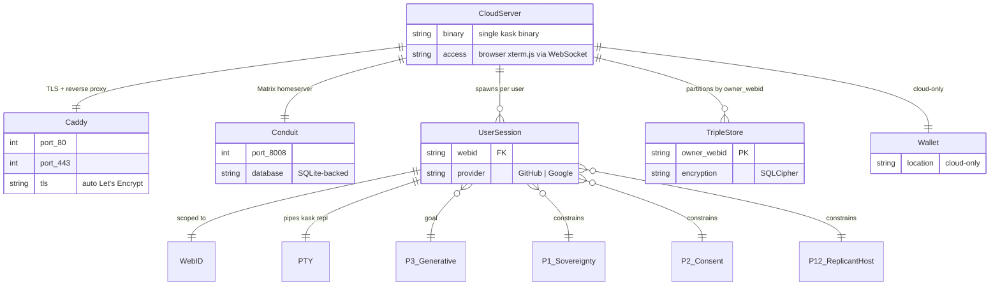

#### Production Contracts (12)

| FR# | Contract ID | Function | Principle Annotations |
|-----|------------|----------|---------------------|
| FR-DP1 | `P5-deploy-single-binary` | Single `kask` binary contains daemon + API + MCP servers + agents | [P5] Goal: Essentialism — single binary eliminates multi-component deployment complexity; [P4] Constraining: Clear Boundaries — features enabled by runtime mode, not compile flags |
| FR-DP2 | `P4-deploy-init-server` | `kask init --profile server` provisions server config, master passphrase, OAuth providers | [P4] Goal: Clear Boundaries — server profile establishes OCAP perimeter; [P1] Constraining: User Sovereignty — admin is the first human user |
| FR-DP3 | `P5-deploy-sidecar-generate` | `kask matrix deploy-sidecar --domain <domain>` generates `docker-compose.yml` + Caddy/Conduit config | [P5] Goal: Essentialism — generated config, not checked-in IaC; [P4] Constraining: Clear Boundaries — Caddy TLS + reverse proxy perimeter |
| FR-DP4 | `P4-deploy-sidecar-compose` | Generated `docker-compose.yml`: Caddy (ports 80/443) + Conduit (port 8008) | [P4] Goal: Clear Boundaries — containerized sidecar perimeter; [P5] Constraining: Essentialism — Docker Compose, not Kubernetes |
| FR-DP5 | `P5-deploy-caddy-config` | Generated `Caddyfile`: auto Let's Encrypt TLS, reverse proxy to `kask daemon` | [P5] Goal: Essentialism — zero-config TLS; [P4] Constraining: Clear Boundaries — HTTPS-only external surface |
| FR-DP6 | `P5-deploy-conduit-config` | Generated `conduit.toml`: SQLite-backed Matrix homeserver, localhost-only | [P5] Goal: Essentialism — Rust-native Matrix, no Synapse dependency; [P4] Constraining: Clear Boundaries — internal-only Matrix transport |
| FR-DP7 | `P4-deploy-systemd-unit` | systemd service unit: `Type=simple`, `Restart=on-failure`, `User=hkask` | [P4] Goal: Clear Boundaries — process lifecycle gated by systemd; [P5] Constraining: Essentialism — single service, no orchestration |
| FR-DP8 | `P5-deploy-dockerfile` | Multi-stage Docker build: `rust:1.91-slim` builder → `debian:bookworm-slim` runtime | [P5] Goal: Essentialism — single Dockerfile for reproducible builds; [P4] Constraining: Clear Boundaries — non-root user, minimal attack surface |
| FR-DP9 | `P1-deploy-oauth-providers` | OAuth config (GitHub + Google client ID/secret) stored in OS keychain | [P1] Goal: User Sovereignty — OAuth credentials user-owned, not in config files; [P4] Constraining: Clear Boundaries — secrets gated by OS keychain |
| FR-DP10 | `P1-deploy-oauth-callback` | OAuth callback provisions `HumanUser` record, default replicant, wallet on first sign-in | [P1] Goal: User Sovereignty — auto-provisioning from verified identity; [P2] Constraining: Affirmative Consent — user explicitly clicks "Sign in with GitHub" |
| FR-DP11 | `P4-deploy-health-endpoint` | `GET /api/cns/health` returns `{ overall_deficit, critical_count, warning_count, healthy }` | [P4] Goal: Clear Boundaries — health check is the deployment liveness probe; [P9] Constraining: Homeostatic Self-Regulation — CNS drives health signal |
| FR-DP12 | `P5-deploy-no-client` | Zero client-side install: browser terminal via xterm.js + WebSocket | [P5] Goal: Essentialism — no client binary, no SSH setup required; [P3] Constraining: Generative Space — user gets full `kask repl` via browser |

#### Test Contracts (4)

| FR# | Contract ID | Test Name |
|-----|------------|-----------|
| FR-DP-T1 | `P4-deploy-test-init-server` | `init_server_creates_config_and_keychain_entries` |
| FR-DP-T2 | `P5-deploy-test-sidecar-generate` | `deploy_sidecar_generates_valid_docker_compose` |
| FR-DP-T3 | `P1-deploy-test-oauth-callback` | `oauth_callback_provisions_human_user_and_session` |
| FR-DP-T4 | `P4-deploy-test-health-endpoint` | `health_endpoint_returns_cns_status` |

---

## 4. Entity Relationship Diagrams

### 4.1 Core Domain Entity Model

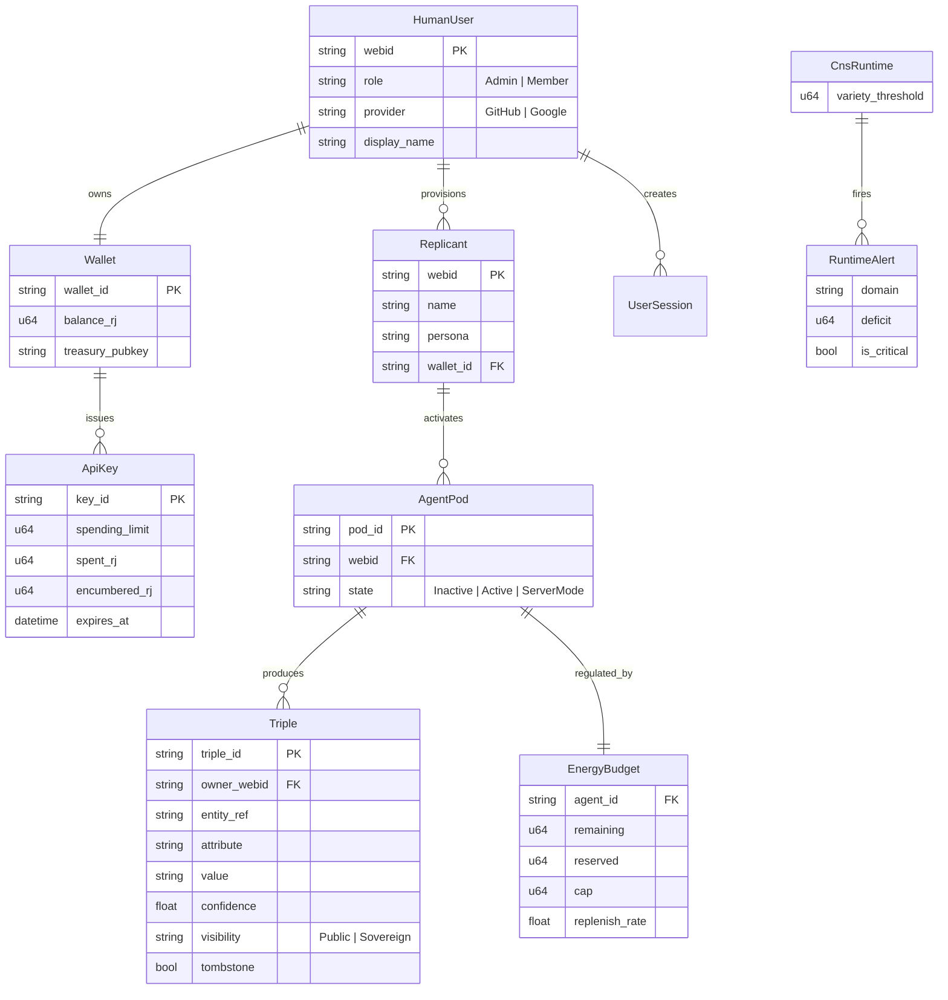

### 4.2 Deployment Domain Entity Model

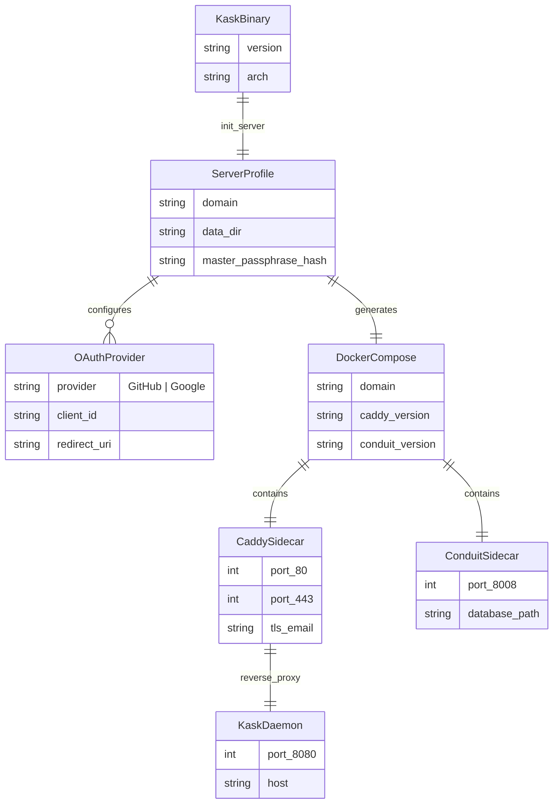

### 4.3 Contract-Anchoring ERD

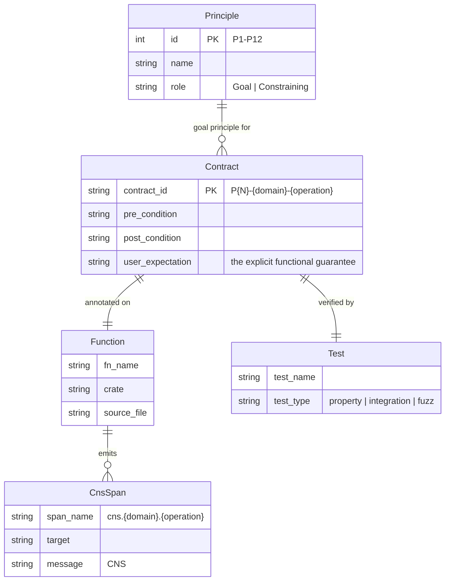

---

## 5. Goal-Principle Contract Anchoring

### 5.0 Magna Carta → Principle → Contract Hierarchy

The complete traceability chain from user expectation to behavioral enforcement:

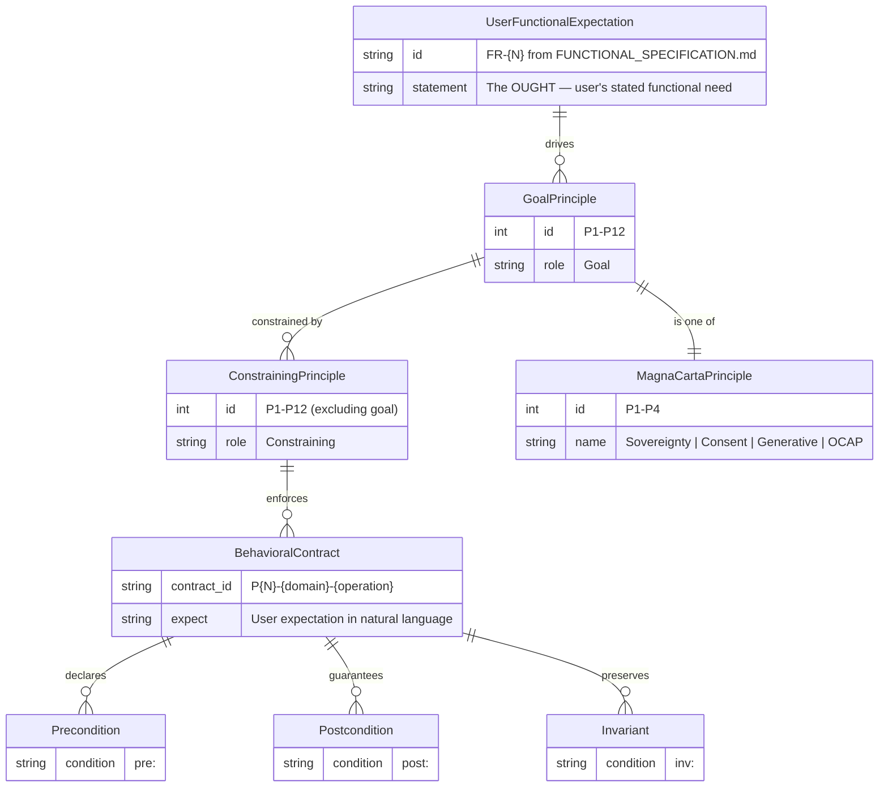

**Semantic invariant:** Every `// REQ:` contract traces upward through its constraining principles to a single goal (motivating) principle, which itself traces to a Magna Carta principle. The user's functional expectation — stated as an OUGHT in the spec — drives the goal principle selection. This is the explicit link: the user expectation is not merely "kept in mind" but structurally embedded as the driver of principle assignment.

**Contract-completeness invariant** (`TESTING_DISCIPLINE.md` §1.4 — every `pub fn` carries `// REQ: pre:`): extends to a new completeness predicate: every `// REQ:` carries a referenced user expectation.

### 5.1 The Contract Architecture

Every code contract has exactly **one goal principle** and **1 to 11 constraining principles**:

```
Goal Principle (drives the functional expectation)
    │
    ├── Constraining Principle 1
    ├── Constraining Principle 2
    ├── ...
    └── Constraining Principle N
```

The **goal principle** is the principle whose user-visible guarantee the contract directly implements. It answers: "What does the user get from this function?" The **constraining principles** answer: "What constraints shape how this is delivered?"

### 5.2 Explicit User Functional Expectation

Every contract must carry an explicit user functional expectation in its annotation:

```rust
/// REQ: P9-cns-energy-budget-can-proceed
/// pre:  gas is a valid EnergyCost
/// post: returns true iff budget has >= gas remaining and circuit breaker allows
///       user_expectation: "I can check whether an agent has enough gas before executing"
/// inv:  does not consume gas (read-only check)
/// [P9] Goal: Homeostatic Self-Regulation — prevents runaway agent execution
/// [P4] Constraining: Clear Boundaries — cap enforces resource boundary
pub fn can_proceed(&self, gas: EnergyCost) -> bool
```

The `user_expectation` field is the contract's functional specification in the user's voice. It is what the test verifies and what the code must implement. This is the bridge between the functional specification (this document) and the Testing Discipline.

### 5.3 Principle Role Matrix

| # | Principle | Common Goal Domain | Common Constraining Role |
|---|-----------|-------------------|------------------------|
| P1 | User Sovereignty | Agent pods, web sessions, backup, multi-user | Wallet ops, keystore, memory, API surface |
| P2 | Affirmative Consent | Multi-user invites, consent management | Wallet API keys, web sessions, backup export |
| P3 | Generative Space | Storage CRUD, memory, templates, CLI | CNS sync variants, backup merge |
| P4 | Clear Boundaries | CNS membranes, ACP, OAuth perimeters, deployment | Energy budgets, circuit breakers, API metering |
| P5 | Essentialism | MCP servers, deployment packaging, service layer | Runtime construction, salience, chunking |
| P6 | Space for Replicants | Replicant identity, agent personality | (rarely constraining) |
| P7 | Evolutionary Architecture | Threshold calibration, replenish rate tuning | Budget config, backend timeouts |
| P8 | Semantic Grounding | Type-level newtypes, CNS span registry, spec types | Energy cost types, ranking signals, salience |
| P9 | Homeostatic Self-Regulation | Energy budgets, algedonic alerts, variety monitors, circuit breakers | Memory loops, salience budgets, semantic pruning |
| P10 | Bot/Replicant Taxonomy | Bot health classification | (rarely constraining) |
| P11 | Digital Public/Private Sphere | Visibility governance | (not yet assigned to CNS contracts) |
| P12 | Subscriber Consent | CNS subscriptions, observer registration | Session CNS spans, wallet key alerts |

### 5.4 Traceability: Functional Spec → Contract → Test

```
FUNCTIONAL_SPECIFICATION.md (this document)
    │  FR-E12: User shall be able to check remaining gas before execution
    │
    ▼
Contract (// REQ: in source code)
    │  P9-cns-energy-budget-can-proceed
    │  user_expectation: "I can check whether an agent has enough gas"
    │
    ▼
Property-Based Test (proptest)
    │  P9-cns-energy-budget-proptest-001
    │  Generates random EnergyBudget states, verifies can_proceed invariants
    │
    ▼
Implementation (pub fn)
    │  EnergyBudget::can_proceed(&self, gas: EnergyCost) -> bool
    │
    ▼
CNS Span
       cns.energy.budget_check — emitted on every can_proceed call
```

This traceability chain is the verification that the user's functional expectation is actually enforced by the code. The functional spec says what the user wants. The contract says what the code guarantees. The test verifies it. The CNS span proves it happened.

---

## 6. Realignment Status

### 6.1 Contract ID Migration Summary

| Domain | Source File | Old Format | New Format | Contracts |
|--------|-----------|-----------|-----------|-----------|
| Energy | `energy.rs` | `cns-*` | `P{N}-cns-energy-*` | 23 |
| Algedonic | `algedonic.rs` | `svc-cns-*` | `P{N}-cns-algedonic-*` | 9 |
| Runtime | `runtime.rs` | `cns-runtime-*` | `P{N}-cns-runtime-*` | 30 |
| Governed Tool | `governed_tool.rs` | (various) | `P{N}-cns-gov-tool-*` | 7 |
| Governed Inference | `governed_inference.rs` | (various) | `P{N}-cns-gov-inf-*` | 4 |
| Circuit Breaker | `circuit_breaker.rs` | (various) | `P{N}-cns-circuit-*` | 3 |
| API Metering | `api_metering.rs` | (various) | `P{N}-cns-api-meter-*` | 16 |
| Energy Estimation | `composite_energy_estimator.rs` | (already aligned) | `P9-cns-est-composite-new` | 1 |
| Wallet Estimation | `wallet_energy_estimator.rs` | `cns-calibrate-*` | `P9-cns-est-wallet-*` | 6 |
| Wallet — Manager | `manager.rs` | `WALLET-*`, `wallet-int-*` | `P9-wallet-mgr-*` | 34 |
| Wallet — Issuer | `issuer.rs` | `WALLET-006`, `P4-issuer` | `P9-wallet-issuer-*` | 10 |
| Wallet — Signing | `signing.rs` | `WALLET-007`, `HINKAL-006`, `P4-signing` | `P9-wallet-sign-*` | 10 |
| Wallet — Hinkal Adapter | `hinkal.rs` | `HINKAL-*` | `P9-wallet-hinkal-*` | 20 |
| Wallet — Price Feed | `price_feed.rs` | `wallet-price-*` | `P9-wallet-price-*` | 16 |
| Wallet — Hedera Tests | `hedera.rs` | `hedera-int-*` | `P9-wallet-hedera-*` | 6 |
| Wallet — Solana Tests | `solana.rs` | `solana-int-*` | `P9-wallet-solana-*` | 5 |
| Agents — Consent | `consent.rs` | `AGT-038`–`AGT-048` | `P2-agt-consent-*` | 11 |
| Agents — Sovereignty | `sovereignty.rs` | `AGT-119`–`AGT-121` | `P1-agt-sovereignty-*` | 3 |
| Agents — Loop System | `loop_system.rs` | `AGT-062`–`AGT-072` | `P9-agt-loop-*` | 11 |
| Agents — Prompt Analysis | `prompt_analysis.rs` | `AGT-087` | `P9-agt-prompt-*` | 1 |
| Agents — Registry | `registry_loader.rs`, `adapters/registry_source.rs` | `AGT-108`, `AGT-115`–`AGT-118` | `P3-agt-registry-*` | 5 |
| Agents — ACP | `acp/**/*.rs` | `AGT-073`–`AGT-086` | `P4-agt-acp-*` | 14 |
| Agents — MCP Adapters | `adapters/mcp_runtime.rs` | `AGT-113`–`AGT-114` | `P4-agt-mcp-*` | 2 |
| Agents — Memory | `adapters/memory_loop_adapter.rs`, `ports/memory_storage.rs` | `AGT-032`–`AGT-037`, `AGT-109`–`AGT-112` | `P3-agt-memory-*` | 10 |
| Agents — Curator | `curator/**/*.rs` | `AGT-049`–`AGT-061` | `P9-agt-curator-*` | 13 |
| Agents — Curator Agent | `curator_agent/**/*.rs` | `AGT-088`–`AGT-107`, `BOT-HEALTH-001` | `P9-agt-curator-agent-*`, `P9-agt-bot-health-*` | 20 |
| Agents — Pod Lifecycle | `pod/mod.rs`, `pod/types.rs` | `AGT-122`–`AGT-137`, `AGT-161` | `P1-agt-pod-*`, `P4-agt-pod-lifecycle-*` | 17 |
| Agents — Pod Manager | `pod/manager.rs` | `AGT-138`–`AGT-160` | `P1-agt-pod-manager-*` | 23 |
| Storage — Lock Helpers | `lock_helpers.rs` | `STO-001`–`STO-003` | `P4-sto-lock-*` | 3 |
| Storage — Path Safety | `security.rs` | `STO-004` | `P4-sto-path-safe-join` | 1 |
| Storage — Consent | `consent_store.rs` | `STO-005`–`STO-008` | `P2-sto-consent-*` | 4 |
| Storage — Sovereignty | `sovereignty.rs` | `STO-009`–`STO-012` | `P1-sto-sovereignty-*` | 4 |
| Storage — NuEvent | `nu_event_store.rs` | `STO-013`–`STO-017` | `P3-sto-nu-event-*` | 5 |
| Storage — Spec Store | `spec_store.rs` | `STO-018`–`STO-023` | `P3-sto-spec-*` | 6 |
| Storage — Spec Types | `spec_types.rs` | `STO-163`–`STO-168`, `MDS-spec-svc-001` | `P8-sto-spec-*` | 6 |
| Storage — Database | `database.rs` | `STO-024`–`STO-030` | `P4-sto-database-*` | 7 |
| Storage — Kata History | `kata_history.rs` | `STO-031`–`STO-037` | `P3-sto-kata-*` | 7 |
| Storage — Embeddings | `embeddings.rs` | `STO-038`–`STO-045` | `P3-sto-embedding-*` | 8 |
| Storage — Escalation | `escalation.rs` | `STO-046`–`STO-055` | `P3-sto-escalation-*` | 10 |
| Storage — User Store | `user_store.rs` | `STO-056`–`STO-068` | `P1-sto-user-*` | 13 |
| Storage — Gallery | `gallery.rs` | `STO-069`–`STO-082`, `media-*` | `P3-sto-gallery-*` | 14 |
| Storage — Agent Registry | `agent_registry.rs` | `STO-083`–`STO-097` | `P3-sto-agent-registry-*` | 15 |
| Storage — Goals | `goals.rs` | `STO-098`–`STO-115` | `P3-sto-goal-*` | 18 |
| Storage — Triples | `triples.rs` | `STO-116`–`STO-137` | `P3-sto-triple-*` | 22 |
| Storage — Wallet Store | `wallet_store.rs` | `STO-138`–`STO-162`, `SHOULD-8`, `MUST-10`, `wallet-*` | `P3-sto-wallet-*`, `P1-sto-wallet-*` | 25 |
| Storage — Contract Tests | `tests/contract/services_storage_contract.rs` | `CTR-002` | `P4-sto-services-contract-test` | 0 (tests only) |
| Memory | `src/**/*.rs` | `MEM-*`, `memory-salience-*`, `semantic-*` | `P3-mem-*` | 68 |
| Inference | `src/*.rs`, `tests/*.rs` | `INFER-*`, `inf-cfg-*`, `chat-proto-*`, `INT-*`, `LIVE-*` | `P9-inf-*`, `P4-inf-*` | 58 |
| Templates | `src/*.rs`, `tests/*.rs` | `TPL-*`, `cap-validator-*`, `templates-contract-*`, `templates-lexicon-*`, `FUZ-*`, `YML-*` | `P3-tpl-*` | 53 |
| Web Interface | (new) | (new) | `P1-web-*`, `P4-web-*` | 19 |
| Multi-User | (new) | (new) | `P1-multi-*`, `P2-multi-*` | 12 |
| Backup & Migration | (new) | (new) | `P1-backup-*`, `P3-backup-*` | 18 |
| Deployment | (new) | (new) | `P5-deploy-*`, `P4-deploy-*`, `P1-deploy-*` | 16 |

**Total CNS contracts:** 99 (across all 9 source files).
**Total wallet contracts:** 23 production occurrences (11 unique IDs).
**Total agents contracts:** 174 production occurrences (30 unique IDs).
**Total storage contracts:** 247 production occurrences (168 unique IDs).
**Total memory contracts:** 67 production occurrences (52 unique production IDs + 16 test IDs).
**Total inference contracts:** 88 occurrences (58 unique production IDs + 30 unique test IDs).
**Total templates contracts:** 80 occurrences (53 unique production IDs + 25 unique test IDs).
**Total web contracts:** 15 (12 production + 3 test, new — not yet implemented).
**Total multi-user contracts:** 12 (10 production + 2 test, new — not yet implemented).
**Total backup contracts:** 18 (11 production + 4 CNS span + 3 test, new — not yet implemented).
**Total deployment contracts:** 16 (12 production + 4 test, new — not yet implemented).
**Build status:** `cargo check --workspace` passes clean.

### 6.2 Idempotent Migration

The contract ID migration is **idempotent** — the same source file can be reread at any time and the same contract IDs will be extracted. There is no stateful migration step. The contract IDs exist in the source code, not in a database.

### 6.3 Cross-Crate Dependencies

All hKask crates depend on `hkask-types` for the canonical `CnsSpan` registry, `WebID` identity type, and port definitions. The CNS contracts are **leaf nodes** — they do not depend on any other crates. Realignment does not change any downstream crate's behavior.

---

## 7. Contract ID Format Appendix

### 7.1 Formal Specification

Every contract ID follows the pattern:

```
P{N} - {domain-short} - {operation}
```

Where:
- **P{N}** — The goal principle (1–12). This determines which principle **owns** the contract and appears in the ID prefix.
- **{domain-short}** — Abbreviated domain name (e.g., `energy`, `algedonic`, `runtime`, `gov-tool`, `gov-inf`, `circuit`, `api`, `est`, `deploy`).
- **{operation}** — Verb phrase describing what the contract does (e.g., `new`, `can-proceed`, `settle`, `calibrate`).

Constraining principles appear in the contract body as `[P{N}] Constraining: ...` annotations. A contract may have:
- **One goal principle** (the ID prefix)
- **Multiple constraining principles** (body annotations). The goal principle encodes the explicit user functional expectation.

### 7.2 Principle Legend

| # | Principle | Goal Role | Constraining Role |
|---|----------|-----------|-------------------|
| P1 | User Sovereignty | User owns their data, decisions, and identity | Wallet ops, keystore, web sessions |
| P2 | Affirmative Consent | Every action requires explicit user consent | Backup export, API key scope |
| P3 | Generative Space | The system can create, modify, and destroy state | CNS sync access, backup merge |
| P4 | Clear Boundaries | Modules own their domains; boundaries are enforced | Energy caps, circuit thresholds |
| P5 | Essentialism | Remove everything not earning existence | Runtime construction, chunking |
| P6 | Space for Replicants | Agents have identity and personality space | (rarely constraining in CNS) |
| P7 | Evolutionary Architecture | Parameters emerge from real usage | Budget config, backend timeouts |
| P8 | Semantic Grounding | Types carry meaning; newtypes prevent confusion | Energy cost types, ranking signals |
| P9 | Homeostatic Self-Regulation | Feedback loops maintain system stability | Memory loops, salience budgets |
| P10 | Bot/Replicant Taxonomy | Bot and replicant roles are distinct | (rarely constraining in CNS) |
| P11 | Digital Public/Private Sphere | Visibility governance | (not yet assigned to CNS contracts) |
| P12 | Subscriber Consent | Observers register through explicit subscription | Session spans, key alerts |

### 7.3 Validation Rules

1. **Unique contract IDs** — No two contracts share the same ID.
2. **Idempotent** — Reading the same source file twice produces the same IDs.
3. **Stable** — Contract IDs persist across code changes unless the contract's purpose changes.
4. **Derivable** — IDs can be derived from `grep "REQ:" crates/hkask-cns/src/*.rs`.

### 7.4 Notational Conventions

- **Production contracts** are labeled `P{N}-{domain}-{operation}` in the contract body (e.g., `P9-cns-energy-budget-new`, `P9-wallet-mgr-build`).
- **Test contracts** are labeled `P{N}-{domain}-{operation}-test` or have a `-T{N}` suffix.
- **Blocking variants** use the P3 prefix: `P3-cns-{domain}-blocking-{operation}`.
- **Calibrate contracts** use the P7 prefix: `P7-cns-{domain}-calibrate-{operation}`.
- **Subscriber contracts** use the P12 prefix: `P12-cns-{domain}-subscribe-{operation}`.

### 7.5 Domain Realignment Status

Realigned domains (complete, code and contracts verified):

| Domain | Crate | Contract Prefix | Status |
|--------|-------|-----------------|--------|
| CNS (all 9 sub-domains) | `hkask-cns` | `P{N}-cns-*` | ✅ Complete |
| Wallet | `hkask-wallet` | `P9-wallet-*` | ✅ Complete |
| Agents | `hkask-agents` | `P1/P2/P3/P4/P9-agt-*` | ✅ Complete |
| Storage | `hkask-storage` | `P1/P2/P3/P4/P8-sto-*` | ✅ Complete |
| Memory | `hkask-memory` | `P3-mem-*` | ✅ Complete |
| Inference | `hkask-inference` | `P9-inf-*`, `P4-inf-*` | ✅ Complete (cloud-only) |
| Templates | `hkask-templates` | `P3-tpl-*` | ✅ Complete |
| Web Interface | `hkask-api` | `P1-web-*`, `P4-web-*` | 📋 Planned (spec written) |
| Multi-User | `hkask-api` + `hkask-storage` | `P1-multi-*`, `P2-multi-*` | 📋 Planned (spec written) |
| Backup & Migration | `hkask-storage` + `hkask-api` | `P1-backup-*`, `P3-backup-*` | 📋 Planned (spec written) |
| Deployment | `hkask-api` + `hkask-services` | `P5-deploy-*`, `P4-deploy-*` | 📋 Planned (spec written) |

Contracts not yet realigned:
- `hkask-services` — contains legacy `SVC-*`, `svc-*`, `MUST-*`, `MDS-*`, `BACKUP-*`, `lifecycle-*`, `services-settings-*`, bare `P9`/`P3` IDs. This is the largest remaining realignment target.

---

---

## Future Work

The following items are identified but deferred. They are documented here to preserve design intent and prevent rediscovery.

### 1. Full `expect:` Field Migration

Establishing the `expect:` field on all 1,419 contracts. The pattern is demonstrated in `TESTING_DISCIPLINE.md` §1.2 (extended syntax) and `FUNCTIONAL_SPECIFICATION.md` §5.2. Full migration is a mechanical transformation suitable for a future script or bulk edit — the semantic work (selecting the right user expectation sentence for each contract) requires domain understanding. Defer until the pattern is validated on the CNS domain contracts.

### 2. Contract → UserExpectation Verification Automation

The `contract-audit.sh` script currently verifies contract coverage (Link 1: Implementation → Contract). Links 2 (Contract → UserExpectation) and 3 (UserExpectation → GoalPrinciple) are manual verification. Automating these requires NLP-level semantic matching between the `expect:` natural language field and the contract's `pre:`/`post:` formal specification — a capability that may be appropriate for the Curator but is not yet specified.

### 3. ER Diagram → Code Synchronization

ER diagrams in `FUNCTIONAL_SPECIFICATION.md` §2–§4 are documentation artifacts; they can drift from the actual type definitions in `hkask-types`. A future `spec/graph/query` tool extension could verify diagram-to-code alignment automatically, similar to how `contract-audit.sh` verifies contract-to-code coverage. This requires the MDS spec server to parse Rust type definitions.

### 4. Deployment Domain Implementation

Domain 26 (Deployment) is documented as a specification (`FUNCTIONAL_SPECIFICATION.md` §3.18) but not implemented. The deployment plan (`docs/plans/deployment-and-backup.md`) is in Draft/Aligned status. Implementation is a separate project phase.

### 5. Principle Conflict Resolution Formalization

When constraining principles conflict (e.g., P1 sovereignty vs P4 OCAP boundary), the resolution rules are implicit in the existing codebase (higher-ranked principle dominates per Optimality Theory ranking). Formalizing this as a decision procedure in `PRINCIPLES.md` is future work — the current "Goal Principle Anchoring" rule (`PRINCIPLES.md` §1.6) covers the uncontested case.

### 6. Domain ER Diagrams — Non-CNS Domains

ER diagrams have been added for all 8 CNS domains (§2) and the deployment domain (§3.18). The remaining 18 non-CNS domains (§3) have entity models described in contract tables but not yet diagrammed. Adding compact ER diagrams for these domains is a deferred documentation task.

---

## Appendix A: Document Metadata

| Field | Value |
|-------|-------|
| Version | v0.28.0 |
| Created | 2026-06-16 |
| Status | Active — anchor for the rSolidity contract vocabulary and the Testing Discipline |
| Last Updated | 2026-06-18 |
| Contract Count | 99 CNS + wallet/agents/storage/memory/inference(cloud-only)/templates (complete) + 61 new (web 19 + multi-user 12 + backup 18 + deployment 16, spec written) |
| Build Status | `cargo check` workspace — PASS |
| rSolidity Status | **Formally adopted as the contracting language** (2026-06-18). See [`CONTRACT_GUIDE.md`](../../../guides/CONTRACT_GUIDE.md) §3.3 for migration status. |
| Governance | PRINCIPLES.md §0–§1.4 |
| Deployment Reference | §3.18 deployment domain, `docs/plans/deployment-and-backup.md`, `docs/guides/DEPLOYMENT.md` |
| ERDs | §2 — 8 CNS domain ER diagrams; §3.18 — deployment domain ER diagram; §4 — Core domain model, deployment model, contract-anchoring model; §5.0 — Magna Carta hierarchy ER diagram |
| Goal-Principle Anchoring | §5 — Every contract has a goal principle (user expectation) + constraining principles; §5.0 — Magna Carta → Principle → Contract hierarchy ER diagram |

## Appendix B: Validation Checklist

- [x] All 99 CNS contracts carry principle annotations
- [x] Build passes clean: `cargo check --workspace`
- [x] All test IDs updated to new format
- [x] Domain map complete (26 domains — 22 existing + 4 new: web, multi-user, backup, deployment)
- [x] FR tables complete (all 8 CNS domains + 10 non-CNS domains)
- [x] Realignment status table complete
- [x] Contract ID format specification complete with goal-principle anchoring
- [x] Non-CNS domain contracts (wallet, storage, memory, inference, templates) — realigned and verified
- [x] Magna Carta → Principle → Contract hierarchy ER diagram added (§5.0)
- [x] User Expectation column added to domain map (§1)
- [x] Service Layer Architecture section added (§1.5) — AgentService structure, dependency direction, loop membrane, strangler fig log
- [x] Domain ER diagrams added for 8 CNS domains (§2) + deployment (§3.18)
- [x] `expect:` syntax documented in TESTING_DISCIPLINE.md §1.2
- [x] Bidirectional verification path documented in TESTING_DISCIPLINE.md §6.1
- [x] Goal Principle Anchoring rule added to PRINCIPLES.md §1.6
- [x] All document metadata updated (version, status, cross-references) across 8 documents
- [x] Contract audit run (2362 REQ tags, 132.9% coverage) — gaps documented in PROJECT_STATUS.md
- [x] Future Work section added (§Future Work)
- [x] Deployment domain specification (§3.18) — 12 production contracts, 4 test contracts
- [x] Web Interface specification — OAuth, xterm.js terminal, WebSocket PTY (planned — see `docs/plans/deployment-and-backup.md`)
- [x] Multi-User specification — Admin/Member roles, invite flow, admin-only endpoints (planned)
- [x] Backup & Migration specification — SQLCipher archive, export/upload, replicant operations (planned)

## Appendix C: Key References

- [PRINCIPLES.md](PRINCIPLES.md) — 12 governing principles
- [MDS.md](MDS.md) — Minimum Definition Specification
- [TESTING_DISCIPLINE.md](TESTING_DISCIPLINE.md) — Contract testing discipline
- [CONTRACT_GUIDE.md](../../../guides/CONTRACT_GUIDE.md) — Definitive contract standard
- [hKask Architecture Master](../hKask-architecture-master.md) — Full architecture reference

---
