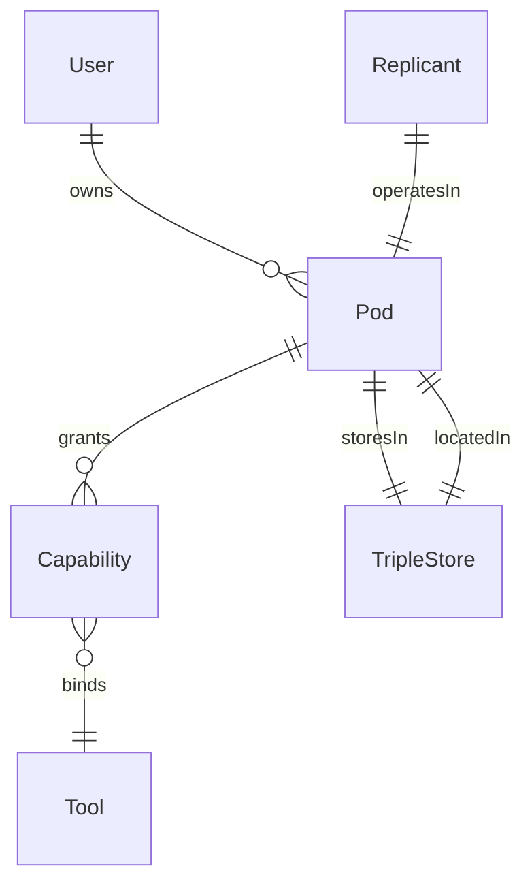

# AgentPod↔Solid Pod Isomorphism — Architecture Drift Analysis

**Purpose:** Model the Solid Pod ontologically, map each invariant onto hKask infrastructure, diagnose where the centralized multi-tenant implementation diverged from the per-user pod vision, and define the migration target.

---

## α.1 — Solid Pod Ontological Model (RDF/Turtle)

A Solid Pod is defined by five invariants. These are the ontological boundaries — remove any one and it ceases to be a Solid Pod:

| # | Invariant | Solid Spec Reference | Description |
|---|-----------|---------------------|-------------|
| 1 | **Per-user WebID-grounded identity** | `solid:owner` | Every pod has exactly one owner identified by a WebID. The WebID is the root of all authority. |
| 2 | **Self-contained storage (LDP)** | `ldp:BasicContainer` | The pod contains its own data. You point at your pod URL, not at a shared database server. |
| 3 | **Capability-based access control (WAC/ACP)** | `acl:Authorization` | Access is governed by explicit capabilities, not ambient authority. No admin bypass. |
| 4 | **Interoperable data as linked-data triples** | `solid:resourceContainment` | Data is stored as RDF triples with entity/attribute/value semantics and provenance metadata. |
| 5 | **Pod IS the deployment unit** | `solid:storage` | You don't ask a shared server for "your data." You point at your pod. The pod is self-contained, portable, and independently deployable. |

### RDF Model (Turtle)

```turtle
@prefix solid: <https://www.w3.org/ns/solid/terms#> .
@prefix foaf:  <http://xmlns.com/foaf/0.1/> .
@prefix acl:   <http://www.w3.org/ns/auth/acl#> .
@prefix ldp:   <http://www.w3.org/ns/ldp#> .

solid:Pod a ldp:Container ;
  solid:owner              _:webid ;
  solid:storage            solid:DataStore ;
  solid:accessControl      acl:Authorization ;
  solid:resourceContainment ldp:BasicContainer .

_:webid a foaf:Agent ;
  foaf:holdsAccount _:pod .
```

---

## α.2 — Entity-Relationship Isomorphism Map

The mapping of Solid invariants onto hKask infrastructure. This reveals where the current architecture satisfies the invariant (✓), partially satisfies (⚠), or violates (✗) the per-pod deployment model.

```mermaid
erDiagram
    SolidPod ||--|| WebID : "owner (invariant 1)"
    SolidPod ||--|| DataStore : "self-contained (invariant 2)"
    SolidPod ||--|| AccessControl : "governed by (invariant 3)"
    SolidPod ||--|| Triples : "stores as (invariant 4)"
    SolidPod ||--|| DeploymentUnit : "IS the (invariant 5)"

    AgentPod ||--|| WebID : "owner ✓ [P1]"
    AgentPod ||--|| SQLCipherStore : "self-contained ✓ [P11]"
    AgentPod ||--|| OCAPToken : "governed by ✓ [P4]"
    AgentPod ||--|| TripleStore : "stores as ✓"
    AgentPod ||--|| PodDeployment : "IS the ✗ (currently shared PodManager)"

    AgentPod ||--|| TemplateRegistry : "renders from [Pattern A]"
    AgentPod ||--|| CNSRuntime : "regulated by ✓ [Pattern B]"
    AgentPod ||--|| NuEventSink : "provenance anchor ✓ [P8]"
    AgentPod ||--|| InferencePort : "generative space ✓ [P3]"
    AgentPod ||--o{ MCPServer : "tools attached ✓ [Pattern A dispatch]"
    AgentPod ||--|| EnsembleSession : "communicates via [Pattern C]"

    SolidPod { string pod_uri "https://user.example/pod/" }
    AgentPod { PodID id "UUIDv4" WebID webid PodLifecycleState state }

    CurrentState ||--o{ AgentPod : "centralized HashMap cache (DELETED)"
    CurrentState ||--|| SharedTripleStore : "scoped by owner_webid (DELETED)"
    IntendedState ||--o{ AgentPod : "each pod IS the deployment unit ✓ (CURRENT)"
    IntendedState ||--|| PerPodSQLCipher : "one database file per pod ✓ (CURRENT)"
    IntendedState ||--o{ PerPodMCPServers : "no service collision surface ✓ (CURRENT)"
```



### Drift Diagnosis: Current vs. Intended

| Solid Invariant | hKask Implementation | Status | Drift |
|-----------------|---------------------|--------|-------|
| 1. WebID-grounded identity | `AgentPod.webid` + `derive_ocap_secret(webid)` | ✓ | Correct. WebID is root of authority. |
| 2. Self-contained storage | `PerPodStorage` with per-pod SQLCipher file at `{data_dir}/agents/{sanitized_name}/pod.db`. `MemoryLoopAdapter::from_connection()` wraps pod-owned `TripleStore` + `EmbeddingStore`. | ✓ | **Resolved.** Each pod owns its database file. Passphrase derived deterministically from WebID via HKDF-SHA256 (ADR-027). |
| 3. Capability-based access | `DelegationToken` + `CapabilityChecker` + OCAP dual gate | ✓ | Correct. OCAP tokens gate every operation. |
| 4. Interoperable triples | `Triple` struct with entity/attribute/value/confidence/visibility | ✓ | Correct. Triple-based storage with provenance. |
| 5. Pod IS deployment unit | `PodDeployment` with `PodFactory` (stateless constructor), `ActivePods` (runtime registry), `PodRegistry` (filesystem scan). Three-tier: `PodKind::Curator | Team | Replicant`. | ✓ | **Resolved.** PodManager deleted. Pods are filesystem entries, not cache entries. Three-tier architecture deployed. |

---

## α.3 — Epistemic Force Classification

Each statement from the original prompt classified using `pragmatic-semantics` axes:

| Statement | Ontology | Epistemic | Force | Justification |
|-----------|----------|-----------|-------|---------------|
| "The original idea was like Solid Pod for agents" | OUGHT | Declarative | **Guardrail** (architectural intent) | Documented in deployment model: "Backup as portable archive. Encrypted SQLCipher file." The vision was per-user portability from the start. |
| "We have drifted from this vision" | IS | Declarative | **Evidence** (observable in code) | `PodManager::pods: Arc<RwLock<HashMap<PodID, AgentPod>>>` — centralized cache. `PodContext::from_manager()` reads from shared state. |
| "Services and MCP tools drove the drift" | IS | Probabilistic | **Hypothesis** (causal inference) | Loop R (Reinforcing) below provides mechanism. Alternative hypothesis: the deployment model's "Multi-user TripleStore (scoped by owner_webid)" explicitly chose centralization. |
| "Each human-replicant pair should have its own pod" | OUGHT | Declarative | **Guardrail** (derives from P1+P6+P11) | P1 (User Sovereignty): user owns their data. P6 (Space for Replicants): each replicant inhabits its own pod. P11 (Digital Public/Private Sphere): per-pod SQLCipher boundary. |
| "No service collisions for multi-user" | OUGHT | Declarative | **Guardrail** (derives from P4) | P4 (Clear Boundaries): OCAP tokens scoped to pod. Shared MCP dispatch creates collision surface. |
| "Agents wrote it out of the docs" | IS | Declarative | **Evidence** (git history verifiable) | The architecture master document ("Multi-user TripleStore scoped by owner_webid") explicitly encodes the centralized model. The "backup as portable archive" text preserves the distributed vision in the backup layer only. |

### Architecture-Level Causal Chain

```
P6 (Space for Replicants) 
  → realized via PodManager 
    → PodManager chose centralization (in-memory HashMap, shared TripleStore) 
      → over pod-as-deployment-unit
        → This was NOT a principle violation
          → It was an implementation shortcut that became the architecture
```

**The drift is:** PodManager became a shared service manager instead of a pod lifecycle manager. The backup model ("Backup as portable archive. Encrypted SQLCipher file. Export from one server, upload to another") was **accidentally correct** at the backup layer but **wrong at the storage layer**. The migration aligns the storage model with the backup model.

---

## α.4 — Feedback Loops That Reinforced the Drift

### Loop R (Reinforcing) — Service-First Development

```
Service-first development 
  → more MCP servers added 
    → PodManager grows as shared orchestrator 
      → easier to add services centrally 
        → service-first development deepens (loop closes)
```

This is a **positive feedback loop** (deviation-amplifying). Each new MCP server added to the shared PodManager makes it harder to migrate to per-pod isolation because more services depend on the centralized dispatch.

### Loop B (Balancing, Weakened) — Pod-Per-User Vision

```
Pod-per-user vision (Solid Pod isomorphism)
  → implies per-user storage isolation (one SQLCipher file per pod)
    → implies per-user CNS scoping (one VarietyMonitor per pod)
      → implies per-user MCP binding (no shared tool dispatch)
        → implies no shared PodManager
          → conflicts with centralized development velocity
            → vision documented but not enforced (loop weakened)

CURRENT: Pod-per-user vision documented in backup model only.
TARGET:  Per-pod SQLCipher file IS the storage. PodManager → PodFactory.
```

This is a **negative feedback loop** (deviation-correcting) that should enforce architectural boundaries but is currently weakened because the enforcement mechanism (per-pod deployment) was never implemented at the storage layer.

### Migration Strategy (via strangler-fig)

The migration must **strengthen Loop B** (per-user pod boundaries) while **strangler-figging Loop R** (keep centralized services running during migration). The strangler-fig pattern enables coexistence: new pods use per-pod storage; existing pods continue with shared store until migrated.

---

## Drift Semantic Map

> **Incorporated from:** `docs/architecture/pod-drift-semantic-map.md`

**Root cause:** `:Service` became the mutable data store (shared state) instead of `:Pod` holding its own `:TripleStore` within the sovereignty perimeter.



**Drift:** `:Service :holds :TripleStore` (shared mutable state) — violates P12 (anonymous agency), P1 (blurred sovereignty perimeter). **Correct:** `:Pod :storesIn :TripleStore` with `:TripleStore :locatedIn :Pod`.

---


---
## Drift Resolution — Complete (v0.30.0)

**`PodManager` has been deleted.** Replaced by:
- **`PodDeployment`** — canonical pod type. Owns its `PerPodStorage`, `PerPodCnsRuntime`, and `PerPodToolBinding`.
- **`PodFactory`** — stateless constructor. Does not cache, pool, or share pods.
- **`ActivePods`** — runtime registry (lightweight `HashMap`, no shared storage).
- **`PodRegistry`** — filesystem-based discovery (scans `{data_dir}/agents/{name}/pod.db`).

**Three-tier pod architecture:** `PodKind::Curator` (singleton, `SemanticIndex` owner), `PodKind::Team` (shared bot workspace), `PodKind::Replicant` (per-user sovereign).

**Semantic sync:** Lazy one-way — `CuratorSync` polling loop opens source pods read-only, syncs Public triples into `SemanticIndex`. `PodContext::recall_semantic()` routes through Curator for merged-lens view.

Full details: [`MULTI_POD_ARCHITECTURE.md`](MULTI_POD_ARCHITECTURE.md)

---

## PodDeployment Types

> **Incorporated from:** `docs/architecture/core/POD_DEPLOYMENT_CONTRACT.md`

### Five Dedicated Resources Per Pod

| Resource | Mechanism |
|----------|-----------|
| SQLCipher database | `{data_dir}/agents/{sanitized_name}/pod.db`, per-pod key derived from master key |
| Keystore root | `derive_ocap_secret(webid)` — deterministic, portable |
| CNS runtime | `PerPodCnsRuntime` — per-pod variety counters, span namespace `cns.agent_pod.{pod_id}.*` |
| MCP server binding | `PerPodToolBinding` — pod-scoped OCAP-gated tool handles |
| Template registry | Crate-level; pods inherit |

### Core Types

```rust
pub struct PodDeployment {
    pod_id: PodId,
    storage: PerPodStorage,      // {data_dir}/agents/{sanitized_name}/pod.db
    cns: PerPodCnsRuntime,        // per-pod CNS
    tools: PerPodToolBinding,     // pod-scoped MCP handles
    state: PodState,
}

pub struct PodFactory {
    template_resolver: Arc<TemplateResolver>,
    key_material: Arc<KeyMaterial>,
    server_config: PodServerConfig,
}
// PodFactory::deploy() → PodDeployment
// Stateless constructor. No cache, no pool, no share.
```

### Service Collision Elimination

| Current (Shared) | Target (Per-Pod) |
|-----------------|------------------|
| One `mcp_runtime` on PodManager | `PerPodToolBinding` with pod-scoped handles |
| Shared `episodic_storage` | Pod-level SQLCipher file |
| Server-global `CnsRuntime` | `PerPodCnsRuntime` per pod |

### Deletion Test

| Artifact | Verdict |
|----------|---------|
| `PodManager::pods: HashMap` | **DELETE** — pass-through cache, replace with filesystem listing |
| `PodManager` (entire struct) | **STRANGLER-FIG** — migrate to PodFactory, then delete |
| `PodFactory` | **KEEP** — behavior (pod construction) would reappear in callers |
