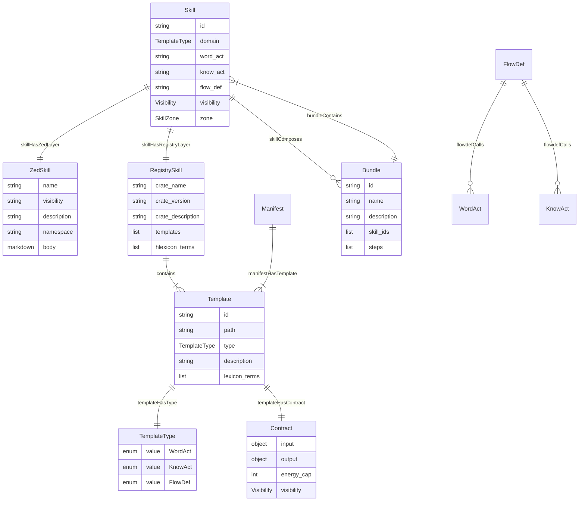
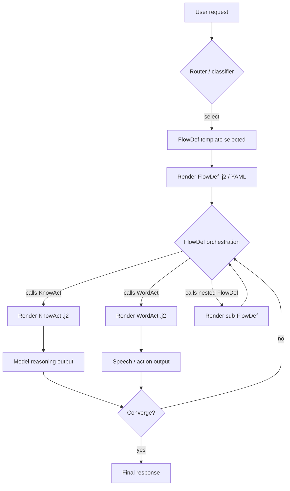

# hKask Dual-Layer Skill Model

**Version:** 0.27.0  
**Status:** Grounded specification — replaces prior ad-hoc bundle/template mismatches.

## 1. Semantic RDF Graph

### Entities

| Entity | Definition | Canonical Rust Type |
|--------|------------|---------------------|
| `Skill` | A complete, reusable agent capability. Exists in two layers. | `hkask_types::ports::Skill` |
| `ZedSkill` | The agent companion guide (`SKILL.md`). | Loaded by `hkask_templates::SkillLoader` |
| `RegistrySkill` | The runtime template set (`manifest.yaml` + `*.j2`). | `RegistryEntry` + directory on disk |
| `Template` | A renderable artifact with a typed contract. | `RegistryEntry` |
| `WordAct` | Atomic speech/action template ("what to say"). | `TemplateType::WordAct` |
| `KnowAct` | Reasoning/evaluation template ("how to think"). | `TemplateType::KnowAct` |
| `FlowDef` | Process template that orchestrates `WordAct`/`KnowAct`. | `TemplateType::FlowDef` |
| `Manifest` | Registry metadata describing templates and hLexicon terms. | `registry/templates/<name>/manifest.yaml` |
| `hLexiconTerm` | Canonical vocabulary term from `hlexicon-workspace.yaml`. | `hkask_types::lexicon::LexiconTerm` |
| `Contract` | Typed `input`/`output` declaration on a `.j2`. | Frontmatter block |
| `CnsSpan` | Observability span reference (canonical set in `cns.rs`). | `hkask_types::cns::CnsSpan` |
| `Bundle` | Curated composition of calibrated primary skills. Not a template type. | `hkask_types::bundle::BundleManifest` in `registry/manifests/` |

### Relations

| Relation | Domain → Range | Meaning |
|----------|----------------|---------|
| `skillHasZedLayer` | `Skill` → `ZedSkill` | `.agents/skills/<name>/SKILL.md` exists. |
| `skillHasRegistryLayer` | `Skill` → `RegistrySkill` | `registry/templates/<name>/` exists with `manifest.yaml` + `.j2`. |
| `manifestHasTemplate` | `Manifest` → `Template` | `templates:` entry points to a `.j2`. |
| `templateHasType` | `Template` → `WordAct \| KnowAct \| FlowDef` | `template_type` in frontmatter. |
| `templateHasContract` | `Template` → `Contract` | `contract.input` and `contract.output`. |
| `flowdefCalls` | `FlowDef` → `WordAct \| KnowAct` | Jinja2 call/reference by template id. |
| `skillComposes` | `Skill` → `Skill` | A primary skill may be referenced by a bundle. |
| `bundleContains` | `Bundle` → `Skill` | A bundle is a curated set of active primary skills. |

### Constraints

1. **Completeness.** A `Skill` is complete iff both `skillHasZedLayer` and `skillHasRegistryLayer` hold.
2. **Template type closure.** `Template.template_type` ∈ {`WordAct`, `KnowAct`, `FlowDef`}.
3. **DDMVSS alias prohibition.** The specification aliases (`Cognition`→`KnowAct`, `Prompt`→`WordAct`, `Process`→`FlowDef`) must **never** appear in `.j2` frontmatter or `manifest.yaml` `type` fields.
4. **FlowDef orchestration.** A `FlowDef` template references constituent `WordAct` and `KnowAct` templates by id; it does not duplicate their logic inline.
5. **Bundle non-type.** A `Bundle` is a curated composition of calibrated primary skills; it is **not** a first-class template type and does not replace `FlowDef`.
6. **hLexicon grounding.** `hlexicon_terms` and `lexicon_terms` must reference real terms in `registry/hlexicon/hlexicon-workspace.yaml`.

## 2. ER Diagram

## 3. Request Decomposition Flowchart

The diagram below shows a user request entering the hKask runtime, being classified, and decomposed through a `FlowDef` into constituent `KnowAct` and `WordAct` templates rendered from `.j2` files.

## 4. Rational Reconstruction

### 4.1 Recursive Dynamics

- **`WordAct`** = atomic speech/action template. One clear input/output contract; produces text or structured action. Example: `kata-coaching/coaching-q1-target.j2` asks Question 1.
- **`KnowAct`** = reasoning/evaluation template. Analyzes, classifies, critiques, or decides. Example: `coding-guidelines/guidelines-assess.j2` assesses a task against the four principles.
- **`FlowDef`** = process template. Composes `WordAct` and `KnowAct` through explicit calls (by template id) inside a `.j2` or YAML manifest. It is the single source of truth for multi-step flows. Example: `essentialist/essentialist-flow.j2` iterates G1→G2→G3 gates.
- **Primary skill** = a `Skill` with functional templates in the registry layer **and** a Zed companion guide. Both layers must be calibrated and consistent.
- **Bundle** = a curated composition of already-active primary skills. It lives in `registry/manifests/` as a `BundleManifest` and may be accompanied by a top-level Zed guide. It is **not** a runtime template type and must not be created until every constituent primary skill scores ≥ 0.8.

### 4.2 Decision Table

| Proposed artifact | Is it a template type? | Correct layer | Correct runtime form | Precondition |
|-------------------|----------------------|---------------|---------------------|--------------|
| Single prompt/cognition template | `WordAct` or `KnowAct` | Registry + Zed | `.j2` + `manifest.yaml` | Both layers exist; contract typed; hLexicon terms valid. |
| Multi-step process | `FlowDef` | Registry + Zed | `.j2` or `BundleManifest` | Calls WordAct/KnowAct by id; no logic duplication. |
| Primary skill | No — it is a `Skill` | Both layers | `SKILL.md` + `manifest.yaml` + `.j2` | Score ≥ 0.8. |
| Bundle | No — composition of skills | `registry/manifests/` (and optional top-level Zed doc) | `BundleManifest` | Every constituent primary skill is active. |
| DDMVSS alias (`Cognition`/`Prompt`/`Process`) | **Never** | N/A | N/A | Must be translated to `KnowAct`/`WordAct`/`FlowDef`. |

## 5. What This Replaces

Prior agent work in this repository treated:

- DDMVSS aliases as if they were runtime template types.
- `composition/`, `pragmatic-composition/`, and `ensemble/` as first-class skills rather than bundles.
- `manifest.yaml` as optional because `bootstrap-registry.yaml` existed.
- `energy_cap` and `visibility` as nested under `contract` in some templates and top-level in others.
- `FlowDef` as a `.yaml` file extension per `lexicon.rs`, while the runtime and templates actually use `.j2`.

This model grounds all of those decisions in the canonical types and the dual-layer constraint.
