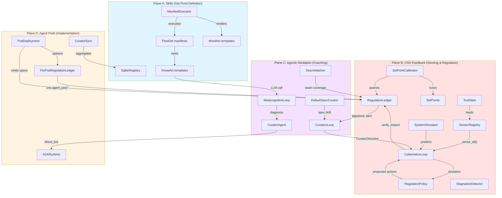
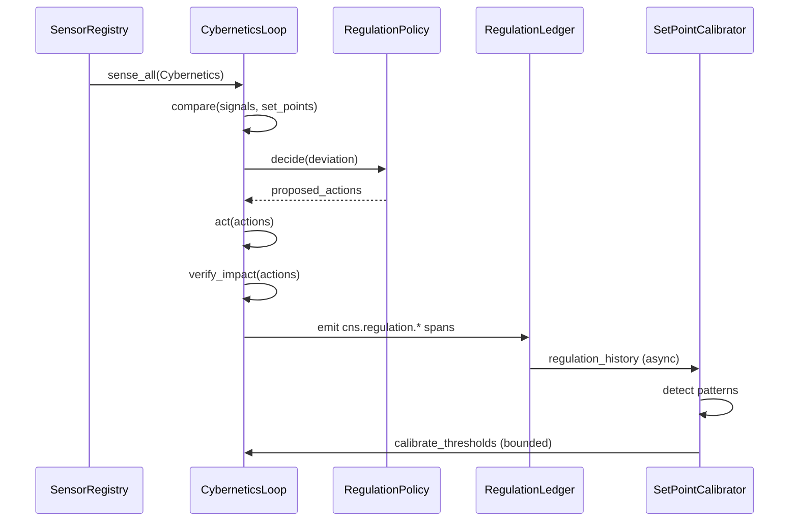
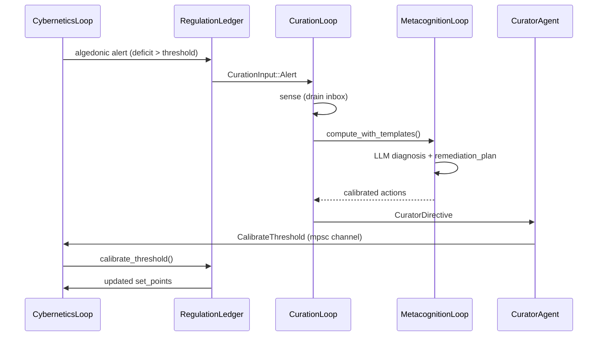
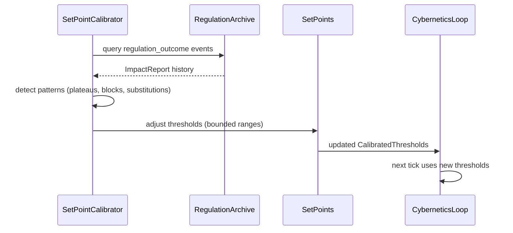
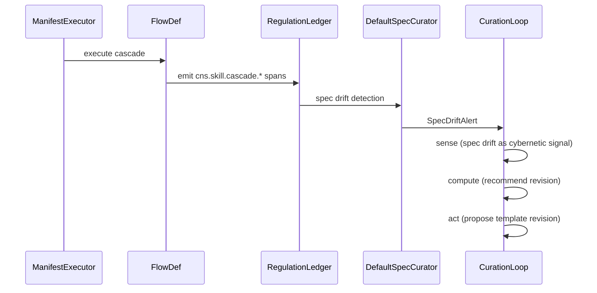
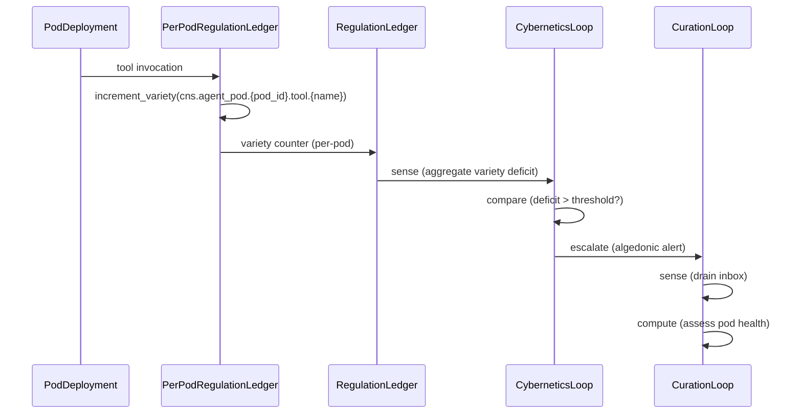

# Toyota Kata Cybernetic Mapping — hKask Control Planes, Nodes, Edges, and Interaction Loops

**Purpose:** Map the Toyota Kata methodology (Improvement Kata + Coaching Kata) onto hKask's cybernetic architecture to identify structural correspondences, validate the feedback system design against a proven industrial reference model, and surface gaps where hKask's sensing, regulation, and adaptation loops diverge from the Kata pattern.

**Reference:** Rother, M. (2009). *Toyota Kata: Managing People for Improvement, Adaptiveness, and Superior Results.* McGraw-Hill. — the canonical source for the Improvement Kata (4-step PDCA) and Coaching Kata (5-question dialogue).

---

## 1. The Toyota Kata Pattern — Structural Decomposition

The Toyota Kata is not a process — it is a **cybernetic feedback system** for developing human scientific thinking. Its structure maps directly onto Beer's Viable System Model and Ashby's Law of Requisite Variety.

### 1.1 The Improvement Kata (4-Step PDCA)

| Step | Kata Action | Cybernetic Function | Ashby/VSM Role |
|------|-------------|---------------------|----------------|
| **1. Understand Direction** | Articulate the challenge from the level above | **Set-point definition** — the target condition the system regulates toward | VSM S5 (Policy) — defines what "good" means |
| **2. Grasp Current Condition** | Go and see; measure actual state | **Sensing** — the afferent signal that detects deviation from the set-point | VSM S1 (Implementation) + S3 (Control) — sense actual vs. target |
| **3. Establish Target Condition** | Declare measurable target 1 week–3 months out | **Set-point adjustment** — the next operational target, beyond current knowledge threshold | VSM S4 (Intelligence) — future state planning |
| **4. Experiment (PDCA)** | Design one-step experiment with prediction | **Regulatory action** — the efferent signal that moves the system toward the target | VSM S1 (Implementation) + S3 (Control) — act and verify |

### 1.2 The Coaching Kata (5-Question Dialogue)

| Question | Kata Action | Cybernetic Function | Ashby/VSM Role |
|----------|-------------|---------------------|----------------|
| **Q1: What is your target condition?** | Verify the learner knows their set-point | **Set-point validation** — the coach confirms the target is measurable and specific | VSM S4→S1 channel — intelligence to implementation |
| **Q2: What is your actual condition?** | Force the learner to ground in data, not assumptions | **Sensing fidelity check** — the coach verifies the sensor is reading reality, not story | VSM S3 (Control) — audit of S1 sensing |
| **Q3: What obstacles prevent reaching the target? Which ONE now?** | Force prioritization — one obstacle at a time | **Variety attenuation** — reduce the disturbance space to a single class the regulator can absorb | Ashby's Law — attenuate system variety to match regulator variety |
| **Q4: What is your next step? What do you expect?** | Require a prediction, not just an action | **Hypothesis-driven action** — the experiment is a test, not a fix | VSM S1 (Implementation) — act with predicted outcome |
| **Q5: How quickly can we go and see what we learned?** | Close the feedback loop fast | **Delay minimization** — the time between action and sensing determines loop stability | Cybernetic property: delay — shorter delay = more stable regulation |

### 1.3 The Deep Wisdom — General Structure

The Kata's genius is not in any single step but in the **structural relationship** between them:

1. **Direction precedes measurement.** You cannot regulate toward a target you haven't defined. The set-point must exist before the sensor can detect deviation.
2. **Measurement precedes action.** You cannot act on what you haven't measured. The afferent signal must exist before the efferent response.
3. **Prediction precedes verification.** Every action carries a hypothesis. The `verify_impact()` step is not just "did it work?" but "did it work *as predicted*?" — this is how the regulator learns.
4. **One obstacle at a time.** Variety attenuation is not a suggestion — it is Ashby's Law made operational. The regulator can only absorb one disturbance class at a time.
5. **Fast feedback closes the loop.** The delay between action and sensing is the critical cybernetic parameter. Long delays produce oscillation; short delays produce convergence.
6. **The coach is the meta-regulator.** The Coaching Kata is the Conant-Ashby closure — the regulator (coach) observes the regulator (learner) and intervenes when the learner's model diverges from reality.

---

## 2. hKask Control Planes — The Four Surfaces

hKask's architecture has four control planes (surfaces), each with distinct nodes, edges, and interaction loops. These map directly onto the Kata's structural elements.

### 2.1 Control Plane A — The Skills Plane (Pattern A: WordAct / FlowDef / KnowAct)

**What it is:** The template-driven behavior composition surface. Templates are the DNA of agent behavior — they define what agents say (WordAct), what they do (FlowDef), and how they think (KnowAct).

**Kata correspondence:** The Skills Plane is the **set-point definition surface**. Templates encode the target condition — the desired behavior the system regulates toward. When a skill's `convergence.threshold` is set, that IS the Kata's "target condition."

**Nodes:**
- `ManifestExecutor` — the cascade driver (select → populate → execute)
- `SqliteRegistry` — the template registry (canonical source of truth)
- `FlowDef` manifests — the step sequences
- `KnowAct` templates — the metacognitive patterns
- `WordAct` templates — the persona definitions

**Edges:**
- `ManifestExecutor → SqliteRegistry` — template lookup
- `FlowDef → KnowAct/WordAct` — nested cascade (matryoshka, depth ≤ 7)
- `KnowAct → InferencePort` — LLM call for judgment
- `FlowDef → GovernedTool` — energy-accounted execution

**Interaction loops:**
- **PDCA convergence loop:** `convergence.threshold` → execute steps → measure metric → if metric > threshold, loop → if ≤ threshold, converged
- **Gas budget loop:** `gas` (compute cycles) + `rjoule` (inference energy) → if exhausted, escalate
- **Skill health loop:** `cns.skill.lifecycle.*` spans → `DefaultSpecCurator` detects drift → recommend revision

**Kata alignment:**
- Step 1 (Understand Direction) = `FlowDef` manifest's `goal` field
- Step 3 (Establish Target Condition) = `convergence.threshold` + `max_iterations`
- Step 4 (Experiment) = each `FlowDef` step is a PDCA experiment with prediction (the `condition` expression) and verification (the convergence metric)

### 2.2 Control Plane B — The CNS Feedback Plane (Pattern B: Cybernetic Self-Regulation)

**What it is:** The autonomic nervous system — variety sensing, algedonic alerts, energy budgets, OCAP governance, sovereignty enforcement. This is the **regulatory surface** that detects deviation and produces regulatory action.

**Kata correspondence:** The CNS Feedback Plane is the **sensing and regulation surface**. It implements Steps 2 (Grasp Current Condition) and 4 (Experiment/Act) of the Improvement Kata, plus Q2 (Actual Condition) and Q4 (Next Step) of the Coaching Kata.

**Nodes:**
- `RegulationLedger` — the central nervous system (variety counters, algedonic manager, regulation history)
- `CyberneticsLoop` — the homeostatic regulator (sense → compare → compute → act → verify)
- `SensorRegistry` — the unified sensor registry (per-loop `SensorRegistry` instances)
- `RegulationPolicy` — the per-metric action mapping (metric, deviation) → (actions, thresholds)
- `SetPoints` — the regulatory thresholds (the system's set-points)
- `SetPointCalibrator` — the self-tuning regulator (Conant-Ashby closure)
- `StagnationDetector` — the plateau detector (regulatory plateau = wrong attractor)
- `Dampener` — the anti-oscillation mechanism
- `ToolStats` — the statistical learner (LogNormal cost, Beta reliability)
- `StrategyEvaluator` — the multi-model strategy selector
- `SystemSimulator` — the predictive digital twin (MovingAverageExtrapolator)

**Edges:**
- `SensorRegistry → CyberneticsLoop::sense()` — afferent signals
- `CyberneticsLoop::compute() → RegulationPolicy::decide()` — deviation → proposed action
- `CyberneticsLoop::act() → target loop's regulate()` — efferent signal
- `CyberneticsLoop::verify_impact() → ImpactReport` — Conant-Ashby closure
- `SetPointCalibrator → RegulationArchive → SetPoints` — self-tuning loop
- `AlgedonicManager → CurationLoop` — escalation pathway (Cybernetics → Curation)
- `CuratorDirective::CalibrateThreshold → CyberneticsLoop → RegulationLedger::calibrate_threshold()` — Curation → Cybernetics (brain regulates autonomic nervous system)

**Interaction loops:**
- **Five-phase regulation loop:** sense → compare → compute → act → verify_impact (the `Loop` trait)
- **Algedonic escalation loop:** Cybernetics detects deficit → `RuntimeAlert` → `CurationInput::Alert` → CurationLoop sense → CuratorAgent assess → `CuratorDirective` → Cybernetics act
- **Self-tuning loop:** `SetPointCalibrator` queries `RegulationArchive` replay → detects patterns (plateaus, blocks, substitutions) → adjusts `SetPoints` within bounded ranges
- **Statistical learning loop:** `ToolStats` records per-tool gas costs and success/failure at settle time → fits LogNormal/Beta distributions → `GovernedTool` reserves at p90 → `ToolReliabilitySensor` feeds reliability into regulation
- **Predictive regulation loop:** `SystemSimulator` observes metric trends → predicts ticks-to-threshold → `CyberneticsLoop::compute()` emits `Notify` action before deviation occurs

**Kata alignment:**
- Step 2 (Grasp Current Condition) = `SensorRegistry::sense_all()` + `CyberneticsLoop::sense()`
- Step 4 (Experiment/Act) = `CyberneticsLoop::compute()` + `act()` + `verify_impact()`
- Q2 (Actual Condition) = `verify_impact()` — the re-sensing that grounds in data
- Q5 (How quickly can we go and see?) = `verify_impact()` is called in the same tick — delay = 0

### 2.3 Control Plane C — The Agentic Mediation Plane (Pattern C: Curator + 7R7)

**What it is:** The meta-agent layer — the Curator observes, assesses, intervenes, and escalates. This is the **meta-regulatory surface** that regulates the regulator.

**Kata correspondence:** The Agentic Mediation Plane is the **Coaching Kata surface**. The Curator IS the coach — it observes the regulator (Cybernetics) and intervenes when the regulator's model diverges from reality.

**Nodes:**
- `CuratorAgent` — the persona layer (singleton, VSM S4)
- `CurationLoop` — the pure regulatory observer (sense/compute/act)
- `MetacognitionLoop` — the persona/agent loop (template-driven metacognition)
- `7R7 Listener` — the passive observer (Matrix rooms, zero authority)
- `R7.3 SeamWatcher` — the public API contract observer (zero authority)
- `DefaultSpecCurator` — the spec drift detector (Conant-Ashby: model vs. reality)
- `CuratorContext` — the capability-disciplined access point (OCAP-gated)

**Edges:**
- `CurationLoop → CuratorAgent` — `CuratorDirective` dispatch
- `MetacognitionLoop → InferencePort` — template-driven diagnosis (KnowAct)
- `CuratorAgent → A2ARuntime` — bot orchestration (direct_bot)
- `CuratorAgent → MatrixTransport` — standing session posting
- `CuratorContext → RegulationLedger` — capability-disciplined CNS access
- `SeamWatcher → RegulationLedger` — seam coverage as variety dimension

**Interaction loops:**
- **Two-level meta-loop:** Cybernetics regulates agents → Curation regulates Cybernetics → if Cybernetics unstable, Curation detects via metacognitive monitoring and intervenes
- **Spec drift loop:** `DefaultSpecCurator` detects spec vs. implementation divergence → `SpecDriftAlert` → Conant-Ashby violation → revise spec, not suppress alert
- **Template-driven metacognition loop:** `MetacognitionLoop::compute_with_templates()` → `curator/metacognition-diagnose.j2` → LLM produces `diagnosis` + `remediation_plan` → calibrated actions
- **CAT engagement loop:** `cat::evaluate()` → message relevance scored via ontology graph proximity → `convergence_bias` modulated → speak/silent decision

**Kata alignment:**
- Q1 (Target Condition) = `CuratorDirective::CalibrateThreshold` — the coach sets the learner's set-point
- Q3 (Obstacles, which ONE?) = `MetacognitionLoop`'s obstacle prioritization — the most consequential obstacle first
- Q5 (How quickly can we go and see?) = `MetacognitionLoop`'s `verify_impact()` — the Curator re-senses after intervening
- The Coaching Kata's 5 questions = `MetacognitionLoop`'s 5-phase cycle (decompose → assess → ellipsis → calibrate → converge)

### 2.4 Control Plane D — The Agent Pod Plane (Pattern D: Agent Creation + Sovereign Memory)

**What it is:** The pod lifecycle — how agents come into existence with identity, capabilities, memory, and consent boundaries. This is the **deployment surface** where regulated actors exist.

**Kata correspondence:** The Agent Pod Plane is the **implementation surface** — the place where the Kata is practiced. Each UserPod is a learner practicing the Kata; the Curator is the coach.

**Nodes:**
- `PodDeployment` — the canonical pod type (per-pod SQLCipher, CNS, MCP)
- `PodFactory` — the stateless constructor
- `PodRegistry` — filesystem-based discovery
- `ActivePods` — the runtime registry
- `PerPodRegulationLedger` — per-pod CNS isolation (`cns.agent_pod.{pod_id}.*`)
- `PerPodStorage` — per-pod SQLCipher boundary
- `AgentPod` — identity, lifecycle, persona, capability token
- `A2ARuntime` — agent-to-agent messaging (TemplateDispatch, TemplateResponse, MemoryArtifact)

**Edges:**
- `PodFactory::deploy() → PodDeployment` — pod creation
- `PodDeployment → PerPodRegulationLedger` — per-pod CNS scoping
- `PodDeployment → McpRuntime` — per-pod MCP bindings
- `A2ARuntime → A2AMessage` — inter-agent communication
- `CuratorSync → SemanticIndex` — cross-pod semantic aggregation

**Interaction loops:**
- **Pod lifecycle loop:** Creation → Populated → Registered → Activated → Deactivated
- **Dual memory encoding loop:** tool call → `record_experience()` → episodic (private) + semantic (public) → every 10 experiences → `generate_narrative()`
- **Consent loop:** `ConsentManager` requires explicit affirmative consent for visibility transitions → sovereignty fails closed
- **CuratorSync loop:** `store_semantic()` writes locally → `cns.semantic.published` → `CuratorSync` polling → `SemanticIndex` aggregation

**Kata alignment:**
- The learner (UserPod) practices the Kata on this plane
- The coach (Curator) observes via CNS spans emitted from this plane
- Each pod's `PerPodRegulationLedger` is the learner's local sensorium — the coach cannot see inside the learner's head, only the behaviors the learner emits

---

## 3. Nodes and Edges — The Complete Cybernetic Graph

---

## 4. Interaction Loops — The Five Cybernetic Cycles

### 4.1 The Regulation Loop (Plane B internal)

**Kata mapping:** This is the Improvement Kata's Step 4 (Experiment) + the Coaching Kata's Q4 (Next Step) + Q5 (Go and see). The `verify_impact()` step IS the "go and see" — it re-senses the metric after acting, closing the feedback loop in the same tick (delay = 0).

**Cybernetic properties:**
- **Polarity:** Negative feedback (deviation → corrective action)
- **Delay:** Zero — `verify_impact()` is called in the same `tick()` cycle
- **Gain:** `LoopMetrics::gain` = actions / deviations (1.0 = every deviation produced an action)
- **Closure:** `ImpactReport` with `ActionDecision::Accept/Stage/Block` — the loop is closed
- **Fidelity:** `LoopMetrics::fidelity_score` = matched_deviations / total_deviations

### 4.2 The Meta-Regulation Loop (Plane B → Plane C → Plane B)

**Kata mapping:** This is the Coaching Kata in full. The Curator (coach) asks:
- Q1 (Target): What set-point should the Cybernetics loop regulate toward?
- Q2 (Actual): What is the current deficit? (from the algedonic alert)
- Q3 (Obstacles): What's preventing convergence? (from the LLM diagnosis)
- Q4 (Next Step): What threshold adjustment should we make? (from the remediation plan)
- Q5 (Go and see): Re-sense after the threshold change (next tick's `sense()`)

**Cybernetic properties:**
- **Polarity:** Negative feedback at the meta-level (regulator instability → meta-regulator intervention)
- **Delay:** One tick (Curation runs at 10s interval, Cybernetics at 2s)
- **Gain:** The `CuratorDirective::CalibrateThreshold` adjusts the set-point, changing the gain of the regulation loop
- **Closure:** The next Cybernetics tick re-senses with the new threshold — the meta-loop is closed

### 4.3 The Self-Tuning Loop (Plane B internal, Conant-Ashby)

**Kata mapping:** This is the Improvement Kata's Step 3 (Establish Target Condition) at the meta-level. The `SetPointCalibrator` is the system establishing its own next target condition — the set-point adjustment IS the target condition update.

**Cybernetic properties:**
- **Polarity:** Negative feedback (ineffective regulation → threshold adjustment)
- **Delay:** 1 hour (default calibration interval) with 50-event minimum
- **Gain:** Bounded — thresholds adjust within configured ranges, not unbounded
- **Closure:** The next regulation cycle uses the new thresholds — the Conant-Ashby loop is closed (the regulator models its own effectiveness)

### 4.4 The Skill Evolution Loop (Plane A → Plane C → Plane A)

**Kata mapping:** This is the Improvement Kata's full 4-step cycle applied to the skills themselves:
- Step 1 (Direction): The skill's `goal` field
- Step 2 (Current): `cns.skill.cascade.*` spans show actual execution behavior
- Step 3 (Target): The `convergence.threshold` — the desired outcome
- Step 4 (Experiment): Each cascade step is a PDCA experiment; the `DefaultSpecCurator` detects when the spec (target) diverges from implementation (actual)

**Cybernetic properties:**
- **Polarity:** Negative feedback (spec drift → spec revision)
- **Delay:** Spec drift detection runs on the Curation loop's 10s interval
- **Gain:** The `DefaultSpecCurator` recommends revisions; it does not auto-apply them (human-in-the-loop)
- **Closure:** The revised template is loaded into `SqliteRegistry` → next cascade execution uses the revised spec

### 4.5 The Pod Observability Loop (Plane D → Plane B → Plane C)

**Kata mapping:** This is the Coaching Kata's Q2 (Actual Condition) applied at the pod level. The Curator asks "what is the actual condition of this pod?" — the answer comes from the per-pod CNS variety counters. The pod's behavioral diversity (variety) is the measure of its health.

**Cybernetic properties:**
- **Polarity:** Negative feedback (low variety → escalation)
- **Delay:** Cybernetics senses at 2s, Curation at 10s — total delay ~12s
- **Gain:** The `VarietySensor` produces one aggregate signal (worst deficit across all pods)
- **Closure:** The Curator's intervention (e.g., `ReplenishBudget`) changes the pod's behavior, which changes its variety, which is re-sensed in the next cycle

---

## 5. The Kata → hKask Correspondence Table

| Toyota Kata Element | hKask Implementation | Control Plane | Cybernetic Function |
|---------------------|---------------------|---------------|---------------------|
| **Improvement Kata Step 1: Understand Direction** | `FlowDef` manifest's `goal` field; `CuratorDirective` from level above | A + C | Set-point definition |
| **Improvement Kata Step 2: Grasp Current Condition** | `SensorRegistry::sense_all()`; `CyberneticsLoop::sense()`; `CurationLoop::sense()` | B + C | Afferent sensing |
| **Improvement Kata Step 3: Establish Target Condition** | `convergence.threshold`; `SetPoints`; `SetPointCalibrator` self-tuning | A + B | Set-point adjustment |
| **Improvement Kata Step 4: Experiment (PDCA)** | `CyberneticsLoop::compute() + act() + verify_impact()`; `FlowDef` cascade steps | B + A | Regulatory action with prediction and verification |
| **Coaching Kata Q1: Target Condition?** | `CuratorDirective::CalibrateThreshold`; `MetacognitionLoop` target | C | Set-point validation |
| **Coaching Kata Q2: Actual Condition?** | `verify_impact()` re-sensing; `HealthSnapshot`; per-pod CNS variety | B + C + D | Sensing fidelity check |
| **Coaching Kata Q3: Obstacles? Which ONE?** | `MetacognitionLoop` obstacle prioritization; `RegulationPolicy` substitution ladder (one metric at a time) | C + B | Variety attenuation |
| **Coaching Kata Q4: Next Step? What do you expect?** | `RegulationPolicy::decide()` → proposed action with `reason`; `FlowDef` step with `condition` expression | B + A | Hypothesis-driven action |
| **Coaching Kata Q5: How quickly can we go and see?** | `verify_impact()` in same tick (delay = 0); `LoopScheduler` tick intervals | B | Delay minimization |
| **The Coach (meta-regulator)** | `CuratorAgent` + `CurationLoop` + `MetacognitionLoop` | C | Conant-Ashby: regulator of the regulator |
| **The Learner (regulated actor)** | `UserPod` + `PodDeployment` + `PerPodRegulationLedger` | D | VSM S1 Implementation |
| **The Kata Storyboard** | `RegulationArchive` (ν-events) + `KataHistory` + `regulation_history` ring buffer | B + C | Cybernetic audit trail |
| **The Obstacles Parking Lot** | `EscalationEntry` queue; `StagnationDetector` stagnation keys | B + C | Disturbance inventory |
| **Practice Frequency / Streaks** | `KataHistory::PracticeEntry`; `cns.kata` spans | C | Habit formation tracking |
| **Automaticity Score** | `KataHistory` graduation criteria; skill health score | A + C | Skill maturity signal |
| **The "One Obstacle" Rule** | `RegulationPolicy` processes one `(metric, direction)` at a time; `StagnationDetector` tracks one `(metric, action_type)` pair | B | Ashby's Law: variety attenuation |
| **The Prediction** | `FlowDef` step's `condition` expression; `SystemSimulator` trend prediction | A + B | Hypothesis before action |
| **The "Go and See"** | `verify_impact()` re-sensing; `LoopMetrics::effectiveness_score` | B | Feedback loop closure |

---

## 6. Gaps and Divergences — Where hKask Differs from the Kata

### 6.1 The Prediction Gap

**Kata:** Every action carries an explicit prediction. "If I do X, I expect Y because Z."

**hKask gap:** The `RegulatoryAction` struct has a `reason` field (free-form string) but no `prediction` field. The `verify_impact()` step checks "did the metric improve?" but not "did the metric improve *as predicted*?"

**Impact:** The regulator learns whether its actions are effective, but not whether its *model* is correct. Two different actions could produce the same metric improvement via different mechanisms — without a prediction, the regulator cannot distinguish between them.

**Recommendation:** Add an optional `prediction: Option<f64>` field to `RegulatoryActionParams` — the expected metric value after the action. The `verify_impact()` step can then compare `after` vs. `prediction` (model validation) in addition to `after` vs. `before` (effectiveness).

### 6.2 The One-Obstacle-at-a-Time Gap

**Kata:** The coach forces the learner to address ONE obstacle at a time. This is Ashby's Law made operational — the regulator can only absorb one disturbance class at a time.

**hKask gap:** The `CyberneticsLoop::compute()` method processes ALL deviations in a single tick. The `RegulationPolicy::decide()` returns actions for every matching deviation. There is no mechanism to prioritize "one obstacle at a time."

**Impact:** When multiple metrics deviate simultaneously, the regulator produces multiple actions, which may interact or conflict. This violates the Kata's variety attenuation principle.

**Recommendation:** Add a `prioritize_deviation()` method to `CyberneticsLoop` that selects the single most consequential deviation (by magnitude × severity) and processes only that one per tick. Other deviations are queued for subsequent ticks. This matches the Kata's "one obstacle" rule and prevents action interference.

### 6.3 The Coaching Dialogue Gap

**Kata:** The Coaching Kata is a 5-question *dialogue* — the coach asks, the learner answers, the coach probes. It is inherently interactive and multi-turn.

**hKask gap:** The `MetacognitionLoop` is a monolithic sense→compute→act cycle. There is no multi-turn dialogue structure — the Curator produces a diagnosis and remediation plan in a single LLM call, not through iterative questioning.

**Impact:** The Curator's metacognition is shallow — it cannot probe assumptions, challenge interpretations, or force prioritization the way a human coach would. The `cat::evaluate()` engagement gate is a binary speak/silent decision, not a Socratic dialogue.

**Recommendation:** This is a known limitation. The `improv` skill (Plussing, Yes-And, Yes-But, Freestyling, Riffing) provides the interaction grammar for multi-turn dialogue, but it is not yet wired into the `MetacognitionLoop`. Future work: compose `improv` with `MetacognitionLoop` to enable iterative coaching dialogue.

### 6.4 The Practice Frequency Gap

**Kata:** Practice frequency and streaks are tracked. Automaticity is the goal — the Kata is practiced until it becomes automatic.

**hKask gap:** The `KataHistory` tracks practice frequency and streaks for the kata *skills* (Improvement Kata, Coaching Kata, Starter Kata), but not for the *regulation loops* themselves. There is no "practice frequency" for the Cybernetics loop's regulation cycles.

**Impact:** The system cannot detect whether its regulation loops are "practicing" effectively — e.g., whether the `verify_impact()` step is being called, whether `SetPointCalibrator` is tuning thresholds, whether `StagnationDetector` is detecting plateaus.

**Recommendation:** Add `cns.kata.regulation.*` spans for regulation loop practice: `cns.kata.regulation.cycle_completed`, `cns.kata.regulation.plateau_detected`, `cns.kata.regulation.threshold_calibrated`. These feed into the existing `KataHistory` infrastructure.

### 6.5 The Knowledge Threshold Gap

**Kata:** The learner explicitly marks the boundary of their current knowledge. "I don't know what will happen if I do X" is a valid and important statement.

**hKask gap:** The `LoopMetrics` struct has `fidelity_confidence` (0.6–1.0) but no explicit "knowledge threshold" marker. The system cannot say "I don't know whether this action will work."

**Impact:** The regulator acts with false confidence. When `fidelity_confidence` is 0.6 (string-heuristic matching was used), the system should treat its own actions as hypotheses, not certainties — but there is no mechanism to escalate "low confidence" actions differently from "high confidence" ones.

**Recommendation:** Add a `confidence_threshold` to `SetPoints` — when `fidelity_confidence < confidence_threshold`, the action is routed to Curation for review before execution. This matches the Kata's "mark the boundary of your knowledge" principle.

---

## 7. The Unified Sensing Ontology — Mapping to the Kata

The sensor flattening (Phase 0 of ADR-056) established the `SensorRegistry` as the unified registration point. The Kata mapping reveals the *ontology* of sensing — what each sensor *means* in Kata terms:

### 7.1 Sensor Categories (Kata-aligned)

| Sensor Category | Kata Function | hKask Sensors | SignalMetric Variants |
|-----------------|---------------|---------------|----------------------|
| **Direction sensors** | Verify the set-point is defined and measurable | (none — set-points are configured, not sensed) | (none) |
| **Current condition sensors** | Grasp the actual state — Step 2 | `EnergyBudgetSensor`, `VarietySensor`, `WalletKeyHealthSensor`, `WalletBalanceRatioSensor`, `ToolReliabilitySensor` | `EnergyRemaining`, `VarietyDeficit`, `WalletKeyHealth`, `WalletBalanceRatio`, `ToolReliability` |
| **Target condition sensors** | Measure progress toward the target | `SetPointCalibrator` (senses regulation effectiveness) | `ActionIneffective`, `RegulatoryPlateau`, `ActionDecisionBlocked` |
| **Experiment sensors** | Sense the action's effect — Step 4 verify | `verify_impact()` implementations | (re-senses the targeted metric) |
| **Obstacle sensors** | Detect what prevents convergence | `StagnationDetector`, `Dampener` | `StagnationThreshold`, `ActionIneffective` |
| **Practice sensors** | Track habit formation and automaticity | `KataHistory`, `cns.kata.*` spans | (kata-specific metrics) |

### 7.2 The Missing Sensor Category: Direction Sensors

The Kata mapping reveals a gap: hKask has no **direction sensors** — sensors that verify the set-point itself is defined, measurable, and aligned with the level above. In the Kata, Step 1 (Understand Direction) is the first step — you cannot regulate toward a target you haven't defined.

In hKask, set-points are configured statically via `SetPoints` and adjusted by `SetPointCalibrator`. But there is no sensor that detects "this metric has no set-point configured" or "this set-point is misaligned with the Curator's directive."

**Recommendation:** Add a `SetPointCoverageSensor` that detects metrics with no configured set-point. This closes the Kata's Step 1 gap — the system can sense when it lacks a direction.

---

## 8. Benchmark Against Observability Best Practices

### 8.1 The Three Pillars of Observability (Sridharan)

hKask's observability maps onto the three pillars defined in Sridharan, C. (2018). *Distributed Systems Observability.* O'Reilly:

| Pillar | hKask Implementation | Kata Correspondence |
|--------|---------------------|---------------------|
| **Metrics** | `LoopMetrics` (delay_ms, gain, fidelity_score, effectiveness_score); `LedgerHealth` (variety, deficit); `GasReport` | Kata Step 2 (Grasp Current Condition) — the measured data |
| **Logs** | `tracing` spans with `target: "cns.*"` and `target: "hkask.*"` | Kata storyboard — the audit trail of what happened |
| **Traces** | `RegulationRecord` (ν-events) with `Span`, `CyclePhase`, `parent_event` — distributed tracing across loops | Kata practice history — the sequence of experiments and outcomes |

### 8.2 DORA Metrics (Forsgren)

hKask already emits DORA spans (`cns.platform.metric.dora.*`): deploy frequency, lead time, MTTR, change fail rate. These are the industry-standard metrics for DevOps performance.

**Kata alignment:** DORA metrics are the "current condition" (Step 2) for the deployment pipeline. The `SetPointCalibrator` can tune deployment thresholds based on DORA trends — this is the Kata's Step 3 (Establish Target Condition) applied to DevOps.

### 8.3 SPACE Framework (GitHub)

hKask emits SPACE spans (`cns.platform.metric.space.*`): satisfaction, performance, activity, communication, efficiency. These are the developer productivity metrics from GitHub's SPACE framework.

**Kata alignment:** SPACE metrics are the "current condition" for developer experience. The Curator can use SPACE trends to identify obstacles (Step 3) and design experiments (Step 4) to improve developer productivity.

### 8.4 OpenTelemetry Compatibility

hKask's `tracing` infrastructure is compatible with OpenTelemetry — the `tracing-opentelemetry` crate can export hKask's spans to any OTLP-compatible backend.

**Kata alignment:** OpenTelemetry traces are the distributed version of the Kata storyboard — they show the sequence of actions and outcomes across the entire system, not just within a single loop.

### 8.5 The "Three Faces of Knowledge" (Bloom)

Harold Bloom's method (used in the `metacognition` skill) distinguishes between:
1. What is said (the text)
2. What is not said (the ellipsis)
3. What is exceptional (the "not inferno")

**Kata alignment:** This maps onto the Kata's Step 2 (Grasp Current Condition):
- What is said = the measured metrics (Step 2 data)
- What is not said = the metrics that *should* be measured but aren't (the sensor coverage gap)
- What is exceptional = the metrics that show unusual patterns (the `StagnationDetector` and `SystemSimulator` detect these)

---

## 9. Recommendations — Closing the Gaps

### 9.1 Immediate (Phase 1-3 of ADR-056)

1. **Extend `RegulationPolicy`** to cover all 31 `SignalMetric` variants (closes the Ashby variety deficit)
2. **Extend `default_substitution_ladder`** for all regulated metrics (closes the substitution gap)
3. **Implement `verify_impact()`** for `StorageGuard`, `McpServerGuard`, `InferenceLoop` (closes the Conant-Ashby gap for domain loops)

### 9.2 Near-term (Phase 4 of ADR-056)

4. **Migrate inline `sense()` methods** to `Sensor` implementations registered with `SensorRegistry` (completes the sensor unification)
5. **Wire `SensorRegistry` into `build_loops()`** so the catalog is instantiated at startup

### 9.3 Medium-term (Kata alignment)

6. **Add `prediction` field to `RegulatoryActionParams`** — the expected metric value after the action (closes the prediction gap, §6.1)
7. **Add `prioritize_deviation()` to `CyberneticsLoop`** — process one obstacle at a time (closes the one-obstacle gap, §6.2)
8. **Add `SetPointCoverageSensor`** — detect metrics with no configured set-point (closes the direction sensor gap, §7.2)
9. **Add `confidence_threshold` to `SetPoints`** — route low-confidence actions to Curation (closes the knowledge threshold gap, §6.5)

### 9.4 Long-term (Coaching dialogue)

10. **Compose `improv` with `MetacognitionLoop`** — enable iterative coaching dialogue (closes the coaching dialogue gap, §6.3)
11. **Add `cns.kata.regulation.*` spans** — track regulation loop practice frequency (closes the practice frequency gap, §6.4)

---

## 10. Conclusion — The Kata as Validation

The Toyota Kata is not just a methodology — it is a **proven cybernetic feedback system** that has been validated in industrial settings for decades. Its structural correspondence with hKask's architecture is not coincidental: both systems implement the same cybernetic principles (Ashby's Law, Conant-Ashby, VSM, negative feedback loops).

The mapping reveals that hKask's architecture is **structurally sound** — the four control planes, the five interaction loops, and the sensor/regulator/meta-regulator hierarchy all have direct Kata correspondences. The gaps identified in §6 are not architectural failures but **implementation gaps** — places where the Kata's wisdom has not yet been encoded into the system's sensing and regulation logic.

The most important insight from the mapping is the **prediction gap** (§6.1). The Kata's genius is not in the action — it is in the *prediction*. "What do you expect?" is the question that turns a fix into an experiment. Without a prediction, `verify_impact()` can only answer "did it work?" — it cannot answer "did it work *for the reason we thought*?" Adding a `prediction` field to `RegulatoryActionParams` would close this gap and bring hKask's regulation loops into full Kata alignment.

---

## References

[^rother]: Rother, M. (2009). *Toyota Kata: Managing People for Improvement, Adaptiveness, and Superior Results.* McGraw-Hill. — the canonical source for the Improvement Kata and Coaching Kata.
[^ashby]: Ashby, W. R. (1956). *An Introduction to Cybernetics.* Chapman & Hall. — Ashby's Law of Requisite Variety.
[^conant-ashby]: Conant, R. C., & Ashby, W. R. (1970). "Every Good Regulator of a System Must Be a Model of That System." *International Journal of Systems Science*, 1(2), 89-97.
[^beer-vsm]: Beer, S. (1979). *The Heart of Enterprise.* Wiley. — Viable System Model.
[^sridharan]: Sridharan, C. (2018). *Distributed Systems Observability.* O'Reilly. — three pillars of observability.
[^forsgren-dora]: Forsgren, N., et al. (2021). *Accelerate: The Science of Lean Software and DevOps.* IT Revolution Press. — DORA metrics.
[^github-space]: GitHub Engineering. (2021). *The SPACE of Developer Productivity.* ACM Queue. — SPACE framework.
[^bloom]: Bloom, H. (1994). *The Western Canon.* Harcourt Brace. — the "read deeply" method adapted in the metacognition skill.

---

*ℏKask - A Minimal Viable Container for UserPods — Toyota Kata Cybernetic Mapping — v0.32.0*
