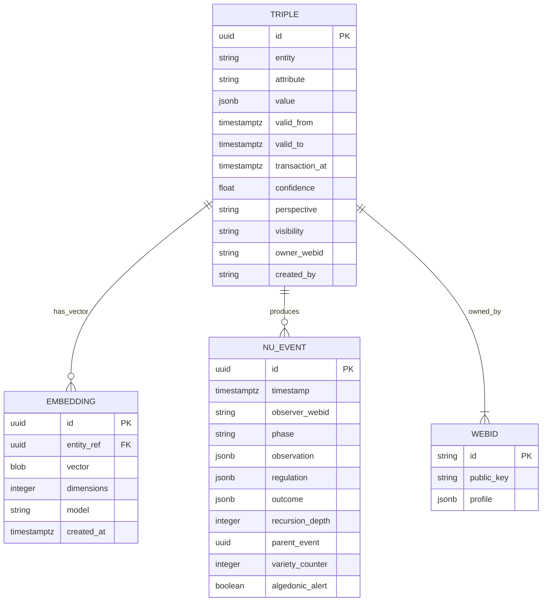

<!-- TOGAF_DOMAIN: Data -->
<!-- VERSION: 1.0.0 -->
<!-- STATUS: Active -->
<!-- LAST_UPDATED: 2026-05-20 -->

# hKask Data Architecture

**Purpose:** Bitemporal triple schema, embedding vector storage, ν-event audit trail, and SQLCipher encryption model.

**Related:** [`hKask-erd.md`](hKask-erd.md), `hkask-storage` crate  
**TOGAF Phase:** C — Data Architecture[^togaf-data]

---

## 1. Executive Summary

hKask stores all data in SQLite with SQLCipher encryption, using bitemporal triples for memory, embedding vectors for semantic search, and ν-events for CNS audit trails.

**Key Design Decisions:**
- **Single storage crate** — `hkask-storage` consolidates all persistence
- **Bitemporal triples** — Valid-time and transaction-time for full auditability
- **Confidence as first-class** — Bayesian combination and retraction
- **Embedding vectors** — sqlite-vec for local, Qdrant contingency
- **ν-event audit** — Every CNS span recorded with observer identity

**Verification:** `cargo test -p hkask-storage`

---

## 2. Bitemporal Triple Schema

### 2.1 Core Schema

```sql
-- Bitemporal triples (semantic + episodic memory)
CREATE TABLE triples (
    id              UUID PRIMARY KEY,
    entity          TEXT NOT NULL,
    attribute       TEXT NOT NULL,
    value           JSONB NOT NULL,
    valid_from      TIMESTAMPTZ NOT NULL,
    valid_to        TIMESTAMPTZ,  -- NULL = still valid
    transaction_at  TIMESTAMPTZ NOT NULL DEFAULT NOW(),
    confidence      FLOAT NOT NULL DEFAULT 1.0,
    perspective     TEXT,  -- NULL = semantic, SOME(agent_id) = episodic
    visibility      TEXT NOT NULL DEFAULT 'public',
    owner_webid     TEXT NOT NULL,
    created_by      TEXT NOT NULL,  -- WebID of creator
    INDEX idx_entity (entity),
    INDEX idx_valid (valid_from, valid_to),
    INDEX idx_confidence (confidence)
);
```

**Bitemporal Semantics:**[^bitemporal]
- `valid_from` / `valid_to` — When the fact is true in the world (valid-time)
- `transaction_at` — When we recorded the fact (transaction-time)
- `confidence` — Bayesian probability (0.0–1.0)
- `perspective` — NULL = semantic (objective), SOME(agent_id) = episodic (subjective)[^tulving]
- `visibility` — `private`, `public`, `shared`

### 2.2 Confidence Combination

**Bayesian Update:**
```
P(H|E) = P(E|H) × P(H) / P(E)
```

**Implementation:**
```rust
pub fn combine_confidence(c1: f64, c2: f64) -> f64 {
    c1 + c2 * (1.0 - c1)  // Noisy-OR combination
}

pub fn retract_confidence(c1: f64, c2: f64) -> f64 {
    c1 * (1.0 - c2)  // Retraction reduces confidence
}
```

**Verification:**
```bash
cargo test -p hkask-storage test_confidence_combination
cargo test -p hkask-storage test_confidence_retraction
```

---

## 3. Embedding Vector Storage

### 3.1 Vector Schema

```sql
-- Embedding vectors (sqlite-vec)
CREATE TABLE embeddings (
    id              UUID PRIMARY KEY,
    entity_ref      UUID NOT NULL REFERENCES triples(id),
    vector          BLOB NOT NULL,  -- f32 array, little-endian
    dimensions      INTEGER NOT NULL,
    model           TEXT NOT NULL,  -- e.g., "mxbai-embed-large-v1"
    created_at      TIMESTAMPTZ NOT NULL DEFAULT NOW(),
    INDEX idx_entity_ref (entity_ref)
);

-- sqlite-vec virtual table for similarity search
CREATE VIRTUAL TABLE vec_embeddings USING vec0(
    vector FLOAT[1024]
);
```

**sqlite-vec Integration:**[^sqlite-vec]
- Vectors stored as little-endian f32 blobs
- Similarity search via cosine distance
- Index: HNSW or ivfflat (configurable)

**Qdrant Contingency:**
If sqlite-vec proves insufficient at scale, Qdrant provides:
- Distributed vector search
- Payload filtering
- HNSW index optimization

**Migration Path:**
```rust
pub trait VectorProvider {
    fn embed(&self, text: &str) -> Result<Vec<f32>>;
    fn similarity(&self, query: &[f32], limit: usize) -> Result<Vec<SimilarityResult>>;
}

// Implementations: SqliteVecProvider, QdrantProvider
```

### 3.2 Embedding Models

| Model | Dimensions | Purpose | MCP Server |
|-------|------------|---------|------------|
| `mxbai-embed-large-v1` | 1024 | General semantic search | `hkask-storage` (sqlite-vec) |
| `bge-m3` | 1024 | Multi-granularity (dense+sparse) | `hkask-storage` (sqlite-vec) |
| `all-MiniLM-L6-v2` | 384 | Fast, local embeddings | `hkask-storage` (sqlite-vec) |

**Model Version Awareness:** Embedding MCP tracks model version per vector. Similarity comparisons require matching models.

---

## 4. ν-Event Audit Trail

### 4.1 ν-Event Schema

```sql
-- ν-events (CNS audit trail)
CREATE TABLE nu_events (
    id                  UUID PRIMARY KEY,
    timestamp           TIMESTAMPTZ NOT NULL DEFAULT NOW(),
    observer_webid      TEXT NOT NULL,
    phase               TEXT NOT NULL,  -- observation | regulation | outcome
    observation         JSONB NOT NULL,
    regulation          JSONB,
    outcome             JSONB,
    recursion_depth     INTEGER NOT NULL DEFAULT 0,
    parent_event        UUID REFERENCES nu_events(id),
    variety_counter     INTEGER NOT NULL DEFAULT 0,
    algedonic_alert     BOOLEAN NOT NULL DEFAULT FALSE,
    INDEX idx_observer (observer_webid),
    INDEX idx_phase (phase),
    INDEX idx_timestamp (timestamp)
);
```

**ν-Event Lifecycle:**[^cybernetics]
1. **Observation** — Sensor detects environmental state
2. **Regulation** — Comparator checks against goal
3. **Outcome** — Effector acts (or algedonic alert escalates)

**CNS Spans:**
- `cns.tool.*` — Tool invocation (validate, execute, outcome)
- `cns.prompt.*` — Prompt lifecycle (render, validate, outcome)
- `cns.agent_pod.*` — Pod lifecycle (init, delegate, complete)
- `cns.connector.*` — External I/O (LLM call, embedding, web)

### 4.2 Variety Counter

**Ashby's Law of Requisite Variety:**[^ashby]
> Only variety can destroy variety.

**Implementation:**
```rust
pub struct VarietyCounter {
    environmental_states: usize,
    internal_states: usize,
    deficit_threshold: u64,  // Default: 100
}

impl VarietyCounter {
    pub fn check(&self) -> Option<AlgedonicAlert> {
        let deficit = self.environmental_states.saturating_sub(self.internal_states);
        if deficit > self.deficit_threshold as usize {
            Some(AlgedonicAlert::VarietyDeficit(deficit))
        } else {
            None
        }
    }
}
```

**Algedonic Alert:**
- Triggered when variety deficit >100
- Escalates to Curator/human
- Recorded in `nu_events.algedonic_alert = TRUE`

---

## 5. SQLCipher Encryption Model

### 5.1 Encryption Schema

```sql
PRAGMA key = 'user_passphrase';
PRAGMA cipher = 'aes-256-cbc';
PRAGMA kdf_iter = 256000;  -- PBKDF2 iterations
PRAGMA cipher_page_size = 4096;
PRAGMA cipher_use_hmac = ON;
```

**Key Derivation:**
- Passphrase → PBKDF2-SHA256 → 256-bit AES key
- Salt stored in OS keychain (`hkask-keystore`)
- 256,000 KDF iterations (OWASP recommendation)[^owasp]

### 5.2 Visibility Gating

**Row-Level Security:**
```sql
-- Visibility enforced at query time
SELECT * FROM triples
WHERE visibility = 'public'
   OR (visibility = 'private' AND owner_webid = current_webid())
   OR (visibility = 'shared' AND owner_webid IN (shared_with(current_webid())));
```

**Visibility Types:**
| Visibility | Read Access | Write Access |
|------------|-------------|--------------|
| `private` | Owner only | Owner only |
| `public` | All agents | Owner only |
| `shared` | Delegated agents | Owner only |

**OCAP Enforcement:** Capability tokens gate access, not SQL predicates alone.

---

## 6. Entity Relationship Diagram



<!-- DIAGRAM_ALIGNMENT
id: DIAG-DATA-001
verified_date: 2026-05-20
verified_against: docs/architecture/hKask-erd.md; crates/hkask-storage/src/schema.rs
status: VERIFIED
-->

---

## 7. Storage Adapters

### 7.1 Adapter Pattern

```rust
pub trait StorageProvider {
    fn store_triple(&self, triple: Triple) -> Result<()>;
    fn query_triples(&self, pattern: TriplePattern) -> Result<Vec<Triple>>;
    fn store_embedding(&self, embedding: Embedding) -> Result<()>;
    fn similarity_search(&self, vector: &[f32], limit: usize) -> Result<Vec<SimilarityResult>>;
    fn store_event(&self, event: NuEvent) -> Result<()>;
}

// Implementations:
// - SqliteStorageProvider (production)
// - InMemoryStorageProvider (testing)
```

**Hexagonal Boundary:** Storage port isolates domain logic from SQLite implementation details.

---

## 8. References

[^togaf-data]: The Open Group. (2011). *TOGAF Standard, Version 9.1*. Phase C: Data Architecture. <https://pubs.opengroup.org/architecture/togaf9-doc/arch/chap14.html>.
[^bitemporal]: Johnston, R., & Weis, T. (2018). *Bitemporal Data: Theory and Practice*. Morgan Kaufmann.
[^sqlite-vec]: Asgarnaei, M. (2024). *sqlite-vec: Vector search extension for SQLite*. <https://github.com/asg017/sqlite-vec>.
[^cybernetics]: Wiener, N. (1948). *Cybernetics: Or Control and Communication in the Animal and the Machine*. MIT Press.
[^ashby]: Ashby, W. R. (1956). *An Introduction to Cybernetics*. Chapman & Hall. Law of Requisite Variety, Chapter 11.
[^owasp]: OWASP. (2023). *Password Storage Cheat Sheet*. <https://cheatsheetseries.owasp.org/cheatsheets/Password_Storage_Cheat_Sheet.html>.
[^tulving]: Tulving, E. (1972). Episodic and Semantic Memory. In E. Tulving & W. Donaldson (Eds.), *Organization of Memory* (pp. 381–403). Academic Press. The episodic/semantic distinction governs hKask's memory taxonomy: episodic memory stores agent-perspective events (subjective, time-stamped); semantic memory stores shared knowledge (objective, perspective-free).

---

*This document describes data architecture. For application components, see [`application-architecture.md`](application-architecture.md).*

**Next:** Task 3.5 — Create `application-architecture.md` (TOGAF Phase C-Application).
