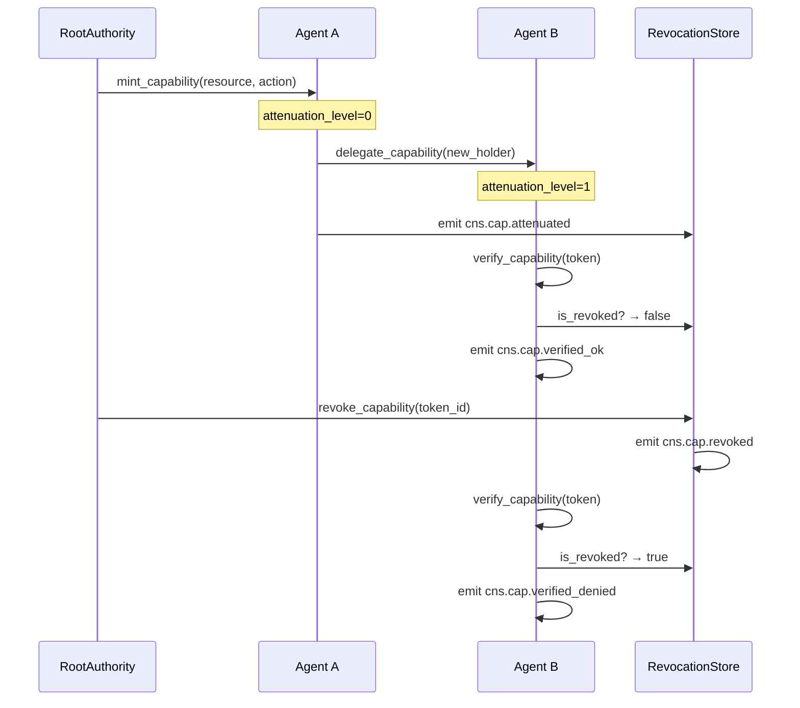
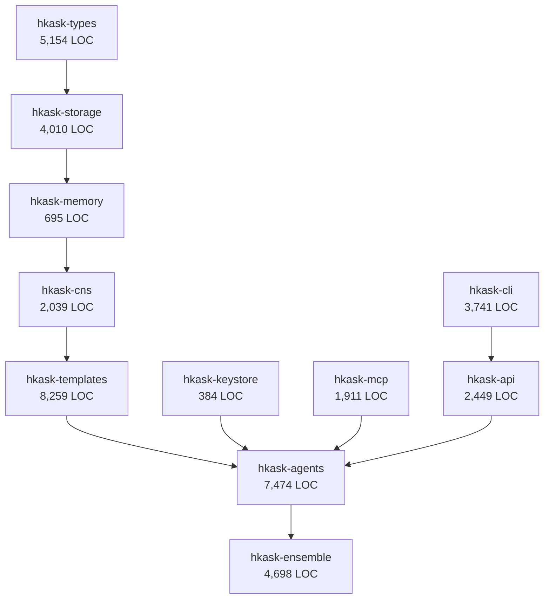

# hKask Domain & Capability Specification

**Purpose:** Authoritative specification for the hKask bounded context, domain ontology, agent taxonomy, capability model, and tool surface. This document is the single source of truth for DDMVSS categories **Domain** and **Capability**.

**Related:** [`interface-and-composition.md`](interface-and-composition.md), [`trust-security-observability.md`](trust-security-observability.md), [`persistence-and-lifecycle.md`](persistence-and-lifecycle.md), [`PRINCIPLES.md`](PRINCIPLES.md), [`magna-carta.md`](magna-carta.md)

**Verification:** `cargo check --workspace && cargo test -p hkask-types && cargo test -p hkask-agents`

---

## 1. Bounded Context

hKask is a **minimal agent-native container platform** — the unit of composition for sovereign agentic AI tooling.[^evans-ddd]

**In scope:**
- Agent lifecycle — creation, activation, delegation, deactivation of bots and replicants in pods
- Capability management — granting, attenuating, revoking, and verifying OCAP tokens
- Template-driven composition — registry-based template selection, rendering, and cascade
- Cybernetic observability — CNS span emission, variety counting, algedonic alerting

**Delegated (out of scope):**
- LLM inference → Okapi (external service)
- External service integration → 15 MCP servers (tool surface)
- Storage encryption → SQLCipher (library dependency)
- Key management → OS keychain (platform service)


<!-- DIAGRAM_ALIGNMENT
id: DIAG-DC-001
verified_date: 2026-05-28
verified_against: crates/hkask-agents/src/pod/mod.rs:81; crates/hkask-types/src/capability/mod.rs:219; Cargo.toml workspace members
status: VERIFIED
-->

[^evans-ddd]: Evans, E. (2003). *Domain-Driven Design: Tackling Complexity in the Heart of Software*. Addison-Wesley. Bounded Context pattern.

---

## 2. Five Anchor Capabilities

hKask is built on five non-negotiable anchor capabilities:[^wiener-cybernetics]

| # | Anchor | Implementation | DDMVSS Category |
|---|--------|---------------|-----------------|
| 1 | **Agent Enablement** | Bots + Replicants in pods with WebID, ACP | Domain |
| 2 | **Essential Tools** | 15 MCP servers + Okapi | Capability |
| 3 | **User Sovereignty** | OCAP, SQLCipher, private/public gating | Trust |
| 4 | **CNS** | `cns.*` spans, variety counters, algedonic alerts | Observability |
| 5 | **Composition** | Unified registry with `template_type` discriminator | Composition |

[^wiener-cybernetics]: Wiener, N. (1948). *Cybernetics: Or Control and Communication in the Animal and the Machine*. MIT Press.

---

## 3. Domain Entities

### 3.1 Core Entity Types

| Entity | Crate | Struct | Description |
|--------|-------|--------|-------------|
| **AgentPod** | `hkask-agents` | `AgentPod` (`pod/mod.rs:81`) | Container for agent lifecycle |
| **WebID** | `hkask-types` | `WebID(Uuid)` (`id.rs:75`) | Deterministic identity (UUID v5) |
| **CapabilityToken** | `hkask-types` | `CapabilityToken` (`capability/mod.rs:219`) | OCAP token with caveats |
| **Delegation** | `hkask-types` | `Delegation` (`visibility.rs:201`) | Delegation record |
| **NuEvent** | `hkask-types` | `NuEvent` (`event.rs:27`) | Cybernetic event primitive |
| **Goal** | `hkask-types` | `Goal` (`goal.rs:112`) | Specification goal artifact |
| **Spec** | `hkask-types` | `Spec` (`spec.rs:190`) | Minimum viable specification |
| **AgentDefinition** | `hkask-types` | `AgentDefinition` (`agent_def.rs:175`) | Declarative agent config |
| **TemplateInvocation** | `hkask-types` | `TemplateInvocation` (`template.rs:222`) | Template rendering record |

### 3.2 Agent Taxonomy

| Type | Struct | Purpose | Interaction | Visibility |
|------|--------|---------|-------------|------------|
| **Bot** | `Bot` (`bot.rs:14`) | Process execution | Machine-to-machine (A2A) | Public/Shared |
| **Replicant** | `Replicant` (`replicant.rs:14`) | Human assistance | Human-to-agent (H2A) | Episodic=Private, Semantic=Public |
| **Curator** | Singleton replicant | System persona | User's counterpart in `kask chat` | System-wide |

**Constraint:** No escalation primitive between bots and replicants. Algedonic alerts handle severity escalation to human.[^beer-vsm]

[^beer-vsm]: Beer, S. (1972). *Brain of the Firm*. Wiley. Viable System Model.

### 3.3 Curator Persona

The Curator is the canonical replicant — the default human-facing agent identity:[^laurel-theatre]

| Property | Value |
|----------|-------|
| **Name** | Curator |
| **Archetype** | Maintenance Advisory |
| **Voice** | Direct, technical, concise |
| **Forbidden** | Preamble, emoji, conversational filler |
| **Verbosity** | Minimal (1-3 sentences) |
| **hLexicon** | assert, report, declare, sequence, ground, evaluate |

**Behavioral constraints** (enforced at runtime):[^norman-design]
- NEVER starts with "Great", "Certainly", "Okay", "Sure"
- NEVER uses emojis
- NEVER includes preamble or postamble
- ALWAYS answers directly with technical precision
- ALWAYS stops after task completion

[^laurel-theatre]: Laurel, B. (1991). *Computers as Theatre*. Addison-Wesley.
[^norman-design]: Norman, D. A. (2013). *The Design of Everyday Things* (Revised ed.). Basic Books. Affordances and constraints.

### 3.4 ν-Event Primitive (NuEvent)

The `NuEvent` struct is the fundamental observability primitive:

| Field | Type | Purpose |
|-------|------|---------|
| `id` | `EventID` | Unique event identifier |
| `timestamp` | `DateTime<Utc>` | Timestamp of event |
| `observer_webid` | `WebID` | Emitting agent identity |
| `span` | `Span` enum | Typed namespace (13 variants) |
| `phase` | `Phase` enum | Observe / Regulate / Outcome |
| `observation` | `Value` | Observed state |
| `regulation` | `Option<Value>` | Regulatory action taken |
| `outcome` | `Option<Value>` | Outcome of regulation |
| `recursion_depth` | `u8` | Recursion depth counter |
| `parent_event` | `Option<EventID>` | Parent event for chaining |

**Span namespaces** (`crates/hkask-types/src/event.rs:92-106`):

| Variant | Namespace | Covers |
|---------|-----------|--------|
| `Prompt` | `cns.prompt.*` | Template render, validate, outcome |
| `Tool` | `cns.tool.*` | Tool governance, invocation |
| `AgentPod` | `cns.agent_pod.*` | Pod lifecycle, delegation |
| `Connector` | `cns.connector.*` | External I/O (LLM, embeddings) |
| `Pipeline` | `cns.pipeline.*` | Memory pipeline operations |
| `Energy` | `cns.energy.*` | Energy budget tracking |
| `Review` | `cns.review.*` | Review queue operations |
| `Template` | `cns.template.*` | Template lifecycle |
| `Curation` | `cns.curation.*` | Curation operations |
| `Variety` | `cns.variety.*` | Variety counter tracking |
| `KillZone` | `cns.killzone.*` | User sovereignty kill-zone events |
| `Sovereignty` | `cns.sovereignty.*` | User sovereignty enforcement |
| `Goal` | `cns.goal.*` | Goal lifecycle operations |
| `Spec` | `cns.spec.*` | DDMVSS specification operations |

---

## 4. Agent Pod Lifecycle

### 4.1 State Machine

```mermaid
stateDiagram-v2
    [*] --> Created: PodManager::create_pod()
    Created --> Active: activate()
    Active --> Suspended: capability revocation / error
    Active --> Terminated: deactivate()
    Suspended --> Active: capability re-grant
    Suspended --> Terminated: timeout / manual
    Terminated --> [*]
```

<!-- DIAGRAM_ALIGNMENT
id: DIAG-DC-002
verified_date: 2026-05-25
verified_against: crates/hkask-agents/src/pod.rs:77 (PodLifecycleState enum)
status: VERIFIED
-->

### 4.2 Pod Composition

An `AgentPod` composes:

| Component | Type | Purpose |
|-----------|------|---------|
| Identity | `AgentIdentity` | WebID + persona + charter |
| Capabilities | `BotCapabilities` | Granted OCAP tokens |
| Templates | `TemplateCrate` | Bundled templates |
| State | `PodLifecycleState` | Created → Active → Suspended → Terminated |
| Consent | `ConsentManager` | User authorization tracking |

**Implementation:** `crates/hkask-agents/src/pod.rs:289` (`AgentPod`), `pod.rs:732` (`PodManager`), `pod.rs:856` (`PodManagerBuilder`)

### 4.3 Lifecycle Methods

| Method | Purpose | CNS Span |
|--------|---------|----------|
| `PodManager::create_pod()` | Instantiate from persona YAML | `cns.agent_pod.created` |
| `AgentPod::register()` | Register with ACP runtime | `cns.agent_pod.registered` |
| `AgentPod::activate()` | Enable MCP tools and A2A | `cns.agent_pod.activated` |
| `AgentPod::deactivate()` | Revoke capabilities | `cns.agent_pod.deactivated` |
| `AgentPod::delegate()` | Attenuate capability | `cns.cap.attenuated` |

---

## 5. Capability Model

### 5.1 Single Capability Primitive

All access control uses `CapabilityToken` (`crates/hkask-types/src/capability/mod.rs:219`):[^miller-ocap]

| Property | Implementation |
|----------|---------------|
| **Signing** | Ed25519 or HMAC-SHA256 with `subtle::ConstantTimeEq` |
| **Scoping** | Resource + action pairs (`CapabilityResource`, `CapabilityAction`) |
| **Caveats** | Expiration, operation, template, visibility |
| **Attenuation** | Chains with max depth (default: 7) |
| **Revocation** | Persistent SQLite tracking via `RevocationList` |
| **Secure memory** | Arc-wrapped |

**Supporting types:**

| Type | Location | Purpose |
|------|----------|---------|
| `CapabilityToken` | `capability/mod.rs:219` | Core OCAP token |
| `CapabilityTokenBuilder` | `capability/mod.rs:262` | Builder with caveats, attenuation |
| `SignatureAlgorithm` | `visibility.rs:58` | Ed25519 or HMAC-SHA256 |
| `CapabilitySignature` | `visibility.rs:82` | Signature + algorithm |
| `Delegation` | `visibility.rs:201` | Delegator/delegate/scope |
| `DelegationStore` | `visibility.rs:304` | Persistent delegation |
| `RevocationList` | `visibility.rs:330` | Revoked tokens |
| `AccessDecision` | `visibility.rs:356` | Allow/deny + reason |
| `AccessEvaluator` | `visibility.rs:393` | Policy evaluation |

[^miller-ocap]: Miller, M. S. (2006). *Robust Composition: Towards a Unified Approach to Access Control and Concurrency Control*. Johns Hopkins University.

### 5.2 Capability Lifecycle



<!-- DIAGRAM_ALIGNMENT
id: DIAG-DC-003
verified_date: 2026-05-28
verified_against: crates/hkask-types/src/capability/mod.rs; crates/hkask-agents/src/pod/mod.rs
status: VERIFIED
-->

### 5.3 Capability Grant Table

| Operation | Resource | Action | Interface | Attenuatable? |
|-----------|----------|--------|-----------|---------------|
| Invoke MCP tool | `tool:{server}:{name}` | Execute | MCP, CLI, API | Yes |
| Render template | `template:{id}` | Render | MCP, CLI, API | Yes |
| Create agent pod | `pod:*` | Create | CLI, API | No (root only) |
| Activate pod | `pod:{id}` | Activate | CLI, API | Yes |
| Delegate capability | `capability:{id}` | Attenuate | MCP, CLI | Yes (always) |
| Register template | `template:*` | Register | CLI, API | No (root only) |
| Query CNS | `cns:*` | Read | CLI, API | Yes |
| Capture goal | `spec:{id}` | Write | MCP, CLI, API | Yes |
| Curate artifact | `spec:{id}` | Execute | MCP, CLI, API | Yes |
| Validate spec graph | `spec:*` | Validate | MCP, CLI, API | Yes |
| Manage sovereignty | `sovereignty:*` | Execute | CLI | No (user only) |
| Manage ensemble | `ensemble:*` | Execute | CLI, API | Yes |

**POLA enforcement:** Every operation requires presenting a `Capability` with matching `(resource, action)`. No ambient authority.

---

## 6. MCP Tool Surface

### 6.1 Server Inventory

15 MCP servers provide the tool surface, each gated through `SecurityGateway` (`crates/hkask-mcp/src/security.rs:51`):

| MCP Server | Crate | LOC | Status | Domain |
|-----------|-------|-----|--------|--------|
| inference | `hkask-mcp-inference` | 432 | ✅ Complete | Okapi LLM |
| condenser | `hkask-mcp-condenser` | 5 | ⚠️ Stub | Text condensation |
| web | `hkask-mcp-web` | 5 | ⚠️ Stub | Web search |
| ocap | `hkask-mcp-ocap` | 266 | ✅ Complete | Trust |
| keystore | `hkask-mcp-keystore` | 365 | ✅ Complete | Trust |
| cns | `hkask-mcp-cns` | 230 | ✅ Complete | Observability |
| git | `hkask-mcp-git` | 441 | ✅ Complete | Lifecycle |
| registry | `hkask-mcp-registry` | 280 | ✅ Complete | Composition |
| gml | `hkask-mcp-gml` | 1,022 | ✅ Complete | Domain |
| spec | `hkask-mcp-spec` | 819 | ✅ Complete | Curation |
| github | `hkask-mcp-github` | 225 | ✅ Complete | External |
| fmp | `hkask-mcp-fmp` | 191 | ✅ Complete | External |
| telnyx | `hkask-mcp-telnyx` | 161 | ✅ Complete | External |
| fal | `hkask-mcp-fal` | 219 | ✅ Complete | External |
| rss-reader | `hkask-mcp-rss-reader` | 224 | ✅ Complete | External |

### 6.2 `hkask-mcp-spec` DDMVSS Tools

8 tools for specification authoring and curation:

| Tool | Description | hLexicon Terms |
|------|-------------|----------------|
| `spec/goal/capture` | Capture a goal as a binding requirement | specify, require, elicit |
| `spec/goal/decompose` | Decompose into sub-goals (max depth 7) | decompose, sequence |
| `spec/require/bind` | Bind OCAP boundaries to a goal | constrain, require |
| `spec/curate/evaluate` | Evaluate spec for collection coherence | curate, evaluate |
| `spec/curate/reconcile` | Reconcile tensions between specs | reconcile, compose |
| `spec/curate/cultivate` | Cultivate collection toward coherence | cultivate |
| `spec/graph/query` | Query spec graph by category | recognize, match |
| `spec/graph/validate` | Validate spec graph completeness | evaluate, ground |

**verified-against:** `mcp-servers/hkask-mcp-spec/src/lib.rs` (tool_router at lines 278, 329, 397, 460, 519, 619, 674, 733)

---

## 7. hLexicon Allocation

The hLexicon grounds all domain vocabulary across three domains:[^austin-speech][^ashby-law]

| Domain | Description | Allocated Terms | Theoretical Basis |
|--------|-------------|----------------|-------------------|
| **WordAct** | Say — communication | 28 terms | Speech Act Theory (Austin, Searle) |
| **FlowDef** | Do — process | 27 terms | Workflow Patterns (van der Aalst) |
| **KnowAct** | Think — cognition | 25 terms | Enactive Cognition (Varela) |

**Total:** 80 base terms + 9 spec-curation terms = 89 terms

**Full vocabulary catalog:** [`reference/hKask-hLexicon.md`](reference/hKask-hLexicon.md)

[^austin-speech]: Austin, J. L. (1962). *How to Do Things with Words*. Oxford University Press.
[^ashby-law]: Ashby, W. R. (1956). *An Introduction to Cybernetics*. Wiley. 7±2 terms per domain (Miller's Law).

---

## 8. Workspace Crate Map

### 8.1 Core Crates (11)

| Crate | LOC | Purpose | Key Types |
|-------|-----|---------|-----------|
| `hkask-types` | 5,154 | ID types, ν-event, hLexicon, specs | `WebID`, `NuEvent`, `Span`, `Capability`, `Goal`, `Spec` |
| `hkask-storage` | 4,010 | SQLite + SQLCipher + sqlite-vec | `Database`, `TripleStore`, `EmbeddingStore`, `GitCas` |
| `hkask-memory` | 695 | Semantic/episodic pipelines | Memory consolidation |
| `hkask-cns` | 2,039 | Cybernetic Nervous System | `CnsRuntime`, `AlgedonicManager`, `VarietyCounter` |
| `hkask-templates` | 8,259 | Registry, rendering, cascade | `SqliteRegistry`, `TemplateRendererImpl`, `ContextAssembler` |
| `hkask-agents` | 7,474 | Pods, ACP, bot/replicant | `AgentPod`, `PodManager`, `Bot`, `ConsentManager` |
| `hkask-ensemble` | 4,698 | Multi-agent chat | Ensemble coordination |
| `hkask-keystore` | 384 | OS keychain, AES-256-GCM | Key derivation, secret storage |
| `hkask-mcp` | 1,911 | MCP runtime, dispatch | `McpRuntime`, `McpServer`, `SecurityGateway` |
| `hkask-cli` | 3,741 | CLI commands (`kask` binary) | 15 subcommand groups (template, bot, agent, pod, mcp, cns, sovereignty, docs, registry, git, ensemble, curator, replicant, keystore, spec) |
| `hkask-api` | 2,449 | HTTP API (utoipa) | 12 route groups (templates, bots, pods, mcp, cns, sovereignty, chat, ensemble, soap_infer, acp, spec, curation) |

### 8.2 Dependency Graph



<!-- DIAGRAM_ALIGNMENT
id: DIAG-DC-004
verified_date: 2026-05-28
verified_against: Cargo.toml workspace members; crates/*/Cargo.toml; crates/hkask-cli/src/cli/actions.rs; crates/hkask-api/src/lib.rs:628
status: VERIFIED
-->

---

## 9. Anti-Patterns (Excluded)

Explicitly excluded patterns that violate hKask minimal design:[^raymond-unix]

| Anti-Pattern | Rationale |
|--------------|-----------|
| Bot reputation systems | Not MVP |
| Bot swarms / consensus | No swarms per spec |
| Cross-machine sync | Local-first, Git backup |
| Bot marketplace | Not MVP |
| SemVer versioning | Git-only (SHA-based) |
| Separate feedback crate | CNS handles all |
| Escalation primitive | Algedonic alerts only |
| Three separate registries | Unified registry |
| Rust-based template selection | Jinja2/LLM selection |

[^raymond-unix]: Raymond, E. S. (2001). *The Art of Unix Programming*. Addison-Wesley. "When in doubt, cut."

---

## References

[^evans-ddd]: Evans, E. (2003). *Domain-Driven Design*. Addison-Wesley.
[^wiener-cybernetics]: Wiener, N. (1948). *Cybernetics*. MIT Press.
[^beer-vsm]: Beer, S. (1972). *Brain of the Firm*. Wiley.
[^miller-ocap]: Miller, M. S. (2006). *Robust Composition*. Johns Hopkins University.
[^laurel-theatre]: Laurel, B. (1991). *Computers as Theatre*. Addison-Wesley.
[^norman-design]: Norman, D. A. (2013). *The Design of Everyday Things*. Basic Books.
[^austin-speech]: Austin, J. L. (1962). *How to Do Things with Words*. Oxford University Press.
[^ashby-law]: Ashby, W. R. (1956). *An Introduction to Cybernetics*. Wiley.
[^raymond-unix]: Raymond, E. S. (2001). *The Art of Unix Programming*. Addison-Wesley.
