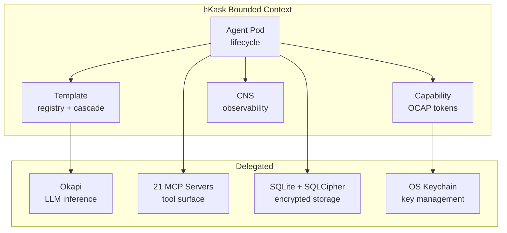
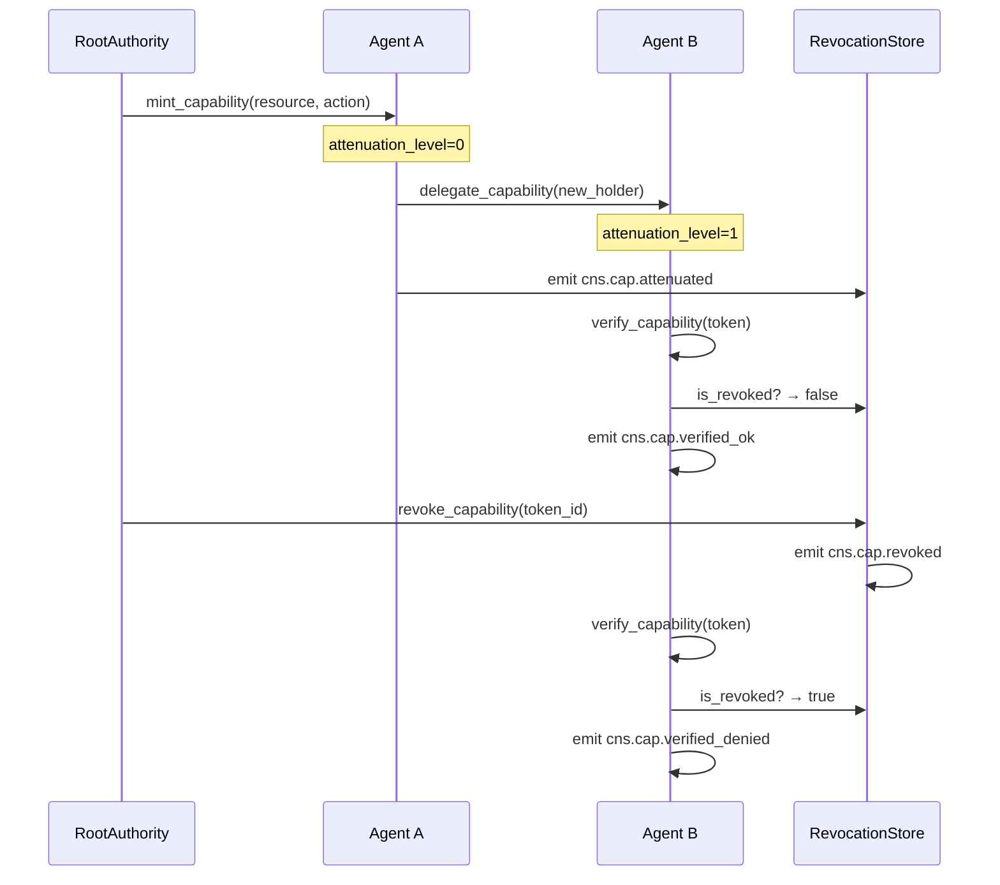
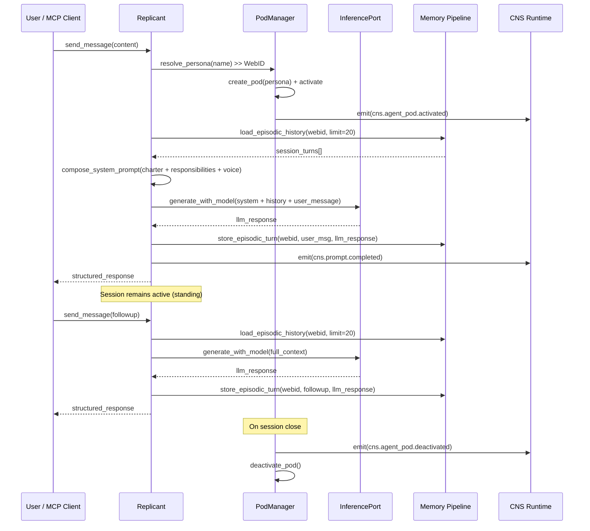
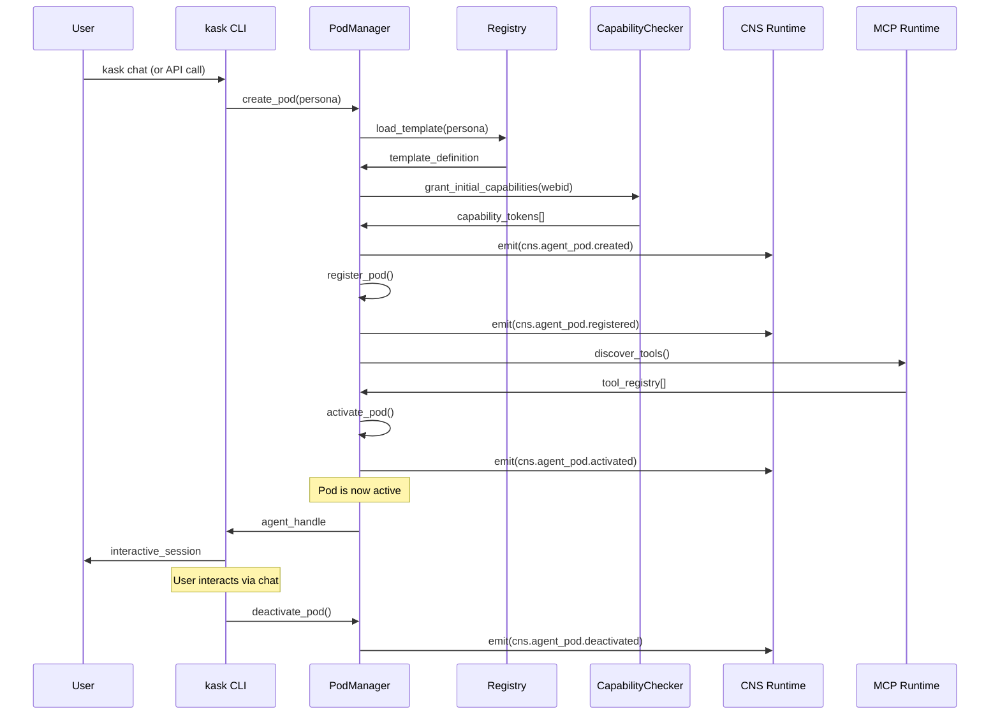
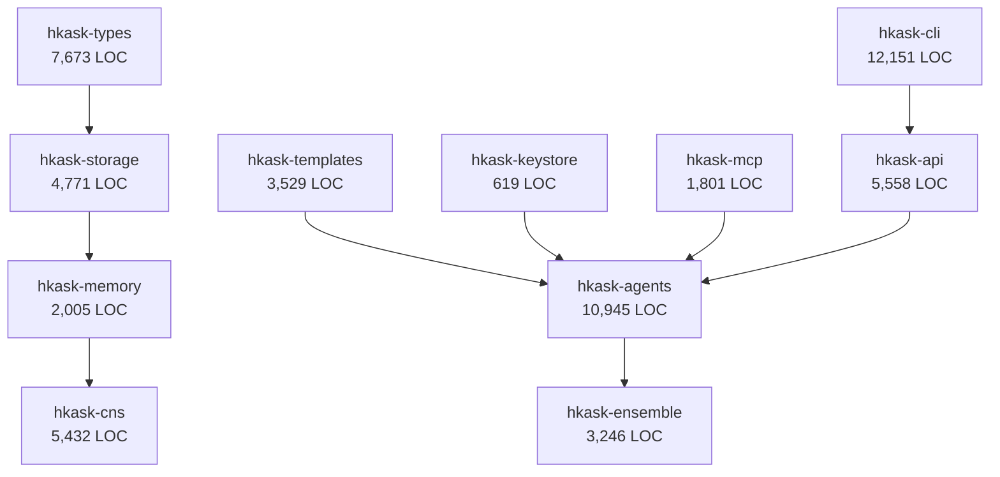

# hKask Domain & Capability Specification

**Purpose:** Authoritative specification for the hKask bounded context, domain ontology, agent taxonomy, capability model, and tool surface. This document is the single source of truth for DDMVSS categories **Domain** and **Capability**.

**Related:** [`interface-and-composition.md`](interface-and-composition.md), [`trust-security-observability.md`](trust-security-observability.md), [`persistence-and-lifecycle.md`](persistence-and-lifecycle.md), [`PRINCIPLES.md`](PRINCIPLES.md), [`magna-carta.md`](magna-carta.md)

**Verification:** `cargo check --workspace && cargo test -p hkask-types && cargo test -p hkask-agents`

---

## 1. Bounded Context

hKask is a **minimal agent-native container platform** — the unit of composition for sovereign agentic AI tooling.[^evans-ddd]

**In scope:**
- Agent lifecycle — creation, activation, delegation, deactivation of bots and replicants in pods
- Capability management — granting, attenuating, revoking, and verifying OCAP tokens
- Template-driven composition — registry-based template selection, rendering, and cascade
- Cybernetic observability — CNS span emission, variety counting, algedonic alerting

**Delegated (out of scope):**
- LLM inference → Okapi (external service)
External service integration → 21 MCP servers (tool surface) + AllostericGate in `hkask-cns::allosteric`
- Storage encryption → SQLCipher (library dependency)
- Key management → OS keychain (platform service)



<!-- DIAGRAM_ALIGNMENT
id: DIAG-DC-001
verified_date: 2026-06-07
verified_against: crates/hkask-agents/src/pod/mod.rs:83; crates/hkask-types/src/capability/mod.rs:66; Cargo.toml workspace members
status: VERIFIED
-->

[^evans-ddd]: Evans, E. (2003). *Domain-Driven Design: Tackling Complexity in the Heart of Software*. Addison-Wesley. Bounded Context pattern.

---

## 2. Five Anchor Capabilities

hKask is built on five non-negotiable anchor capabilities:[^wiener-cybernetics]

| # | Anchor | Implementation | DDMVSS Category |
|---|--------|---------------|-----------------|
| 1 | **Agent Enablement** | Bots + Replicants in pods with WebID, ACP | Domain |
| 2 | **Essential Tools** | 21 MCP servers + Okapi + AllostericGate in CNS | Capability |
| 3 | **User Sovereignty** | OCAP, SQLCipher, private/public gating | Trust |
| 4 | **CNS** | `cns.*` spans, variety counters, algedonic alerts | Observability |
| 5 | **Composition** | Unified registry with `template_type` discriminator | Composition |

[^wiener-cybernetics]: Wiener, N. (1948). *Cybernetics: Or Control and Communication in the Animal and the Machine*. MIT Press.

---

## 3. Domain Entities

### 3.1 Core Entity Types

| Entity | Crate | Location | Description |
|--------|-------|----------|-------------|
| **AgentPod** | `hkask-agents` | `pod/mod.rs:82` | Agent lifecycle container |
| **WebID** | `hkask-types` | `id.rs:164` | Deterministic identity (UUID v5) |
| **DelegationToken** | `hkask-types` | `capability/mod.rs:283` | OCAP delegation token with caveats, HMAC-SHA256 signing |
| **NuEvent** | `hkask-types` | `event.rs:16` | Cybernetic event primitive (observer → span → phase) |
| **Goal** | `hkask-types` | `goal.rs:129` | DDMVSS goal specification |
| **Spec** | `hkask-storage` | `spec_types.rs:199` | Minimum viable specification |
| **AgentDefinition** | `hkask-types` | `agent_def.rs:127` | Declarative agent configuration |
| **TemplateInvocation** | `hkask-types` | `template.rs:95` | Template rendering record |

### 3.2 Agent Taxonomy

| Type | Kind | Purpose | Interaction | Visibility |
|------|------|---------|-------------|------------|
| **Bot** | `AgentKind::Bot` (`agent_def.rs:72`) | Process execution | Machine-to-machine (A2A) | Public/Shared |
| **Replicant** | `AgentKind::Replicant` (`agent_def.rs:72`) | Human assistance | Human-to-agent (H2A) | Episodic=Private, Semantic=Public |
| **Curator** | Singleton replicant | System persona | User's counterpart in `kask chat` | System-wide |

**Constraint:** No escalation primitive between bots and replicants. Algedonic alerts handle severity escalation to human.[^beer-vsm]

[^beer-vsm]: Beer, S. (1972). *Brain of the Firm*. Wiley. Viable System Model.

### 3.3 Curator Persona

The Curator is the canonical replicant — the default human-facing agent identity:[^laurel-theatre]

| Property | Value |
|----------|-------|
| **Name** | Curator |
| **Archetype** | Maintenance Advisory |
| **Voice** | Direct, technical, concise |
| **Forbidden** | Preamble, emoji, conversational filler |
| **Verbosity** | Minimal (1-3 sentences) |
| **hLexicon** | assert, report, declare, acknowledge, instruct, sequence, transform, filter, ground, evaluate, monitor |

**Behavioral constraints** (enforced at runtime):[^norman-design]
- NEVER starts with "Great", "Certainly", "Okay", "Sure"
- NEVER uses emojis
- NEVER includes preamble or postamble
- ALWAYS answers directly with technical precision
- ALWAYS stops after task completion

[^laurel-theatre]: Laurel, B. (1991). *Computers as Theatre*. Addison-Wesley.
[^norman-design]: Norman, D. A. (2013). *The Design of Everyday Things* (Revised ed.). Basic Books. Affordances and constraints.

### 3.4 ν-Event Primitive (NuEvent)

The `NuEvent` struct is the fundamental observability primitive:

| Field | Type | Purpose |
|-------|------|---------|
| `id` | `EventID` | Unique event identifier |
| `timestamp` | `DateTime<Utc>` | Timestamp of event |
| `observer_webid` | `WebID` | Emitting agent identity |
| `span` | `SpanCategory` enum | Typed namespace (16 canonical + 5 hierarchical) |
| `phase` | `Phase` enum | Sense / Compute / Compare / Act |
| `observation` | `Value` | Observed state |
| `regulation` | `Option<Value>` | Regulatory action taken |
| `outcome` | `Option<Value>` | Outcome of regulation |
| `recursion_depth` | `u8` | Recursion depth counter |
| `parent_event` | `Option<EventID>` | Parent event for chaining |
| `visibility` | `String` | Data visibility classification ("private" by default) |

**Span namespaces** — the 21 canonical `cns.*` namespaces are defined in [`PRINCIPLES.md` §1.4](PRINCIPLES.md#14-cybernetic-nervous-system-cns) (authoritative source) and in `hkask-types::event::CANONICAL_NAMESPACES`. The table below shows only the spans most relevant to ν-event construction; see the authoritative registry for the full list.

| Variant | Namespace | Covers |
|---------|-----------|--------|
| `Tool` | `cns.tool.*` | Tool governance, invocation |
| `Prompt` | `cns.prompt.*` | Template render, validate, outcome |
| `Inference` | `cns.inference.*` | Inference governance (GovernedTool, energy budget) |
| `AgentPod` | `cns.agent_pod.*` | Pod lifecycle, delegation |
| `Connector` | `cns.connector.*` | External I/O (LLM, embeddings) |
| `Pipeline` | `cns.pipeline.*` | Memory pipeline operations |
| `Gas` | `cns.gas.*` | Gas/energy budget tracking |
| `Review` | `cns.review.*` | Review queue operations |
| `Template` | `cns.template.*` | Template lifecycle |
| `Curation` | `cns.curation.*` | Curation operations |
| `Variety` | `cns.variety.*` | Variety counter tracking |
| `KillZone` | `cns.killzone.*` | User sovereignty kill-zone events |
| `Sovereignty` | `cns.sovereignty.*` | User sovereignty enforcement |
| `Goal` | `cns.goal.*` | Goal lifecycle operations |
| `Spec` | `cns.spec.*` | DDMVSS specification operations |

---

## 4. Agent Pod Lifecycle

### 4.1 State Machine

The pod lifecycle is a linear progression (`crates/hkask-agents/src/pod/types.rs:15`):

```mermaid
stateDiagram-v2
    [*] --> Populated: AgentPod::new()
    Populated --> Registered: register()
    Registered --> Activated: activate()
    Activated --> Deactivated: deactivate()
    Deactivated --> [*]
```

**Terminal state:** `Deactivated` admits no further transitions.

<!-- DIAGRAM_ALIGNMENT
id: DIAG-DC-002
verified_date: 2026-06-07
verified_against: crates/hkask-agents/src/pod/types.rs (PodLifecycleState enum)
status: VERIFIED
-->

### 4.2 Pod Composition

`AgentPod` (`crates/hkask-agents/src/pod/mod.rs:82`):

| Component | Type | Purpose |
|-----------|------|---------|
| Identity | `AgentPersona` | WebID + agent type + charter |
| Capability | `DelegationToken` | Primary OCAP delegation token |
| Templates | `TemplateCrate` | Bundled templates |
| State | `PodLifecycleState` | Populated → Registered → Activated → Deactivated |
| Sovereignty | `SovereigntyChecker` | User data boundary enforcement |

**Implementation:** `crates/hkask-agents/src/pod/mod.rs:82` (`AgentPod`), `pod/manager.rs` (`PodManager`), `pod/types.rs:15` (`PodLifecycleState`)

### 4.3 Lifecycle Methods

| Method | Transition | CNS Span |
|--------|-----------|----------|
| `AgentPod::new()` | Instantiate from persona | — |
| `AgentPod::register()` | Populated → Registered | `cns.agent_pod.registered` |
| `AgentPod::activate()` | Registered → Activated | `cns.agent_pod.activated` |
| `AgentPod::deactivate()` | Activated → Deactivated | `cns.agent_pod.deactivated` |
| `PodManager::create_pod()` | Create pod from persona YAML | `cns.agent_pod.created` |

---

## 5. Capability Model

### 5.1 Single Capability Primitive

All access control uses `DelegationToken` (`crates/hkask-types/src/capability/mod.rs:283`; backward-compatible alias `CapabilityToken` at line 66):[^miller-ocap]

| Property | Implementation |
|----------|---------------|
| **Signing** | HMAC-SHA256 with `subtle::ConstantTimeEq` |
| **Scoping** | Resource + action pairs (`DelegationResource`, `DelegationAction`) |
| **Caveats** | Expiration, operation, template, visibility (`Caveat` at `capability/mod.rs:240`) |
| **Attenuation** | Chains with max depth (default: 7, compile-time const `SYSTEM_MAX_ATTENUATION`) |
| **Revocation** | Persistent set via `ocap:revoke` MCP tool (`mcp-servers/hkask-mcp-ocap/src/main.rs`) |
| **Secure memory** | Arc-wrapped, `Zeroizing` on drop |

**Supporting types:**

| Type | Location | Purpose |
|------|----------|---------|
| `DelegationToken` | `capability/mod.rs:283` | Core OCAP delegation token with self-verification |
| `DelegationTokenBuilder` | `capability/mod.rs:326` | Builder with caveats, attenuation, context nonce |
| `DelegationResource` | `capability/mod.rs:175` | Resource enum (Tool, Template, Registry) |
| `DelegationAction` | `capability/mod.rs:203` | Action enum (Read, Write, Execute) |
| `Caveat` | `capability/mod.rs:240` | Expiration, operation, template, visibility restrictions |
| `OcapServer` (revocation set) | `mcp-servers/hkask-mcp-ocap/src/main.rs` | Persistent capability revocation |

[^miller-ocap]: Miller, M. S. (2006). *Robust Composition: Towards a Unified Approach to Access Control and Concurrency Control*. Johns Hopkins University.

### 5.2 Capability Lifecycle



<!-- DIAGRAM_ALIGNMENT
id: DIAG-DC-003
verified_date: 2026-06-07
verified_against: crates/hkask-types/src/capability/mod.rs; crates/hkask-agents/src/pod/mod.rs
status: VERIFIED
-->

### 5.3 Capability Matching: Two-Path Verification

The OCAP capability system has two matching paths for verifying tool invocation authority:

1. **Exact-match (legacy):** `DelegationToken.is_valid_for(Resource, resource_id, Action)` — the `resource_id` is the exact tool name (e.g., `cns_health`). Used by ad-hoc invocation tokens.

2. **Domain-match:** `capabilities_match(token_cap, required_cap)` — the `resource_id` is the domain namespace (e.g., `cns`). Used by agent capability tokens which declare domain-level authority.

**Action hierarchy:** `Execute ≥ Write ≥ Read`. This is enforced by `DelegationAction::permits_write()` and `permits_read()`.

The hierarchy is used in two places:
- `GovernedTool::verify_capability_domain()` — determines whether a token authorizes tool invocation (authority)
- `EnsembleChat::intersection_tools()` — uses domain matching only, not action hierarchy (visibility)

**Visibility vs. authority distinction:** The intersection determines **visibility** (which tools appear in the shared context), while `GovernedTool` enforces **authority** (whether invocation is permitted). A participant with `tool:cns:read` will see CNS tools in the intersection but cannot invoke them (read ≱ execute).

**Domain-to-capability conversion:** When loading standing session participants, bare domain strings (e.g., `"cns"`) from YAML are converted to proper capability specs (`"tool:cns:execute"`) so that `CapabilitySpec::parse()` can process them correctly.

### 5.4 Capability Grant Table

| Operation | Resource | Action | Interface | Attenuatable? |
|-----------|----------|--------|-----------|---------------|
| Invoke MCP tool | `tool:{server}:{name}` | Execute | MCP, CLI, API | Yes |
| Render template | `template:{id}` | Execute | MCP, CLI, API | Yes |
| Create agent pod | `pod:*` | Write | CLI, API | No (root only) |
| Activate pod | `pod:{id}` | Execute | CLI, API | Yes |
| Delegate capability | `capability:{id}` | Execute | MCP, CLI | Yes (always) |
| Register template | `template:*` | Write | CLI, API | No (root only) |
| Query CNS | `cns:*` | Read | CLI, API | Yes |
| Capture goal | `spec:{id}` | Write | MCP, CLI, API | Yes |
| Curate artifact | `spec:{id}` | Execute | MCP, CLI, API | Yes |
| Validate spec graph | `spec:*` | Execute | MCP, CLI, API | Yes |
| Manage sovereignty | `sovereignty:*` | Execute | CLI | No (user only) |
| Manage ensemble | `ensemble:*` | Execute | CLI, API | Yes |

**POLA enforcement:** Every operation requires presenting a `Capability` with matching `(resource, action)`. No ambient authority.

---

## 6. MCP Tool Surface

### 6.1 Server Inventory

21 MCP servers provide the tool surface (allosteric regulation via `AllostericGate` in `hkask-cns::allosteric`), each gated through `GovernedTool` (`crates/hkask-cns/src/governed_tool.rs:74`):

| MCP Server | Crate | LOC | Status | Loop | Domain |
|-----------|-------|-----|--------|------|--------|
| inference | `hkask-mcp-inference` | 328 | ✅ Complete | L1 (Inference) | Okapi LLM |
| condenser | `hkask-mcp-condenser` | 866 | ✅ Complete | L2 (Episodic) | Context condensation (reranking and compression of the active conversation window) |
| web | `hkask-mcp-web` | 3,185 | ✅ Complete | L4 (Communication) | Web search with SSRF protection |
| ocap | `hkask-mcp-ocap` | 315 | ✅ Complete | L6 (Cybernetics) | Capability management |
| keystore | `hkask-mcp-keystore` | 497 | ✅ Complete | L6 (Cybernetics) | OS keychain secret management |
| cns | `hkask-mcp-cns` | 401 | ✅ Complete | L6 (Cybernetics) | Observability |
| git | `hkask-mcp-git` | 308 | ✅ Complete | L4 (Communication) | Git CAS operations |
| registry | `hkask-mcp-registry` | 294 | ✅ Complete | L1↔L5 (bridge) | Template registry |
| spec | `hkask-mcp-spec` | 853 | ✅ Complete | L5 (Curation) | DDMVSS spec tools (8 tools) |
| goal | `hkask-mcp-goal` | 287 | ✅ Complete | L5 (Curation) | Goal coordination (OCAP-gated, CNS-observed) |
| github | `hkask-mcp-github` | 451 | ✅ Complete | L4 (Communication) | GitHub API integration |
| fmp | `hkask-mcp-fmp` | 367 | ✅ Complete | L4 (Communication) | Financial data (FMP) |
| telnyx | `hkask-mcp-telnyx` | 240 | ✅ Complete | L4 (Communication) | SMS/voice communications |
| fal | `hkask-mcp-fal` | 414 | ✅ Complete | L4 (Communication) | Media generation (FAL) |
| rss-reader | `hkask-mcp-rss-reader` | 1,432 | ✅ Complete | L2 (Episodic) | RSS feed management |
| ensemble | `hkask-mcp-ensemble` | 391 | ✅ Complete | L4 (Communication) | Multi-agent chat coordination |
| episodic | `hkask-mcp-episodic` | 219 | ✅ Complete | L2 (Episodic) | Episodic memory (private, perspective-bound) |
| semantic | `hkask-mcp-semantic` | 437 | ✅ Complete | L2b (Semantic) | Semantic memory (public, shared) |
| replicant | `hkask-mcp-replicant` | 815 | ✅ Complete | L5 (Curation) | Replicant chat (MCP bridge for external integrations) |
| doc-knowledge | `hkask-mcp-doc-knowledge` | 747 | ✅ Complete | L2 (Episodic) | Document parsing and chunking (HTML/text extraction, multi-tier chunking) |
| markitdown | `hkask-mcp-markitdown` | 724 | ✅ Complete | L1 (Inference) | Document format conversion and OCR (PDF/MD/HTML/TXT + vision OCR fallback) |

**Total:** 21 servers, 123+ tools, 0 stubs (P6 compliance). Allosteric regulation lives in `hkask-cns::allosteric` (`AllostericGate`, `AllostericGateConfig`, MWC state function).

**Audit:** [`docs/status/mcp-tools-inventory.md`](../status/mcp-tools-inventory.md)

### 6.2 `hkask-mcp-spec` DDMVSS Tools

8 tools for specification authoring and curation:

| Tool | Description | hLexicon Terms |
|------|-------------|----------------|
| `spec/goal/capture` | Capture a goal as a binding requirement | specify, require, elicit |
| `spec/goal/decompose` | Decompose into sub-goals (max depth 7) | decompose, sequence |
| `spec/require/bind` | Bind OCAP boundaries to a goal | constrain, require |
| `spec/curate/evaluate` | Evaluate spec for collection coherence | curate, evaluate |
| `spec/curate/reconcile` | Reconcile tensions between specs | reconcile, compose |
| `spec/curate/cultivate` | Cultivate collection toward coherence | cultivate |
| `spec/graph/query` | Query spec graph by category | recognize, match |
| `spec/graph/validate` | Validate spec graph completeness | evaluate, ground |

**verified-against:** `mcp-servers/hkask-mcp-spec/src/main.rs` (tool_router at lines 112, 163, 236, 303, 366, 467, 522, 583)

### 6.3 `hkask-mcp-replicant` — External Integration Bridge

`hkask-mcp-replicant` is the **external integration bridge** — the only MCP server designed for consumption by external MCP clients (Zed, VS Code, custom toolchains) rather than internal hKask agents. It exposes a replicant persona as an MCP tool, enabling "chat with Jacques" from Zed's Agent Panel.

| Tool | Description | hLexicon Terms |
|------|-------------|----------------|
| `replicant_chat` | Send a message to a replicant and receive an inference response | elicit, respond |
| `replicant_status` | Check replicant registration and identity | recognize, query |
| `replicant_history` | List recent conversation turns in the current session | recognize, recall |

**Architecture:** The server follows the same pod-mediated inference flow as `kask chat` (`crates/hkask-cli/src/commands/chat.rs`), with three follow-up enhancements:

1. Resolve persona name → `WebID` (via `HKASK_AGENT_PERSONA`)
2. Load the full agent definition from registry database or YAML (system prompt richness)
3. Build pod via `PodManagerBuilder` with ACP runtime and capability checker using the same secret derivation chain as the CLI (ACP integration)
4. Create + activate pod with `tool:inference:call` capability
5. Compose rich system prompt from agent definition's charter, responsibilities, rights, and voice/tone
6. Append conversation history from in-memory session state for context continuity
7. Route message through `PodContext::inference_port()` → `generate_with_model()`
8. Record the turn in session history (bounded to 20 turns)
9. Return LLM response as structured JSON

This bridges the gap between Zed's MCP context server model and hKask's ACP/pod-mediated architecture. While other MCP servers expose *infrastructure capabilities* (search, storage, inference), `hkask-mcp-replicant` exposes an *agent persona* for conversation — a fundamentally different interaction pattern.

**verified-against:** `mcp-servers/hkask-mcp-replicant/src/tools.rs` (tool_router)

### 6.4 Standing Session Chat Lifecycle

The standing session chat lifecycle governs how a replicant's conversation session is managed from creation through teardown. This is the core interaction pattern for `kask chat` and the MCP replicant server.



<!-- DIAGRAM_ALIGNMENT
id: DIAG-DC-007
verified_date: 2026-06-07
verified_against: crates/hkask-cli/src/commands/chat.rs; mcp-servers/hkask-mcp-replicant/src/tools.rs
status: VERIFIED
-->

### 6.5 hKask Container Lifecycle

The hKask container lifecycle describes the end-to-end flow from creating an agent container to surfacing results. This is the primary domain interaction pattern.



<!-- DIAGRAM_ALIGNMENT
id: DIAG-DC-008
verified_date: 2026-06-07
verified_against: crates/hkask-cli/src/commands/chat.rs; crates/hkask-agents/src/pod/mod.rs
status: VERIFIED
-->

---

## 7. hLexicon Allocation

The hLexicon grounds all domain vocabulary across three domains:[^austin-speech][^ashby-law]

| Domain | Description | Allocated Terms | Theoretical Basis |
|--------|-------------|----------------|-------------------|
| **WordAct** | Say — communication | 28 terms | Speech Act Theory (Austin, Searle) |
| **FlowDef** | Do — process | 34 terms | Workflow Patterns (van der Aalst) |
| **KnowAct** | Think — cognition | 25 terms | Enactive Cognition (Varela) |

**Total:** 87 term-slots (per the authoritative catalog [`reference/hKask-hLexicon.md`](reference/hKask-hLexicon.md); spec-curation and git-evolution terms are included within the three domain allocations)

**Full vocabulary catalog:** [`reference/hKask-hLexicon.md`](reference/hKask-hLexicon.md)

[^austin-speech]: Austin, J. L. (1962). *How to Do Things with Words*. Oxford University Press.
[^ashby-law]: Ashby, W. R. (1956). *An Introduction to Cybernetics*. Wiley. 7±2 terms per domain (Miller's Law).

---

## 8. Workspace Crate Map

### 8.1 Core Crates (11)

| Crate | LOC | Purpose | Key Types |
|-------|-----|---------|-----------|
| `hkask-types` | 7,673 | ID types, ν-event, hLexicon, specs | `WebID`, `NuEvent`, `Span`, `DelegationToken`, `Goal`, `Spec` |
| `hkask-storage` | 4,771 | SQLite + SQLCipher + sqlite-vec | `Database`, `TripleStore`, `EmbeddingStore`, `GitCas` |
| `hkask-memory` | 2,005 | Semantic/episodic pipelines | Memory consolidation (episodic → semantic) |
| `hkask-cns` | 5,432 | Cybernetic Nervous System | `CnsRuntime`, `AlgedonicManager`, `VarietyCounter` |
| `hkask-templates` | 3,529 | Registry, rendering, execution | `SqliteRegistry`, `ManifestExecutor`, `Registry` |
| `hkask-agents` | 10,945 | Pods, ACP, bot metrics, curation | `AgentPod`, `PodManager`, `ConsentManager` |
| `hkask-ensemble` | 3,246 | Multi-agent chat | Ensemble coordination |
| `hkask-keystore` | 619 | OS keychain, AES-256-GCM | Key derivation, secret storage |
| `hkask-mcp` | 1,801 | MCP runtime, dispatch | `McpRuntime`, `McpServer`, `GovernedTool` |
| `hkask-cli` | 12,151 | CLI commands (`kask` binary) | 25 subcommand groups (chat, template, bot, pod, mcp, cns, sovereignty, goal, registry, git, ensemble, spec, docs, agent, curator, replicant, keystore, models, web-search, bundle, compose, embed-corpus, consolidate, loops, serve) |
| `hkask-api` | 5,558 | HTTP API (utoipa) | 18 route groups (templates, bots, pods, mcp, cns, sovereignty, chat, models, ensemble, soap_infer, acp, spec, curator, git, goal, bundles, episodic, consolidation) |

### 8.2 Dependency Graph



<!-- DIAGRAM_ALIGNMENT
id: DIAG-DC-004
verified_date: 2026-06-07
verified_against: Cargo.toml workspace members; crates/*/Cargo.toml; crates/hkask-cli/src/cli/mod.rs:33; crates/hkask-api/src/lib.rs:636
status: VERIFIED
-->

---

## 9. Anti-Patterns (Excluded)

Explicitly excluded patterns that violate hKask minimal design:[^raymond-unix]

| Anti-Pattern | Rationale |
|--------------|-----------|
| Bot reputation systems | Not MVP |
| Bot swarms / consensus | No swarms per spec |
| Cross-machine sync | Local-first, Git backup |
| Bot marketplace | Not MVP |
| SemVer versioning | Git-only (SHA-based) |
| Separate feedback crate | CNS handles all |
| Escalation primitive | Algedonic alerts only |
| Three separate registries | Unified registry |
| Rust-based template selection | Jinja2/LLM selection |

[^raymond-unix]: Raymond, E. S. (2001). *The Art of Unix Programming*. Addison-Wesley. "When in doubt, cut."

---

## 10. Consolidation Protocol

The Episodic→Semantic consolidation bridge is the **one-way gate** from private experience to shared knowledge. This section specifies the protocol as the authoritative source.

> **Terminology:** In hKask, *context* is **condensed** and *memory* is **consolidated**. These are distinct operations on distinct substrates:
> - **Context condensation** — the condenser server reranks and compresses the active conversation/tool-output window to fit within token budgets. Context is ephemeral and scoped to the current inference cycle.
> - **Memory consolidation** — the consolidation bridge migrates episodic triples (private, agent-scoped) into semantic memory (shared, de-identified). Memory is persistent and spans sessions.

### 10.1 One-Way Invariant

Consolidation is strictly one-directional: Episodic (Loop 2a) → Semantic (Loop 2b). No reverse flow exists or may be implemented. Once a triple enters semantic memory, it can only be deleted (budget enforcement), never moved back to episodic.

### 10.2 Trigger

CurationLoop fires consolidation when `pending_escalations > 0` — i.e., when algedonic alerts from Cybernetics indicate episodic budget pressure. The trigger chain:

```
Algedonic alert → pending escalation → CurationLoop::act() → consolidation.consolidate(token, curator_id, 100)
```

The batch limit is 100 triples per consolidation cycle.

### 10.3 Consent

Consent is **implicit**: by creating a Replicant (the human's agent), the user opts in to consolidation of their episodic triples into shared semantic knowledge. The Curator acts as the user's proxy — it is the human's counterpart in `kask chat`.

For explicit consent (each consolidation requires user approval), the architecture supports a future `SeekMoreEvidence` directive that pauses consolidation until the human confirms. This is not currently implemented; implicit consent is the default.

### 10.4 Authority Chain

```
CuratorHandle → ConsolidationToken → ConsolidationBridge
```

1. `CuratorHandle.issue_consolidation_token()` mints a `ConsolidationToken` — the OCAP proof that the Curator authorized this consolidation
2. `ConsolidationToken` is `pub(crate)` constructible — only `hkask-types` can mint it
3. `ConsolidationPort::consolidate()` requires a `ConsolidationToken` — the bridge will not operate without it
4. The token's issuer is the Curator's WebID — establishing audit provenance

### 10.5 Four-Step Algorithm

For each candidate triple:

| Step | Operation | Effect |
|------|-----------|--------|
| 1 | **Select** | `consolidation_candidates(perspective, limit)` — lowest confidence first, then oldest by `valid_from` |
| 2 | **Strip & inherit** | `perspective: None`, `confidence: inherited from episodic source`, new `TripleID`, `visibility: Shared` |
| 3 | **Store semantic** | `SemanticMemory::store_consolidated()` — bypasses visibility/perspective guards (the bridge handles these upstream) |

### 10.6 Privacy Boundary Crossing

The `perspective` field is the privacy boundary:

| Phase | `perspective` | Meaning |
|-------|-------------|---------|
| Episodic (source) | `Some(WebID)` | First-person private experience |
| Semantic (consolidated) | `None` | Shared knowledge with no personal identity |

Setting `perspective: None` removes the WebID association. This is the **minimum** privacy transformation. For GDPR-style "right to be forgotten" compliance, the architecture supports:

- `SemanticMemory::delete_triple()` — removes a semantic triple outright (budget enforcement)
- Deletion is honest and keeps the store clean
- Full GDPR erasure requires a separate data lifecycle policy (not yet implemented)

### 10.7 Budget Enforcement

- **Semantic budget**: Storage budget is configurable per-loop instance (default 25,000 triples). When triple count exceeds the budget, lowest-confidence semantic triples are **deleted** outright via `SemanticMemory::delete_triple()`. Low-confidence triples that exceed the budget are removed entirely — this keeps the store clean rather than leaving zombie triples with halved confidence.
- **Consolidation trigger**: When semantic triples have confidence at or below the low-confidence threshold (default 0.33 / 33%), the `SemanticLoop` fires a review and deletes them. These triples carry insufficient signal to justify their storage cost. The threshold is configurable per-loop instance, enabling per-user and per-agent customization.
- **Episodic budget**: When episodic storage exceeds budget, the `EpisodicLoop` fires the consolidation bridge to promote lowest-confidence triples to semantic memory, freeing storage.

### 10.8 User-Triggered Consolidation

Users can trigger consolidation manually via CLI, chat, API, or MCP. The operation is a three-phase `ConsolidationService` that combines episodic→semantic promotion with semantic cleanup:

| Phase | Operation | Parameter |
|-------|-----------|----------|
| 1 | **Consolidate** | `limit` — max episodic triples to promote (default: 100) |
| 2 | **Confidence floor** | `confidence_floor` — delete semantic triples at or below this confidence (optional, overrides default 0.33) |
| 3 | **Max triples** | `max_semantic_triples` — enforce a hard cap on semantic triple count (optional) |

**Authorization**: When consolidating a specific agent's memory, the caller must provide their **master passphrase** for verification. The passphrase is verified by deriving `capability_key` via `derive_all_internal_secrets(master_passphrase)` and comparing it against the resolved DB passphrase — matching the same derivation chain used during onboarding (`onboarding.rs` → `store_secrets_in_keychain` → `capability_key` stored as `hkask-db-passphrase`). This prevents unauthorized consolidation of another agent's data while ensuring the verification uses the same identity-proving secret that governs database access.

**Surfaces**:

| Surface | Command | Full consolidation | Semantic cleanup only |
|--------|---------|--------------------|-----------------------|
| CLI | `kask consolidate --agent X --passphrase P --limit N --floor F --max M` | ✓ | ✓ |
| Chat | `/consolidate [run] [LIMIT] [--floor F] [--max M]` | ✓ (via ReplState ConsolidationService) | ✓ |
| API | `POST /api/consolidate` | ✓ | ✓ |
| MCP | `semantic_consolidate` | ✗ (no episodic access) | ✓ |

### 10.9 Failure Semantics

| Failure | Effect |
|---------|--------|
| Semantic store fails | Triple stays in episodic (no harm). `failed_count` incremented. |

Consolidation is **not transactional** — partial consolidation is acceptable because the one-way invariant is preserved either way.

### 10.9 CNS Observability

All consolidation events emit spans to `cns.consolidation`:
- `tracing::info!(target: "cns.consolidation", ...)` for start, completion, and per-triple operations
- `tracing::warn!(target: "cns.consolidation", ...)` for failures

---

## Loop Assignment

This spec's content maps to the [6-loop authority model](loop-architecture.md) as follows:

| Spec Domain | Loop | Rationale |
|------------|------|-----------|
| Agent taxonomy (Bot, Replicant) | Curation (Loop 5) | Agent enablement is a Curation concern — the Curator creates and manages pods |
| Capability model (OCAP, DelegationToken) | Cybernetics (Loop 6) | Capability enforcement is regulatory — Cybernetics governs all capability gates |
| MCP tool surface | Communication (Loop 4) + Inference (Loop 1) | Tool dispatch is Communication; LLM invocation is Inference. Per-server loop assignments: `hkask-mcp-ocap` → Cybernetics (L6), `hkask-mcp-keystore` → Cybernetics (L6), `hkask-mcp-registry` → L1↔L5 (bridge), `hkask-mcp-condenser` → Episodic (L2). See [loop-architecture.md §3.4](loop-architecture.md) for full mapping. |
| hLexicon | Semantic Memory (Loop 2b) | Shared vocabulary is shared knowledge |
| Bounded context | All loops | System boundaries contain all loops as cybernetic containers |

---

## References

[^evans-ddd]: Evans, E. (2003). *Domain-Driven Design*. Addison-Wesley.
[^wiener-cybernetics]: Wiener, N. (1948). *Cybernetics*. MIT Press.
[^beer-vsm]: Beer, S. (1972). *Brain of the Firm*. Wiley.
[^miller-ocap]: Miller, M. S. (2006). *Robust Composition*. Johns Hopkins University.
[^laurel-theatre]: Laurel, B. (1991). *Computers as Theatre*. Addison-Wesley.
[^norman-design]: Norman, D. A. (2013). *The Design of Everyday Things*. Basic Books.
[^austin-speech]: Austin, J. L. (1962). *How to Do Things with Words*. Oxford University Press.
[^ashby-law]: Ashby, W. R. (1956). *An Introduction to Cybernetics*. Wiley.
[^raymond-unix]: Raymond, E. S. (2001). *The Art of Unix Programming*. Addison-Wesley.
