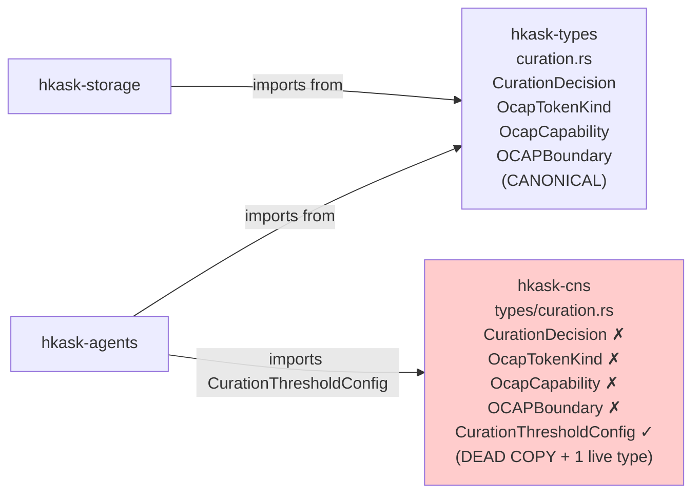
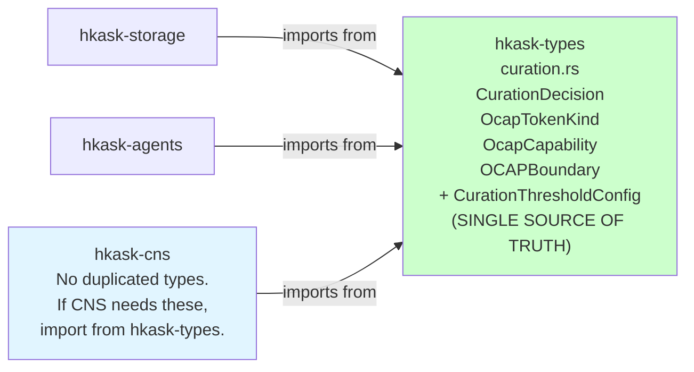
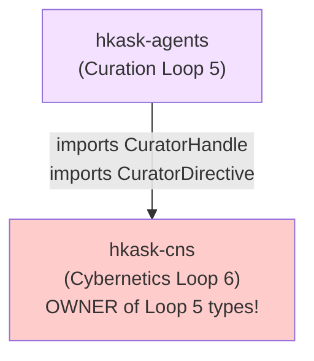
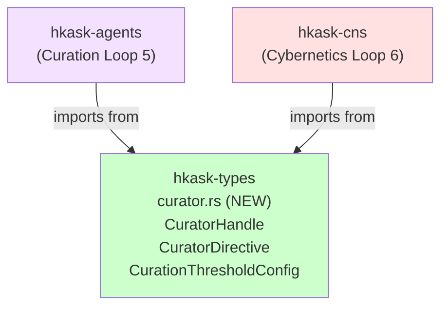
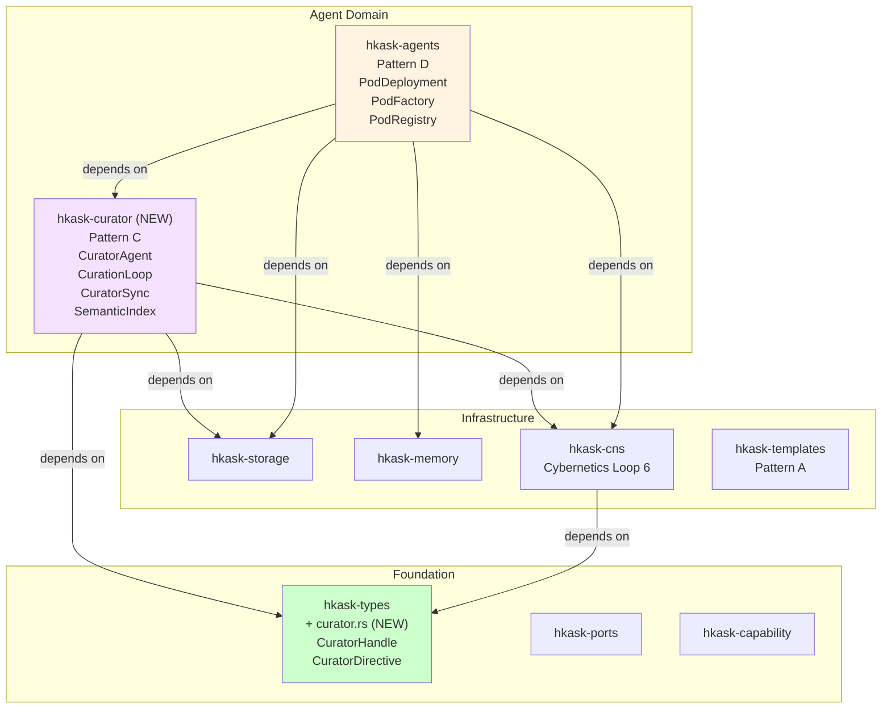

# Addendum A: Architectural Misalignments and Graph Optimizations

**Purpose:** Findings uncovered during the semantic map and ERD analysis that reveal structural misalignments between the declared architecture and the implemented code graph. These are **not** surface-level issues — they affect the dependency direction, crate boundaries, type authority, and deletion-test coherence of the system.

---

## M1: DUPLICATED TYPE DEFINITIONS — P5 Violation (Critical)

### Finding

Four types are defined **identically** in two crates:

| Type | `hkask-types/src/curation.rs` | `hkask-cns/src/types/curation.rs` |
|------|------------------------------|-----------------------------------|
| `CurationDecision` | Defined (L269–306) | Defined (L13–54) — identical |
| `OcapTokenKind` | Defined (L308–326) | Defined (L62–92) — identical |
| `OcapCapability` | Defined (L337–346) | Defined (L94–108) — identical |
| `OCAPBoundary` | Defined (L348–367) | Defined (L110–142) — identical |

These are **different Rust types** in different modules. Code that uses `hkask_types::curation::OcapTokenKind` cannot interoperate with code using `hkask_cns::types::curation::OcapTokenKind`. Adding a variant (e.g., `Federation`) to one copy would be invisible to the other.

### Usage Split — Which Copy Do Consumers Use?

| Consumer | Uses hkask-types copy? | Uses hkask-cns copy? |
|----------|----------------------|---------------------|
| `hkask-storage/src/spec_store.rs` | ✅ `CurationDecision`, `OCAPBoundary` | — |
| `hkask-storage/src/spec_types.rs` | ✅ `CurationDecision`, `OCAPBoundary` | — |
| `hkask-agents/curator_agent/spec_curator.rs` | ✅ `CurationDecision`, `OcapTokenKind`, `OCAPBoundary` | ✅ `CurationThresholdConfig` (NOT the duplicated types) |

**Bottom line:** The `hkask-cns` copy of `CurationDecision`/`OcapTokenKind`/`OcapCapability`/`OCAPBoundary` is **dead code**. Only `CurationThresholdConfig` from that file is used. The hkask-types copy is the canonical one.

### P5 Violation

P5 (Essentialism & Minimalism): "Every artifact must earn existence by reducing total system action." The duplicated types add zero behavior, create confusion about authority, and would silently diverge if one copy were extended. The CNS copy should be deleted.

### Corrected Graph

**Before (broken):**



**After (corrected):**



---

## M2: CURATION TYPES LIVE IN THE WRONG CRATE — Authority DAG Violation (Critical)

### Finding

The declared Authority DAG is:

```
Curation (Loop 5) → Cybernetics (Loop 6) → {Inference, Episodic, Semantic}
```

But in the code:

| Type | Where It Lives | Where It SHOULD Live | Authority Violation |
|------|---------------|---------------------|-------------------|
| `CuratorHandle` | `hkask-cns/src/types/loops/curation.rs` | `hkask-types/src/` or `hkask-agents/src/curator/` | CNS (Loop 6) owns a Loop 5 type. Curation is ABOVE Cybernetics — CNS shouldn't define Curator types. |
| `CuratorDirective` | `hkask-cns/src/types/loops/curation.rs` | `hkask-types/src/` or `hkask-agents/src/curator/` | Same violation. CuratorDirectives flow FROM Curation TO Cybernetics. The sender's message format should not be defined by the receiver. |
| `CurationThresholdConfig` | `hkask-cns/src/types/curation.rs` | `hkask-types/src/curation.rs` | Curation config is about the Curator's thresholds, not CNS thresholds. CNS has its own `SetPoints`. |

### The Inverted Dependency

```rust
// WRONG: hkask-agents imports CuratorHandle from hkask-cns
use hkask_cns::types::loops::CuratorHandle;
use hkask_cns::types::loops::curation::CuratorDirective;

// RIGHT: CuratorHandle and CuratorDirective should live in hkask-types (or hkask-agents),
// and hkask-cns should import them:
// use hkask_types::curator::CuratorHandle;
// use hkask_types::curator::CuratorDirective;
```

### Why This Matters

If `CuratorHandle` and `CuratorDirective` live in `hkask-cns`, then:
1. **Any crate that needs to understand curator directives must depend on CNS**, even if it's a pure curation concern.
2. **CNS owns the interface of its governor** — the regulator defines what its regulator can say. This inverts the cybernetic hierarchy.
3. **Adding a directive variant requires editing CNS code**, even for purely curation-level concerns (e.g., a `FederateWithServer` directive should be a Curation concern, not Cybernetics).

### Corrected Dependency Graph

**Before (broken):**



**After (corrected):**



---

## M3: LOOP NUMBERING INCONSISTENCY — Semantic Grounding Violation (P8)

### Finding

Three different loop numbering schemes exist:

| Source | Loops | Notes |
|--------|-------|-------|
| `hkask-types/src/loops.rs` (`LoopId` enum) | Inference, Memory, Curation, Cybernetics (4 variants) | `Memory` collapses Episodic + Semantic |
| `hkask-cns/src/types/loops/mod.rs` (doc comment) | 1 Inference, 2a Episodic, 2b Semantic, 5 Curation, 6 Cybernetics, 6b Snapshot (6 loops) | Declares "Loop 3 is intentionally absent" |
| `hkask-cns/src/cybernetics_loop.rs` | References "Loop 6" | Uses numbered reference |
| `hkask-agents/src/lib.rs` | Labels curator "Loop 5", pod "Loop 5" | Both labeled Loop 5 — ambiguous |
| `hkask-agents/src/curator/mod.rs` | Labels curator "Loop 5" | Consistent with CNS numbering |

### Specific Inconsistencies

1. **`LoopId::Memory` collapses Episodic (2a) and Semantic (2b).** These have different VSM roles (Coordination/private vs. Coordination/shared), different visibility (Private vs. Public), and different storage. They should be separate `LoopId` variants.

2. **`LoopId` is in `hkask-types` but the Loop trait, Signal, Deviation, LoopAction are in `hkask-cns`.** If `LoopId` is the foundation type, why does the trait that uses it live in a downstream crate?

3. **`LoopId` has no `Snapshot` variant** — the Snapshot loop (6b) exists in `hkask-cns/src/snapshot_loop.rs` but has no identity in the type system.

4. **`hkask-agents/src/lib.rs` labels both `curator` and `pod` as "Loop 5".** The Curator IS Loop 5 (Curation). The pod lifecycle is NOT a loop — it's a state machine that Loop 6 (Cybernetics) monitors via `CnsSpan::AgentPod`.

### Corrected LoopId

```rust
/// Loop identifiers — cardinal VSM correspondence.
/// 6 loops + 1 bridge. No Loop 3 (Control absorbed into Cybernetics).
#[derive(Debug, Clone, Copy, PartialEq, Eq, Hash, PartialOrd, Ord)]
pub enum LoopId {
    Inference,    // Loop 1 — S1 Implementation (agent execution)
    Episodic,     // Loop 2a — S2 Coordination (private memory)
    Semantic,     // Loop 2b — S2 Coordination (shared memory)
    Curation,     // Loop 5 — S4 Intelligence (meta-observer)
    Cybernetics,  // Loop 6 — S3 Control (homeostatic regulation)
    Snapshot,     // Loop 6b — Scheduled CAS snapshots
}
```

### Corrected Module Header for hkask-agents

```rust
//! hKask Agents — Agent Pod Lifecycle and A2A Integration
//!
//! - pub mod curator:       Loop 5  (Curation — pure regulatory)
//! - pub mod curator_agent: Loop 5  (Curation — persona layer)
//! - pub mod pod:           S1     (Agent pod lifecycle — NOT a loop)
//! - pub mod inference_loop:Loop 1 (Inference execution)
```

---

## M4: CURATOR MODULE MISPLACEMENT — Structural Parity Violation

### Finding

The architecture declares four **irreducible patterns** — equal peers:

```
Pattern A: Skills Model     → hkask-templates, hkask-types
Pattern B: CNS Feedback     → hkask-cns
Pattern C: Agentic Mediation → ???
Pattern D: Agent Creation   → hkask-agents
```

But Pattern C is implemented as a **subdirectory** of Pattern D:

```
hkask-agents/src/
├── curator/          ← Pattern C content, nested inside Pattern D's crate
├── curator_agent/    ← Pattern C persona layer, nested inside Pattern D's crate
├── pod/              ← Pattern D content
├── a2a/              ← Loop 6 / access control
└── ...
```

### Structural Consequences

1. **`hkask-agents` is not a deep module** — it contains curator (Pattern C), pod lifecycle (Pattern D), A2A (Loop 6), inference (Loop 1), consent, sovereignty, and prompt analysis. Public surface is ~20 types. The crate is doing too many things.

2. **Curator imports types from CNS that should be in a shared foundation** — `CuratorHandle` and `CuratorDirective` live in CNS because CNS was the "convenient" place to put them when Curator was written. Putting them in `hkask-types` wasn't considered because Curator wasn't envisioned as a separate crate.

3. **Deletion test failure:** If you delete the `curator/` subdirectory from `hkask-agents`, the pod lifecycle, A2A, consent, and sovereignty code still work. The Curator is a separate concern. If you delete `hkask-agents` entirely, Pattern C goes with it — but Pattern C is supposed to be irreducible.

### Recommendation Options

**Option A (Minimal):** Keep Curator in `hkask-agents` but move its types to `hkask-types`. Accept the structural nesting as a pragmatic choice. Low disruption.

**Option B (Moderate):** Extract `hkask-agents/src/curator/` and `hkask-agents/src/curator_agent/` into a new `hkask-curator` crate. `hkask-cns` and `hkask-agents` depend on `hkask-curator`. `CuratorHandle` and `CuratorDirective` move to `hkask-types`. Medium disruption.

**Option C (Fowler/Strangler Fig):** Same as B but also clean-split `hkask-agents` into:
- `hkask-pods` — PodDeployment, PodFactory, PodRegistry, AgentPersona, PodKind
- `hkask-curator` — CuratorAgent, CurationLoop, CuratorSync, SemanticIndex
- `hkask-a2a` — A2ARuntime, A2AAgent, A2AMessage

Higher disruption but restores the four-pattern parity.

### Corrected Crate Dependency Graph (Option B)



---

## M5: `curation.rs` COMMENT IS WRONG — Document vs. Reality Drift

### Finding

`hkask-cns/src/types/curation.rs` line 152–154:

```rust
/// Configurable thresholds for Curation decisions (spec coherence, drift).
///
/// Moved from `hkask-cns` — curation regulates cybernetics, not the other way around.
/// YAML loading remains in `hkask-cns` (requires `serde_yaml_neo`).
```

The comment says "Moved from hkask-cns" — but the file IS in hkask-cns. It was never moved. It should say "Should move to hkask-types (curation regulates cybernetics)" or actually be moved.

---

## M6: 7R7 LISTENER EMITS STRINGLY-TYPED CNS SPANS

### Finding

`hkask-communication/src/listener.rs` emits CNS spans as:

```rust
tracing::info!(target: "cns.communication.message.observed", ...);
tracing::warn!(target: "cns.communication.listener", ...);
```

But the CNS span registry in `FUNCTIONAL_SPECIFICATION.md` §9.1 shows MCP server infra spans are "stringly-typed" by design. The `CnsSpan` enum has no `Communication` or `Listener` variant.

### Is This a Problem?

Maybe not. The CNS span system assigns **typed `CnsSpan` variants** to essential domains and uses **stringly-typed tracing targets** for performative infrastructure (CLI, API, MCP server infra). The 7R7 listener is infrastructure — it's a dumb pipe. Stringly-typed spans are acceptable here.

However, for federation, inter-Curator communication would benefit from typed CNS spans (see federation design §6.4). The 7R7 listener should remain stringly-typed, but new Federation-specific spans should be typed `CnsSpan` variants.

---

## M7: SERVICE LAYER PROLIFERATION — Thin Orchestration or Leaked Domain Logic?

### Finding

`hkask-services` has 15 subcrates. The architecture says "thin orchestration layer, delegates to domain crates." But with 15 subcrates, some may have absorbed domain logic:

| Subcrate | Lines (approx) | Risk |
|----------|---------------|------|
| `hkask-services-core` | Large | Medium — "core" often becomes a dumping ground |
| `hkask-services-kata` | ~27 contracts | Medium — kata engine has real domain logic |
| `hkask-services-kanban` | ~34 contracts | Medium — kanban has state machine logic |
| `hkask-services-backup` | ~39 contracts | Low — backup is genuinely orchestration |
| `hkask-services-context` | ~31 contracts | Low — context wiring is thin |

### Recommendation

Apply the deletion test to each subcrate:
1. Where does the complexity live — in the service subcrate or in the domain crate it orchestrates?
2. If the domain crate has the logic and the service subcrate is thin delegation → keep.
3. If the service subcrate has business logic that the domain crate should own → consolidate.

Since this analysis didn't read every service subcrate, this is flagged as a **hypothesis** — a review item, not a confirmed problem.

---

## M8: `LoopId` IS IN `hkask-types` BUT `Loop` TRAIT IS IN `hkask-cns`

### Finding

```rust
// hkask-types/src/loops.rs — the ID type
pub enum LoopId { Inference, Memory, Curation, Cybernetics }

// hkask-cns/src/types/loops/core.rs — the trait that uses LoopId
pub trait Loop: Send + Sync {
    fn id(&self) -> LoopId;  // import from hkask-types
    async fn sense(&self) -> Vec<Signal>;
    // ...
}

// hkask-cns/src/types/loops/signals.rs — Signal, Deviation
// hkask-cns/src/types/loops/actions.rs — LoopAction, ActionType
// hkask-cns/src/types/loops/curation.rs — CuratorHandle, CuratorDirective
// hkask-cns/src/types/loops/channels.rs — CurationInput, RuntimeAlert
```

The `Loop` trait, `Signal`, `Deviation`, `LoopAction`, `ActionType` — all loop infrastructure — live in `hkask-cns`. But `LoopId` alone lives in `hkask-types`. The comment in `hkask-types/src/loops.rs` says:

> "Minimal loop types that must stay in hkask-types to avoid circular deps (hkask-ports uses LoopId and cannot depend on hkask-cns)."

This is correct — `hkask-ports` needs `LoopId` but shouldn't depend on CNS. But the solution creates a split: foundation types in one crate, the full loop abstraction in another. This is a **necessary design tension**, not a bug. The minimal split is correct.

### Recommendation

Keep `LoopId` in `hkask-types` (minimum needed by ports). Move `CuratorHandle` and `CuratorDirective` OUT of `hkask-cns/src/types/loops/` into `hkask-types/src/curator.rs` — these are NOT loop infrastructure; they're Curation types that happen to be used by loop channels.

---

## Summary: Priority of Fixes

| # | Issue | Severity | Effort | P-Violation |
|---|-------|----------|--------|-------------|
| M1 | Duplicated CurationDecision/OcapTokenKind/OcapCapability/OCAPBoundary | **Critical** | Low (delete CNS copy) | P5 (Essentialism) |
| M2 | CuratorHandle/CuratorDirective in wrong crate | **Critical** | Medium (move to hkask-types, update imports) | Authority DAG |
| M3 | LoopId missing Episodic/Semantic/Snapshot variants | **High** | Medium (requires updating ~20 match arms) | P8 (Semantic Grounding) |
| M4 | Curator nested inside hkask-agents | **High** | High (new crate, refactor) | Pattern parity |
| M5 | Wrong comment in curation.rs | **Low** | Trivial | None |
| M6 | 7R7 stringly-typed spans | **Low** | None required | By design |
| M7 | Service layer proliferation audit | **Medium** | Audit only | P5 (potential) |
| M8 | LoopId/trait split across crates | **Low** | None required | Necessary design tension |

---

## References

| Document | Section |
|----------|---------|
| `PRINCIPLES.md` | P5 (Essentialism), P8 (Semantic Grounding), Authority DAG |
| `hKask-architecture-master.md` | Four Essential Patterns: Pattern C vs. Pattern D |
| `MDS.md` | §1 Domain Ontology — entity crate assignments |
| `crates/hkask-types/src/curation.rs` | L267–367 — canonical OCAP curation types |
| `crates/hkask-cns/src/types/curation.rs` | L1–170 — duplicated types + CurationThresholdConfig |
| `crates/hkask-cns/src/types/loops/curation.rs` | L1–179 — CuratorHandle, CuratorDirective (misplaced) |
| `crates/hkask-cns/src/types/loops/mod.rs` | L1–44 — loop numbering (canonical scheme vs. LoopId enum) |
| `crates/hkask-agents/src/lib.rs` | L1–63 — "Loop 5" label on pod (should be S1, not a loop) |
