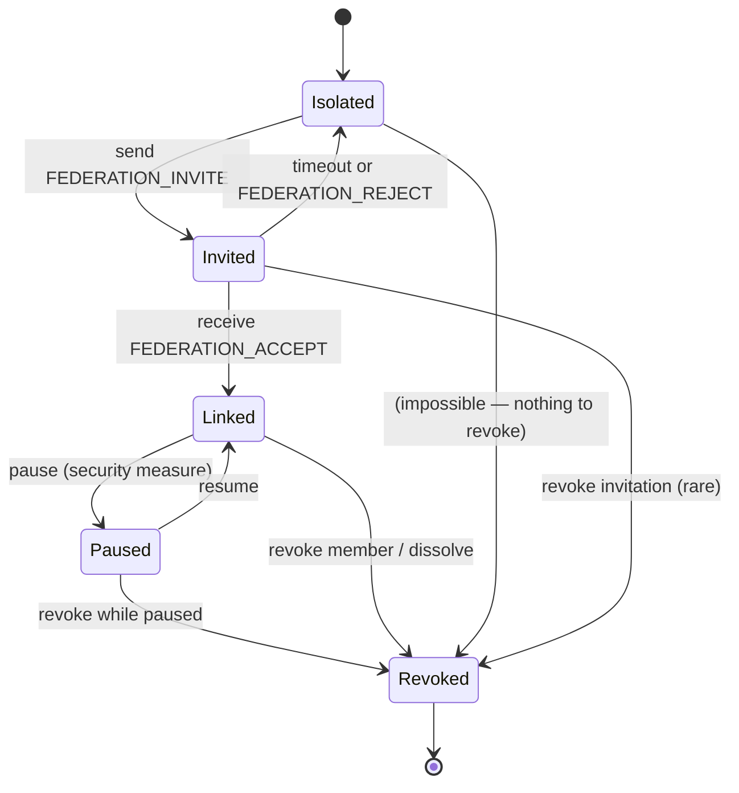
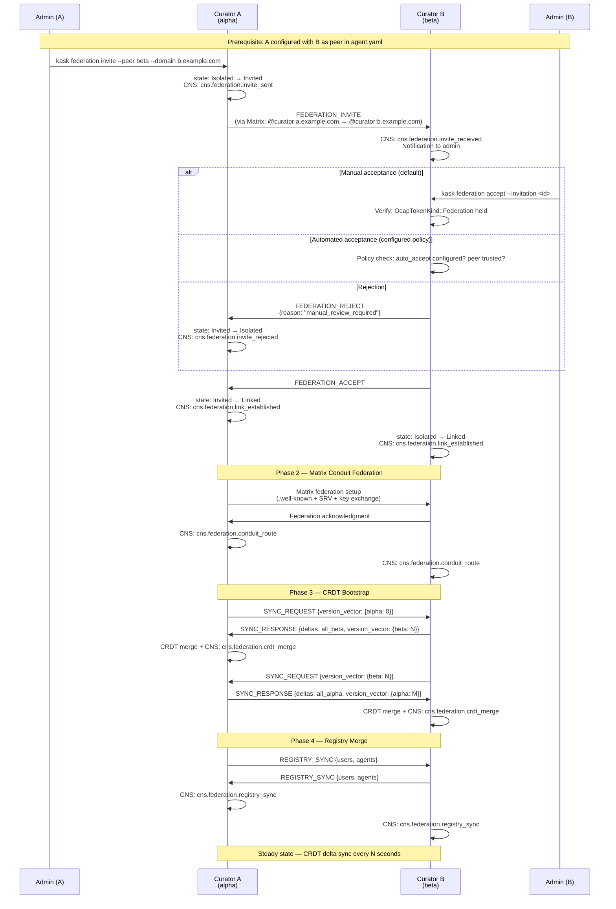

# Addendum C: Federation Link Lifecycle & Invitation/Revocation Protocol

**Purpose:** Specifies the complete lifecycle of a `FederationLink` between two CuratorPods: how curators discover and invite each other, how invitations are accepted or rejected, how links are paused for debugging, how members are revoked, and how an entire federation dissolves. Replaces the sketch in FEDERATION_DESIGN.md §6.5 with a fully-specified state machine.

---

## 1. FederationLink State Machine

A `FederationLink` is a **pairwise, directional** relationship between two CuratorPods. Each side maintains its own link state. Under normal operation, both sides are in the same state; during transitions and failures, they may temporarily diverge.

### 1.1 States

| State | Meaning | Data Preserved | Sync Active | Reversible |
|-------|---------|---------------|-------------|------------|
| `Isolated` | No link exists. No invitation sent or received. | Nothing | No | N/A |
| `Invited` | Invitation sent, awaiting response. | Invitation metadata | No | Yes (timeout → Isolated) |
| `Linked` | Link established. CRDT sync active. Conduit federated. | Version vectors, cursors, triples | Yes | Yes (→ Paused) |
| `Paused` | Sync suspended temporarily (debugging, security investigation). | Version vectors, cursors preserved | No | Yes (→ Linked) |
| `Revoked` | Link permanently terminated. | Audit trail preserved. CRDT data tombstoned. | No | No (terminal) |

### 1.2 State Transition Diagram



### 1.3 Per-Side State Tracking

Each CuratorPod tracks links in a `FederationLink` struct:

```rust
/// Link state between this Curator and a peer.
pub enum LinkState {
    /// No invitation sent. The peer may be configured but not contacted.
    Isolated,
    /// Invitation sent, awaiting response.
    Invited {
        invited_at: DateTime<Utc>,
        /// Configurable timeout for invitation expiry.
        expires_at: DateTime<Utc>,
    },
    /// Link established and active.
    Linked {
        established_at: DateTime<Utc>,
    },
    /// Sync temporarily suspended. Version vectors preserved.
    Paused {
        /// When the pause was initiated.
        paused_at: DateTime<Utc>,
        /// Why (audit trail — e.g., "investigating anomalous sync pattern").
        reason: String,
        /// Who initiated the pause (local or remote).
        initiated_by: ReplicaId,
    },
    /// Link permanently terminated.
    Revoked {
        revoked_at: DateTime<Utc>,
        /// Why (audit trail).
        reason: String,
        /// Who initiated the revocation.
        initiated_by: ReplicaId,
        /// Whether this was a single-member revocation or part of a dissolve.
        scope: RevocationScope,
    },
}

pub enum RevocationScope {
    /// Single member was revoked; other members continue.
    SingleMember,
    /// The entire federation was dissolved.
    FederationDissolved,
    /// Voluntary departure (this member chose to leave).
    VoluntaryDeparture,
}
```

---

## 2. Invitation Protocol

### 2.1 Prerequisites

Before an invitation can be sent:

1. **Both servers must be running hKask with federation enabled.**
2. **The inviting Curator must know the target's Matrix ID** (`@curator:<target-domain>`).
3. **The inviting Curator must hold `OcapTokenKind::Federation`.**
4. **The target server must be configured to accept invitations** (by default, invitations are rejected — P2: affirmative consent).

### 2.2 Invitation Payload

The invitation is a structured JSON message sent over the existing Matrix transport. It carries everything the target Curator needs to establish the link:

```json
{
  "type": "federation.invite",
  "version": "0.31.0",
  "invitation_id": "uuid-v4",
  "inviter": {
    "replica_id": "alpha",
    "server_domain": "a.example.com",
    "server_name": "hKask Alpha",
    "matrix_domain": "matrix.a.example.com",
    "curator_matrix_id": "@curator:a.example.com"
  },
  "tls": {
    "certificate_fingerprint": "sha256:...",
    "mutual_tls_required": true
  },
  "federation_config": {
    "sync_interval_secs": 5,
    "max_delta_size": 10000,
    "crdt_type": "or_set"
  },
  "invited_at": "2026-06-22T12:00:00Z",
  "expires_at": "2026-06-23T12:00:00Z",
  "message": "Optional human-readable invitation note"
}
```

### 2.3 Acceptance Payload

```json
{
  "type": "federation.accept",
  "version": "0.31.0",
  "invitation_id": "uuid-v4",
  "accepter": {
    "replica_id": "beta",
    "server_domain": "b.example.com",
    "server_name": "hKask Beta",
    "matrix_domain": "matrix.b.example.com",
    "curator_matrix_id": "@curator:b.example.com"
  },
  "tls": {
    "certificate_fingerprint": "sha256:...",
    "mutual_tls_required": true
  },
  "accepted_at": "2026-06-22T12:05:00Z"
}
```

### 2.4 Rejection Payload

```json
{
  "type": "federation.reject",
  "version": "0.31.0",
  "invitation_id": "uuid-v4",
  "rejected_at": "2026-06-22T12:03:00Z",
  "reason": "manual_review_required",
  "message": "Please contact admin@b.example.com to discuss federation"
}
```

### 2.5 Protocol Sequence



### 2.6 Invitation Expiry

Invitations have a configurable TTL (default: 24 hours). If the invited Curator has not accepted or rejected within the TTL:

1. The inviting Curator transitions `Invited → Isolated`.
2. CNS: `cns.federation.invite_expired`.
3. The expired invitation is logged for audit.
4. A new invitation can be sent (new `invitation_id`).

---

## 3. Pause Protocol (Security Measure)

Pausing is a **unilateral defensive operation**. It does not require peer consent. It is used when:

- A peer exhibits anomalous sync behavior (e.g., unexpected triple deltas)
- Debugging a CRDT convergence issue
- Investigating a potential security incident
- Maintenance on the local server that shouldn't trigger peer alerts

### 3.1 Pause Initiation

```
Curator A                          Curator B
   │                                  │
   │ kask federation pause            │
   │   --peer beta                    │
   │                                  │
   │ state: Linked → Paused           │
   │ CNS: cns.federation.link_paused  │
   │                                  │
   │─── LINK_PAUSE ──────────────────►│
   │    {reason: "investigating       │
   │     anomalous sync pattern",     │
   │     paused_by: "alpha"}          │
   │                                  │
   │                                  │ state: Linked → Paused
   │                                  │ CNS: cns.federation.link_paused
   │                                  │ (peer_initiated)
```

### 3.2 What Happens During Pause

- **CRDT sync stops.** No `SYNC_REQUEST`/`SYNC_RESPONSE` messages are exchanged.
- **Version vectors are preserved.** When resumed, sync picks up from where it left off.
- **CNS monitoring continues.** The paused state is observable.
- **Matrix conduit stays open.** Messaging between agents on both servers continues. Only curator sync is paused.
- **No data is lost.** Triples published during the pause are queued locally and synced on resume.

### 3.3 Resume

```
Curator A                          Curator B
   │                                  │
   │ kask federation resume           │
   │   --peer beta                    │
   │                                  │
   │ state: Paused → Linked           │
   │ CNS: cns.federation.link_resumed │
   │                                  │
   │─── LINK_RESUME ─────────────────►│
   │    {resumed_by: "alpha"}         │
   │                                  │
   │                                  │ state: Paused → Linked
   │                                  │ CNS: cns.federation.link_resumed
   │                                  │
   │─── SYNC_REQUEST ────────────────►│ (picks up from preserved VV)
   │◄── SYNC_RESPONSE ────────────────│
   │   (includes deltas published     │
   │    during the pause period)      │
```

### 3.4 Pause Safety Properties

| Property | Guarantee |
|----------|-----------|
| No data loss | Version vectors preserved. Queued deltas delivered on resume. |
| No false alerts | Peer knows the pause is intentional, not a failure. No `CURATOR_SYNC_DEGRADED` alert. |
| Audit trail | Pause reason, initiator, and timestamps are recorded in CNS ν-events. |
| Revocable | Either side can revoke a paused link (transition directly to `Revoked`). |
| Timeout safety | If a link stays paused beyond a configurable threshold (default: 24h), CNS escalates to Curator: "Link paused for extended period — review." |

---

## 4. Revocation Protocol

Revocation is **permanent**. A revoked link cannot be resumed — it can only be replaced by a new invitation and link establishment (which creates a new `FederationLink` with fresh version vectors).

### 4.1 Three Revocation Operations

| Operation | Scope | Initiator | Effect |
|-----------|-------|-----------|--------|
| **Revoke member** | Single peer | Any federation member | Target is kicked out. All members revoke their links to the target. Federation continues. |
| **Leave federation** | Self | Departing member | All links from the departing member to others are revoked. Federation continues without them. |
| **Dissolve federation** | All members | Any member (triggers cascade) | All members revoke all links. Federation ceases to exist. |

### 4.2 Revoke Single Member

```
Curator A (initiator)             Curator B (target)          Curator C (other member)
       │                                │                            │
       │ kask federation revoke         │                            │
       │   --peer beta                  │                            │
       │   --reason "security breach"   │                            │
       │                                │                            │
       │ state: Linked → Revoked        │                            │
       │ CNS: cns.federation.member_    │                            │
       │      revoked                   │                            │
       │                                │                            │
       │─── MEMBERSHIP_REVOKED ────────►│                            │
       │    {revoked_by: "alpha",       │                            │
       │     reason: "security breach"} │                            │
       │                                │ state: Linked → Revoked    │
       │                                │ CNS: member_revoked        │
       │                                │                            │
       │─── MEMBER_REVOKED_GOSSIP ──────────────────────────────────►│
       │    {revoked: "beta",                                        │
       │     revoked_by: "alpha",                                    │
       │     reason: "security breach"}                              │
       │                                                             │
       │                                                             │ state: Linked → Revoked
       │                                                             │ CNS: member_revoked
       │                                                             │ (for link to beta)
```

### 4.3 Voluntary Departure (Leave)

```json
{
  "type": "federation.leave",
  "version": "0.31.0",
  "leaver": {
    "replica_id": "beta",
    "server_domain": "b.example.com"
  },
  "left_at": "2026-06-22T18:00:00Z",
  "reason": "server_decommissioned",
  "message": "Shutting down hKask Beta. Thanks for the federation!"
}
```

All peers transition their link to `Revoked` with `scope: VoluntaryDeparture`.

### 4.4 Dissolve Federation

Dissolution is a convenience operation — it issues `RevokeMember` for ALL peers simultaneously. It is not a new primitive; it's batched revocation.

```rust
// CuratorDirective variant:
DissolveFederation {
    /// Why the federation is being dissolved.
    reason: String,
}
```

When received, the Curator:
1. Sets all non-Revoked links to `Revoked` with `scope: FederationDissolved`.
2. Sends `FEDERATION_GOODBYE` to all peers.
3. Emits CNS: `cns.federation.dissolved` (once per dissolution, not per link).
4. Does NOT forward dissolution to other members (each member handles their own links).

**Important:** Dissolution is local. If Curator A dissolves, A's links are revoked. B and C may still be federated with each other. A true "global dissolution" requires all members to independently dissolve. There is no central coordinator to enforce this — the federation is decentralized.

### 4.5 What Happens to Data After Revocation

| Data | Treatment |
|------|-----------|
| CRDT state | Revoked member's triples are **tombstoned** (OR-Set remove) but causal history is preserved. You cannot erase what the revoked member contributed — you can only mark it as removed. |
| SemanticIndex | Revoked member's triples are removed from the live index. Historical data remains in ν-event store for audit. |
| User/agent registry | Revoked member's users and agents are removed from the merged registry. Local users on the revoked server are unaffected (they still exist on their home server). |
| Matrix conduit | Federation route is torn down. Agents can no longer message across the revoked link. |
| CNS audit trail | Complete history of the link (established, paused, resumed, revoked) is preserved in ν-events. |

---

## 5. CuratorDirective Extensions for Federation

```rust
/// Federation directives added to CuratorDirective enum.
/// These live in hkask_types::curator per the M2 consolidation.
pub enum CuratorDirective {
    // ... existing variants (CalibrateThreshold, UpdateCapabilities, etc.) ...

    // ── Federation ──

    /// Invite a remote server to join the federation.
    /// Requires OcapTokenKind::Federation.
    InviteToFederation {
        /// Target's configured replica ID (from agent.yaml federation.peers).
        peer_replica: String,
        /// Target's server domain (e.g., "b.example.com").
        peer_server_domain: String,
        /// Target's Matrix homeserver domain.
        peer_matrix_domain: String,
        /// Target Curator's Matrix ID (@curator:b.example.com).
        peer_curator_matrix_id: String,
        /// Optional human-readable note included in the invitation.
        message: Option<String>,
    },

    /// Accept a pending federation invitation.
    /// Requires OcapTokenKind::Federation + P2 consent.
    AcceptFederationInvite {
        /// The invitation_id from the FEDERATION_INVITE message.
        invitation_id: String,
    },

    /// Reject a pending federation invitation.
    RejectFederationInvite {
        invitation_id: String,
        /// Why (audit trail).
        reason: Option<String>,
    },

    /// Pause federation sync with a peer (security measure).
    /// Unilateral — does not require peer consent.
    /// Version vectors preserved; sync resumes on ResumeFederationLink.
    PauseFederationLink {
        peer_replica: String,
        /// Why (required for audit trail).
        reason: String,
    },

    /// Resume federation sync with a paused peer.
    ResumeFederationLink {
        peer_replica: String,
    },

    /// Permanently revoke a single member from the federation.
    /// Gossip propagates to other members so they also revoke the target.
    RevokeFederationMember {
        peer_replica: String,
        /// Why (required for audit trail).
        reason: String,
    },

    /// Voluntarily leave the federation.
    /// All outgoing links are revoked. Other members continue without this server.
    LeaveFederation {
        /// Why (required for audit trail).
        reason: String,
    },

    /// Dissolve all federation links (batched revocation).
    /// Every non-Revoked link is transitioned to Revoked.
    /// FEDERATION_GOODBYE sent to all peers.
    DissolveFederation {
        /// Why (required for audit trail).
        reason: String,
    },
}
```

---

## 6. CNS Span Extensions for Federation Lifecycle

```rust
pub enum CnsSpan {
    // ... existing variants ...

    // ── Federation Lifecycle ──
    /// Invitation sent to a remote Curator.
    FederationInviteSent,
    /// Invitation received from a remote Curator.
    FederationInviteReceived,
    /// Invitation accepted; link establishment begins.
    FederationInviteAccepted,
    /// Invitation rejected by the target Curator.
    FederationInviteRejected,
    /// Invitation expired without response.
    FederationInviteExpired,
    /// Two Curators establish a CRDT-backed federation link.
    FederationLinkEstablished,
    /// Federation link temporarily paused (security measure).
    FederationLinkPaused,
    /// Federation link resumed from pause.
    FederationLinkResumed,
    /// Federation link permanently terminated (single member or self).
    FederationLinkRevoked,
    /// Single member revoked by another member (gossip propagated).
    FederationMemberRevoked,
    /// Member voluntarily left the federation.
    FederationMemberLeft,
    /// Entire federation dissolved.
    FederationDissolved,

    // ── Federation Data Sync ──
    FederationCrdtMerge,
    FederationCrdtConflict,
    FederationRegistrySync,
    FederationArtifactSync,
    FederationConduitRoute,
    FederationConduitRouteLost,
}
```

---

## 7. Federation Configuration Extension (agent.yaml)

```yaml
# CuratorPod's agent.yaml — extended federation section
agent:
  name: "Curator"
  type: replicant

federation:
  enabled: true
  replica_id: "alpha"
  server_domain: "a.example.com"
  matrix_domain: "matrix.a.example.com"

  # ── Invitation policy ──
  invitations:
    # How invitations from unknown peers are handled.
    # "manual" (default): admin must explicitly approve each invitation (P2).
    # "auto_accept_configured": auto-accept from peers listed below.
    # "deny_all": reject all invitations.
    policy: "manual"
    # TTL for pending invitations (default: 24h).
    ttl_hours: 24

  # ── Peers ──
  peers:
    - replica_id: "beta"
      server_domain: "b.example.com"
      matrix_domain: "matrix.b.example.com"
      curator_matrix_id: "@curator:b.example.com"
      # If invitations.policy is "auto_accept_configured", this peer's
      # invitations are auto-accepted.
      auto_accept: false

  # ── Sync configuration ──
  sync:
    interval_secs: 5
    crdt_type: "or_set"
    max_delta_size: 10000

  # ── Pause safety ──
  pause:
    # CNS escalates if a link stays paused beyond this (default: 24h).
    max_pause_duration_hours: 24

  # ── Security ──
  security:
    require_mutual_tls: true
    capability_required: "federation:sync"
    consent_required: true
```

---

## 8. CLI Commands

```bash
# ── Invitation ──
kask federation invite --peer beta --domain b.example.com --message "Let's federate!"
kask federation accept --invitation <uuid>
kask federation reject --invitation <uuid> --reason "manual_review_required"

# ── Status ──
kask federation status                    # List all links and their states
kask federation status --peer beta        # Detailed status of link to beta
kask federation invitations               # List pending invitations (sent and received)

# ── Pause/Resume (security measure) ──
kask federation pause --peer beta --reason "Investigating anomalous sync pattern"
kask federation resume --peer beta

# ── Revocation ──
kask federation revoke --peer beta --reason "Security breach detected"
kask federation leave --reason "Server decommissioned"
kask federation dissolve --reason "Project concluded"  # Requires confirmation

# ── CNS ──
kask cns federation health                # Variety deficit for federation domain
kask cns federation links                 # CNS spans for all federation links
```

---

## 9. Security Properties Summary

| Property | Mechanism | Principle |
|----------|-----------|-----------|
| Invitations require consent | `policy: manual` by default. Admin must explicitly accept. | P2 (Affirmative Consent) |
| Pause is unilateral | Either side can pause without peer consent. Notification sent for observability. | Defensive security measure |
| Revocation is unilateral | Any member can revoke any other. Gossip propagates. | Enforcement, not consensus |
| Dissolution is local | Each Curator dissolves their own links. No global coordinator. | Decentralized by design |
| CRDT data is immutable | Revoked member's contributions are tombstoned, not erased. Audit trail preserved. | P8 (Semantic Grounding) |
| All operations are OCAP-gated | `OcapTokenKind::Federation` required for all federation directives. | P4 (Clear Boundaries) |
| Episodic memory never crosses boundary | CRDT syncs only from `SemanticMemory` (Public triples). | P1, P11.1 |
| Skill registries never shared | Each server's `SqliteRegistry` stays local. | P5.1, P3 |
| CNS observes everything | 18 federation CNS span variants covering every state transition. | P9 (Homeostatic Self-Regulation) |

---

## 10. References

| Document | Section |
|----------|---------|
| `FEDERATION_DESIGN.md` | §6 — Original federation model (amended by this addendum) |
| `ADDENDUM_MISALIGNMENTS.md` | M2 — CuratorDirective location |
| `ADDENDUM_REAUDIT.md` | M13 — Federation plan consistency verification |
| `crates/hkask-types/src/curator.rs` | CuratorDirective enum (extend with federation variants) |
| `crates/hkask-types/src/curation.rs` | OcapTokenKind enum (add Federation) |
| `crates/hkask-types/src/cns.rs` | CnsSpan enum (extend with 18 federation spans) |
