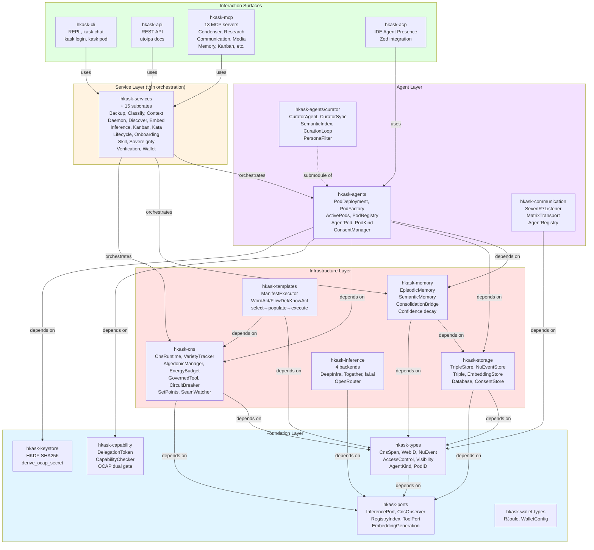
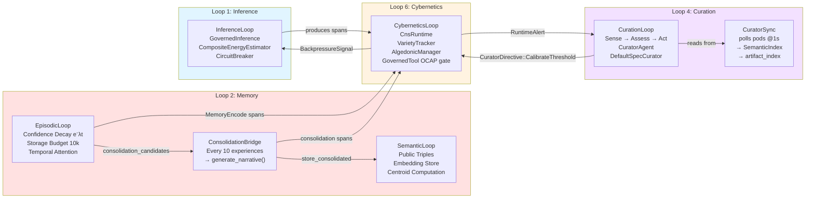
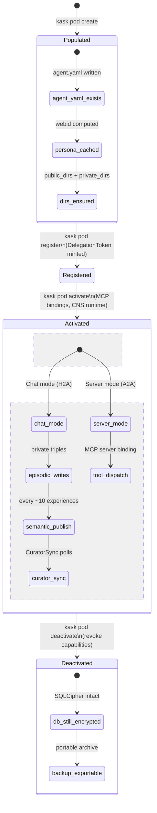
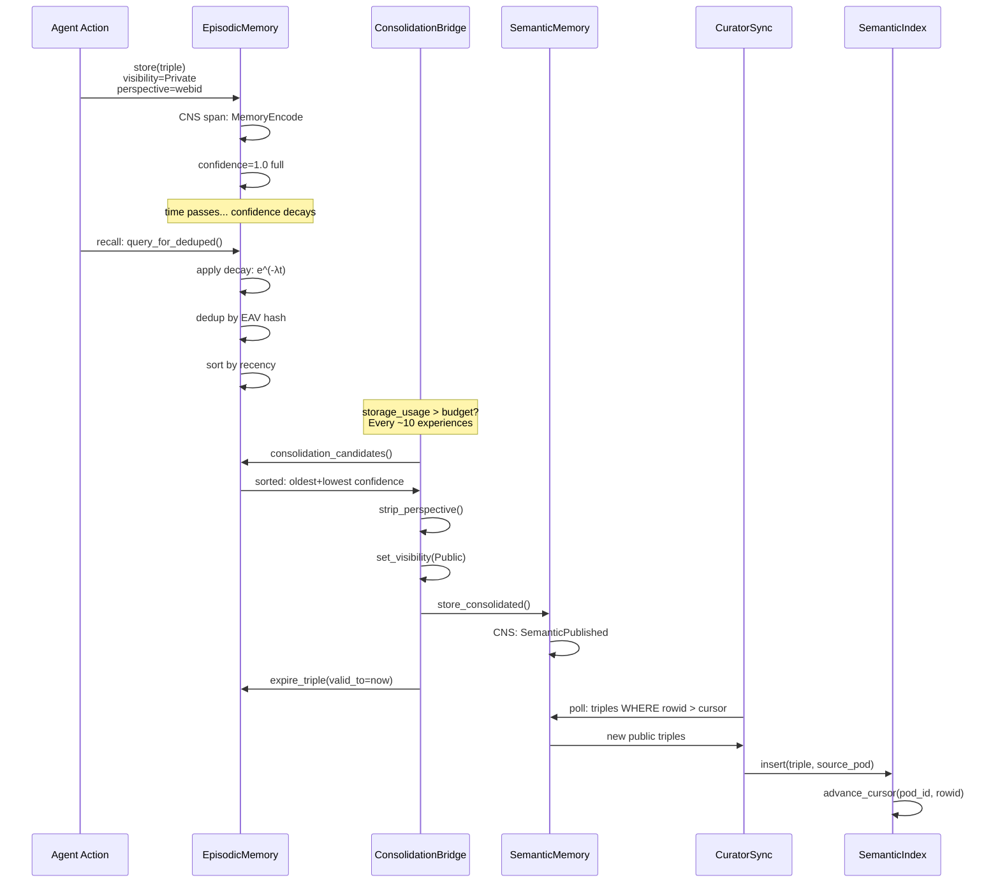
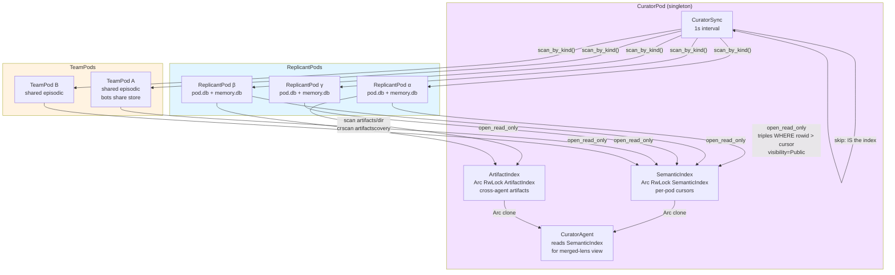
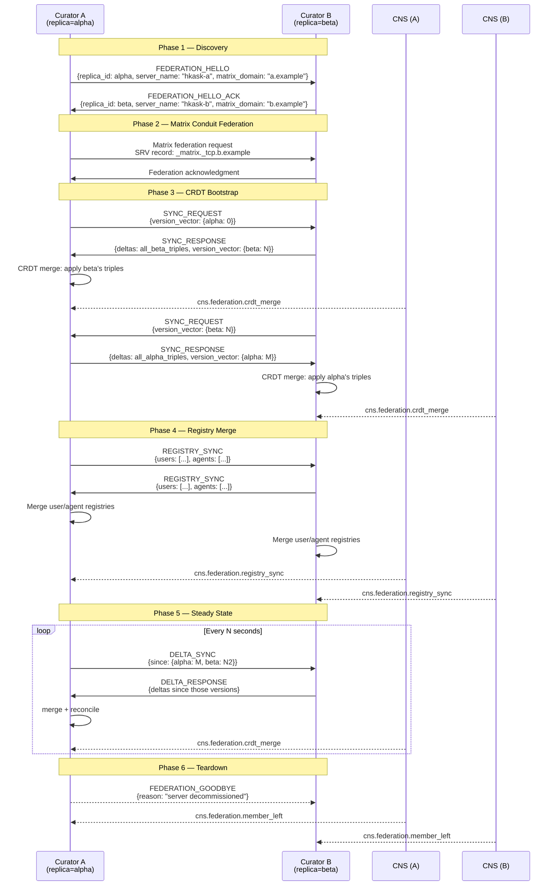

# hKask Federation — Semantic Map, Entity-Relationship Models, and Curator-CRDT Design

**Purpose:** (1) Semantic map of hKask code per pragmatic-semantics and pragmatic-cybernetics skills. (2) Lean RDF graphs and Mermaid ERDs of the domain. (3) Idiomatic code graph optimization. (4) Federation design: Curator-linked hKask servers with CRDT-synced public memory, separate skill registries, and federated Matrix conduits.

---

## 1. Semantic Map — IS/OUGHT Classification

Classifying every statement in the hKask domain model according to the two-axis pragmatic-semantics framework (Ontological Mode × Epistemic Mode → Constraint Force).

### 1.1 Core Domain Entities — Ontological Classification

| Entity | Ontology (IS/OUGHT) | Epistemic Mode | Constraint Force | Provenance | Holds |
|--------|---------------------|----------------|------------------|------------|-------|
| `AgentPod` runtime container | IS | Declarative | Evidence | Directly Stated — `PodDeployment` struct + `PerPodStorage` | Per-pod SQLCipher file at `{data_dir}/agents/{sanitized_name}/pod.db` |
| `Triple` (EAV + bitemporal + confidence) | IS | Declarative | Evidence | Directly Stated — `hkask-storage::triples` | Backed by SQLite. Entity-Attribute-Value + `TemporalBounds` + `Confidence` + `AccessControl` |
| `CnsRuntime` variety tracker | IS | Probabilistic | Evidence | Directly Stated — `VarietyTracker::deficit()` | 60s window. Counts distinct keys. `deficit = expected − observed`. Subjunctive flavor. |
| `DelegationToken` + `CapabilityChecker` | OUGHT | Declarative | Prohibition | Inherited — P4 from Magna Carta | OCAP dual gate model. No ambient authority. No `sudo`. |
| `Visibility::Private` default | OUGHT | Declarative | Prohibition | Inherited — P1, P11, P11.1 from Magna Carta | `AccessControl::new()` defaults Private. Sovereignty fails closed. |
| `CuratorAgent` singleton | OUGHT | Declarative | Guardrail | Inherited — VSM S4 Intelligence. Multiple Curators → conflicting assessments. | Exactly one per system. |
| `NuEvent` store as canonical source | OUGHT | Declarative | Guardrail | Inherited — P8 Semantic Grounding. ν-events win over semantic memory. | `NuEventStore` + `SqliteSpecStore` |
| `EnergyBudget` with cap + replenish | OUGHT | Declarative | Guardrail | Directly Stated — `DEFAULT_ENERGY_ALERT_THRESHOLD` | Least action as infrastructure. |
| `PodKind` tiers (Curator/Team/Replicant) | IS | Declarative | Evidence | Directly Stated — `PodDeployment.pod_kind` | Three-tier: CuratorPod → TeamPods → ReplicantPods |
| `SemanticIndex` merged view | IS | Declarative | Evidence | Directly Stated — `CuratorSync.index` | CuratorPod's own SQLCipher. Per-pod cursors. |
| `CuratorSync` polling loop | IS | Probabilistic | Evidence | Directly Stated — `CuratorSync::run()` | 1s interval. 10 consecutive failures → CNS degraded alert. |
| Episodic → Semantic consolidation | OUGHT | Probabilistic | Guideline | Inherited — P11 consent-governed. | `EpisodicMemory::consolidation_candidates()` → `ConsolidationBridge` |
| Confidence decay (e⁻λt) | IS | Probabilistic | Evidence | Directly Stated — `Confidence::decay()` + `DEFAULT_DECAY_RATE` | 90-day half-life. λ = ln(2)/(90×86400) ≈ 8.913×10⁻⁸ |
| Skill registry as single source of truth | OUGHT | Declarative | Prohibition | Inherited — P5.1. Registry crate is authoritative. SKILL.md is generated companion. | `manifest.yaml` + `*.j2` → cascade dispatch |
| WebID-grounded identity | OUGHT | Declarative | Prohibition | Inherited — P12. Every action carries `owner` WebID. | `WebID::from_persona()` + `derive_ocap_secret(webid)` |
| `AccessControl::with_visibility` perspective-lock | OUGHT | Declarative | Guardrail | Directly Stated — F-SYN-004. Panics on privacy-laundering flip. | `with_visibility(Public)` on episodic → panic |

### 1.2 Provenance Trace — Key Data Flows

```
Directly Stated (ν-event):
  MCP tool dispatch → CNS span → NuEvent → SQLite ν-event store
  SpanKind::ToolInvoked | ToolCompleted | ToolError

Implicit (derived from pattern):
  VarietyTracker::deficit() → derived from HashMap<String, u64>.len()
  OutcomeTracker → derived from success/failure counters per domain

Inherited (from CNS baseline):
  CnsHealth::overall_deficit → inherited from VarietyTracker rolling 60s window
  Staleness warning at window boundary

Relation-Derived (from feedback loop):
  SpecDriftAlert → Conant-Ashby violation → model-reality divergence
  CURATOR_SYNC_DEGRADED → 10 consecutive tick failures → CNS error alert

LLM-Assessed (Curator opinion):
  CurationDecision::Merge | Discard | Revise | Defer → always flagged as assessment
  SpecCurationRecord → coherence score with confidence
```

### 1.3 Constraint Hierarchy Ranking

| # | Constraint | Type | relaxable? | Enforced By |
|---|-----------|------|------------|-------------|
| 1 | P1: Episodic memory never exposed without consent | Prohibition | Never | `EpisodicMemory::store()` rejects `Visibility::Public` |
| 2 | P4: No ambient authority, no `sudo` | Prohibition | Never | `GovernedTool` + `DelegationToken` + `CapabilityChecker` |
| 3 | P11.1: SQLCipher file IS private sphere boundary | Prohibition | Never | `PerPodStorage` per-pod file. No cross-pod DB handles. |
| 4 | P5.1: Registry = single source of truth for skills | Prohibition | Never | `SqliteRegistry` indexes registry crate only |
| 5 | P2: Default deny, explicit consent required | Prohibition | Never | `ConsentManager` + `Visibility::Private` default |
| 6 | Variety deficit > 100 → Critical algedonic alert | Guardrail | Only via user consent | `AlgedonicManager::check()` → `RuntimeAlert` |
| 7 | Curator singleton invariant | Guardrail | Only via architecture change | `ActivePods` enforces one CuratorPod |
| 8 | F-SYN-004: No perspective-locked visibility flip | Guardrail | Only via `without_perspective()` | `AccessControl::with_visibility()` panics on privacy-launder |
| 9 | Energy budget cap → depletion signal | Guardrail | Only via budget recalibration | `EnergyBudgetManager` + `AgentEnergyStatus` |
| 10 | CURATOR_SYNC_DEGRADED after 10 failures | Guardrail | Only via user consent | `CuratorSync::run()` counter |
| 11 | Prefer local models for sovereign data | Guideline | Yes, with reason | Inference provider selection |
| 12 | Three-tier pod startup order (Curator→Team→Replicant) | Guideline | Yes, with reason | `PodRegistry::scan_by_kind()` |

---

## 2. Cybernetic VSM Mapping and Feedback Loop Analysis

### 2.1 Viable System Model (Beer) → hKask Mapping

```
┌──────────────────────────────────────────────────────────────┐
│                        S5 — POLICY                           │
│  Magna Carta P1–P4 + OCAP constraints + Refusal Posture      │
│  Enforces: P1+2 (Sovereignty+Consent), P4 (OCAP)            │
│  Crates: hkask-capability, hkask-keystore                   │
├──────────────────────────────────────────────────────────────┤
│                        S4 — INTELLIGENCE                     │
│  CuratorAgent (singleton) + LLM inference + Metacognition    │
│  Assesses: CNS alerts, spec drift, variety deficits          │
│  Crates: hkask-agents/curator, hkask-agents/curator_agent   │
├──────────────────────────────────────────────────────────────┤
│                     S3 — CONTROL                             │
│  CNS VarietyTracker + AlgedonicManager + SetPoints           │
│  Compares: variety vs expected, energy vs budget             │
│  Crates: hkask-cns/runtime, hkask-cns/algedonic              │
├──────────────┬───────────────────────────┬───────────────────┤
│ S3* — AUDIT  │    S2 — COORDINATION      │  S1 — OPERATIONS  │
│ kask sover-  │  Communication Loop       │  Agent pods +     │
│ eignty verify│  Backpressure signals     │  MCP tool dispatch│
│ Ad-hoc CNS   │  Queue depth monitoring   │  Per-pod MCP      │
│ queries      │  Arc<AtomicU64> counter   │  server bindings  │
│              │  Crates: hkask-communication,│  Crates: hkask-   │
│              │  hkask-cns                │  agents/pod       │
└──────────────┴───────────────────────────┴───────────────────┘
```

### 2.2 Feedback Loop Analysis — Five Properties

**Loop: CNS → Curator → CNS (Regulator loop)**

| Property | Value | Assessment |
|----------|-------|------------|
| **Polarity** | Negative (stabilizing) | ✅ Curator adjusts thresholds downward to reduce alert fatigue |
| **Delay** | ~1s (CNS tick) + LLM inference latency | ⚠️ Acceptable. Algedonic alerts fire immediately; Curator assessment lags by inference time. |
| **Gain** | SetPoints: 50 Warning, 100 Critical | ✅ Moderate. Dampener cooldown (120s) prevents alert storms. |
| **Closure** | `CuratorDirective::CalibrateThreshold` → `mpsc` → `CyberneticsLoop` → `CnsRuntime::calibrate_threshold()` | ✅ Closed. Direct channel, not polling. |
| **Fidelity** | VarietyTracker counts distinct tool names only | ⚠️ Blind spot: outcome quality tracked separately by OutcomeTracker. A system calling 47 tools that all fail shows variety=47 but is broken. |

**Loop: Semantic Sync (CuratorSync → Pods → SemanticIndex)**

| Property | Value | Assessment |
|----------|-------|------------|
| **Polarity** | Negative (stabilizing) | ✅ Converges to completeness. Cursor advances monotonically. |
| **Delay** | 1s polling interval | ✅ Fast enough for cross-pod knowledge sharing. |
| **Gain** | Each tick queries `triples WHERE rowid > cursor` | ✅ Low. Incremental delta, not full scan. |
| **Closure** | Write to SemanticIndex → PodContext reads from same Arc | ✅ Closed. Shared `Arc<RwLock<SemanticIndex>>`. |
| **Fidelity** | Depends on source pod's `episodic → semantic` bridge accuracy | ⚠️ Public triples only. Blind to private. Correct by design. |

### 2.3 Variety Engineering — Ashby's Law Assessment

| Domain | System Variety | Regulator Variety | Deficit | Status |
|--------|---------------|-------------------|---------|--------|
| Tool dispatch | ~170 CNS spans across 13 MCP subsystems | `cns.tool.*` → 28 canonical namespaces | 0 | ✅ Covered |
| Inference | 4 backends, 18 CNS spans | `cns.inference` → `CnsSpan::Inference` | 0 | ✅ Covered |
| Keystore | 25 CNS spans | `cns.keystore` → `CnsSpan::Keystore` | 0 | ✅ Covered |
| Pod lifecycle | 5 pod states (Populated→Registered→Activated→Deactivated) | `cns.agent_pod.*` → `CnsSpan::AgentPod` | 0 | ✅ Covered |
| Federation (NEW) | Cross-server CRDT merges, conduit routing, curator interop | 0 CNS spans registered | ALL | ❌ Uncovered |
| Memory consolidation | Episodic → Semantic bridge, confidence decay | `cns.memory.*` → `CnsSpan::MemoryEncode` | 0 | ✅ Covered |

**Federation Gap:** The federation domain introduces new failure modes (CRDT divergence, conduit unreachability, curator conflict) with zero CNS span coverage. See §5.4 for proposed `cns.federation.*` spans.

---

## 3. Domain Ontology → RDF Triple Graphs

### 3.1 Core Domain Entities as RDF Triples

Using hKask's own `Triple` model (entity-attribute-value with bitemporal bounds, confidence, and access control):

```
# ── Agent Pods ──
<AgentPod:{pod_id}>       hkask:hasKind          <PodKind:{Replicant|Team|Curator}> .
<AgentPod:{pod_id}>       hkask:hasWebID         <WebID:{webid}> .
<AgentPod:{pod_id}>       hkask:hasStorage       <PerPodStorage:{db_path}> .
<AgentPod:{pod_id}>       hkask:hasCnsRuntime    <PerPodCnsRuntime:{pod_id}> .
<AgentPod:{pod_id}>       hkask:hasToolBinding   <PerPodToolBinding:{pod_id}> .
<AgentPod:{pod_id}>       hkask:hasLifecycleState <PodLifecycleState:{Populated|Registered|Activated|Deactivated}> .
<AgentPod:{pod_id}>       hkask:hasMode           <AgentMode:{Chat|Server}> .

# ── Memory Architecture ──
<EpisodicMemory:{pod_id}>   hkask:stores            <Triple:{id}> .
<Triple:{id}>               hkask:hasVisibility      <Visibility:{Private}> .
<EpisodicMemory:{pod_id}>   hkask:hasDecayRate       "8.913e-8" .
<EpisodicMemory:{pod_id}>   hkask:hasBudget          "10000" .
<SemanticMemory:{pod_id}>   hkask:stores            <Triple:{id}> .
<SemanticMemory:{pod_id}>   hkask:hasEmbeddingStore <EmbeddingStore> .
<ConsolidationBridge:{}>    hkask:bridges            <EpisodicMemory> .
<ConsolidationBridge:{}>    hkask:bridges            <SemanticMemory> .

# ── Triple Structure ──
<Triple:{id}>               rdf:subject              "{entity}" .
<Triple:{id}>               rdf:predicate            "{attribute}" .
<Triple:{id}>               rdf:object               "{value}" .
<Triple:{id}>               hkask:confidence         <Confidence:{0.0..1.0}> .
<Triple:{id}>               hkask:validFrom          "{ISO8601}" .
<Triple:{id}>               hkask:validTo            "{ISO8601}|null" .
<Triple:{id}>               hkask:access             <AccessControl:{perspective,visibility,owner}> .

# ── CNS — Cybernetic Nervous System ──
<CnsRuntime:{pod_id}>       hkask:tracks            <VarietyTracker> .
<VarietyTracker:{}>         hkask:countsDistinctIn   "{60s_window}" .
<AlgedonicManager:{}>       hkask:emitsAlertWhen     "deficit > {threshold}" .
<NuEvent:{event_id}>        hkask:hasSpan            <CnsSpan:{variant}> .
<NuEvent:{event_id}>        hkask:hasPhase           <Phase:{Sense|Compute|Compare|Act}> .
<NuEvent:{event_id}>        hkask:emittedBy          <WebID:{observer_webid}> .

# ── Curator (S4 — Intelligence) ──
<CuratorAgent:{}>           hkask:isSingletonOf      "S4 — Intelligence" .
<CuratorAgent:{}>           hkask:receives           <RuntimeAlert> .
<CuratorAgent:{}>           hkask:emits              <CuratorDirective> .
<CuratorSync:{}>            hkask:pollsAt            "1s_interval" .
<CuratorSync:{}>            hkask:writesTo           <SemanticIndex> .
<SemanticIndex:{}>          hkask:tracksCursorsFor   <PodID> .
<SemanticIndex:{}>          hkask:backedBy           <SQLCipher:{curator_pod}> .

# ── Skills Model ──
<FlowDef:{manifest}>        hkask:hasSteps           "{select → populate → execute}" .
<WordAct:{template}>        hkask:produces           "{output_artifact}" .
<KnowAct:{template}>        hkask:produces           "{decision|judgment|assessment}" .
<ManifestExecutor:{}>       hkask:drives             "{render → LLM → parse → dispatch}" .
<GovernedTool:{}>           hkask:gatesThrough        <OCAPBoundary> .
<GovernedTool:{}>           hkask:accountsEnergyIn    <EnergyBudget> .

# ── Communication ──
<SevenR7Listener:{}>        hkask:polls              <MatrixTransport> .
<SevenR7Listener:{}>        hkask:authority          "Zero — passive observer" .
<MatrixTransport:{}>        hkask:connectsTo         "{matrix_homeserver_url}" .
<SevenR7Listener:{}>        hkask:emitsSpan          "cns.communication.message.observed" .

# ── Federation (NEW) ──
<FederationLink:{link_id}>  hkask:connects           <CuratorPod:{server_a}> .
<FederationLink:{link_id}>  hkask:connects           <CuratorPod:{server_b}> .
<FederationLink:{link_id}>  hkask:syncsVia           <CRDT:{type}> .
<FederationLink:{link_id}>  hkask:carriesPublicMemoryOnly  "true" .
<FederationLink:{link_id}>  hkask:carriesArtifactIndex      "true" .
<FederationLink:{link_id}>  hkask:carriesUserRegistry        "true" .
<ConduitFederation:{}>      hkask:federates           <MatrixTransport:{server_a}> .
<ConduitFederation:{}>      hkask:federates           <MatrixTransport:{server_b}> .
```

---

## 4. Entity-Relationship Diagrams (Mermaid)

### 4.1 Domain Entity ERD — Crate-Level Dependency Architecture



### 4.2 Four-Loop Cybernetic Architecture



### 4.3 Pod Lifecycle — State Machine



### 4.4 Triple Lifecycle — Episodic → Semantic → Index



### 4.5 CuratorSync — Cross-Pod Knowledge Aggregation



---

## 5. Code Graph Optimization — Toward Hoare/Miller/Fowler Elegance

### 5.1 Current Architecture: Strengths

The codebase already embodies many of the patterns Hoare, Miller, and Fowler champion:

| Pattern | hKask Implementation | Quality |
|---------|---------------------|---------|
| **OCAP (Miller)** | `GovernedTool` + `DelegationToken` + `CapabilityChecker`. No ambient authority. Capabilities are unforgeable typed brands (`OcapTokenKind`). | ✅ Deep |
| **Hexagonal Ports (Fowler)** | `hkask-ports` provides trait abstractions (`InferencePort`, `CnsObserver`, `RegistryIndex`). Domain crates depend on ports, not concretions. | ✅ Deep |
| **Value Objects (Fowler)** | `AccessControl` groups `perspective + visibility + owner` into one type. `Confidence` newtype replaces bare `f64`. `TemporalBounds` groups `valid_from + valid_to`. | ✅ Deep |
| **Immutability by Default** | `AccessControl` is consumed (not mutated) by builder methods (`with_perspective`, `with_visibility`). `Triple` builders return `Self`. | ✅ Deep |
| **Strangler Fig** | Service layer extracted incrementally — `hkask-services` orchestrates domain crates without absorbing their logic. | ✅ Deep |
| **Explicit Contracts** | `expect:` + `pre:` + `post:` annotations on every public function. `FUNCTIONAL_SPECIFICATION.md` with `P{N}` anchoring. | ✅ Deep |
| **Type-Driven Design (Hoare)** | `CnsSpan` enum is exhaustive — compiler catches missing span handlers. `PodKind` enum prevents invalid tier assignments. `PodLifecycleState` state machine validates transitions. | ✅ Deep |
| **Singleton Enforcement** | `CuratorAgent` ensured singleton via `ActivePods` registration. No runtime check needed — structural guarantee. | ✅ Deep |

### 5.2 Deepening Opportunities

Applying the deletion test (Ousterhout) and the pragmatic-semantics constraint hierarchy:

#### O1: Federation CPS Span Registration (Critical Gap — Variety Deficit)

**Problem:** Federation introduces cross-server CRDT sync, conduit routing, curator-to-curator communication, merged registries. **Zero CNS spans registered.** This is a variety deficit — the system can fail in these ways but CNS can't observe it.

**Solution:** Register `cns.federation.*` span namespace with typed `CnsSpan` variants:
```rust
pub enum CnsSpan {
    // ... existing variants ...
    FederationLinkEstablished,    // Two Curators establish CRDT link
    FederationLinkLost,           // Curator-to-Curator connection lost
    FederationCrdtMerge,         // CRDT converge event with delta size
    FederationCrdtConflict,      // CRDT conflict requiring resolution
    FederationMemberJoined,      // New server joins federation
    FederationMemberLeft,        // Server leaves federation
    FederationRegistrySync,      // Agent/user registry merge event
    FederationArtifactSync,      // Public artifact replicated
    FederationConduitRoute,      // Matrix conduit route established
}
```

#### O2: `CuratorSync` → Deep Module Extraction

**Current state:** `CuratorSync` is ~300 lines with a single `run()` method. It's adequate (~40 depth score) but tightly couples polling, cursor management, artifact indexing, and CNS alerting.

**Deepening:** Extract cursor management into a `CursorManager` type. Extract artifact scanning into `ArtifactScanner`. Keep `CuratorSync` as the orchestrator.

```
Before: CuratorSync::tick() handles scan + query + insert + cursor + artifact + alert
After:  CuratorSync::tick()
          → CursorManager::advance_if_newer()  (1 pub fn)
          → SemanticIndex::insert_batch()       (1 pub fn)
          → ArtifactScanner::scan_pod()         (1 pub fn)
        Depth score: ~300/3 = 100 (deep)
```

#### O3: `AccessControl` — Miller-Style Capability Design

The current `AccessControl::with_visibility()` panics on privacy-laundering flips (F-SYN-004). This is correct but loud. A Miller-style approach would make the invalid state **unrepresentable**:

```rust
// Miller refinement: type-state pattern prevents privacy-laundering at compile time
pub struct EpisodicAccess { perspective: WebID, owner: WebID }
pub struct SemanticAccess { owner: WebID }

impl EpisodicAccess {
    pub fn to_semantic(self) -> SemanticAccess {
        SemanticAccess { owner: self.owner }
    }
}

// No `with_visibility` method exists on EpisodicAccess.
// The ONLY path to public is `to_semantic()` which drops perspective.
```

This eliminates the runtime panic and makes the security invariant a **type-level guarantee** (Hoare's "make illegal states unrepresentable").

#### O4: Dependency Direction Audit

Verify that hexagonal port boundaries are respected. The Authority DAG should show:

```
CLI/API/MCP → hkask-services → hkask-agents → hkask-memory → hkask-storage → hkask-types
                                        ↓              ↓              ↓
                                   hkask-cns      hkask-ports    hkask-ports
                                        ↓
                                   hkask-types
```

No domain crate should depend on a surface crate. Every domain crate should depend on `hkask-ports` traits, not concrete implementations.

### 5.3 Deletion Test Results for Key Modules

| Module | Callers | Deletion Test — Callers | Deletion Test — Module | Verdict |
|--------|---------|------------------------|------------------------|---------|
| `hkask-types` | All crates | Complexity reappears across 40+ crates | Foundation types (WebID, CnsSpan, NuEvent, Visibility, Confidence) lost | **Keep — Deep (∞)** |
| `hkask-ports` | CNS, memory, inference, agents, storage | Each would need its own `InferencePort` trait | Hexagonal abstraction lost — dependencies would point at concretions | **Keep — Deep (∞)** |
| `hkask-capability` | Agents, CNS, services | Every access check would need inline OCAP logic | DelegationToken, CapabilityChecker, typed OcapTokenKind lost | **Keep — Deep** |
| `hkask-storage` | Memory, agents, services | Every crate would embed SQLite logic | TripleStore, NuEventStore, ConsentStore lost | **Keep — Deep** |
| `hkask-memory` | Agents | Episodic + semantic + consolidation would be inlined into AgentPod | Confidence decay, dedup, embedding centroid lost | **Keep — Deep** |
| `hkask-cns` | Agents | Variety monitoring, energy budgets, circuit breakers would be in agents | Core homeostatic regulation lost — P9 violated | **Keep — Deep** |
| `hkask-templates` | Services, agents | Manifest cascade would be in each caller | select→populate→execute lost — P3 and P8 violated | **Keep — Deep** |
| `SemanticIndex` | CuratorSync, PodContext | Merged view logic scattered across CuratorSync callers | Per-pod cursor tracking, cross-pod query merged view lost | **Keep — Adequate** |
| `CuratorSync` | CuratorAgent startup | Polling loop inlined into CuratorAgent | Tick orchestration lost but cursor/index remain | **Candidate for deepening (O2)** |
| `PerPodToolBinding` | PodDeployment | Tool dispatch gating inlined | Cross-pod dispatch structural prevention lost — P4.1 violated | **Keep — Deep** |

---

## 6. Federation Design — CRDT-Synced Curator Federations

### 6.1 Federation Model

The federation model extends the existing three-tier pod architecture (CuratorPod → TeamPods → ReplicantPods) **horizontally** across independent hKask servers:

```
┌───────────────────────────────┐     ┌───────────────────────────────┐
│      hKask Server A           │     │      hKask Server B           │
│                               │     │                               │
│  ┌─────────────────────────┐  │     │  ┌─────────────────────────┐  │
│  │    CuratorPod (A)       │◄─┼─CRDT─┼─┤    CuratorPod (B)       │  │
│  │  ┌───────────────────┐  │  │     │  │  ┌───────────────────┐  │  │
│  │  │ SemanticIndex (A) │  │  │     │  │  │ SemanticIndex (B) │  │  │
│  │  │ + UserRegistry    │◄─┼──┼──┼──┼─┤  │ + UserRegistry    │  │  │
│  │  │ + AgentRegistry   │  │  │  │  │  │  │ + AgentRegistry   │  │  │
│  │  │ + ArtifactIndex   │  │  │  │  │  │  │ + ArtifactIndex   │  │  │
│  │  └───────────────────┘  │  │     │  │  └───────────────────┘  │  │
│  └─────────────────────────┘  │     │  └─────────────────────────┘  │
│                               │     │                               │
│  Skill Registry A (PRIVATE)   │     │  Skill Registry B (PRIVATE)   │
│  ReplicantPods A (PRIVATE)    │     │  ReplicantPods B (PRIVATE)    │
│  TeamPods A (PRIVATE)         │     │  TeamPods B (PRIVATE)         │
│                               │     │                               │
│  Matrix Conduit A ◄───────────┼─Fed─┼─► Matrix Conduit B            │
└───────────────────────────────┘     └───────────────────────────────┘
```

**What is federated (shared):**
1. **Conduit serving and messaging** — Matrix homeservers federate via standard Matrix federation protocol. Agents on Server A can message agents on Server B via `@agent:server-a.example → @agent:server-b.example`.
2. **Curator public memory** — SemanticIndex and ArtifactIndex at each CuratorPod sync via CRDT. Public triples and public artifacts replicate.
3. **Merged user/agent registries** — UserRegistry and AgentRegistry are merged across the federation so agents can discover and address each other.

**What remains local (NOT federated):**
1. **Skill registries** — Each server maintains its own `manifest.yaml` + `*.j2` registry. Skills are not shared.
2. **Episodic memory** — Private triples never leave the home pod's SQLCipher.
3. **Agent personas, capabilities, OCAP tokens** — These are WebID-grounded to the home server.
4. **CNS runtimes** — Variety counters, energy budgets per pod remain local.
5. **Wallet, keystore, ledger** — Financial infrastructure stays per-server.

### 6.2 Federation CRDT Design

The federation uses a **state-based CRDT** (convergent replicated data type) for each synced structure. The CRDT guarantees eventual consistency without requiring coordination — perfect for Curator-to-Curator sync over potentially unreliable network links.

#### CRDT Structures

```rust
/// Federation CRDT — state-based (convergent) type for each replicated artifact.

/// 1. SemanticIndex as an Observed-Remove Set (OR-Set) with causal context
pub struct FederationSemanticSet {
    /// Add-set: (triple_hash, dot) — unique per write
    add_set: HashMap<TripleHash, VersionVector>,
    /// Remove-set: triples tombstoned at given dots
    remove_set: HashMap<TripleHash, VersionVector>,
    /// Replica ID for this server
    replica_id: ReplicaId,
    /// Monotonic counter per replica
    counter: u64,
}

impl FederationSemanticSet {
    /// CRDT merge — commutative, associative, idempotent
    pub fn merge(&mut self, other: &Self) -> Self {
        // For each element in other.add_set:
        //   if element NOT in self.remove_set with causally-greater-or-equal dot:
        //     add to self.add_set
        // Union remove_sets
        // MAX of version vectors
        ...
    }
}

/// 2. UserRegistry as a Last-Writer-Wins Register Map (LWW-Map)
pub struct FederationUserMap {
    /// Per-WebID: (profile, timestamp, replica_id)
    entries: HashMap<WebID, LwwEntry<UserProfile>>,
}

/// 3. AgentRegistry as a Grow-Only Set (G-Set) of registered agents
pub struct FederationAgentSet {
    agents: HashSet<RegisteredAgent>,
}

/// 4. ArtifactIndex as an OR-Set of published artifacts
pub struct FederationArtifactSet {
    artifacts: FederationSemanticSet,  // reuse same OR-Set structure
}
```

#### CRDT Sync Protocol

```
Curator A                        Curator B
   │                                │
   │─── SYNC_REQUEST ──────────────►│  "I have version vector V_a"
   │                                │
   │◄── SYNC_RESPONSE ──────────────│  "Here are deltas since V_a: {deltas}"
   │                                │
   │ merge(deltas) into local state │
   │                                │
   │─── SYNC_ACK(V_new) ───────────►│  "I'm at V_new now"
   │                                │
   │  CNS: cns.federation.crdt_merge│
   │       {from: "server-b",       │
   │        triples_added: 42,      │
   │        triples_removed: 0}     │
```

#### Conflict Resolution Policy

| Conflict Type | Resolution | Rationale |
|--------------|-----------|-----------|
| Same triple from two replicas | LWW: highest timestamp + replica_id tiebreak | Semantic triples are idempotent observations |
| User profile update from two servers | LWW: highest timestamp | Most recent profile wins |
| Agent registration on two servers | G-Set: union | Agent registrations are additive |
| Artifact with same name, different content | OR-Set: both retained, flagged for Curator review | Artifacts are content-addressed; hash differs |
| Skill registry divergence | NOT SYNCED — local only | By design: skills stay home |

### 6.3 Federation Architecture — Crate Layout

```rust
// New crate: hkask-federation
// ── Cargo.toml ──
// [dependencies]
// hkask-types = { path = "../hkask-types" }
// hkask-storage = { path = "../hkask-storage" }
// hkask-agents = { path = "../hkask-agents" }
// hkask-communication = { path = "../hkask-communication" }
// hkask-cns = { path = "../hkask-cns" }

// ── src/lib.rs ──
pub mod crdt;            // OR-Set, LWW-Map, G-Set, VersionVector
pub mod sync;            // FederationSync loop, merge protocol
pub mod registry;        // FederationRegistry (merged user/agent registries)
pub mod conduit;         // ConduitFederation (Matrix homeserver federation)
pub mod link;            // FederationLink (pairwise Curator connection)

// ── src/crdt.rs ──
/// Version vector — (ReplicaId → counter) map for causal ordering
#[derive(Debug, Clone, Serialize, Deserialize)]
pub struct VersionVector {
    entries: HashMap<ReplicaId, u64>,
}

impl VersionVector {
    /// Partial order: a dominates b if ∀r: a[r] ≥ b[r] and ∃r: a[r] > b[r]
    pub fn dominates(&self, other: &VersionVector) -> bool { ... }
    
    /// Merge: element-wise MAX
    pub fn merge(&self, other: &VersionVector) -> VersionVector { ... }
}

/// Dot = (ReplicaId, counter) — unique identifier for a write
#[derive(Debug, Clone, Copy, PartialEq, Eq, Hash)]
pub struct Dot {
    replica: ReplicaId,
    counter: u64,
}

/// OR-Set (Observed-Remove Set) — the workhorse CRDT
/// Elements can be added and removed. Removals observe specific adds.
/// Concurrent add+remove of same element → add wins (add-bias).
#[derive(Debug, Clone)]
pub struct ORSet<T: Hash + Eq + Clone> {
    add_set: HashMap<T, Vec<Dot>>,
    remove_set: HashMap<T, Vec<Dot>>,
    replica: ReplicaId,
    counter: AtomicU64,
}

impl<T: Hash + Eq + Clone> ORSet<T> {
    pub fn add(&mut self, element: T) -> Dot { ... }
    pub fn remove(&mut self, element: &T) { ... }
    pub fn contains(&self, element: &T) -> bool { ... }
    pub fn elements(&self) -> HashSet<T> { ... }
    pub fn merge(&mut self, other: &Self) { ... }
}

// ── src/sync.rs ──
/// Federation sync loop — runs on each CuratorPod
pub struct FederationSync {
    /// CRDT state for semantic triples
    semantic_set: ORSet<FederationTripleKey>,
    /// CRDT state for user registry
    user_map: LWWMap<WebID, UserProfile>,
    /// CRDT state for agent registry
    agent_set: GSet<RegisteredAgent>,
    /// CRDT state for artifacts
    artifact_set: ORSet<ArtifactKey>,
    /// Known federation peers
    peers: HashMap<ReplicaId, FederationPeer>,
    /// Sync interval
    interval: Duration,
    /// Local SemanticIndex to sync FROM (source of truth for local triples)
    local_index: Arc<RwLock<SemanticIndex>>,
    /// Local AgentRegistry to sync FROM
    local_agents: Arc<AgentRegistry>,
    /// Local UserStore to sync FROM
    local_users: Arc<UserStore>,
    /// CNS event sink
    event_sink: Arc<dyn NuEventSink>,
}

impl FederationSync {
    /// Run the federation sync loop.
    /// On each tick:
    ///   1. Pull new local triples since last sync → add to local OR-Set
    ///   2. For each peer, send SYNC_REQUEST with local version vector
    ///   3. Receive SYNC_RESPONSE with peer's deltas
    ///   4. merge(deltas) into local OR-Set
    ///   5. Reconcile: new triples in OR-Set that aren't in SemanticIndex → insert
    ///   6. Emit CNS: cns.federation.crdt_merge
    pub async fn run(&self, cancel: watch::Receiver<bool>) { ... }
}

// ── src/link.rs ──
/// FederationLink — pairwise connection between two Curators
pub struct FederationLink {
    /// This server's replica ID
    pub local_replica: ReplicaId,
    /// Peer server's replica ID
    pub peer_replica: ReplicaId,
    /// Peer's Matrix user ID (@curator:peer-server.example)
    pub peer_matrix_id: String,
    /// Sync state: version vector we last sent, version vector we last received
    pub sync_state: LinkSyncState,
    /// Established timestamp
    pub established_at: DateTime<Utc>,
    /// CNS: cns.federation.link.established on creation
}
```

### 6.4 CNS Span Coverage for Federation

```rust
// Extend CnsSpan enum:
pub enum CnsSpan {
    // ... existing variants ...
    
    // ── Federation ──
    /// Two Curators establish CRDT link
    FederationLinkEstablished,
    /// Curator-to-Curator connection lost
    FederationLinkLost,
    /// CRDT converge — delta applied
    FederationCrdtMerge,
    /// CRDT conflict requiring Curator attention
    FederationCrdtConflict,
    /// New server joins federation (member_added)
    FederationMemberJoined,
    /// Server leaves federation (member_removed)
    FederationMemberLeft,
    /// Agent/user registry merge event
    FederationRegistrySync,
    /// Public artifact replicated across servers
    FederationArtifactSync,
    /// Matrix conduit federation route established
    FederationConduitRoute,
    /// Conduit federation route lost
    FederationConduitRouteLost,
}

// CNS span emission pattern:
tracing::info!(
    target: "cns.federation.crdt_merge",
    from_replica = %peer_replica,
    triples_added = delta.added,
    triples_removed = delta.removed,
    users_synced = delta.users,
    agents_synced = delta.agents,
    artifacts_synced = delta.artifacts,
    merge_latency_ms = latency,
    "CNS"
);
```

### 6.5 Federation Startup Sequence



### 6.6 Federation in the Three-Tier Pod Architecture

The Federation layer sits **between CuratorPods** across servers. It does NOT touch TeamPods or ReplicantPods directly:

```
Server A                                Server B
────────                                ────────
CuratorPod (A) ◄─── FederationSync ──► CuratorPod (B)
    │                                       │
    ├── TeamPod A1                          ├── TeamPod B1
    ├── TeamPod A2                          └── ReplicantPod B1
    ├── ReplicantPod A1
    └── ReplicantPod A2

Federation ONLY at Curator tier.
Pods stay local. Memory stays local.
Only PUBLIC triples and PUBLIC artifacts cross the federation boundary.
User/Agent registries are merged via CRDT but each WebID stays authoritative on its home server.
```

### 6.7 Merged Registry Design

```rust
/// FederationRegistry — merged user+agent registries across federated servers
pub struct FederationRegistry {
    /// Local users (authoritative on this server)
    local_users: Arc<UserStore>,
    /// Local agents (authoritative on this server)
    local_agents: Arc<AgentRegistry>,
    /// CRDT: remote users replicated from peers
    remote_users: LWWMap<WebID, FederatedUserProfile>,
    /// CRDT: remote agents replicated from peers
    remote_agents: GSet<FederatedAgentEntry>,
}

impl FederationRegistry {
    /// Resolve a WebID → locally if home server matches, otherwise from CRDT
    pub fn resolve_user(&self, webid: &WebID) -> Option<UserProfile> {
        if self.is_local(webid) {
            self.local_users.lookup(webid)
        } else {
            self.remote_users.get(webid)
        }
    }

    /// Resolve an agent → home server determines authority
    pub fn resolve_agent(&self, webid: &WebID) -> Option<AgentInfo> {
        if self.is_local(webid) {
            self.local_agents.lookup(webid)
        } else {
            self.remote_agents.get(webid)
        }
    }

    /// Communication target: resolve user/agent → Matrix ID for messaging
    pub fn resolve_matrix_target(&self, webid: &WebID) -> Option<MatrixUserId> {
        let profile = self.resolve_user(webid)?;
        Some(profile.matrix_id)
    }
}
```

### 6.8 Conduit Federation

Matrix Conduit is already a federated protocol. hKask uses Matrix for agent-to-agent communication. Federation means:

1. **Each hKask server runs its own Matrix homeserver** (Conduit or Synapse).
2. **Federation is standard Matrix `.well-known` + SRV record discovery.**
3. **CuratorPods exchange their Matrix server domain during FEDERATION_HELLO.**
4. **Conduit federation is set up programmatically** — Curators configure server-to-server federation on behalf of their hKask servers.
5. **Agents address each other** as `@agent-name:server-domain.example` — standard Matrix user IDs.

```rust
/// ConduitFederation manages the Matrix homeserver federation
pub struct ConduitFederation {
    /// Local Matrix homeserver transport
    local_matrix: Arc<Mutex<MatrixTransport>>,
    /// Known federated homeservers
    federated_servers: HashMap<ServerName, FederatedServer>,
}

impl ConduitFederation {
    /// Federate with another hKask server's Matrix homeserver
    pub async fn federate_with(&mut self, server: FederatedServer) -> Result<(), FederationError> {
        // 1. Discover via .well-known or SRV
        // 2. Exchange server keys
        // 3. Establish federation connection
        // 4. CNS: cns.federation.conduit_route
        self.federated_servers.insert(server.name.clone(), server);
        Ok(())
    }

    /// Route a message to an agent on a federated server
    pub async fn route_message(
        &self,
        target: &MatrixUserId,
        message: &AgentMessage,
    ) -> Result<(), FederationError> {
        let server = target.server_name();
        if let Some(fed_server) = self.federated_servers.get(server) {
            self.local_matrix.lock().await
                .send_federated(target, message, fed_server)
                .await
        } else {
            Err(FederationError::UnknownServer(server.clone()))
        }
    }
}
```

### 6.9 Federation Security Properties

| Property | Enforcement | Principle |
|----------|-------------|-----------|
| Episodic memory never crosses federation boundary | `EpisodicMemory::store()` rejects `Visibility::Public`. CRDT only syncs from `SemanticMemory`. | P1, P11.1 |
| Only Curators speak federation protocol | `FederationSync` is instantiated ONLY on CuratorPod. No path from ReplicantPod. | P4, P4.1 |
| Skill registries are never shared | Federation CRDT structures exclude skill data. Each server's `SqliteRegistry` is local. | P5.1, P3 |
| User/agent registries merge but home server stays authoritative | LWW for user profiles; G-Set for agent entries. WebID carries server domain. | P1, P12 |
| CRDT merges are OCAP-gated | `FederationSync::merge()` requires `OcapTokenKind::Federation` capability token. | P4 |
| Federation links require bilateral consent | Both CuratorPods must issue `FEDERATION_HELLO` + `FEDERATION_HELLO_ACK`. Default is deny. | P2 |
| Conduit federation is opt-in, revocable | Each server's Curator configures which peers to federate with. No auto-discovery without consent. | P2 |
| CNS observes all federation activity | `cns.federation.*` spans for link establishment, CRDT merges, registry syncs, conduit routes. | P9 |

### 6.10 Federation Configuration (agent.yaml extension)

```yaml
# CuratorPod's agent.yaml — federation section
agent:
  name: "Curator"
  type: replicant

federation:
  enabled: true
  replica_id: "alpha"           # Unique across federation
  server_domain: "a.example"    # This server's domain
  matrix_domain: "matrix.a.example"
  
  peers:
    - replica_id: "beta"
      server_domain: "b.example"
      matrix_domain: "matrix.b.example"
      curator_matrix_id: "@curator:b.example"
  
  sync:
    interval_secs: 5            # CRDT sync interval
    crdt_type: "or_set"         # OR-Set for semantic triples
    max_delta_size: 10000       # Max triples per sync batch
  
  security:
    require_mutual_tls: true
    capability_required: "federation:sync"
    consent_required: true      # P2: bilateral consent to establish link
```

### 6.11 OCAP Token Extension

```rust
// Extend OcapTokenKind:
pub enum OcapTokenKind {
    Curation,       // existing
    SpecCurate,     // existing
    Federation,     // NEW: authority to establish and manage federation links
}
```

---

## 7. Implementation Plan

### Phase 1: CRDT Foundation (hkask-federation crate)

1. Create `crates/hkask-federation/` with `crdt` module
2. Implement `VersionVector`, `Dot`, `ORSet<T>`, `LWWMap<K,V>`, `GSet<T>`
3. Property-based tests: commutativity, associativity, idempotence of merge
4. Fuzz targets for CRDT convergence under concurrent mutations

### Phase 2: CNS Span Registration

1. Add `Federation*` variants to `CnsSpan` enum
2. Add `cns.federation.*` target namespace to span emission pattern
3. Register federation CNS spans in `FUNCTIONAL_SPECIFICATION.md` §9.1

### Phase 3: Federation Sync Loop

1. Implement `FederationSync` struct with run loop
2. Implement `SYNC_REQUEST` / `SYNC_RESPONSE` protocol over Matrix transport
3. Integrate with existing `CuratorSync` — separate loop, shared `SemanticIndex`
4. Implement `FederationLink` for pairwise Curator connections

### Phase 4: Registry Merge

1. Implement `FederationRegistry` with `LWWMap` for users, `GSet` for agents
2. WebID resolution: local vs remote routing
3. Matrix ID resolution for cross-server agent messaging

### Phase 5: Conduit Federation

1. Implement `ConduitFederation` wrapping Matrix homeserver federation
2. Discovery protocol: `.well-known` + SRV
3. Programmatic federation configuration

### Phase 6: Security & OCAP

1. Add `OcapTokenKind::Federation`
2. Gate `FederationSync::merge()` and `FederationLink::establish()` with federation capability
3. Bilateral consent enforcement (P2)
4. Mutual TLS for inter-server communication

### Phase 7: Integration Testing

1. Multi-server integration test harness
2. CRDT convergence under network partition
3. CNS span verification across federation
4. Consent revocation testing

---

## 8. References

| Document | Section | Relevance |
|----------|---------|-----------|
| `PRINCIPLES.md` | P1–P12 | All federation security properties |
| `hKask-architecture-master.md` | Pattern C, D, D.1 | Curator, pod architecture |
| `MDS.md` | §1, §2 | Domain ontology, composition specs |
| `TESTING_DISCIPLINE.md` | §1.2 | Contract anchoring for federation CRDTs |
| `crates/hkask-types/src/cns.rs` | `CnsSpan` enum | Extend for federation spans |
| `crates/hkask-agents/src/curator/semantic_sync.rs` | `CuratorSync` | Model for federation sync loop |
| `crates/hkask-agents/src/curator/semantic_index.rs` | `SemanticIndex` | Cursor-based incremental sync pattern |
| `crates/hkask-communication/src/listener.rs` | `SevenR7Listener` | Matrix transport usage pattern |
| `crates/hkask-cns/src/runtime.rs` | `VarietyTracker` | CNS span emission pattern |

---

> **Hoare's Razor:** "There are two ways of constructing a software design: One way is to make it so simple that there are obviously no deficiencies, and the other way is to make it so complicated that there are no obvious deficiencies. The first method is far more difficult."
>
> The federation design follows the first method. Each Curator owns its SemanticIndex. CRDTs provide convergence without coordination. Matrix provides message transport without custom protocol. OCAP ensures no ambient authority crosses server boundaries. Simplicity is not the absence of complexity — it is complexity organized into composable, deletable modules that each earn their existence.
