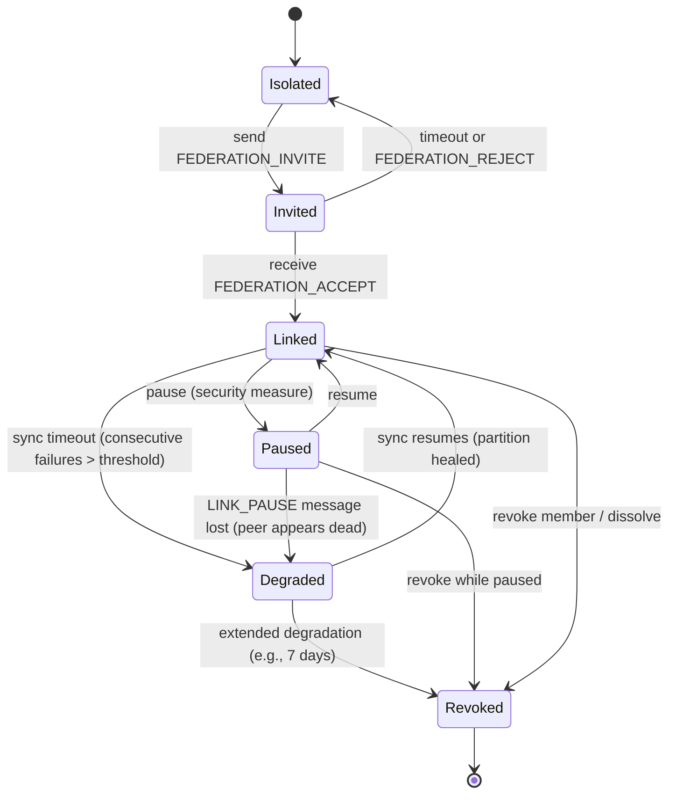

# hKask Federation v2 — Curator-CRDT Federation Design

**Purpose:** Complete design for federating hKask servers through curator-to-curator CRDT sync, merged user/agent registries, federated Matrix conduits, and separate skill registries. Incorporates all findings from the five-addendum audit cycle.

---

## 1. Federation Model

### 1.1 Horizontal Extension of the Pod Architecture

The federation extends the existing three-tier pod architecture **horizontally**:

```
┌──────────────────────────────────┐     ┌──────────────────────────────────┐
│         hKask Server A           │     │         hKask Server B           │
│                                  │     │                                  │
│  ┌────────────────────────────┐  │     │  ┌────────────────────────────┐  │
│  │     CuratorPod (A)         │◄─┼─CRDT─┼─┤     CuratorPod (B)         │  │
│  │  ┌──────────────────────┐  │  │     │  │  ┌──────────────────────┐  │  │
│  │  │ FederationSync       │  │  │     │  │  │ FederationSync       │  │  │
│  │  │ ┌──────────────────┐ │  │  │     │  │  │ ┌──────────────────┐ │  │  │
│  │  │ │ OR-Set (EAV key) │◄┼──┼──┼──┼──┼─┤  │ │ OR-Set (EAV key) │ │  │  │
│  │  │ │ PayloadStore     │ │  │  │     │  │  │ │ PayloadStore     │ │  │  │
│  │  │ │ LWW-Map (users)  │ │  │  │     │  │  │ │ LWW-Map (users)  │ │  │  │
│  │  │ │ G-Set (agents)   │ │  │  │     │  │  │ │ G-Set (agents)   │ │  │  │
│  │  │ │ OR-Set (artifacts)│ │  │  │     │  │  │ │ OR-Set (artifacts)│ │  │  │
│  │  │ └──────────────────┘ │  │  │     │  │  │ └──────────────────┘ │  │  │
│  │  └──────────────────────┘  │  │     │  │  └──────────────────────┘  │  │
│  └────────────────────────────┘  │     │  └────────────────────────────┘  │
│                                  │     │                                  │
│  Skill Registry A (PRIVATE)      │     │  Skill Registry B (PRIVATE)      │
│  ReplicantPods A (PRIVATE)       │     │  ReplicantPods B (PRIVATE)       │
│  TeamPods A (PRIVATE)            │     │  TeamPods B (PRIVATE)            │
│                                  │     │                                  │
│  Matrix Conduit A ◄──────────────┼─Fed─┼─► Matrix Conduit B               │
└──────────────────────────────────┘     └──────────────────────────────────┘
```

### 1.2 What Is Federated (Shared)

| Artifact | Mechanism | CRDT Type |
|----------|-----------|-----------|
| Public semantic triples | `SemanticMemory` → ν-event → EAV hash → OR-Set | OR-Set (content-addressed) |
| User profiles (metadata) | `UserStore` → LWW-Map | LWW-Map (wall-clock, Guideline) |
| Agent registrations | `AgentRegistry` → G-Set | G-Set (additive) |
| Public artifacts | `ArtifactIndex` → content hash → OR-Set | OR-Set (content-addressed) |
| Matrix messaging | Standard Matrix federation protocol | N/A (Matrix native) |

### 1.3 What Remains Local (NOT Federated)

| Artifact | Reason | Principle |
|----------|--------|-----------|
| Skill registries (`manifest.yaml` + `*.j2`) | Single source of truth per server | P5.1 |
| Episodic memory (private triples) | Sovereignty boundary — never leaves home SQLCipher | P1, P11.1 |
| Agent personas, capabilities, OCAP tokens | WebID-grounded to home server | P12 |
| CNS runtimes (variety counters, energy budgets) | Per-pod regulation | P9 |
| Wallet, keystore, ledger | Financial infrastructure scope | P4 |

---

## 2. CRDT Design — ν-Event-Grounded, Timestamp-Free

### 2.1 Semantic Triples — OR-Set Keyed by EAV Hash

The CRDT key for triples is the **EAV content hash** — the same BLAKE3 hash already used by `recall_dedup::eav_hash()`. This is metadata-independent: entity + attribute + canonical value only. Two servers independently observing the same fact produce the same key.

```rust
/// CRDT key for federation semantic triples.
/// Content-addressed via EAV hash — same fact → same key → automatic convergence.
#[derive(Debug, Clone, PartialEq, Eq, Hash)]
pub struct FederationTripleKey {
    eav_hash: [u8; 32],
}

impl FederationTripleKey {
    pub fn from_triple(triple: &Triple) -> Self {
        Self { eav_hash: hkask_memory::recall_dedup::eav_hash(triple) }
    }
}

/// CRDT dot — pure causal ordering. No timestamp dependency.
#[derive(Debug, Clone, Copy, PartialEq, Eq, Hash)]
pub struct Dot {
    pub replica: ReplicaId,
    pub counter: u64,
}

/// Federation OR-Set for semantic triples.
pub struct FederationSemanticSet {
    add_set: HashMap<FederationTripleKey, Vec<Dot>>,
    remove_set: HashMap<FederationTripleKey, Vec<Dot>>,
    replica: ReplicaId,
    counter: AtomicU64,
}
```

### 2.2 Same-Fact Convergence (No Conflict)

```
Server A publishes: (sensor1, temp, 25) → EAV hash 0x3f7a → dot (alpha, 42)
Server B publishes: (sensor1, temp, 25) → EAV hash 0x3f7a → dot (beta, 17)

OR-Set merge: element 0x3f7a has dots [(alpha, 42), (beta, 17)]
→ contains() = true on both servers
→ No conflict. No timestamp comparison. Automatic convergence.
```

### 2.3 Divergent-Fact Retention (Both Kept)

```
Server A publishes: (sensor1, temp, 25, confidence=1.0) → EAV hash 0x3f7a
Server B publishes: (sensor1, temp, 26, confidence=0.8) → EAV hash 0x8b2c

OR-Set merge: BOTH elements retained
→ SemanticIndex query returns both values
→ Curator resolves: prefer higher confidence (1.0 > 0.8) ✓
```

### 2.4 Conflict Resolution Table

| Data Type | CRDT | Key | Conflict Strategy |
|-----------|------|-----|-------------------|
| **Semantic triples** | OR-Set | EAV hash | Same key → converge. Different key → both retained → Curator resolves via confidence + provenance. |
| **User profiles** | LWW-Map | WebID | Highest wall-clock timestamp + replica_id tiebreak. Guideline (metadata, not ν-event-grounded). |
| **Agent registrations** | G-Set | WebID | Union (additive, no conflicts). |
| **Public artifacts** | OR-Set | Content hash (BLAKE3) | Same as triples — content-addressed, both retained if content differs. |

### 2.5 ν-Event Pipeline

The CRDT merged state is a **derived view** — rebuildable from ν-events:

```
ν-events (canonical) → extract triples → OR-Set add (EAV hash + dot)
    → CRDT sync (version vector merge) → reconcile to PayloadStore (upsert by confidence)
    → materialize to SemanticIndex
```

If CRDT state and ν-events disagree: rebuild from ν-events. ν-event primacy preserved.

### 2.6 Triple Payload Store

The OR-Set determines which EAV hashes exist. Full triple data is stored separately:

```rust
pub struct TriplePayloadStore {
    payloads: HashMap<FederationTripleKey, Triple>,
}

impl TriplePayloadStore {
    pub fn upsert(&mut self, triple: Triple) {
        let key = FederationTripleKey::from_triple(&triple);
        self.payloads
            .entry(key)
            .and_modify(|existing| {
                if triple.confidence > existing.confidence {
                    *existing = triple.clone();
                }
            })
            .or_insert(triple);
    }
}
```

---

## 3. FederationLink State Machine

### 3.1 States

| State | Meaning | Sync Active | Reversible |
|-------|---------|-------------|------------|
| `Isolated` | No link exists | No | N/A |
| `Invited` | Invitation sent, awaiting response | No | Yes (timeout/reject → Isolated) |
| `Linked` | Link established, CRDT sync active | Yes | Yes (→ Paused or → Degraded) |
| `Paused` | Sync suspended intentionally (security measure) | No | Yes (→ Linked) |
| `Degraded` | Sync failed — may be partition, peer death, or lost pause notification | No | Yes (→ Linked on recovery, → Revoked on timeout) |
| `Revoked` | Permanently terminated | No | No (terminal) |

### 3.2 State Transition Diagram



### 3.3 The Degraded State (PC-2 Resolution)

The `Degraded` state solves the broken feedback closure identified in the cybernetic audit. When a `LINK_PAUSE` message is lost during a network partition, the peer detects sync timeout and transitions to `Degraded` rather than staying in `Linked` (model-reality divergence) or jumping to `Revoked` (too drastic).

```rust
pub enum LinkState {
    // ... other states ...
    Degraded {
        degraded_at: DateTime<Utc>,
        failed_attempts: u64,
        last_success_at: DateTime<Utc>,
    },
}
```

CNS span: `cns.federation.link_degraded` with `{failed_attempts, last_success_age_secs}`.

---

## 4. Invitation and Lifecycle Protocol

### 4.1 Invitation Flow

```
Curator A                          Curator B
   │                                  │
   │ kask federation invite           │
   │   --peer beta                    │
   │                                  │
   │ state: Isolated → Invited        │
   │ CNS: invite_sent                 │
   │                                  │
   │─── FEDERATION_INVITE ───────────►│
   │    {inviter, tls, config}        │
   │                                  │ CNS: invite_received
   │                                  │
   │                                  │── Admin reviews (manual default, P2)
   │                                  │   or auto_accept policy
   │                                  │
   │◄── FEDERATION_ACCEPT ────────────│
   │                                  │
   │ state: Invited → Linked          │ state: Isolated → Linked
   │ CNS: link_established            │ CNS: link_established
   │                                  │
   │── Matrix conduit federation ────►│
   │── CRDT bootstrap ───────────────►│
   │── Registry merge ───────────────►│
```

### 4.2 Invitation Policy Seam

```rust
/// In hkask-ports:
pub trait InvitationPolicy: Send + Sync {
    fn evaluate(&self, invitation: &FederationInvitation) -> InvitationDecision;
}

pub enum InvitationDecision {
    Accept,
    Reject { reason: String },
    DeferToAdmin,  // P2 default
}
```

Default implementations: `ManualInvitationPolicy` (always `DeferToAdmin`), `AllowListInvitationPolicy` (accept configured peers), `RateLimitingInvitationPolicy` (wrapper).

### 4.3 Three Revocation Operations

| Operation | Scope | CNS Span | Gossip |
|-----------|-------|----------|--------|
| **Revoke member** | Single peer | `federation.member_revoked` | Yes — other members notified |
| **Leave federation** | Self | `federation.member_left` | Yes — voluntary departure |
| **Dissolve federation** | All links (batched) | `federation.dissolved` | Yes — `FEDERATION_GOODBYE` to all |

Dissolution is decentralized: each Curator dissolves its own links. No global coordinator.

### 4.4 CuratorDirective Extensions

```rust
pub enum CuratorDirective {
    // ... existing variants ...

    InviteToFederation { peer_replica, peer_server_domain, peer_matrix_domain, peer_curator_matrix_id, message },
    AcceptFederationInvite { invitation_id },
    RejectFederationInvite { invitation_id, reason },
    PauseFederationLink { peer_replica, reason },
    ResumeFederationLink { peer_replica },
    RevokeFederationMember { peer_replica, reason },
    LeaveFederation { reason },
    DissolveFederation { reason },
}
```

---

## 5. CNS Observability

### 5.1 Federation CNS Spans (Phased)

| Phase | CNS Span Variants |
|-------|------------------|
| **Phase 1 (MVP)** | `FederationCrdtMerge`, `FederationLinkEstablished`, `FederationLinkLost`, `FederationLinkDegraded`, `FederationMemberLeft` |
| **Phase 2** | `FederationInviteSent`, `FederationInviteReceived`, `FederationInviteAccepted`, `FederationInviteRejected`, `FederationInviteExpired`, `FederationLinkPaused`, `FederationLinkResumed` |
| **Phase 3** | `FederationMemberRevoked`, `FederationDissolved`, `FederationRegistrySync`, `FederationArtifactSync`, `FederationConduitRoute`, `FederationConduitRouteLost`, `FederationCrdtConflict` |

### 5.2 Federation Algedonic Thresholds (PC-1 Resolution)

| Threshold | Metric | Warning | Critical | CNS Span |
|-----------|--------|---------|----------|----------|
| `fed_sync_latency` | CRDT sync round-trip (ms) | > 5000 | > 30000 | `FederationCrdtMerge` |
| `fed_crdt_divergence` | Delta size / baseline | > 2× | > 10× | `FederationCrdtMerge` |
| `fed_link_downtime` | Paused/Degraded duration (s) | > 3600 | > 86400 | `FederationLinkDegraded` |
| `fed_member_count_change` | Member count delta | ±1 | ±N/2 | `FederationMemberJoined/Left` |
| `fed_invitation_rate` | Invites/hour | > 5 | > 20 | `FederationInviteReceived` |
| `fed_registry_divergence` | Registry entries differed | > 10 | > 100 | `FederationRegistrySync` |

### 5.3 Federation Health Model (PC-4 Resolution)

The Curator's metacognition maintains a model of healthy federation:

```rust
pub struct FederationHealthModel {
    latency_window: Vec<u64>,
    expected_merge_frequency: f64,
    expected_member_count: usize,
    confidence: Confidence,
    last_updated: DateTime<Utc>,
}
```

---

## 6. Crate Architecture

### 6.1 Dependency Direction

```
CLI/API/MCP → hkask-services → hkask-agents → hkask-federation
                                   ↓                  ↓
                              hkask-agents     hkask-ports (traits)
                                   ↓                  ↓
                              hkask-cns         hkask-types
```

### 6.2 `hkask-federation` Crate Structure (Consolidated — DM-1 Resolution)

| Module | Contents | Public Items (est.) |
|--------|----------|---------------------|
| `crdt` | `VersionVector`, `Dot`, `ORSet<T>`, `LWWMap<K,V>`, `GSet<T>` | ~20 |
| `sync` | `FederationSync` (sync loop, CRDT management), `FederationLinkManager` (invite, accept, pause, resume, revoke, leave), `LinkState`, `FederationLink` | ~14 |
| `registry` | `FederationRegistry` (merged user/agent resolution) | ~4 |

Total: 3 modules, ~38 public items. Link lifecycle merged into `sync` (was separate `link` module). Conduit merged into `sync` (was separate `conduit` module).

### 6.3 Hexagonal Ports (IA-1 Resolution)

`FederationSync` depends on trait abstractions, not concrete types:

```rust
// In hkask-ports:
pub trait FederationSyncPort: Send + Sync {
    fn query_public_since(&self, cursor: u64, limit: usize) -> Result<Vec<Triple>, FederationSyncError>;
    fn insert_federated(&self, triple: &Triple, source: ReplicaId) -> Result<(), FederationSyncError>;
    fn cursor_for(&self, source: ReplicaId) -> u64;
    fn advance_cursor(&mut self, source: ReplicaId, cursor: u64);
}

pub trait FederationRegistryPort: Send + Sync {
    fn resolve_user(&self, webid: &WebID) -> Option<UserProfile>;
    fn resolve_agent(&self, webid: &WebID) -> Option<AgentInfo>;
    fn list_local_users(&self) -> Vec<UserProfile>;
    fn list_local_agents(&self) -> Vec<AgentInfo>;
}

pub trait FederationTransport: Send + Sync {
    async fn send(&self, peer: ReplicaId, message: FederationMessage) -> Result<(), TransportError>;
    async fn recv(&self) -> Result<FederationMessage, TransportError>;
    fn simulate_partition(&self, peer: ReplicaId);     // test only
    fn heal_partition(&self, peer: ReplicaId);           // test only
}
```

Adapters:
- **Production:** `MatrixFederationTransport` (Matrix SDK)
- **Test:** `InMemoryFederationTransport` (unit tests without running Matrix)
- **Chaos:** `ChaosFederationTransport` (latency injection, partition simulation)

### 6.4 FederationSync (Split — DM-3 Resolution)

```rust
/// Manages the background CRDT sync loop and materialization.
pub struct FederationSync { /* 3 public methods: run(), status(), health() */ }

/// Manages link lifecycle: invite, accept, pause, resume, revoke, leave.
pub struct FederationLinkManager { /* 6 public methods */ }
```

---

## 7. Security Properties

| Property | Mechanism | Principle | Constraint Force |
|----------|-----------|-----------|-----------------|
| Episodic memory never crosses boundary | `EpisodicMemory::store()` rejects `Visibility::Public` | P1, P11.1 | Prohibition |
| CRDT reads only from public memory | `FederationSyncPort` trait — only exposes `SemanticMemory` queries | P1 | Guardrail (PS-2 fix) |
| Invitations require consent | `InvitationPolicy` default: `DeferToAdmin` | P2 | Prohibition |
| Pause is unilateral | Either side can pause without peer consent | Defensive security | Guardrail |
| Revocation is unilateral | Any member can revoke any other | Enforcement | Guardrail |
| All operations OCAP-gated | `OcapTokenKind::Federation` | P4 | Prohibition |
| Skill registries never shared | Each server's `SqliteRegistry` is local | P5.1, P3 | Prohibition |
| ν-event primacy preserved | CRDT merged state is derived — rebuildable from ν-events | P8 | Guardrail |
| CNS observes everything | 18 federation CNS spans + 6 algedonic thresholds | P9 | Guardrail |
| No second-class triples | All triples use same insert path; provenance in `access.perspective` | P3 | Prohibition |

---

## 8. Behavioral Contracts (CG-1 Resolution)

```rust
/// Start the federation sync loop.
///
/// expect: "Federated Curators converge on public memory"
/// [P3] Motivating: Generative Space — cross-server knowledge sharing
/// [P9] Constraining: Homeostatic Self-Regulation — CNS-observed sync
/// pre:  CRDT state initialized with local SemanticIndex data.
/// pre:  At least one peer configured and Linked.
/// post: On each sync interval, local deltas sent to all Linked peers.
/// post: Received deltas merged into local CRDT state via OR-Set merge.
/// post: CNS span `FederationCrdtMerge` emitted for each successful merge.
/// post: CNS span `FederationLinkDegraded` emitted for consecutive failures > threshold.
/// test: InMemoryFederationTransport, two replicas, insert triple on A,
///       verify triple appears on B within sync_interval * 2.
/// test: Simulate partition, verify Degraded state, heal partition, verify recovery.
pub async fn run(&self, cancel: watch::Receiver<bool>) { ... }
```

---

## 9. Federation Configuration

```yaml
# CuratorPod's agent.yaml — federation section
federation:
  enabled: true
  replica_id: "alpha"
  server_domain: "a.example.com"
  matrix_domain: "matrix.a.example.com"

  invitations:
    policy: "manual"         # manual | auto_accept_configured | deny_all
    ttl_hours: 24

  peers:
    - replica_id: "beta"
      server_domain: "b.example.com"
      matrix_domain: "matrix.b.example.com"
      curator_matrix_id: "@curator:b.example.com"
      auto_accept: false

  sync:
    interval_secs: 5
    max_delta_size: 10000

  thresholds:                # Federation algedonic (PC-1)
    sync_latency_warning_ms: 5000
    sync_latency_critical_ms: 30000
    crdt_divergence_warning_factor: 2.0
    link_downtime_warning_secs: 3600
    link_downtime_critical_secs: 86400
    max_pause_duration_hours: 24
    invitation_rate_warning_per_hour: 5
    registry_divergence_warning: 10

  security:
    require_mutual_tls: true
    capability_required: "federation:sync"
    consent_required: true
```

---

## 10. CLI Commands

```bash
# Invitation
kask federation invite --peer beta --message "Let's federate!"
kask federation accept --invitation <uuid>
kask federation reject --invitation <uuid> --reason "..."

# Status
kask federation status [--peer <id>]
kask federation invitations

# Pause/Resume (security measure)
kask federation pause --peer beta --reason "Investigating anomaly"
kask federation resume --peer beta

# Revocation
kask federation revoke --peer beta --reason "Security breach"
kask federation leave --reason "Decommissioned"
kask federation dissolve --reason "Project concluded"

# CNS
kask cns federation health
kask cns federation links
kask cns federation thresholds
```

---

## 11. Implementation Phases

### Phase 1 — Core Sync (MVP)
- [ ] `hkask-federation` crate with `crdt` module (OR-Set with EAV hashing, LWW-Map, G-Set)
- [ ] `FederationTransport` trait + `InMemoryFederationTransport` test adapter
- [ ] `FederationSyncPort` + `FederationRegistryPort` traits in `hkask-ports`
- [ ] `FederationSync` (run loop, CRDT merge, CNS emission)
- [ ] 5 CNS spans (`CrdtMerge`, `LinkEstablished`, `LinkLost`, `LinkDegraded`, `MemberLeft`)
- [ ] `Degraded` state and sync timeout detection
- [ ] Property-based tests for CRDT commutativity, associativity, idempotence
- [ ] Integration test: two replicas, insert → converge

### Phase 2 — Invitation and Lifecycle
- [ ] `FederationLinkManager` (invite, accept, pause, resume, revoke, leave)
- [ ] `InvitationPolicy` trait + `ManualInvitationPolicy`
- [ ] Matrix transport for invitation messages
- [ ] 6 invitation CNS spans
- [ ] Pause protocol with notification
- [ ] Invitation expiry

### Phase 3 — Federation Completeness
- [ ] Federation algedonic thresholds (SetPoints integration)
- [ ] `FederationHealthModel` for Curator metacognition
- [ ] Registry merge (LWW-Map for users, G-Set for agents)
- [ ] Artifact sync (OR-Set with content hash)
- [ ] 7 remaining CNS spans
- [ ] `MatrixFederationTransport` (production adapter)
- [ ] `ChaosFederationTransport` (robustness testing)
- [ ] `OcapTokenKind::Federation` in `hkask-types`
- [ ] Multi-server integration test harness

---

## 12. Design Decision Record

| Decision | Rationale | Addendum |
|----------|-----------|----------|
| OR-Set keyed by EAV hash, not LWW timestamps | ν-event primacy; same fact → same key → automatic convergence | PS-1 (E) |
| `Degraded` state added to LinkState | Broken feedback closure during partition; distinguishes pause from failure | PC-2 (D) |
| Federation algedonic thresholds | Curator needs comparators, not just sensors: "is this normal?" | PC-1 (D) |
| `FederationSyncPort` + `FederationRegistryPort` traits | Hexagonal ports; enables mock-based testing; type-level public-memory guard | IA-1, PS-2 (D) |
| `FederationTransport` trait + test adapter | Unit-testable without running Matrix; chaos testing | IA-4 (D) |
| `InvitationPolicy` trait + P2 default | Seam for custom acceptance policies; default deny | IA-2 (D) |
| 5 modules consolidated to 3 | Depth score; 7-function rule; link+conduit merged into sync | DM-1, DM-3 (D) |
| 18 CNS spans → phased delivery | Simplicity first; 5 for MVP, 6 for Phase 2, 7 for Phase 3 | CG-2 (D) |
| Curator types canonical in `hkask-types` | Authority DAG; Curator (Loop 5) types not owned by CNS (Loop 6) | M1, M2 (A) |
| `LoopId` has 6 variants | `Episodic`, `Semantic`, `Snapshot` now typed; VSM grounding | M3 (A) |
| LWW reserved for user profiles only | Metadata, not ν-event-grounded; Guideline constraint force | PS-3 (D) |

---

## 13. References

| Document | Relevance |
|----------|-----------|
| `PRINCIPLES.md` | P1–P12 grounding for all security properties |
| `hKask-architecture-master.md` | Four essential patterns, pod architecture |
| `MDS.md` | Domain ontology, five MDS categories |
| `FUNCTIONAL_SPECIFICATION.md` | Contract anchoring (§5), CNS span registry (§9.1) |
| `crates/hkask-types/src/curator.rs` | `CuratorHandle`, `CuratorDirective`, `CurationThresholdConfig` |
| `crates/hkask-types/src/curation.rs` | `OcapTokenKind` (extend with `Federation`) |
| `crates/hkask-types/src/cns.rs` | `CnsSpan` (extend with 18 federation spans) |
| `crates/hkask-types/src/loops.rs` | `LoopId` (6 variants) |
| `crates/hkask-agents/src/curator/semantic_index.rs` | `SemanticIndex` — model for federation index |
| `crates/hkask-agents/src/curator/semantic_sync.rs` | `CuratorSync` — model for `FederationSync` polling loop |
| `crates/hkask-memory/src/recall_dedup.rs` | `eav_hash()` — EAV content hashing used as CRDT key |
| `crates/hkask-ports/src/lib.rs` | Hexagonal port traits (extend with federation ports) |
| `ADDENDUM_MISALIGNMENTS.md` | M1–M8 type/crate fixes |
| `ADDENDUM_REAUDIT.md` | M9–M15 additional findings |
| `ADDENDUM_PROTOCOL.md` | Link lifecycle, invitation/revocation protocol |
| `ADDENDUM_GAPS.md` | Multi-skill gap analysis (16 gaps) |
| `ADDENDUM_PS1_RESOLUTION.md` | ν-event primacy and canonical time resolution |
