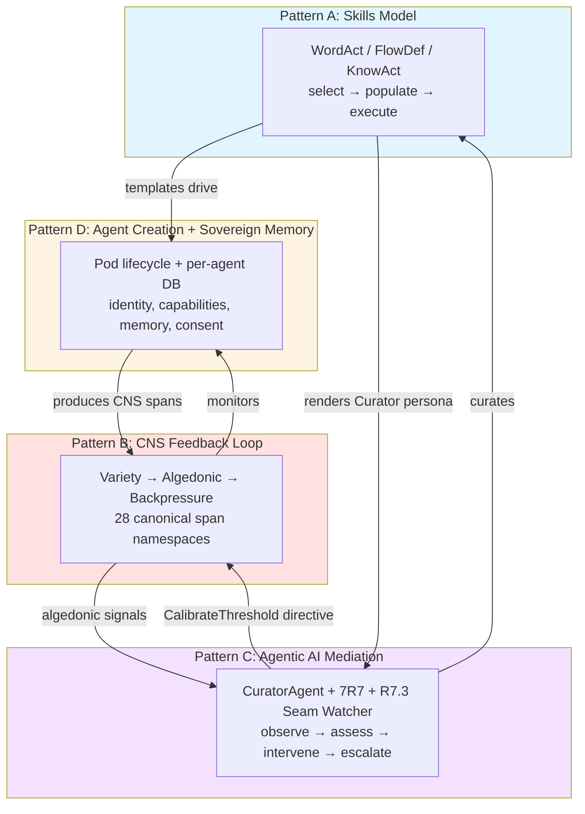
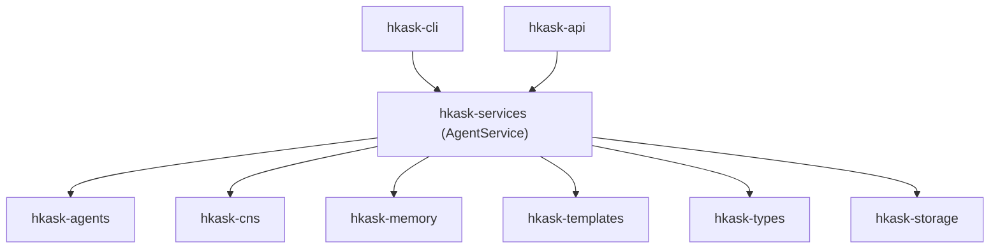
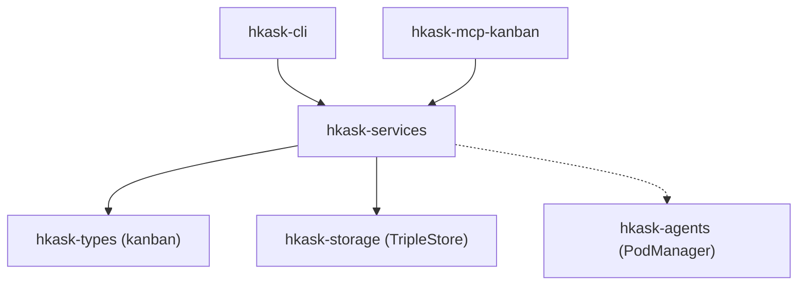
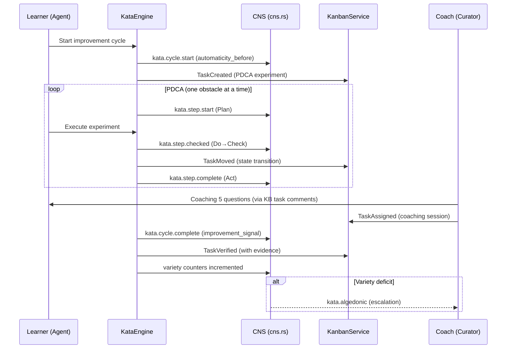
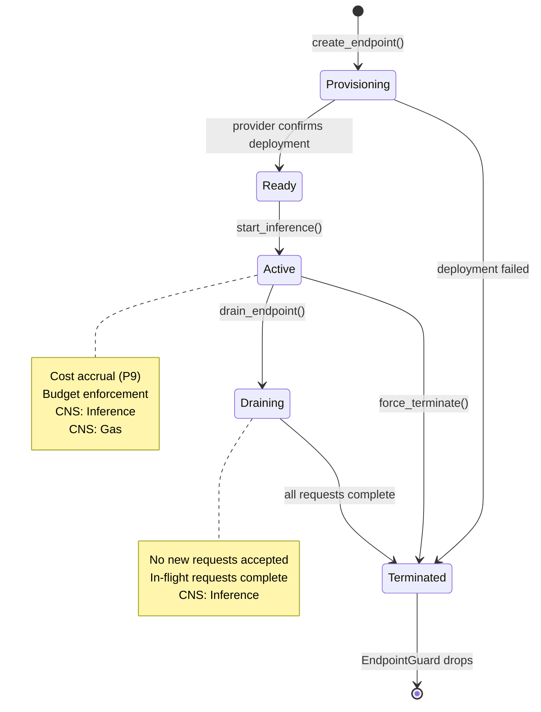
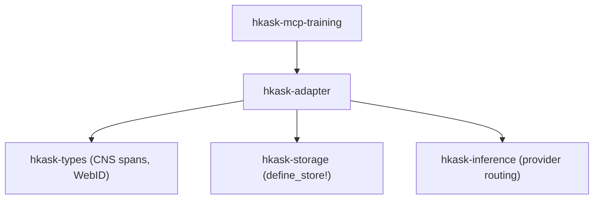
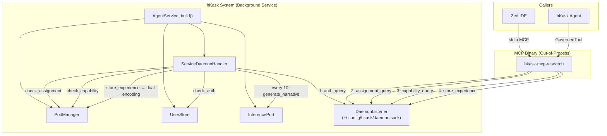
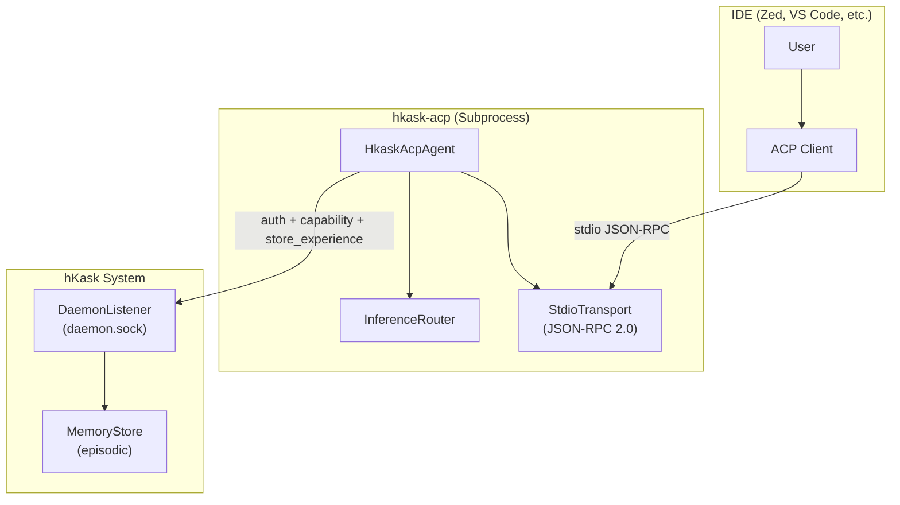

# hKask Architecture Master

**Purpose:** Index to the authoritative architecture documents and the four essential architectural patterns that constitute hKask's irreducible core.

**Project:** hKask (ℏKask - "A Minimal Viable Container for Agents") v0.28.0
**Binary:** `kask`  
**Crate prefix:** `hkask-`

---

## The Four Essential Patterns

hKask's architecture is governed by **four irreducible patterns** that compose into a single cybernetic whole. Remove any one and the system collapses into a qualitatively different — and non-viable — system. These patterns were identified through systematic pragmatics review (pragmatic-semantics + pragmatic-cybernetics + pragmatic-laziness + essentialist + coding-guidelines) and stress-tested via Socratic interrogation (grill-me).

### Pattern A: The Skills Model — WordAct / FlowDef / KnowAct

**What it is:** A tripartite template type system that governs how hKask composes behavior. Mirrors the structure of human cognition: speech acts (WordAct), procedural memory (FlowDef), and metacognition (KnowAct).

| Type | Format | Governs |
|------|--------|---------|
| **WordAct** | Jinja2 `.j2` | "What to say" — system prompts, persona definitions, performative utterances |
| **FlowDef** | YAML `.yaml` | "What to do" — `select → populate → execute` cascade, choice/escalate/abort/delegate verbs |
| **KnowAct** | Jinja2 `.j2` | "How to think" — pattern recognition, classification, reflection, calibration |

**Key properties:**
- Selection intelligence lives in **Jinja2/LLM**, not Rust code (P3 Generative Space)
- `ManifestExecutor` drives the cascade: render selector → LLM → parse JSON → follow chosen path
- Cascade is recursive — a FlowDef step can contain nested WordAct/KnowAct/FlowDef, bounded by matryoshka limit (7)
- Specifications are FlowDef manifests — not a separate type (unification principle)
- Energy-accounted and OCAP-gated: every execute step goes through `GovernedTool`

**Crates:** `hkask-templates`, `hkask-types` (lexicon, BundleManifest)

**If removed:** System becomes a tool executor with monitoring — can do things but can't compose behavior, select strategies, or render personas. P3 and P8 violated.

#### Skill Artifact Model: Single Source of Truth

The canonical source of truth for every skill is its **registry crate** (`registry/templates/<name>/manifest.yaml` + `*.j2` templates). This is the **primary runtime artifact** — it is what `ManifestExecutor` drives, what `SqliteRegistry` indexes, and what the cascade dispatches at inference time.

The **SKILL.md** file (`.agents/skills/<name>/SKILL.md`) is a **generated companion** — a markdown rendering of the registry's structure and intent, produced for the Zed coding agent during development. It is not a co-equal source of truth.

**Derivation rule:** SKILL.md is derived from `manifest.yaml` + `*.j2` templates, not independently authored. The derivation path is:

```
manifest.yaml + *.j2  ──[skill-translator reverse]──▶  SKILL.md
       ↑                                                    │
       └──────────── source of truth ──────────────────────┘
```

**Consequences:**
- A skill with only a registry crate is **complete** — the cascade can execute it. No SKILL.md is required for runtime correctness.
- A skill with only a SKILL.md is **incomplete** — it cannot execute in the cascade. The registry crate must be created.
- When both exist, the registry is authoritative. Any drift between SKILL.md and registry is a defect in SKILL.md, not in the registry.
- The skill health score no longer deducts for missing SKILL.md. It deducts for missing registry (critical: −0.50) and for content drift between layers (medium: −0.10).

**Motivation:** This decision eliminates the cross-layer consistency maintenance burden. Prior to v0.28.0, SKILL.md was treated as a co-equal artifact, requiring manual synchronization. The dual-source model violated P5 (Essentialism) by duplicating skill semantics across two independently-authored formats. The unified model aligns with P3 (Generative Space): selection intelligence lives in Jinja2/LLM, not in markdown instructions.

### Pattern B: The CNS Feedback Loop — Cybernetic Self-Regulation

**What it is:** The autonomic nervous system of hKask — a complete cybernetic system per Beer's Viable System Model (S1–S5). Not passive monitoring; active *regulation*.

```
Sensor (MCP dispatch, CNS spans) → Model (VarietyTracker, ν-event store, EnergyBudget)
    → Comparator (AlgedonicManager, SetPoints, Dampener)
    → Regulator (CurationLoop, CuratorAgent, BackpressureSignal)
    → Actuator (GovernedTool, OCAP dual gate, CircuitBreaker)
    → Sensor (loop closes)
```

**Key properties:**
- **Variety is the core metric.** Ashby's Law: `VarietyTracker` counts distinct states per domain over 60s window. Deficit = expected − observed. Drives all escalation.
- **Energy tracking subsumed rate limiting.** Least action principle as infrastructure: every operation costs gas (action in configuration space). Budget cap = max action per session.
- **Algedonic pathway is unidirectional.** Cybernetics *signals* Curation via alerts; Curation *regulates* Cybernetics through `CuratorDirective::CalibrateThreshold` on a direct `mpsc` channel → `CnsRuntime::calibrate_threshold()`.
- **28 canonical CNS span namespaces.** Every dimension observable: tools (11 MCP subsystems), inference, agent pods, gas, curation, sovereignty, specs, chat, memory, wallet (10 sub-spans), architecture (seam coverage/drift), contracts (proposed/accepted/rejected/violated/coverage), ACP (replicant memory, IDE connection).
- **Good Regulator contract enforced.** CNS variety counter IS the regulator's model. `DefaultSpecCurator` detects spec drift (model-reality divergence).

**Crates:** `hkask-cns`, `hkask-types` (CNS types, SpanNamespace)

**If removed:** System becomes a runaway agent platform — agents act without regulation, resources deplete without backpressure, failures accumulate without detection. P9 violated entirely. P5 loses CNS sensors.

### Pattern C: Agentic AI Mediation — Curator + 7R7

**What it is:** The meta-agent layer that maintains and curates the stack. Embodies the cybernetic separation of observation from decision.

| Component | Role | Authority |
|-----------|------|-----------|
| **7R7 Listener** | Passive observer — polls Matrix rooms, emits CNS spans | **Zero.** Does not classify, escalate, moderate, or judge. |
| **R7.3 Seam Watcher** | Public API contract observer — loads seam inventory, tracks per-crate test coverage as CNS variety dimensions, detects drift, emits algedonic alerts on degradation | **Zero.** Observes and reports. Does not write tests, modify code, or block builds. |
| **CurationLoop** | Pure regulatory — sense/compute/act cycle | **Regulatory.** Compares variety, emits directives. |
| **CuratorAgent** | Persona layer — metacognition, spec curation, human-facing reporting | **Decisional.** Formats directives, pursues goals, escalates to human. |

**Key properties:**
- **Singleton invariant.** Exactly one `CuratorAgent` per system (VSM S4 — Intelligence). Multiple Curators would produce conflicting assessments.
- **Dual-presence in CLI/REPL.** Human replicant + Curator daemon co-present in the interaction loop. User speaks; Curator observes, surfaces CNS alerts, provides memory summaries.
- **Curator never bypasses OCAP.** Can recommend actions, cannot execute without capability tokens. No `sudo`.
- **Metacognitive override mechanism.** `MetacognitionLoop::act_on_throttle()` → `CuratorDirective::CalibrateThreshold` → `mpsc` channel → `CyberneticsLoop` → `CnsRuntime::calibrate_threshold()`. Curator adjusts CNS thresholds; human can override Curator.
- **Spec drift is a cybernetic signal.** `DefaultSpecCurator` detects when specs diverge from implementation → `SpecDriftAlert` → Conant-Ashby violation → revise spec, not suppress alert.
- **7R7 is a dumb pipe by design.** Transport moves messages; agents decide what they mean. Authority resides in agent layer, not transport layer.
- **R7.3 watches the public seam.** `SeamWatcher` loads the machine-readable public seam inventory (embedded JSON at compile time, file path override for development), registers per-crate coverage as CNS variety domains (`seam:{crate_name}`), runs periodic drift checks (default: 30 min), and emits algedonic alerts when coverage degrades. Coverage improvements emit positive `Notify` signals. The watcher is non-fatal — if no inventory is available, seam watching is silently disabled.

**Crates:** `hkask-agents` (curator, curator_agent), `hkask-communication` (listener), `hkask-cns` (seam_watcher)

**If removed:** System becomes a headless automaton — runs, monitors itself, but nobody reads the monitors. CNS fires alerts into a void. P12 partially violated.

### Pattern D: Agent Creation with Sovereign Memory

**What it is:** The pod lifecycle — how agents come into existence with their own identity, capabilities, memory, and consent boundaries.

```
Creation (kask pod create) → Populated → Registered → Activated → Deactivated
                              ↓
                        Operating Modes: Chat (H2A) | Server (A2A)
                              ↓
                        Sovereign Memory: per-agent SQLCipher DB
                              ↓
                        Boundaries: OCAP dual gate + Visibility gating + ConsentManager
```

**Key properties:**
- **Deterministic key derivation.** `derive_ocap_secret(webid)` via HKDF-SHA256 from master key. ADR-027: restart-safe, per-agent isolation. No key material stored.
- **Mode mutual exclusion (initial).** Chat OR Server, not both. Safety boundary: prevents context leakage between human dialogue and tool serving (P11).
- **Server mode flow.** 4 gates: `kask login → pod assign → pod mode server → IDE spawns MCP binary → daemon auth → assignment → capability → serve`.
- **Dual memory encoding.** Every tool call → `record_experience()` → daemon `store_experience` → episodic (private) + semantic (public). Every 10 experiences → `generate_narrative()`.
- **No cross-agent memory access.** `EpisodicMemory::query_for_deduped` filters by `perspective == Some(agent_webid)`. Semantic memory is public. P11: right to choose public/private extends to agents.
- **Default is private — sovereignty fails closed.** `Visibility::Private` default. `ConsentManager` requires explicit affirmative consent for visibility transitions.

**Crates:** `hkask-agents` (pod), `hkask-memory`, `hkask-storage`, `hkask-keystore`

**If removed:** System becomes a library, not a platform — all infrastructure for agency exists but no agents to inhabit it. P6, P10, P11, P12 violated.

### How They Compose



**The composition chain:**
1. **Skills drive Agents.** Pods created from FlowDef templates. Personas are WordAct. Cognitive strategies are KnowAct. Templates are the loom; agents are the fabric.
2. **CNS monitors Agents.** Every tool call, inference, memory operation emits CNS span. Variety counter tracks behavioral diversity. Algedonic alerts fire on deficit.
3. **CNS signals Curator.** AlgedonicManager → RuntimeAlert → NuEventStore → CurationLoop reads via cursor → CuratorAgent assesses via metacognition.
4. **Curator regulates CNS.** `CuratorDirective::CalibrateThreshold` on direct `mpsc` channel → `CyberneticsLoop` → `CnsRuntime::calibrate_threshold()`. Brain regulates autonomic nervous system.
5. **Curator curates Skills.** `DefaultSpecCurator` evaluates coherence, detects drift, recommends revisions. Ensures template DNA stays aligned with implemented system.
6. **Agents produce CNS data.** Agency produces observability; observability enables regulation; regulation ensures healthy agency. Virtuous cycle.


## Deployment Model

**Decision (2026-06-17):** hKask deploys as a single cloud server. There is no client binary. Users access hKask through a browser: OAuth sign-in (GitHub/Google), then an xterm.js terminal connected via WebSocket. The server spawns `kask repl` on a PTY and pipes I/O.

### Topology

```
CLOUD SERVER (single binary, all crates compiled)
  Caddy (Docker) - TLS + reverse proxy
  Conduit (Docker) - Matrix homeserver
  hkask-api - OAuth, WebSocket /terminal, backup endpoints
  hkask-core - daemon, MCP servers, agents, CNS, wallet, memory
  Multi-user TripleStore (scoped by owner_webid)

Access (all via HTTPS/Caddy):
  Browser (xterm.js) - primary
  SSH (optional) - power users
  Matrix (Element) - chat clients
```

### Key Properties

- **Single binary.** All crates compiled. No Cargo features for client/server.
- **Browser-only access.** User visits a URL, signs in, gets a terminal. No install.
- **Multi-tenant.** Multiple users per server. Data scoped by `owner_webid`. OAuth identity maps to WebID.
- **Caddy + Conduit sidecars.** Docker containers. hKask generates config; user runs Docker.
- **Backup as portable archive.** Encrypted SQLCipher file. Export from one server, upload to another. No server-to-server protocol.
- **Wallet cloud-only.** Crypto operations never leave the server.

**Full plan:** `docs/plans/deployment-and-backup.md`

---

## User Roles

**Principle:** Two roles. One difference: what settings you can see.

| Role | Who | Privileges |
|------|-----|------------|
| **Admin** | One or more users. First admin runs `kask init`. | View/modify server config. Invite members. View all sessions. |
| **Member** | Users invited by an admin. | View/modify own settings. Cannot see server config or other users. |

**Design rules:**
- **Multiple admins.** Not a single root. Prevents bus-factor.
- **Invite flow.** `kask invite <email>` sends invitation. Invitee signs in via OAuth, auto-assigned Member role.
- **No role hierarchy beyond Admin/Member.** Third role must survive deletion test.
- **Role stored in `HumanUser.role`** (enum `Admin` | `Member`). Enforced by API middleware.
- **Admin-only endpoints:** `GET /api/v1/admin/config`, `POST /api/v1/admin/invite`, `GET /api/v1/admin/sessions`.

**CNS spans:** `RoleAssigned`, `InviteSent`, `InviteAccepted`.

### Identified Gaps (2026-06-17)

All gaps from 2026-06-15 are now closed. Current open gaps:

| Gap | Severity | Status | Description |
|-----|----------|--------|-------------|
| **Kata documentation narrative** | Low | **Open** | CNS narrative companion for kata coaching has not been commissioned. Decision deferred per Task 9. |
| **Skill ↔ MCP server documentation boundary** | Low | **Open** | Skills live in `.agents/skills/` (Zed agent layer) and `registry/templates/` (hKask runtime layer). MCP servers live in `mcp-servers/`. No unified "capability documentation" showing how a skill, its templates, and its MCP surface compose. Deferred per Task 9. |
| **utoipa annotation completeness** | Medium | **Open** | No `#[utoipa::path]` annotations found in `crates/`. The OpenAPI spec (`docs/generated/openapi.json`, 4454 lines) may be manually maintained. Unannotated endpoints are invisible to auto-generation. Task 6 audits this. |
| **Versioned documentation** | Low | **Open** | No versioning strategy for docs. As codebase evolves (kanban v2, kata refinements, additional MCP servers), documentation will drift again. Deferred per Task 9. |
| **LoRA store security model** | Medium | **Open** | Adapter ownership model (P12) is specified but threat model (adapter tampering, weight poisoning, provenance verification) is not documented. Deferred per Task 9. |
| **User roles undocumented** | Medium | **Resolved (2026-06-17)** | Two-role model (Admin/Member) with invite flow. Documented in User Roles section. |
---

## Document Hierarchy

```
core/magna-carta.md  ←  Foundation (4 inviolable principles)
       ↓
core/PRINCIPLES.md  ←  12 principles (P1-P12), constraint forces, 5 anchors
       ↓
   core/MDS.md      ←  Minimal Domain Specification (5 categories, 5 tools)
       ↓
loop-architecture.md  ←  4-loop decomposition, RateLimiting→EnergyBudget
```

### Canonical Specifications

| Document | Purpose |
|----------|--------|
| [`core/magna-carta.md`](core/magna-carta.md) | User sovereignty charter — catch-and-release, affirmative consent, OCAP verification |
| [`core/PRINCIPLES.md`](core/PRINCIPLES.md) | 12 architecture principles (P1-P12), 5 anchors, anti-patterns |
| [`core/MDS.md`](core/MDS.md) | Minimal Domain Specification — 5 categories, 5 tools, completeness predicate |
| [`core/FUNCTIONAL_SPECIFICATION.md`](core/FUNCTIONAL_SPECIFICATION.md) | Functional specification — 26 domains, ER diagrams, goal-principle contract anchoring, user expectations |
| [`loop-architecture.md`](loop-architecture.md) | 4-loop architecture — RateLimiting→EnergyBudget subsumption, crate↔loop mapping |
| [`mandates/P12-replicant-host-mandate.md`](mandates/P12-replicant-host-mandate.md) | Replicant Host Mandate — every interaction has an author, no unsupervised agency |
| [`energy-gas-payments-api-keys.md`](energy-gas-payments-api-keys.md) | Energy, Gas, Payments & API Key System — economic layer, rJoules, wallets, key lifecycle |
| [`core/CNS-DOMAIN-SPECIFICATION.md`](core/CNS-DOMAIN-SPECIFICATION.md) | CNS Domain Specification — 6 sub-domains, 44 contracts, P4/P9/P12 governed membranes |

| [`../plans/deployment-and-backup.md`](../plans/deployment-and-backup.md) | Deployment & Multi-User Plan |
---

## REPL Architecture

The interactive REPL (`kask chat`) implements four features that govern inference behavior:

### Context Injection

Conversation history is appended as a **suffix** (after the cache breakpoint) so the KV cache prefix — system prompt + template — remains identical across turns. Controlled by `ReplSettings.context_turns` (default 3, 0 = no history).

### Unbounded Tool-Use Loop

The REPL loops tool calls until the model stops requesting them, gated by `ReplSettings.tool_loop_limit` (default 21). Each iteration checks the energy budget via `GovernedTool` before executing. If the limit is hit, the loop breaks and returns the partial response — the system tells the model it can continue by asking.

### Auto-Condense

At 87.5% of the model's context window, old session history is condensed via the condenser domain crate (`hkask-condenser`). The condenser summarizes older turns into a compact form, freeing context space for new messages. Controlled by `ReplSettings.auto_condense` (default on). When off, the user must condense manually.

### Model Awareness

On model switch (`/model`), the REPL fetches metadata from the provider's listing endpoint:
- `context_length` — the model's native context window size (used by auto-condense)
- `supports_thinking` — whether the model supports thinking/reasoning tokens
- `capabilities` — model feature list (vision, tools, etc.)

Populated into `ReplSettings.model_meta` as read-only fields. Unknown until the first model detail fetch succeeds.

### ReplSettings

User-configurable inference parameters exposed via three surfaces:

| Setting | Type | Range | Default | Description |
|---------|------|-------|---------|-------------|
| `tool_loop_limit` | usize | ≥1 | 21 | Max tool-call iterations per turn |
| `context_turns` | usize | ≥0 | 3 | Past turns in context (0 = no history) |
| `temperature` | f32 | 0.0–2.0 | 0.7 | Sampling temperature |
| `top_p` | f32 | 0.0–1.0 | 0.9 | Nucleus sampling |
| `top_k` | u32 | ≥1 | 40 | Top-k filtering |
| `min_p` | f32 | 0.0–1.0 | 0.0 | Min-p threshold (0.0 = disabled) |
| `typical_p` | f32 | 0.0–1.0 | 0.0 | Locally typical sampling (0.0 = disabled) |
| `max_tokens` | u32 | ≥1 | 512 | Max completion tokens per call |
| `seed` | u32 or `off` | — | random | Deterministic seed |
| `gas_heuristic` | u64 | ≥1 | 500 | Per-turn gas reservation |
| `gas_cap` | u64 | ≥1 | 10,000 | Total session energy budget cap |
| `auto_condense` | bool | — | true | Auto-condense at 87.5% of context window |
| `model_meta` | read-only | — | None | Model context_length, thinking, capabilities |

### Magna Carta P3 — Equal Surface Exposure

All ReplSettings fields are equally exposed across:
- **REPL:** `/repl` slash command (show/set individual fields)
- **CLI:** `kask settings show|set|reset` commands
- **API:** `GET /api/settings` and `PUT /api/settings` endpoints

All three surfaces read/write the same `~/.config/hkask/settings.json` file. No settings are hidden, admin-gated, or surface-restricted.

### Voice Interaction (Talk + Listen)

The REPL supports bidirectional voice interaction through the media MCP server (`hkask-mcp-media`):

| Command | Behavior |
|---------|----------|
| `/talk on` | Enable speech output — after each agent response, a speech summarizer condenses the output into 1-3 spoken sentences via LLM, then plays through ffplay |
| `/talk off` | Disable speech output |
| `/talk voice [DESC]` | Set or show the TTS voice profile (calls `voice_design` on media server, maps to ElevenLabs presets) |
| `/listen start [SECONDS]` | Record audio from microphone (default 30s), transcribe with word-level timestamps via `transcribe_bundle`, save as `TranscriptBundle` JSON |
| `/listen stop` | Show info about the last recording |
| `/listen view [FILE]` | Open TUI transcript viewer with word-level highlighting synced to audio playback (Richmond Gold #B79163) |

**Architecture:** `/talk` calls the speech summarizer (inference port) → `generate_speech` (MCP media) → ffplay. `/listen` calls `audio_capture` → `transcribe_bundle` (MCP media). Both use `GovernedTool` for OCAP-gated MCP invocation. The `TranscriptViewer` renders `TranscriptBundle` JSON using ratatui + ffplay subprocess.

---

## Service Layer

**Crate:** `hkask-services` — shared business logic for CLI and API surfaces.

**Canonical specification:** [`MDS-agent-service.md`](../specifications/specs/MDS-agent-service.md) — full domain spec, accessor methods, depth test results, and service boundary definitions.

### Summary

`AgentService` is the canonical service layer owning all shared infrastructure. All 28 fields are **private** and exposed through **individual named accessor methods** (replacing the earlier grouped-tuple pattern). `AgentService::build(config)` assembles all shared infrastructure once at startup. Both surfaces compose it and add only presentation-specific fields:

- `ReplState` = `AgentService` + REPL fields (prompt history, input state)
- `ApiState` = `Arc<AgentService>` + HTTP fields (router, OpenAPI spec) + surface-specific stores

**Database pattern:** A single `Arc<Mutex<Connection>>` is shared across all stores — in-memory (tests) or file-backed (production). `ServiceConfig` has three constructors: `from_env()` (production, env vars + keychain), `from_secrets()` (REPL onboarding), and `in_memory()` (tests, synthetic secrets). See [`MDS-agent-service.md`](../specifications/specs/MDS-agent-service.md) §4.2 for the full in-memory database pattern.

### Dependency Direction



Domain crates **never** depend on `hkask-services`. MCP servers **never** depend on `hkask-services` for orchestration (P1 Prohibition — out-of-process isolation). Tri-surface MCP servers (those that are direct surfaces for a service) may import `hkask-services` for delegation only — see constraint 1 below.

### Key Constraints

1. **MCP servers should not depend on `hkask-services` for orchestration** — P1 Prohibition (out-of-process isolation). Exceptions: servers that are direct surfaces for a service (CLI/API/MCP tri-surface pattern). `hkask-mcp-replica` is a tri-surface for `ComposeService` + `EmbedService`. `hkask-mcp-spec` is a tri-surface for `ComposeService` (via `spec_replica_rewrite` tool only); its remaining 5 tools use domain crates (`hkask-storage`, `hkask-types`) directly. Neither server orchestrates — they delegate.
2. **Domain crates do NOT depend on `hkask-services`** — dependency direction is strictly surface → service → domain.


---

## Kanban Agent Coordination

**Crates:** `hkask-types` (types), `hkask-services` (KanbanService), `mcp-servers/hkask-mcp-kanban` (MCP surface)

**Tri-surface pattern:** CLI (`kask kanban`), REPL (`/kanban`), MCP (7 tools via `hkask-mcp-kanban`)

### Summary

Kanban provides headless task coordination for agents and replicants. Boards contain columns with WIP limits (Anderson, 2010), tasks flow through state transitions, and assignment requires agent consent (P1). Three skills compose the full workflow:

| Skill | Purpose | Steps | Manifest |
|-------|---------|-------|----------|
| **Kanban Task Decomposition** | Break projects into INVEST-compliant tasks with recomposition strategy | 4 | `registry/manifests/kanban-task-decomposition.yaml` |
| **Kanban Task Delegation** | Spawn sub-replicants with OCAP capability packages | 2 | `registry/manifests/kanban-task-delegation.yaml` |
| **Kanban Task Management** | Monitor, coordinate, verify, de-jam | 6 | `registry/manifests/kanban-task-management.yaml` |

### Key Features

- **WIP limits** per column (Anderson §4: "limit WIP to expose problems")
- **rSolidity contracts**: task assignment IS a contract with pre/post conditions
- **Kata integration**: coaching, improvement, and starter katas available as task primitives
- **Capability packages**: reusable OCAP delegation bundles stored as YAML
- **Board templates**: `software-project`, `writing-project`, `scientific-research`, `investment-research`
- **De-jamming**: auto-detects and fixes stuck tasks, stale assignments, unverified completions
- **LLM-mediated verification**: two-step prompt → JSON → structured pass/fail
- **Persistence**: boards and tasks stored as RDF triples via `TripleStore` (MDS §2)

### Dependency Direction



`hkask-mcp-kanban` depends on `hkask-services` — permitted as a tri-surface for KanbanService.

Kanban operations emit observability through `CnsSpan::Tool { subsystem: ToolSubsystem::Kanban }`.

See also: `docs/user-guides/kanban-user-guide.md`

---

## Kata — Cybernetic Capability Development

**Crates:** `hkask-services` (KataEngine), `hkask-cns` (variety counters, algedonic alerts), `hkask-storage` (KataHistoryStore)

**Skills:** `.agents/skills/kata-starter/`, `.agents/skills/kata-improvement/`, `.agents/skills/kata-coaching/`, `.agents/skills/kata/` (bundle)

**Templates:** 23 Jinja2 templates across 4 skill directories, 5 YAML manifests, registered in `registry/templates/bootstrap-registry.yaml`

**MCP surface:** Kanban MCP (`hkask-mcp-kanban`) — kata cycles execute as kanban tasks (tri-surface: CLI, REPL, MCP)

### Summary

Kata implements the Toyota Kata methodology (Rother, 2009) as a cybernetic capability development system. Three independently usable skills compose through a bundle orchestrator, with CNS observing every practice, PDCA iteration, and coaching session. The kanban MCP surface provides task-based execution for kata experiments.

| Skill | Purpose | Steps | Templates | Manifest |
|-------|---------|-------|-----------|----------|
| **kata-starter** | Build foundational scientific thinking habits | 5 | 5 (4 FlowDef, 1 KnowAct) | `starter-kata.yaml` |
| **kata-improvement** | 4-step PDCA scientific pattern for capability gaps | 4 | 5 (1 FlowDef, 4 WordAct) | `improvement-kata.yaml` |
| **kata-coaching** | 5-question dialogue for teaching scientific thinking | 5 | 6 (1 FlowDef, 5 WordAct) | `coaching-kata.yaml` |
| **kata** (bundle) | Full orchestration: routing, habit monitoring, iteration | 7 | 7 (6 KnowAct, 1 WordAct) | `kata-pattern.yaml` |

### Key Features

- **PDCA cycle with before/after metrics:** The `KataEngine` captures `metric_before` from CNS counters, executes the 4-step PDCA pattern, captures `metric_after`, and computes an `ImprovementSignal` (Positive/Negative/Stalled/NotMeasured)
- **Automaticity tracking:** Practice history stored in `data/kata-history.json` + SQLite (`KataHistoryStore`). Automaticity linearly approaches 1.0 over 21 consecutive practice days. 3+ day gaps trigger habit decay alerts
- **CNS variety counters:** `kata.practices.completed`, `kata.automaticity.score`, `kata.habit.formation` — baseline 5/week, +0.05/week, 1 per 21 days
- **Algedonic alerts:** Variety deficits exceeding threshold (default 100) emit `kata.algedonic` warnings
- **OCAP consent gates:** kata-starter (self-consent), kata-improvement (Curator), kata-coaching (Learner) — per P2 Affirmative Consent
- **Memory integration:** Every step produces a `StepExperience` recorded to episodic memory via dual-encoding pipeline
- **Kanban integration:** PDCA experiments map to kanban tasks; coaching 5 questions map to task fields; improvement cycles tracked as task state transitions

### Kata → Kanban → CNS Feedback Path



Kata operations emit observability through `CnsSpan::Curation` and `CnsSpan::Gas`.

### Coaching 5 Questions → Kanban Task Mapping

| Question | Kanban Task Field | Purpose |
|----------|-------------------|---------|
| 1. What is the Target Condition? | `task.goal` | Ground in measurable outcome |
| 2. What is the Actual Condition now? | `task.evidence_before` | Facts and data (IS, not assumptions) |
| 3. What Obstacles? Which ONE? | `task.blockers` | Focus — one obstacle at a time |
| 4. Next Step? What do you expect? | `task.next_action` + `task.prediction` | PDCA Plan with prediction |
| 5. How quickly can we go see? | `task.review_interval` | Close the feedback loop |

See also: `docs/guides/kata-user-guide.md`

---

## LoRA Adapter Lifecycle & Inference Composition

**Crates:** `hkask-adapter` (lifecycle, routing, store), `hkask-types` (CNS spans), `hkask-services` (orchestration)

**MCP surface:** Training via `hkask-mcp-training` (17 tools, 5 providers)

**Status:** Active — 48 tests, 45 public functions (17 exposed in lib.rs)

### Summary

`hkask-adapter` manages the full lifecycle of trained LoRA adapters — from training provenance through cloud deployment to cost-tracked inference and teardown. Every operation is OCAP-gated (P4). Every state transition emits a CNS span (P9). Every adapter has an owner WebID (P12).

| Component | Type | Purpose |
|-----------|------|---------|
| **Expertise** | Domain type | Semantic grounding: what the adapter was trained on (MdsDomain, TrainingProvenance) |
| **TrainedLoRAAdapter** | Domain type | Content-addressed, owner-scoped adapter with 12 fields (id, name, owner WebID, base_model, source, expertise, status, etc.) |
| **AdapterStore** | Persistence | SQLite CRUD via `define_store!` — store, retrieve, list, delete adapters |
| **AdapterRouter** | Composition | Composes adapter + base model + provider via `AdapterPort` trait (6 OCAP-gated methods) |
| **EndpointLifecycle** | Lifecycle | 5-phase state machine: Provisioning → Ready → Active → Draining → Terminated |
| **EndpointGuard** | Teardown | RAII guard ensuring resource cleanup (P5 — no leaked endpoints) |
| **CostModel** | Pricing | Per-provider transparent pricing (P2 affirmative consent) |

### Adapter Lifecycle State Machine



### Key Features

- **Content-addressed storage:** Adapters identified by content hash + owner WebID — no anonymous artifacts (P12)
- **Provider abstraction:** `AdapterSource` enum supports HuggingFace repos (extensible); providers: Together AI (real HTTP upload + inference), Runpod (vLLM skeleton), Baseten (vLLM skeleton)
- **Transparent pricing:** `CostModel` per provider — user sees cost before deployment (P2)
- **Budget enforcement:** `EndpointLifecycle` checks cost accrual against budget; `EndpointCostBudgetWarning` CNS span on threshold breach (P9)
- **OCAP-gated composition:** `AdapterPort` trait exposes 6 methods, each requiring a capability token (P4)
- **RAII teardown:** `EndpointGuard` ensures endpoints are terminated even on panic (P5)

### Dependency Direction



Adapter and endpoint operations emit observability through `CnsSpan::Tool { subsystem: ToolSubsystem::Training }`, `CnsSpan::Inference`, and `CnsSpan::Gas`.

See also: `docs/user-guides/lora-adapter-store-guide.md`, `docs/guides/lora-training-guide.md`, `docs/architecture/PUBLIC_SURFACE_JUSTIFICATIONS.md`

---

## Daemon & Replicant Server Mode

**Crates:** `hkask-mcp` (daemon transport), `hkask-services` (daemon handler), `hkask-agents` (AgentMode)

### Summary

Replicants can operate in **server mode**, presenting as MCP servers to IDEs (Zed, VSCode) and other hKask agents. The daemon — a Unix domain socket at `~/.config/hkask/daemon.sock` — mediates authentication, role assignment, capability verification, and dual memory encoding between out-of-process MCP binaries and the in-process agent stack.

### Architecture



### Startup Flow

1. `kask login <replicant>` — authenticate (creates session in UserStore)
2. `kask pod assign <replicant> <role>` — assign MCP role (P4 Gate 2: sovereignty/consent)
3. `kask pod mode <replicant> server -r <role>` — enter server mode (P4 Gate 1: OCAP)
4. IDE spawns MCP binary with `HKASK_REPLICANT=<replicant>`
5. Binary connects to daemon → auth → assignment → capability → serve

### Memory Flow

- Tool calls → `record_experience()` (fire-and-forget from MCP binary)
- Daemon `store_experience` → dual encoding: episodic (first-person, private) + semantic (third-person, public)
- Every 10 experiences → `generate_narrative()` → inference analyzes session log → stores observations as episodic "narrative"/"thought"
- Existing consolidation pipeline extracts semantic knowledge from both streams

### Agent Modes

| Mode | Behavior | Mutual Exclusion |
|------|----------|-----------------|
| **Chat** | Conversational loop, calls tools via GovernedTool | Cannot coexist with Server (initially) |
| **Server** | Presents as MCP server(s), handles incoming tool calls, records episodic memories | Cannot coexist with Chat (initially) |

Concurrent chat+server mode planned for future release (3-6 months).

### Key Constraints

1. **P4 Dual Gate:** Every MCP server startup requires both capability verification (OCAP token) and assignment verification (sovereignty/consent).
2. **P2 Affirmative Consent:** Passphrase entry via `kask login` creates session. Daemon checks session existence — no passphrase stored with MCP binary.
3. **Out-of-process isolation:** MCP binaries communicate with hKask only through the daemon socket. No direct access to PodManager, memory, or inference.
4. **Mode mutual exclusion (initial):** An agent can be in Chat mode OR Server mode, not both.

---

## ACP Replicant — IDE Agent Presence

**Crate:** `hkask-acp`, **Protocol:** [Agent Client Protocol](https://agentclientprotocol.com) (ACP)

### Summary

hKask agents can present themselves in any ACP-compatible IDE (Zed, VS Code with extensions, JetBrains) via the `hkask-acp` replicant. ACP is an open standard (agentclientprotocol.com) for bidirectional agent↔editor communication — distinct from hKask's internal A2A (Agent-to-Agent) protocol used for inter-agent template dispatch.

The ACP replicant runs as a subprocess spawned by the IDE, communicating via JSON-RPC 2.0 over stdio. It connects to the same daemon socket as MCP servers (`~/.config/hkask/daemon.sock`) for authentication, capability verification, and memory encoding. Inference is routed through hKask's centralized `InferenceRouter`.

### Architecture



### ACP Protocol vs MCP vs A2A

| Protocol | Direction | Purpose | Implementation |
|----------|-----------|---------|---------------|
| **ACP** (Agent Client Protocol) | Bidirectional IDE ↔ Agent | Streaming agent presence in editor: session lifecycle, content streaming, tool progress, permission requests, plan communication | `hkask-acp` (JSON-RPC 2.0 over stdio) |
| **MCP** (Model Context Protocol) | IDE → Server | Tool invocation: request/response tool calls | `hkask-mcp-*` (10 servers) |
| **A2A** (Agent-to-Agent) | Agent ↔ Agent | Inter-agent template dispatch, memory artifact routing, capability delegation | `hkask-agents::a2a` (A2ARuntime) |

### Prompt Turn Lifecycle

```text
initialize → session/new → session/prompt → [streaming loop] → stop_reason
                                              │
                                              ├─ agent_message_chunk
                                              ├─ tool_call (pending)
                                              ├─ tool_call_update (in_progress)
                                              ├─ tool_call_update (completed)
                                              └─ usage_update
```

The replicant streams inference output as `session/update` notifications while the prompt is processing. The final response carries a structured `StopReason` (`end_turn`, `max_tokens`, `cancelled`).

### How It Reuses Existing Infrastructure

| Capability | Reused Component |
|-----------|-----------------|
| Identity | `WebID` (same identity across REPL, ACP, and MCP surfaces) |
| Authentication | `DaemonClient::auth_query()` (P4 Gate 1) |
| Capability tokens | `verify_startup_gates()` → `A2ARuntime` (P4 Gate 2/3) |
| Memory | `DaemonClient::store_experience()` → dual episodic/semantic encoding |
| Inference | `InferenceRouter` (same provider dispatch as REPL) |
| Observability | CNS spans: `cns.acp.bridge.latency`, `cns.acp.replicant.memory_size`, `cns.acp.ide.connection_state` |
| Accountability | Every memory triple carries the replicant's `WebID` as `owner` (P12) |

### Key Constraints

1. **P2 Affirmative Consent:** The ACP replicant never initiates without user invocation. Sessions are created by the IDE (user action), not by the replicant.
2. **1:1 session isolation:** One ACP replicant process = one IDE connection. Concurrent multi-IDE support is gated on usage data (P7 — Evolutionary Architecture).
3. **Surface-independent identity:** An agent registered in hKask uses the same `WebID`, capability tokens, and memory store whether it's accessed via REPL (`kask chat`), ACP (IDE), or MCP (tools).

---

## Deployment

**Authoritative model:** See Deployment Model section above. hKask deploys as a single cloud server. There is no client binary. Users access hKask through a browser terminal (xterm.js + WebSocket). SSH is optional for power users.

### Cloud Server Deployment

The production deployment is a headless Ubuntu cloud server:

1. **Single binary.** All crates compiled. No Cargo features for client/server.
2. **Browser-first interaction.** Primary interface is xterm.js terminal via browser. Secondary: SSH (`kask repl`). MCP servers (for IDE integration) connect via the REST API or SSH-tunneled socket.
3. **No local GPU inference.** The inference router (`hkask-inference`) routes all requests to cloud providers (DeepInfra, Fireworks, fal.ai).
4. **API keys in OS keychain.** Provider API keys are stored in the OS keychain (Linux Secret Service or flat-file fallback), not in environment variables or plaintext files.
5. **Encrypted database at rest.** All persistent state uses SQLCipher with a passphrase-derived key.
6. **Multi-tenant.** Multiple users per server. Data scoped by `owner_webid`. OAuth (GitHub/Google) sign-in.
7. **Caddy + Conduit sidecars.** Docker containers for TLS termination and Matrix homeserver.

### Provider Configuration

API keys resolve through a 2-tier chain at startup:

| Tier | Source | Security | Persistence |
|------|--------|----------|-------------|
| 1 | OS Keychain | Encrypted at rest by OS | Survives reboot |
| 2 | Environment variable | Plaintext in process memory only | Session-only |

Provider selection via `HKASK_DEFAULT_PROVIDER`:

| Value | Provider | Use Case |
|-------|----------|----------|
| `DI` | DeepInfra | Primary cloud provider |
| `FW` | Fireworks.ai | Fast serverless inference, fallback |
| `FA` | fal.ai | Specialized vision/OCR/media models |

### Setup Flow

```bash
# One-time setup on cloud server
cp providers.env.example providers.env
kask keystore load --path providers.env --shred
kask matrix deploy-sidecar --domain my-server.example.com
cd ~/.config/hkask/sidecar && docker compose up -d
kask init --profile server
```

### Security Properties

| Property | Mechanism |
|----------|-----------|
| No plaintext secrets on disk | Keys live in OS keychain; source file shredded after load |
| No secrets in environment | `InferenceConfig` reads from keychain at startup |
| Affirmative consent before deletion | `--shred` requires explicit confirmation |
| Graceful degradation | Missing keys → backend unavailable (logged), not crash |
| Multi-user isolation | All data scoped by `owner_webid`; OAuth identity verification |

## Reference Artifacts

Detailed lookup tables and diagrams in `reference/`:

| Artifact | Purpose |
|----------|---------|

| [`reference/ports-inventory.md`](reference/ports-inventory.md) | Hexagonal port trait signatures |
| [`reference/utoipa-implementation.md`](reference/utoipa-implementation.md) | OpenAPI generation guide |
| [`reference/template-header-standard.md`](reference/template-header-standard.md) | Template metadata format |
| [`reference/hKask-Curator-persona.md`](reference/hKask-Curator-persona.md) | Curator persona specification |
| [`reference/okapi-integration.md`](reference/okapi-integration.md) | Inference Router API contract (Fireworks, DeepInfra) |
| [`PUBLIC_SURFACE_JUSTIFICATIONS.md`](PUBLIC_SURFACE_JUSTIFICATIONS.md) | Deep-module audit — 16-crate public surface justifications (consolidated) |


---

## Decision Records

| ADR | Topic |
|-----|-------|
| [`ADRs/ADR-031-consolidation-authorization.md`](ADRs/ADR-031-consolidation-authorization.md) | Consolidation authorization via master passphrase derivation |
| [`ADRs/ADR-035-replicant-server-mode.md`](ADRs/ADR-035-replicant-server-mode.md) | Replicant server mode — AgentMode (Chat/Server), daemon socket transport, dual memory encoding, narrative generation |

**Archived (2026-06-17):** ADR-030, ADR-032–034, ADR-036–038 (7 Draft ADRs, never adopted). **Archived (retroactive, 2026-06-15):** ADR-024–027. Recoverable via git history.

---

## Specifications

| Document | Purpose |
|----------|---------|
| [`../specifications/specs/REQUIREMENTS.md`](../specifications/specs/REQUIREMENTS.md) | 22 implemented + 5 deferred goal specs |
| [`../specifications/specs/TRACEABILITY_MATRIX.md`](../specifications/specs/TRACEABILITY_MATRIX.md) | Bidirectional code→test traceability |


---

*Verification commands:* `cargo check --workspace`, `cargo test --workspace`, `cargo clippy --workspace -- -D warnings`, `cargo fmt --check`. See [`MDS_SCAFFOLD.md`](../specifications/specs/MDS_SCAFFOLD.md) §6 for the full verification gate table.

---

## Document Structure

```
docs/architecture/
├── hKask-architecture-master.md           # THIS FILE (index)
├── loop-architecture.md                   # Framework (4-loop authority model)
├── energy-gas-payments-api-keys.md        # Framework (gas, payments, API key system)
├── matrix-integration-architecture.md     # Specification (Matrix transport, Conduit sidecar)
├── PUBLIC_SURFACE_JUSTIFICATIONS.md       # Governance (16-crate deep-module audit)
├── core/
│   ├── magna-carta.md                     # Foundation (4 inviolable principles)
│   ├── PRINCIPLES.md                      # Framework (P1-P12)
│   ├── MDS.md                             # Framework (5 categories, 5 tools)
│   ├── TESTING_DISCIPLINE.md              # Specification (contract-anchored testing)
│   ├── CNS-DOMAIN-SPECIFICATION.md        # Specification (197 CNS contracts)
│   ├── FUNCTIONAL_SPECIFICATION.md        # Specification (AgentService)
│   ├── CONTRACT_SPECIFICATION.md          # Specification (definitive contract standard)
│   ├── RSOLIDITY_VOCABULARY.md            # Reference (archived → merged into CONTRACT_SPECIFICATION.md)
├── mandates/
│   └── P12-replicant-host-mandate.md      # Framework (replicant host mandate)
├── ADRs/
│   ├── _TEMPLATE.md                       # ADR template
│   ├── ADR-031-consolidation-authorization.md # Active
│   └── ADR-035-replicant-server-mode.md   # Active
└── reference/
    ├── ports-inventory.md                 # Port reference
    ├── utoipa-implementation.md           # API guide
    ├── template-header-standard.md        # Format reference
    ├── hKask-Curator-persona.md           # Persona spec
    └── okapi-integration.md               # Inference Router API contract
```

**Total:** 19 architecture documents (8 core + 1 mandate + 4 root + 2 ADRs + 1 template + 5 reference) + 1 PUBLIC_SURFACE justification.

**Related folders:** `docs/research/` (lazy-universe-research.md, training-decomposition-traces.md), `docs/specifications/` (wallet-specification.md, MDS_SCAFFOLD.md, etc.), `docs/guides/` (kata-user-guide.md, lora-training-guide.md), `docs/user-guides/` (kanban-user-guide.md, lora-adapter-store-guide.md)

---

*ℏKask - A Minimal Viable Container for Agents — v0.28.0*
