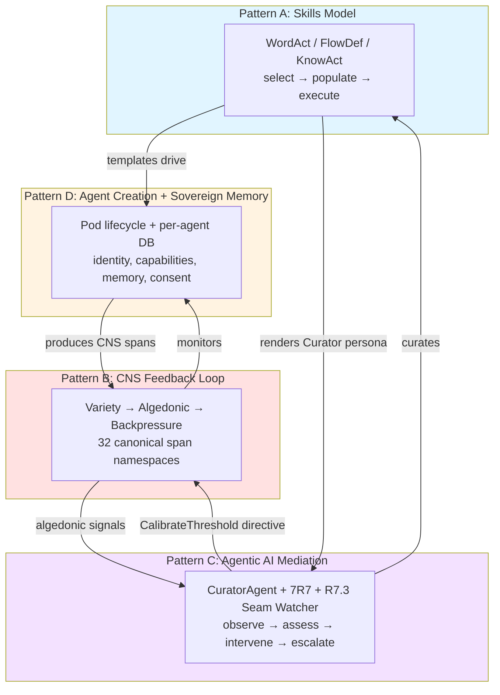
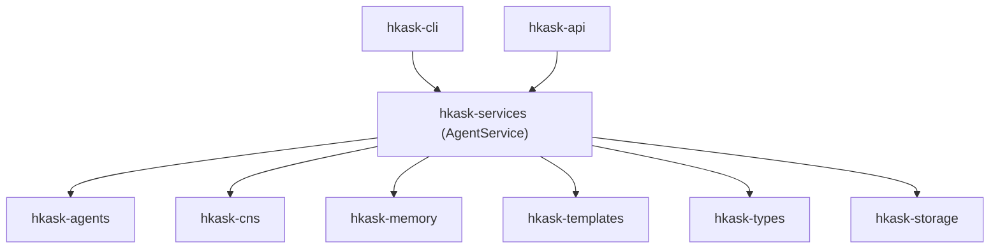
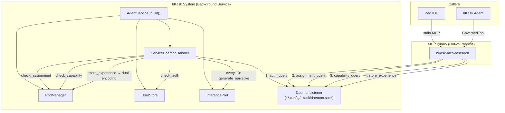
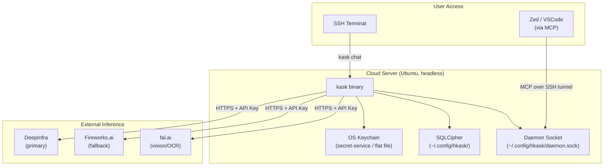

# hKask Architecture Master

**Purpose:** Index to the authoritative architecture documents and the four essential architectural patterns that constitute hKask's irreducible core.

**Project:** hKask (ℏKask - "A Minimal Viable Container for Agents") v0.27.0
**Binary:** `kask`  
**Crate prefix:** `hkask-`

---

## The Four Essential Patterns

hKask's architecture is governed by **four irreducible patterns** that compose into a single cybernetic whole. Remove any one and the system collapses into a qualitatively different — and non-viable — system. These patterns were identified through systematic pragmatics review (pragmatic-semantics + pragmatic-cybernetics + pragmatic-laziness + essentialist + coding-guidelines) and stress-tested via Socratic interrogation (grill-me).

### Pattern A: The Skills Model — WordAct / FlowDef / KnowAct

**What it is:** A tripartite template type system that governs how hKask composes behavior. Mirrors the structure of human cognition: speech acts (WordAct), procedural memory (FlowDef), and metacognition (KnowAct).

| Type | Format | Governs | hLexicon Domain |
|------|--------|---------|----------------|
| **WordAct** | Jinja2 `.j2` | "What to say" — system prompts, persona definitions, performative utterances | specify, elicit, require, constrain |
| **FlowDef** | YAML `.yaml` | "What to do" — `select → populate → execute` cascade, choice/escalate/abort/delegate verbs | select, populate, execute, sequence |
| **KnowAct** | Jinja2 `.j2` | "How to think" — pattern recognition, classification, reflection, calibration | recognize, classify, discriminate, reflect, calibrate |

**Key properties:**
- Selection intelligence lives in **Jinja2/LLM**, not Rust code (P3 Generative Space)
- `ManifestExecutor` drives the cascade: render selector → LLM → parse JSON → follow chosen path
- Cascade is recursive — a FlowDef step can contain nested WordAct/KnowAct/FlowDef, bounded by matryoshka limit (7)
- hLexicon grounds 142 term-slots across 3 domains with academic citations (P8 Semantic Grounding)
- Specifications are FlowDef manifests — not a separate type (unification principle)
- Energy-accounted and OCAP-gated: every execute step goes through `GovernedTool`

**Crates:** `hkask-templates`, `hkask-types` (lexicon, BundleManifest)

**If removed:** System becomes a tool executor with monitoring — can do things but can't compose behavior, select strategies, or render personas. P3 and P8 violated.

### Pattern B: The CNS Feedback Loop — Cybernetic Self-Regulation

**What it is:** The autonomic nervous system of hKask — a complete cybernetic system per Beer's Viable System Model (S1–S5). Not passive monitoring; active *regulation*.

```
Sensor (MCP dispatch, CNS spans) → Model (VarietyTracker, ν-event store, EnergyBudget)
    → Comparator (AlgedonicManager, SetPoints, Dampener)
    → Regulator (CurationLoop, CuratorAgent, BackpressureSignal)
    → Actuator (GovernedTool, OCAP dual gate, CircuitBreaker)
    → Sensor (loop closes)
```

**Key properties:**
- **Variety is the core metric.** Ashby's Law: `VarietyTracker` counts distinct states per domain over 60s window. Deficit = expected − observed. Drives all escalation.
- **Energy tracking subsumed rate limiting.** Least action principle as infrastructure: every operation costs gas (action in configuration space). Budget cap = max action per session.
- **Algedonic pathway is unidirectional.** Cybernetics *signals* Curation via alerts; Curation *regulates* Cybernetics through `CuratorDirective::CalibrateThreshold` on a direct `mpsc` channel → `CnsRuntime::calibrate_threshold()`.
- **30 canonical CNS span namespaces.** Every dimension observable: tools, prompts, inference, agent pods, connectors, pipelines, gas, reviews, templates, curation, variety, sovereignty, goals, specs, tests, set points, backpressure, cadence, memory, condenser, evolution, architecture, improv, kata.
- **Good Regulator contract enforced.** CNS variety counter IS the regulator's model. `DefaultSpecCurator` detects spec drift (model-reality divergence).

**Crates:** `hkask-cns`, `hkask-types` (CNS types, SpanNamespace)

**If removed:** System becomes a runaway agent platform — agents act without regulation, resources deplete without backpressure, failures accumulate without detection. P9 violated entirely. P5 loses CNS sensors.

### Pattern C: Agentic AI Mediation — Curator + 7R7

**What it is:** The meta-agent layer that maintains and curates the stack. Embodies the cybernetic separation of observation from decision.

| Component | Role | Authority |
|-----------|------|-----------|
| **7R7 Listener** | Passive observer — polls Matrix rooms, emits CNS spans | **Zero.** Does not classify, escalate, moderate, or judge. |
| **R7.3 Seam Watcher** | Public API contract observer — loads seam inventory, tracks per-crate test coverage as CNS variety dimensions, detects drift, emits algedonic alerts on degradation | **Zero.** Observes and reports. Does not write tests, modify code, or block builds. |
| **CurationLoop** | Pure regulatory — sense/compute/act cycle | **Regulatory.** Compares variety, emits directives. |
| **CuratorAgent** | Persona layer — metacognition, spec curation, human-facing reporting | **Decisional.** Formats directives, pursues goals, escalates to human. |

**Key properties:**
- **Singleton invariant.** Exactly one `CuratorAgent` per system (VSM S4 — Intelligence). Multiple Curators would produce conflicting assessments.
- **Dual-presence in CLI/REPL.** Human replicant + Curator daemon co-present in the interaction loop. User speaks; Curator observes, surfaces CNS alerts, provides memory summaries.
- **Curator never bypasses OCAP.** Can recommend actions, cannot execute without capability tokens. No `sudo`.
- **Metacognitive override mechanism.** `MetacognitionLoop::act_on_throttle()` → `CuratorDirective::CalibrateThreshold` → `mpsc` channel → `CyberneticsLoop` → `CnsRuntime::calibrate_threshold()`. Curator adjusts CNS thresholds; human can override Curator.
- **Spec drift is a cybernetic signal.** `DefaultSpecCurator` detects when specs diverge from implementation → `SpecDriftAlert` → Conant-Ashby violation → revise spec, not suppress alert.
- **7R7 is a dumb pipe by design.** Transport moves messages; agents decide what they mean. Authority resides in agent layer, not transport layer.
- **R7.3 watches the public seam.** `SeamWatcher` loads the machine-readable public seam inventory (embedded JSON at compile time, file path override for development), registers per-crate coverage as CNS variety domains (`seam:{crate_name}`), runs periodic drift checks (default: 30 min), and emits algedonic alerts when coverage degrades. Coverage improvements emit positive `Notify` signals. The watcher is non-fatal — if no inventory is available, seam watching is silently disabled.

**Crates:** `hkask-agents` (curator, curator_agent), `hkask-communication` (listener), `hkask-cns` (seam_watcher)

**If removed:** System becomes a headless automaton — runs, monitors itself, but nobody reads the monitors. CNS fires alerts into a void. P12 partially violated.

### Pattern D: Agent Creation with Sovereign Memory

**What it is:** The pod lifecycle — how agents come into existence with their own identity, capabilities, memory, and consent boundaries.

```
Creation (kask pod create) → Populated → Registered → Activated → Deactivated
                              ↓
                        Operating Modes: Chat (H2A) | Server (A2A)
                              ↓
                        Sovereign Memory: per-agent SQLCipher DB
                              ↓
                        Boundaries: OCAP dual gate + Visibility gating + ConsentManager
```

**Key properties:**
- **Deterministic key derivation.** `derive_ocap_secret(webid)` via HKDF-SHA256 from master key. ADR-027: restart-safe, per-agent isolation. No key material stored.
- **Mode mutual exclusion (initial).** Chat OR Server, not both. Safety boundary: prevents context leakage between human dialogue and tool serving (P11).
- **Server mode flow.** 4 gates: `kask login → pod assign → pod mode server → IDE spawns MCP binary → daemon auth → assignment → capability → serve`.
- **Dual memory encoding.** Every tool call → `record_experience()` → daemon `store_experience` → episodic (private) + semantic (public). Every 10 experiences → `generate_narrative()`.
- **No cross-agent memory access.** `EpisodicMemory::query_for_deduped` filters by `perspective == Some(agent_webid)`. Semantic memory is public. P11: right to choose public/private extends to agents.
- **Default is private — sovereignty fails closed.** `Visibility::Private` default. `ConsentManager` requires explicit affirmative consent for visibility transitions.

**Crates:** `hkask-agents` (pod), `hkask-memory`, `hkask-storage`, `hkask-keystore`

**If removed:** System becomes a library, not a platform — all infrastructure for agency exists but no agents to inhabit it. P6, P10, P11, P12 violated.

### How They Compose



**The composition chain:**
1. **Skills drive Agents.** Pods created from FlowDef templates. Personas are WordAct. Cognitive strategies are KnowAct. Templates are the loom; agents are the fabric.
2. **CNS monitors Agents.** Every tool call, inference, memory operation emits CNS span. Variety counter tracks behavioral diversity. Algedonic alerts fire on deficit.
3. **CNS signals Curator.** AlgedonicManager → RuntimeAlert → NuEventStore → CurationLoop reads via cursor → CuratorAgent assesses via metacognition.
4. **Curator regulates CNS.** `CuratorDirective::CalibrateThreshold` on direct `mpsc` channel → `CyberneticsLoop` → `CnsRuntime::calibrate_threshold()`. Brain regulates autonomic nervous system.
5. **Curator curates Skills.** `DefaultSpecCurator` evaluates coherence, detects drift, recommends revisions. Ensures template DNA stays aligned with implemented system.
6. **Agents produce CNS data.** Agency produces observability; observability enables regulation; regulation ensures healthy agency. Virtuous cycle.

### Identified Gaps (2026-06-15)

| Gap | Severity | Status | Description |
|-----|----------|--------|-------------|
| **Key rotation fragility** | Medium | **Closed (v0.27.0)** | Master key rotation now supported via key versioning. `derive_sub_key_with_version()` embeds `key_version` in HKDF info string (`"hkask-v{version}:{context}"`). Version stored in `~/.config/hkask/version`. `kask keystore rotate` increments version, derives new secrets, stores in keychain. Old-version secrets remain derivable. |
| **Variety vs. outcome quality** | Medium | **Closed (v0.27.0)** | `VarietyTracker` counted diversity but not success/failure distribution. Fixed by adding `OutcomeTracker` with per-domain success rate tracking, `AlgedonicManager::check_outcome()` with 50%/25% thresholds, and wiring `GovernedTool::invoke()` to call `record_outcome()` after every tool completion. New CNS spans: `cns.outcome.tool`, `cns.outcome.inference`, `cns.outcome.memory`. |
| **CNS span→counter connection** | Low | Verified | Tracing spans emit via `tracing` crate; `VarietyTracker::increment()` called explicitly by `CnsRuntime::increment_variety()`. Connection is through `CyberneticsLoop` sense→compute→act cycle. |
| **Metacognitive override mechanism** | Low | Verified | `MetacognitionLoop::act_on_throttle()` → `CuratorDirective::CalibrateThreshold` → `mpsc::UnboundedSender` → `CyberneticsLoop` → `CnsRuntime::calibrate_threshold()`. Implemented and traced. |
| **Public seam observability (P8 runtime enforcement)** | Medium | **Closed (v0.28.0)** | P8 required every `#[test]` to verify a public seam, but coverage was only checked at CI time. R7.3 `SeamWatcher` now loads the machine-readable public seam inventory at startup (embedded JSON), registers 25 per-crate variety domains, runs periodic drift checks (30-min interval), and fires algedonic alerts on coverage degradation. Coverage improvements emit positive `Notify` signals. Curator `/status` displays seam coverage. New CNS spans: `cns.architecture.seam.coverage`, `cns.architecture.seam.drift`. New `SignalMetric::SeamCoverage` with `BelowSetPoint`→`Escalate` and `AboveSetPoint`→`Notify`. 9 REQ-tagged tests verify behavioral properties. |
| **Code quality & smell reduction (6-wave execution)** | High | **Closed (v0.27.0)** | Top-10 ranked improvements executed across 6 waves: (1) Uniform MCP Gate-3 capability verification across all 10 servers, (2) 37 runtime `.unwrap()` calls replaced with typed errors, (3) 45 new REQ-tagged tests across types/agents/API + real `CapabilityAwareValidator` replacing passthrough stub, (4) Settings strangler extraction to `hkask-services`, `LoopQuality` CNS telemetry, `SpanKind` typed span constructors, (5) 13 public surface justification docs + unsafe documentation policy CI enforcement, (6) 5 CI quality gate scripts wired into `.github/workflows/ci.yml`. 472 tests, 453 REQ tags (96% coverage), 0 clippy warnings. |

---

## Document Hierarchy

```
core/magna-carta.md  ←  Foundation (4 inviolable principles)
       ↓
core/PRINCIPLES.md  ←  12 principles (P1-P12), constraint forces, 5 anchors
       ↓
   core/MDS.md      ←  Minimal Domain Specification (5 categories, 5 tools)
       ↓
loop-architecture.md  ←  4-loop decomposition, RateLimiting→EnergyBudget
```

### Canonical Specifications

| Document | Purpose |
|----------|--------|
| [`core/magna-carta.md`](core/magna-carta.md) | User sovereignty charter — catch-and-release, affirmative consent, OCAP verification |
| [`core/PRINCIPLES.md`](core/PRINCIPLES.md) | 12 architecture principles (P1-P12), 5 anchors, anti-patterns |
| [`core/MDS.md`](core/MDS.md) | Minimal Domain Specification — 5 categories, 5 tools, completeness predicate |
| [`loop-architecture.md`](loop-architecture.md) | 4-loop architecture — RateLimiting→EnergyBudget subsumption, crate↔loop mapping |
| [`mandates/P12-replicant-host-mandate.md`](mandates/P12-replicant-host-mandate.md) | Replicant Host Mandate — every interaction has an author, no unsupervised agency |
| [`energy-gas-payments-api-keys.md`](energy-gas-payments-api-keys.md) | Energy, Gas, Payments & API Key System — economic layer, rJoules, wallets, key lifecycle |

---

## REPL Architecture

The interactive REPL (`kask chat`) implements four features that govern inference behavior:

### Context Injection

Conversation history is appended as a **suffix** (after the cache breakpoint) so the KV cache prefix — system prompt + template — remains identical across turns. Models that cache KV state across requests (e.g., Ollama with `keep_alive`) see prefix cache hits on every turn, reducing per-turn inference latency. Controlled by `ReplSettings.context_turns` (default 3, 0 = no history).

### Unbounded Tool-Use Loop

The REPL loops tool calls until the model stops requesting them, gated by `ReplSettings.tool_loop_limit` (default 21). Each iteration checks the energy budget via `GovernedTool` before executing. If the limit is hit, the loop breaks and returns the partial response — the system tells the model it can continue by asking.

### Auto-Condense

At 87.5% of the model's context window, old session history is condensed via the condenser domain crate (`hkask-condenser`). The condenser summarizes older turns into a compact form, freeing context space for new messages. Controlled by `ReplSettings.auto_condense` (default on). When off, the user must condense manually.

### Model Awareness

On model switch (`/model`), the REPL fetches metadata from Ollama's `/api/show` endpoint:
- `context_length` — the model's native context window size (used by auto-condense)
- `supports_thinking` — whether the model supports thinking/reasoning tokens
- `capabilities` — model feature list (vision, tools, etc.)

Populated into `ReplSettings.model_meta` as read-only fields. Unknown until the first model detail fetch succeeds.

### ReplSettings

User-configurable inference parameters exposed via three surfaces:

| Setting | Type | Range | Default | Description |
|---------|------|-------|---------|-------------|
| `tool_loop_limit` | usize | ≥1 | 21 | Max tool-call iterations per turn |
| `context_turns` | usize | ≥0 | 3 | Past turns in context (0 = no history) |
| `temperature` | f32 | 0.0–2.0 | 0.7 | Sampling temperature |
| `top_p` | f32 | 0.0–1.0 | 0.9 | Nucleus sampling |
| `top_k` | u32 | ≥1 | 40 | Top-k filtering |
| `min_p` | f32 | 0.0–1.0 | 0.0 | Min-p threshold (0.0 = disabled) |
| `typical_p` | f32 | 0.0–1.0 | 0.0 | Locally typical sampling (0.0 = disabled) |
| `max_tokens` | u32 | ≥1 | 512 | Max completion tokens per call |
| `seed` | u32 or `off` | — | random | Deterministic seed |
| `gas_heuristic` | u64 | ≥1 | 500 | Per-turn gas reservation |
| `gas_cap` | u64 | ≥1 | 10,000 | Total session energy budget cap |
| `auto_condense` | bool | — | true | Auto-condense at 87.5% of context window |
| `model_meta` | read-only | — | None | Model context_length, thinking, capabilities |

### Magna Carta P3 — Equal Surface Exposure

All ReplSettings fields are equally exposed across:
- **REPL:** `/repl` slash command (show/set individual fields)
- **CLI:** `kask settings show|set|reset` commands
- **API:** `GET /api/settings` and `PUT /api/settings` endpoints

All three surfaces read/write the same `~/.config/hkask/settings.json` file. No settings are hidden, admin-gated, or surface-restricted.

### Voice Interaction (Talk + Listen)

The REPL supports bidirectional voice interaction through the media MCP server (`hkask-mcp-media`):

| Command | Behavior |
|---------|----------|
| `/talk on` | Enable speech output — after each agent response, a speech summarizer condenses the output into 1-3 spoken sentences via LLM, then plays through ffplay |
| `/talk off` | Disable speech output |
| `/talk voice [DESC]` | Set or show the TTS voice profile (calls `voice_design` on media server, maps to ElevenLabs presets) |
| `/listen start [SECONDS]` | Record audio from microphone (default 30s), transcribe with word-level timestamps via `transcribe_bundle`, save as `TranscriptBundle` JSON |
| `/listen stop` | Show info about the last recording |
| `/listen view [FILE]` | Open TUI transcript viewer with word-level highlighting synced to audio playback (Richmond Gold #B79163) |

**Architecture:** `/talk` calls the speech summarizer (inference port) → `generate_speech` (MCP media) → ffplay. `/listen` calls `audio_capture` → `transcribe_bundle` (MCP media). Both use `GovernedTool` for OCAP-gated MCP invocation. The `TranscriptViewer` renders `TranscriptBundle` JSON using ratatui + ffplay subprocess.

---

## Service Layer

**Crate:** `hkask-services` — shared business logic for CLI and API surfaces.

**Canonical specification:** [`MDS-agent-service.md`](../specifications/specs/MDS-agent-service.md) — full domain spec, accessor methods, depth test results, and service boundary definitions.

### Summary

`AgentService` is the canonical service layer owning all shared infrastructure. All 28 fields are **private** and exposed through **individual named accessor methods** (replacing the earlier grouped-tuple pattern). `AgentService::build(config)` assembles all shared infrastructure once at startup. Both surfaces compose it and add only presentation-specific fields:

- `ReplState` = `AgentService` + REPL fields (prompt history, input state)
- `ApiState` = `Arc<AgentService>` + HTTP fields (router, OpenAPI spec) + surface-specific stores

**Database pattern:** A single `Arc<Mutex<Connection>>` is shared across all stores — in-memory (tests) or file-backed (production). `ServiceConfig` has three constructors: `from_env()` (production, env vars + keychain), `from_secrets()` (REPL onboarding), and `in_memory()` (tests, synthetic secrets). See [`MDS-agent-service.md`](../specifications/specs/MDS-agent-service.md) §4.2 for the full in-memory database pattern.

### Dependency Direction



Domain crates **never** depend on `hkask-services`. MCP servers **never** depend on `hkask-services` for orchestration (P1 Prohibition — out-of-process isolation). Tri-surface MCP servers (those that are direct surfaces for a service) may import `hkask-services` for delegation only — see constraint 1 below.

### Key Constraints

1. **MCP servers should not depend on `hkask-services` for orchestration** — P1 Prohibition (out-of-process isolation). Exceptions: servers that are direct surfaces for a service (CLI/API/MCP tri-surface pattern). `hkask-mcp-replica` is a tri-surface for `ComposeService` + `EmbedService`. `hkask-mcp-spec` is a tri-surface for `ComposeService` (via `spec_replica_rewrite` tool only); its remaining 5 tools use domain crates (`hkask-storage`, `hkask-types`) directly. Neither server orchestrates — they delegate.
2. **Domain crates do NOT depend on `hkask-services`** — dependency direction is strictly surface → service → domain.

---

## Daemon & Replicant Server Mode

**Crates:** `hkask-mcp` (daemon transport), `hkask-services` (daemon handler), `hkask-agents` (AgentMode)

### Summary

Replicants can operate in **server mode**, presenting as MCP servers to IDEs (Zed, VSCode) and other hKask agents. The daemon — a Unix domain socket at `~/.config/hkask/daemon.sock` — mediates authentication, role assignment, capability verification, and dual memory encoding between out-of-process MCP binaries and the in-process agent stack.

### Architecture



### Startup Flow

1. `kask login <replicant>` — authenticate (creates session in UserStore)
2. `kask pod assign <replicant> <role>` — assign MCP role (P4 Gate 2: sovereignty/consent)
3. `kask pod mode <replicant> server -r <role>` — enter server mode (P4 Gate 1: OCAP)
4. IDE spawns MCP binary with `HKASK_REPLICANT=<replicant>`
5. Binary connects to daemon → auth → assignment → capability → serve

### Memory Flow

- Tool calls → `record_experience()` (fire-and-forget from MCP binary)
- Daemon `store_experience` → dual encoding: episodic (first-person, private) + semantic (third-person, public)
- Every 10 experiences → `generate_narrative()` → inference analyzes session log → stores observations as episodic "narrative"/"thought"
- Existing consolidation pipeline extracts semantic knowledge from both streams

### Agent Modes

| Mode | Behavior | Mutual Exclusion |
|------|----------|-----------------|
| **Chat** | Conversational loop, calls tools via GovernedTool | Cannot coexist with Server (initially) |
| **Server** | Presents as MCP server(s), handles incoming tool calls, records episodic memories | Cannot coexist with Chat (initially) |

Concurrent chat+server mode planned for future release (3-6 months).

### Key Constraints

1. **P4 Dual Gate:** Every MCP server startup requires both capability verification (OCAP token) and assignment verification (sovereignty/consent).
2. **P2 Affirmative Consent:** Passphrase entry via `kask login` creates session. Daemon checks session existence — no passphrase stored with MCP binary.
3. **Out-of-process isolation:** MCP binaries communicate with hKask only through the daemon socket. No direct access to PodManager, memory, or inference.
4. **Mode mutual exclusion (initial):** An agent can be in Chat mode OR Server mode, not both.

---

## Deployment

hKask is designed for two deployment targets: **local workstation** (Ollama) and **cloud server** (remote inference providers). The common deployment target is a headless Ubuntu cloud server accessed via SSH.

### Deployment Architecture



### Common Deployment: Cloud Server

The intended production deployment is an Ubuntu cloud server without local GPU inference:

1. **No Ollama dependency.** The inference router (`hkask-inference`) routes all requests to cloud providers (DeepInfra, Fireworks, fal.ai). Ollama is optional and disabled by default on cloud deployments.
2. **API keys in OS keychain.** Provider API keys are stored in the OS keychain (Linux Secret Service or flat-file fallback), not in environment variables or plaintext files. Loaded once via `kask keystore load --shred`, which securely deletes the source file after explicit user consent.
3. **Encrypted database at rest.** All persistent state (agent registry, memory, sessions) uses SQLCipher with a passphrase-derived key.
4. **SSH-first interaction.** The primary interface is `kask chat` over SSH. MCP servers (for IDE integration) connect via SSH-tunneled Unix socket.

### Provider Configuration

API keys resolve through a 2-tier chain at startup:

| Tier | Source | Security | Persistence |
|------|--------|----------|-------------|
| 1 | OS Keychain (`secret-service` or `~/.local/share/keyrings/`) | Encrypted at rest by OS | Survives reboot |
| 2 | Environment variable | Plaintext in process memory only | Session-only |

Provider selection is controlled by `HKASK_DEFAULT_PROVIDER` (stored in keychain or env var):

| Value | Provider | Use Case |
|-------|----------|----------|
| `DI` | DeepInfra | Primary cloud provider — wide model catalog, per-token pricing, free tier |
| `FW` | Fireworks.ai | Fast serverless inference, fallback |
| `FA` | fal.ai | Specialized vision/OCR/media models |
| `OM` | Ollama | Local inference only (default, typically disabled on cloud) |

### Setup Flow

```bash
# One-time setup on cloud server
cp providers.env.example providers.env   # Fill in DI_API_KEY=sk-...
kask keystore load --path providers.env --shred  # Loads into keychain, shreds file
kask chat                                   # First run: onboarding creates replicant
```

The onboarding flow (`kask chat` first run) prompts for provider configuration if no keys are detected, offering three paths: load from `providers.env`, enter API key directly (masked input), or skip (Ollama-only).

### Security Properties

| Property | Mechanism |
|----------|-----------|
| No plaintext secrets on disk | Keys live in OS keychain; source file shredded after load |
| No secrets in environment | `InferenceConfig` reads from keychain at startup, not `std::env` |
| Affirmative consent before deletion | `--shred` requires explicit `y` response to warning prompt |
| Graceful degradation | Missing keys → backend unavailable (logged), not crash |
| Backward compatible | Existing `export`/`.env` setups continue working (env var tier) |

### Local Development

For local development with Ollama:

```bash
# Default: Ollama on localhost:11434
kask chat
# Or use cloud provider alongside Ollama:
export DI_API_KEY=sk-...
kask chat -m DI/meta-llama/Llama-3.3-70B-Instruct
```

Local and cloud deployments share the same binary, same config, same code path. The only difference is which provider keys are configured.

---

## Reference Artifacts

Detailed lookup tables and diagrams in `reference/`:

| Artifact | Purpose |
|----------|---------|

| [`reference/hKask-hLexicon.md`](reference/hKask-hLexicon.md) | Full 87-term vocabulary catalog |
| [`reference/ports-inventory.md`](reference/ports-inventory.md) | Hexagonal port trait signatures |
| [`reference/utoipa-implementation.md`](reference/utoipa-implementation.md) | OpenAPI generation guide |
| [`reference/template-header-standard.md`](reference/template-header-standard.md) | Template metadata format |
| [`reference/hKask-Curator-persona.md`](reference/hKask-Curator-persona.md) | Curator persona specification |
| [`reference/okapi-integration.md`](reference/okapi-integration.md) | Inference Router API contract (Ollama, Fireworks, DeepInfra) |


---

## Decision Records

| ADR | Topic |
|-----|-------|
| [`ADRs/ADR-030-skill-bundler.md`](ADRs/ADR-030-skill-bundler.md) | Skill bundler — meta-skill composition |
| [`ADRs/ADR-031-consolidation-authorization.md`](ADRs/ADR-031-consolidation-authorization.md) | Consolidation authorization via master passphrase derivation |
| [`ADRs/ADR-032-mcp-gateway-membrane.md`](ADRs/ADR-032-mcp-gateway-membrane.md) | MCP gateway membrane policy — Tier 1 (governed) vs Tier 2 (passthrough) |
| [`ADRs/ADR-033-dampener-override-cooldown.md`](ADRs/ADR-033-dampener-override-cooldown.md) | Dampener override cooldown — per-issuer vs global |
| [`ADRs/ADR-034-academic-author-pipeline.md`](ADRs/ADR-034-academic-author-pipeline.md) | Academic author pipeline — corpus_type discriminator, pre-processing, enumeration, disambiguation |
| [`ADRs/ADR-035-replicant-server-mode.md`](ADRs/ADR-035-replicant-server-mode.md) | Replicant server mode — AgentMode (Chat/Server), daemon socket transport, dual memory encoding, narrative generation |
| [`ADRs/ADR-036-ocr-pipeline.md`](ADRs/ADR-036-ocr-pipeline.md) | OCR pipeline — sealed backend hierarchy (Tesseract, PaddleOCR, FalAI), deterministic routing |
| [`ADRs/ADR-037-wallet-payments.md`](ADRs/ADR-037-wallet-payments.md) | Wallet payment mechanism — rJoule internal currency, multi-chain bridge architecture |
| [`ADRs/ADR-038-media-server.md`](ADRs/ADR-038-media-server.md) | Media MCP server — 28 tools across 6 categories, fal.ai primary backend |

**Archived (retroactive, 2026-06-15):** ADR-024, ADR-025, ADR-026, ADR-027. Recoverable via git history.

---

## Specifications

| Document | Purpose |
|----------|---------|
| [`../specifications/specs/REQUIREMENTS.md`](../specifications/specs/REQUIREMENTS.md) | 22 implemented + 5 deferred goal specs |
| [`../specifications/specs/TRACEABILITY_MATRIX.md`](../specifications/specs/TRACEABILITY_MATRIX.md) | Bidirectional code→test traceability |


---

*Verification commands:* `cargo check --workspace`, `cargo test --workspace`, `cargo clippy --workspace -- -D warnings`, `cargo fmt --check`. See [`MDS_SCAFFOLD.md`](../specifications/specs/MDS_SCAFFOLD.md) §6 for the full verification gate table.

---

## Document Structure

```
docs/architecture/
├── hKask-architecture-master.md           # THIS FILE (index)
├── loop-architecture.md                   # Framework (4-loop authority model)
├── energy-gas-payments-api-keys.md        # Framework (gas, payments, API key system)
├── matrix-integration-architecture.md     # Specification (Matrix transport, Conduit sidecar)
├── PUBLIC_SURFACE-hkask-agents.md
├── PUBLIC_SURFACE-hkask-api.md
├── PUBLIC_SURFACE-hkask-cns.md
├── PUBLIC_SURFACE-hkask-improv.md
├── PUBLIC_SURFACE-hkask-inference.md
├── PUBLIC_SURFACE-hkask-keystore.md
├── PUBLIC_SURFACE-hkask-mcp.md
├── PUBLIC_SURFACE-hkask-mcp-training.md    # Training MCP (15 tools, 5 providers)
├── PUBLIC_SURFACE-hkask-memory.md
├── PUBLIC_SURFACE-hkask-services.md
├── PUBLIC_SURFACE-hkask-storage.md
├── PUBLIC_SURFACE-hkask-templates.md
├── PUBLIC_SURFACE-hkask-types.md
├── PUBLIC_SURFACE-hkask-wallet.md
├── core/
│   ├── magna-carta.md                     # Foundation (4 inviolable principles)
│   ├── PRINCIPLES.md                      # Framework (P1-P12)
│   └── MDS.md                             # Framework (5 categories, 5 tools)
├── mandates/
│   └── P12-replicant-host-mandate.md      # Framework (replicant host mandate)
├── ADRs/
│   ├── _TEMPLATE.md                       # ADR template
│   ├── ADR-030-skill-bundler.md           # Decision record (Draft)
│   ├── ADR-031-consolidation-authorization.md # Decision record
│   ├── ADR-032-mcp-gateway-membrane.md    # Decision record (Draft)
│   ├── ADR-033-dampener-override-cooldown.md # Decision record (Draft)
│   ├── ADR-034-academic-author-pipeline.md # Decision record (Active)
│   ├── ADR-035-replicant-server-mode.md   # Decision record (Active)
│   ├── ADR-036-ocr-pipeline.md            # Decision record (Draft)
│   ├── ADR-037-wallet-payments.md         # Decision record (Draft)
│   └── ADR-038-media-server.md            # Decision record (Draft)
└── reference/
    ├── hKask-hLexicon.md                  # Vocabulary catalog
    ├── ports-inventory.md                 # Port reference
    ├── utoipa-implementation.md           # API guide
    ├── template-header-standard.md        # Format reference
    ├── hKask-Curator-persona.md           # Persona spec
    └── okapi-integration.md               # Inference Router API contract
```

**Total:** 22 active architecture documents (3 core + 1 mandate + 4 root + 9 ADRs + 1 template + 6 reference artifacts) + 14 PUBLIC_SURFACE justifications.

**Related folders:** `docs/research/` (lazy-universe-research.md, training-decomposition-traces.md), `docs/specifications/` (wallet-specification.md, MDS_SCAFFOLD.md, etc.)

---

*ℏKask - A Minimal Viable Container for Agents — v0.27.0*
