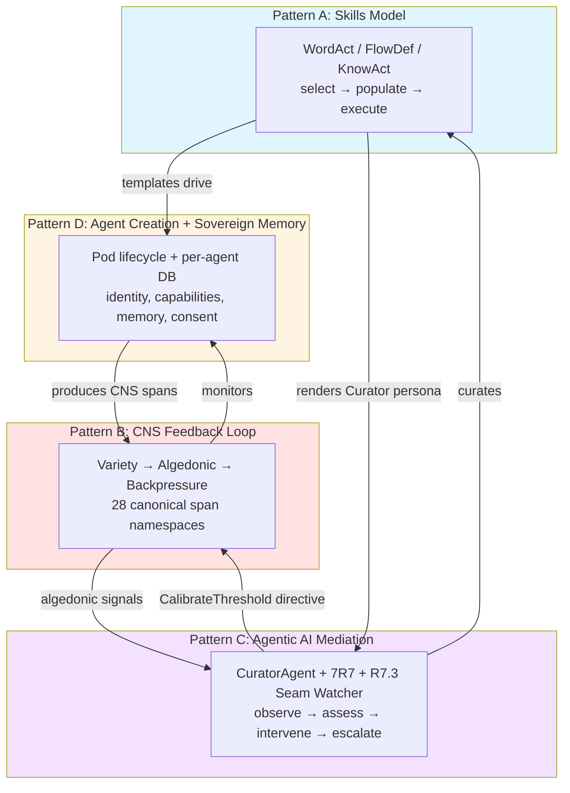
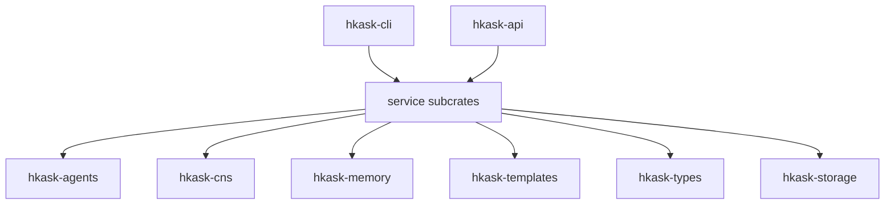
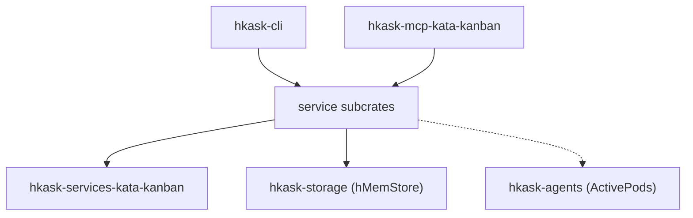
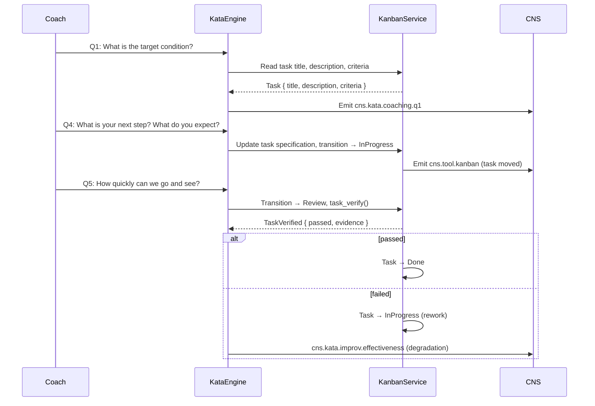
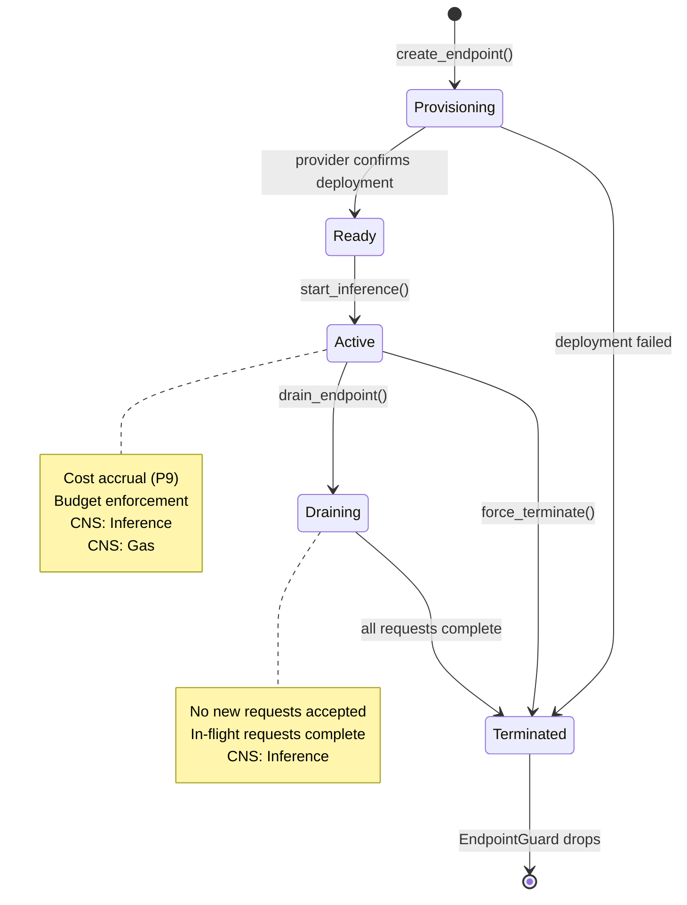
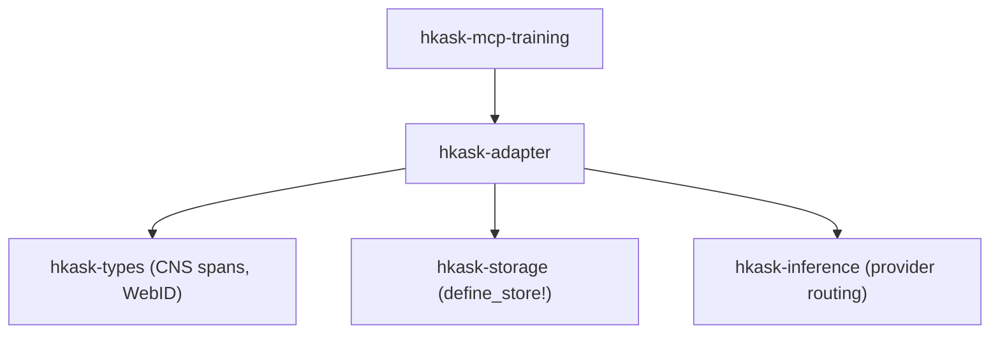
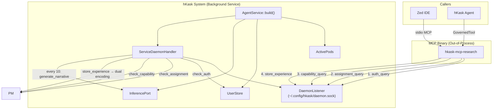
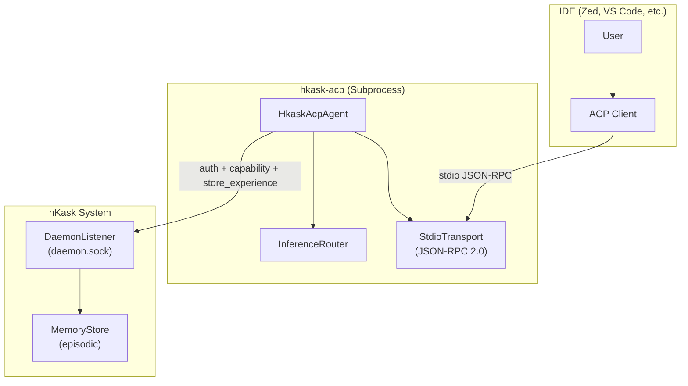

# hKask Architecture Master

**Purpose:** Index to the authoritative architecture documents and the four essential architectural patterns that constitute hKask's irreducible core.

**Project:** hKask (ℏKask - "A Minimal Viable Container for Replicants") v0.31.0
**Binary:** `kask`  
**Crate prefix:** `hkask-`

---

## The Four Essential Patterns

hKask's architecture is governed by **four irreducible patterns** that compose into a single cybernetic whole. Remove any one and the system collapses into a qualitatively different — and non-viable — system. These patterns were identified through systematic pragmatics review (pragmatic-semantics + pragmatic-cybernetics + pragmatic-laziness + essentialist + coding-guidelines) and stress-tested via Socratic interrogation (grill-me).

### Pattern A: The Skills Model — WordAct / FlowDef / KnowAct

**What it is:** A tripartite template type system that governs how hKask composes behavior. Mirrors the structure of human cognition: speech acts (WordAct), procedural memory (FlowDef), and metacognition (KnowAct).

| Type | Format | Governs |
|------|--------|---------|
| **WordAct** | Jinja2 `.j2` | "What to say" — system prompts, persona definitions, performative utterances |
| **FlowDef** | YAML `.yaml` | "What to do" — `select → populate → execute` cascade, choice/escalate/abort/delegate verbs |
| **KnowAct** | Jinja2 `.j2` | "How to think" — pattern recognition, classification, reflection, calibration |

**Key properties:**
- Selection intelligence lives in **Jinja2/LLM**, not Rust code (P3 Generative Space)
- `ManifestExecutor` drives the cascade: render selector → LLM → parse JSON → follow chosen path
- Cascade is recursive — a FlowDef step can contain nested WordAct/KnowAct/FlowDef, bounded by matryoshka limit (7)
- Specifications are FlowDef manifests — not a separate type (unification principle)
- Energy-accounted and OCAP-gated: every execute step goes through `GovernedTool`
- **PDCA convergence**: Skills declare `convergence.threshold` (quality gate) and iterate via `loop` actions until metric ≤ threshold or `max_iterations` exhausted
- **Dual gas budget**: `gas` (compute cycles, caps loop iterations) and `rjoule` (inference energy, caps LLM spend). System constant: 1 rJ = 250,000 gas cycles (`RJOULE_TO_GAS`)
- **Conditional steps**: Steps may declare `condition` expressions (`"var"`, `"NOT var"`, `"a AND b"`, `"a OR b"`) evaluated against context
- **Compound convergence**: Bundle-delegated skills aggregate via `all_converged`, `min`, or `weighted_avg` methods
- **Timeout enforcement**: Per-step `timeout_seconds` enforced via `tokio::time::timeout` on inference calls

**Crates:** `hkask-templates`, `hkask-types` (lexicon, BundleManifest)

**If removed:** System becomes a tool executor with monitoring — can do things but can't compose behavior, select strategies, or render personas. P3 and P8 violated.

#### Skill Artifact Model: Single Source of Truth

The canonical source of truth for every skill is its **registry crate** (`registry/templates/<name>/manifest.yaml` + `*.j2` templates). This is the **primary runtime artifact** — it is what `ManifestExecutor` drives, what `SqliteRegistry` indexes, and what the cascade dispatches at inference time.

The **SKILL.md** file (`.agents/skills/<name>/SKILL.md`) is a **generated companion** — a markdown rendering of the registry's structure and intent, produced for the Zed coding agent during development. It is not a co-equal source of truth.

**Derivation rule:** SKILL.md is derived from `manifest.yaml` + `*.j2` templates, not independently authored. The derivation path is:

```
manifest.yaml + *.j2  ──[skill-translator reverse]──▶  SKILL.md
       ↑                                                    │
       └──────────── source of truth ──────────────────────┘
```

**Consequences:**
- A skill with only a registry crate is **complete** — the cascade can execute it. No SKILL.md is required for runtime correctness.
- A skill with only a SKILL.md is **incomplete** — it cannot execute in the cascade. The registry crate must be created.
- When both exist, the registry is authoritative. Any drift between SKILL.md and registry is a defect in SKILL.md, not in the registry.
- The skill health score no longer deducts for missing SKILL.md. It deducts for missing registry (critical: −0.50) and for content drift between layers (medium: −0.10).

**Motivation:** This decision eliminates the cross-layer consistency maintenance burden. Prior to v0.28.0, SKILL.md was treated as a co-equal artifact, requiring manual synchronization. The dual-source model violated P5 (Essentialism) by duplicating skill semantics across two independently-authored formats. The unified model aligns with P3 (Generative Space): selection intelligence lives in Jinja2/LLM, not in markdown instructions.

#### Template Header Standard

<!-- Content provenance: absorbed from docs/architecture/reference/template-header-standard.md during 2026-06-24 consolidation -->

Every Jinja2 template and YAML manifest carries a header identifying its functional role:

**Jinja2 template header format:**
```
{# Template: {path_from_templates_dir} #}
{# Functional Role: {WordAct|FlowDef|KnowAct} (description) #}
{# Implementation: Jinja2 prompt #}
{# Produces: {output_artifacts} #}
{# {template_title} #}
```

**YAML manifest header format:**
```
# {Manifest Name}
# ℏKask {version} — {description}
# Functional Role: FlowDef (process orchestration)
# Implementation: YAML manifest
# Steps: {step_list}
```

**Functional Role quick reference:**

| Role | Keyword | Test |
|------|---------|------|
| **WordAct** | action-word | Does it produce an output artifact (message, span, hMem)? |
| **FlowDef** | flow-definition | Does it define a sequence of steps or stages? |
| **KnowAct** | knowledge-action | Does it produce a decision, judgment, or assessment? |

### Pattern B: The CNS Feedback Loop — Cybernetic Self-Regulation

**What it is:** The autonomic nervous system of hKask — a complete cybernetic system per Beer's Viable System Model (S1–S5). Not passive monitoring; active *regulation*.

```
Sensor (MCP dispatch, CNS spans) → Model (VarietyTracker, ν-event store, GasBudget)
    → Comparator (AlgedonicManager, SetPoints, Dampener)
    → Regulator (CurationLoop, CuratorAgent, BackpressureSignal)
    → Actuator (GovernedTool, OCAP dual gate, CircuitBreaker)
    → Verifier (ImpactReport, StagnationDetector, RegulationPolicy)
    → Sensor (loop closes)
```

**Key properties:**
- **Variety is the core metric.** Ashby's Law: `VarietyTracker` counts distinct states per domain over 60s window. Deficit = expected − observed. Drives all escalation.
- **Energy tracking subsumed rate limiting.** Least action principle as infrastructure: every operation costs gas (action in configuration space). Budget cap = max action per session.
- **Algedonic pathway is unidirectional.** Cybernetics *signals* Curation via alerts; Curation *regulates* Cybernetics through `CuratorDirective::CalibrateThreshold` on a direct `mpsc` channel → `CnsRuntime::calibrate_threshold()`.
- **94 canonical CNS span variants (v0.31.0).** Every dimension observable: tools (15 MCP subsystems including Curator), inference, agent pods, gas, curation, sovereignty (5 spans for consent, portability, governance transparency), specs, chat, memory, wallet (10 sub-spans), architecture (seam coverage/drift), contracts (6 spans), ACP (replicant memory, IDE connection), SLOs, kata, skills, federation (14 spans), QA (4 spans), healing, sessions, backup (3 spans), storage, media, codegraph (2 spans for index staleness and context efficiency), platform metrics (11 spans for PaaP/DORA/SPACE/Loyalty), regulation (4 spans for impact verification, action substitution, action blocking, regulatory plateau detection). See `CnsSpan` enum in `crates/hkask-types/src/cns.rs` for the authoritative registry.
- **Good Regulator contract enforced.** CNS variety counter IS the regulator's model. `DefaultSpecCurator` detects spec drift (model-reality divergence).
- **Regulation is policy-driven.** `RegulationPolicy` consolidates `(metric, deviation) → (actions, thresholds)` into a pure-data type. Each `RegulationRule` defines a substitution ladder, stage/block thresholds, and stagnation detection — replacing the former scattered `classify_decision` and `default_substitution_ladder` free functions.
- **Sensor providers are pluggable (Fermi Extractor pattern).** `SensorProvider` trait decouples metric sensing from the regulation loop. `SensorRegistry` holds providers; `CyberneticsLoop::sense()` walks them. Current providers: `EnergyBudgetSensor`, `VarietySensor`, `WalletKeyHealthSensor`.
- **Regulation history tracked.** `CnsRuntime` maintains a `regulation_history` ring buffer (100 entries) of `RegulationCycleEntry` records, exposed via `regulation_history(n)` for Curator queries.
- **Metacognition sees regulation effectiveness.** `HealthSnapshot.regulation_effectiveness` (0.0–1.0 ratio of accepted actions) is read from `CnsRuntime::regulation_health()` during metacognition sense.
- **Five-phase loop closure.** The cybernetic cycle is now `sense → compare → compute → act → verify`, with `verify_impact()` producing `ImpactReport` with `ActionDecision::Accept | Stage | Block`. `StagnationDetector` tracks repeated ineffectiveness; `RegulatoryPlateau` escalates when all substitution alternatives are exhausted.
- **CNS spans: `cns.regulation.*`.** Four new span kinds emitted during regulation: `ImpactVerified`, `ActionSubstituted`, `ActionBlocked`, `RegulatoryPlateauDetected`. Stored in `cns.regulation` namespace, visible to algedonic queries.
- **Statistical tool learning.** `ToolStats` records per-tool gas costs and success/failure outcomes at settle time. Fits LogNormal cost distributions (reserve at p90 instead of point estimate) and tracks Beta reliability (pre-escalate when P(success) < 0.80). Wired into `GovernedTool` for distribution-based reserving; `ToolReliabilitySensor` feeds reliability into the regulation pipeline.
- **Set-point auto-calibration (v0.32.0).** `SetPointCalibrator` closes the Conant-Ashby loop: the CNS observes its own regulation effectiveness via `NuEventStore` replay and self-tunes `SetPoints` within bounded ranges. Plateau detection widens stagnation thresholds; action blocks tighten worsening ratios; repeated substitutions decrease the substitution delay. Spawns as a background task alongside `CalibratedEnergyEstimator`; defaults to 1-hour interval with a 50-event minimum before any adjustment. Configure via `HKASK_SET_POINT_MIN_OBSERVATIONS`.
- **Contract violations feed CurationLoop (v0.32.0).** `contract.violated` span category added to `ALGEDONIC_SPAN_CATEGORIES` — contract violations emitted by `emit_contract_violated()` now flow through `query_algedonic()` into the `CurationLoop`'s sense phase for curator review.
- **ObservableSpan trait extended (v0.32.0).** `to_event()` produces a `NuEvent` from any typed span; `emit_to(sink, observer, phase, observation)` persists through the NuEventSink and falls back to log-only on failure. The trait bridges typed spans (`CnsSpan`, `WalletSpan`, `InfraSpan`, etc.) to durable NuEvent persistence.

**Crates:** `hkask-cns`, `hkask-types` (CNS types, SpanNamespace)

**If removed:** System becomes a runaway agent platform — agents act without regulation, resources deplete without backpressure, failures accumulate without detection. P9 violated entirely. P5 loses CNS sensors.

### Pattern C: Agentic AI Mediation — Curator + 7R7

**What it is:** The meta-agent layer that maintains and curates the stack. Embodies the cybernetic separation of observation from decision.

| Component | Role | Authority |
|-----------|------|-----------|
| **7R7 Listener** | Passive observer — polls Matrix rooms, emits CNS spans | **Zero.** Does not classify, escalate, moderate, or judge. |
| **R7.3 Seam Watcher** | Public API contract observer — loads seam inventory, tracks per-crate test coverage as CNS variety dimensions, detects drift, emits algedonic alerts on degradation | **Zero.** Observes and reports. Does not write tests, modify code, or block builds. |
| **CurationLoop** | Pure regulatory — sense/compute/act cycle | **Regulatory.** Compares variety, emits directives. |
| **CuratorAgent** | Persona layer — template-driven metacognition (KnowAct templates via `execute_knowact()`), spec curation, human-facing reporting, bot orchestration, Matrix standing-session posting | **Decisional.** Invokes LLM for calibrated decisions; formats directives; pursues goals; escalates to human. |

**Key properties:**
- **Singleton invariant.** Exactly one `CuratorAgent` per system (VSM S4 — Intelligence). Multiple Curators would produce conflicting assessments.
- **Dual-presence in CLI/REPL.** Human replicant + Curator daemon co-present in the interaction loop. User speaks; Curator observes, surfaces CNS alerts, provides memory summaries.
- **Curator never bypasses OCAP.** Can recommend actions, cannot execute without capability tokens. No `sudo`.
- **Template-driven metacognition (P3).** `MetacognitionLoop::compute_with_templates()` invokes `curator/metacognition-diagnose.j2` via `ManifestExecutor::execute_knowact()`. The LLM produces a `diagnosis` + `remediation_plan` with calibrated actions (`adjust_budget`, `restart`, `rebalance`, `calibrate`, `escalate`). Falls back to Rust threshold logic (`compute_with_thresholds()`) when no `ManifestExecutor` is configured (standalone CLI). Circuit breaker: 3 consecutive failures → skip template for 5 cycles.
- **CAT communication posture.** `MetacognitionLoop` evaluates Matrix messages through `cat::evaluate()` — a pure-function engagement gate based on Communication Accommodation Theory. Before the gate, `condenser/condenser_score_saliency` scores message relevance via ontology graph proximity (P5.4): persona (charter-anchored), episodic memory (PKO process domain), or semantic memory (DC+BIBO document domain). The score modulates `convergence_bias` — domain-relevant messages pull the agent toward stronger engagement.
- **OCAP-gated directives.** `CuratorContext::issue_directive()` verifies `handle.can_write(&DataCategory::Public)` before every directive issuance (Magna Carta Curator Responsibility #1).
- **Bot orchestration.** When the LLM produces `restart`/`rebalance` actions, `MetacognitionLoop::act()` calls `direct_bot()` via A2A before posting escalation entries.
- **Matrix standing session.** `CuratorService::metacognition()` posts the generated summary to the Curator's Matrix room via `MatrixTransport::send_message()` when `HKASK_CURATOR_ROOM_ID` is configured.
- **Spec drift is a cybernetic signal.** `DefaultSpecCurator` detects when specs diverge from implementation → `SpecDriftAlert` → Conant-Ashby violation → revise spec, not suppress alert.
- **7R7 is a dumb pipe by design.** Transport moves messages; agents decide what they mean. Authority resides in agent layer, not transport layer.
- **R7.3 watches the public seam.** `SeamWatcher` loads the machine-readable public seam inventory (embedded JSON at compile time, file path override for development), registers per-crate coverage as CNS variety domains (`seam:{crate_name}`), runs periodic drift checks (default: 30 min), and emits algedonic alerts when coverage degrades. Coverage improvements emit positive `Notify` signals. The watcher is non-fatal — if no inventory is available, seam watching is silently disabled.

**Crates:** `hkask-agents` (curator, curator_agent), `hkask-communication` (Matrix transport, agent registry, 7R7 listener, CNS bridge, response dispatch), `hkask-cns` (seam_watcher), `hkask-mcp-cloud-gateway` (cloud transport adapter), `hkask-cli` (token issuance)

**If removed:** System becomes a headless automaton — runs, monitors itself, but nobody reads the monitors. CNS fires alerts into a void. P12 partially violated.

##### Curator Persona & Behavioral Specification

<!-- Content provenance: absorbed from docs/architecture/reference/hKask-Curator-persona.md during 2026-06-24 consolidation -->

The Curator is a **daemon**, not a replicant — always running, hosts daemon-level operations, responds in <3s latency target. Persona traits:

| Trait | Standard |
|-------|----------|
| **Direct** | Answer immediately, no preface or postscript |
| **Technical** | Precise terminology, no marketing language |
| **Concise** | No filler words, no pleasantries, no hedging |
| **No preamble** | Never starts with "Great", "Certainly", "Let me" |
| **No emoji** | Zero emoji usage, ever |
| **No filler** | Never asks unnecessary follow-up questions |

**Required patterns:** Direct answer first; minimal verbosity; stop after task completion; technical precision; code in monospace. **Forbidden patterns:** No "Great!" or enthusiasm markers; no emojis; no preamble/postamble; no unnecessary questions; no filler transitions.

### Pattern D: Agent Creation with Sovereign Memory

**What it is:** The pod lifecycle — how agents come into existence with their own identity, capabilities, memory, and consent boundaries.

```
Creation (kask pod create) → Populated → Registered → Activated → Deactivated
                              ↓
                        Operating Modes: Chat (H2A) | Server (A2A)
                              ↓
                        Sovereign Memory: per-agent SQLCipher DB
                              ↓
                        Boundaries: OCAP dual gate + Visibility gating + ConsentManager
```

**Key properties:**
- **Separated key responsibilities.** OCAP capability signing uses the system/A2A signing authorities. SQLCipher databases consistently use `HKASK_DB_PASSPHRASE`, resolved through `hkask-keystore`; database encryption keys are not derived from WebIDs.
- **Mode mutual exclusion (initial).** Chat OR Server, not both. Safety boundary: prevents context leakage between human dialogue and tool serving (P11).
- **Server mode flow.** 4 gates: `kask login → pod assign → pod mode server → IDE spawns MCP binary → daemon auth → assignment → capability → serve`.
- **Canonical agent registry schema.** Agent definitions are parsed from YAML into `hkask_types::agent_registry::AgentDefinition` and persisted verbatim by storage. `rights`/`responsibilities` are tagged enums (e.g., `read`, `write`, `perform`, `emit`); flat legacy records are not accepted.
- **Dual memory encoding.** Every tool call → `record_experience()` → daemon `store_experience` → episodic (private) + semantic (public). Every 10 experiences → `generate_narrative()`.
- **No cross-agent memory access.** `EpisodicMemory::query_for_deduped` filters by `perspective == Some(agent_webid)`. Semantic memory is public. P11: right to choose public/private extends to agents.
- **Default is private — sovereignty fails closed.** `Visibility::Private` default. `ConsentManager` requires explicit affirmative consent for visibility transitions.

**Crates:** `hkask-agents` (pod), `hkask-memory`, `hkask-storage`, `hkask-keystore`

**If removed:** System becomes a library, not a platform — all infrastructure for agency exists but no agents to inhabit it. P6, P10, P11, P12 violated.

### Pattern D.1 — AgentPod as Solid Pod Isomorphism

**What it is:** The architectural grounding of the agent pod in the five invariants that define a Solid Pod: (1) per-user WebID-grounded identity, (2) self-contained storage, (3) capability-based access control, (4) interoperable data as linked-data triples, (5) the pod IS the deployment unit.

This isomorphism was the original architectural intent, as evidenced by the deployment model's backup design ("Backup as portable archive. Encrypted SQLCipher file. Export from one server, upload to another"). The migration from centralized `PodManager` to per-pod `PodDeployment` was completed in v0.30.0.

<!-- Content provenance: absorbed from docs/architecture/core/SOLID_POD_ISOMORPHISM.md and docs/architecture/core/MULTI_POD_ARCHITECTURE.md during 2026-06-24 consolidation -->

##### Solid Pod Ontological Model (RDF/Turtle)

A Solid Pod is defined by five invariants with W3C Solid spec references:

```turtle
@prefix solid: <https://www.w3.org/ns/solid/terms#> .
@prefix foaf:  <http://xmlns.com/foaf/0.1/> .
@prefix acl:   <http://www.w3.org/ns/auth/acl#> .
@prefix ldp:   <http://www.w3.org/ns/ldp#> .

solid:Pod a ldp:Container ;
  solid:owner              _:webid ;
  solid:storage            solid:DataStore ;
  solid:accessControl      acl:Authorization ;
  solid:resourceContainment ldp:BasicContainer .

_:webid a foaf:Agent ;
  foaf:holdsAccount _:pod .
```

#### The Five Invariants Mapped onto hKask

| # | Solid Invariant | hKask Implementation | Status |
|---|----------------|---------------------|--------|
| 1 | WebID-grounded identity | `AgentPod.webid` + OCAP capability tokens anchored to system/A2A authorities | ✓ |
| 2 | Self-contained storage (LDP) | `PerPodStorage` with per-pod SQLCipher file at `{data_dir}/agents/{sanitized_name}/pod.db` | ✓ |
| 3 | Capability-based access (WAC/ACP) | `DelegationToken` + `CapabilityChecker` + OCAP dual gate | ✓ |
| 4 | Interoperable linked-data triples | `hMem` struct with entity/attribute/value/confidence/visibility | ✓ |
| 5 | Pod IS the deployment unit | `PodDeployment` owns its storage, CNS, and tools directly. `PodDeployment` includes `pod_kind`, `semantic_index`, and per-pod CNS runtime. `PodManager` deleted. `PodFactory` is stateless. | ✓ |

#### Three-Tier Pod Architecture (v0.30.0)

hKask extends the Solid Pod isomorphism into three pod tiers:

| Tier | `PodKind` | Filename | Owner | Semantic Behavior |
|------|-----------|----------|-------|-------------------|
| **CuratorPod** | `Curator` | `agents/curator/pod.db` | System (singleton) | `SemanticIndex` owner — aggregates Public hMems from all pods |
| **TeamPod** | `Team` | `agents/team.{name}/pod.db` | Shared bots | Bots share episodic storage; semantic published to Curator |
| **ReplicantPod** | `Replicant` | `agents/replicant.{name}/pod.db` | Human+replicant pair | Episodic private; semantic published to Curator |

**Startup order:** CuratorPod → TeamPods → ReplicantPods (on demand).
**Data flow:** `store_semantic()` writes locally → CNS event `cns.semantic.published` → `CuratorSync` polling loop opens source pod read-only → inserts Public hMems into `SemanticIndex` with cursor tracking.
**Semantic recall:** `PodContext::recall_semantic()` routes through Curator's `SemanticIndex` for merged-lens view when Curator is active; falls back to local storage.
**Full spec:** [`MULTI_POD_ARCHITECTURE.md`](#three-tier-pod-architecture-v030)


#### PodDeployment — The Canonical Type (v0.30.0)

`PodDeployment` is now the canonical pod type. `PodManager` has been deleted.

```rust
pub struct PodDeployment {
    pub pod_id: PodID,
    pub pod: AgentPod,
    pub storage: PerPodStorage,  // Per-pod SQLCipher file at {data_dir}/agents/{sanitized_name}/pod.db
    pub cns: PerPodCnsRuntime,    // Per-pod variety counters at cns.agent_pod.{pod_id}.*
    pub tools: PerPodToolBinding, // Per-pod MCP server bindings
}
```

**PodFactory** is the canonical constructor (1 public method: `deploy`).
**ActivePods** is the runtime registry (lightweight HashMap, no shared storage).
**PodRegistry** is filesystem-based discovery (scans `{data_dir}/agents/{name}/pod.db`).

**Full analysis:** [`SOLID_POD_ISOMORPHISM.md`](#pattern-d1--agentpod-as-solid-pod-isomorphism) (includes deployment types)

**Crates:** `hkask-agents` (pod, deployment), `hkask-storage`, `hkask-memory`, `hkask-keystore`

**If removed:** The system devolves into a shared multi-tenant service — agents are cache entries, not sovereign deployment units. P6, P11 violated (per-pod boundaries become advisory).


#### Agent Definition YAML (v0.30.0)

Every agent has a self-contained definition at `agents/{sanitized_name}/agent.yaml`.
This file is the canonical source for the agent's identity, charter, capabilities,
public/private directory declarations, and persona constraints.

**Creation paths:**
- **Onboarding (`register_replicant`):** Writes the full YAML during `kask chat` first run.
  Stored as `source_yaml` in the `agent_registry` SQL table so the REPL can load
  `persona_constraints` and `process_manifest` without re-reading from disk.
- **CLI registration (`agent_register`):** Writes YAML from WebID, agent type, and
  capabilities passed at the command line.
- **`ensure_agent_dirs` fallback:** Writes a minimal stub (directory declarations only)
  if no definition exists — prevents the full definition from being overwritten.

**YAML format:**
```yaml
agent:
  name: "Jacques (Zuck)"
  type: replicant
charter:
  description: "A helpful AI assistant"
capabilities:
  - tool:inference:call
  - tool:mcp:invoke
  - registry:episodic_memory:read
  - registry:episodic_memory:write
public_dirs:
  - artifacts
  - library
  - gallery
  - documents
  - adapters
private_dirs:
  - sessions
  - portfolios
```

**Loading order (REPL init, `/agent` command):**
1. Query `agent_registry.source_yaml` → `parse_agent_from_yaml()`
2. Fallback: read `agents/{name}/agent.yaml` from disk
3. If neither succeeds, agent runs without persona constraints or process manifest

This two-source approach ensures backward compatibility with pre-fix agents
(where `source_yaml` was a placeholder string) while maintaining filesystem
as the ground-truth canonical store.

**Relevant crates:** `hkask-services-onboarding` (creation), `hkask-cli` (CLI registration),
`hkask-types::agent_paths` (path resolution), `hkask-agents::yaml_parser` (parsing).


### How They Compose



**The composition chain:**
1. **Skills drive Agents.** Pods created from FlowDef templates. Personas are WordAct. Cognitive strategies are KnowAct. Templates are the loom; agents are the fabric.
2. **CNS monitors Agents.** Every tool call, inference, memory operation emits CNS span. Variety counter tracks behavioral diversity. Algedonic alerts fire on deficit.
3. **CNS signals Curator.** AlgedonicManager → RuntimeAlert → NuEventStore → CurationLoop reads via cursor → CuratorAgent assesses via metacognition. Contract violations flow through the same path.
4. **CNS self-tunes.** SetPointCalibrator queries regulation outcome events from NuEventStore, detects patterns (plateaus, blocks, substitutions), and adjusts SetPoints within bounded ranges — closing the Conant-Ashby loop.
5. **Curator regulates CNS.** `CuratorDirective::CalibrateThreshold` on direct `mpsc` channel → `CyberneticsLoop` → `CnsRuntime::calibrate_threshold()`. Brain regulates autonomic nervous system.
6. **Curator curates Skills.** `DefaultSpecCurator` evaluates coherence, detects drift, recommends revisions. Ensures template DNA stays aligned with implemented system.
6. **Agents produce CNS data.** Agency produces observability; observability enables regulation; regulation ensures healthy agency. Virtuous cycle.


## Deployment Model

**Decision (2026-06-17):** hKask deploys as a single cloud server. There is no client binary. Users access hKask through a browser: OAuth sign-in (GitHub/Google), then an xterm.js terminal connected via WebSocket. The server spawns `kask repl` on a PTY and pipes I/O.

### Topology

```
CLOUD SERVER (single binary, all crates compiled)
  Caddy (Docker) - TLS + reverse proxy
  Conduit (Docker) - Matrix homeserver
  hkask-mcp-cloud-gateway - mTLS + DelegationToken transport for remote MCP/ACP clients
  hkask-api - OAuth, WebSocket /terminal, backup endpoints
  hkask-services-runtime - daemon orchestration
  hkask-mcp - MCP server runtime
  hkask-agents - bot/replicant lifecycle
  hkask-cns - cybernetic nervous system
  hkask-codegraph - code understanding engine (tree-sitter, FTS5, recursive CTE, context assembly)
  hkask-wallet + hkask-memory - wallet and memory subsystems
  Per-pod SQLCipher files (`{data_dir}/agents/{sanitized_name}/pod.db`) — one database per agent, three-tier (Curator/Team/Replicant)

Access (all via HTTPS/Caddy):
  Browser (xterm.js) - primary terminal
  Browser (WSS chat) - streaming agent conversation (GET /api/v1/chat/ws)
  SSH (optional) - power users
  Matrix (Element) - chat clients
  mTLS (port 9443) - remote IDE agents and MCP servers
```

### Key Properties

- **Single binary.** All crates compiled. No Cargo features for client/server.
- **Browser-only access.** User visits a URL, signs in, gets a terminal. No install.
- **Per-pod storage.** Each agent owns its own SQLCipher file at `{data_dir}/agents/{sanitized_name}/pod.db`. No shared hMemStore. Data isolation is structural, not row-level.
- **Caddy + Conduit sidecars.** Docker containers. hKask generates config; user runs Docker.
- **Backup as portable archive.** Encrypted SQLCipher file. Export from one server, upload to another. No server-to-server protocol.
- **Wallet cloud-only.** Crypto operations never leave the server.

**Full plan:** `docs/plans/deployment-and-backup.md`

---

## User Roles

**Principle:** Two roles. One difference: what settings you can see.

| Role | Who | Privileges |
|------|-----|------------|
| **Admin** | One or more users. First admin runs `kask init`. | View/modify server config. Invite members. View all sessions. |
| **Member** | Users invited by an admin. | View/modify own settings. Cannot see server config or other users. |

**Design rules:**
- **Multiple admins.** Not a single root. Prevents bus-factor.
- **Invite flow.** `kask invite <email>` sends invitation. Invitee signs in via OAuth, auto-assigned Member role.
- **No role hierarchy beyond Admin/Member.** Third role must survive deletion test.
- **Role stored in `HumanUser.role`** (enum `Admin` | `Member`). Enforced by API middleware.
- **Admin-only endpoints:** `GET /api/v1/admin/config`, `POST /api/v1/admin/invite`, `GET /api/v1/admin/sessions`.

**CNS spans:** `RoleAssigned`, `InviteSent`, `InviteAccepted`.

### Identified Gaps (2026-06-17)

All gaps from 2026-06-15 are now closed. Current open gaps:

| Gap | Severity | Status | Description |
|-----|----------|--------|-------------|
| **Kata documentation narrative** | Low | **Open** | CNS narrative companion for kata coaching has not been commissioned. Decision deferred per Task 9. |
| **Skill ↔ MCP server documentation boundary** | Low | **Open** | Skills live in `.agents/skills/` (Zed agent layer) and `registry/templates/` (hKask runtime layer). MCP servers live in `mcp-servers/`. No unified "capability documentation" showing how a skill, its templates, and its MCP surface compose. Deferred per Task 9. |
| **utoipa annotation completeness** | Medium | **Open** | No `#[utoipa::path]` annotations found in `crates/`. The OpenAPI spec (`docs/generated/openapi.json`, 4454 lines) may be manually maintained. Unannotated endpoints are invisible to auto-generation. Task 6 audits this. |
| **Versioned documentation** | Low | **Open** | No versioning strategy for docs. As codebase evolves (kanban v2, kata refinements, additional MCP servers), documentation will drift again. Deferred per Task 9. |
| **LoRA store security model** | Medium | **Open** | Adapter ownership model (P12) is specified but threat model (adapter tampering, weight poisoning, provenance verification) is not documented. Deferred per Task 9. |
| **User roles undocumented** | Medium | **Resolved (2026-06-17)** | Two-role model (Admin/Member) with invite flow. Documented in User Roles section. |
---

## Document Hierarchy

```
core/magna-carta.md  ←  Foundation (4 inviolable principles)
       ↓
core/PRINCIPLES.md  ←  12 principles (P1-P12), constraint forces, 5 anchors
       ↓
   core/MDS.md      ←  Minimal Domain Specification (5 categories, 12 tools)
       ↓
   core/FUNCTIONAL_SPECIFICATION.md  ←  26-domain functional spec
       ↓
   core/TESTING_DISCIPLINE.md  ←  Property-based testing discipline
```

### Canonical Specifications

| Document | Purpose |
|----------|--------|
| [`core/magna-carta.md`](core/magna-carta.md) | User sovereignty charter — catch-and-release, affirmative consent, OCAP verification |
| [`core/PRINCIPLES.md`](core/PRINCIPLES.md) | 12 architecture principles (P1-P12), 5 anchors, anti-patterns |
| [`core/MDS.md`](core/MDS.md) | Minimal Domain Specification — 5 categories, 12 tools, completeness predicate |
| [`core/FUNCTIONAL_SPECIFICATION.md`](core/FUNCTIONAL_SPECIFICATION.md) | Functional specification — 26 domains, ER diagrams, goal-principle contract anchoring |
| [`core/TESTING_DISCIPLINE.md`](core/TESTING_DISCIPLINE.md) | Testing discipline — property-based testing, CNS verification, proptest framework |
| [`SPECIFICATION.md`](core/FUNCTIONAL_SPECIFICATION.md) | Functional specification — 26 domains, ER diagrams, goal-principle contract anchoring |
| [`CNS Domain Specification`](core/FUNCTIONAL_SPECIFICATION.md#cns-domain-specification) | CNS Domain Specification — 8 sub-domains, contract counts, Rust module mapping |
| [`hkask-ledger.md`](../reference/api/hkask-ledger.md) | Ledger specification — triple-entry accounting, three-domain schema |

**TUI specification** — 22 windows with 15 live domain bridges, ratatui+crossterm framework, Zed-style workspace model. See `crates/hkask-tui/` for implementation. Diagrams: [class hierarchy](../diagrams/class-tui-window-hierarchy.md), [event dispatch](../diagrams/flowchart-tui-event-dispatch.md), [workspace lifecycle](../diagrams/state-tui-workspace-lifecycle.md), [bridge wiring](../diagrams/flowchart-tui-bridge-wiring.md).

**Curator persona** — The Curator is the canonical system daemon. Defined in Pattern C above (§Curator Persona & Behavioral Specification).

| [`../plans/k8s-admin-guide.md`](../plans/k8s-admin-guide.md) | Kubernetes deployment and backup guide |
| [`hkask-codegraph`](../../crates/hkask-codegraph/) (plan absorbed into implementation) | CodeGraph crate — two-crate pattern, 10-tool MCP server, CNS integration |

### Supplementary Architecture Patterns

#### Six-Loop Architecture — Semantic Root-Cause Analysis

hKask decomposes into six authority loops organized as a **two-layer model** with crate-to-loop ownership:

| Loop | Layer | Role | Least Action Role | Key Crates |
|------|-------|------|-------------------|------------|
| **Inference (1)** | Domain | Model dispatch, provider selection, rJoule accounting | Varies model to minimize action per task | `hkask-inference`, `hkask-agents` (inference loop) |
| **Episodic Memory (2a)** | Domain | Private experience encoding, temporal attention, confidence decay | Selects most salient memories (fewest bits for most prediction) | `hkask-memory` |
| **Semantic Memory (2b)** | Domain | Shared h_mem publishing, triple storage, consolidation from episodic | Public knowledge with entropy-gated recall | `hkask-memory`, `hkask-storage` |
| **Curation (5)** | Meta | Spec drift detection, memory consolidation, catalog maintenance, metacognition | Observes system, recommends minimal interventions | `hkask-agents` (curator), `hkask-cns` (curation) |
| **Cybernetics (6)** | Meta | CNS homeostatic control, algedonic escalation, variety engineering, regulation policy | Maintains Ashby-requisite variety with minimal energy | `hkask-cns`, `hkask-types` |
| **Snapshot (6b)** | Meta | Scheduled CAS repository snapshots, retention policy enforcement | Periodic state capture for disaster recovery | `hkask-cns` (snapshot_loop) |

**Communication is demoted to transport.** The Communication loop is not a conceptual loop — it's a `tokio::mpsc` channel connecting Curation to Cybernetics. Transport moves messages; agents decide what they mean.

##### Rate Limiting Subsumed by Energy Tracking

Every rate limit is an energy constraint over a time window — a strict semantic subsumption:

| Rate Limiting Concept | Energy Tracking Equivalent |
|-----------------------|---------------------------|
| Token bucket capacity | `GasBudget` allocation |
| Refill rate | `ReplenishmentCycle` |
| Window (sliding/fixed) | `ReplenishmentCycle` period |
| Throttle / backoff | `DepletionSignal` + `BackpressureSignal` |
| 429 Rate Limited | `GasBudget.try_consume()` → `Err(InsufficientEnergy)` |

**Deeper reason: least action.** Energy tracking is the computational expression of the least action principle. Every operation costs gas because every operation has an action cost — the "distance" the system moves in configuration space. Rate limiting was a lossy projection of action tracking — energy tracking is the direct measurement.

**Consequence:** `RateLimiter`, `CnsTokenBucket`, and sliding window types were removed. Remaining external-boundary rate limiting (API gateway WAF, OAuth, IP bans) are system infrastructure, not architecture.

##### Crate-to-Loop Mapping

| Crate | Loop | Rationale |
|-------|------|-----------|
| `hkask-inference` | Inference | Provider dispatch, model selection |
| `hkask-agents` (inference loop) | Inference | LLM API connectivity, prompt execution |
| `hkask-memory` | Memory | Episodic + semantic encoding |
| `hkask-storage` | Memory | hMem store, queries |
| `hkask-mcp-memory` | Memory | Memory search/consolidation |
| `hkask-agents` (curator) | Curation | CuratorAgent, CurationLoop |
| `hkask-condenser` | Curation | Context window condensation |
| `hkask-cns` (seam_watcher) | Curation | Spec drift, contract coverage |
| `hkask-test-harness` | Curation | QA runs, fuzzing infrastructure |
| `hkask-cns` (algedonic, runtime) | Cybernetics | Alerts, variety tracking |
| `hkask-capability` | Cybernetics | OCAP enforcement, membranes |
| `hkask-mcp-cloud-gateway` | Cybernetics | Transport regulation |
| `hkask-templates` | Curation | Skill registry, FlowDef execution |
| `hkask-communication` | Transport | Matrix transport, 7R7 listener, CNS bridge, response dispatch |

**Shared substrate (no loop ownership):** `hkask-storage` (storage backend — v0.31.0: modularized into 9 sub-crates: `-core`, `-gallery`, `-kata`, `-hmem`, `-archive`, `-token_registry`, `-consent_store`, `-sovereignty`, `-escalation` behind a facade; 8 modules remain in facade), `hkask-types` (shared types), `hkask-codegraph` (code understanding engine — tree-sitter parsing, FTS5 keyword search, recursive CTE traversal, token-budgeted context assembly for LLM prompts). Every loop imports them; neither loop owns them.

**v0.31.0 additions:** `hkask-repl` (extracted from `hkask-cli/src/repl/`, uses `ReplHost` trait to bridge CLI cross-cuts), `hkask-codegraph` (code understanding engine — see below). See [ADR-046](ADRs/ADR-046-repl-extraction-path.md), [ADR-047](ADRs/ADR-047-storage-modularization.md).

##### CodeGraph — Native Code Understanding Subsystem

**What it is:** A self-contained code understanding engine that builds a semantic graph from Rust source code, stores it in SQLite, and exposes 11 MCP tools for agents to query, traverse, analyze, and assemble context from the codebase.

**Two-crate pattern** (matching `hkask-condenser` + `hkask-mcp-condenser`):
- `hkask-codegraph` — domain library: tree-sitter parser, indexer, graph engine (FTS5 search, recursive CTE traversal, PageRank), dead code analysis, context assembly
- `hkask-mcp-codegraph` — thin MCP wrapper: 11 tools, OCAP-gated, capability tier enforcement, embedding router integration

**Key design invariants:**
- **G1**: Per-file SHA-256 hash-on-read — incremental indexing skips unchanged files
- **G2**: "Parse parallel, write serial" — rayon for CST parsing, serialized SQLite writes
- **G12**: Context feedback loop — `codegraph_feedback` records symbol usage ratio, tunes future assembly
- **X6**: Index staleness — `IndexPipeline::staleness_seconds()` feeds CNS for algedonic alerts

**SQLite-native graph (no external DB):** 3 base tables (`code_files`, `symbols`, `edges`), 2 virtual tables (`symbols_fts` for FTS5 keyword search, `symbols_vec` for sqlite-vec semantic search), 9 indexes, 3 FTS5 sync triggers. All graph traversal is recursive CTE in SQL — no in-memory graph, no external graph database. WAL mode for concurrent readers during writes.

**11 MCP tools:**

| Tool | Query | CNS Span |
|------|-------|----------|
| `codegraph_query` | FTS5 BM25 search | — |
| `codegraph_traverse` | Recursive CTE (forward/reverse, depth-bounded) | — |
| `codegraph_impact` | Reverse traversal + risk classification (Critical/High/Medium/Low) | — |
| `codegraph_analysis` | Complexity hotspots (cyclomatic > 10) | — |
| `codegraph_dead_code` | Dead code detection (zero inbound non-test edges, non-public, not in test modules) | — |
| `codegraph_context` | FTS5 → PageRank sort → budget cap (512/2048/4096/8192 tokens) | — |
| `codegraph_structure` | Top symbols by PageRank | — |
| `codegraph_stats` | File/symbol/edge count + connectivity health | — |
| `codegraph_reindex` | Full workspace re-index (SHA-256 incremental) | `cns.codegraph.file_indexed`, `cns.codegraph.index_health` |
| `codegraph_feedback` | Context efficiency ratio (used/provided symbols) | `cns.codegraph.context_efficiency` |
| `codegraph_index_embeddings` | Jinja2 template → embedding API → sqlite-vec store | `cns.codegraph.embeddings` |

**CNS integration:** Two spans for cybernetic observability — `cns.codegraph.index_staleness` (seconds since last full index, drives algedonic alerts when stale) and `cns.codegraph.context_efficiency` (signal-to-noise ratio, enables self-tuning context assembly).

**OCAP governance:** All 11 tools are OCAP-gated through the standard MCP `CapabilityTier` mechanism. 8 tools call `ensure_indexed()` (lazy initialization) before executing; 3 tools (`stats`, `reindex`, `index_embeddings`) skip this guard.

**Crates:** `hkask-codegraph`, `hkask-mcp-codegraph`

**Current implementation diagrams:** [`class-codegraph-types.md`](../diagrams/class-codegraph-types.md), [`erd-codegraph-schema.md`](../diagrams/erd-codegraph-schema.md), [`flowchart-codegraph-pipeline.md`](../diagrams/flowchart-codegraph-pipeline.md), [`sequence-codegraph-agent.md`](../diagrams/sequence-codegraph-agent.md). The [`state-codegraph-pipeline.md`](../diagrams/state-codegraph-pipeline.md) document is a proposed lifecycle model, not current implementation behavior.

**Plan:** Original plan absorbed into the [`hkask-codegraph`](../../crates/hkask-codegraph/) crate (Complete — 22 tests, 11 tools, CNS integration)

**If removed:** Agents lose the ability to understand the codebase they operate on — all codebase context must be provided manually in prompts. Reduces agent autonomy from code-aware to text-only. P3 (Generative Space) partially degraded.

##### Capability Membranes — Cross-Loop Access Control

Every loop-to-loop interaction is governed by a capability membrane with explicit read/write/signal/never boundaries:

| Access | Meaning | Example |
|--------|---------|---------|
| **Read** | Can observe state | Curation reads `NuEventStore` |
| **Write** | Can modify state | Inference writes to episodic memory |
| **Signal** | Can send directive | Curation signals Cybernetics via `mpsc` |
| **Never** | Forbidden crossing | Inference never reads Curator's metacognition state |

| Membrane | Source → Target | Access | Mechanism |
|----------|----------------|--------|-----------|
| Inference → Memory | Inference → Memory | Write | `EpisodicMemory::store()` via OCAP |
| Memory → Curation | Memory → Curation | Read | `NuEventStore` cursor-based query |
| Curation → Cybernetics | Curation → Cybernetics | Signal | `CuratorDirective` on `mpsc` channel |
| Cybernetics → Curation | Cybernetics → Curation | Signal | `RuntimeAlert` → `NuEventStore` |
| Inference → Cybernetics | Inference → Cybernetics | Signal | CNS span per inference call |
| Cybernetics → Inference | Cybernetics → Inference | Signal | `BackpressureSignal`, `CircuitBreaker` |

**Cross-loop authority rules:** (1) No struct passes a membrane by value — all crossings are typed message types. (2) Every crossing is OCAP-gated via `GovernedTool` or `GovernedInference`. (3) Every crossing is energy-accounted via `GasBudget.try_consume()`. (4) Every crossing is CNS-observable — a span is emitted for every membrane crossing.

**Cycle-freedom guarantee:** The membrane graph is a DAG. Cybernetics ↔ Curation appears bidirectional but is directionally typed — signals differ (`CuratorDirective` vs `RuntimeAlert`), preventing infinite loops.

##### Self-Healing Architecture

Every fallible operation passes through a `SelfHealer`. Errors are signals that trigger autonomous recovery — graceful degradation is the LAST resort.

```
Error occurs → SelfHealer::attempt(error, context)
  → HealRegistry.find_strategy(error) → HealStrategy
    → HealAction: RunCommand | SetEnv | LoadDotEnv | CreateDefaultFile | RetryWithBackoff | ProposeCodeChange | Sequence
  → HealOutcome: Healed (retry) | Degraded (fallback) | Unhealable (escalate to Curator via CNS)
```

| What Self-Healing Can Modify | Runtime? | CNS Path |
|------------------------------|----------|----------|
| `.env` files | ✅ | `cns.heal.dotenv` |
| YAML manifests | ✅ | `cns.heal.file_created` |
| Jinja2 templates | ✅ | `cns.heal.file_created` |
| Environment variables | ✅ | `cns.heal.set_env` |
| Rust source code | ❌ (compiled) | `cns.heal.code_change_proposed` |
| File permissions | ⚠️ Advisory | `cns.heal.code_change_proposed` |

**Built-in strategies:** `missing-api-key` (load .env), `permission-denied` (chmod), `command-not-found` (install), `config-file-not-found` (create default), `network-error` (retry with backoff), `transient-retry` (exponential delay).

**Design constraints:** No runtime code modification; idempotent file operations; process-scoped env changes; full audit trail via CNS; never silently ignore errors.

<!-- Content provenance: absorbed from docs/architecture/energy-gas-payments-api-keys.md, specs/rjoule-cost-system.md, specs/hkask-ledger.md, specs/provider-intelligence.md during 2026-06-24 consolidation -->

#### Energy, Gas, and API Key System

The economic layer governs resource consumption across all surfaces.

##### Unit System

| Term | Definition | Unit |
|------|-----------|------|
| **rJoule (rJ)** | Base energy unit. 1 rJ = 1 USD (v1 peg). Internal representation in µrJ (integer). | rJ |
| **Gas** | Micro-subunit of rJoules. 1 rJ = 250,000 gas (`RJOULE_TO_GAS`). | gas |
| **Wallet** | HD wallet derived from WebID via `hkask-wallet`. Holds rJoule balance. | rJ balance |
| **Encumbrance** | rJoules reserved for an API key, locked against wallet balance during key activity. | rJ locked |
| **Allocation** | rJoule budget assigned to an API key at issuance, drawn from funding replicant's wallet. | rJ |

##### Dual-Track Cost Model (rJoule Cost System)

Two distinct cost tracks merge into a single rJoule total:

| Track | What It Measures | Methodology |
|-------|-----------------|-------------|
| **Gas** | Carbon shadow price of local processing (CPU, shell, orchestration) | SCI methodology: 0.02 kWh/function × 400 gCO₂e/kWh × $50/tonne → 100 gas/function = 400 µrJ |
| **API & Service** | Direct economic costs (LLM tokens, training, subscriptions) | Per-token pricing from provider classifier config, converted to rJ at 1:1 USD peg |

**CostTracker** aggregates: `gas_used × 2 + api_token_urj + training_urj` (subscriptions excluded from per-run totals). Five verification invariants: gas_mismatch, api_untracked, cap_exceeded, threshold_warning, missing_token_data.

##### API Key Lifecycle

Six-gate issuance: authentication → CNS history check → scope validation → purpose statement → rate limit feasibility → wallet balance check. Non-empty scope enforces URI path prefix match; mismatch returns `403 ScopeViolation`. Revocation triggers: 3 abuse alerts, >5 IPs in 1 hour, scope violation, or manual Curator directive.

##### Ledger — hMem-Entry Accounting

`hkask-ledger` provides immutable double-entry accounting serving three domains from a single SQLite schema:

| Domain | Namespace | What It Tracks |
|--------|-----------|---------------|
| **Cost** | `cost:*` | System costs (gas, API, training, subscriptions) |
| **Crypto** | `wallet:*` | Wallet transactions (Hedera, rJ token) |
| **Securities** | `portfolio:*` | Portfolio transactions (buy, sell, dividends) |

**Core invariants:** (1) Idempotency — same `reference` committed twice = no-op. (2) Double-entry — every transaction's postings sum to zero. (3) Immutability — no update or delete; balances always computed from postings. (4) Integer amounts — all in smallest unit (µrJ, µUSD, satoshis).

##### Provider Intelligence

Real-time provider cost tracking via the `ProviderIntelligence` trait (`discover()`, `usage()`, `actual_cost()`). Detects pre-paid→marginal pricing shifts. Adaptive monitoring frequency: <50% usage → daily check, 90%+ → 10-minute check. `CostRate` struct: `input_nj_per_unit`, `output_nj_per_unit`, `fixed_nj_per_call`, `is_marginal` flag. Per-provider profiles at `registry/providers/<name>.yaml`. Self-tracked providers (Brave, Firecrawl, Tavily, Exa) use persistent call counters in the ledger.

##### Gas Budget System

The gas budget system (`GasBudget`, `GasBudgetManager`, `GasCost`) provides dimensionless per-agent gas accounting with:
- Hold-settle pattern (reserve → execute → settle) with stale reservation auto-release (5 min timeout)
- Wallet-backed gas wallets (SQLite via `WalletStore`) as the primary spend path
- Gas budget fallback for agents without wallets
- Budget persistence across restarts with Well state (JSON: `{version: 1, budgets, well}`)
- Consumption velocity tracking per agent per tick
- Escalation via algedonic pathway when budgets or wallets are exhausted

See `docs/status/gas-budget-system-status.md` for implementation status.

##### Well & Wallet System

Wells (`WellManager`) produce gas/rJoule on a regulated schedule. Wallets (`WalletManager`) store per-agent balances backed by SQLite. The supply chain: Well → Wallet → Agent spend.

- **Well**: One default Well per installation. Auto-replenishes on each cybernetics tick. Admin-configured gas/rJoule rate. Exhaustion triggers algedonic alert with dampening.
- **Wallet**: Auto-created on replicant startup. Draws initial balance from Well. Auto-draws from Well on low balance during spend (synchronous, no tick delay).
- **Priority chain**: WalletManager (SQLite gas) → WalletBackedBudget (rJoule/Hedera) → GasBudget (dimensionless fallback).

See `docs/architecture/well-wallet-architecture.md` for full architecture.

---

## REPL Architecture

The interactive REPL (`kask chat`) implements four features that govern inference behavior. For browser-based streaming chat without a terminal, the WSS endpoint (`GET /api/v1/chat/ws`) provides the same memory pipeline and MCP tool integration over a persistent WebSocket connection. See `docs/plans/wss-chat-endpoint.md`.

### Context Injection

Conversation history is appended as a **suffix** (after the cache breakpoint) so the KV cache prefix — system prompt + template — remains identical across turns. Controlled by `ReplSettings.context_turns` (default 3, 0 = no history).

### Unbounded Tool-Use Loop

The REPL loops tool calls until the model stops requesting them, gated by `ReplSettings.tool_loop_limit` (default 21). Each iteration checks the gas budget via `GovernedTool` before executing. If the limit is hit, the loop breaks and returns the partial response — the system tells the model it can continue by asking.

### Auto-Condense

At 87.5% of the model's context window, old session history is condensed via the condenser domain crate (`hkask-condenser`). The condenser summarizes older turns into a compact form, freeing context space for new messages. Controlled by `ReplSettings.auto_condense` (default on). When off, the user must condense manually.

### Model Awareness

On model switch (`/model`), the REPL fetches metadata from the provider's listing endpoint:
- `context_length` — the model's native context window size (used by auto-condense)
- `supports_thinking` — whether the model supports thinking/reasoning tokens
- `capabilities` — model feature list (vision, tools, etc.)

Populated into `ReplSettings.model_meta` as read-only fields. Unknown until the first model detail fetch succeeds.

### ReplSettings

User-configurable inference parameters exposed via three surfaces:

| Setting | Type | Range | Default | Description |
|---------|------|-------|---------|-------------|
| `tool_loop_limit` | usize | ≥1 | 21 | Max tool-call iterations per turn |
| `context_turns` | usize | ≥0 | 3 | Past turns in context (0 = no history) |
| `temperature` | f32 | 0.0–2.0 | 0.7 | Sampling temperature |
| `top_p` | f32 | 0.0–1.0 | 0.9 | Nucleus sampling |
| `top_k` | u32 | ≥1 | 40 | Top-k filtering |
| `min_p` | f32 | 0.0–1.0 | 0.0 | Min-p threshold (0.0 = disabled) |
| `typical_p` | f32 | 0.0–1.0 | 0.0 | Locally typical sampling (0.0 = disabled) |
| `max_tokens` | u32 | ≥1 | 512 | Max completion tokens per call |
| `seed` | u32 or `off` | — | random | Deterministic seed |
| `gas_heuristic` | u64 | ≥1 | 500 | Per-turn gas reservation |
| `gas_cap` | u64 | ≥1 | 10,000 | Total session gas budget cap |
| `auto_condense` | bool | — | true | Auto-condense at 87.5% of context window |
| `model_meta` | read-only | — | None | Model context_length, thinking, capabilities |

### Magna Carta P3 — Equal Surface Exposure

All ReplSettings fields are equally exposed across:
- **REPL:** `/repl` slash command (show/set individual fields)
- **CLI:** `kask settings show|set|reset` commands
- **API:** `GET /api/settings` and `PUT /api/settings` endpoints

All three surfaces read/write the same `~/.config/hkask/settings.json` file. No settings are hidden, admin-gated, or surface-restricted.

**TUI launch:** `kask chat --tui` or `HKASK_TUI=1` (when built with the `tui` feature).

### Voice Interaction (Talk + Listen)

The REPL supports bidirectional voice interaction through the media MCP server (`hkask-mcp-media`):

| Command | Behavior |
|---------|----------|
| `/talk on` | Enable speech output — after each agent response, a speech summarizer condenses the output into 1-3 spoken sentences via LLM, then plays through ffplay |
| `/talk off` | Disable speech output |
| `/talk voice [DESC]` | Set or show the TTS voice profile (calls `voice_design` on media server, maps to ElevenLabs presets) |
| `/listen start [SECONDS]` | Record audio from microphone (default 30s), transcribe with word-level timestamps via `transcribe_bundle`, save as `TranscriptBundle` JSON |
| `/listen stop` | Show info about the last recording |
| `/listen view [FILE]` | Open TUI transcript viewer with word-level highlighting synced to audio playback (Richmond Gold #B79163) |

**Architecture:** `/talk` calls the speech summarizer (inference port) → `generate_speech` (MCP media) → ffplay. `/listen` calls `audio_capture` → `transcribe_bundle` (MCP media). Both use `GovernedTool` for OCAP-gated MCP invocation. The `TranscriptViewer` renders `TranscriptBundle` JSON using ratatui + ffplay subprocess.

### Fusion — Multi-Model Deliberation

Fusion is a **provider-agnostic, hKask-side orchestration engine**. It sends the user's prompt to a panel of models in parallel (each routing through its own provider via 2-letter prefix), collects their responses, then dispatches to a judge model operating in one of five deliberation modes.

**Opt-in:** Fusion is disabled by default. Enable with `HKASK_FUSION_JUDGE_MODEL` + `HKASK_FUSION_PANEL_MODELS` env vars, or `/fusion on` in the REPL.

**Default model set:**
| Role | Model |
|------|-------|
| Judge/Fuser | `deepseek-v4-pro` |
| Panel | `Kimi2.7`, `Qwen3.7 Max`, `GLM5.2`, `Minimax3` |

**Provider-agnostic routing:** Each panel model and the judge can route through different providers by prefixing the model name (`DI/`, `FA/`, `TG/`, `OR/`, `KC/`). Unprefixed names use the default provider. Example mixed-provider config:
```bash
HKASK_FUSION_JUDGE_MODEL=DI/deepseek-v4-pro
HKASK_FUSION_PANEL_MODELS=OR/auto,KC/anthropic/claude-sonnet-4.5,DI/qwen/qwen3
```

#### Deliberation Modes

The judge operates in one of five modes, configurable via `HKASK_FUSION_MODE`:

| Mode | Rounds | Behavior |
|------|--------|----------|
| `synthesis` _(default)_ | 1 | Judge composes a unified response incorporating best elements from all panelists |
| `best-of-n` | 1 | Judge evaluates all responses and picks the single best one |
| `critique` | 2 | Judge drafts synthesis → panel critiques draft → judge revises final |
| `deliberation` | ≤N | Multi-round: judge asks follow-ups, panel responds, converges or maxes out (configurable via `HKASK_FUSION_MAX_ROUNDS`, default 5) |
| `pi` (Plan-Implement) | 2-phase | Phase 1: panel proposes strategies → judge synthesizes plan. Phase 2: plan sent to panel for implementation details → judge synthesizes execution plan |

#### Skill Anchoring

The judge can be anchored on hKask's pragmatic methodologies via `HKASK_FUSION_SKILLS` (comma-separated). Each skill injects a compact methodology prompt into the judge's system context:

| Skill | Methodology |
|-------|-------------|
| `pragmatic-semantics` | IS vs OUGHT, certainty levels, provenance, constraint hierarchy (Prohibition—Hypothesis) |
| `pragmatic-cybernetics` | Feedback loops, variety engineering, homeostasis |
| `pragmatic-laziness` | Path of least action, delete before adding |
| `coding-guidelines` | Karpathy's 4 principles |
| `deep-module` | Deletion test, interface minimalism |
| `essentialist` | 3-gate challenge loop |
| `superforecasting` | Fermi decomposition, Bayesian updating |
| `mcda` | Weighted scoring, sensitivity analysis |
| `tdd` | Red-Green-Refactor, contract-first |

**Note:** `hypothesis-framer` and `idiomatic-rust` are listed in the skill catalog but not yet implemented as `FusionSkill` variants. To add them, extend the `FusionSkill` enum in `hkask-types/src/fusion.rs` and add a methodology prompt in `fusion_orchestrator.rs::skill_prompt()`.

,#### Per-Manifest Fusion Configuration

In addition to the global env-var config, each skill's flow manifest can declare its own `FusionConfig` via a `fusion:` block. This enables per-skill judge models, panels, deliberation modes, and skill anchors without affecting other skills:

```yaml
# In a flow manifest (e.g., registry/manifests/superforecasting.yaml)
fusion:
  judge: deepseek-v4-pro
  panel:
    - Kimi2.7
    - Qwen3.7 Max
    - GLM5.2
    - Minimax3
  mode: synthesis
  skills:
    - superforecasting
  max_rounds: 5
```

When the `fusion:` block is present, all `select` steps in that manifest use this config instead of the global config. Per-step `fusion: false` bypasses fusion for deterministic steps (convergence checks, quality gates).

**Resolution priority** (highest to lowest):
1. `step.fusion: Some(false)` → bypass fusion (single-model)
2. `step.dual_model: true` → bypass fusion (dual-model has its own mechanism)
3. `step.fusion: Some(true)` or `None` → inherit manifest config
4. `manifest.fusion: Some(config)` → per-manifest config (`LLMParameters.fusion_config`)
5. `manifest.fusion: None` → global config (`HKASK_FUSION_*` env vars)
6. `params.bypass_fusion: true` → bypass everything

**Types:** `FusionConfig`, `FusionMode`, `FusionSkill` live in `hkask-types::fusion` (shared across `hkask-templates`, `hkask-inference`). `LLMParameters.fusion_config: Option<FusionConfig>` carries the per-call override through the `InferencePort` trait.

**Dual-model classification** (orthogonal to fusion): When `step.dual_model: true`, the executor runs two peer models from different jurisdictions in parallel and merges JSON outputs via set union. This uses `HKASK_CLASSIFIER_MODEL_A` / `HKASK_CLASSIFIER_MODEL_B` (defaults: `KC/qwen/qwen3-235b-a22b-2507` and `DI/google/gemma-4-E4B-it`). Dual-model always bypasses fusion — the two systems solve different problems (deliberation quality vs. epistemic integrity).

**Bypass:** Chat uses the user's chosen model directly (`bypass_fusion=true`). Skills and tool invocations route through fusion when active (`bypass_fusion=false`). The condenser, daemon narratives, and summarization always bypass fusion.

**Configuration:**
| Env Var | Purpose |
|---------|---------|
| `HKASK_FUSION_JUDGE_MODEL` | Judge model (supports provider prefix) |
| `HKASK_FUSION_PANEL_MODELS` | Comma-separated panel models, 1-8 (each supports provider prefix) |
| `HKASK_FUSION_MODE` | Deliberation mode: `synthesis`, `best-of-n`, `critique`, `deliberation`, `pi` |
| `HKASK_FUSION_SKILLS` | Comma-separated skill anchors for the judge |
| `HKASK_FUSION_MAX_ROUNDS` | Max deliberation rounds (default: 5) |
| `HKASK_FUSION_DISABLED=1` | Disable fusion |

**REPL commands:** `/fusion` (status), `/fusion on`, `/fusion off`.

,**Crates:** `hkask-types` (`fusion.rs` — config types), `hkask-inference` (`config.rs`, `inference_router.rs`, `fusion_orchestrator.rs`), `hkask-templates` (`manifest.rs`, `executor.rs` — per-manifest fusion wiring).

---

## Service Layer

**Crates:** `hkask-services-core` through `hkask-services-wallet` — 11 specialized subcrates providing shared business logic for CLI and API surfaces. The service decomposition follows **Conway's Law** (Conway, 1968): each subcrate maps to a bounded context with its own CNS span domain, mirroring the separation of concerns between the Curator daemon, kata coaching loop, and domain services.[^conway]

**Canonical specification:** [`MDS-agent-service.md`](core/FUNCTIONAL_SPECIFICATION.md#15-service-layer-architecture) — full domain spec, accessor methods, depth test results, and service boundary definitions.

### Summary

The monolithic service layer crate has been decomposed into 10 specialized subcrates — `hkask-services-core`, `hkask-services-chat`, `hkask-services-compose`, `hkask-services-context`, `hkask-services-corpus`, `hkask-services-kata-kanban`, `hkask-services-onboarding`, `hkask-services-runtime`, `hkask-services-skill`, and `hkask-services-wallet`. The former curator subcrate was deleted (2026-07-11) — its metacognition functionality moved to `hkask-services-chat` and escalation CRUD to `hkask-services-context`. Each subcrate follows the deep-module discipline (≤7 public functions per module).

`hkask-services-context::AgentService` is a DI container with 30+ accessor methods, delegating to the specialized subcrates. Both CLI and API surfaces depend on individual subcrates directly rather than on a single monolithic service layer.

**Consolidation pattern:** Consolidation is routed through the relevant subcrate. CLI, API, REPL, and Curator daemon all route through service methods gated by P2 affirmative consent.

### Dependency Direction



Domain crates **never** depend on service layer subcrates. MCP servers **never** depend on service layer subcrates for orchestration (P1 Prohibition — out-of-process isolation). Tri-surface MCP servers (those that are direct surfaces for a service) may import specific service layer subcrates for delegation only — see constraint 1 below.

### Key Constraints

1. **MCP servers should not depend on service layer subcrates for orchestration** — P1 Prohibition (out-of-process isolation). Exceptions: servers that are direct surfaces for a service (CLI/API/MCP tri-surface pattern). `hkask-mcp-replica` is a tri-surface for `ComposeService` + `EmbedService`. Pure business logic lives in `hkask-storage::spec_types` (shared kernel). Neither server orchestrates — they delegate.
2. **Domain crates do NOT depend on service layer subcrates** — dependency direction is strictly surface → service → domain.


---

## Backup Subsystem

**Crates:** `hkask-mcp::GixCasAdapter` (pod-directory git operations), `hkask-services-context` (daemon loop)

**Tri-surface pattern:** CLI (`kask backup`), API, CNS daemon loop

### Summary

One git repo per pod. The pod directory IS the backup unit. `GixCasAdapter` tracks the directory via `gix` (pure Rust, no CLI subprocess), walking the file tree recursively and committing as git objects. No BLAKE3 CAS layer, no JSON envelopes, no artifact type routing, no 8 repos — the directory structure naturally encodes identity.

**Key components:**
- `GixCasAdapter::snapshot_pod_dir(dir, msg)` — walk tree → git blobs → tree → commit
- `GixCasAdapter::log_pod(dir, n)` — commit history with timestamps, newest first
- `GixCasAdapter::resolve_date(dir, target_secs)` — find commit nearest to a date
- `GixCasAdapter::restore_file_from_commit(dir, commit, file, dest)` — checkout file from commit
- `pod_backup_daemon` — 24h loop in `context_impl.rs`: iterate `ActivePods::pod_db_paths()`, snapshot each

**Pod directory structure (what gets tracked):**
```
agents/{name}/
├── .git/           ← one repo per pod, git init on first snapshot
├── pod.db          ← SQLCipher (all memory, hMems, embeddings, episodic, semantic)
├── pod.webid       ← sidecar
├── pod.kind        ← sidecar (curator/team/replicant)
├── artifacts/      ← public content
├── sessions/       ← private content
├── gallery/        ← media
├── library/        ← research
├── documents/      ← parsed docs
├── adapters/       ← LoRA weights
└── threads/        ← conversations
```

**Pod types (PodKind):** Curator pod, Team pod, Replicant pod — all backed up identically.

### User Commands

```bash
kask backup snapshot                    # snapshot all pods (manual trigger)
kask backup restore <pod> --date 2026-06-27  # restore pod.db by date
kask backup restore <pod> --commit HASH      # restore by commit hash
kask backup list                        # list snapshots with dates
kask backup status                      # config + last snapshot time
kask backup verify                      # integrity check
kask backup prune                       # retention cleanup
```

### Key Constraints

1. One git repo per pod — the pod IS the deployment unit (Solid Pod isomorphism).
2. `pod.db` is SQLCipher-encrypted — encryption at rest is handled by the database layer, not the backup layer.
3. Restore writes `pod.db` directly via `restore_file_from_commit`; the pod must be restarted to apply the change.
4. Date-based restore via `resolve_date`: walks commit log, finds nearest commit with timestamp ≤ target date.
5. The daemon loop (`pod_backup_daemon`) snapshots all pods every 24 hours, logging CNS spans per pod.

---

## Kanban Agent Coordination

**Crates:** `hkask-services-kata-kanban` (types + service + kata engine), `mcp-servers/hkask-mcp-kata-kanban` (MCP surface)

**Tri-surface pattern:** CLI (`kask kanban`), REPL (`/kanban`), MCP (18 tools via `hkask-mcp-kata-kanban`)

### Summary

Kanban provides headless task coordination for agents and replicants. Boards contain columns with WIP limits (Anderson, 2010) and tasks flow through state transitions. Tasks are created unassigned; an agent claims an unassigned task using the authenticated MCP WebID. Three skills compose the workflow.

| Skill | Purpose | Steps | Manifest |
|-------|---------|-------|----------|
| **Kanban Task Decomposition** | Break projects into INVEST-compliant tasks with recomposition strategy | 4 | `registry/manifests/kanban-task-decomposition.yaml` |
| **Kanban Task Delegation** | Spawn sub-replicants with OCAP capability packages | 2 | `registry/manifests/kanban-task-delegation.yaml` |
| **Kanban Task Management** | Monitor, coordinate, verify, de-jam | 6 | `registry/manifests/kanban-task-management.yaml` |

### Key Features

- **WIP limits** per column (Anderson §4: "limit WIP to expose problems")
- **CNS behavioral contracts**: task assignment uses `expect:` + `[P{N}]` with pre/post conditions
- **Kata integration**: coaching, improvement, and starter katas available as task primitives
- **Capability packages**: reusable delegation metadata exists, but the Kanban MCP does not verify its `capability_token` fields
- **Board templates**: `software-project`, `writing-project`, `scientific-research`, `investment-research`
- **De-jamming**: service support detects and proposes fixes for stuck tasks and stale assignments
- **LLM verification support**: the service can construct and consume an LLM verification result; the MCP `kanban_task_verify` tool completes from non-empty evidence instead
- **Persistence**: boards and tasks stored as RDF hMems via `hMemStore` (MDS §2)

### Dependency Direction



`hkask-mcp-kata-kanban` depends on `hkask-services-kata-kanban` — permitted as a tri-surface for KanbanService.

Kanban operations emit observability through `CnsSpan::Tool { subsystem: ToolSubsystem::Kanban }`.

See also: `docs/user-guides/kanban-user-guide.md`

---

## Kata — Cybernetic Capability Development

**Crates:** `hkask-services-kata-kanban` (KataEngine, KanbanService, PDCA→task mapping), `hkask-cns` (variety counters, algedonic alerts), `hkask-storage` (KataHistoryStore)

**Skills:** `.agents/skills/kata-starter/`, `.agents/skills/kata-improvement/`, `.agents/skills/kata-coaching/`, `.agents/skills/kata/` (bundle)

**Templates:** 23 Jinja2 templates across 4 skill directories, 5 YAML manifests, registered in `registry/templates/bootstrap-registry.yaml`

**MCP surface:** Kanban MCP (`hkask-mcp-kata-kanban`) exposes task-scoped Kata prompts. Full Kata execution is available through an optional `KanbanKataBridge` service configuration, not through those MCP prompt tools; see the [execution-boundary diagram](../diagrams/sequence-kata-kanban-execution.md).

### Summary

Kata implements the Toyota Kata methodology (Rother, 2009) as a cybernetic capability development system. Three independently usable skills compose through a bundle orchestrator, with CNS observing every practice, PDCA iteration, and coaching session. The kanban MCP surface provides task-based execution for kata experiments.

| Skill | Purpose | Steps | Templates | Manifest |
|-------|---------|-------|-----------|----------|
| **kata-starter** | Build foundational scientific thinking habits | 5 | 5 (4 FlowDef, 1 KnowAct) | `starter-kata.yaml` |
| **kata-improvement** | 4-step PDCA scientific pattern for capability gaps | 4 | 5 (1 FlowDef, 4 WordAct) | `improvement-kata.yaml` |
| **kata-coaching** | 5-question dialogue for teaching scientific thinking | 5 | 6 (1 FlowDef, 5 WordAct) | `coaching-kata.yaml` |

### Key Features

- **PDCA cycle with before/after metrics:** The `KataEngine` captures `metric_before` from CNS counters, executes the 4-step PDCA pattern, captures `metric_after`, and computes an `ImprovementSignal` (Positive/Negative/Stalled/NotMeasured)
- **Automaticity tracking:** Practice history stored in `data/kata-history.json` + SQLite (`KataHistoryStore`). Automaticity linearly approaches 1.0 over 21 consecutive practice days. 3+ day gaps trigger habit decay alerts
- **CNS variety counters:** `kata.practices.completed`, `kata.automaticity.score`, `kata.habit.formation` — baseline 5/week, +0.05/week, 1 per 21 days
- **Algedonic alerts:** Variety deficits exceeding threshold (default 100) emit `kata.algedonic` warnings
- **OCAP consent gates:** kata-starter (self-consent), kata-improvement (Curator), kata-coaching (Learner) — per P2 Affirmative Consent
- **Memory integration:** Every step produces a `StepExperience` recorded to episodic memory via dual-encoding pipeline
- **Kanban integration:** PDCA experiments map to kanban tasks; coaching 5 questions map to task fields; improvement cycles tracked as task state transitions

### Kata-Kanban-CNS Integration

<!-- Content provenance: absorbed from docs/architecture/kata-kanban-integration.md during 2026-06-24 consolidation -->

#### Coaching Loop



#### PDCA → Kanban State Mapping

| PDCA Phase | Kanban Status | CNS Event |
|------------|---------------|-----------|
| **Plan** | `Backlog` | task created |
| **Do** | `InProgress` | task moved |
| **Check** | `Review` | task verified |
| **Act** | `Done` | task completed |

Transitions: `Backlog → InProgress` (Q4), `InProgress → Review` (Q5), `Review → Done` (pass), `Review → InProgress` (fail).

#### CNS Span Trace

```
cns.kata.coaching.q1 → cns.tool.kanban (task created)
cns.kata.coaching.q4 → cns.tool.kanban (Backlog → InProgress)
cns.kata.coaching.q5 → cns.tool.kanban (InProgress → Review)
                   → cns.tool.kanban (TaskVerified)
                   → cns.tool.kanban (Review → Done or InProgress)
cns.kata.improv.effectiveness → variety_feedback → CNS homeostatic loop
```

#### Error Recovery

| Failure | Recovery |
|---------|----------|
| Verification failure | Task re-enters Q4-Q5 loop; after 3 consecutive failures, `kanban unjam` escalates |
| Task stall (>24h) | `kanban unjam` scans, CNS variety-deficit alert fires |
| Improv degradation | Switch improv mode, reduce scope, or return to Starter Kata drills |
| CNS span loss | Buffered in `CyberneticsLoop::process_inbox()`, retried, buffer overflow drops oldest |

---

## LoRA Adapter Lifecycle & Inference Composition

**Crates:** `hkask-adapter` (lifecycle, routing, store), `hkask-types` (CNS spans), `hkask-services-runtime` (orchestration)

**MCP surface:** Training via `hkask-mcp-training` (17 tools, 5 providers)

**Status:** Active — 48 tests, 45 public functions (17 exposed in lib.rs)

### Summary

`hkask-adapter` manages the full lifecycle of trained LoRA adapters — from training provenance through cloud deployment to cost-tracked inference and teardown. Every operation is OCAP-gated (P4). Every state transition emits a CNS span (P9). Every adapter has an owner WebID (P12).

| Component | Type | Purpose |
|-----------|------|---------|
| **Expertise** | Domain type | Semantic grounding: what the adapter was trained on (MdsDomain, TrainingProvenance) |
| **TrainedLoRAAdapter** | Domain type | Content-addressed, owner-scoped adapter with 12 fields (id, name, owner WebID, base_model, source, expertise, status, etc.) |
| **AdapterStore** | Persistence | SQLite CRUD via `define_store!` — store, retrieve, list, delete adapters |
| **AdapterRouter** | Composition | Composes adapter + base model + provider via `AdapterPort` trait (6 OCAP-gated methods) |
| **EndpointLifecycle** | Lifecycle | 5-phase state machine: Provisioning → Ready → Active → Draining → Terminated |
| **EndpointGuard** | Teardown | RAII guard ensuring resource cleanup (P5 — no leaked endpoints) |
| **CostModel** | Pricing | Per-provider transparent pricing (P2 affirmative consent) |

### Adapter Lifecycle State Machine



### Key Features

- **Content-addressed storage:** Adapters identified by content hash + owner WebID — no anonymous artifacts (P12)
- **Provider abstraction:** `AdapterSource` enum supports HuggingFace repos (extensible); providers: Together AI (real HTTP upload + inference), Runpod (vLLM skeleton), Baseten (vLLM skeleton)
- **Transparent pricing:** `CostModel` per provider — user sees cost before deployment (P2)
- **Budget enforcement:** `EndpointLifecycle` checks cost accrual against budget; `EndpointCostBudgetWarning` CNS span on threshold breach (P9)
- **OCAP-gated composition:** `AdapterPort` trait exposes 6 methods, each requiring a capability token (P4)
- **RAII teardown:** `EndpointGuard` ensures endpoints are terminated even on panic (P5)

### Dependency Direction



Adapter and endpoint operations emit observability through `CnsSpan::Tool { subsystem: ToolSubsystem::Training }`, `CnsSpan::Inference`, and `CnsSpan::Gas`.

See also: `docs/user-guides/lora-adapter-store-guide.md`, `docs/guides/lora-training-guide.md`

---

## Daemon & Replicant Server Mode

**Crates:** `hkask-mcp` (daemon transport), `hkask-services-runtime` (daemon handler), `hkask-agents` (AgentMode)

### Summary

Replicants can operate in **server mode**, presenting as MCP servers to IDEs (Zed, VSCode) and other hKask agents. The daemon — a Unix domain socket at `~/.config/hkask/daemon.sock` — mediates authentication, role assignment, capability verification, and dual memory encoding between out-of-process MCP binaries and the in-process agent stack.

### Architecture



### Startup Flow

1. `kask login <replicant>` — authenticate (creates session in UserStore)
2. `kask pod assign <replicant> <role>` — assign MCP role (P4 Gate 2: sovereignty/consent)
3. `kask pod mode <replicant> server -r <role>` — enter server mode (P4 Gate 1: OCAP)
4. IDE spawns MCP binary with `HKASK_MCP_HOST=<replicant>`
5. Binary connects to daemon → auth → assignment → capability → serve

### Memory Flow

- Tool calls → `record_experience()` (fire-and-forget from MCP binary)
- Daemon `store_experience` → dual encoding: episodic (first-person, private) + semantic (third-person, public)
- Every 10 experiences → `generate_narrative()` → inference analyzes session log → stores observations as episodic "narrative"/"thought"
- Existing consolidation pipeline extracts semantic knowledge from both streams

### Agent Modes

| Mode | Behavior | Mutual Exclusion |
|------|----------|-----------------|
| **Chat** | Conversational loop, calls tools via GovernedTool | Cannot coexist with Server (initially) |
| **Server** | Presents as MCP server(s), handles incoming tool calls, records episodic memories | Cannot coexist with Chat (initially) |

Concurrent chat+server mode planned for future release (3-6 months).

### Key Constraints

1. **P4 Dual Gate:** Every MCP server startup requires both capability verification (OCAP token) and assignment verification (sovereignty/consent).
2. **P2 Affirmative Consent:** Passphrase entry via `kask login` creates session. Daemon checks session existence — no passphrase stored with MCP binary.
3. **Out-of-process isolation:** MCP binaries communicate with hKask only through the daemon socket. No direct access to ActivePods, memory, or inference.
4. **Mode mutual exclusion (initial):** An agent can be in Chat mode OR Server mode, not both.

---

## ACP Replicant — IDE Agent Presence

**Crate:** `hkask-acp`, **Protocol:** [Agent Client Protocol](https://agentclientprotocol.com) (ACP)

### Summary

hKask agents can present themselves in any ACP-compatible IDE (Zed, VS Code with extensions, JetBrains) via the `hkask-acp` replicant. ACP is an open standard (agentclientprotocol.com) for bidirectional agent↔editor communication — distinct from hKask's internal A2A (Agent-to-Agent) protocol used for inter-agent template dispatch.

The ACP replicant runs as a subprocess spawned by the IDE, communicating via JSON-RPC 2.0 over stdio. It connects to the same daemon socket as MCP servers (`~/.config/hkask/daemon.sock`) for authentication, capability verification, and memory encoding. Inference is routed through hKask's centralized `InferenceRouter`.

### Architecture



### ACP Protocol vs MCP vs A2A

| Protocol | Direction | Purpose | Implementation |
|----------|-----------|---------|---------------|
| **ACP** (Agent Client Protocol) | Bidirectional IDE ↔ Agent | Streaming agent presence in editor: session lifecycle, content streaming, tool progress, permission requests, plan communication | `hkask-acp` (JSON-RPC 2.0 over stdio) |
| **MCP** (Model Context Protocol) | IDE → Server | Tool invocation: request/response tool calls | `hkask-mcp-*` (10 servers) |
| **A2A** (Agent-to-Agent) | Agent ↔ Agent | Inter-agent template dispatch, memory artifact routing, capability delegation | `hkask-agents::a2a` (A2ARuntime) |

### Prompt Turn Lifecycle

```text
initialize → session/new → session/prompt → [streaming loop] → stop_reason
                                              │
                                              ├─ agent_message_chunk
                                              ├─ tool_call (pending)
                                              ├─ tool_call_update (in_progress)
                                              ├─ tool_call_update (completed)
                                              └─ usage_update
```

The replicant streams inference output as `session/update` notifications while the prompt is processing. The final response carries a structured `StopReason` (`end_turn`, `max_tokens`, `cancelled`).

### How It Reuses Existing Infrastructure

| Capability | Reused Component |
|-----------|-----------------|
| Identity | `WebID` (same identity across REPL, ACP, and MCP surfaces) |
| Authentication | `DaemonClient::auth_query()` (P4 Gate 1) |
| Capability tokens | `verify_startup_gates()` → `A2ARuntime` (P4 Gate 2/3) |
| Memory | `DaemonClient::store_experience()` → dual episodic/semantic encoding |
| Inference | `InferenceRouter` (same provider dispatch as REPL) |
| Observability | CNS spans: `cns.acp.bridge.latency`, `cns.acp.replicant.memory_size`, `cns.acp.ide.connection_state` |
| Accountability | Every memory hMem carries the replicant's `WebID` as `owner` (P12) |

### Key Constraints

1. **P2 Affirmative Consent:** The ACP replicant never initiates without user invocation. Sessions are created by the IDE (user action), not by the replicant.
2. **1:1 session isolation:** One ACP replicant process = one IDE connection. Concurrent multi-IDE support is gated on usage data (P7 — Evolutionary Architecture).
3. **Surface-independent identity:** An agent registered in hKask uses the same `WebID`, capability tokens, and memory store whether it's accessed via REPL (`kask chat`), ACP (IDE), or MCP (tools).

---

## Deployment

**Authoritative model:** See Deployment Model section above. hKask deploys as a single cloud server. There is no client binary. Users access hKask through a browser terminal (xterm.js + WebSocket). SSH is optional for power users.

**Pod export commands** (`kask pod export-container` / `kask pod export-k8s`):
- `export-container` generates a Containerfile + pod files (SQLCipher DB, WebID, salt) for Docker builds via `PodFactory::export_container()`
- `export-k8s` copies the canonical manifests from `deploy/k8s/` into the output directory — single source of truth for K8s deployment
- The canonical `deploy/k8s/` includes: single-container pod (kask + Conduit + Litestream via supervisord), ConfigMap, Secret, PVC, Service, Ingress with cert-manager TLS, Kustomization
- The Curator init flow (`kask curator init`) calls `export_k8s` to deploy the full system stack

### Cloud Server Deployment

The production deployment is a headless Ubuntu cloud server:

1. **Single binary.** All crates compiled. No Cargo features for client/server.
2. **Browser-first interaction.** Primary interface is xterm.js terminal via browser. Secondary: SSH (`kask repl`). MCP servers (for IDE integration) connect via the REST API or SSH-tunneled socket.
3. **No local GPU inference.** The inference router (`hkask-inference`) routes all requests to cloud providers (DeepInfra, Together AI, fal.ai, OpenRouter, KiloCode).
4. **API keys in OS keychain.** Provider API keys are stored in the OS keychain (Linux Secret Service or flat-file fallback), not in environment variables or plaintext files.
5. **Encrypted database at rest.** All persistent state uses SQLCipher with a passphrase-derived key.
6. **Multi-tenant.** Multiple users per server. Data scoped by `owner_webid`. OAuth (GitHub/Google) sign-in.
7. **Caddy + Conduit sidecars.** Docker containers for TLS termination and Matrix homeserver.

### Provider Configuration

API keys resolve through a 2-tier chain at startup:

| Tier | Source | Security | Persistence |
|------|--------|----------|-------------|
| 1 | OS Keychain | Encrypted at rest by OS | Survives reboot |
| 2 | Environment variable | Plaintext in process memory only | Session-only |

Provider selection via `HKASK_DEFAULT_PROVIDER`:

| Value | Provider | Use Case |
|-------|----------|----------|
| `DI` | DeepInfra | Primary cloud provider |
| `TG` | Together AI | Cloud inference + fine-tuning |
| `FA` | fal.ai | Specialized vision/OCR/media models |
| `OR` | OpenRouter | Multi-provider unified API (200+ models) |
| `KC` | KiloCode | Kilo Gateway unified API (500+ models) |

### Setup Flow

```bash
# One-time setup on cloud server
cp .env.example .env
kask keystore load --path .env --shred
kask matrix deploy-sidecar --domain my-server.example.com
cd ~/.config/hkask/sidecar && docker compose up -d
kask init --profile server
```

### Security Properties

| Property | Mechanism |
|----------|-----------|
| No plaintext secrets on disk | Keys live in OS keychain; source file shredded after load |
| No secrets in environment | `InferenceConfig` reads from keychain at startup |
| Affirmative consent before deletion | `--shred` requires explicit confirmation |
| Graceful degradation | Missing keys → backend unavailable (logged), not crash |
| Multi-user isolation | All data scoped by `owner_webid`; OAuth identity verification |

## Deep-Module Audit — Public Surface Justifications

<!-- Content provenance: absorbed from docs/architecture/PUBLIC_SURFACE_JUSTIFICATIONS.md during 2026-06-24 consolidation -->

**Threshold:** ≤7 public items per crate (Ousterhout deep-module discipline, P5). Exceptions must pass the deletion test with documented rationale.

This audit applies **John Ousterhout's deep-module discipline**[^ousterhout]: every module must pass the deletion test and maintain ≤7 public items.

| Crate | Pub Items | Key Concerns | Justification |
|-------|-----------|-------------|---------------|
| `hkask-types` | 50 | CNS span registry (100+ variants), WebID, RDF types | Canonical type crate. CNS spans alone justify the surface. |
| `hkask-test-harness` | 42 | Contract verification, proptest strategies | Testing infrastructure. Each strategy is test-only. |
| `hkask-storage` | 39 | `define_store!` macro, hMemStore, vector store | Persistence orchestration. Each store follows same deep pattern. |
| `hkask-agents` | 26 | ActivePods, AgentRegistry, capability delegation | Multi-concern crate. Each concern independently testable. |
| `hkask-cns` | 25 | CyberneticsLoop, VarietyTracker, AlgedonicManager | Regulatory surface. Each component is a distinct feedback loop. |
| `hkask-improv` | 19 | 5 improv modes, kata improv, ensemble coordination | Each mode is a distinct interaction grammar. |
| `hkask-templates` | 22 | Jinja2 rendering, registry, template types | Template engine. Registry, rendering, classification are distinct concerns. |
| `hkask-wallet` | 22 | WalletManager, rJoule, multi-chain bridges | Domain boundary. Keys, balances, deposits are distinct operations. |
| `hkask-inference` | 18 | InferenceRouter, provider backends, budget tracking | Provider abstraction. Each backend scales with provider support. |
| `hkask-adapter` | 17 | Expertise, AdapterStore, AdapterRouter, EndpointLifecycle | Multi-concern spanning types, persistence, lifecycle, routing. |
| `hkask-mcp` | 17 | MCP gateway, capability verification, transport | Protocol surface. Gateway, transport, governance are distinct layers. |
| `hkask-api` | 16 | HTTP router, OpenAPI, endpoint handlers | API surface. Each endpoint group is a resource. |
| `hkask-memory` | 16 | Episodic/semantic memory, narrative generation, port traits (ADR-041) | Memory subsystem. Each memory type is distinct. EpisodicStoragePort + SemanticStoragePort promoted here per ADR-042 (two consumers: agents + services-context). |
| `hkask-keystore` | 11 | Argon2id, OS keychain, SQLCipher | Security crate. Derivation, storage, encryption are distinct concerns. |
| `hkask-services-core` | 32 | `ServiceConfig`, `ServiceError`, identity, verification, settings, goals | Foundation crate. Shared config, error taxonomy, and identity types used by every other service crate. |
| `hkask-services-kata-kanban` | 22 | `KataEngine`, `KataManifest`, `KataResult`, `KanbanService`, `Board`, `Task`, `SpawnSpec`, `KanbanError`, `KataError` | Unified workflow crate (merged from the former kata and kanban service crates). PDCA phases map directly to Kanban task statuses. |
| `hkask-services-corpus` | 23 | `DiscoverService`, `EmbedService`, `CorpusConfig`, entity extraction | Document corpus ingestion, embedding, entity extraction. Each phase (discover, embed, validate) exposes its own config types. |
| `hkask-services-runtime` | 23 | `ServiceDaemonHandler`, provider backends (7), `AdaptiveMonitor` | Runtime orchestration with 7 provider backends, each a distinct type. Provider count drives surface breadth. |
| `hkask-services-skill` | 19 | `SkillAuditor`, `BundleService`, skill discovery, publishing | Skill lifecycle + bundle composition. Audit pipeline exposes health types; bundle exposes composition types. |
| `hkask-services-chat` | 10 | `ChatService`, `MemoryService`, `TurnRequest`, `TurnResult` | Chat session with turn management and memory recall. Request/response pair drives type count. |
| `hkask-services-compose` | 9 | `ComposeService`, `CognitionConfig`, `ComposeRequest`, `ComposeResult` | Style-based prose composition. Config sections (embedding, retrieval, validation) each expose a type. |
| `hkask-services-onboarding` | 8 | `OnboardingService`, `SignInOutcome`, `MatrixRegistrationResult`, `ResolvedSecrets` | First-run onboarding. Registration, secrets resolution, conduit health checks. |
| `hkask-services-context` | 2 (+30 methods) | `AgentService`, `PerAgentMemory` | Shared agent context. `AgentService` is a DI container with 30+ accessor methods — the type count is low but the callable API surface is the largest in the project. Method-level depth metric: 30+ accessors encode zero behavioral depth (all are field returns). Targeted for strangler-fig decomposition (see archived ADR-040). |
| ~~deleted 2026-07-11~~ | ~~2~~ | Metacognition moved to `hkask-services-chat`, escalation CRUD to `hkask-services-context` |
| `hkask-services-wallet` | 1 | `WalletService` | Crypto wallet facade. Single service delegating to `hkask-wallet`. |

**Deletion test:** Every crate above passes — delete it and its complexity reappears duplicated. Public surface reflects breadth of domain concerns, not shallow design. `hkask-services-kata-kanban` (22 items) is the widest services subcrate — it combines the kata engine surface (11 items) and kanban board surface (16 items) into a unified workflow crate where PDCA phases map directly to Kanban task statuses.

## API Documentation (utoipa)

<!-- Content provenance: absorbed from docs/architecture/reference/utoipa-implementation.md during 2026-06-24 consolidation -->

API documentation is auto-generated at build time from type annotations via utoipa. Dependencies: `utoipa 5.5` (with `axum_extras`, `uuid`, `chrono` features), `utoipa-axum 0.2`. All request/response types derive `ToSchema`; endpoints are registered via `OpenApiRouter::new().route()` with utoipa-axum auto-discovery from handler signatures and `ToSchema` derives. Generated artifacts: `docs/generated/openapi.json` (OpenAPI 3.1), `docs/generated/cli-reference.md`. CLI: `kask docs openapi`, `kask docs cli`, `kask docs all`.

**60 registered endpoints** across templates, bots, pods, MCP, CNS, chat, models, curator, ACP, bundles, specs, episodic, sovereignty, consolidation, git, goals, settings, wallet. All endpoints are registered via `OpenApiRouter::new().route()` and appear in the generated spec via utoipa-axum auto-discovery. MCP tools are discovered dynamically at runtime and are not part of the OpenAPI spec.

Spec CRUD routes (`GET/POST /api/specs`) call `SpecStore` directly through `AgentService::spec_store()` — no intermediate service layer. Spec validation and quality checks run through `kask qa spec-check`.

## Reference Artifacts

Detailed lookup tables and diagrams in `reference/`:

| Artifact | Purpose |
|----------|---------|

| [Curator Persona & Behavioral Specification](#curator-persona--behavioral-specification) | Curator persona specification |


---

## Decision Records

| ADR | Topic |
|-----|-------|
| [`ADRs/ADR-031-consolidation-authorization.md`](ADRs/ADR-031-consolidation-authorization.md) | Consolidation authorization via master passphrase derivation |
| [`ADRs/ADR-035-replicant-server-mode.md`](ADRs/ADR-035-replicant-server-mode.md) | Replicant server mode — AgentMode (Chat/Server), daemon socket transport, dual memory encoding, narrative generation |
| [`ADRs/ADR-036-gix-migration.md`](ADRs/ADR-036-gix-migration.md) | Migration to gix (pure-Rust git) for CAS-backed content-addressed agent storage |
| [`ADRs/ADR-037-blake3-content-addressing.md`](ADRs/ADR-037-blake3-content-addressing.md) | blake3 content addressing for agent artifacts |
| [`ADRs/ADR-041-dynamic-model-discovery.md`](ADRs/ADR-041-dynamic-model-discovery.md) | Dynamic model discovery via inference provider catalog |
| [`ADRs/ADR-042-port-promotion-rule.md`](ADRs/ADR-042-port-promotion-rule.md) | Port trait location — promotion rule (1 consumer = local, 2+ = promote to domain or shared crate) |
| [`ADRs/ADR-043-eliminate-nested-runtime-panics.md`](ADRs/ADR-043-eliminate-nested-runtime-panics.md) | Eliminate nested runtime panics in CNS loop executor |
| [`ADRs/ADR-044-ledger-wallet-separation.md`](ADRs/ADR-044-ledger-wallet-separation.md) | Separation of ledger accounting from wallet operations |
| [`ADRs/ADR-045-cli-bootstrap-strategy.md`](ADRs/ADR-045-cli-bootstrap-strategy.md) | CLI bootstrap strategy — database initialization and first-run experience |
| [`ADRs/ADR-046-repl-extraction-path.md`](ADRs/ADR-046-repl-extraction-path.md) | REPL extraction into standalone crate with ReplHost trait |
| [`ADRs/ADR-047-storage-modularization.md`](ADRs/ADR-047-storage-modularization.md) | Storage crate modularization — 9 sub-crates behind facade |
| [`ADRs/ADR-048-cns-type-decomposition.md`](ADRs/ADR-048-cns-type-decomposition.md) | CNS type system decomposition — CnsSpan reduced to 7 variants, domain enums per crate |

**Also present:** [`ADR-043-database-driver.md`](ADR-043-database-driver.md) — Database driver abstraction (lives at architecture root, pending move to ADRs/).

**Archived (2026-06-17):** ADR-030, ADR-032–034, ADR-036–037 (6 Draft ADRs, never adopted). **Archived (retroactive, 2026-06-15):** ADR-024–027. Recoverable via git history.

---

## Specifications

| Document | Purpose |
|----------|---------|
| [`REQUIREMENTS.md`](../specifications/REQUIREMENTS.md) | 22 implemented + 5 deferred goal specs |


---

*Verification commands:* `cargo check --workspace`, `cargo test --workspace`, `cargo clippy --workspace -- -D warnings`, `cargo fmt --check`. See [`MDS.md`](core/MDS.md) §9.3 for the verification gate.

---

## Document Structure

```
docs/architecture/
├── hKask-architecture-master.md                # THIS FILE (index + 4 patterns, absorbed: loop, energy, self-healing, pod, curator, TUI)
├── ADR-043-database-driver.md                  # Database driver abstraction (pending move to ADRs/)
├── database-providers.md                       # Database provider comparison
├── matrix-integration-architecture.md          # Matrix transport, Conduit
├── well-wallet-architecture.md                 # Wallet architecture
├── federation/
│   └── FEDERATION_V2.md                        # Federation v2 spec
├── core/
│   ├── magna-carta.md                          # Foundation (4 principles)
│   ├── PRINCIPLES.md                           # P1-P12 incl. dual-axis framework
│   ├── MDS.md                                  # 5 categories, 12 tools
│   ├── TESTING_DISCIPLINE.md                   # Testing + QA operations
│   ├── FUNCTIONAL_SPECIFICATION.md             # AgentService functional spec (absorbed CNS-DOMAIN-SPECIFICATION)
│   ├── CROSS_REFERENCE_QA.md                   # Cross-reference quality assurance
│   └── TEMPLATE_AUTHORSHIP.md                  # Template authorship conventions
├── ADRs/
│   ├── _TEMPLATE.md                            # ADR template
│   ├── ADR-031-consolidation-authorization.md  # Active
│   ├── ADR-035-replicant-server-mode.md        # Active
│   ├── ADR-036-gix-migration.md                # Active
│   ├── ADR-037-blake3-content-addressing.md    # Active
│   ├── ADR-041-dynamic-model-discovery.md      # Active
│   ├── ADR-042-port-promotion-rule.md          # Active
│   ├── ADR-043-eliminate-nested-runtime-panics.md  # Active
│   ├── ADR-044-ledger-wallet-separation.md     # Active
│   ├── ADR-045-cli-bootstrap-strategy.md       # Active
│   ├── ADR-046-repl-extraction-path.md         # Active
│   ├── ADR-047-storage-modularization.md       # Active
│   └── ADR-048-cns-type-decomposition.md       # Active
```

**Active on disk (2026-07-09):** 8 core files + 5 root files + 13 ADRs + 1 federation = 27 documents.

**Merged into this document (2026-06-24):** loop-architecture.md, energy-gas-payments-api-keys.md, self-healing.md, provider-intelligence.md. Pod and Curator content absorbed from SOLID_POD_ISOMORPHISM, MULTI_POD_ARCHITECTURE, and hKask-Curator-persona.

**Directories consolidated (2026-06-24):** `reference/`, `specs/`, `mandates/` no longer exist. Content absorbed or archived.

---

*ℏKask - A Minimal Viable Container for Replicants — v0.31.0*

[^ousterhout]: Ousterhout, J. (2018). *A Philosophy of Software Design*. Yaknyam Press.
[^conway]: Conway, M. E. (1968). "How Do Committees Invent?" Datamation, 14(4), 28-31.
[^miller-ocap]: Miller, M. S. (2006). *Robust Composition: Towards a Unified Approach to Access Control and Concurrency Control*. Johns Hopkins University.
