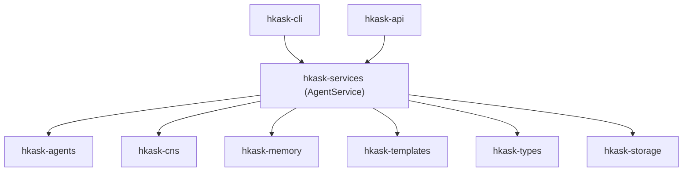
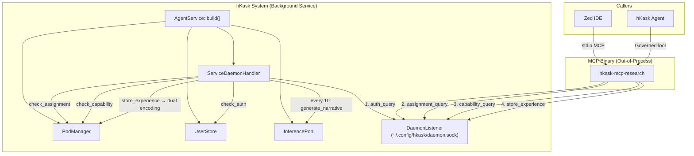

# hKask Architecture Master

**Purpose:** Index to the authoritative architecture documents.

**Project:** hKask (ℏKask - "A Minimal Viable Container for Agents") v0.27.0
**Binary:** `kask`  
**Crate prefix:** `hkask-`

---

## Document Hierarchy

```
magna-carta.md  ←  Foundation (4 inviolable principles)
       ↓
PRINCIPLES.md  ←  9 principles (P1-P9), constraint forces
       ↓
   MDS.md      ←  Minimal Domain Specification (5 categories, 5 tools)
       ↓
loop-architecture.md  ←  4-loop decomposition, RateLimiting→EnergyBudget
```

### Canonical Specifications

| Document | Purpose |
|----------|--------|
| [`magna-carta.md`](magna-carta.md) | User sovereignty charter — catch-and-release, affirmative consent, OCAP verification |
| [`PRINCIPLES.md`](PRINCIPLES.md) | 12 architecture principles (P1-P12), 5 anchors, anti-patterns |
| [`MDS.md`](MDS.md) | Minimal Domain Specification — 5 categories, 5 tools, completeness predicate |
| [`loop-architecture.md`](loop-architecture.md) | 4-loop architecture — RateLimiting→EnergyBudget subsumption, crate↔loop mapping |
| [`P12-replicant-host-mandate.md`](P12-replicant-host-mandate.md) | Replicant Host Mandate — every interaction has an author, no unsupervised agency |
| [`energy-gas-payments-api-keys.md`](energy-gas-payments-api-keys.md) | Energy, Gas, Payments & API Key System — economic layer, rJoules, wallets, key lifecycle |

---

## REPL Architecture

The interactive REPL (`kask chat`) implements four features that govern inference behavior:

### Context Injection

Conversation history is appended as a **suffix** (after the cache breakpoint) so the KV cache prefix — system prompt + template — remains identical across turns. Models that cache KV state across requests (e.g., Ollama with `keep_alive`) see prefix cache hits on every turn, reducing per-turn inference latency. Controlled by `ReplSettings.context_turns` (default 3, 0 = no history).

### Unbounded Tool-Use Loop

The REPL loops tool calls until the model stops requesting them, gated by `ReplSettings.tool_loop_limit` (default 21). Each iteration checks the energy budget via `GovernedTool` before executing. If the limit is hit, the loop breaks and returns the partial response — the system tells the model it can continue by asking.

### Auto-Condense

At 87.5% of the model's context window, old session history is condensed via the condenser library (`hkask-mcp-condenser`). The condenser summarizes older turns into a compact form, freeing context space for new messages. Controlled by `ReplSettings.auto_condense` (default on). When off, the user must condense manually.

### Model Awareness

On model switch (`/model`), the REPL fetches metadata from Ollama's `/api/show` endpoint:
- `context_length` — the model's native context window size (used by auto-condense)
- `supports_thinking` — whether the model supports thinking/reasoning tokens
- `capabilities` — model feature list (vision, tools, etc.)

Populated into `ReplSettings.model_meta` as read-only fields. Unknown until the first model detail fetch succeeds.

### ReplSettings

User-configurable inference parameters exposed via three surfaces:

| Setting | Type | Range | Default | Description |
|---------|------|-------|---------|-------------|
| `tool_loop_limit` | usize | ≥1 | 21 | Max tool-call iterations per turn |
| `context_turns` | usize | ≥0 | 3 | Past turns in context (0 = no history) |
| `temperature` | f32 | 0.0–2.0 | 0.7 | Sampling temperature |
| `top_p` | f32 | 0.0–1.0 | 0.9 | Nucleus sampling |
| `top_k` | u32 | ≥1 | 40 | Top-k filtering |
| `min_p` | f32 | 0.0–1.0 | 0.0 | Min-p threshold (0.0 = disabled) |
| `typical_p` | f32 | 0.0–1.0 | 0.0 | Locally typical sampling (0.0 = disabled) |
| `max_tokens` | u32 | ≥1 | 512 | Max completion tokens per call |
| `seed` | u32 or `off` | — | random | Deterministic seed |
| `gas_heuristic` | u64 | ≥1 | 500 | Per-turn gas reservation |
| `gas_cap` | u64 | ≥1 | 10,000 | Total session energy budget cap |
| `auto_condense` | bool | — | true | Auto-condense at 87.5% of context window |
| `model_meta` | read-only | — | None | Model context_length, thinking, capabilities |

### Magna Carta P3 — Equal Surface Exposure

All ReplSettings fields are equally exposed across:
- **REPL:** `/repl` slash command (show/set individual fields)
- **CLI:** `kask settings show|set|reset` commands
- **API:** `GET /api/settings` and `PUT /api/settings` endpoints

All three surfaces read/write the same `~/.config/hkask/settings.json` file. No settings are hidden, admin-gated, or surface-restricted.

---

## Service Layer

**Crate:** `hkask-services` — shared business logic for CLI and API surfaces.

**Canonical specification:** [`MDS-agent-service.md`](../specifications/MDS-agent-service.md) — full domain spec, accessor methods, depth test results, and service boundary definitions.

### Summary

`AgentService` is the canonical service layer owning all shared infrastructure. All 26 fields are **private** and exposed through **individual named accessor methods** (replacing the earlier grouped-tuple pattern). `AgentService::build(config)` assembles all shared infrastructure once at startup. Both surfaces compose it and add only presentation-specific fields:

- `ReplState` = `AgentService` + REPL fields (prompt history, input state)
- `ApiState` = `AgentService` + HTTP fields (router, OpenAPI spec)

### Dependency Direction



Domain crates **never** depend on `hkask-services`. MCP servers **never** depend on `hkask-services` (P1 Prohibition — out-of-process isolation).

### Key Constraints

1. **MCP servers should not depend on `hkask-services` for orchestration** — P1 Prohibition (out-of-process isolation). Exceptions: servers that are direct surfaces for a service (CLI/API/MCP tri-surface pattern). `hkask-mcp-replica` is a tri-surface for `ComposeService` + `EmbedService`, not an orchestrator.
2. **Domain crates do NOT depend on `hkask-services`** — dependency direction is strictly surface → service → domain.

---

## Daemon & Replicant Server Mode

**Crates:** `hkask-mcp` (daemon transport), `hkask-services` (daemon handler), `hkask-agents` (AgentMode)

### Summary

Replicants can operate in **server mode**, presenting as MCP servers to IDEs (Zed, VSCode) and other hKask agents. The daemon — a Unix domain socket at `~/.config/hkask/daemon.sock` — mediates authentication, role assignment, capability verification, and dual memory encoding between out-of-process MCP binaries and the in-process agent stack.

### Architecture



### Startup Flow

1. `kask login <replicant>` — authenticate (creates session in UserStore)
2. `kask pod assign <replicant> <role>` — assign MCP role (P4 Gate 2: sovereignty/consent)
3. `kask pod mode <replicant> server -r <role>` — enter server mode (P4 Gate 1: OCAP)
4. IDE spawns MCP binary with `HKASK_REPLICANT=<replicant>`
5. Binary connects to daemon → auth → assignment → capability → serve

### Memory Flow

- Tool calls → `record_experience()` (fire-and-forget from MCP binary)
- Daemon `store_experience` → dual encoding: episodic (first-person, private) + semantic (third-person, public)
- Every 10 experiences → `generate_narrative()` → inference analyzes session log → stores observations as episodic "narrative"/"thought"
- Existing consolidation pipeline extracts semantic knowledge from both streams

### Agent Modes

| Mode | Behavior | Mutual Exclusion |
|------|----------|-----------------|
| **Chat** | Conversational loop, calls tools via GovernedTool | Cannot coexist with Server (initially) |
| **Server** | Presents as MCP server(s), handles incoming tool calls, records episodic memories | Cannot coexist with Chat (initially) |

Concurrent chat+server mode planned for future release (3-6 months).

### Key Constraints

1. **P4 Dual Gate:** Every MCP server startup requires both capability verification (OCAP token) and assignment verification (sovereignty/consent).
2. **P2 Affirmative Consent:** Passphrase entry via `kask login` creates session. Daemon checks session existence — no passphrase stored with MCP binary.
3. **Out-of-process isolation:** MCP binaries communicate with hKask only through the daemon socket. No direct access to PodManager, memory, or inference.
4. **Mode mutual exclusion (initial):** An agent can be in Chat mode OR Server mode, not both.

---

## Reference Artifacts

Detailed lookup tables and diagrams in `reference/`:

| Artifact | Purpose |
|----------|---------|

| [`reference/hKask-hLexicon.md`](reference/hKask-hLexicon.md) | Full 87-term vocabulary catalog |
| [`reference/ports-inventory.md`](reference/ports-inventory.md) | Hexagonal port trait signatures |
| [`reference/utoipa-implementation.md`](reference/utoipa-implementation.md) | OpenAPI generation guide |
| [`reference/template-header-standard.md`](reference/template-header-standard.md) | Template metadata format |
| [`reference/hKask-Curator-persona.md`](reference/hKask-Curator-persona.md) | Curator persona specification |
| [`reference/okapi-integration.md`](reference/okapi-integration.md) | Inference Router API contract (Ollama, Fireworks, DeepInfra) |


---

## Decision Records

| ADR | Topic |
|-----|-------|
| [`ADR-024-unified-registry.md`](ADR-024-unified-registry.md) | Unified registry with `template_type` discriminator (retroactive) |
| [`ADR-025-attenuation-depth-limit.md`](ADR-025-attenuation-depth-limit.md) | 7-level attenuation depth limit (retroactive) |
| [`ADR-026-bitemporal-triple-schema.md`](ADR-026-bitemporal-triple-schema.md) | Bitemporal triple schema with valid-time × transaction-time (retroactive) |
| [`ADR-027-argon2-hkdf-master-key.md`](ADR-027-argon2-hkdf-master-key.md) | Argon2id + HKDF-SHA256 master key derivation (retroactive) |
| [`ADR-030-skill-bundler.md`](ADR-030-skill-bundler.md) | Skill bundler — meta-skill composition |
| [`ADR-031-consolidation-authorization.md`](ADR-031-consolidation-authorization.md) | Consolidation authorization via master passphrase derivation |
| [`ADR-032-mcp-gateway-membrane.md`](ADR-032-mcp-gateway-membrane.md) | MCP gateway membrane policy — Tier 1 (governed) vs Tier 2 (passthrough) |
| [`ADR-033-dampener-override-cooldown.md`](ADR-033-dampener-override-cooldown.md) | Dampener override cooldown — per-issuer vs global |
| [`ADR-034-academic-author-pipeline.md`](ADR-034-academic-author-pipeline.md) | Academic author pipeline — corpus_type discriminator, pre-processing, enumeration, disambiguation |
| [`ADR-035-replicant-server-mode.md`](ADR-035-replicant-server-mode.md) | Replicant server mode — AgentMode (Chat/Server), daemon socket transport, dual memory encoding, narrative generation |

---

## Specifications

| Document | Purpose |
|----------|---------|
| [`../specifications/REQUIREMENTS.md`](../specifications/REQUIREMENTS.md) | 22 implemented + 5 deferred goal specs |
| [`../specifications/TRACEABILITY_MATRIX.md`](../specifications/TRACEABILITY_MATRIX.md) | Bidirectional code→test traceability |


---

*Verification commands:* `cargo check --workspace`, `cargo test --workspace`, `cargo clippy --workspace -- -D warnings`, `cargo fmt --check`. See [`MDS_SCAFFOLD.md`](../specifications/MDS_SCAFFOLD.md) §6 for the full verification gate table.

---

## Document Structure

```
docs/architecture/
├── hKask-architecture-master.md           # THIS FILE (index — includes REPL Architecture)
├── MDS.md                              # Framework (5 categories, 5 tools)
├── PRINCIPLES.md                          # Framework (P3 updated with ReplSettings)
├── loop-architecture.md                   # Framework (4-loop authority model)
├── magna-carta.md                         # Framework
├── ADR-024-unified-registry.md            # Decision record
├── ADR-025-attenuation-depth-limit.md     # Decision record
├── ADR-026-bitemporal-triple-schema.md    # Decision record
├── ADR-027-argon2-hkdf-master-key.md      # Decision record
├── ADR-030-skill-bundler.md                # Decision record
├── ADR-031-consolidation-authorization.md  # Decision record
├── ADR-032-mcp-gateway-membrane.md        # Decision record (Draft)
├── ADR-033-dampener-override-cooldown.md   # Decision record (Draft)
├── ADR-034-academic-author-pipeline.md      # Decision record (Draft)
├── ADR-035-replicant-server-mode.md          # Decision record (Active)
└── reference/
    ├── hKask-hLexicon.md                  # Vocabulary catalog
    ├── ports-inventory.md                 # Port reference
    ├── utoipa-implementation.md           # API guide
    ├── template-header-standard.md        # Format reference
    ├── hKask-Curator-persona.md           # Persona spec
    └── okapi-integration.md               # Inference Router API contract
```

**Total:** 21 active architecture documents (4 framework + 1 index + 10 ADRs + 6 reference artifacts).

---

*ℏKask - A Minimal Viable Container for Agents — v0.27.0*
