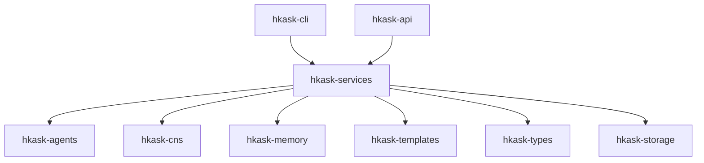

# hKask Architecture Master

**Purpose:** Index to the authoritative architecture documents.

**Project:** hKask (ℏKask - "A Minimal Viable Container for Agents") v0.27.0
**Binary:** `kask`  
**Crate prefix:** `hkask-`

---

## Document Hierarchy

```
magna-carta.md  ←  Foundation (4 inviolable principles)
       ↓
PRINCIPLES.md  ←  9 principles (P1-P9), constraint forces
       ↓
   MDS.md      ←  Minimal Domain Specification (5 categories, 6 tools)
       ↓
loop-architecture.md  ←  4-loop decomposition, RateLimiting→EnergyBudget
```

### Canonical Specifications

| Document | Purpose |
|----------|---------|
| [`magna-carta.md`](magna-carta.md) | User sovereignty charter — catch-and-release, affirmative consent, OCAP verification |
| [`PRINCIPLES.md`](PRINCIPLES.md) | 9 architecture principles (P1-P9), 5 anchors, anti-patterns |
| [`MDS.md`](MDS.md) | Minimal Domain Specification — 5 categories, 6 tools, completeness predicate |
| [`loop-architecture.md`](loop-architecture.md) | 4-loop architecture — RateLimiting→EnergyBudget subsumption, crate↔loop mapping |

### Historical

| Document | Status |
|----------|--------|
| `DDMVSS.md` | Deleted — superseded by MDS.md (9→5 categories, 9→6 tools) |
| `domain-and-capability.md` | Deleted — covered by MDS.md §7.1-7.2 |
| `interface-and-composition.md` | Deleted — covered by MDS.md §7.2 |
| `persistence-and-lifecycle.md` | Deleted — covered by MDS.md §7.4 |
| `trust-security-observability.md` | Deleted — covered by MDS.md §7.3 + PRINCIPLES.md §2.1 |

---

## Service Layer

**Crate:** `hkask-services` — shared business logic for CLI and API surfaces.

### Dependency Direction



Domain crates **never** depend on `hkask-services`. MCP servers **never** depend on `hkask-services` (P1 Prohibition — out-of-process isolation).

### ServiceContext Composition

`ServiceContext::build(config)` assembles all shared infrastructure once at startup. Both surfaces compose it and add only presentation-specific fields:

- `ReplState` = `ServiceContext` + REPL fields (prompt history, input state)
- `ApiState` = `ServiceContext` + HTTP fields (router, OpenAPI spec)

`ServiceContext::build()` replaces four independent assembly paths: `Stores::init`, `build_loop_system`, `build_governed_mcp_tool`, `build_ensemble_session`. Dependency order: DB → stores → CNS → loop system → governed tool → ACP/pods → inference port → memory adapters.

### Surface vs Service Boundary

| Concern | Owner | Examples |
|---------|-------|----------|
| Business logic normalization | `hkask-services` | Multi-step workflows, cross-crate orchestration, error normalization |
| Input validation | Surface | CLI arg parsing, HTTP body schema, path params |
| OCAP gates | Surface | `GovernedTool` membrane, capability checks before service call |
| HTTP status mapping | `hkask-api` | `ServiceError → StatusCode` |
| CLI formatting | `hkask-cli` | Table output, color, progress indicators |

### Depth Test Results

| Module | Public API | Call Sites (CLI+API) | Status |
|--------|-----------|---------------------|--------|
| `InferenceService` | 3 functions | 8+ | ✅ Pass |
| `CuratorService` | 6 functions | 12+ | ✅ Pass |
| `EnsembleService` | 8 functions | 16+ | ✅ Pass |
| `PodService` | 6 functions | 12+ | ✅ Pass |
| `SovereigntyService` | 9 functions + 2 types | 18+ | ✅ Pass |

### Skipped Domains

| Domain | Reason |
|--------|--------|
| memory | 2 call sites — insufficient depth |
| spec | 4 call sites — insufficient depth |
| goal | CRUD pass-throughs — no business logic to normalize |
| models | Covered by `InferenceService` |

### Key Constraints

1. **MCP servers do NOT depend on `hkask-services`** — P1 Prohibition (out-of-process isolation). Service layer is in-process only.
2. **Domain crates do NOT depend on `hkask-services`** — dependency direction is strictly surface → service → domain.

---

## Reference Artifacts

Detailed lookup tables and diagrams in `reference/`:

| Artifact | Purpose |
|----------|---------|
| [`reference/hKask-erd.md`](reference/hKask-erd.md) | Core entity relationship diagrams |
| [`reference/registry-erd.md`](reference/registry-erd.md) | Registry schema diagrams |
| [`reference/subsystem-erds.md`](reference/subsystem-erds.md) | Per-crate ERDs |
| [`reference/hKask-hLexicon.md`](reference/hKask-hLexicon.md) | Full 87-term vocabulary catalog |
| [`reference/ports-inventory.md`](reference/ports-inventory.md) | Hexagonal port trait signatures |
| [`reference/utoipa-implementation.md`](reference/utoipa-implementation.md) | OpenAPI generation guide |
| [`reference/template-header-standard.md`](reference/template-header-standard.md) | Template metadata format |
| [`reference/hKask-Curator-persona.md`](reference/hKask-Curator-persona.md) | Curator persona specification |
| [`reference/okapi-integration.md`](reference/okapi-integration.md) | Okapi LLM API contract |


---

## Decision Records

| ADR | Topic |
|-----|-------|
| [`ADR-022-comprehensive-security-hardening.md`](ADR-022-comprehensive-security-hardening.md) | ADV-REVIEW-F2 security hardening (T01-T22) |
| [`ADR-024-unified-registry.md`](ADR-024-unified-registry.md) | Unified registry with `template_type` discriminator (retroactive) |
| [`ADR-025-attenuation-depth-limit.md`](ADR-025-attenuation-depth-limit.md) | 7-level attenuation depth limit (retroactive) |
| [`ADR-026-bitemporal-triple-schema.md`](ADR-026-bitemporal-triple-schema.md) | Bitemporal triple schema with valid-time × transaction-time (retroactive) |
| [`ADR-027-argon2-hkdf-master-key.md`](ADR-027-argon2-hkdf-master-key.md) | Argon2id + HKDF-SHA256 master key derivation (retroactive) |
| [`ADR-030-skill-bundler.md`](ADR-030-skill-bundler.md) | Skill bundler — meta-skill composition |
| [`ADR-031-consolidation-authorization.md`](ADR-031-consolidation-authorization.md) | Consolidation authorization via master passphrase derivation |
| [`ADR-032-mcp-gateway-membrane.md`](ADR-032-mcp-gateway-membrane.md) | MCP gateway membrane policy — Tier 1 (governed) vs Tier 2 (passthrough) |
| [`ADR-033-dampener-override-cooldown.md`](ADR-033-dampener-override-cooldown.md) | Dampener override cooldown — per-issuer vs global |

---

## Specifications

| Document | Purpose |
|----------|---------|
| [`../specifications/REQUIREMENTS.md`](../specifications/REQUIREMENTS.md) | 22 implemented + 5 deferred goal specs |
| [`../specifications/TRACEABILITY_MATRIX.md`](../specifications/TRACEABILITY_MATRIX.md) | Bidirectional code→test traceability |


---

*Verification commands:* `cargo check --workspace`, `cargo test --workspace`, `cargo clippy --workspace -- -D warnings`, `cargo fmt --check`. See [`DDMVSS_SCAFFOLD.md`](../specifications/DDMVSS_SCAFFOLD.md) §6 for the full verification gate table.

---

## Document Structure

```
docs/architecture/
├── hKask-architecture-master.md           # THIS FILE (index)
├── DDMVSS.md                              # Framework
├── PRINCIPLES.md                          # Framework
├── loop-architecture.md                   # Framework (6-loop authority model)
├── magna-carta.md                         # Framework
├── domain-and-capability.md               # SPEC (Domain + Capability)
├── interface-and-composition.md           # SPEC (Interface + Composition)
├── trust-security-observability.md        # SPEC (Trust + Observability)
├── persistence-and-lifecycle.md           # SPEC (Persistence + Lifecycle)
├── ADR-022-comprehensive-security-hardening.md  # Decision record
├── ADR-024-unified-registry.md            # Decision record
├── ADR-025-attenuation-depth-limit.md     # Decision record
├── ADR-026-bitemporal-triple-schema.md    # Decision record
├── ADR-027-argon2-hkdf-master-key.md      # Decision record
├── ADR-030-skill-bundler.md                # Decision record
├── ADR-031-consolidation-authorization.md  # Decision record
├── ADR-032-mcp-gateway-membrane.md        # Decision record (Draft)
├── ADR-033-dampener-override-cooldown.md   # Decision record (Draft)
└── reference/
    ├── hKask-erd.md                       # Diagram artifact
    ├── registry-erd.md                    # Diagram artifact
    ├── subsystem-erds.md                  # Diagram artifact
    ├── hKask-hLexicon.md                  # Vocabulary catalog
    ├── ports-inventory.md                 # Port reference
    ├── utoipa-implementation.md           # API guide
    ├── template-header-standard.md        # Format reference
    ├── hKask-Curator-persona.md           # Persona spec
    └── okapi-integration.md               # Okapi API contract
```

**Total:** 24 active architecture documents (4 specs + 4 framework + 1 index + 9 active ADRs + 6 active reference artifacts).

---

*ℏKask - A Minimal Viable Container for Agents — v0.27.0*
