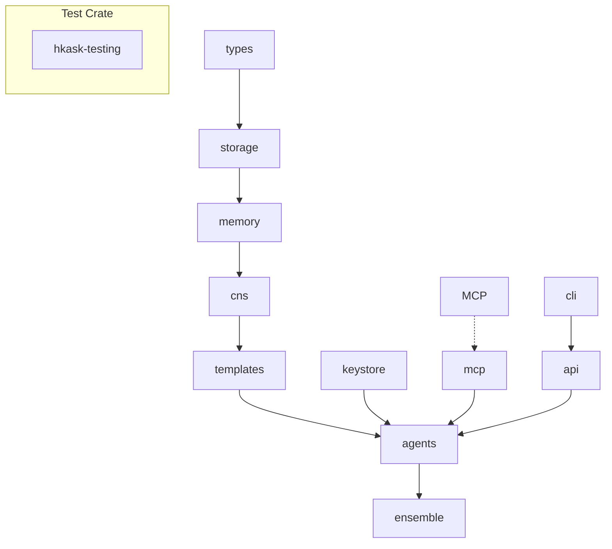

<!-- TOGAF_DOMAIN: Cross-cutting -->
<!-- VERSION: 0.21.0 -->
<!-- STATUS: Active -->
<!-- LAST_UPDATED: 2026-05-23 -->

# hKask Architecture Master

**Purpose:** Sole authoritative specification for hKask v0.21.0 — the minimal viable unit of an agent platform.

**Related:** [`PRINCIPLES.md`](PRINCIPLES.md), [`hKask-erd.md`](hKask-erd.md), [`business-architecture.md`](business-architecture.md), [`application-architecture.md`](application-architecture.md), [`data-architecture.md`](data-architecture.md), [`security-architecture.md`](security-architecture.md)

---

## Project Identity

**Name:** hKask (pronounced *h-bar-kask*)  
**Binary:** `kask`  
**Crate prefix:** `hkask-`

**Version:** v0.21.0 — MVP in progress  
**Status:** Pre-alpha — Phase 7 complete (Ensemble & CNS), Phase 8 complete (UI/API)

---

## Five Anchor Capabilities

| # | Anchor | Implementation |
|---|--------|----------------|
| 1 | **Agent Enablement** | Bots + Replicants in pods with WebID, ACP |
| 2 | **Essential Tools** | MCP servers + Okapi |
| 3 | **User Sovereignty** | OCAP, SQLCipher, private/public gating |
| 4 | **CNS** | `cns.*` spans, variety counters, algedonic alerts |
| 5 | **Composition** | **Unified registry** with template_type discriminator |

---

## Architecture Overview



---

## Workspace Structure

```
hkask-workspace/
├── hkask-types         # ID types, ν-event, hLexicon
├── hkask-storage       # SQLite + SQLCipher + sqlite-vec
├── hkask-memory        # Semantic/episodic pipelines
├── hkask-cns           # Cybernetic Nervous System
├── hkask-templates     # Registry, hLexicon, cascade
├── hkask-agents        # Pods, ACP, bot/replicant
├── hkask-ensemble      # Multi-agent chat (NO swarms)
├── hkask-keystore      # OS keychain, AES-256-GCM
├── hkask-mcp           # MCP runtime, dispatch
├── hkask-cli           # CLI commands
├── hkask-api           # HTTP API, utoipa
│
├── hkask-mcp-inference     # Okapi-backed LLM
├── hkask-mcp-storage       # Storage operations
├── hkask-mcp-memory        # Memory operations
├── hkask-mcp-embedding     # Embeddings, similarity
├── hkask-mcp-condenser     # Condensation, summarization
├── hkask-mcp-ensemble      # Multi-agent coordination
├── hkask-mcp-web           # Web search, scrape
├── hkask-mcp-scholar       # Academic research
├── hkask-mcp-spandrel      # Graph analysis
└── hkask-mcp-doc-knowledge # Document extraction
│
├── hkask-testing           # single test crate
│   ├── unit-tests/         # Unit tests moved from inline modules
│   ├── integration-tests/  # Cross-crate integration tests
│   └── test-harnesses/     # Test utilities, fixtures, mocks
│
└── External
    ├── Okapi (mdz-axo/Okapi)
    ├── ACP (acp-runtime)
    └── MCP (rmcp)
```

---

## CNS (Cybernetic Nervous System)

**Namespace:** `cns.*` (replaces `okh.*`)

**Key spans:**
- `cns.tool.*` — tool governance, invocation
- `cns.prompt.*` — render, validate, outcome
- `cns.agent_pod.*` — lifecycle, delegation
- `cns.connector.*` — external I/O (LLM, embeddings)

**Algedonic Alert:** Variety deficit >100 → escalate to Curator/human

---

## Agent Taxonomy

| Type | Purpose | Interaction | Visibility |
|------|---------|-------------|------------|
| **Bot** | Process execution | Machine-to-machine (A2A) | Public/Shared |
| **Replicant** | Human assistance | Human-to-agent (H2A) | Episodic=Private, Semantic=Public |

**Curator:** Single replicant, system persona, user's counterpart in `kask chat`.

---

## Constraint-Driven Design

### Principles (P1–P7)

| # | Principle | Description |
|---|-----------|-------------|
| **P1** | No trait without two consumers | Traits must have ≥2 implementations |
| **P2** | No generic without two instantiations | Generics must have ≥2 concrete uses |
| **P3** | No module directory without encapsulation | Directories must encapsulate functionality |
| **P4** | No builder without fallibility or complexity | Builders must handle errors or complexity |
| **P5** | No feature flag without an activator | Feature flags must have runtime activation |
| **P6** | Delete stubs, don't publish them | Remove incomplete code |
| **P7** | Prefer deletion over deprecation | Delete rather than deprecate |

### Constraints (C1–C7)

| # | Constraint | Description |
|---|------------|-------------|
| **C1** | A type must be worn before it's tailored | Types must be used before refinement |
| **C2** | Distinguish dead from unwired | Dead code vs. unwired code |
| **C3** | Unwired code has a shelf life | Time limit for wiring unwired code |
| **C4** | Repetition is a missing primitive | Duplicates indicate missing abstraction |
| **C5** | Every error variant is a unique recovery path | Errors must have distinct handling |
| **C6** | A stub is a debt receipt | Stubs create technical debt |
| **C7** | When implementations diverge, one must yield | Converge or eliminate divergence |

---

## Hallucinations (Do NOT Implement)

The following are **explicitly out of scope** for hKask v0.21.0:

- Bot reputation systems
- Bot swarms / consensus mechanisms
- Cross-machine sync
- Bot marketplace
- Curator customization
- SemVer versioning (Git-only)
- Separate feedback crate (CNS handles all)
- Promotion pipeline (episodic/semantic categorical)
- Escalation primitive
- Visibility type system (OCAP-enforced)
- OCT-H currency
- Fine-tuning (axolotl)
- OpenCode-style condenser
- OpenHands-style condenser
- UCAN for h-bar (OCAP-only)
- **Three separate registries** (unified registry with `template_type` discriminator)
- **Rust-based template selection** (selection intelligence in Jinja2/LLM)

---

## Essential Commands

```bash
# Build verification
cargo check -p <crate>
cargo test -p <crate>
cargo clippy -p <crate> -- -D warnings
cargo fmt

# Workspace verification
cargo check --workspace
cargo clippy --workspace -- -D warnings
cargo fmt --check
```

---

## Documentation

| Topic | Location |
|-------|----------|
| GML (Allosteric Thinking) | `docs/gml/README.md` |
| Architecture | `docs/architecture/` |
| CI/CD | `docs/CI-CD-GUIDE.md` |
| Okapi Integration | `docs/P0_OKAPI_INTEGRATION_PLAN.md` |
| Entity Relationships | `docs/architecture/hKask-erd.md` |
| Registry & Templating | `docs/architecture/registry-templating-prompt-v2.md` |
| Agent Operating Guide | `AGENTS.md` |

---

## References

[^beer-vsm]: Beer, S. (1972). *Brain of the Firm*. Penguin Books. Viable System Model.
[^ashby-law]: Ashby, W. R. (1956). *An Introduction to Cybernetics*. Chapman & Hall. Law of Requisite Variety.
[^von-foerster]: Von Foerster, H. (1974). *Cybernetics of Cybernetics*. Biological Computer Laboratory.
[^togaf-adm]: The Open Group. TOGAF Standard, Version 10. Architecture Development Method.

---

*ℏKask — Planck's Constant of Agent Systems — v0.21.0*
*As simple as possible, but no simpler.*
*Rust is the loom. YAML/Jinja2 is the thread.*
*MVP in progress.*
