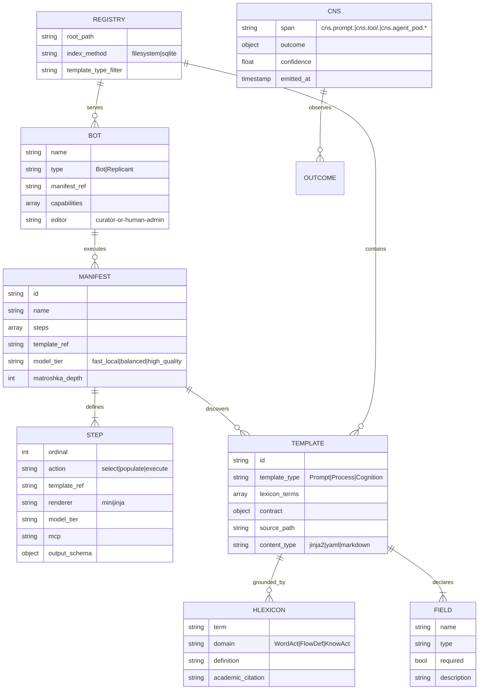
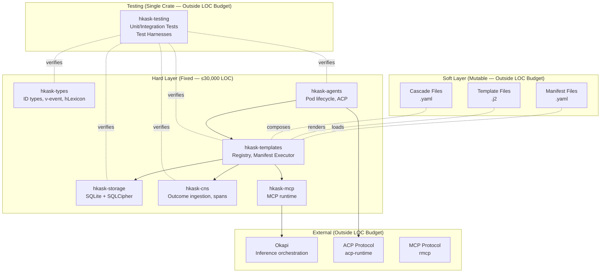
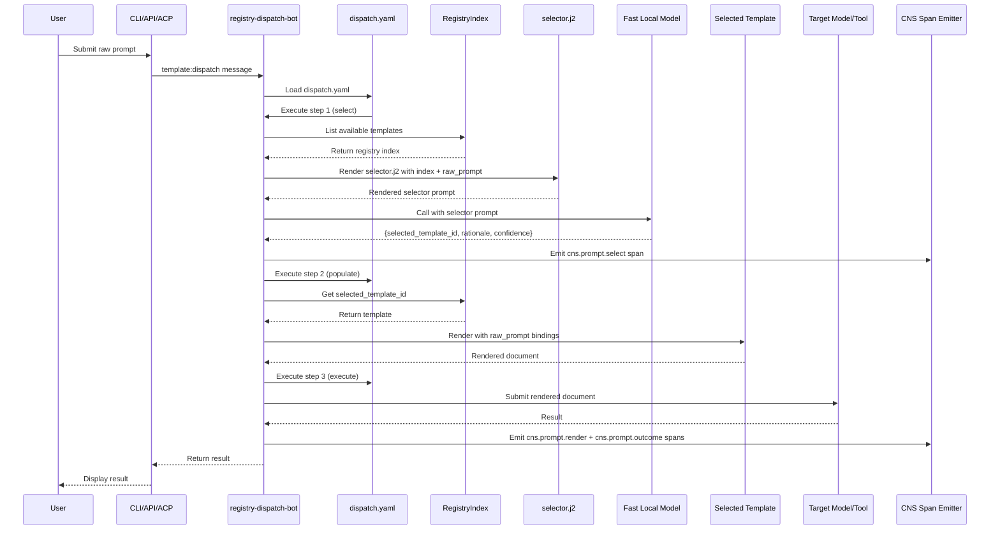
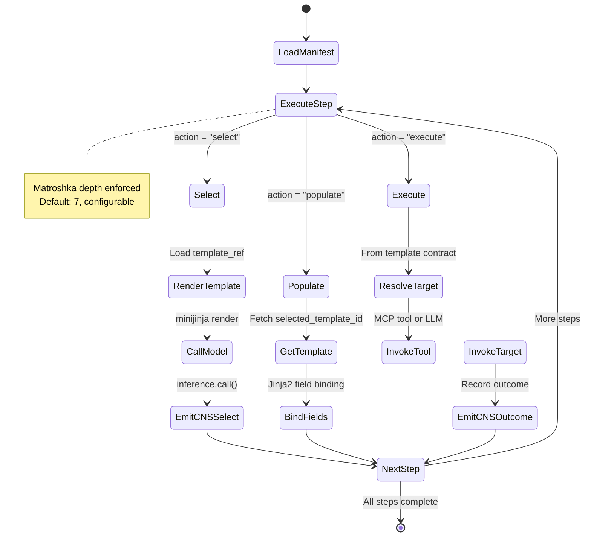
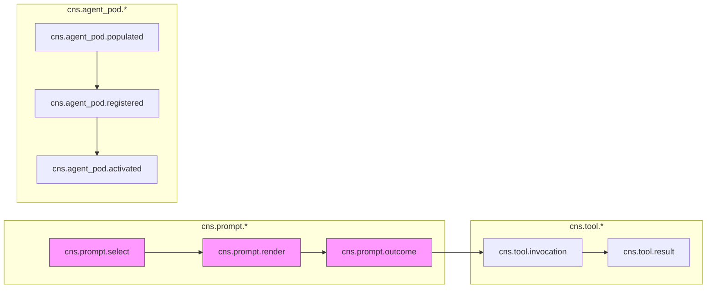

# hKask Entity Relationship Diagram

**Version:** v0.21.0  
**Date:** 2026-05-18  
**Status:** Pre-alpha — MVP in progress

---

## Core Entities

---

## Architecture Layers

---

## Data Flow: Dispatch Pattern

---

## Manifest Step Grammar

---

## CNS Span Hierarchy

---

## Key Invariants

| Invariant | Description | Enforcement |
|-----------|-------------|-------------|
| **Loom/Thread** | Rust is fixed logic; YAML/Jinja2 is mutable content | Architecture boundary |
| **Unified Registry** | Single registry with `template_type` discriminator | P1 (no trait without 2 consumers) |
| **Manifest Execution** | Generic step interpreter applies to any manifest | ~50 LOC core loop |
| **Matroshka Depth** | Recursion limit enforced across all template chains | Rust executor |
| **CNS Observation** | All template outcomes emitted as spans | Port requirement |
| **hLexicon Grounding** | Templates declare terms; validator checks existence | Render-time check |

---

## Open Questions (To Be Resolved)

| Question | Status | Resolution Path |
|----------|--------|-----------------|
| Enrichment port for `domain_hint` | Open | Pre-step in manifest or caller responsibility? |
| Bootstrap loading order | Open | Convention (fixed paths) or Rust sequence? |
| Selector failure (low confidence) | Open | Conditional step (`choice`) or Rust fallback? |
| Template hot-reload detection | Open | fswatch or explicit signal (API/CLI)? |
| Manifest step grammar extensibility | Open | New actions = Rust change or pure YAML? |
| Git versioning (SHA resolution) | Open | HEAD only or revision parameter? |
| Cross-registry composition rules | Open | Can Process invoke Prompt? Cognition invoke Process? |
| Bot Manifest vs Template Manifest | Open | Same thing or different? |

---

*ℏKask — Planck's Constant of Agent Systems — v0.21.0*
*The Rust is the loom. The YAML/Jinja2 is the thread.*
*MVP in progress.*
