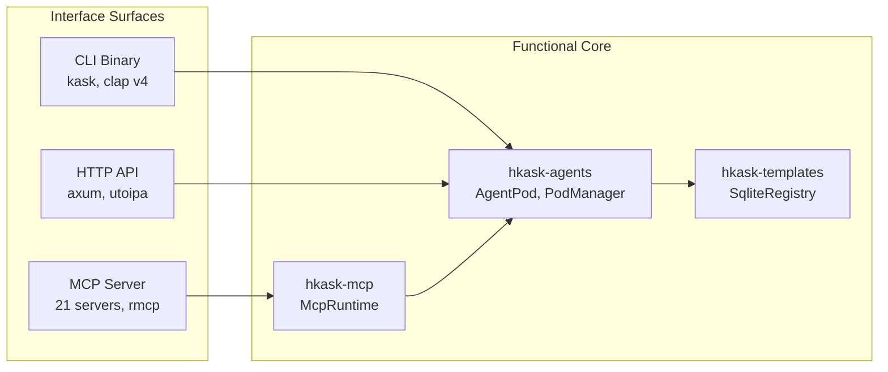
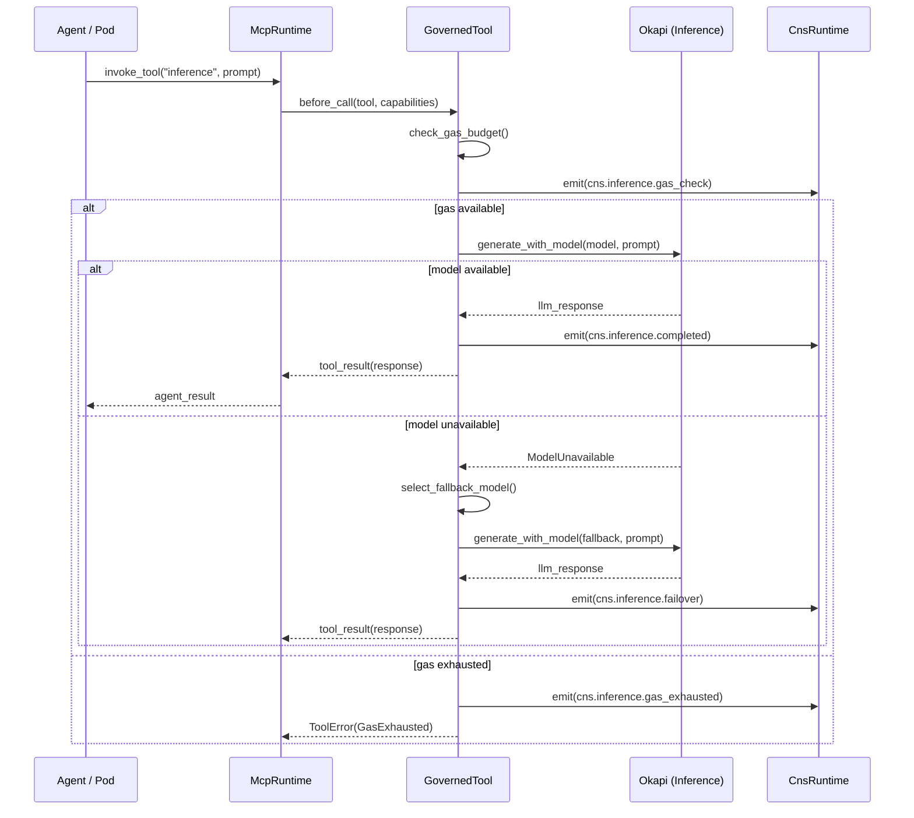
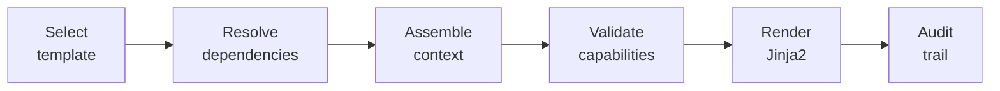

# hKask Interface & Composition Specification

**Purpose:** Authoritative specification for service surfaces, equivalence model, hexagonal ports, unified registry, template cascade, and composition rules. Single source of truth for DDMVSS categories **Interface** and **Composition**.

**Related:** [`domain-and-capability.md`](domain-and-capability.md), [`trust-security-observability.md`](trust-security-observability.md), [`persistence-and-lifecycle.md`](persistence-and-lifecycle.md)

**Verification:** `cargo check --workspace && cargo test -p hkask-templates && cargo test -p hkask-mcp`

---

## 1. Interface Equivalence: MCP ≡ CLI ≡ API

**Focusing assumption:** Three surfaces, one functional core. Every capability is exercisable through MCP, CLI, and API with identical semantics.[^cockburn-hex]



<!-- DIAGRAM_ALIGNMENT
id: DIAG-IC-001
verified_date: 2026-05-28
verified_against: crates/hkask-cli/src/cli/mod.rs:33; crates/hkask-api/src/lib.rs:636; crates/hkask-mcp/src/runtime.rs:59
status: VERIFIED
-->

[^cockburn-hex]: Cockburn, A. (2005). *Hexagonal Architecture*. http://alistair.cockburn.us/Hexagonal+architecture. Ports-and-adapters pattern.

### 1.1 MCP Server Surface

**Protocol:** rmcp (Rust MCP protocol library) — JSON-RPC 2.0 over **stdio transport**. Only stdio transport is currently implemented; future transports (HTTP, WebSocket) are not specified. Filesystem change notification uses platform-native APIs (fswatch/notify).

**Runtime:** `McpRuntime` (`crates/hkask-mcp/src/runtime.rs`) — manages server lifecycle, tool discovery, and live `Peer<RoleClient>` connections.

**Server lifecycle:** `McpRuntime::start_server(server_id, command)` spawns a child process, performs the MCP handshake, discovers tools dynamically via `list_all_tools()`, and stores the live connection. `McpRuntime::shutdown_all()` terminates all managed processes.

**Dynamic discovery:** Tool names and schemas are discovered at runtime from live server connections. MCP servers register tools using underscore format (e.g., `inference_generate`, `condenser_compress`). There is no static tool metadata — all composition roots (REPL, API, CLI) must call `start_server()` before tools are available.

**Security:** OCAP enforcement via `GovernedTool` membrane wrapping `RawMcpToolPort`. `McpDispatcher` routes all invocations through the membrane.

### 1.2 CLI Surface

**Binary:** `kask` (built from `hkask-cli`, 3,741 LOC)

**25 subcommand groups** (`crates/hkask-cli/src/cli/mod.rs:33`):

| Subcommand | Purpose |
|-----------|---------|
| `kask chat` | Curator chat interface with `/model` switching and `-m` flag |
| `kask template` | Template management (list, register, get, search, render) |
| `kask bot` | Bot capability management |
| `kask pod` | Agent pod lifecycle (create, activate, deactivate, status) |
| `kask mcp` | MCP server/tool management |
| `kask cns` | CNS monitoring (health, variety, alerts) |
| `kask sovereignty` | User sovereignty (Magna Carta enforcement) |
| `kask goal` | Goal coordination (OCAP-gated, CNS-observed) |
| `kask registry` | Registry management |
| `kask git` | Git archival |
| `kask ensemble` | Multi-agent ensemble |
| `kask spec` | DDMVSS specifications (capture, decompose, curate, validate) |
| `kask docs` | Documentation generation |
| `kask agent` | ACP agent registration |
| `kask curator` | Curator governance and metacognition |
| `kask replicant` | Replicant identity management |
| `kask keystore` | OS keychain secret management |
| `kask bundle` | Skill bundle management (compose, apply, evolve) |
| `kask compose` | Style composition — generate prose with exemplar retrieval |
| `kask embed-corpus` | Style corpus embedding (download, chunk, embed, store) |
| `kask consolidate` | Trigger episodic→semantic consolidation with optional semantic cleanup |
| `kask loops` | Run the 6-loop regulation system |
| `kask models` | List available LLM models |
| `kask web-search` | Search the web |
| `kask serve` | Start the HTTP API server (shares state with CLI) |

### 1.3 HTTP API Surface

**Framework:** axum v0.8 with utoipa v5.5 OpenAPI documentation

**18 route groups** (`crates/hkask-api/src/routes/`):

| Route Group | Purpose |
|------------|----------|
| `templates_router` | Template CRUD and rendering |
| `bots_router` | Bot capability management |
| `pods_router` | Agent pod lifecycle |
| `mcp_router` | MCP server/tool operations |
| `cns_router` | CNS health and monitoring |
| `sovereignty_router` | User sovereignty enforcement |
| `chat_router` | Chat interface (supports `model` field) |
| `models_router` | Okapi model catalog (list, search) |
| `ensemble_router` | Multi-agent ensemble |
| `soap_infer_router` | SOAP inference (Okapi bridge) |
| `acp_router` | ACP agent registration |
| `bundles_router` | Skill bundle management |
| `spec_router` | DDMVSS specification operations |
| `curator_router` | Curator governance and metacognition |
| `episodic_router` | Episodic memory operations |
| `consolidation_router` | Episodic→semantic consolidation |
| `git_router` | Git archival operations |
| `goal_router` | Goal coordination (OCAP-gated) |

**OpenAPI:** Generated at `docs/generated/openapi.json`. Implementation details in [`reference/utoipa-implementation.md`](reference/utoipa-implementation.md).

### 1.4 Equivalence Matrix

| Capability | MCP | CLI | API |
|-----------|-----|-----|-----|
| Invoke tool | `tool_call(server, name, args)` | `kask mcp tools` | `POST /api/v1/mcp/tools` |
| Render template | `template_render(id, ctx)` | `kask template render` | `POST /api/v1/templates/{id}/render` |
| Create pod | N/A | `kask pod create` | `POST /api/v1/pods` |
| Grant capability | `ocap_grant(target, cap)` | `kask bot grant` | `POST /api/v1/bots/capabilities` |
| Query CNS | `cns_health()` | `kask cns health` | `GET /api/v1/cns/health` |
| Capture goal | `spec/goal/capture` | `kask spec capture` | `POST /api/v1/specs` |
| List templates | `registry_list(type)` | `kask template list` | `GET /api/v1/templates` |
| Switch model | `inference_models` | `/model <name>` or `-m` flag | `POST /api/chat {model}` |
| List models | `inference_models` | `/model <query>` | `GET /api/models` |
| Search models | `inference_models(filter)` | `/model qwen` | `GET /api/models/search?q=...` |

---

## 2. Hexagonal Port Architecture

hKask uses hexagonal architecture with explicit port traits defining integration boundaries.[^cockburn-hex]

**Full port trait signatures:** [`reference/ports-inventory.md`](reference/ports-inventory.md)

### 2.1 Driving Ports (Input)

| Port | Trait | Crate | Purpose |
|------|-------|-------|---------|
| MCP Runtime | `MCPRuntimePort` | `hkask-agents` | MCP server communication |
| CLI | (clap derive) | `hkask-cli` | Command-line parsing |
| HTTP API | (axum routes) | `hkask-api` | HTTP request handling |
| ACP Transport | `AcpTransport` ⚠️ REMOVED | `hkask-agents` | Agent Communication Protocol — *transport layer deferred in v0.21.x* |

### 2.2 Driven Ports (Output)

| Port | Trait | Crate | Purpose |
|------|-------|-------|---------|
| ACP | `AcpPort` (`ports/acp.rs`) | `hkask-agents` | Agent registration, A2A messaging |
| Git CAS | `GitCASPort` (`ports/git_cas.rs`) | `hkask-agents` | Content-addressed template storage |
| Episodic Storage | `EpisodicStoragePort` (`ports/memory_storage.rs`) | `hkask-agents` | Private, agent-scoped persistence |
| Semantic Storage | `SemanticStoragePort` (`ports/memory_storage.rs`) | `hkask-agents` | Shared, public knowledge persistence |
| MCP Runtime | `MCPRuntimePort` (`ports/mcp_runtime.rs`) | `hkask-agents` | Tool dispatch |
| CNS Emit | `NuEventSink` (`event.rs`) | `hkask-types` | Cybernetic event emission |
| CNS Emit | `CnsEmit` (`spans.rs`) | `hkask-cns` | Structured span emission |
| Sovereignty | `SovereigntyPort` (`hkask-types/src/sovereignty.rs:374`) | `hkask-types` | User sovereignty enforcement |
| Sovereignty (impl) | `SovereigntyChecker` (concrete) | `hkask-agents` | Production implementation |
| Inference | `InferencePort` (`inference_port.rs`) | `hkask-templates` | LLM inference (Okapi) |
| Spec Store | `SpecStore` (`spec.rs`) | `hkask-types` | Specification persistence |
| Spec Observer | `SpecObserver` ⚠️ REMOVED (`spec.rs`) | `hkask-types` | Spec CNS spans — *removed in v0.21.x* |
| Spec Curator | `SpecCurator` (`spec.rs`) | `hkask-types` | Curation evaluation |
| Audit | `AuditLogPort` (`hkask-types/src/audit.rs:128`) | `hkask-types` | Audit trail persistence |
| MCP Dispatch | `McpPort` (`ports.rs`) | `hkask-templates` | MCP tool invocation |
| Metacognition | `MetacognitionLoop` (`curator_agent/metacognition.rs`) | `hkask-agents` | Curator health monitoring and metacognition |
| Standing Session | `StandingSessionPort` (`ports/standing_session.rs`) | `hkask-agents` | Session state persistence |
| ACP Transport | `AcpTransport` ⚠️ REMOVED (`ports/acp_transport.rs`) | `hkask-agents` | Wire-level transport — *removed in v0.21.x* |
| Ensemble Inference | `InferenceClient` (`ports.rs`) | `hkask-ensemble` | Inference with retry |
| Ensemble Metrics | `MetricsSource` (`ports.rs`) | `hkask-ensemble` | SSE metrics streaming |
| Capability Query | `CapabilityQueryPort` (`ocap_enforcement.rs`) | `hkask-ensemble` | OCAP capability lookups |
| Registry | `RegistryIndex` (`ports.rs`) | `hkask-templates` | Template discovery |

### 2.3 Port Composition Patterns

**Adapter chaining:** Adapters wrap other adapters for cross-cutting concerns (e.g., `GovernedTool` in `hkask-cns` wraps `RawMcpToolPort` to add OCAP verification).

**Port aggregation:** `PodManager` aggregates multiple ports into a single facade (`pod/manager.rs:30`).

**Optional CNS:** CNS emitter is `Option<Arc<dyn CnsEmit>>` to avoid breaking tests.

### 2.4 Async Purity

All ports use `#[async_trait]`. No `block_in_place` or `block_on` in library code.

### 2.5 LLM Routing and Failover (Okapi Integration)

LLM inference is delegated to Okapi, an external inference service. The routing layer selects models and handles failover when a model is unavailable.



<!-- DIAGRAM_ALIGNMENT
id: DIAG-IC-006
verified_date: 2026-06-06
verified_against: crates/hkask-mcp/src/runtime.rs; crates/hkask-mcp/src/security.rs; mcp-servers/hkask-mcp-inference/
status: VERIFIED
-->

---

## 3. Unified Registry

### 3.1 Architectural Invariant

**Rust is the loom. YAML/Jinja2 is the thread.** The loom doesn't change when you weave a different pattern.[^evans-ddd]

| Layer | Technology | Mutability |
|-------|-----------|------------|
| Hard (Kernel) | Rust | Fixed, stable |
| Soft (Material) | YAML, Jinja2, MD | Mutable, evolving |
| Testing | Rust (tests) | Verification edge |

**Rust owns:** Parsing YAML steps, rendering Jinja2 via minijinja, enforcing matroshka depth, validating hLexicon terms, routing MCP/LLM calls.

**Rust does NOT own:** Which templates exist, what they say, how selection logic is phrased, what steps a manifest contains.

[^evans-ddd]: Evans, E. (2003). *Domain-Driven Design*. Addison-Wesley. Code vs. content separation.

### 3.2 Registry Schema

**Single registry** with `template_type` discriminator — not three separate registries.[^fowler-poeaa]

**Implementation:** `SqliteRegistry` (`crates/hkask-templates/src/`)

| Field | Type | Description |
|-------|------|-------------|
| `id` | `String` | Unique template identifier |
| `template_type` | `TemplateType` | WordAct, KnowAct, FlowDef |
| `name` | `String` | Human-readable template name |
| `cascade_level` | `u8` | Nesting depth in matroshka chain (0 = leaf) |
| `matroshka_limit` | `u8` | Maximum cascade depth for this entry |
| `lexicon_terms` | `Vec<String>` | hLexicon terms used |
| `description` | `String` | Human-readable description |
| `source_path` | `String` | Filesystem path to source |
| `required_capabilities` | `Vec<String>` | Capabilities needed |

[^fowler-poeaa]: Fowler, M. (2002). *Patterns of Enterprise Application Architecture*. Addison-Wesley. Registry pattern (pp. 490–494).

### 3.3 Template Types

| Type | Domain | Description | hLexicon Grounding |
|------|--------|-------------|-------------------|
| **WordAct** | WordAct | LLM prompt templates — "Say" | Rendering, expression terms |
| **FlowDef** | FlowDef | Workflow & specification templates — "Do / Define" | Sequence, composition, spec-curation terms |
| **KnowAct** | KnowAct | Reasoning templates — "Think" | Analysis, evaluation terms |

**DDMVSS Vocabulary Mapping.** The DDMVSS specification (§5.4) uses a different vocabulary for template types. The mapping between DDMVSS terms and code terms is:

| DDMVSS Term | Code Term (`TemplateType`) | Domain |
|-------------|---------------------------|--------|
| Prompt | `WordAct` | WordAct |
| Process | `FlowDef` | FlowDef |
| Cognition | `KnowAct` | KnowAct |
| Specification | `FlowDef` | FlowDef |

The `TemplateType::as_spec_name()` method bridges this vocabulary gap, returning the DDMVSS canonical name for each variant.

### 3.4 Cascade Rules

Template cascade follows the matroshka (nesting doll) pattern:

1. **Cascade depth ≤ 7** — prevents infinite recursion
2. **Manifest steps execute sequentially** — ordered ordinal execution
3. **Capability attenuation follows composition** — each level may attenuate
4. **Cascade ordering** — `Registry::cascade_order_for_skill` resolves skill dependency order

---

## 4. Template Rendering Pipeline



<!-- DIAGRAM_ALIGNMENT
id: DIAG-IC-002
verified_date: 2026-05-25
verified_against: crates/hkask-templates/src/registry_sqlite.rs; crates/hkask-cns/src/governed_tool.rs; crates/hkask-types/src/audit.rs
status: STALE (pipeline stages no longer map to dedicated structs)
-->

| Stage | Implementation | Purpose |
|-------|---------------|---------|
| Select | `SqliteRegistry.get()` | Retrieve by ID and type |
| Resolve | `SqliteRegistry.cascade_order_for_skill()` | Cascade ordering |
| Assemble | *(implemented inline in rendering loop)* | Build context from fragments |
| Validate | *(OCAP enforcement via `GovernedTool` membrane)* | Verify capabilities |
| Render | *(inline Jinja2 rendering in `SqliteRegistry`)* | Template rendering |
| Audit | `AuditLogPort` (`hkask-types/src/audit.rs:128`) | Record execution + timing |

### 4.1 Manifest Step Grammar

Manifests define executable workflow steps following the Interpreter pattern:[^gamma-interpreter]

```yaml
steps:
  - ordinal: 1
    action: select          # Render selector template, call fast model
    template_ref: registry/templates/selector.j2
    model_tier: fast_local
    mcp: hkask-mcp-inference
  - ordinal: 2
    action: populate        # Bind input into selected template
    template_ref: "{{ selected_template_id }}"
  - ordinal: 3
    action: execute         # Submit to model/tool per contract
    target: from_template_contract
```

**~50 lines of Rust logic** interprets this grammar. Never changes when templates are added.

[^gamma-interpreter]: Gamma, E., et al. (1994). *Design Patterns*. Addison-Wesley. Interpreter pattern (pp. 243–255).

### 4.2 Inference Integration

LLM inference delegated to Okapi via `InferencePort`:

```rust
// crates/hkask-types/src/ports.rs:189
pub trait InferencePort: Send + Sync {
    async fn generate(&self, prompt: &str, parameters: &LLMParameters) -> Result<InferenceResult, InferenceError>;
    async fn generate_with_model(&self, prompt: &str, parameters: &LLMParameters, model_override: Option<&str>) -> Result<InferenceResult, InferenceError>;
}
```

**Implementation:** `OkapiInference` (`inference_port.rs:18`) — HTTP client to Okapi GGUF inference server.

**Resilience:** Circuit-breaker via `CircuitState` enum (`hkask-types/src/cns.rs:17`) — Closed, Open, HalfOpen.

---

## 5. Multi-Agent Composition

### 5.1 Agent Pod Composition

See [`domain-and-capability.md`](domain-and-capability.md) §4 for pod lifecycle and composition.

### 5.2 Ensemble Coordination

`hkask-ensemble` (4,698 LOC) provides multi-agent chat:
- Multiple agents in shared conversation
- Each agent has own pod, capabilities, template context
- Ensemble coordination manages turn-taking and context sharing

### 5.3 ACP (Agent Communication Protocol)

Bidirectional federation via JSON-RPC 2.0 over stdio:
- `AcpPort` trait (`ports/acp.rs`) — bridge interface
- ~~`AcpTransport` trait (`ports/acp_transport.rs`) — wire protocol~~ ⚠️ REMOVED in v0.21.x
- ~~`AcpWireMessage` / `AcpWireResponse` — message format~~ ⚠️ REMOVED in v0.21.x

> **Note:** ADR-028 (ACP Protocol Design) is archived — the ACP transport layer was removed. The `AcpPort` bridge interface remains for in-process communication.

---

## Loop Assignment

This spec's content maps to the [6-loop authority model](loop-architecture.md) as follows:

| Spec Domain | Loop | Rationale |
|------------|------|-----------|
| MCP/CLI/API equivalence | Communication (Loop 4) | All interface surfaces are Communication-layer dispatch |
| Hexagonal ports | Cybernetics (Loop 6) | Ports are regulation membranes — Cybernetics defines ingress/egress boundaries |
| Unified registry | L1↔L5 (bridge) | Cross-loop bridge: template discovery (Inference, L1) + skill/bundle composition (Curation, L5). The `hkask-mcp-registry` server bridges both loops. |
| Template cascade | Inference (Loop 1) | Prompt rendering is an Inference concern |
| Rendering pipeline | Inference (Loop 1) | LLM invocation is the Inference loop's core transform |

---

## References

[^cockburn-hex]: Cockburn, A. (2005). *Hexagonal Architecture*.
[^evans-ddd]: Evans, E. (2003). *Domain-Driven Design*. Addison-Wesley.
[^fowler-poeaa]: Fowler, M. (2002). *Patterns of Enterprise Application Architecture*. Addison-Wesley.
[^gamma-interpreter]: Gamma, E., et al. (1994). *Design Patterns*. Addison-Wesley.
[^lewis-rag]: Lewis, P., et al. (2020). Retrieval-augmented generation for knowledge-intensive NLP tasks. *NeurIPS*, 33, 9459–9474.
[^vander-aalst-wf]: van der Aalst, W. M. P., et al. (2003). Workflow patterns. *Distributed and Parallel Databases*, 14(1), 5–51.
