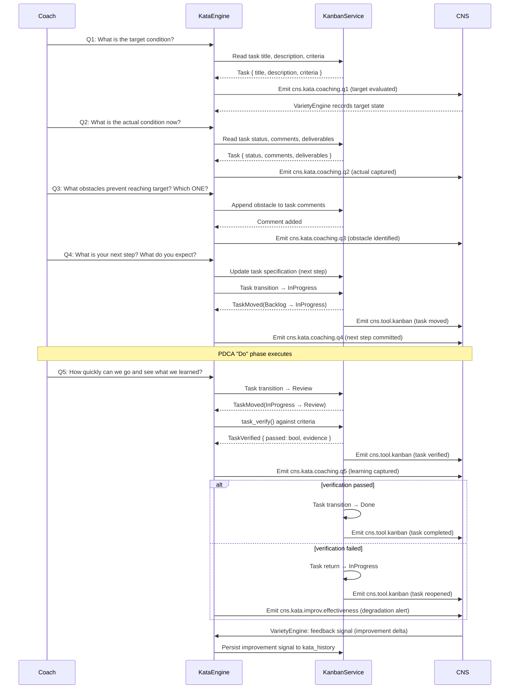

# Kata-Kanban Integration Architecture

**Purpose:** Describes how the Toyota Kata scientific thinking loop (PDCA: Plan-Do-Check-Act) integrates with kanban task boards and the Cybernetic Nervous System (CNS) for replicant-driven self-improvement.

**Related:** [`KataEngine`](../../crates/hkask-services-kata/src/kata_impl.rs), [`KanbanService`](../../crates/hkask-services-kanban/src/kanban_impl.rs), [`KataImprovResult`](../../crates/hkask-improv/src/kata.rs), [`CnsSpan`](../../crates/hkask-types/src/cns.rs)

---

## 1. Overview

The Toyota Kata methodology provides a scientific thinking framework for agent self-improvement. hKask integrates this with kanban task boards as the **execution surface** and CNS spans as the **observability layer**. Three kata types compose:

| Kata | Purpose | Kanban Role |
|------|---------|-------------|
| **Coaching Kata** | 5-question dialogue guiding improvement | Questions map to task fields; coach guides, does not solve |
| **Improvement Kata** | 4-step PDCA cycle (Understand → Grasp → Target → Experiment) | Task moves through backlog→in_progress→review→done |
| **Starter Kata** | Practice routines (Observation, 5 Questions, PDCA drills) | Task holds focus area and sub-problem |

The `KataEngine` (`crates/hkask-services-kata/src/kata_impl.rs`) loads YAML manifests, renders Jinja2 templates, calls inference, collects before/after metrics, and computes improvement signals. The `KanbanService` (`crates/hkask-services-kanban/src/kanban_impl/kata.rs`) generates structured coaching/improvement/practice prompts directly from task state.

---

## 2. Kata-Improv Integration

Each kata phase maps to a recommended improv mode via `KataPhase::recommended_mode()` (`crates/hkask-improv/src/kata.rs:40`):

| Kata Phase | Phase Enum | Recommended Improv Mode |
|------------|-----------|------------------------|
| Starter Observation Drill | `StarterObservation` | `Plussing` |
| Starter Five Questions Drill | `StarterFiveQuestions` | `YesAnd` |
| Starter PDCA Cycle | `StarterPdca` | `YesBut` |
| Coaching Q4 (next step) | `CoachingQ4` | `YesBut` |
| Coaching Q5 (learn) | `CoachingQ5` | `Plussing` |

Questions 1-3 are neutral (coach gathers information, no improv mode needed).

The `KataImprovResult` struct (`crates/hkask-improv/src/kata.rs:66`) tracks `automaticity_delta` and emits an alert if delta < 0.0 (improv degraded kata performance).

---

## 3. Coaching Loop Sequence Diagram



---

## 4. PDCA → Kanban State Mapping

| PDCA Phase | Kanban Task Status | CNS Event |
|------------|-------------------|-----------|
| **Plan** (Understand Direction, Grasp Condition) | `Backlog` | `cns.tool.kanban` (task created) |
| **Do** (Next Step, Experiment) | `InProgress` | `cns.tool.kanban` (task moved, agent assigned) |
| **Check** (Verify against criteria) | `Review` | `cns.tool.kanban` (task verified) |
| **Act** (Incorporate learning, close loop) | `Done` | `cns.tool.kanban` (task completed) |

State transitions enforced by `kanban_task_move` (`mcp-servers/hkask-mcp-kanban/src/main.rs:235`):
- `Backlog → InProgress`: on Q4 answer (next step committed)
- `InProgress → Review`: on Q5 trigger (ready to learn)
- `Review → Done`: on successful verification
- `Review → InProgress`: on failed verification (rework loop)

---

## 5. CNS Span Trace

```
cns.kata.coaching.q1 (target evaluated)
    └─ cns.tool.kanban (task created in Backlog)
cns.kata.coaching.q2 (actual captured)
cns.kata.coaching.q3 (obstacle identified)
cns.kata.coaching.q4 (next step)
    └─ cns.tool.kanban (TaskMoved: Backlog → InProgress)
cns.kata.coaching.q5 (learning)
    ├─ cns.tool.kanban (TaskMoved: InProgress → Review)
    ├─ cns.tool.kanban (TaskVerified: pass/fail)
    └─ cns.tool.kanban (TaskMoved: Review → Done or InProgress)
cns.kata.improv.effectiveness
    └─ variety_feedback → CNS homeostatic loop
```

The `KataImprovEffectiveness` span (`crates/hkask-improv/src/kata.rs:12-13`) tracks `automaticity_delta` when improv modes are active vs. baseline kata performance. Alert threshold: delta < 0.0.

The CNS variety feedback loop processes improvement signals through the `VarietyEngine` and feeds back into kata state for adaptive homeostatic regulation (P9).

---

## 6. Coaching 5 Questions → Kanban Task Fields

| Coaching Question | Kanban Task Field | Source |
|-------------------|-------------------|--------|
| Q1: Target condition | `task.title`, `task.description`, `task.criteria` | Title and description set at task creation; criteria define verification |
| Q2: Actual condition now | `task.comments`, `task.status`, `task.deliverables` | Comments capture observables; status reflects position |
| Q3: Obstacles (which ONE?) | `task.comments`, `task.phase` | Obstacle recorded as comment; phase scopes focus area |
| Q4: Next step + expectation | `task.specification` | Specification captures the experiment plan |
| Q5: How quickly to learn? | `task.criteria`, verification evidence | Criteria define pass/fail; `task_verify()` evaluates |

The `task_coaching_prompt()` method (`crates/hkask-services-kanban/src/kanban_impl/kata.rs:4`) generates the full 5-question coaching prompt from task state, including target (from criteria), actual condition (from status, deliverables, and comment thread), and structured Q3-Q5 placeholders.

---

## 7. Error Recovery Guidance

### 7.1 Verification Failure (Review → InProgress loop)

When `task_verify()` returns `TaskVerified { passed: false }`:
1. KanbanService transitions task back to `InProgress`
2. CNS emits `cns.tool.kanban` (task reopened)
3. `KataEngine` emits `cns.kata.improv.effectiveness` with degradation alert
4. Replicant re-enters Q4-Q5 loop with new obstacle analysis
5. After 3 consecutive verification failures, `kanban unjam <board>` triggers escalation

### 7.2 Task Stalls (no state transition for > 24h)

1. `kanban unjam <board>` (`crates/hkask-cli/src/repl/handlers/kanban.rs:54`) scans for stuck tasks
2. Stuck tasks flagged in CNS via `cns.tool.kanban` with stall metadata
3. Coach receives variety-deficit alert through CNS homeostatic loop
4. Remediation: shrink experiment scope (Q4), split into sub-tasks, or adjust target (Q1)

### 7.3 Improvement Signal Degradation

When `automaticity_delta` trends negative over multiple kata sessions:
1. `KataImprovResult.should_alert` fires (`crates/hkask-improv/src/kata.rs:77`: delta < 0.0)
2. CNS variety feedback signals degradation to `KataEngine`
3. `KataEngine` triggers `manifest.yaml` error-handling path (`ErrorHandling` config)
4. Recovery: switch improv mode (e.g., Plussing → YesAnd), reduce experiment scope, or return to Starter Kata drills for foundational habit repair

### 7.4 CNS Span Loss

If CNS event sink is unavailable during kata execution:
1. Spans are buffered in-memory via `CyberneticsLoop::process_inbox()`
2. `ContractDiscipline` (`crates/hkask-cns/src/contract_discipline.rs`) retries emission on next sense→act cycle
3. If buffer overflows, oldest spans are dropped with a `cns.variety.buffer_overflow` alert
4. Kanban task state is the durable source of truth; spans are reconstructed from task history if needed
