# Kindle-Zip Pipeline Semantic Map
#
# Mermaid entity-relationship diagram of the complete kindle-zip tool
# showing: pipeline steps, data artifacts, MCP tools, CNS spans,
# template invocations, and hKask system integration points.
#
# Legend:
#   ⬡ = Template (Jinja2, KnowAct/WordAct)
#   ◇ = MCP Tool (Rust bridge)
#   ▭ = Artifact (file on disk, persisted state)
#   ○  = CNS Span (observability event)
#   ⬢ = hKask System Component
#
# Generated with pragmatic-semantics classification of each edge.

```mermaid
flowchart TB
    subgraph Input["User Input (Personal Machine)"]
        ASIN["ASIN + Amazon Credentials"]
    end

    subgraph Manifest["kindle-zip.yaml (FlowDef)"]
        direction TB
        MF["Manifest Schema: 6 steps, gas budget, OCAP, CNS"]
    end

    subgraph Step1["Step 1: kindle_extract (MCP Tool)"]
        direction TB
        VFY["verify-selectors.j2 ⬡<br/>KnowAct: selector drift check"]
        BRW["extract.rs ◇<br/>Browser automation bridge"]
        LOGIN["kindle_login() IS: navigates Amazon sign-in<br/>OUGHT: produce authenticated session"]
        CAP["capture_pages() IS: iterates Kindle reader<br/>OUGHT: produce PNG per content page"]
        PARSE["parse_page_count() IS: reads footer text<br/>EPISTEMIC: probabilistic (fallback=50)"]
        S1OUT["▭ metadata.json + pages/*.png<br/>PROVENANCE: directly stated by browser DOM"]

        VFY --> BRW
        BRW --> LOGIN --> CAP --> PARSE --> S1OUT
    end

    subgraph Step2["Step 2-3: kindle_transcribe (MCP Tool)"]
        direction TB
        CFG["configure-ocr.j2 ⬡<br/>KnowAct: selects model/tokens/concurrency<br/>EPISTEMIC: probabilistic (heuristic by page count)"]
        LOAD["transcribe.rs ◇<br/>Loads images, runs OCR pipeline"]
        PIPELINE["run_pipeline() IS: Tesseract→LLM OCR routing<br/>OUGHT: multi-backend with cross-validation"]
        MDS["ProvenanceRecord per chunk<br/>PROVENANCE: directly stated (backend label + param hash)"]
        S3OUT["▭ content.json with MDS provenance"]

        CFG --> LOAD --> PIPELINE --> MDS --> S3OUT
    end

    subgraph Step4["Step 4: Content Assembly (Template)"]
        direction TB
        ASM["assemble-content.j2 ⬡<br/>KnowAct: TOC-anchored chapter stitching<br/>OUGHT: clean, structured text ready for export"]
        CHSPLIT["split_into_chapters() IS: TOC label → text.find()<br/>EPISTEMIC: declarative (exact string match)"]
        S4OUT["▭ assembled_text + chapter_count"]

        ASM --> CHSPLIT --> S4OUT
    end

    subgraph Step5["Step 5: kindle_export (MCP Tool)"]
        direction TB
        DSP["export-dispatch.j2 ⬡<br/>KnowAct: routes to format sub-templates"]
        PDF["export_pdf.rs ◇<br/>IS: Helvetica PDF, single-page<br/>OUGHT: valid PDF with correct xref"]
        EPUB["export_epub.rs ◇<br/>IS: ZIP of XHTML chapters<br/>OUGHT: valid EPUB 3.0"]
        MD["export_markdown.rs ◇<br/>IS: # headings + TOC anchors<br/>OUGHT: readable Markdown"]
        TXT["plain text ◇<br/>IS: verbatim UTF-8<br/>OUGHT: lossless transcription"]
        S5OUT["▭ book.{pdf,epub,md,txt}"]

        DSP --> PDF & EPUB & MD & TXT --> S5OUT
    end

    subgraph Step6["Step 6: CNS Feedback"]
        direction TB
        CNSOUT["○ cns.doc.kindle-zip<br/>span: total_words, transcribed_pages, ocr_confidence"]
    end

    subgraph hKask["hKask System Integration"]
        direction LR
        INF["hkask-inference ◇<br/>Multi-provider vision LLM router<br/>DI/TG/FA/OR backends"]
        MEM["hkask-mcp-memory ◇<br/>CNS feedback persistence"]
        TMPL["hkask-templates ◇<br/>minijinja renderer"]
        CNS["hkask-cns ◇<br/>variety monitoring, algedonic alerts"]
        OCAP["hkask-capability ◇<br/>delegation tokens, gas budgets"]
        KASK["kask CLI ◇<br/>kask docproc kindle-zip --asin X"]
    end

    %% Connections
    ASIN --> MF
    MF --> Step1
    Step1 -->|"metadata_path + pages_dir"| Step2
    Step2 -->|"content.json"| Step4
    Step4 -->|"assembled_text + TOC"| Step5
    Step5 -->|"export paths + byte counts"| Step6

    %% hKask integration edges
    BRW -.->|"headless_chrome dependency"| INF
    PIPELINE -.->|"generate_vision()"| INF
    PIPELINE -.->|"embedding cross-validation"| INF
    CNSOUT -.->|"ν-event emission"| MEM
    CNSOUT -.->|"variety counter update"| CNS
    CFG -.->|"minijinja render"| TMPL
    ASM -.->|"minijinja render"| TMPL
    DSP -.->|"minijinja render"| TMPL
    MF -.->|"capability validation"| OCAP
    KASK -.->|"tool invocation"| Step1
    KASK -.->|"tool invocation"| Step2
    KASK -.->|"tool invocation"| Step5

    %% Semantic classification callouts
    VFY -.- SEM1["PROVENANCE: directly stated<br/>(DOM query result)"]
    PARSE -.- SEM2["EPISTEMIC: probabilistic<br/>(heuristic, fallback=50)"]
    PIPELINE -.- SEM3["OUGHT: Guardrail<br/>(multi-backend routing)"]
    MDS -.- SEM4["PROVENANCE: directly stated<br/>(backend label + md5 hash)"]
```



### Epistemic Classification of Every Edge

| Edge | Ontology | Epistemic | Force | Confidence |
|------|----------|-----------|-------|------------|
| ASIN→login→authenticated session | IS (browser DOM) | Declarative | Evidence | High |
| page_count parse | IS (footer text) | Probabilistic | Evidence | Medium (fallback=50) |
| OCR model selection | OUGHT (heuristic) | Probabilistic | Guideline | Medium |
| OCR transcription | IS (LLM output) | Probabilistic | Evidence | Medium (confidence field) |
| Chapter splitting | IS (string match) | Declarative | Evidence | High |
| PDF xref generation | IS (byte offsets) | Declarative | Evidence | High (verified by test) |
| EPUB ZIP structure | IS (zip crate) | Declarative | Evidence | High |
| CNS span emission | IS (tracing) | Declarative | Evidence | High |
| Selector validity | IS (DOM query) | Declarative | Guardrail | High (blocks pipeline on failure) |
| OCAP capability check | OUGHT (P12) | Declarative | Prohibition | Absolute |

### Transformational Semantics — What Each Step Transforms

```
Step 1:  {asin, email, password}  →  {PNG₀…PNGₙ, metadata.json}
         Syntactic: Amazon HTML DOM → PNG bytes → filesystem
         Semantic:  Opaque DRM'd page → visual representation

Step 2-3: {PNG₀…PNGₙ}  →  {content.json with ProvenanceRecord per chunk}
         Syntactic: PNG bytes → base64 → vision LLM → UTF-8 text
         Semantic:  Visual representation → machine-readable text

Step 4:  {content.json, metadata.json}  →  {assembled_text}
         Syntactic: page-indexed chunks → TOC-anchored chapters
         Semantic:  Flat page sequence → hierarchical document

Step 5:  {assembled_text}  →  {book.pdf, book.epub, book.md}
         Syntactic: UTF-8 → PDF bytecode / EPUB ZIP / Markdown
         Semantic:  Raw text → consumable open format

Step 6:  {pipeline metrics}  →  {CNS ν-event}
         Syntactic: Rust struct → tracing::info! → CNS span
         Semantic:  Execution trace → variety counter update
```
