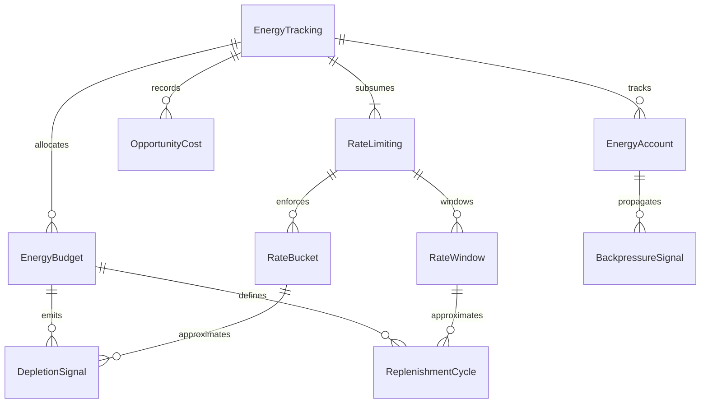
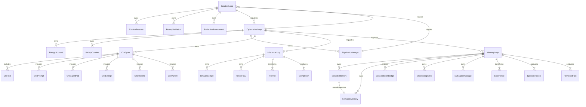
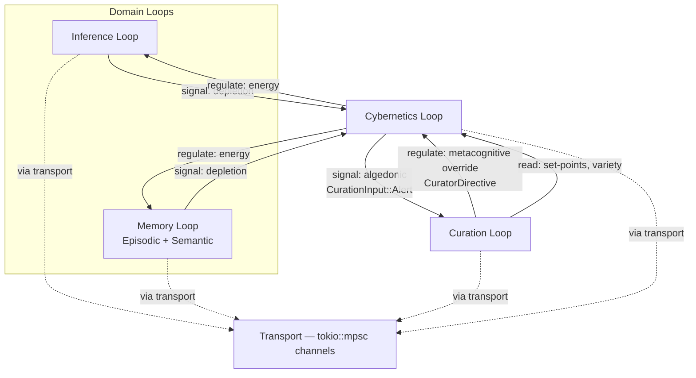

# Loop Architecture — Semantic Root-Cause Analysis & Four-Loop Decomposition

**Purpose:** Establish that rate limiting is a redundant projection of energy tracking, decompose hKask into four semantic loops, map crates to loops, define capability membranes, and document open questions.

**Related:** [`PRINCIPLES.md`](core/PRINCIPLES.md), [`MDS.md`](core/MDS.md), [`magna-carta.md`](core/magna-carta.md)

---

## 1. Semantic Root-Cause Analysis — Rate Limiting vs. Energy Tracking

### 1.1 The Subsumption Claim

Every rate limit is an energy constraint over a time window. This is not an analogy — it is a strict semantic subsumption:

| Rate Limiting Concept | Energy Tracking Equivalent | Relationship |
|-----------------------|---------------------------|--------------|
| Token bucket capacity | `EnergyBudget` allocation | Bucket capacity = energy cap for a span type |
| Refill rate | `ReplenishmentCycle` | Fixed refill = periodic energy restoration |
| Window (sliding/fixed) | `ReplenishmentCycle` period | Window = replenishment period |
| Throttle / backoff | `DepletionSignal` + `BackpressureSignal` | Throttle = depletion-triggered backpressure |
| 429 Rate Limited | `EnergyBudget.try_consume()` → `Err(InsufficientEnergy)` | Same signal, richer semantics |

Energy tracking subsumes rate limiting by modeling **depletion**, **replenishment**, and **allocation** without the artificial discretization of fixed windows. A rate bucket says "N operations per T seconds." An energy budget says "this operation costs E energy, the account holds B balance, replenishment restores R per cycle, and the opportunity cost of spending E here is recorded."[^beer-vsm]

**Deeper reason: least action.** Energy tracking is not merely a richer resource model — it is the computational expression of the least action principle (see [`lazy-universe-research.md`](../research/lazy-universe-research.md)). Every operation costs gas because every operation has an action cost — the "distance" the system moves in configuration space. The budget cap is the maximum action the system allows per session. The replenishment rate is the cybernetic analog of a system settling back toward its stationary action path — capacity restores because the governing dynamics select lower-action configurations over time. Backpressure is the governing dynamic asserting itself: when the system approaches its action budget, it resists further expenditure. Rate limiting was a lossy projection of action tracking — energy tracking is the direct measurement.

### 1.2 Root Cause

Rate limiting emerged as a **local approximation of energy accounting** before a unified energy model existed. It solved the immediate problem — preventing resource exhaustion — by discretizing continuous energy flow into countable tokens over fixed windows. This served correctly as a stopgap but introduced two costs:

1. **Coupling without expressiveness:** Rate limits couple callers to window boundaries (sliding vs. fixed, per-key vs. global) without expressing *why* the limit exists or *what* it protects.
2. **Redundant projection:** With `EnergyBudget.try_consume()` now gating all operations under a unified energy cap, the rate limiter is a lossy projection of information that the energy model already holds in richer form.

The single root cause: **rate limiting was a local approximation of energy accounting that became redundant when the unified energy model arrived.**[^ashby-law]

**Deeper root cause:** Rate limiting was a local approximation of *action tracking*. The system needed to track and manage action in computational space — how far each operation moves the system in configuration space, and whether the cumulative action exceeds what the system can sustain. Rate limiting approximated this with token buckets over fixed windows. Energy tracking measures it directly with gas costs, budget caps, and replenishment rates. The unified energy model didn't just replace rate limiting — it implemented the least action principle as infrastructure.

### 1.3 Shared Concepts

| Concept | Rate Limiting Form | Energy Tracking Form |
|---------|-------------------|---------------------|
| Token budget | Bucket capacity | `EnergyBudget` allocation |
| Time window | Sliding / fixed window | `ReplenishmentCycle` period |
| Depletion signal | 429 response / throttle | `DepletionSignal` (typed, with severity) |
| Replenishment cycle | Token refill | `ReplenishmentCycle` (configurable per span) |
| Backpressure propagation | Retry-After header | `BackpressureSignal` (propagated across loops) |

### 1.4 Subsumption ERD



<!-- DIAGRAM_ALIGNMENT
id: DIAG-LOOP-001
verified_date: 2026-06-07
verified_against: crates/hkask-cns/src/energy.rs:55; MDS.md §4.6-4.7
status: VERIFIED
-->

### 1.5 Consequence

The system has removed the `RateLimiter` and `CnsTokenBucket` types. `McpErrorKind::RateLimited` remains **only** for external HTTP 429 responses where downstream services impose rate limits — hKask does not use it as an internal concept. All internal resource gating flows through `EnergyBudget.try_consume()`.

### 1.6 External-Boundary Rate Limiting — Cybernetics Membrane at the Transport Boundary

`hkask-mcp-web` implements a per-tool fixed-window `RateLimiter` (30 requests/60s) that sits at the HTTP transport boundary. Per the 4-loop model, Communication is demoted to transport (`tokio::mpsc` channels) with no throttling authority. The `RateLimiter` is therefore **a Cybernetics membrane concern applied TO the transport boundary**, not a Communication-internal concern.

**Important distinction:** The `RateLimiter` lives in `hkask-mcp-web` (an MCP server), not in any loop struct. Inter-loop communication uses direct typed `tokio::mpsc` channels with no intermediary — channel identity replaces the former `LoopId`/`DispatchTarget` routing. There is no `max_deliveries_per_tick` or queue depth counter — backpressure is inherent in channel capacity.

**Authority classification:**

| Concern | Loop | Rationale |
|---------|------|------------|
| Internal energy budgets | Cybernetics | Regulation of agent resource consumption via `GovernedTool` gas accounting |
| External-boundary rate limiting | Cybernetics membrane applied TO transport boundary | Security membrane protecting MCP servers from external client DoS — authority is Cybernetics, deployment point is transport |

CNS retains the final word on all throttling, circuit-breaking, and dampening decisions.

---

## 2. Four-Loop Architecture — Semantic Decomposition

### 2.1 Two-Layer Model

hKask decomposes into four loops:

> **Terminology:** *Context* is **condensed** (ephemeral conversation window, handled by the condenser server). *Memory* is **consolidated** (persistent episodic → semantic triples, handled by the consolidation bridge). These are distinct operations on distinct substrates.

**Domain Loops** — value-producing:

| Loop | Owns | Transforms | Least Action Role |
|------|------|------------|-------------------|
| **Inference Loop** | LLM call budget, token flow, energy budgets (hJoules) | Prompts → Completions | Action tracking per inference operation — each token has an action cost |
| **Memory Loop** | Episodic + Semantic memory, embedding indices, SQLCipher storage, consolidation bridge | Experiences → Episodic records → Semantic facts | Pragmatic compression over time — consolidation discards redundant episodes, preserves semantic essence |

**Meta Loops** — governing:

| Loop | Owns | Regulates | Least Action Role |
|------|------|-----------|-------------------|
| **Curation Loop** | Curator persona, prompt validation, reflective self-assessment | Which goals are pursued, whether behavior is coherent | Selection mechanism — chooses which paths the system pursues (the "which path" of δS = 0) |
| **Cybernetics Loop** | Observability, governance, energy accounting (hJoules), homeostatic regulation | Health, stability, resource equilibrium of the entire system | Action tracking and boundary enforcement — measures action consumption, asserts backpressure at budget limits, senses anti-lazy drift via `EnergyDelta` |

**Communication** functions as transport infrastructure, not a loop — `tokio::mpsc` channels handle inter-loop messaging. Communication does not own resources, does not regulate, and does not transform. It operates as a dumb pipe.

### 2.2 Loop ERD



<!-- DIAGRAM_ALIGNMENT
id: DIAG-LOOP-002
verified_date: 2026-06-09
verified_against: PRINCIPLES.md §2; MDS.md; crates/hkask-cns/src/runtime.rs; crates/hkask-memory/src
status: UPDATED — 6 loops reduced to 4
-->

### 2.3 CNS Span Subsumption into Cybernetics Loop

The existing `cns.*` span namespaces are not removed — they are **absorbed** into the Cybernetics Loop as its observability substrate:

| Old Namespace | Cybernetics Loop Role |
|---------------|----------------------|
| `cns.tool.*` | Tool invocation governance — energy cost of tool calls |
| `cns.prompt.*` | Prompt render/validation — energy cost of inference preparation |
| `cns.inference.*` | Inference governance — GovernedTool membrane, token budgets, model selection (deprecated: `GovernedInference`) |
| `cns.agent_pod.*` | Pod lifecycle — energy cost of agent activation |
| `cns.connector.*` | External I/O — energy cost of connector operations |
| `cns.energy.*` | Direct energy budget tracking — the loop's core metric |
| `cns.pipeline.*` | Memory pipeline — energy cost of memory operations |
| `cns.variety.*` | Variety counters — homeostatic variety sensing |
| `cns.curation.*` | Curation operations — signal to Curation Loop |
| `cns.sovereignty.*` | Sovereignty enforcement — signal to Curation Loop |
| `cns.goal.*` | Goal lifecycle — signal to Curation Loop |
| `cns.spec.*` | Specification operations — signal to Curation Loop |
| `cns.condenser.compression_ratio` | Pragmatic compression efficiency — bytes_out / bytes_in per cycle. Ratio < 1.0 for 3+ cycles → Warning (anti-compressing) |
| `cns.evolution.energy_delta` | Action gradient — energy(S_t) - energy(S_{t+1}). Positive for 5+ cycles → Critical (anti-lazy drift) |
| `cns.architecture.module_depth` | Architectural action — public_fn_count / total_fn_count. Ratio > 0.5 → Warning (shallow module) |
| `cns.outcome.tool` | Tool outcome quality — success/failure rate per MCP server. Success rate < 50% → Warning, < 25% → Critical |
| `cns.outcome.inference` | Inference outcome quality — success/failure rate for LLM calls |
| `cns.outcome.memory` | Memory outcome quality — success/failure rate for memory operations |

The Cybernetics Loop **owns** all `cns.*` spans. Other loops emit `NuEvent`s into these spans, but the Cybernetics Loop is the sole consumer and regulator of the observability they produce.

### 2.4 Algedonic Alert Pathway

The algedonic alert is the **single escalation pathway** from the Cybernetics Loop to the Curation Loop:

```
Cybernetics Loop (variety deficit > threshold)
  → AlgedonicManager creates RuntimeAlert
  → NuEventStore persists algedonic event (phase=Act)
  → Curation Loop reads algedonic events via cursor
  → Curator Agent reviews via metacognition cycle
  → Curator assesses and intervenes (or escalates to human)
```

This pathway is **unidirectional**: Cybernetics signals Curation, but Curation does not signal Cybernetics — it *regulates* Cybernetics through metacognitive override (see §4).

---

## 3. Crate-to-Loop Mapping

### 3.1 Mapping Table

| Existing Component | Owning Loop | Minimal Interface Exposed |
|--------------------|-------------|--------------------------|
| `hkask-mcp` (dispatch) | Transport (tokio) | `dispatch(tool, args) → Result<Output>` |
| `hkask-agents` (curator) | Curation | `CurationLoop`, `CuratorContext` |
| `hkask-agents` (curator_agent) | Curation | `CuratorAgent`, `DefaultSpecCurator` |
| `hkask-cns` (governed_tool) | Cybernetics → all tools | `GovernedTool`, `EnergyEstimator` |
| `hkask-memory` | Memory | `record(experience) → RecordID`, `query(embedding, k) → Vec<Fact>`, consolidation bridge |
| `hkask-keystore` | Cybernetics | `derive_key(purpose) → KeyRef`, `sign(data) → Signature` |
| `hkask-storage` | Shared substrate | `read(cap, path) → Data`, `write(cap, path, data) → ()` |
| `hkask-cns` | Cybernetics | `observe(event)`, `regulate(span, action)`, `health() → CnsHealth` |
| `hkask-templates` | Curation | `render(template, ctx) → String`, `validate(template) → ValidationResult` |
| `hkask-ensemble` | Curation | **Deferred (2026-06-14):** Future multi-agent mode evolving from dual-presence pattern. Ensemble crate removed; preserved as reference for future implementation. |
| `hkask-cli` / `hkask-api` | Surface (presentation) | `execute(command) → Result<Output>` |
| `hkask-services` | Service layer | `ChatService`, `InferenceService`, domain operations |
| `hkask-types` | Shared substrate | Type definitions only — no behavior |
| Inference Router (hkask-inference) | Inference (via MCP) | `complete(prompt, budget) → Completion` — Multi-provider routing (OM/FW/DI) |

### 3.2 Interface Discipline

Each loop exposes a **minimal interface** — a set of operations that other loops may invoke without coupling to internals:

1. **No struct leakage:** Interfaces accept and return primitive types or type aliases from `hkask-types`, not internal domain structs.
2. **Capability-gated:** Every cross-loop call requires a `DelegationToken` (aliased as `CapabilityToken`) authorizing the specific operation.
3. **Energy-accounted:** Every cross-loop call is metered through `EnergyBudget.try_consume()` before execution.
4. **Observable:** Every cross-loop call emits a `NuEvent` into the appropriate `cns.*` span.

### 3.3 Shared Substrate

`hkask-storage` and `hkask-types` belong to **no single loop** — they serve as shared substrate accessed via capability. No loop may access storage directly; OCAP tokens mediate all access, attenuating on each delegation. This prevents any loop from accumulating implicit authority over another loop's data.

### 3.4 MCP Server-to-Loop Mapping

MCP servers are operational units that reside within the loop architecture. Each server is assigned to its semantically correct loop based on the authority it enforces.

**Assignment criteria.** A server shall be assigned to the loop whose membrane (§4) encloses the authority the server's tools exercise. Specifically:

1. **Domain authority** — the loop whose primary state the server reads or writes. A server that reads/writes the prompt queue, the fact store, or the message queue belongs to the loop that owns that state, not to a loop that merely observes it.
2. **Authoritative transform** — the loop whose core transform the server performs. Inference servers (LLM calls), condensation servers (context windowing), and curation servers (MDS spec capture) belong to the loop whose function they embody.
3. **Membrane containment** — a server shall not span two loops whose capability membranes (§4) forbid the cross-loop authority. Servers that legitimately touch multiple loops (e.g. `hkask-mcp-memory` for episodic + semantic store bridging) shall be marked as a *bridge* with the loops it connects explicitly named.
4. **No anchoring by call site** — the assignment is determined by what the server *governs*, not by which loop happens to invoke it. A web I/O server invoked from the Inference loop is still a Communication-loop server, because the authority is routing, not inference.

**Per-server assignments:**

| MCP Server | Loop | Rationale |
|-----------|------|----------|
| `hkask-mcp-condenser` | L2 (Episodic) | Context condensation operates on the active conversation window (episodic boundary) |
| `hkask-mcp-memory` | L2↔L2b (bridge) | Combined episodic + semantic memory storage and retrieval. Bridges episodic (L2) and semantic (L2b) loops. |
| `hkask-mcp-web` | L4 (Communication) | External I/O dispatch — Communication routes web requests |
| `hkask-mcp-companies` | L4 (Communication) | Company financial data (FMP + EODHD) — Communication routes external integrations |
| `hkask-mcp-communication` | L4 (Communication) | Local TTS/STT — Communication routes voice I/O |
| `hkask-mcp-media` | L4 (Communication) | AI media generation — Communication routes external integrations |
| `hkask-mcp-rss-reader` | L2 (Episodic) | RSS feeds are consumed into episodic memory |
| `hkask-mcp-spec` | L5 (Curation) | MDS spec capture — Curation governs specification authoring |
| `hkask-mcp-doc-knowledge` | L2 (Episodic) | Document parsing and chunking — feeds parsed documents into the episodic boundary |
| `hkask-mcp-markitdown` | L2 (Episodic) | Document format conversion and OCR — ingests converted content into the episodic boundary |

These assignments are normative. A server that does not satisfy one of criteria 1–4 for its assigned loop shall be reclassified or, if no loop fits, marked as substrate rather than loop-resident.

---

## 4. Capability Membranes

### 4.1 OCAP Discipline for Loops

The capability membrane for each loop defines four boundaries:

| Boundary | Meaning |
|----------|---------|
| **Can read** | State it may observe without modification |
| **Can write** | State it may modify |
| **Can signal** | Asynchronous notifications it may emit to other loops |
| **Never reaches** | State and operations that are categorically forbidden |

### 4.2 Membrane Definitions

#### Inference Loop

| Boundary | Scope |
|----------|-------|
| **Can read** | Prompt queue, token budget remaining, model configuration |
| **Can write** | Completion output buffer, token consumption counter |
| **Can signal** | Depletion signal to Cybernetics Loop (energy), completion notification via tokio channel |
| **Never reaches** | Memory indices, conversation stream, capability tokens of other loops |

#### Semantic/Fact Memory Loop

| Boundary | Scope |
|----------|-------|
| **Can read** | Embedding indices, knowledge graph, query queue |
| **Can write** | Fact store, embedding vectors, retrieval cache |
| **Can signal** | Depletion signal to Cybernetics Loop (energy), retrieval notification via tokio channel |
| **Never reaches** | LLM call budget, conversation stream, capability tokens of other loops |

#### Episodic Memory Loop

| Boundary | Scope |
|----------|-------|
| **Can read** | Conversation/event stream, SQLCipher storage, episodic query queue |
| **Can write** | Episodic records, conversation log, decay markers |
| **Can signal** | Depletion signal to Cybernetics Loop (energy), record notification via tokio channel |
| **Never reaches** | Knowledge graph, LLM call budget, capability tokens of other loops |

#### Transport (tokio::mpsc channels)

| Boundary | Scope |
|----------|-------|
| **Can read** | Channel capacity (inherent backpressure) |
| **Can write** | Channel delivery only |
| **Can signal** | None — transport is a dumb pipe, no signaling authority |
| **Never reaches** | Energy accounts, variety counters, prompt validation, knowledge graph internals, capability tokens |

#### Curation Loop (regulatory) + Curator Agent (persona)

| Boundary | Scope |
|----------|-------|
| **Can read** | Curator persona state, NuEvent store (algedonic review), escalation queue, Cybernetics set-points, variety counters, energy budget status, SpecDriftAlert from DefaultSpecCurator (via CurationInput channel) |
| **Can write** | CuratorDirective (CalibrateThreshold, OverrideEnergyBudget, UpdateCapabilities, SeekMoreEvidence, ReplenishBudget), goal priority, metacognitive override decisions |
| **Can signal** | Metacognitive override to Cybernetics Loop, goal revision via CurationInput channel |
| **Never reaches** | Token flow, embedding indices, SQLCipher encryption keys, message routing internals |

#### Cybernetics Loop

| Boundary | Scope |
|----------|-------|
| **Can read** | All `cns.*` spans, energy accounts, variety counters, algedonic alert state |
| **Can write** | Energy budgets, variety counters, algedonic alert escalation state |
| **Can signal** | Algedonic alert (CurationInput::Alert) to Curation Loop, backpressure to domain loops |
| **Never reaches** | Prompt content, message routing logic, goal priority, Curator persona internals |

### 4.3 Cross-Loop Authority Rules

1. **Domain loops may signal their governing meta loop but never each other directly.** The Inference Loop does not call the Memory Loop — it signals through `tokio::mpsc` channels wired at composition time. Each loop's channel endpoints are injected by the service layer; loops never hold references to each other.
2. **Transport is a dumb pipe, not a regulator.** `tokio::mpsc` channels route messages between loops but have no authority over any loop's behavior. They cannot override energy budgets, throttle agents, or issue directives.
3. **The Cybernetics Loop regulates both domain loops and may signal the Curation Loop. It may not regulate the Curation Loop.** Cybernetics can throttle inference energy but cannot override a Curator decision. Curation regulates Cybernetics through `CuratorDirective` messages (CalibrateThreshold, OverrideEnergyBudget, ReplenishBudget, SeekMoreEvidence) sent on a direct `mpsc` channel — this is the explicit governance path, not a bypass.
4. **The Curation Loop regulates Cybernetics via metacognitive override.** This is the single escalation path. If the Cybernetics Loop's homeostatic regulation conflicts with a Curator-assessed goal, the Curator wins.

### 4.4 Capability Membrane Graph



<!-- DIAGRAM_ALIGNMENT
id: DIAG-LOOP-003
verified_date: 2026-06-07
verified_against: loop-architecture.md §4.4
status: UPDATED — Communication Loop removed, Memory merged, transport as tokio channels
-->

### 4.5 Cycle-Freedom Verification

The capability membrane has exactly one cycle-adjacent path:

```
Cybernetics → (signal) → Curation → (regulate) → Cybernetics
```

This is **not a cycle** — it is a directed escalation chain:

1. Cybernetics signals Curation (algedonic alert — informational, no authority).
2. Curation regulates Cybernetics (metacognitive override — authoritative, single checkpoint).

No loop can indirectly regulate itself without passing through the Curation Loop's metacognitive checkpoint. The Curation Loop is the **single authority** that can override any meta loop's decision, and it cannot be overridden by any other loop — it is the terminus of the escalation chain.

Formally: the regulation graph is a DAG with Curation as the unique maximal element. The signal graph is a subgraph of the regulation graph (signals are informational subsets of regulation authority). Therefore no regulation cycle exists.

**Data flow edges** (e.g., consolidation bridge: Episodic → Semantic) are not regulation edges. The consolidation bridge is one-way, gated by `ConsolidationToken`, and carries no authority — it moves private triples into shared knowledge under Curator authorization. It does not create cycles in the regulation or signal graphs.

---

## 5. Open Questions

### 5.1 Set-Point Derivation

**Tension:** The Cybernetics Loop needs target values (set-points) for energy budgets, variety counters, and algedonic thresholds. Currently these are hardcoded constants (e.g., warning at deficit > threshold/2 (=50 default), critical at deficit > threshold (=100 default)).[^beer-vsm]

**Options:**
- **A. Static configuration:** Set-points in YAML, loaded at bootstrap. Simple but inflexible.
- **B. Adaptive derivation:** Set-points derived from rolling statistics of actual system behavior (e.g., 95th percentile energy consumption over last N cycles). Flexible but introduces a secondary feedback loop.
- **C. Curator-specified:** The Curation Loop sets targets based on goal priority. Aligns with metacognitive override but couples set-points to goal state.

**Status:** Resolved. Option A — YAML-configurable set-points loaded at bootstrap, aligned with the "hKask is the loom, YAML is the thread" principle. Option B (adaptive derivation) may be explored in a future version if static set-points prove insufficient.

### 5.2 Loop Tick Cadence

**Tension:** Each loop has a natural update frequency. The Inference Loop ticks per LLM call (seconds). The Episodic Memory Loop ticks per conversation turn (minutes). The Cybernetics Loop ticks per variety counter update (variable). If loops share a single tick, fast loops waste cycles waiting; if they tick independently, synchronization and ordering become complex.

**Options:**
- **A. Event-driven:** Loops tick on demand when their input queue is non-empty. No wasted cycles, but no guaranteed liveness.
- **B. Fixed cadence per loop:** Each loop has its own tick interval. Predictable but may waste cycles during idle periods.
- **C. Hybrid:** Event-driven with a liveness heartbeat. Loops tick on demand but also tick at a minimum cadence to detect staleness.

**Status:** Resolved. Option C — event-driven with per-loop liveness heartbeat. Each loop ticks on demand when its input queue is non-empty, with a minimum liveness heartbeat whose interval varies by loop type. Inference: per-call. Cybernetics: 2s heartbeat. Curation: per-algedonic-alert. Domain memory: per-query. Transport (tokio channels) has no tick — it is push-driven.

### 5.3 Energy Unit Semantics

**Tension:** `EnergyBudget` currently uses an opaque `u64` energy unit. The semantics of this unit are undefined — is it tokens? Compute-seconds? A dimensionless cost scalar? The choice affects how energy budgets compose across loops.

**Options:**
- **A. Token-denominated:** 1 energy unit = 1 LLM token. Directly meaningful for the Inference Loop but awkward for memory and communication operations.
- **B. Compute-seconds:** 1 energy unit = 1 second of compute. Uniform across operations but requires profiling to calibrate.
- **C. Dimensionless cost scalar:** Each `EnergySpanType` defines its own cost function. Most flexible but requires per-operation calibration and makes cross-loop comparison harder.

**Status: Resolved — gas IS action.** The unit is **gas** — a dimensionless cost unit serving the same function as Ethereum gas: preventing infinite loops by making resource exhaustion explicit. But the deeper semantics are now anchored: gas is the computational measure of *action* — the "distance" the system moves in configuration space per operation. Each MCP server/tool has a configured gas cost in a `GasEstimator` table. Inference tools use token-based estimation (tokens are the natural action unit for LLM computation); other tools use flat costs from the table (calibrated to reflect relative action cost). Energy budgets replenish periodically — replenishment is the cybernetic analog of a system returning toward its stationary action path. The `EnergyDelta` type (see [`lazy-universe-research.md`](../research/lazy-universe-research.md)) measures whether the system is moving toward or away from stationary action. The thermodynamic anchoring is not deferred — it is here, through the least action principle. Gas is action.

### 5.4 Persistence of Loop State

**Tension:** Loops maintain state (energy balances, variety counters, message queues). Should this state survive restarts? Persisting loop state enables recovery but creates migration and versioning complexity.

**Options:**
- **A. Ephemeral:** Loop state is in-memory only. On restart, loops reinitialize from persistent domain data (storage, memory indices). Simple but loses runtime telemetry history.
- **B. Checkpointed:** Loop state is periodically checkpointed to SQLite. Enables recovery but requires schema migration on every loop state change.
- **C. Event-sourced:** Loop state is reconstructed by replaying `NuEvent` history. Principled but potentially expensive for long-running systems.

**Status:** Open. Option A is the simplest and aligns with the current implementation. Option C is the most cybernetically principled (the `NuEvent` stream already exists) but needs a truncation strategy. CurationLoop `restore_cursor()` now persists the algedonic review cursor to `NuEventStore` for crash recovery. Other loop state remains volatile (Option A).

### 5.5 Multi-Agent Energy Competition

**Tension:** When multiple agent pods are active, they share a global energy budget. How is energy allocated across competing pods? A greedy pod could exhaust the budget, starving others.

**Options:**
- **A. Equal partition:** Each active pod gets an equal share of the global budget. Fair but ignores priority differences.
- **B. Priority-weighted:** Pods receive energy proportional to their goal priority (set by Curation Loop). Aligns with metacognitive override but requires the Curation Loop to maintain priority rankings.
- **C. Auction-based:** Pods bid for energy using opportunity cost as currency. Economically principled but complex.

**Status:** Open. Option B is the natural extension of the Curation Loop's metacognitive override authority. The Curation Loop already owns goal priority — extending this to energy allocation is consistent.

### 5.6 Recursive Depth of Metacognitive Override

**Tension:** The Curation Loop can override any meta loop's decision via metacognitive override. But what if the Curation Loop's own override decision is wrong? The current architecture has no mechanism for the system to override the Curator — the human is the final escalation point. But in autonomous operation (no human available), the system needs a self-correction path.

**Options:**
- **A. Single depth:** The Curator's override is final. No self-correction without human intervention. Simple but brittle in autonomous mode.
- **B. Bounded recursion:** The Curator may override up to N levels of recursion (e.g., the Curator overrides Cybernetics, which triggers a re-evaluation, which the Curator may override again, up to N times). Prevents infinite loops but requires a depth counter.
- **C. Cooldown-based:** After a metacognitive override, the same override cannot be re-applied for a cooldown period. Prevents rapid oscillation without a hard depth limit.

**Status:** Resolved. Option C — cooldown-based. Implemented in `Dampener` with a 120-second `override_cooldown`. After any metacognitive override passes dedup, ALL subsequent overrides within the cooldown window are suppressed regardless of fingerprint. This prevents oscillation without introducing a hard depth counter.

### 5.7 Energy Budget Replenishment

Resolved: Energy budgets replenish on a configurable cadence managed by the Cybernetics Loop. Each `EnergyBudget` has a `replenish_rate` (gas units per interval) and a `replenish_interval`. The Cybernetics Loop calls `replenish()` during its regulation cycle. When Curation needs to expedite replenishment, it issues a `ReplenishBudget` directive. This replaces the one-shot budget model with a renewable gas model.

### 5.8 Gas Cost Semantics

Gas units are dimensionless — they represent computational cost on a shared
scale, analogous to Ethereum gas. Every MCP tool invocation costs gas, and
when an agent's budget is exhausted, the operation is rejected by Cybernetics.

**Least action interpretation:** Each tier's cost reflects the *action distance* the system moves in configuration space. Internal operations (memory, spec) move the system a short distance — low action cost. External API calls move the system across network boundaries — higher action cost. GPU compute (fal) moves the system through substantial computational configuration space — highest action cost. Inference scales with tokens because each token is a step in the LLM's trajectory through its output space.

**Cost tiers:**

| Tier | Servers | Cost | Rationale |
|------|---------|------|----------|
| Internal | memory | 1-5 | Local SQLite storage, in-process |
| Local I/O | spec | 5 | Local filesystem I/O |
| Moderate | condenser, doc-knowledge, markitdown | 10 | Some computation + local I/O |
| Moderate+Network | condenser (thread_summary) | 25 | HTTP call to inference engine |
| External API | web, companies, rss-reader | 20-50 | Network I/O, rate-limited |
| Heavy external | fal | 100 | GPU compute, expensive |
| Inference | hkask-mcp-inference | token-based | LLM compute, scales with tokens |

Inference uses a separate cost model: `prompt_chars / 4 + max_tokens`. This
reflects that LLM compute scales with token count. The `CompositeGasEstimator`
routes inference calls to `InferenceGasEstimator` and all other calls to
`TableGasEstimator`.

**Default budget:** 10,000 gas per agent per replenishment cycle.
**Replenishment rate:** cap / 10 per cycle (1,000 gas for default cap).
**Alert threshold:** 80% usage (2,000 gas remaining for default cap).

---

## References

[^beer-vsm]: Beer, S. (1972). *Brain of the Firm*. Wiley. Viable System Model — algedonic alerts, variety engineering, homeostatic regulation.
[^ashby-law]: Ashby, W. R. (1956). *An Introduction to Cybernetics*. Wiley. "Only variety can absorb variety."
[^miller-ocap]: Miller, M. S. (2006). *Robust Composition: Towards a Unified Approach to Access Control and Concurrency Control*. Johns Hopkins University. OCAP discipline for capability membranes.
[^wiener-cybernetics]: Wiener, N. (1948). *Cybernetics: Or Control and Communication in the Animal and the Machine*. MIT Press. Feedback loops as the fundamental unit of regulation.
[^coopersmith-least-action]: Coopersmith, J. (2017). *The Lazy Universe: An Introduction to the Principle of Least Action*. Oxford University Press. Least action as the selection mechanism governing physical systems — the deeper reason energy tracking subsumes rate limiting.

---

*ℏKask - A Minimal Viable Container for Agents — v0.27.0*
