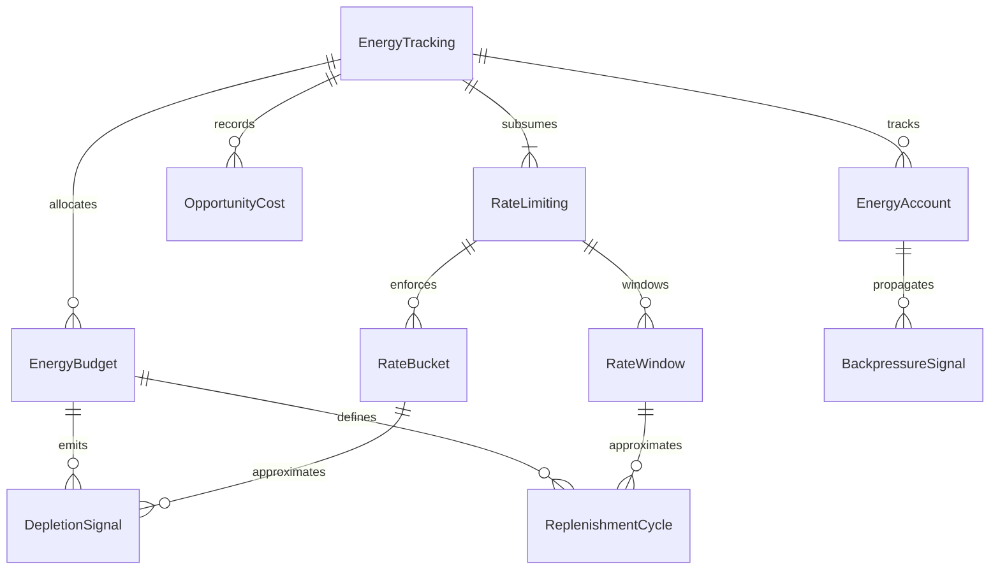
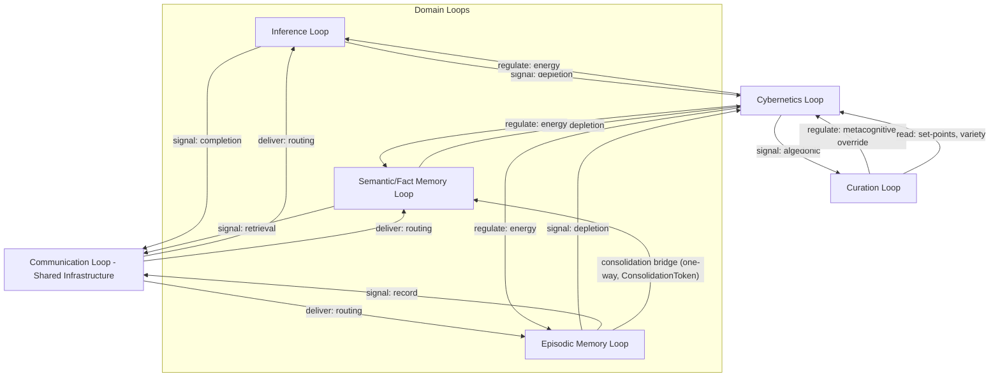

# Loop Architecture — Semantic Root-Cause Analysis & Six-Loop Decomposition

**Purpose:** Establish that rate limiting is a redundant projection of energy tracking, decompose hKask into six semantic loops (three domain, three meta), map crates to loops, define capability membranes, and document open questions.

**Related:** [`PRINCIPLES.md`](PRINCIPLES.md), [`trust-security-observability.md`](trust-security-observability.md), [`domain-and-capability.md`](domain-and-capability.md)

---

## 1. Semantic Root-Cause Analysis — Rate Limiting vs. Energy Tracking

### 1.1 The Subsumption Claim

Every rate limit is an energy constraint over a time window. This is not an analogy — it is a strict semantic subsumption:

| Rate Limiting Concept | Energy Tracking Equivalent | Relationship |
|-----------------------|---------------------------|--------------|
| Token bucket capacity | `EnergyBudget` allocation | Bucket capacity = energy cap for a span type |
| Refill rate | `ReplenishmentCycle` | Fixed refill = periodic energy restoration |
| Window (sliding/fixed) | `ReplenishmentCycle` period | Window = replenishment period |
| Throttle / backoff | `DepletionSignal` + `BackpressureSignal` | Throttle = depletion-triggered backpressure |
| 429 Rate Limited | `EnergyBudget.try_consume()` → `Err(InsufficientEnergy)` | Same signal, richer semantics |

Energy tracking subsumes rate limiting by modeling **depletion**, **replenishment**, and **allocation** without the artificial discretization of fixed windows. A rate bucket says "N operations per T seconds." An energy budget says "this operation costs E energy, the account holds B balance, replenishment restores R per cycle, and the opportunity cost of spending E here is recorded."[^beer-vsm]

### 1.2 Root Cause

Rate limiting was introduced as a **local approximation of energy accounting** before a unified energy model existed. It solved the immediate problem — preventing resource exhaustion — by discretizing continuous energy flow into countable tokens over fixed windows. This was correct as a stopgap but introduced two costs:

1. **Coupling without expressiveness:** Rate limits couple callers to window boundaries (sliding vs. fixed, per-key vs. global) without expressing *why* the limit exists or *what* it protects.
2. **Redundant projection:** With `EnergyBudget.try_consume()` now gating all operations under a unified energy cap, the rate limiter is a lossy projection of information that the energy model already holds in richer form.

The single root cause: **rate limiting was a local approximation of energy accounting that became redundant when the unified energy model arrived.**[^ashby-law]

### 1.3 Shared Concepts

| Concept | Rate Limiting Form | Energy Tracking Form |
|---------|-------------------|---------------------|
| Token budget | Bucket capacity | `EnergyBudget` allocation |
| Time window | Sliding / fixed window | `ReplenishmentCycle` period |
| Depletion signal | 429 response / throttle | `DepletionSignal` (typed, with severity) |
| Replenishment cycle | Token refill | `ReplenishmentCycle` (configurable per span) |
| Backpressure propagation | Retry-After header | `BackpressureSignal` (propagated across loops) |

### 1.4 Subsumption ERD



<!-- DIAGRAM_ALIGNMENT
id: DIAG-LOOP-001
verified_date: 2026-05-31
verified_against: crates/hkask-cns/src/energy.rs:55; trust-security-observability.md §4.6-4.7
status: VERIFIED
-->

### 1.5 Consequence

The `RateLimiter` and `CnsTokenBucket` types have been removed (per §4.6 of [`trust-security-observability.md`](trust-security-observability.md)). `McpErrorKind::RateLimited` remains **only** for external HTTP 429 responses where downstream services impose rate limits — it is not an internal concept. All internal resource gating flows through `EnergyBudget.try_consume()`.

### 1.6 External-Boundary Rate Limiting — Cybernetics Membrane at the Communication Boundary

`hkask-mcp-web` implements a per-tool fixed-window `RateLimiter` (30 requests/60s) that sits at the HTTP transport boundary. Per the 6-loop model, Communication (Loop 4) is dumb transport with no throttling authority. The `RateLimiter` is therefore **a Cybernetics membrane concern applied TO the Communication boundary**, not a Communication-internal concern.

**Important distinction:** The `RateLimiter` lives in `hkask-mcp-web` (an MCP server), not in `CommunicationLoop` itself. The `CommunicationLoop` struct only has `max_deliveries_per_tick` — a delivery batch limit that prevents unbounded event loop blocking. This is analogous to a queue prefetch size, not a throttling decision. Batch limits are transport mechanics; throttling decisions are regulatory.

**Authority classification:**

| Concern | Loop | Rationale |
|---------|------|------------|
| Internal energy budgets | Cybernetics (Loop 6) | Regulation of agent resource consumption via `GovernedTool` gas accounting |
| External-boundary rate limiting | Cybernetics membrane applied TO Communication boundary (Loop 4) | Security membrane protecting MCP servers from external client DoS — authority is L6, deployment point is L4 |
| Delivery batch limits (`max_deliveries_per_tick`) | Communication (Loop 4) | Transport mechanics (queue prefetch), not regulatory decisions |

**CNS override authority:** Cybernetics retains override authority over Communication. If `CnsRuntime` emits a `BackpressureSignal` or depletion alert for the web domain, the `RateLimiter` must defer — internal regulation always supersedes external defense. The current implementation observes this indirectly: rate-limit events emit `tracing::warn!(target: "cns.web", ...)`, making them visible to CNS without requiring a code dependency on `hkask-cns`.

**Boundary rule:** External-boundary rate limiting is a Cybernetics (L6) concern deployed at the Communication (L4) boundary. The `RateLimiter`'s deployment point is L4 (HTTP transport), but its authority and semantics are L6 (throttling, circuit-breaking, dampening). Communication itself does not own throttling — it exposes the boundary where Cybernetics membranes are applied. CNS retains the final word.

---

## 2. Six-Loop Architecture — Semantic Decomposition

### 2.1 Two-Layer Model

hKask decomposes into six loops organized in two layers plus shared infrastructure:

**Domain Loops** — value-producing, each owns a bounded resource and a transformation:

> **Terminology:** *Context* is **condensed** (ephemeral conversation window, handled by the condenser server). *Memory* is **consolidated** (persistent episodic → semantic triples, handled by the consolidation bridge). These are distinct operations on distinct substrates.

| Loop | Owns | Transforms |
|------|------|------------|
| **Inference Loop** | LLM call budget, token flow | Prompts → Completions |
| **Semantic/Fact Memory Loop** | Knowledge graph, embedding indices | Queries → Retrieved facts |
| **Episodic Memory Loop** | Conversation/event stream, SQLCipher storage | Experiences → Episodic records |

**Meta Loops** — governing, each regulates one or more domain loops:

| Loop | Owns | Regulates |
|------|------|------------|
| **Curation/Metacognition Loop** | Curator persona, prompt validation, reflective self-assessment | Which goals are pursued, whether behavior is coherent |
| **Cybernetics Loop** | Observability, governance, energy accounting, homeostatic regulation | Health, stability, resource equilibrium of the entire system |

**Shared Infrastructure** — dumb pipes, not regulators:

| Component | Owns | Provides |
|-----------|------|----------|
| **Communication Loop** | Message routing, MCP dispatch, A2A/H2A protocol boundaries | Message delivery (not regulation) |

### 2.2 Loop ERD

```mermaid
erDiagram
    InferenceLoop ||--o{ LlmCallBudget : "owns"
    InferenceLoop ||--o{ TokenFlow : "owns"
    InferenceLoop ||--|{ Prompt : "transforms"
    InferenceLoop ||--|{ Completion : "produces"

    SemanticMemoryLoop ||--o{ KnowledgeGraph : "owns"
    SemanticMemoryLoop ||--o{ EmbeddingIndex : "owns"
    SemanticMemoryLoop ||--|{ Query : "transforms"
    SemanticMemoryLoop ||--|{ RetrievedFact : "produces"

    EpisodicMemoryLoop ||--o{ ConversationStream : "owns"
    EpisodicMemoryLoop ||--o{ SQLCipherStorage : "owns"
    EpisodicMemoryLoop ||--|{ Experience : "transforms"
    EpisodicMemoryLoop ||--|{ EpisodicRecord : "produces"

    CommunicationLoop ||--o{ MessageRouter : "owns"
    CommunicationLoop ||--o{ MCPDispatch : "owns"
    CommunicationLoop ||--o{ A2AProtocol : "owns"
    CommunicationLoop ||--o{ H2AProtocol : "owns"

    CurationLoop ||--o{ CuratorPersona : "owns"
    CurationLoop ||--o{ PromptValidation : "owns"
    CurationLoop ||--o{ ReflectiveAssessment : "owns"
    CurationLoop ||--o{ CyberneticsLoop : "regulates"
    CurationLoop ||--o{ CommunicationLoop : "routes through (not authority)"

    CyberneticsLoop ||--o{ EnergyAccount : "owns"
    CyberneticsLoop ||--o{ VarietyCounter : "owns"
    CyberneticsLoop ||--o{ AlgedonicManager : "owns"
    CyberneticsLoop ||--o{ CnsSpan : "owns"
    CyberneticsLoop ||--o{ InferenceLoop : "regulates"
    CyberneticsLoop ||--o{ SemanticMemoryLoop : "regulates"
    CyberneticsLoop ||--o{ EpisodicMemoryLoop : "regulates"
    CyberneticsLoop ||--o{ CommunicationLoop : "regulates"
    CyberneticsLoop ||--o{ CurationLoop : "signals"

    CnsSpan ||--o{ CnsTool : "includes"
    CnsSpan ||--o{ CnsPrompt : "includes"
    CnsSpan ||--o{ CnsAgentPod : "includes"
    CnsSpan ||--o{ CnsConnector : "includes"
    CnsSpan ||--o{ CnsEnergy : "includes"
    CnsSpan ||--o{ CnsPipeline : "includes"
    CnsSpan ||--o{ CnsVariety : "includes"

    AlgedonicManager ||--o{ CurationLoop : "signals"
```



<!-- DIAGRAM_ALIGNMENT
id: DIAG-LOOP-002
verified_date: 2026-06-03
verified_against: crates/hkask-cns/src/runtime.rs; crates/hkask-agents/src/pod/mod.rs; crates/hkask-mcp/src/runtime.rs; crates/hkask-memory/src; crates/hkask-templates/src
status: CORRECTED
-->

### 2.3 CNS Span Subsumption into Cybernetics Loop

The existing `cns.*` span namespaces are not removed — they are **absorbed** into the Cybernetics Loop as its observability substrate:

| Old Namespace | Cybernetics Loop Role |
|---------------|----------------------|
| `cns.tool.*` | Tool invocation governance — energy cost of tool calls |
| `cns.prompt.*` | Prompt render/validation — energy cost of inference preparation |
| `cns.inference.*` | Inference governance — GovernedTool membrane, token budgets, model selection (deprecated: `GovernedInference`) |
| `cns.agent_pod.*` | Pod lifecycle — energy cost of agent activation |
| `cns.connector.*` | External I/O — energy cost of connector operations |
| `cns.energy.*` | Direct energy budget tracking — the loop's core metric |
| `cns.pipeline.*` | Memory pipeline — energy cost of memory operations |
| `cns.variety.*` | Variety counters — homeostatic variety sensing |
| `cns.curation.*` | Curation operations — signal to Curation Loop |
| `cns.killzone.*` | Sovereignty enforcement — signal to Curation Loop |
| `cns.sovereignty.*` | Sovereignty tracking — signal to Curation Loop |
| `cns.goal.*` | Goal lifecycle — signal to Curation Loop |
| `cns.spec.*` | Specification operations — signal to Curation Loop |

The Cybernetics Loop **owns** all `cns.*` spans. Other loops emit `NuEvent`s into these spans, but the Cybernetics Loop is the sole consumer and regulator of the observability they produce.

### 2.4 Algedonic Alert Pathway

The algedonic alert is the **single escalation pathway** from the Cybernetics Loop to the Curation Loop:

```
Cybernetics Loop (variety deficit > threshold)
  → AlgedonicManager creates RuntimeAlert
  → NuEventStore persists algedonic event (phase=Act)
  → Curation Loop reads algedonic events via cursor
  → Curator Agent reviews via metacognition cycle
  → Curator assesses and intervenes (or escalates to human)
```

This pathway is **unidirectional**: Cybernetics signals Curation, but Curation does not signal Cybernetics — it *regulates* Cybernetics through metacognitive override (see §4).

---

## 3. Crate-to-Loop Mapping

### 3.1 Mapping Table

| Existing Component | Owning Loop | Minimal Interface Exposed |
|--------------------|-------------|--------------------------|
| `hkask-mcp` (dispatch) | Communication | `dispatch(tool, args) → Result<Output>` |
| `hkask-agents` (curator) | Curation (regulatory) | `CurationLoop`, `CurationConfidenceGate`, `CuratorContext` |
| `hkask-agents` (curator_agent) | Curation (persona) | `CuratorAgent`, `MetacognitionLoop`, `HealthSnapshot`, `DefaultSpecCurator` |
| `hkask-cns` (governed_tool) | Cybernetics → all tools | `GovernedTool`, `EnergyEstimator`, `InferenceEnergyEstimator` |
| `hkask-memory` (semantic) | Semantic/Fact Memory | `query(embedding, k) → Vec<Fact>`, `store(fact) → FactID` |
| `hkask-memory` (episodic) | Episodic Memory | `record(experience) → RecordID`, `retrieve(query, window) → Vec<Record>` |
| `hkask-keystore` | Cybernetics (energy for cryptographic operations) | `derive_key(purpose) → KeyRef`, `sign(data) → Signature` |
| `hkask-storage` | Shared substrate (accessed via capability) | `read(cap, path) → Data`, `write(cap, path, data) → ()` |
| `hkask-cns` | Cybernetics (refactored) | `observe(event)`, `regulate(span, action)`, `health() → CnsHealth` |
| `hkask-templates` | Curation (cascade validation) | `render(template, ctx) → String`, `validate(template) → ValidationResult` |
| `hkask-ensemble` | Communication (multi-agent routing) | `route(message, recipients) → Vec<Delivery>` |
| `hkask-cli` / `hkask-api` | Communication (external interface) | `execute(command) → Result<Output>` |
| `hkask-types` | Shared substrate (no loop ownership) | Type definitions only — no behavior |
| Okapi inference server | Inference (via MCP) | `complete(prompt, budget) → Completion` |

### 3.2 Interface Discipline

Each loop exposes a **minimal interface** — a set of operations that other loops may invoke without coupling to internals:

1. **No struct leakage:** Interfaces accept and return primitive types or type aliases from `hkask-types`, not internal domain structs.
2. **Capability-gated:** Every cross-loop call requires a `CapabilityToken` authorizing the specific operation.
3. **Energy-accounted:** Every cross-loop call is metered through `EnergyBudget.try_consume()` before execution.
4. **Observable:** Every cross-loop call emits a `NuEvent` into the appropriate `cns.*` span.

### 3.3 Shared Substrate

`hkask-storage` and `hkask-types` are **not owned by any loop** — they are shared substrate accessed via capability. No loop may access storage directly; all access is mediated by OCAP tokens that attenuate on each delegation. This prevents any loop from accumulating implicit authority over another loop's data.

### 3.4 MCP Server-to-Loop Mapping

MCP servers are operational units that reside within the loop architecture. Each server is assigned to its semantically correct loop based on the authority it enforces:

| MCP Server | Loop | Rationale |
|-----------|------|----------|
| `hkask-mcp-inference` | L1 (Inference) | Okapi LLM inference — the Inference loop's core transform |
| `hkask-mcp-condenser` | L2 (Episodic) | Context condensation operates on the active conversation window (episodic boundary) |
| `hkask-mcp-episodic` | L2 (Episodic) | Episodic memory storage and retrieval |
| `hkask-mcp-semantic` | L2b (Semantic) | Semantic (shared) memory storage and retrieval |
| `hkask-mcp-web` | L4 (Communication) | External I/O dispatch — Communication routes web requests |
| `hkask-mcp-git` | L4 (Communication) | Git CAS operations — Communication routes archival I/O |
| `hkask-mcp-github` | L4 (Communication) | GitHub API — Communication routes external integrations |
| `hkask-mcp-fmp` | L4 (Communication) | FMP financial data — Communication routes external integrations |
| `hkask-mcp-telnyx` | L4 (Communication) | Telnyx SMS/voice — Communication routes external integrations |
| `hkask-mcp-fal` | L4 (Communication) | FAL media generation — Communication routes external integrations |
| `hkask-mcp-ensemble` | L4 (Communication) | Multi-agent chat coordination — Communication routes agent messages |
| `hkask-mcp-rss-reader` | L2 (Episodic) | RSS feeds are consumed into episodic memory |
| `hkask-mcp-registry` | L1↔L5 (bridge) | Cross-loop bridge: template discovery (Inference, L1) + skill/bundle composition (Curation, L5) |
| `hkask-mcp-spec` | L5 (Curation) | DDMVSS spec capture — Curation governs specification authoring |
| `hkask-mcp-goal` | L5 (Curation) | Goal coordination — Curation governs goal prioritization |
| `hkask-mcp-replicant` | L5 (Curation) | Replicant chat — Curation manages agent persona |
| `hkask-mcp-ocap` | L6 (Cybernetics) | OCAP enforcement is authority governance — Cybernetics regulates capability membranes |
| `hkask-mcp-keystore` | L6 (Cybernetics) | Key management and encryption are sovereignty/authority concerns — Cybernetics regulates |
| `hkask-mcp-cns` | L6 (Cybernetics) | CNS operations — Cybernetics IS the self-regulation loop |

---

## 4. Capability Membranes

### 4.1 OCAP Discipline for Loops

The capability membrane for each loop defines four boundaries:

| Boundary | Meaning |
|----------|---------|
| **Can read** | State it may observe without modification |
| **Can write** | State it may modify |
| **Can signal** | Asynchronous notifications it may emit to other loops |
| **Never reaches** | State and operations that are categorically forbidden |

### 4.2 Membrane Definitions

#### Inference Loop

| Boundary | Scope |
|----------|-------|
| **Can read** | Prompt queue, token budget remaining, model configuration |
| **Can write** | Completion output buffer, token consumption counter |
| **Can signal** | Depletion signal to Cybernetics Loop (energy), completion signal to Communication Loop |
| **Never reaches** | Memory indices, conversation stream, capability tokens of other loops |

#### Semantic/Fact Memory Loop

| Boundary | Scope |
|----------|-------|
| **Can read** | Embedding indices, knowledge graph, query queue |
| **Can write** | Fact store, embedding vectors, retrieval cache |
| **Can signal** | Depletion signal to Cybernetics Loop (energy), retrieval signal to Communication Loop |
| **Never reaches** | LLM call budget, conversation stream, capability tokens of other loops |

#### Episodic Memory Loop

| Boundary | Scope |
|----------|-------|
| **Can read** | Conversation/event stream, SQLCipher storage, episodic query queue |
| **Can write** | Episodic records, conversation log, decay markers |
| **Can signal** | Depletion signal to Cybernetics Loop (energy), record signal to Communication Loop |
| **Never reaches** | Knowledge graph, LLM call budget, capability tokens of other loops |

#### Communication Loop (Shared Infrastructure)

| Boundary | Scope |
|----------|-------|
| **Can read** | Message queue state only |
| **Can write** | Message routing only |
| **Can signal** | Delivery confirmation to sender loop, queue_depth counter to Cybernetics Loop (Arc<AtomicU64>, lock-free Relaxed ordering) |
| **Never reaches** | Energy accounts, variety counters, prompt validation, knowledge graph internals, capability tokens |

#### Curation Loop (regulatory) + Curator Agent (persona)

| Boundary | Scope |
|----------|-------|
| **Can read** | Curator persona state, NuEvent store (algedonic review), escalation queue, Cybernetics set-points, variety counters, energy budget status, SpecDriftAlert from DefaultSpecCurator (via Communication Loop inbox) |
| **Can write** | CuratorDirective (CalibrateThreshold, OverrideGasBudget, UpdateCapabilities, SeekMoreEvidence, ReplenishBudget), goal priority, metacognitive override decisions |
| **Can signal** | Metacognitive override to Cybernetics Loop, goal revision to Communication Loop |
| **Never reaches** | Token flow, embedding indices, SQLCipher encryption keys, message routing internals |

#### Cybernetics Loop

| Boundary | Scope |
|----------|-------|
| **Can read** | All `cns.*` spans, energy accounts, variety counters, algedonic alert state, communication_queue_depth from Communication Loop |
| **Can write** | Energy budgets, variety counters, algedonic alert escalation state |
| **Can signal** | Algedonic alert to Curation Loop, backpressure to domain loops, Throttle(Communication) when backpressure threshold exceeded |
| **Never reaches** | Prompt content, message routing logic, goal priority, Curator persona internals |

### 4.3 Cross-Loop Authority Rules

1. **Domain loops may signal their governing meta loop but never each other directly.** The Inference Loop does not call the Semantic Memory Loop — it signals the Communication Loop, which routes the request.
2. **Communication is shared infrastructure, not a regulator.** It routes messages between loops but has no authority over any loop's behavior. It cannot override energy budgets, throttle agents, or issue directives.
3. **The Cybernetics Loop regulates all three domain loops and may signal the Curation Loop. It may not regulate the Curation Loop.** Cybernetics can throttle inference energy but cannot override a Curator decision. Curation regulates Cybernetics through `CuratorDirective` messages (CalibrateThreshold, OverrideEnergyBudget, ReplenishBudget, SeekMoreEvidence) — this is the explicit governance path, not a bypass.
4. **The Curation Loop regulates Cybernetics via metacognitive override.** This is the single escalation path. If the Cybernetics Loop's homeostatic regulation conflicts with a Curator-assessed goal, the Curator wins. Curation does not regulate Communication — it can signal through it, but Communication is a pipe, not a governor.

### 4.4 Capability Membrane Graph



<!-- DIAGRAM_ALIGNMENT
id: DIAG-LOOP-003
verified_date: 2026-06-03
verified_against: PRINCIPLES.md §1.4; trust-security-observability.md §4.4; domain-and-capability.md §5; loop-architecture.md §4.4
status: REMEDIATED
-->

### 4.5 Cycle-Freedom Verification

The capability membrane has exactly one cycle-adjacent path:

```
Cybernetics → (signal) → Curation → (regulate) → Cybernetics
```

This is **not a cycle** — it is a directed escalation chain:

1. Cybernetics signals Curation (algedonic alert — informational, no authority).
2. Curation regulates Cybernetics (metacognitive override — authoritative, single checkpoint).

No loop can indirectly regulate itself without passing through the Curation Loop's metacognitive checkpoint. The Curation Loop is the **single authority** that can override any meta loop's decision, and it cannot be overridden by any other loop — it is the terminus of the escalation chain.

Formally: the regulation graph is a DAG with Curation as the unique maximal element. The signal graph is a subgraph of the regulation graph (signals are informational subsets of regulation authority). Therefore no regulation cycle exists.

**Data flow edges** (e.g., consolidation bridge: Episodic → Semantic) are not regulation edges. The consolidation bridge is one-way, gated by `ConsolidationToken`, and carries no authority — it moves private triples into shared knowledge under Curator authorization. It does not create cycles in the regulation or signal graphs.

---

## 5. Open Questions

### 5.1 Set-Point Derivation

**Tension:** The Cybernetics Loop needs target values (set-points) for energy budgets, variety counters, and algedonic thresholds. Currently these are hardcoded constants (e.g., warning at deficit > threshold/2 (=50 default), critical at deficit > threshold (=100 default)).[^beer-vsm]

**Options:**
- **A. Static configuration:** Set-points in YAML, loaded at bootstrap. Simple but inflexible.
- **B. Adaptive derivation:** Set-points derived from rolling statistics of actual system behavior (e.g., 95th percentile energy consumption over last N cycles). Flexible but introduces a secondary feedback loop.
- **C. Curator-specified:** The Curation Loop sets targets based on goal priority. Aligns with metacognitive override but couples set-points to goal state.

**Status:** Resolved. Option A — YAML-configurable set-points loaded at bootstrap, aligned with the "hKask is the loom, YAML is the thread" principle. Option B (adaptive derivation) may be explored in a future version if static set-points prove insufficient.

### 5.2 Loop Tick Cadence

**Tension:** Each loop has a natural update frequency. The Inference Loop ticks per LLM call (seconds). The Episodic Memory Loop ticks per conversation turn (minutes). The Cybernetics Loop ticks per variety counter update (variable). If loops share a single tick, fast loops waste cycles waiting; if they tick independently, synchronization and ordering become complex.

**Options:**
- **A. Event-driven:** Loops tick on demand when their input queue is non-empty. No wasted cycles, but no guaranteed liveness.
- **B. Fixed cadence per loop:** Each loop has its own tick interval. Predictable but may waste cycles during idle periods.
- **C. Hybrid:** Event-driven with a liveness heartbeat. Loops tick on demand but also tick at a minimum cadence to detect staleness.

**Status:** Resolved. Option C — event-driven with per-loop liveness heartbeat. Each loop ticks on demand when its input queue is non-empty, with a minimum liveness heartbeat whose interval varies by loop type. Inference: per-call. Communication: per-message. Cybernetics: 30s heartbeat. Curation: per-algedonic-alert. Domain memory: per-query.

### 5.3 Energy Unit Semantics

**Tension:** `EnergyBudget` currently uses an opaque `u64` energy unit. The semantics of this unit are undefined — is it tokens? Compute-seconds? A dimensionless cost scalar? The choice affects how energy budgets compose across loops.

**Options:**
- **A. Token-denominated:** 1 energy unit = 1 LLM token. Directly meaningful for the Inference Loop but awkward for memory and communication operations.
- **B. Compute-seconds:** 1 energy unit = 1 second of compute. Uniform across operations but requires profiling to calibrate.
- **C. Dimensionless cost scalar:** Each `EnergySpanType` defines its own cost function. Most flexible but requires per-operation calibration and makes cross-loop comparison harder.

**Status:** Resolved. The unit is **gas** — a dimensionless cost unit serving the same function as Ethereum gas: preventing infinite loops by making resource exhaustion explicit. Each MCP server/tool has a configured gas cost in a `GasEstimator` table. Inference tools use token-based estimation; other tools use flat costs from the table. Energy budgets replenish periodically (analogous to gas refunds). The thermodynamic anchoring vision is deferred to a future version; the MVP uses a practical gas table that maps each operation to a cost.

### 5.4 Persistence of Loop State

**Tension:** Loops maintain state (energy balances, variety counters, message queues). Should this state survive restarts? Persisting loop state enables recovery but creates migration and versioning complexity.

**Options:**
- **A. Ephemeral:** Loop state is in-memory only. On restart, loops reinitialize from persistent domain data (storage, memory indices). Simple but loses runtime telemetry history.
- **B. Checkpointed:** Loop state is periodically checkpointed to SQLite. Enables recovery but requires schema migration on every loop state change.
- **C. Event-sourced:** Loop state is reconstructed by replaying `NuEvent` history. Principled but potentially expensive for long-running systems.

**Status:** Open. Option A is the simplest and aligns with the current implementation. Option C is the most cybernetically principled (the `NuEvent` stream already exists) but needs a truncation strategy. CurationLoop `restore_cursor()` now persists the algedonic review cursor to `NuEventStore` for crash recovery. Other loop state remains volatile (Option A).

### 5.5 Multi-Agent Energy Competition

**Tension:** When multiple agent pods are active, they share a global energy budget. How is energy allocated across competing pods? A greedy pod could exhaust the budget, starving others.

**Options:**
- **A. Equal partition:** Each active pod gets an equal share of the global budget. Fair but ignores priority differences.
- **B. Priority-weighted:** Pods receive energy proportional to their goal priority (set by Curation Loop). Aligns with metacognitive override but requires the Curation Loop to maintain priority rankings.
- **C. Auction-based:** Pods bid for energy using opportunity cost as currency. Economically principled but complex.

**Status:** Open. Option B is the natural extension of the Curation Loop's metacognitive override authority. The Curation Loop already owns goal priority — extending this to energy allocation is consistent.

### 5.6 Recursive Depth of Metacognitive Override

**Tension:** The Curation Loop can override any meta loop's decision via metacognitive override. But what if the Curation Loop's own override decision is wrong? The current architecture has no mechanism for the system to override the Curator — the human is the final escalation point. But in autonomous operation (no human available), the system needs a self-correction path.

**Options:**
- **A. Single depth:** The Curator's override is final. No self-correction without human intervention. Simple but brittle in autonomous mode.
- **B. Bounded recursion:** The Curator may override up to N levels of recursion (e.g., the Curator overrides Cybernetics, which triggers a re-evaluation, which the Curator may override again, up to N times). Prevents infinite loops but requires a depth counter.
- **C. Cooldown-based:** After a metacognitive override, the same override cannot be re-applied for a cooldown period. Prevents rapid oscillation without a hard depth limit.

**Status:** Resolved. Option C — cooldown-based. Implemented in `Dampener` with a 120-second `override_cooldown`. After any metacognitive override passes dedup, ALL subsequent overrides within the cooldown window are suppressed regardless of fingerprint. This prevents oscillation without introducing a hard depth counter.

### 5.7 Energy Budget Replenishment

Resolved: Energy budgets replenish on a configurable cadence managed by the Cybernetics Loop. Each `EnergyBudget` has a `replenish_rate` (gas units per interval) and a `replenish_interval`. The Cybernetics Loop calls `replenish()` during its regulation cycle. When Curation needs to expedite replenishment, it issues a `ReplenishBudget` directive. This replaces the one-shot budget model with a renewable gas model.

### 5.8 Gas Cost Semantics

Gas units are dimensionless — they represent computational cost on a shared
scale, analogous to Ethereum gas. Every MCP tool invocation costs gas, and
when an agent's budget is exhausted, the operation is rejected by Cybernetics.

**Cost tiers:**

| Tier | Servers | Cost | Rationale |
|------|---------|------|----------|
| Internal | ocap, keystore, cns, registry | 1-5 | In-process, negligible compute |
| Local I/O | spec, git, goal | 5 | Local filesystem I/O |
| Moderate | condenser | 10 | Some computation + local I/O |
| External API | web, github, fmp, telnyx, rss-reader | 20-50 | Network I/O, rate-limited |
| Heavy external | fal | 100 | GPU compute, expensive |
| Inference | hkask-mcp-inference | token-based | LLM compute, scales with tokens |

Inference uses a separate cost model: `prompt_chars / 4 + max_tokens`. This
reflects that LLM compute scales with token count. The `CompositeGasEstimator`
routes inference calls to `InferenceGasEstimator` and all other calls to
`TableGasEstimator`.

**Default budget:** 10,000 gas per agent per replenishment cycle.
**Replenishment rate:** cap / 10 per cycle (1,000 gas for default cap).
**Alert threshold:** 80% usage (2,000 gas remaining for default cap).

---

## References

[^beer-vsm]: Beer, S. (1972). *Brain of the Firm*. Wiley. Viable System Model — algedonic alerts, variety engineering, homeostatic regulation.
[^ashby-law]: Ashby, W. R. (1956). *An Introduction to Cybernetics*. Wiley. "Only variety can absorb variety."
[^miller-ocap]: Miller, M. S. (2006). *Robust Composition: Towards a Unified Approach to Access Control and Concurrency Control*. Johns Hopkins University. OCAP discipline for capability membranes.
[^wiener-cybernetics]: Wiener, N. (1948). *Cybernetics: Or Control and Communication in the Animal and the Machine*. MIT Press. Feedback loops as the fundamental unit of regulation.

---

*ℏKask - A Minimal Viable Container for Agents — v0.22.0*
