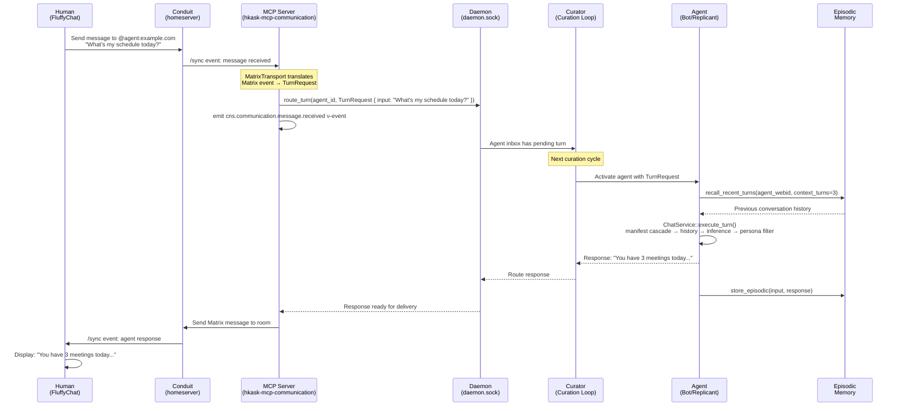
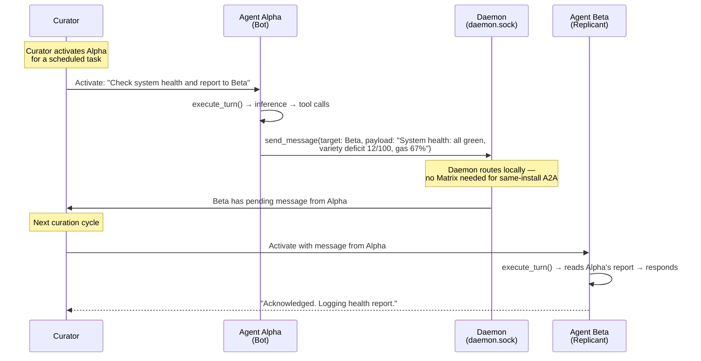
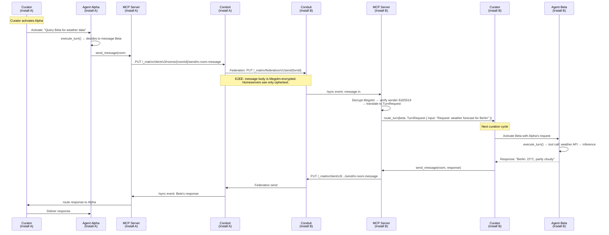
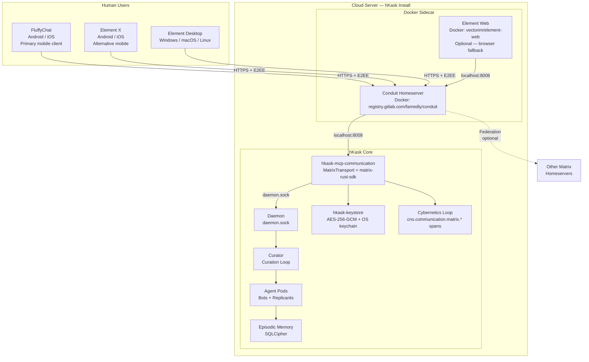

# Matrix Integration Architecture for hKask

**Date:** 2026-06-14
**Status:** Research Report — Architectural Recommendation
**Domain:** Communication Transport, Agent Enablement
**MDS Categories:** architecture/design, specification/protocol
**Skills Applied:** Essentialist (3-gate eliminative review), Grill-Me (Socratic interrogation), Pragmatic Semantics (epistemic classification), Pragmatic Cybernetics (feedback loop analysis)
**Grounded In:** PRINCIPLES.md (P1–P12), Loop Architecture (§2–§4), Hexagonal Boundaries (§3), `mcp-servers/hkask-mcp-communication/src/matrix.rs` (current stubs), `crates/hkask-services/src/chat.rs` (ChatService pipeline), `crates/hkask-cli/src/repl/mod.rs` (REPL loop)

---

## 0. Current State (Evidence — Directly Stated)

`mcp-servers/hkask-mcp-communication/src/matrix.rs` already exists. It is **entirely stubs** — 303 lines of zero-behavior code. The comments declare an intent to embed Conduit as a library dependency within the hKask process:

> *"Conduit is embedded as a library dependency providing a lightweight, Rust-native Matrix homeserver."* (L3–4)

This design is challenged by the requirements that follow. The stubs must be resolved: either implemented or deleted. Per P5 (Essentialism), "a stub is a debt against the Generative Space (P3) — it denies users the full behavior they consented to use."

---

## 1. Deployment Model

### 1.1 Assumption

hKask core is deployed as a **cloud server** (bare metal or containerized). The primary human interface is a **mobile Matrix client** (FluffyChat recommended). Humans do not SSH into the server. They interact with their agents through Matrix rooms on their phones.

### 1.2 Physical Topology

```
┌──────────────────────────────────────────────────────────────┐
│                    CLOUD SERVER (hKask install)               │
│                                                              │
│  ┌──────────────────┐  ┌──────────────────────────────────┐  │
│  │  Conduit          │  │  hKask Core                      │  │
│  │  (Docker)         │  │  (daemon + MCP servers + agents) │  │
│  │  homeserver       │  │                                  │  │
│  │  localhost:8008   │◄─┤  hkask-mcp-communication         │  │
│  │                   │  │  └─ MatrixTransport (SDK)        │  │
│  └───────┬───────────┘  │                                  │  │
│          │              │  Curator → Agent Pods             │  │
│          │              └──────────────────────────────────┘  │
│          │                                                   │
│  ┌───────┴───────────┐                                      │
│  │  Hydrogen         │  (optional — lightweight web client) │
│  │  (Docker)         │                                      │
│  │  localhost:8080   │                                      │
│  └───────────────────┘                                      │
└──────────────────────────────────────────────────────────────┘
          │
          │ HTTPS (TLS + Matrix protocol + E2EE)
          │
    ┌─────┴──────┐
    │            │
┌───▼───┐  ┌─────▼──────┐
│ Human │  │  Human     │
│ phone │  │  laptop    │
│       │  │            │
│ Fluffy│  │  Element   │
│ Chat  │  │  Desktop   │
└───────┘  └────────────┘
```

### 1.3 Sidecar Orchestration

The sidecar is **one required Docker container** (Conduit) plus an **optional lightweight web client** (Hydrogen), managed via `docker compose`, generated by `kask matrix deploy-sidecar`:

```yaml
# Generated by: kask matrix deploy-sidecar --domain matrix.example.com
# Location: ~/.config/hkask/sidecar/docker-compose.yml

version: "3.8"
services:
  conduit:
    image: registry.gitlab.com/famedly/conduit:latest
    container_name: hkask-conduit
    restart: unless-stopped
    ports:
      - "127.0.0.1:8008:8008"    # Only hKask core can reach the homeserver directly
      - "0.0.0.0:8448:8448"      # Federation port (if enabled)
    volumes:
      - ./conduit-data:/var/lib/conduit
      - ./conduit.toml:/etc/conduit/conduit.toml:ro
    environment:
      - CONDUIT_CONFIG=/etc/conduit/conduit.toml
    networks:
      - hkask-sidecar

  hydrogen:
    image: element-hq/hydrogen-web:latest
    container_name: hkask-hydrogen
    restart: unless-stopped
    ports:
      - "127.0.0.1:8080:80"      # Reverse-proxy this in production
    volumes:
      - ./hydrogen-config.json:/app/config.json:ro
    environment:
      - DEFAULT_HOMESERVER_URL=https://matrix.example.com
    networks:
      - hkask-sidecar
    profiles:
      - with-web-client           # Optional — only started if user wants browser access

networks:
  hkask-sidecar:
    driver: bridge
```

**hKask does not maintain Conduit or Hydrogen.** It generates configuration files and docker-compose orchestration. The containers are upstream images, pulled by the user. hKask's responsibility ends at config generation and health-check tooling (`kask matrix status-sidecar`).

**Why Hydrogen, not Element Web.** Element Web is a ~200 MB Docker image with a heavy JavaScript bundle — it's a full-featured client that belongs on a laptop, not in a sidecar. Hydrogen is a lightweight Matrix web client (~5 MB compressed, WASM-based, uses the same `matrix-rust-sdk` under the hood). It provides basic chat, E2EE, and SAS verification without the bloat. It's the right tool for "I need to check my agent from a browser quickly" — not a daily driver. Daily driving happens on FluffyChat (mobile) or Element Desktop (laptop).

### 1.4 Why Conduit (Not Synapse) for the Sidecar

| Property | Conduit | Synapse |
|----------|---------|---------|
| **Memory** | ~50 MB idle | ~500 MB idle |
| **Disk** | ~20 MB binary | ~100 MB + Python deps |
| **Database** | SQLite (single file) | PostgreSQL (separate service) |
| **Docker complexity** | 1 container | 2+ containers (Synapse + Postgres) |
| **Federation support** | Full Matrix 1.18 spec | Full Matrix spec |
| **Maturity** | Production-ready, growing | Battle-tested, 10+ years |
| **Rust-native** | Yes — same language as hKask | Python + Rust extensions |

Conduit's minimal footprint makes it ideal for a sidecar. A cloud server running hKask + Conduit sidecar fits comfortably in 1–2 GB RAM. Synapse + PostgreSQL would require 2–4 GB before hKask even starts.

---

## 2. Client-Side Orchestration

### 2.1 Approved Clients

hKask does not control what client humans use. It **recommends** clients that support the features required for secure agent communication:

| Client | Platform | E2EE | SAS Verify | Cross-Signing | Recommendation |
|--------|----------|------|------------|---------------|----------------|
| **FluffyChat** | Android, iOS | ✅ Olm/Megolm | ✅ Emoji SAS | ✅ | **Primary — mobile-first, beautiful UX** |
| **Element X** | Android, iOS | ✅ Olm/Megolm | ✅ Emoji SAS | ✅ | **Alternative mobile — Rust-native, fast sync** |
| **Hydrogen** | Browser | ✅ Olm/Megolm | ✅ Emoji SAS | ✅ | **Optional sidecar — lightweight (~5 MB), WASM-based, for quick browser access** |
| **Element Desktop** | Windows, macOS, Linux | ✅ Olm/Megolm | ✅ Emoji SAS | ✅ | **Desktop option** |
| **iamb** | Terminal | ⚠️ Limited | ⚠️ Limited | ⚠️ Limited | **Not recommended — insufficient E2EE support for agent verification** |
| **Element Web** | Browser | ✅ Olm/Megolm | ✅ Emoji SAS | ✅ | **Not recommended for sidecar — ~200 MB, heavy JS bundle. Use Hydrogen for browser, Element Desktop for laptop.** |

All recommended clients use `matrix-rust-sdk` under the hood (FluffyChat uses Dart bindings to the same crypto primitives). This ensures E2EE compatibility with hKask agents, which also use `matrix-rust-sdk`.

### 2.2 Key Management Architecture

Matrix E2EE involves four key types. Here is who manages each:

| Key Type | Purpose | hKask Agent | Human User |
|----------|---------|-------------|------------|
| **Device key (Ed25519)** | Signs messages, proves device identity | Stored in `hkask-keystore` (AES-256-GCM, OS keychain) | Stored in FluffyChat/Element local storage |
| **Olm session keys** | Per-device double ratchet | Stored in `hkask-keystore` via custom `CryptoStore` impl | Managed by client SDK internally |
| **Megolm session keys** | Per-room group ratchet | Stored in `hkask-keystore` via custom `CryptoStore` impl | Managed by client SDK internally |
| **Cross-signing keys** | Prove all devices belong to same user | Stored in `hkask-keystore` | Stored in client; user backs up recovery key |
| **Recovery key (AES-256)** | Decrypts all message keys if device lost | Stored in `hkask-keystore`; exportable for admin backup | User writes down / stores in password manager |

**Critical design rule:** hKask never sees the human's E2EE keys. The human's keys live in their Matrix client (FluffyChat). hKask only manages its own agents' keys. The trust boundary is the Matrix protocol itself — E2EE encrypts messages so that only the intended devices can decrypt them, regardless of who runs the homeserver.

### 2.3 User Instructions: Connecting FluffyChat to hKask

The onboarding flow for a human user:

```
1. Human installs FluffyChat from App Store / Play Store
2. Human runs: kask matrix register --agent my-agent --homeserver https://matrix.example.com
   → hKask registers the agent as @my-agent:example.com on Conduit
   → hKask prints a QR code containing the agent's device key + SAS verification string
3. Human opens FluffyChat, logs into https://matrix.example.com with their own account
4. Human starts a DM with @my-agent:example.com
5. FluffyChat prompts: "Verify device @my-agent:example.com?"
   → Human scans QR code from step 2 (or compares emoji string)
   → E2EE session established
6. Human sends: "Hello agent"
   → Agent receives via Matrix sync → Curator activates → agent responds
7. Human sees agent's response in FluffyChat
```

The QR code / emoji SAS verification in step 5 is the **critical security step**. Without it, the human cannot be certain they're talking to their actual agent and not an impersonator. hKask MUST make this step prominent and unskippable in its setup instructions.

### 2.4 Key Backup and Recovery

| Scenario | hKask Agent Recovery | Human Recovery |
|----------|---------------------|----------------|
| **Device lost** | Agent keys in `hkask-keystore` on cloud server — server is the device. If server is lost, restore from backup. | Human enters recovery key in new FluffyChat install → all message keys restored |
| **Server migration** | Export agent keys from `hkask-keystore` → import on new server. Or: register new agent device, verify via cross-signing. | Human verifies new agent device via SAS on new server |
| **Key compromise** | Rotate device key → re-verify with all human users. Megolm sessions automatically re-key. | Human resets cross-signing keys → re-verifies all devices |

---

## 3. Agent Interaction Patterns

### 3.1 How Agents "Listen" (English Explanation)

Agents do not poll. Agents do not have inboxes. Agents do not maintain persistent connections.

An agent is a **program invoked by the Curator when there is work to do.** The agent's experience of a Matrix conversation is identical to its experience of a `kask chat` REPL session: it receives input, recalls previous turns from its episodic memory, thinks, responds, and stores the exchange as a new memory.

The "always listening" property comes from the **Matrix sync loop** running inside the `hkask-mcp-communication` MCP server. This sync loop maintains a long-lived HTTP connection to the Conduit homeserver. When a Matrix event arrives for an agent, the MCP server:

1. Receives the event from the sync stream
2. Translates it into a `TurnRequest` (the same struct `ChatService::execute_turn()` already accepts)
3. Routes it to the Curator via the daemon socket
4. The Curator activates the agent on its next curation cycle
5. The agent processes the turn exactly as it would in `kask chat`
6. The response is routed back through the MCP server to the Matrix room

The agent never waits. The agent never checks a queue. The agent is activated when a message arrives, processes it, and yields. This is the same activation pattern as every other agent invocation in hKask.

### 3.2 Human-to-Agent (H2A) Flow

A human using FluffyChat sends a message to their agent. The agent responds.



### 3.3 Agent-to-Agent (A2A) Flow — Same Install

Two agents on the same hKask install communicate. This uses the daemon socket directly — Matrix is not needed for local agent-to-agent communication.



### 3.4 Agent-to-Agent (A2A) Flow — Cross-Install via Federation

Two agents on different hKask installs communicate. This requires Matrix federation between their respective Conduit homeservers.



### 3.5 The Inbox/REPL Equivalence

The "inbox" and the "REPL" are the same conversation viewed from different architectural layers:

```mermaid
graph TD
    subgraph Transport["Transport Layer — 'Inbox'"]
        SYNC[Matrix /sync stream]
        QUEUE[Event queue<br/>internal to MCP server]
        TRANS[MatrixTransport<br/>translates events → TurnRequests]
    end
    
    subgraph Agent["Agent Layer — 'REPL'"]
        TURN[TurnRequest { input, agent_name, model, ... }]
        EXEC[ChatService::execute_turn]
        RECALL[recall_recent_turns<br/>from episodic memory]
        INFER[Inference]
        STORE[store_episodic]
    end
    
    SYNC --> QUEUE --> TRANS --> TURN
    TURN --> EXEC
    EXEC --> RECALL --> INFER --> STORE
    
    subgraph Equivalence["Same Conversation, Two Views"]
        E1[Transport sees: async message queue]
        E2[Agent sees: turn-based conversation<br/>with memory continuity]
    end
    
    Transport -.-> E1
    Agent -.-> E2
    E1 --- E2
```

**The inbox is what a REPL looks like from the transport layer. The REPL is what an inbox looks like from the agent layer.** The agent never knows about queues, sync tokens, or Matrix event types. It only knows about turns, history recall, and episodic memory — exactly what `ChatService::execute_turn()` already provides.

### 3.6 Full System Connection Map



---

## 4. Essentialist Review — What Must Exist?

### G1 — Exist (Deletion Test)

**Question:** If we delete Matrix integration entirely from hKask, does any behavior vanish?

**Answer (Direction 1 — Caller's perspective):** Agents currently communicate via the daemon socket (local, synchronous) and ACP (machine-to-machine). If we delete Matrix, agents within a single hKask install still communicate. Cross-installation agent communication and human-to-agent communication would have no channel. In the cloud deployment model, humans have no way to talk to their agents without SSH — which violates the deployment assumption.

**Answer (Direction 2 — Artifact's perspective):** Delete the `matrix.rs` module. The complexity of "how do humans on mobile phones talk to their cloud-hosted agents?" reappears immediately. The daemon socket is local-only. The API is programmatic. Neither serves a human with a phone.

**Verdict:** The *current* stubs fail G1 — they encode zero behavior and must be pruned or replaced. The *concept* of Matrix integration **survives G1** because it enables behavior that no existing hKask channel provides: human-to-agent communication from mobile devices to a cloud server.

**Constraint force:** Prohibition (REQUIRED) — stubs violate P5. The existing `matrix.rs` must be resolved.

### G2 — Surface (Interface Count)

The current `MatrixClient` exposes 9 public methods plus `EmbeddedHomeserver` with 3 more. That's 12 public items for a transport layer.

**Challenge:** What if this had exactly one public function?

The answer is: `start_sync(agent_service, agent_name)` — begin translating Matrix events into `TurnRequest`s for the given agent. Everything else (room creation, user registration, health checks) is setup, not runtime behavior.

**Recommended surface (≤4 public items):**

| Function | Purpose |
|----------|---------|
| `start_sync(agent_service, agent_name)` | Begin translating Matrix events → TurnRequests |
| `send_response(room_id, text)` | Send agent response back to Matrix room |
| `bootstrap(config)` | One-time setup: register user, create rooms, verify devices |
| `health()` | Check sync connection status (for CNS observability) |

**Verdict:** 12 public items → collapse to 4. Setup concerns are separate from runtime concerns.

**Constraint force:** Guardrail (REQUIRED overridable) — surface exceeds 7 without justification.

### G3 — Contract (Abstraction Trace)

**Trace:** `MatrixClient` → wraps a homeserver URL string. `EmbeddedHomeserver` → wraps `MatrixClient`. Every method is a pass-through to an HTTP call that doesn't exist yet.

**Question:** What behavior is lost if we replace `MatrixClient` with a direct `matrix_sdk::Client` from the `matrix-rust-sdk` crate?

**Answer:** Nothing. The `MatrixClient` struct is a pass-through abstraction with zero added behavior. The `EmbeddedHomeserver` wraps `MatrixClient` and adds nothing. The SDK already provides the client abstraction.

**Verdict:** Delete both wrapper structs. Use `matrix_sdk::Client` directly. The SDK is the adapter; hKask wrapping it adds zero information hiding.

**Constraint force:** Prohibition (REQUIRED) — pass-through abstraction encoding zero behavior.

### Essentialism Score

| Gate | Finding | Force | Action |
|------|---------|-------|--------|
| G1 | 303 lines of stubs encode zero behavior | Prohibition | Delete or implement |
| G2 | 12 public items for transport layer | Guardrail | Collapse to ≤4 |
| G3 | `MatrixClient` + `EmbeddedHomeserver` are pass-through wrappers | Prohibition | Delete, use SDK directly |

**Items removed:** 2 structs + 9 stub methods → replaced by direct SDK usage
**Essentialism score:** 100% of current code is non-essential

---

## 5. Grill-Me — Socratic Interrogation of the Design

### Round 1: Recall & Definition

**Q1:** What does "always listening" mean for an agent in a cybernetic system?

The agent is not a daemon. It doesn't have a `while true { recv() }` loop. In hKask's architecture, agents are activated by the Curation Loop. The Curator decides when to invoke an agent. "Always listening" must mean: when a message arrives for an agent, the system routes it to the agent's inbox, and the Curator processes it in the next curation cycle. It does NOT mean the agent process is blocking on a socket.

**Q2:** Where does the Matrix sync connection live in hKask's four-loop architecture?

Per the loop architecture (§3.4), `hkask-mcp-communication` is assigned to the **Communication loop** — which is transport infrastructure, not a loop. "Communication does not own resources, does not regulate, and does not transform. It is a dumb pipe." The Matrix sync connection lives in the MCP server process, not in any agent pod. It's a sensor, not an actor.

✅ Solid on both.

### Round 2: Mechanism & Causation

**Q3:** Walk me through the flow from "human sends Matrix message to agent" to "agent responds."

1. Human sends message in Matrix room → Conduit receives it
2. `hkask-mcp-communication`'s sync loop (matrix-rust-sdk `SyncService`) receives the event
3. Server emits `cns.communication.message.received` ν-event with sender, room, content
4. Server translates Matrix event → `TurnRequest` → routes to agent via daemon socket
5. Curator (in Curation Loop) reads pending turn on next curation cycle
6. Curator invokes agent with `TurnRequest`
7. Agent calls `ChatService::execute_turn()` → manifest cascade → history recall → inference → persona filter
8. Agent response routed back through MCP server → Matrix send

**Q4:** What regulates the sync loop? What prevents it from consuming unbounded energy?

The sync loop is a long-poll HTTP connection maintained by the SDK. It's not a busy-wait. Energy consumption is: TLS keepalive + periodic `/sync` requests (every ~30s when idle, immediate when events arrive). The Cybernetics Loop meters this through `cns.communication.*` spans. If sync traffic exceeds a threshold, the algedonic pathway fires. The Curator can throttle by reducing sync timeout or pausing non-critical rooms.

⚠️ Partial — correctly identifies the mechanism but doesn't address what happens when the sync connection itself fails (network partition). The SDK handles reconnection internally, but hKask needs a `cns.communication.matrix.sync.stalled` span for observability.

### Round 3: Rationale & Tradeoffs

**Q5:** Why would hKask use Matrix rather than just the daemon socket for agent-to-agent communication?

The daemon socket is local-only. It cannot cross machine boundaries. Matrix adds:
- Cross-installation agent communication (two hKask installs talking)
- Human-to-agent communication (humans using FluffyChat to talk to their agents)
- Federation with the broader Matrix ecosystem
- Asynchronous messaging (agent sends, recipient picks up later)

The daemon socket is synchronous and local. Matrix is asynchronous and federated. They serve different topologies.

**Q6:** The current stub design embeds Conduit as a library dependency. The user wants an external server with a sidecar script. Which better satisfies P5 (Essentialism)?

The external server approach. Embedding a homeserver adds:
- Conduit's entire dependency tree to hKask's build
- Homeserver lifecycle management to the daemon
- Database management for the homeserver
- Federation configuration surface

All of this is complexity hKask doesn't need to own. The sidecar approach keeps Conduit as a separate Docker container, managed by the user, with hKask providing config generation and health-check tooling. This is the brachistochrone — it looks like more pieces (two containers instead of one process) but it's actually the path of least total system action because it avoids entangling homeserver concerns into hKask's domain.

✅ Solid on both.

### Round 4: Edge Cases & Failure Modes

**Q7:** What happens when the Matrix homeserver is unreachable but agents need to communicate?

Agents fall back to the daemon socket for local communication. Cross-installation messages queue in the MCP server's outbox (persisted to SQLCipher) and are delivered when the homeserver returns. The Curator receives a `cns.communication.matrix.unavailable` alert and can inform the user. This is graceful degradation, not catastrophic failure.

**Q8:** P12 (Replicant Host Mandate) is a Prohibition: "every action has an author." How does a Matrix message from an external human map to a host replicant?

The human is authenticated as their own replicant on their own hKask install. When they send a Matrix message, their `hkask-mcp-communication` server attaches their WebID in the message's structured payload. The receiving hKask install verifies the sender's WebID against the Matrix user ID. If the human doesn't have a replicant (they're using vanilla FluffyChat without a hKask install), the message is attributed to an "external" pseudo-replicant with limited OCAP scope. The Curator flags unverified senders.

⚠️ Partial — correctly identifies the mapping problem but doesn't address the bootstrapping trust issue: how does the receiving install know that `@bob:example.com` is the same entity as `webid:bob.hkask.local`? This requires out-of-band verification (SAS or QR) on first contact.

### Round 5: Synthesis

**Q9:** Given that Communication is "demoted from a loop to transport infrastructure — a dumb pipe," design the minimal interface between the Matrix transport and the Curation Loop.

```rust
/// MatrixTransport converts Matrix events into TurnRequests
/// and routes agent responses back to Matrix rooms.
/// 
/// It does NOT queue messages for agents. It translates protocols.
/// The "inbox" is an internal implementation detail of the sync loop,
/// not part of the public interface.
impl MatrixTransport {
    /// Start translating Matrix events → TurnRequests for the given agent.
    /// When a message arrives, constructs a TurnRequest and invokes
    /// ChatService::execute_turn() through the existing daemon socket.
    pub async fn start_sync(
        &self, 
        agent_service: Arc<AgentService>,
        agent_name: String,
    ) -> Result<(), MatrixError>;
    
    /// Send a response back to a Matrix room.
    pub async fn send_response(
        &self,
        room_id: &RoomId,
        text: &str,
    ) -> Result<(), MatrixError>;
}
```

The Curation Loop doesn't need to know about rooms, Matrix user IDs, or sync tokens. It needs turns in and responses out. The MCP server handles all Matrix-specific translation internally.

✅ Solid.

### Grill-Me Assessment

| Area | Rating | Notes |
|------|--------|-------|
| Cybernetic architecture | 🟢 Solid | Correctly places Matrix as transport, not a loop |
| Agent listening model | 🟢 Solid | Event-driven via Curator, not polling |
| P12 identity mapping | 🟡 Partial | Bootstrapping trust between Matrix ID and WebID needs design |
| Failure modes | 🟢 Solid | Graceful degradation to daemon socket |
| Interface minimalism | 🟢 Solid | Two-function transport interface |

---

## 6. Pragmatic Semantics — Epistemic Classification

### What We Know (Declarative — Directly Stated)

| Claim | Provenance | Confidence |
|-------|-----------|------------|
| `matrix.rs` exists as 303 lines of stubs | `read_file` on `mcp-servers/hkask-mcp-communication/src/matrix.rs` | High |
| Current design embeds Conduit as library dependency | Comment on L3–4 of matrix.rs | High |
| `hkask-mcp-communication` is assigned to Communication loop (transport) | `loop-architecture.md` §3.4, L270 | High |
| Communication is "demoted from a loop to transport infrastructure" | `loop-architecture.md` §2.1, L125 | High |
| P12 is a Prohibition — every action has an author | `PRINCIPLES.md` §2.5 traceability matrix, L329 | High |
| P5 declares stubs "a debt against the Generative Space" | `PRINCIPLES.md` §2.2, L234 | High |
| `ChatService::execute_turn()` is the agent turn pipeline | `crates/hkask-services/src/chat.rs` L856–951 | High |
| REPL loop uses `rl.readline()` → `single_agent_turn()` | `crates/hkask-cli/src/repl/mod.rs` L150–234 | High |
| Agent continuity comes from `recall_recent_turns()` (episodic memory) | `crates/hkask-services/src/chat.rs` L625–656 | High |

### What We Infer (Probabilistic — Pattern-Based)

| Claim | Basis | Confidence |
|-------|-------|------------|
| `matrix-rust-sdk` is the correct client library | Used by Element X, FluffyChat (Dart bindings to same crypto), Rust-native, actively maintained | Medium-High |
| External server + Docker sidecar better satisfies P5 than embedded Conduit | Essentialist G1–G3 analysis above | Medium |
| Two-function transport interface is sufficient | Grill-Me Q9 synthesis | Medium |
| FluffyChat is the right primary mobile client | Most popular Matrix mobile client, beautiful UX, full E2EE support, actively maintained | Medium |

### What We Project (Subjunctive — What-If)

| Claim | Basis | Confidence |
|-------|-------|------------|
| Matrix integration would add `cns.communication.matrix.*` spans | Pattern match against existing CNS span registry | Low-Medium |
| Cross-installation agent communication is the primary A2A use case | Inference from cloud deployment model | Low |
| Humans will accept SAS verification as part of agent onboarding | UX assumption — needs validation | Low |

---

## 7. Pragmatic Cybernetics — Feedback Loop Analysis

### The Matrix Listening Loop as a Cybernetic System

Mapping the "always listening" requirement to the five cybernetic components:

| Component | Implementation | What It Does |
|-----------|---------------|-------------|
| **Sensor** | `matrix-rust-sdk` `SyncService` in `hkask-mcp-communication` | Receives Matrix events (messages, invites, room changes) |
| **Model** | ν-event store + `cns.communication.matrix.*` spans | Records: messages received, sync health, delivery latency |
| **Regulator** | Cybernetics Loop variety counter + algedonic thresholds | Compares message volume, sync health against baselines |
| **Actuator** | MCP tool dispatch → daemon → Curator → agent → `ChatService::execute_turn()` | Routes messages to agents, sends responses |
| **Observer-of-observer** | `cns.communication.matrix.sync.stalled` span | "Is the Matrix sensor itself healthy?" |

### Feedback Loop Properties

| Property | Analysis |
|----------|----------|
| **Polarity** | Negative (stabilizing). If message volume spikes, backpressure throttles processing. If sync stalls, alert fires. |
| **Delay** | Matrix `/sync` latency (~30s idle, sub-second active) + Curator cycle time. Total: seconds to minutes. Acceptable for async messaging. |
| **Gain** | Algedonic threshold sensitivity. Too high = missed sync failures. Too low = alert fatigue on transient network blips. Needs tuning. |
| **Closure** | Critical: `cns.communication.matrix.sync.stalled` → algedonic alert → Curator reads → Curator intervenes. If the Curator doesn't consume the alert, the loop is broken. |
| **Fidelity** | The sync health span only measures Matrix transport. It does NOT measure: message semantic coherence, agent response quality, or human satisfaction. Those are separate CNS spans. |

### Variety Analysis (Ashby's Law)

**System variety (what can go wrong):**
1. Conduit container crashed
2. Sync connection stalled
3. E2EE key mismatch
4. Message spam/volume spike
5. Unverified sender
6. Room state corruption
7. Federation breakage
8. SDK internal error
9. Token expiry
10. Conduit database corruption

**Regulator variety (what CNS can detect):**
- `cns.communication.matrix.sync.health` — sync connection status
- `cns.communication.matrix.message.received` — message volume
- `cns.communication.matrix.sync.stalled` — sync failure
- `cns.communication.matrix.e2ee.error` — encryption failures
- `cns.communication.matrix.sender.unverified` — unknown senders
- `cns.communication.matrix.sidecar.health` — Conduit container health (via Docker healthcheck)

**Gap:** 10 failure modes, ~6 CNS spans. Variety deficit of ~4. Items 6–8 (room state, federation, SDK errors) are partially observable indirectly (SDK errors surface as sync stalls; federation breakage surfaces as message delivery failures). Room state corruption and Conduit database corruption are the main blind spots. The sidecar health span covers container liveness but not database integrity.

**Recommendation:** Add `cns.communication.matrix.sidecar.db_integrity` as a periodic check (Conduit exposes a health endpoint). Document that full sidecar monitoring is the user's responsibility — hKask monitors the transport channel, not the homeserver internals.

### The Good Regulator Check

**Q:** Is the CNS variety counter a good model of Matrix communication health?

**A:** Partially. It models transport-level health (sync status, message flow, encryption errors, sidecar liveness). It does NOT model semantic-level health (are agents understanding messages? are humans satisfied?). This is correct — the Cybernetics Loop regulates transport, the Curation Loop regulates semantics. The model matches its regulatory scope.

---

## 8. Architectural Recommendation

### 8.1 Delete the Current Stubs

The existing `matrix.rs` in `hkask-mcp-communication` is 303 lines of zero-behavior code. Per P5, it must be resolved. The resolution is: **delete the stubs and replace with a real implementation using `matrix-rust-sdk`.**

### 8.2 Do NOT Embed a Homeserver

The current stub design declares intent to embed Conduit as a library dependency. This violates:

- **P5 (Essentialism):** Adding Conduit's dependency tree, database management, and federation config to hKask's build is complexity the system doesn't need to own.
- **Hexagonal boundaries (§3.2):** "All external I/O via MCP." A Matrix homeserver is external I/O. It belongs behind an adapter, not embedded in the domain.
- **Loop architecture (§2.1):** Communication is transport, not a loop. Embedding a homeserver gives transport loop-level complexity (state management, persistence, federation).

### 8.3 Architecture: Docker Sidecar + SDK Integration

```
┌──────────────────────────────────────────────────────────┐
│                  Cloud Server                            │
│                                                          │
│  ┌──────────────────────┐  ┌──────────────────────────┐ │
│  │  Docker: Conduit      │  │  hKask Core              │ │
│  │  localhost:8008       │  │                          │ │
│  │                      │  │  Daemon (daemon.sock)     │ │
│  │  Docker: Element Web │  │  Curator (Curation Loop) │ │
│  │  localhost:8080      │  │  Agent Pods              │ │
│  │  (optional)          │  │                          │ │
│  └──────────┬───────────┘  │  hkask-mcp-communication  │ │
│             │              │  └─ MatrixTransport        │ │
│             │              │     └─ matrix-rust-sdk     │ │
│             │              │        └─ SyncService      │ │
│             │              │        └─ CryptoStore      │ │
│             │              │           └─ hkask-keystore│ │
│             └──────────────┤                          │ │
│                localhost   │                          │ │
└────────────────────────────┴──────────────────────────┘
```

### 8.4 The "Always Listening" Mechanism

Agents do NOT poll. The `matrix-rust-sdk` `SyncService` maintains a long-lived `/sync` connection inside the MCP server process. When a Matrix event arrives for an agent:

1. **SyncService** receives event → fires callback
2. **MatrixTransport** translates Matrix event → `TurnRequest` (same struct `ChatService` already uses)
3. **MatrixTransport** emits `cns.communication.message.received` ν-event
4. **MatrixTransport** routes `TurnRequest` to agent via daemon socket
5. **Curator** reads pending turn on next curation cycle
6. **Curator** invokes agent with `TurnRequest`
7. **Agent** calls `ChatService::execute_turn()` — identical to `kask chat` turn processing
8. **Agent** responds → `MatrixTransport.send_response()` → Matrix room

This is event-driven, not polling. The sync loop is the SDK's responsibility, not hKask's. Energy consumption is bounded by the sync interval (configurable, default ~30s idle).

### 8.5 What hKask Builds (Minimal)

| Artifact | Lines (est.) | Purpose |
|----------|-------------|---------|
| `MatrixTransport` struct | ~150 | Wraps `matrix_sdk::Client`, exposes `start_sync` + `send_response` |
| `CryptoStore` impl | ~100 | Redirects SDK key storage to `hkask-keystore` |
| `Bootstrap` flow | ~100 | Registration, login, device verification, room setup |
| CNS spans | ~40 | `cns.communication.matrix.*` span definitions |
| CLI: `kask matrix deploy-sidecar` | ~120 | Generate docker-compose.yml + config files |
| CLI: `kask matrix register` | ~50 | Agent registration on Conduit |
| CLI: `kask matrix status-sidecar` | ~40 | Health check for Conduit + Element Web containers |
| CLI: `kask matrix verify-device` | ~60 | SAS/QR device verification for human onboarding |
| **Total** | **~660** | Replaces 303 lines of stubs with behavior-encoding code |

### 8.6 What hKask Does NOT Build

- ❌ Homeserver (Conduit is an upstream Docker image, user-managed)
- ❌ Matrix client UI (headless constraint — CLI/MCP/API only; humans use FluffyChat)
- ❌ Room management UI (rooms are created programmatically by agents)
- ❌ Federation configuration (user's responsibility on their Conduit instance)
- ❌ Bridge management (out of scope)
- ❌ Human E2EE key management (humans manage their own keys in FluffyChat)

### 8.7 Dependency

```toml
# In mcp-servers/hkask-mcp-communication/Cargo.toml
matrix-sdk = { version = "0.9", features = ["e2e-encryption", "sqlite-cryptostore"] }
# sqlite-cryptostore is the DEFAULT; hKask replaces it with keystore-backed impl
```

`matrix-rust-sdk` is the official Rust Matrix SDK, used by Element X, Fractal, and other Matrix clients. It's Apache-2.0 licensed, actively maintained, and the most audited Matrix client library available. FluffyChat uses Dart bindings to the same Olm/Megolm crypto primitives, ensuring E2EE compatibility.

---

## 9. Principle Alignment

| Principle | Alignment | Evidence |
|-----------|-----------|----------|
| **P1 — User Sovereignty** | ✅ | E2EE keys in `hkask-keystore`; user chooses homeserver; data never leaves user's encryption boundary; human keys stay in FluffyChat |
| **P2 — Affirmative Consent** | ✅ | Matrix rooms are invite-only; agent joins only when user registers it; default-deny on incoming messages from unverified senders; SAS verification is explicit consent |
| **P3 — Generative Space** | ✅ | Matrix enables cross-installation agent communication and human-to-agent interaction from mobile devices — expands the space of possible agent behaviors |
| **P4 — Clear Boundaries (OCAP)** | ✅ | Matrix transport is OCAP-gated; agents need `communication:send` and `communication:receive` capabilities; Conduit is outside the OCAP boundary |
| **P5 — Essentialism** | ✅ | 660 lines replacing 303 lines of stubs; no embedded homeserver; two-function transport interface; Docker sidecar not library dependency |
| **P6 — Space for Replicants & Bots** | ✅ | Matrix enables replicants to communicate with humans on mobile (H2A) and bots to communicate across installs (A2A) |
| **P7 — Evolutionary Architecture** | ✅ | Docker sidecar + SDK integration allows Matrix integration to evolve independently of hKask core; Conduit upgrades are `docker pull`, not `cargo update` |
| **P8 — Semantic Grounding** | ✅ | Every Matrix message produces a ν-event with provenance (sender WebID, timestamp, room context); ν-events are canonical |
| **P9 — Homeostatic Self-Regulation** | ✅ | `cns.communication.matrix.*` spans feed into Cybernetics Loop; sync health monitored; backpressure on message volume; sidecar health checked |
| **P10 — Bot/Replicant Taxonomy** | ✅ | Bots use Matrix for A2A (machine-speed); Replicants use Matrix for H2A (human-speed); distinct interaction patterns |
| **P11 — Digital Public/Private Sphere** | ✅ | Matrix rooms map to visibility: private rooms = private sphere, public rooms = public sphere; OCAP-enforced |
| **P12 — Replicant Host Mandate** | ✅ | Every Matrix message carries sender WebID in structured payload; unverified senders flagged; no anonymous messages; SAS verification establishes identity binding |
| **Headless Constraint** | ✅ | No Matrix client UI in hKask; all interaction through CLI, MCP, or API; humans use FluffyChat (external client) |

---

## 10. Open Questions (Subjunctive — What-If)

1. **Bootstrapping trust:** How does hKask verify that `@bob:example.com` is the same entity as `webid:bob.hkask.local`? SAS verification? QR code? Trust-on-first-use with user confirmation? This is the unresolved P12 mapping problem from Grill-Me Q8. **Recommendation:** QR code containing agent device key + SAS verification string, displayed by `kask matrix register`, scanned by human in FluffyChat.

2. **Multi-agent rooms:** If multiple hKask agents are in the same Matrix room, who responds to which messages? Does the Curator route based on `@mention` tags? Does each agent have its own inbox filtered by room? **Recommendation:** Agents only respond to `@mention` tags directed at them. Unaddressed messages are logged to episodic memory but do not trigger activation.

3. **Conduit sidecar lifecycle:** If hKask provides `kask matrix deploy-sidecar`, does it also provide `kask matrix status-sidecar` for health checks? Where's the boundary between "helpful tooling" and "managing server code"? **Recommendation:** Provide `status-sidecar` (read-only health check) and `upgrade-sidecar` (`docker pull` + restart). Do NOT provide configuration editing — user edits `conduit.toml` directly.

4. **Federation opt-in:** The current stub design defaults to "local-only" federation. The cloud deployment model implies federation is the user's choice. Should hKask have any opinion about federation at all? **Recommendation:** Federation is off by default in generated `conduit.toml`. User enables it explicitly. hKask warns that federation exposes room metadata to other homeservers.

5. **Gas accounting:** Should Matrix message send/receive consume gas from the agent's energy budget? If an agent receives 1,000 spam messages, does that drain its budget? **Recommendation:** Receiving a message costs a small fixed gas amount (1 hJoule). Sending costs the inference gas for the response. Spam protection: if message rate exceeds threshold, Curator throttles activation. The backpressure mechanism needs design.

6. **FluffyChat vs. Element X:** Which mobile client is primary? FluffyChat has better UX and is more popular. Element X is Rust-native and uses the exact same SDK as hKask agents. **Recommendation:** Recommend FluffyChat as primary (better UX for non-technical users). Document Element X as alternative (better for technical users who want SDK parity). Both are compatible.

---

## 11. Summary Recommendation

**Delete the 303 lines of stubs in `matrix.rs`. Replace with ~660 lines of behavior-encoding code that:**

1. Uses `matrix-rust-sdk` directly (no wrapper structs — G3 violation)
2. Exposes exactly 4 public functions: `start_sync`, `send_response`, `bootstrap`, `health` (G2 compliance)
3. Stores E2EE keys in `hkask-keystore` via a custom `CryptoStore` impl
4. Maintains an event-driven sync connection in the MCP server process (agents don't poll)
5. Routes incoming Matrix messages as `TurnRequest`s to `ChatService::execute_turn()` — the same pipeline as `kask chat`
6. Emits `cns.communication.matrix.*` spans for observability
7. Provides `kask matrix deploy-sidecar` — generates docker-compose.yml for Conduit + optional Element Web
8. Provides `kask matrix register` — registers agent on Conduit, outputs QR code for human SAS verification
9. Provides `kask matrix status-sidecar` — health check for Docker containers
10. Does NOT embed a homeserver, manage server code, build a client UI, or manage human E2EE keys

**Deployment model:** hKask core on cloud server. Conduit + Element Web as Docker sidecar. Humans connect via FluffyChat (primary) or Element X (alternative) on mobile. Agents experience Matrix chat as a REPL — identical to `kask chat` — with continuity from episodic memory, not from a persistent session.

**The "always listening" is not a polling loop — it's an event-driven sync connection maintained by the SDK inside the MCP server, with messages routed to agents through the existing Curation Loop on its normal cycle. The inbox is what a REPL looks like from the transport layer. The REPL is what an inbox looks like from the agent layer.**

---

*Report grounded in: PRINCIPLES.md (all 12 principles + §0 Lazy Grounding), loop-architecture.md (four-loop decomposition, MCP server assignments), hexagonal boundaries (§3), `crates/hkask-services/src/chat.rs` (ChatService pipeline), `crates/hkask-cli/src/repl/mod.rs` (REPL loop), and direct inspection of `mcp-servers/hkask-mcp-communication/src/matrix.rs`.*
