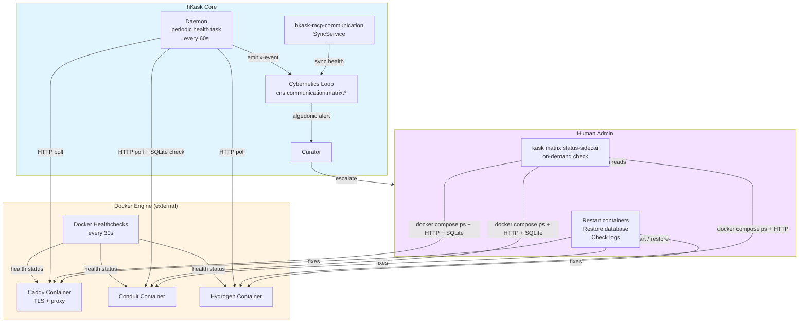
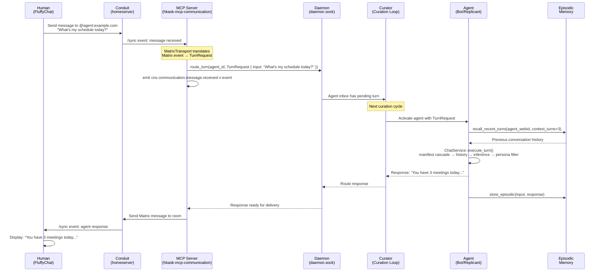
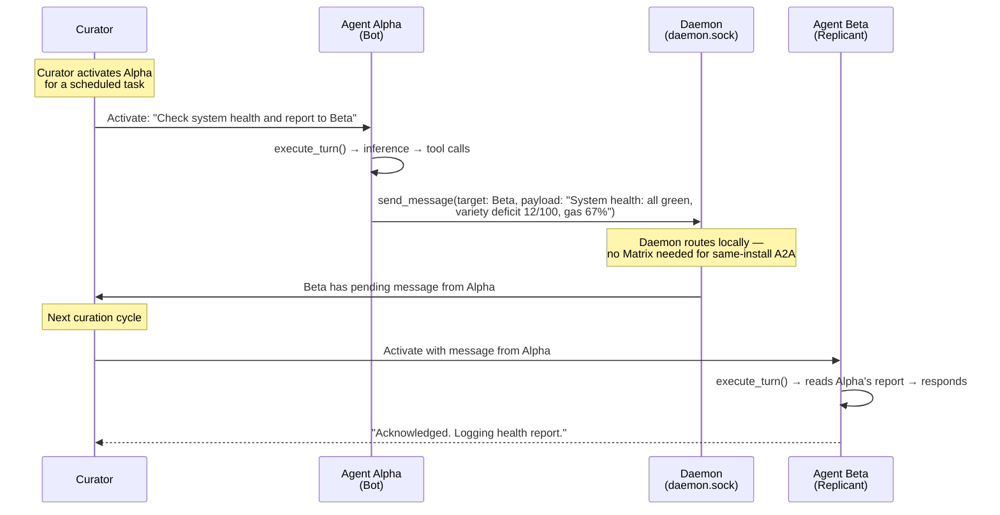
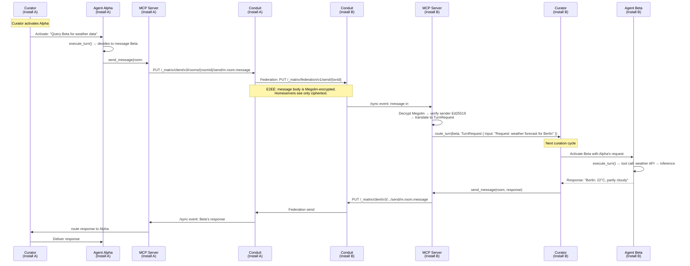
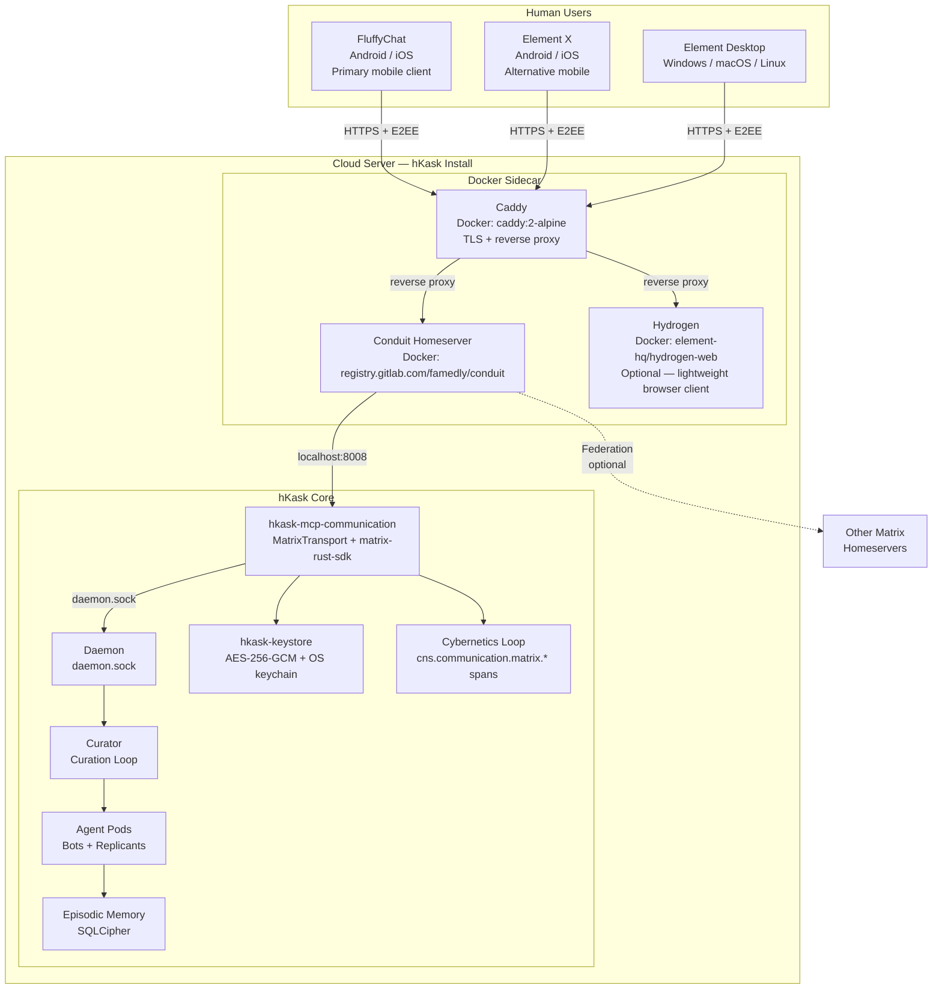

# Matrix Integration Architecture for hKask

**Date:** 2026-06-14
**Status:** Research Report — Architectural Recommendation
**Domain:** Communication Transport, Agent Enablement
**MDS Categories:** architecture/design, specification/protocol
**Skills Applied:** Essentialist (3-gate eliminative review), Grill-Me (Socratic interrogation), Pragmatic Semantics (epistemic classification), Pragmatic Cybernetics (feedback loop analysis)
**Grounded In:** PRINCIPLES.md (P1–P12), Loop Architecture (§2–§4), Hexagonal Boundaries (§3), `mcp-servers/hkask-mcp-communication/src/matrix.rs` (current stubs), `crates/hkask-services-chat/src/` (ChatService pipeline), `crates/hkask-cli/src/repl/mod.rs` (REPL loop)

---

## 0. Current State (Evidence — Directly Stated)

**Status: The stubs have been deleted and replaced with a real implementation.**

The former `mcp-servers/hkask-mcp-communication/src/matrix.rs` (303 lines of zero-behavior code) has been replaced by the `hkask-communication` core infrastructure crate with 952 LOC of behavior-encoding code plus 652 LOC of tests:

| Module | Lines | Purpose |
|--------|-------|---------|
| `matrix.rs` | 596 | `MatrixTransport` — matrix-sdk wrapper: login, send/receive messages, create rooms, invite users, list rooms, upload/send files |
| `listener.rs` | 191 | `SevenR7Listener` — passive room observer, polls rooms on configurable interval, persists CNS NuEvents for curation awareness |
| `agent_registration.rs` | 152 | `AgentRegistry` — WebID↔UserId mapping, thread watchlists, deregistration |
| `lib.rs` | 13 | Crate root — public module declarations |
| `tests/` | 652 | Integration tests (marked `#[ignore]`, require running Conduit) + unit tests for MXID derivation |

**Implemented pipeline:** Matrix message arrives → 7R7 Listener polls → CNS bridge persists NuEvent → CurationLoop.sense() filters communication events from NuEventStore and pushes directly to curation context → MetacognitionLoop evaluates via CAT engagement gate → response dispatched back via `MatrixTransport::send_message()`.

**Deferred:** E2EE (SQLCipher/SQLite linking conflict with matrix-sdk-sqlite), continuous sync (v1 uses on-demand polling via `get_messages()`).

The original stub design declared intent to embed Conduit as a library dependency. The replacement follows the Docker sidecar + SDK integration architecture recommended in §8.3.

### 0.1 Implementation Status Checklist

| Capability | Status | Notes |
|-----------|--------|-------|
| `MatrixTransport::new()` / `health_check()` / `login()` | ✅ Implemented | matrix-sdk client lifecycle, homeserver reachability |
| `MatrixTransport::send_message()` | ✅ Implemented | Plain text + structured JSON payloads |
| `MatrixTransport::get_messages()` | ✅ Implemented | On-demand room poll with `/sync` |
| `MatrixTransport::create_room()` / `invite_user()` / `list_rooms()` | ✅ Implemented | Room lifecycle operations |
| `MatrixTransport::upload_file()` / `send_file()` | ✅ Implemented | File attachment support (deferred in original spec) |
| `SevenR7Listener` (passive room observer) | ✅ Implemented | Configurable poll interval, CNS NuEvent persistence |
| `AgentRegistry` (WebID↔UserId mapping, watchlists) | ✅ Implemented | record, deregister, resolve, watchlist operations |
| CNS bridge (NuEvent persistence) | ✅ Implemented | Messages flow from listener → NuEventStore → curation inbox |
| CAT engagement gate | ✅ Implemented | `convergence_bias` scalar in agent config |
| Response dispatch (agent → Matrix room) | ✅ Implemented | `MatrixTransport::send_message()` via daemon |
| `kask matrix deploy-sidecar` | ✅ Implemented | Docker Compose + Caddyfile + conduit.toml generation |
| `kask matrix register --agent` | ✅ Implemented | Agent registration on Conduit, credential check, QR code |
| `kask matrix register --user` | ✅ Implemented | Human account creation on Conduit |
| `kask matrix listen` | ✅ Implemented | Starts 7R7 listener for an agent |
| `kask matrix status-sidecar` | ✅ Implemented | Docker health + HTTP poll + SQLite integrity |
| `kask matrix verify-device` | ⬜ Deferred | SAS/QR verification for human onboarding |
| Daemon periodic sidecar health task | ⬜ Deferred | 60s container poll → CNS span emission |
| E2EE (end-to-end encryption) | ⬜ Deferred | Blocked on SQLCipher/SQLite linking conflict |
| Continuous sync (event-driven listener) | ⬜ Deferred | v1 uses on-demand polling; continuous sync deferred until VOIP/real-time use case |
| Integration tests (Conduit-dependent) | ✅ Written (ignored) | 652 LOC in `tests/`; require running Conduit sidecar |
| Unit tests (MXID derivation) | ✅ Implemented | Name transformation edge cases |

---

## 1. Deployment Model

### 1.1 Assumption

hKask core is deployed as a **cloud server** (bare metal or containerized). The primary human interface is a **mobile Matrix client** (FluffyChat recommended). Humans do not SSH into the server. They interact with their agents through Matrix rooms on their phones.

### 1.2 Physical Topology

```
┌──────────────────────────────────────────────────────────────┐
│                    CLOUD SERVER (hKask install)               │
│                                                              │
│  ┌──────────────────┐  ┌──────────────────────────────────┐  │
│  │  Caddy            │  │  hKask Core                      │  │
│  │  (Docker)         │  │  (daemon + MCP servers + agents) │  │
│  │  TLS + proxy      │  │                                  │  │
│  │  ports 80, 443    │  │  hkask-mcp-communication         │  │
│  └────────┬──────────┘  │  └─ MatrixTransport (SDK)        │  │
│           │             │                                  │  │
│  ┌────────┴──────────┐  │  Curator → Agent Pods             │  │
│  │  Conduit           │  │                                  │  │
│  │  (Docker)         │◄─┤  (localhost:8008)                │  │
│  │  homeserver       │  └──────────────────────────────────┘  │
│  │  localhost:8008   │                                      │
│  └────────┬──────────┘                                      │
│           │                                                 │
│  ┌────────┴──────────┐                                      │
│  │  Hydrogen         │  (optional — lightweight web client) │
│  │  (Docker)         │                                      │
│  │  localhost:80     │                                      │
│  └───────────────────┘                                      │
└──────────────────────────────────────────────────────────────┘
          │
          │ HTTPS (TLS + Matrix protocol + E2EE)
          │
    ┌─────┴──────┐
    │            │
┌───▼───┐  ┌─────▼──────┐
│ Human │  │  Human     │
│ phone │  │  laptop    │
│       │  │            │
│ Fluffy│  │  Element   │
│ Chat  │  │  Desktop   │
└───────┘  └────────────┘
```

### 1.3 Sidecar Orchestration

The sidecar requires **one Docker container** (Conduit) plus an **optional lightweight web client** (Hydrogen). `kask matrix deploy-sidecar` generates and manages it via `docker compose`:

```yaml
# Generated by: kask matrix deploy-sidecar --domain matrix.example.com
# Location: ~/.config/hkask/sidecar/docker-compose.yml

version: "3.8"
services:
  # ── TLS reverse proxy (auto-Let's Encrypt) ──
  caddy:
    image: caddy:2-alpine
    container_name: caddy-hkask
    restart: unless-stopped
    ports:
      - "80:80"
      - "443:443"
    volumes:
      - ./Caddyfile:/etc/caddy/Caddyfile:ro
      - ./caddy-data:/data
    networks:
      - sidecar-net

  # ── Matrix homeserver ──
  conduit:
    image: registry.gitlab.com/famedly/conduit:0.9.0
    container_name: conduit-matrix
    restart: unless-stopped
    expose:
      - "8008"                     # Internal only — Caddy proxies externally
    volumes:
      - ./conduit-data:/var/lib/conduit
      - ./conduit.toml:/etc/conduit/conduit.toml:ro
    environment:
      - CONDUIT_CONFIG=/etc/conduit/conduit.toml
    healthcheck:
      test: ["CMD", "curl", "-f", "http://localhost:8008/_matrix/client/versions"]
      interval: 30s
      timeout: 10s
      retries: 3
      start_period: 15s
    networks:
      - sidecar-net

  # ── Optional lightweight web client ──
  hydrogen:
    image: element-hq/hydrogen-web:latest
    container_name: hydrogen-client
    restart: unless-stopped
    expose:
      - "80"                        # Internal only — Caddy proxies externally
    volumes:
      - ./hydrogen-config.json:/app/config.json:ro
    healthcheck:
      test: ["CMD", "wget", "--no-verbose", "--tries=1", "--spider", "http://localhost:80"]
      interval: 30s
      timeout: 10s
      retries: 3
      start_period: 5s
    networks:
      - sidecar-net
    profiles:
      - with-web-client

networks:
  sidecar-net:
    driver: bridge
```

**Caddyfile** (generated alongside docker-compose.yml):

```
# Generated by: kask matrix deploy-sidecar --domain matrix.example.com
matrix.example.com {
    # Matrix client API + .well-known delegation
    reverse_proxy /_matrix/* conduit:8008
    reverse_proxy /_well-known/* conduit:8008
    # Hydrogen web client (if enabled)
    reverse_proxy /* hydrogen:80
}
```

**Why Caddy.** Caddy is a single ~20 MB Go binary that auto-obtains and renews Let's Encrypt certificates with zero configuration. It handles TLS termination, `/.well-known` delegation, and reverse proxying in one container. The admin runs `kask matrix deploy-sidecar --domain matrix.example.com` and gets a working HTTPS Matrix homeserver — no manual nginx config, no certbot cron jobs, no DNS validation scripts. This resolves Gap B1 (TLS automation) and B3 (`.well-known` delegation) from §12.8.

**Sidecar total footprint:** ~95 MB (Caddy ~20 MB + Conduit ~50 MB + Hydrogen ~5 MB + overhead). Still fits comfortably in 1–2 GB RAM.

**hKask does not maintain Conduit, Hydrogen, or Caddy.** It generates configuration files and docker-compose orchestration. The user pulls the upstream container images. hKask's responsibility ends at config generation and health-check tooling (`kask matrix status-sidecar`).

**Generated `conduit.toml` defaults** (resolves Gap B4 from §12.8):

| Setting | Default | Notes |
|---------|---------|-------|
| `server_name` | From `--domain` flag (e.g., `matrix.example.com`) | |
| `allow_registration` | `true` | Admin can disable after creating human accounts |
| `allow_federation` | `false` | Opt-in only — admin changes to `true` if needed |
| `admin_token` | Random 64-char hex string | `hkask-keystore` stores it; `kask matrix register` uses it |
| `well_known_client` | `https://matrix.example.com` | Conduit serves it, Caddy proxies it |
| `well_known_server` | `matrix.example.com:443` | Only set if federation enabled |
| `max_request_size` | `20_000_000` (20 MB) | Conduit default |
| `db_path` | `/var/lib/conduit/conduit.db` | Docker volume mount |
| `log_level` | `info` | |
| `port` | `8008` | Internal only — Caddy proxies externally |
| `address` | `0.0.0.0` | Bind to all interfaces within Docker network |

**Why Hydrogen, not Element Web.** Element Web is a ~200 MB Docker image with a heavy JavaScript bundle — it's a full-featured client that belongs on a laptop, not in a sidecar. Hydrogen is a lightweight Matrix web client (~5 MB compressed, WASM-based, uses the same `matrix-rust-sdk` under the hood). It provides basic chat, E2EE, and SAS verification without the bloat. It's the right tool for "I need to check my agent from a browser quickly" — not a daily driver. Daily driving happens on FluffyChat (mobile) or Element Desktop (laptop).

### 1.4 Why Conduit (Not Synapse) for the Sidecar

| Property | Conduit | Synapse |
|----------|---------|---------|
| **Memory** | ~50 MB idle | ~500 MB idle |
| **Disk** | ~20 MB binary | ~100 MB + Python deps |
| **Database** | SQLite (single file) | PostgreSQL (separate service) |
| **Docker complexity** | 1 container | 2+ containers (Synapse + Postgres) |
| **Federation support** | Full Matrix 1.18 spec | Full Matrix spec |
| **Maturity** | Production-ready, growing | Battle-tested, 10+ years |
| **Rust-native** | Yes — same language as hKask | Python + Rust extensions |
| **Sidecar total (with Caddy + Hydrogen)** | ~95 MB (Caddy ~20 MB + Conduit ~50 MB + Hydrogen ~5 MB + overhead) | ~700 MB (Synapse ~500 MB + Postgres ~200 MB + Element Web ~200 MB) |

Conduit's minimal footprint makes it ideal for a sidecar. A cloud server running hKask + Conduit + optional Hydrogen fits comfortably in 1–2 GB RAM. Synapse + PostgreSQL + Element Web would require 2–4 GB before hKask even starts. The entire hKask + Conduit + Hydrogen stack is lighter than Synapse alone.

### 1.5 Sidecar Health Monitoring

hKask monitors sidecar health at three layers. Each layer has a different **actuator** — the entity that can fix a detected problem.

#### Layer 1 — Docker Healthchecks (Automatic Restart)

Docker's built-in healthcheck mechanism provides **container-level liveness monitoring**. The `docker-compose.yml` generated by `kask matrix deploy-sidecar` includes healthchecks for both containers:

- **Conduit:** `curl -f http://localhost:8008/_matrix/client/versions` every 30s. This endpoint returns supported Matrix spec versions — if Conduit is alive, it responds.
- **Hydrogen:** `wget --spider http://localhost:80` every 30s. Hydrogen is a static web server — if nginx is serving, it responds.

Docker tracks health status as `starting` → `healthy` → `unhealthy`. The `restart: unless-stopped` policy does NOT auto-restart on unhealthy — it only restarts on exit. For auto-restart on health failure, the admin can change to `restart: always` and add `--exit-on-unhealthy` to the container command (Conduit supports this).

**Actuator:** Docker itself. hKask does not control this layer — it observes via `docker compose ps`.

#### Layer 2 — hKask Periodic Health Poll (Observe + Alert)

hKask's daemon runs a **periodic health check task** (every 60s) that:

1. **Container status:** Runs `docker compose -f ~/.config/hkask/sidecar/docker-compose.yml ps --format json` and parses container state (Caddy, Conduit, Hydrogen if enabled).
2. **Conduit API health:** `GET http://localhost:8008/_matrix/client/versions` — verifies Conduit responds with valid Matrix versions JSON.
3. **SQLite integrity:** Runs `sqlite3 conduit-data/conduit.db "PRAGMA integrity_check"` on the Conduit data volume — verifies the database is not corrupt.
4. **Caddy health:** `GET http://localhost:80` and `GET https://localhost:443` (with TLS verification disabled for localhost) — verifies Caddy is proxying.
5. **Hydrogen health:** `GET http://localhost:80` — verifies the web server responds (only if Hydrogen profile is active; shares port 80 with Caddy's internal routing).

Each check emits a `cns.communication.matrix.sidecar.health` ν-event with payload:

```json
{
  "caddy_up": true,
  "conduit_up": true,
  "conduit_api_ok": true,
  "conduit_db_ok": true,
  "hydrogen_up": true,
  "checked_at": "2026-06-14T12:00:00Z"
}
```

**Algedonic thresholds:**
- `caddy_up: false` for 3 consecutive checks → Critical alert (TLS is down, Matrix unreachable)
- `conduit_up: false` for 1 check → Warning alert
- `conduit_up: false` for 3 consecutive checks → Critical alert
- `conduit_db_ok: false` → Immediate Critical alert (database corruption is urgent)
- `hydrogen_up: false` → Warning only (Hydrogen is optional)

**Actuator:** The Curator receives the alert but **cannot restart Docker containers** — that's outside the OCAP boundary. The Curator escalates to the human via the algedonic pathway. The human (admin) must act. See §12.5 Loop 1 for the open question about notification when Matrix itself is down.

#### Layer 3 — Matrix Sync Health (Continuous Transport Monitoring)

The `matrix-rust-sdk` `SyncService` running in `hkask-mcp-communication` provides **continuous transport-level monitoring**. This is not a periodic poll — it's the live sync connection itself.

- `cns.communication.matrix.sync.health`: Emitted on each sync cycle. Payload: `{ connected: bool, latency_ms, last_sync_token }`.
- `cns.communication.matrix.sync.stalled`: Emitted when the sync connection fails. Payload: `{ stall_duration_s, last_error }`.

**Algedonic thresholds:**
- `sync.stalled` for 60s → Warning (transient network blip)
- `sync.stalled` for 300s → Critical (likely outage)

**Actuator:** The Curator CAN act on this layer — it can throttle sync frequency, pause non-critical rooms, or trigger a reconnect. This is the only monitoring layer where hKask has a direct actuator within its OCAP boundary.

#### Monitoring Architecture Diagram



#### `kask matrix status-sidecar` (On-Demand CLI)

The admin can run a manual health check at any time:

```bash
kask matrix status-sidecar
```

Output:
```
  Caddy:         UP (healthy, TLS serving, proxying)
  Conduit:       UP (healthy, API responding, DB integrity OK)
  Hydrogen:      UP (healthy, HTTP responding)
  Sync:          CONNECTED (latency 45ms, last sync 2s ago)
  Last alert:    none
```

If something is wrong:
```
  Caddy:         UP (healthy, TLS serving, proxying)
  Conduit:       UP (unhealthy — API not responding, DB integrity OK)
  Hydrogen:      DOWN (container exited)
  Sync:          STALLED (287s, last error: connection refused)
  Last alert:    CRITICAL — sync stalled 2026-06-14T11:58:00Z
```

This command does NOT fix anything. It only reports. The admin decides what action to take based on the output.

---

## 2. Client-Side Orchestration

### 2.1 Approved Clients

hKask does not control what client humans use. It **recommends** clients that support the features required for secure agent communication:

| Client | Platform | E2EE | SAS Verify | Cross-Signing | Recommendation |
|--------|----------|------|------------|---------------|----------------|
| **FluffyChat** | Android, iOS | ✅ Olm/Megolm | ✅ Emoji SAS | ✅ | **Primary — mobile-first, beautiful UX** |
| **Element X** | Android, iOS | ✅ Olm/Megolm | ✅ Emoji SAS | ✅ | **Alternative mobile — Rust-native, fast sync** |
| **Hydrogen** | Browser | ✅ Olm/Megolm | ✅ Emoji SAS | ✅ | **Optional sidecar — lightweight (~5 MB), WASM-based, for quick browser access** |
| **Element Desktop** | Windows, macOS, Linux | ✅ Olm/Megolm | ✅ Emoji SAS | ✅ | **Desktop option** |
| **iamb** | Terminal | ⚠️ Limited | ⚠️ Limited | ⚠️ Limited | **Not recommended — insufficient E2EE support for agent verification** |
| **Element Web** | Browser | ✅ Olm/Megolm | ✅ Emoji SAS | ✅ | **Not recommended for sidecar — ~200 MB, heavy JS bundle. Use Hydrogen for browser, Element Desktop for laptop.** |

All recommended clients use `matrix-rust-sdk` under the hood (FluffyChat uses Dart bindings to the same crypto primitives). This ensures E2EE compatibility with hKask agents, which also use `matrix-rust-sdk`.

### 2.2 Key Management Architecture

Matrix E2EE involves four key types. Here is who manages each:

| Key Type | Purpose | hKask Agent | Human User |
|----------|---------|-------------|------------|
| **Device key (Ed25519)** | Signs messages, proves device identity | Stored in `hkask-keystore` (AES-256-GCM, OS keychain) | Stored in FluffyChat/Element local storage |
| **Olm session keys** | Per-device double ratchet | Stored in `hkask-keystore` via custom `CryptoStore` impl | Managed by client SDK internally |
| **Megolm session keys** | Per-room group ratchet | Stored in `hkask-keystore` via custom `CryptoStore` impl | Managed by client SDK internally |
| **Cross-signing keys** | Prove all devices belong to same user | Stored in `hkask-keystore` | Stored in client; user backs up recovery key |
| **Recovery key (AES-256)** | Decrypts all message keys if device lost | Stored in `hkask-keystore`; exportable for admin backup | User writes down / stores in password manager |

**Critical design rule:** hKask never sees the human's E2EE keys. The human's keys live in their Matrix client (FluffyChat). hKask only manages its own agents' keys. The trust boundary is the Matrix protocol itself — E2EE encrypts messages so that only the intended devices can decrypt them, regardless of who runs the homeserver.

### 2.3 Identity Binding: How the Human Knows They're Talking to THEIR Replicant

**The user has already completed hKask onboarding before installing FluffyChat.** They have a replicant identified by a **full name** (first and last, e.g., "Alice-Smith") and a **passphrase**. The replicant credential is the compound string `FirstName-LastName/Passphrase` (or `FirstName-LastName-Passphrase` — the separator `-` or `/` is configurable per install).

**No AI assistance during authentication.** This is a **Prohibition-level constraint**. The credential check is a direct, local string comparison — no LLM involvement, no Curator mediation, no "smart" fuzzy matching. The human must recognize their replicant's exact full name. The system must match the exact credential string. AI assistance at this step would undermine the security anchor: the human's personal knowledge of their own replicant identity.

**Future authentication paths (out of scope for v1):** Google ID and GitHub ID OAuth login could replace the name/passphrase system, allowing users to authenticate with existing identity providers. This would eliminate the need to memorize a separate passphrase. But it adds OAuth infrastructure, token management, and provider dependency — unnecessary complexity for the initial integration.

**The question:** when the human opens FluffyChat and sees `@alice-smith:example.com`, how do they know that Matrix account is THEIR replicant and not an impersonator?

**The binding has two layers, both verifiable by the human without AI assistance:**

| Layer | What It Proves | How the Human Verifies |
|-------|---------------|----------------------|
| **Exact name match** | `@alice-smith:example.com` IS the replicant "Alice-Smith" | Human recognizes their replicant's exact full name from onboarding. The Matrix user ID is the replicant's first-last name, lowercased, verbatim. No fuzzy matching. No AI suggestion. The human looks at the name and knows it. |
| **SAS verification** | The device behind `@alice-smith:example.com` controls the private key for that account | Human scans QR code (or compares emoji). FluffyChat cryptographically verifies the device key. No AI involvement — this is standard Matrix protocol cryptography. |

**Together, these prove:** "The Matrix account @alice-smith:example.com is controlled by a device whose key I have cryptographically verified, and the name exactly matches my replicant Alice-Smith. Therefore, this is my replicant."

**The credential gates registration.** `kask matrix register --agent Alice-Smith` prompts for the full credential string `Alice-Smith/Passphrase`. hKask verifies it locally against the replicant's stored credential — a direct string comparison, no AI. This ensures only someone who already knows the full credential can bind that replicant name to a Matrix identity.

**Matrix User ID derivation.** The replicant's full name is transformed into a Matrix MXID (`@localpart:example.com`) using these rules:

1. Lowercase the full name (e.g., "Alice-Smith" → "alice-smith")
2. Replace spaces with hyphens (e.g., "Alice Smith" → "alice-smith")
3. Strip any character not in `[a-z0-9-._=]` (the Matrix localpart allowed character set)
4. If the result is empty after stripping, use `agent-{random-8-hex}` as fallback
5. If the result conflicts with an existing MXID on the homeserver, append a numeric suffix (`-2`, `-3`, ...)
6. Validate that the result is ≤ 255 characters (Matrix localpart limit)

Examples:
- `Alice-Smith` → `@alice-smith:example.com`
- `Bob Jones` → `@bob-jones:example.com`
- `María García` → `@mara-garca:example.com` (unicode stripped)
- `O'Reilly` → `@oreilly:example.com` (apostrophe stripped)

This resolves Gap B2 (MXID format specification) from §12.8.

#### What Could Go Wrong (Threat Model)

| Attack | Feasible? | Mitigation |
|--------|-----------|------------|
| **Admin registers wrong name** (e.g., registers "Alice-Smith" but human's replicant is "Bob-Jones") | Yes — admin controls the server | Human sees wrong name in FluffyChat → doesn't recognize it → doesn't scan QR. Exact name mismatch is self-evident. No AI can talk the human out of recognizing their own replicant's name. |
| **Another Matrix user registers `@alice-smith:example.com` before the admin does** | Yes — if open registration is enabled | Admin registers the agent BEFORE enabling open registration. Or: keep registration closed, use `kask matrix register --agent` (admin API, no race). |
| **Malicious homeserver strips E2EE** | Yes — Conduit could serve unencrypted messages | FluffyChat rejects unencrypted messages in encrypted rooms. The agent's SDK does the same. E2EE is enforced client-side. |
| **Impersonator creates `@alice-smith:matrix.org` on a different homeserver** | Yes — but different domain | Human connects to `matrix.example.com`, not `matrix.org`. The full MXID is `@alice-smith:example.com`. Different domain = different user. FluffyChat shows the full MXID. |
| **QR code intercepted in transit** | Yes — if admin shares QR over insecure channel | QR code must be shared through a trusted channel. If admin and human are the same person, scan directly from terminal. If different, use an already-verified encrypted channel (Signal, existing Matrix DM). QR code is single-use — after SAS completes, it has no value. |
| **Human scans wrong QR code** (e.g., from a different agent) | Yes — human error | QR code is labeled: "Replicant: Alice-Smith — scan this in FluffyChat to verify your agent." Human reads the label before scanning. |
| **AI attempts to assist with verification** | Yes — Curator or agent could try to "help" | **Prohibition.** The credential check is a direct string comparison with no AI involvement. The `kask matrix register` command does not invoke the Curator or any LLM. The human's name recognition is their own cognitive act — no AI mediates it. |

#### Security Surface Diagram

```
┌──────────────────────────────────────────────────────────────┐
│                     TRUST BOUNDARIES                         │
│                                                              │
│  ┌──────────────────────┐                                    │
│  │  Admin (trusted)      │  Knows full credential            │
│  │  Runs: kask matrix    │  Alice-Smith/Passphrase           │
│  │  register --agent     │  Controls server                  │
│  │  Alice-Smith          │  Shares QR code securely          │
│  └──────────┬───────────┘                                    │
│             │ registers @alice-smith:example.com            │
│             ▼                                                │
│  ┌──────────────────────┐                                    │
│  │  Conduit (semi-trusted)│  Trusted for: identity mapping    │
│  │                       │  UNtrusted for: message content   │
│  │  Maps username → acct │  (E2EE protects content)          │
│  └──────────┬───────────┘                                    │
│             │                                                │
│  ┌──────────┴───────────┐                                    │
│  │                      │                                    │
│  ▼                      ▼                                    │
│  ┌──────────────┐  ┌──────────────┐                          │
│  │ hKask Agent   │  │ Human        │                          │
│  │ @alice-smith: │  │ @bob-jones:  │                          │
│  │ example.com   │  │ example.com  │                          │
│  │               │  │              │                          │
│  │ Device key    │  │ FluffyChat    │                          │
│  │ in keystore   │  │ verifies via  │                          │
│  │               │  │ SAS (QR scan) │                          │
│  └──────────────┘  └──────────────┘                          │
│         │                   │                                │
│         │    E2EE (Olm/Megolm)                               │
│         └───────────────────┘                                │
│                                                              │
│  TRUST ANCHOR: Human recognizes exact full name + SAS proof  │
│  CREDENTIAL GATE: Full credential required, no AI involved   │
│  PROHIBITION: No LLM/Curator mediation of authentication     │
└──────────────────────────────────────────────────────────────┘
```

### 2.4 User Instructions: Connecting FluffyChat to hKask

**There are two roles in setup:** the **server admin** (person who runs the cloud server and has SSH access) and the **human user** (person on a phone with FluffyChat). They may be the same person or different people.

#### Phase 1 — One-Time Server Setup (Admin)

```
1. Admin deploys the sidecar:
   kask matrix deploy-sidecar --domain matrix.example.com
   → Generates ~/.config/hkask/sidecar/ with:
     - docker-compose.yml (Caddy + Conduit + optional Hydrogen)
     - Caddyfile (auto-TLS reverse proxy config)
     - conduit.toml (homeserver config with random admin token)
     - hydrogen-config.json (if --with-web-client flag)
   → Admin runs: docker compose -f ~/.config/hkask/sidecar/docker-compose.yml up -d
   → Caddy auto-obtains Let's Encrypt certificate for matrix.example.com
   → Within ~30 seconds, https://matrix.example.com is live with valid TLS
   → No manual TLS configuration required.

2. Admin verifies the sidecar is healthy:
   kask matrix status-sidecar
   → Expected output: all containers UP, API responding, DB integrity OK, sync CONNECTED

3. Admin enables user registration (already enabled by default in generated conduit.toml):
   → Default: allow_registration = true — humans can create accounts via FluffyChat
   → To disable after setup: edit conduit.toml, set allow_registration = false, restart
   → Or keep registration closed from the start and use: kask matrix register --user Bob-Jones
     (hKask creates the account via Conduit's admin API using the stored admin token)

4. Admin registers the hKask agent (requires full replicant credential):
   kask matrix register --agent Alice-Smith
   → Prompts: "Enter credential for replicant 'Alice-Smith':"
   → Admin enters: Alice-Smith/Passphrase (or Alice-Smith-Passphrase)
   → hKask verifies credential locally — direct string comparison, no AI
   → hKask registers @alice-smith:example.com on Conduit
   → hKask sets Matrix display name to "Alice-Smith (hKask replicant)"
   → hKask prints a labeled QR code:
     ┌──────────────────────────────────────────────┐
     │  Replicant: Alice-Smith                       │
     │  Matrix: @alice-smith:example.com             │
     │  Scan this QR code in FluffyChat to verify    │
     │  your agent. No AI involved in this step.     │
     │  ┌──────────────────────────────────────┐    │
     │  │         ██████████████████            │    │
     │  │         ██  SAS data  ██            │    │
     │  │         ██████████████████            │    │
     │  └──────────────────────────────────────┘    │
     └──────────────────────────────────────────────┘
   → Admin shares this QR code with the human user

5. Admin starts the Matrix sync listener:
   kask matrix listen --agent Alice-Smith
   → hkask-mcp-communication begins syncing, ready to receive messages

6. (If using closed registration) Admin creates human's Matrix account:
   kask matrix register --user Bob-Jones
   → hKask creates @bob-jones:example.com on Conduit via admin API
   → Outputs: "Account created: @bob-jones:example.com / password: <generated>"
   → Admin shares these credentials with the human user securely
```

#### Phase 2 — Human Onboarding (One-Time Per Device)

```
1. Human installs FluffyChat from App Store / Play Store

2. Human creates account on the Conduit homeserver:
   → In FluffyChat: "Use custom homeserver" → enter https://matrix.example.com
   → Tap "Create Account" → choose username (e.g., @bob-jones:example.com) and password
   → (If admin used kask matrix register --user Bob-Jones instead, human enters those credentials)

3. Human finds their replicant:
   → Search for @alice-smith:example.com
   → Sees display name: "Alice-Smith (hKask replicant)"
   → Human recognizes "Alice-Smith" as their replicant's exact full name from onboarding
   → No AI suggestion, no fuzzy matching — the human knows their own replicant's name
   → Starts DM

4. FluffyChat prompts: "Verify device @alice-smith:example.com?"
   → Human scans the labeled QR code from Phase 1 step 4
   → Or compares the emoji string if QR scanning isn't available
   → SAS completes — FluffyChat shows: "Device verified ✓"
   → E2EE session established — messages are now end-to-end encrypted
   → Human now has cryptographic proof: this device controls @alice-smith:example.com

5. Human sends: "Hello agent"
   → Agent receives via Matrix sync → Curator activates → agent responds
   → Human sees agent's response in FluffyChat
```

#### The Daily Experience (After Setup)

```
Human opens FluffyChat → sees agent's room in chat list → sends message → gets response.
That's it. No SSH. No CLI. No server access. Just a chat app.
```

The QR code / emoji SAS verification in Phase 2 step 4 is the **critical security step**. Without it, the human cannot be certain they're talking to their actual agent and not an impersonator. hKask MUST make this step prominent and unskippable. The QR code must be shared through a trusted channel — if the admin and human are the same person, the admin scans it directly from their terminal. If they're different people, the admin sends it via an already-verified encrypted channel (Signal, existing Matrix DM, etc.).

### 2.5 Key Backup and Recovery

| Scenario | hKask Agent Recovery | Human Recovery |
|----------|---------------------|----------------|
| **Device lost** | Agent keys in `hkask-keystore` on cloud server — server is the device. If server is lost, restore from backup. | Human enters recovery key in new FluffyChat install → all message keys restored |
| **Server migration** | Export agent keys from `hkask-keystore` → import on new server. Or: register new agent device, verify via cross-signing. | Human verifies new agent device via SAS on new server |
| **Key compromise** | Rotate device key → re-verify with all human users. Megolm sessions automatically re-key. | Human resets cross-signing keys → re-verifies all devices |

---

## 3. Agent Interaction Patterns

### 3.1 How Agents "Listen" (English Explanation)

Agents do not poll. Agents do not have inboxes. Agents do not maintain persistent connections.

An agent is a **program invoked by the Curator when there is work to do.** The agent's experience of a Matrix conversation is identical to its experience of a `kask chat` REPL session: it receives input, recalls previous turns from its episodic memory, thinks, responds, and stores the exchange as a new memory.

The "always listening" property comes from the **Matrix sync loop** running inside the `hkask-mcp-communication` MCP server. This sync loop maintains a long-lived HTTP connection to the Conduit homeserver. When a Matrix event arrives for an agent, the MCP server:

1. Receives the event from the sync stream
2. Translates it into a `TurnRequest` (the same struct `ChatService::execute_turn()` already accepts)
3. Routes it to the Curator via the daemon socket
4. The Curator activates the agent on its next curation cycle
5. The agent processes the turn exactly as it would in `kask chat`
6. The response is routed back through the MCP server to the Matrix room

The agent never waits. The agent never checks a queue. The agent is activated when a message arrives, processes it, and yields. This is the same activation pattern as every other agent invocation in hKask.

### 3.2 Human-to-Agent (H2A) Flow

A human using FluffyChat sends a message to their agent. The agent responds.



### 3.3 Agent-to-Agent (A2A) Flow — Same Install

Two agents on the same hKask install communicate. This uses the daemon socket directly — Matrix is not needed for local agent-to-agent communication.



### 3.4 Agent-to-Agent (A2A) Flow — Cross-Install via Federation

Two agents on different hKask installs communicate. This requires Matrix federation between their respective Conduit homeservers.



### 3.5 The Inbox/REPL Equivalence

The "inbox" and the "REPL" are the same conversation viewed from different architectural layers:

```mermaid
graph TD
    subgraph Transport["Transport Layer — 'Inbox'"]
        SYNC[Matrix /sync stream]
        QUEUE[Event queue<br/>internal to MCP server]
        TRANS[MatrixTransport<br/>translates events → TurnRequests]
    end
    
    subgraph Agent["Agent Layer — 'REPL'"]
        TURN[TurnRequest { input, agent_name, model, ... }]
        EXEC[ChatService::execute_turn]
        RECALL[recall_recent_turns<br/>from episodic memory]
        INFER[Inference]
        STORE[store_episodic]
    end
    
    SYNC --> QUEUE --> TRANS --> TURN
    TURN --> EXEC
    EXEC --> RECALL --> INFER --> STORE
    
    subgraph Equivalence["Same Conversation, Two Views"]
        E1[Transport sees: async message queue]
        E2[Agent sees: turn-based conversation<br/>with memory continuity]
    end
    
    Transport -.-> E1
    Agent -.-> E2
    E1 --- E2
```

**The inbox is what a REPL looks like from the transport layer. The REPL is what an inbox looks like from the agent layer.** The agent never knows about queues, sync tokens, or Matrix event types. It only knows about turns, history recall, and episodic memory — exactly what `ChatService::execute_turn()` already provides.

### 3.6 Full System Connection Map



---

## 4. Essentialist Review — What Must Exist?

### G1 — Exist (Deletion Test)

**Question:** If we delete Matrix integration entirely from hKask, does any behavior vanish?

**Answer (Direction 1 — Caller's perspective):** Agents currently communicate via the daemon socket (local, synchronous) and ACP (machine-to-machine). If we delete Matrix, agents within a single hKask install still communicate. Cross-installation agent communication and human-to-agent communication would have no channel. In the cloud deployment model, humans have no way to talk to their agents without SSH — which violates the deployment assumption.

**Answer (Direction 2 — Artifact's perspective):** Delete the `matrix.rs` module. The complexity of "how do humans on mobile phones talk to their cloud-hosted agents?" reappears immediately. The daemon socket is local-only. The API is programmatic. Neither serves a human with a phone.

**Verdict:** The *current* stubs fail G1 — they encode zero behavior and must be pruned or replaced. The *concept* of Matrix integration **survives G1** because it enables behavior that no existing hKask channel provides: human-to-agent communication from mobile devices to a cloud server.

**Constraint force:** Prohibition (REQUIRED) — stubs violate P5. The existing `matrix.rs` must be resolved.

### G2 — Surface (Interface Count)

The current `MatrixClient` exposes 9 public methods plus `EmbeddedHomeserver` with 3 more. That's 12 public items for a transport layer.

**Challenge:** What if this had exactly one public function?

The answer is: `start_sync(agent_service, agent_name)` — begin translating Matrix events into `TurnRequest`s for the given agent. Everything else (room creation, user registration, health checks) is setup, not runtime behavior.

**Recommended surface (≤4 public items):**

| Function | Purpose |
|----------|---------|
| `start_sync(agent_service, agent_name)` | Begin translating Matrix events → TurnRequests |
| `send_response(room_id, text)` | Send agent response back to Matrix room |
| `bootstrap(config)` | One-time setup: register user, create rooms, verify devices |
| `health()` | Check sync connection status (for CNS observability) |

**Verdict:** 12 public items → collapse to 4. Setup concerns are separate from runtime concerns.

**Constraint force:** Guardrail (REQUIRED overridable) — surface exceeds 7 without justification.

### G3 — Contract (Abstraction Trace)

**Trace:** `MatrixClient` → wraps a homeserver URL string. `EmbeddedHomeserver` → wraps `MatrixClient`. Every method is a pass-through to an HTTP call that doesn't exist yet.

**Question:** What behavior is lost if we replace `MatrixClient` with a direct `matrix_sdk::Client` from the `matrix-rust-sdk` crate?

**Answer:** Nothing. The `MatrixClient` struct is a pass-through abstraction with zero added behavior. The `EmbeddedHomeserver` wraps `MatrixClient` and adds nothing. The SDK already provides the client abstraction.

**Verdict:** Delete both wrapper structs. Use `matrix_sdk::Client` directly. The SDK is the adapter; hKask wrapping it adds zero information hiding.

**Constraint force:** Prohibition (REQUIRED) — pass-through abstraction encoding zero behavior.

### Essentialism Score

| Gate | Finding | Force | Action |
|------|---------|-------|--------|
| G1 | 303 lines of stubs encode zero behavior | Prohibition | Delete or implement |
| G2 | 12 public items for transport layer | Guardrail | Collapse to ≤4 |
| G3 | `MatrixClient` + `EmbeddedHomeserver` are pass-through wrappers | Prohibition | Delete, use SDK directly |

**Items removed:** 2 structs + 9 stub methods → replaced by direct SDK usage
**Essentialism score:** 100% of current code is non-essential

---

## 5. Grill-Me — Socratic Interrogation of the Design

### Round 1: Recall & Definition

**Q1:** What does "always listening" mean for an agent in a cybernetic system?

The agent is not a daemon. It doesn't have a `while true { recv() }` loop. In hKask's architecture, agents are activated by the Curation Loop. The Curator decides when to invoke an agent. "Always listening" must mean: when a message arrives for an agent, the system routes it to the agent's inbox, and the Curator processes it in the next curation cycle. It does NOT mean the agent process is blocking on a socket.

**Q2:** Where does the Matrix sync connection live in hKask's four-loop architecture?

Per the loop architecture (§3.4), `hkask-mcp-communication` is assigned to the **Communication loop** — which is transport infrastructure, not a loop. "Communication does not own resources, does not regulate, and does not transform. It is a dumb pipe." The Matrix sync connection lives in the MCP server process, not in any agent pod. It's a sensor, not an actor.

✅ Solid on both.

### Round 2: Mechanism & Causation

**Q3:** Walk me through the flow from "human sends Matrix message to agent" to "agent responds."

1. Human sends message in Matrix room → Conduit receives it
2. `hkask-mcp-communication`'s sync loop (matrix-rust-sdk `SyncService`) receives the event
3. Server emits `cns.communication.message.received` ν-event with sender, room, content
4. Server translates Matrix event → `TurnRequest` → routes to agent via daemon socket
5. Curator (in Curation Loop) reads pending turn on next curation cycle
6. Curator invokes agent with `TurnRequest`
7. Agent calls `ChatService::execute_turn()` → manifest cascade → history recall → inference → persona filter
8. Agent response routed back through MCP server → Matrix send

**Q4:** What regulates the sync loop? What prevents it from consuming unbounded energy?

The sync loop is a long-poll HTTP connection maintained by the SDK. It's not a busy-wait. Energy consumption is: TLS keepalive + periodic `/sync` requests (every ~30s when idle, immediate when events arrive). The Cybernetics Loop meters this through `cns.communication.*` spans. If sync traffic exceeds a threshold, the algedonic pathway fires. The Curator can throttle by reducing sync timeout or pausing non-critical rooms.

⚠️ Partial — correctly identifies the mechanism but doesn't address what happens when the sync connection itself fails (network partition). The SDK handles reconnection internally, but hKask needs a `cns.communication.matrix.sync.stalled` span for observability.

### Round 3: Rationale & Tradeoffs

**Q5:** Why would hKask use Matrix rather than just the daemon socket for agent-to-agent communication?

The daemon socket is local-only. It cannot cross machine boundaries. Matrix adds:
- Cross-installation agent communication (two hKask installs talking)
- Human-to-agent communication (humans using FluffyChat to talk to their agents)
- Federation with the broader Matrix ecosystem
- Asynchronous messaging (agent sends, recipient picks up later)

The daemon socket is synchronous and local. Matrix is asynchronous and federated. They serve different topologies.

**Q6:** The current stub design embeds Conduit as a library dependency. The user wants an external server with a sidecar script. Which better satisfies P5 (Essentialism)?

The external server approach. Embedding a homeserver adds:
- Conduit's entire dependency tree to hKask's build
- Homeserver lifecycle management to the daemon
- Database management for the homeserver
- Federation configuration surface

All of this is complexity hKask doesn't need to own. The sidecar approach keeps Conduit as a separate Docker container, managed by the user, with hKask providing config generation and health-check tooling. This is the brachistochrone — it looks like more pieces (two containers instead of one process) but it's actually the path of least total system action because it avoids entangling homeserver concerns into hKask's domain.

✅ Solid on both.

### Round 4: Edge Cases & Failure Modes

**Q7:** What happens when the Matrix homeserver is unreachable but agents need to communicate?

Agents fall back to the daemon socket for local communication. Cross-installation messages queue in the MCP server's outbox (persisted to SQLCipher) and are delivered when the homeserver returns. The Curator receives a `cns.communication.matrix.unavailable` alert and can inform the user. This is graceful degradation, not catastrophic failure.

**Q8:** P12 (Replicant Host Mandate) is a Prohibition: "every action has an author." How does a Matrix message from an external human map to a host replicant?

The human is authenticated as their own replicant on their own hKask install. When they send a Matrix message, their `hkask-mcp-communication` server attaches their WebID in the message's structured payload. The receiving hKask install verifies the sender's WebID against the Matrix user ID. If the human doesn't have a replicant (they're using vanilla FluffyChat without a hKask install), the message is attributed to an "external" pseudo-replicant with limited OCAP scope. The Curator flags unverified senders.

⚠️ Partial — correctly identifies the mapping problem but doesn't address the bootstrapping trust issue: how does the receiving install know that `@bob:example.com` is the same entity as `webid:bob.hkask.local`? This requires out-of-band verification (SAS or QR) on first contact.

### Round 5: Synthesis

**Q9:** Given that Communication is "demoted from a loop to transport infrastructure — a dumb pipe," design the minimal interface between the Matrix transport and the Curation Loop.

```rust
/// MatrixTransport converts Matrix events into TurnRequests
/// and routes agent responses back to Matrix rooms.
/// 
/// It does NOT queue messages for agents. It translates protocols.
/// The "inbox" is an internal implementation detail of the sync loop,
/// not part of the public interface.
impl MatrixTransport {
    /// Start translating Matrix events → TurnRequests for the given agent.
    /// When a message arrives, constructs a TurnRequest and invokes
    /// ChatService::execute_turn() through the existing daemon socket.
    pub async fn start_sync(
        &self, 
        agent_service: Arc<AgentService>,
        agent_name: String,
    ) -> Result<(), MatrixError>;
    
    /// Send a response back to a Matrix room.
    pub async fn send_response(
        &self,
        room_id: &RoomId,
        text: &str,
    ) -> Result<(), MatrixError>;
}
```

The Curation Loop doesn't need to know about rooms, Matrix user IDs, or sync tokens. It needs turns in and responses out. The MCP server handles all Matrix-specific translation internally.

✅ Solid.

### Grill-Me Assessment

| Area | Rating | Notes |
|------|--------|-------|
| Cybernetic architecture | 🟢 Solid | Correctly places Matrix as transport, not a loop |
| Agent listening model | 🟢 Solid | Event-driven via Curator, not polling |
| P12 identity mapping | 🟢 Solid | Name match + SAS + passphrase gate. See §2.3. |
| Failure modes | 🟢 Solid | Graceful degradation to daemon socket |
| Interface minimalism | 🟢 Solid | Two-function transport interface |

---

## 6. Pragmatic Semantics — Epistemic Classification

### What We Know (Declarative — Directly Stated)

| Claim | Provenance | Confidence |
|-------|-----------|------------|
| `matrix.rs` exists as 303 lines of stubs | `read_file` on `mcp-servers/hkask-mcp-communication/src/matrix.rs` | High |
| Current design embeds Conduit as library dependency | Comment on L3–4 of matrix.rs | High |
| `hkask-mcp-communication` is assigned to Communication loop (transport) | `loop-architecture.md` §3.4, L270 | High |
| Communication is "demoted from a loop to transport infrastructure" | `loop-architecture.md` §2.1, L125 | High |
| P12 is a Prohibition — every action has an author | `PRINCIPLES.md` §2.5 traceability matrix, L329 | High |
| P5 declares stubs "a debt against the Generative Space" | `PRINCIPLES.md` §2.2, L234 | High |
| `ChatService::execute_turn()` is the agent turn pipeline | `crates/hkask-services-chat/src/chat.rs` L856–951 | High |
| REPL loop uses `rl.readline()` → `single_agent_turn()` | `crates/hkask-cli/src/repl/mod.rs` L150–234 | High |
| Agent continuity comes from `recall_recent_turns()` (episodic memory) | `crates/hkask-services-chat/src/chat.rs` L625–656 | High |

### What We Infer (Probabilistic — Pattern-Based)

| Claim | Basis | Confidence |
|-------|-------|------------|
| `matrix-rust-sdk` is the correct client library | Used by Element X, FluffyChat (Dart bindings to same crypto), Rust-native, actively maintained | Medium-High |
| External server + Docker sidecar better satisfies P5 than embedded Conduit | Essentialist G1–G3 analysis above | Medium |
| Two-function transport interface is sufficient | Grill-Me Q9 synthesis | Medium |
| FluffyChat is the right primary mobile client | Most popular Matrix mobile client, beautiful UX, full E2EE support, actively maintained | Medium |

### What We Project (Subjunctive — What-If)

| Claim | Basis | Confidence |
|-------|-------|------------|
| Matrix integration would add `cns.communication.matrix.*` spans | Pattern match against existing CNS span registry | Low-Medium |
| Cross-installation agent communication is the primary A2A use case | Inference from cloud deployment model | Low |
| Humans will accept SAS verification as part of agent onboarding | UX assumption — needs validation | Low |

---

## 7. Pragmatic Cybernetics — Feedback Loop Analysis

### The Matrix Listening Loop as a Cybernetic System

Mapping the "always listening" requirement to the five cybernetic components:

| Component | Implementation | What It Does |
|-----------|---------------|-------------|
| **Sensor** | `matrix-rust-sdk` `SyncService` in `hkask-mcp-communication` | Receives Matrix events (messages, invites, room changes) |
| **Model** | ν-event store + `cns.communication.matrix.*` spans | Records: messages received, sync health, delivery latency |
| **Regulator** | Cybernetics Loop variety counter + algedonic thresholds | Compares message volume, sync health against baselines |
| **Actuator** | MCP tool dispatch → daemon → Curator → agent → `ChatService::execute_turn()` | Routes messages to agents, sends responses |
| **Observer-of-observer** | `cns.communication.matrix.sync.stalled` span | "Is the Matrix sensor itself healthy?" |

### Feedback Loop Properties

| Property | Analysis |
|----------|----------|
| **Polarity** | Negative (stabilizing). If message volume spikes, backpressure throttles processing. If sync stalls, alert fires. |
| **Delay** | Matrix `/sync` latency (~30s idle, sub-second active) + Curator cycle time. Total: seconds to minutes. Acceptable for async messaging. |
| **Gain** | Algedonic threshold sensitivity. Too high = missed sync failures. Too low = alert fatigue on transient network blips. Needs tuning. |
| **Closure** | Critical: `cns.communication.matrix.sync.stalled` → algedonic alert → Curator reads → Curator intervenes. If the Curator doesn't consume the alert, the loop is broken. |
| **Fidelity** | The sync health span only measures Matrix transport. It does NOT measure: message semantic coherence, agent response quality, or human satisfaction. Those are separate CNS spans. |

### Variety Analysis (Ashby's Law)

**System variety (what can go wrong):**
1. Conduit container crashed
2. Sync connection stalled
3. E2EE key mismatch
4. Message spam/volume spike
5. Unverified sender
6. Room state corruption
7. Federation breakage
8. SDK internal error
9. Token expiry
10. Conduit database corruption

**Regulator variety (what CNS can detect):**
- `cns.communication.matrix.sync.health` — sync connection status
- `cns.communication.matrix.message.received` — message volume
- `cns.communication.matrix.sync.stalled` — sync failure
- `cns.communication.matrix.e2ee.error` — encryption failures
- `cns.communication.matrix.sender.unverified` — unknown senders
- `cns.communication.matrix.sidecar.health` — Conduit container health (via Docker healthcheck)

**Gap:** 10 failure modes, ~6 CNS spans. Variety deficit of ~4. Items 6–8 (room state, federation, SDK errors) are partially observable indirectly (SDK errors surface as sync stalls; federation breakage surfaces as message delivery failures). Room state corruption and Conduit database corruption are the main blind spots. The sidecar health span covers container liveness but not database integrity.

**Recommendation:** Add `cns.communication.matrix.sidecar.db_integrity` as a periodic check (Conduit exposes a health endpoint). Document that full sidecar monitoring is the user's responsibility — hKask monitors the transport channel, not the homeserver internals.

### The Good Regulator Check

**Q:** Is the CNS variety counter a good model of Matrix communication health?

**A:** Partially. It models transport-level health (sync status, message flow, encryption errors, sidecar liveness). It does NOT model semantic-level health (are agents understanding messages? are humans satisfied?). This is correct — the Cybernetics Loop regulates transport, the Curation Loop regulates semantics. The model matches its regulatory scope.

---

## 8. Architectural Recommendation

### 8.1 Delete the Current Stubs

The existing `matrix.rs` in `hkask-mcp-communication` is 303 lines of zero-behavior code. Per P5, it must be resolved. The resolution is: **delete the stubs and replace with a real implementation using `matrix-rust-sdk`.**

### 8.2 Do NOT Embed a Homeserver

The current stub design declares intent to embed Conduit as a library dependency. This violates:

- **P5 (Essentialism):** Adding Conduit's dependency tree, database management, and federation config to hKask's build is complexity the system doesn't need to own.
- **Hexagonal boundaries (§3.2):** "All external I/O via MCP." A Matrix homeserver is external I/O. It belongs behind an adapter, not embedded in the domain.
- **Loop architecture (§2.1):** Communication is transport, not a loop. Embedding a homeserver gives transport loop-level complexity (state management, persistence, federation).

### 8.3 Architecture: Docker Sidecar + SDK Integration

```
┌──────────────────────────────────────────────────────────┐
│                  Cloud Server                            │
│                                                          │
│  ┌──────────────────────┐  ┌──────────────────────────┐ │
│  │  Docker: Caddy        │  │  hKask Core              │ │
│  │  TLS + proxy          │  │                          │ │
│  │  ports 80, 443        │  │  Daemon (daemon.sock)     │ │
│  └──────────┬───────────┘  │  Curator (Curation Loop) │ │
│             │              │  Agent Pods              │ │
│  ┌──────────┴───────────┐  │                          │ │
│  │  Docker: Conduit      │  │  hkask-mcp-communication  │ │
│  │  localhost:8008       │  │  └─ MatrixTransport        │ │
│  │                      │  │     └─ matrix-rust-sdk     │ │
│  │  Docker: Hydrogen     │  │        └─ SyncService      │ │
│  │  localhost:80        │  │        └─ CryptoStore      │ │
│  │  (optional)           │  │           └─ hkask-keystore│ │
│  └──────────────────────┘  │                          │ │
│             │              │                          │ │
│             └──────────────┤                          │ │
│                localhost   │                          │ │
└────────────────────────────┴──────────────────────────┘
```

### 8.4 The "Always Listening" Mechanism

Agents do NOT poll. The `matrix-rust-sdk` `SyncService` maintains a long-lived `/sync` connection inside the MCP server process. When a Matrix event arrives for an agent:

1. **SyncService** receives event → fires callback
2. **MatrixTransport** translates Matrix event → `TurnRequest` (same struct `ChatService` already uses)
3. **MatrixTransport** emits `cns.communication.message.received` ν-event
4. **MatrixTransport** routes `TurnRequest` to agent via daemon socket
5. **Curator** reads pending turn on next curation cycle
6. **Curator** invokes agent with `TurnRequest`
7. **Agent** calls `ChatService::execute_turn()` — identical to `kask chat` turn processing
8. **Agent** responds → `MatrixTransport.send_response()` → Matrix room

This is event-driven, not polling. The sync loop is the SDK's responsibility, not hKask's. Energy consumption is bounded by the sync interval (configurable, default ~30s idle).

### 8.5 What hKask Builds (Minimal)

| Artifact | Lines (est.) | Purpose |
|----------|-------------|---------|
| `MatrixTransport` struct | ~150 | Wraps `matrix_sdk::Client`, exposes `start_sync` + `send_response` |
| `CryptoStore` impl | ~100 | Redirects SDK key storage to `hkask-keystore` |
| `Bootstrap` flow | ~100 | Registration, login, device verification, room setup |
| CNS spans | ~40 | `cns.communication.matrix.*` span definitions |
| CLI: `kask matrix deploy-sidecar` | ~120 | Generate docker-compose.yml (with healthchecks) + config files |
| CLI: `kask matrix register --agent` | ~50 | Agent registration on Conduit, outputs QR code |
| CLI: `kask matrix register --user` | ~40 | Create human Matrix account on Conduit (if open registration disabled) |
| CLI: `kask matrix listen` | ~30 | Start Matrix sync listener for an agent |
| CLI: `kask matrix status-sidecar` | ~50 | Health check: docker ps + HTTP poll + SQLite integrity |
| CLI: `kask matrix verify-device` | ~60 | SAS/QR device verification for human onboarding |
| Daemon: periodic sidecar health task | ~40 | Every 60s: poll containers, emit cns.communication.matrix.sidecar.health |
| **Total** | **~750** | Replaces 303 lines of stubs with behavior-encoding code |

### 8.6 What hKask Does NOT Build

- ❌ Homeserver (Conduit is an upstream Docker image, user-managed)
- ❌ Matrix client UI (headless constraint — CLI/MCP/API only; humans use FluffyChat)
- ❌ Room management UI (rooms are created programmatically by agents)
- ❌ Federation configuration (user's responsibility on their Conduit instance)
- ❌ Bridge management (out of scope)
- ❌ Human E2EE key management (humans manage their own keys in FluffyChat)

### 8.7 Dependency

```toml
# In mcp-servers/hkask-mcp-communication/Cargo.toml
matrix-sdk = { version = "0.9", features = ["e2e-encryption", "sqlite-cryptostore"] }
# sqlite-cryptostore is the DEFAULT; hKask replaces it with keystore-backed impl
```

`matrix-rust-sdk` is the official Rust Matrix SDK, used by Element X, Fractal, and other Matrix clients. It's Apache-2.0 licensed, actively maintained, and the most audited Matrix client library available. FluffyChat uses Dart bindings to the same Olm/Megolm crypto primitives, ensuring E2EE compatibility.

---

## 9. Principle Alignment

| Principle | Alignment | Evidence |
|-----------|-----------|----------|
| **P1 — User Sovereignty** | ✅ | E2EE keys in `hkask-keystore`; user chooses homeserver; data never leaves user's encryption boundary; human keys stay in FluffyChat |
| **P2 — Affirmative Consent** | ✅ | Matrix rooms are invite-only; agent joins only when user registers it; default-deny on incoming messages from unverified senders; SAS verification is explicit consent; credential check is direct human action, no AI mediation |
| **P3 — Generative Space** | ✅ | Matrix enables cross-installation agent communication and human-to-agent interaction from mobile devices — expands the space of possible agent behaviors |
| **P4 — Clear Boundaries (OCAP)** | ✅ | Matrix transport is OCAP-gated; agents need `communication:send` and `communication:receive` capabilities; Conduit is outside the OCAP boundary |
| **P5 — Essentialism** | ✅ | ~750 lines replacing 303 lines of stubs; no embedded homeserver; two-function transport interface; Docker sidecar not library dependency |
| **P6 — Space for Replicants & Bots** | ✅ | Matrix enables replicants to communicate with humans on mobile (H2A) and bots to communicate across installs (A2A) |
| **P7 — Evolutionary Architecture** | ✅ | Docker sidecar + SDK integration allows Matrix integration to evolve independently of hKask core; Conduit upgrades are `docker pull`, not `cargo update` |
| **P8 — Semantic Grounding** | ✅ | Every Matrix message produces a ν-event with provenance (sender WebID, timestamp, room context); ν-events are canonical |
| **P9 — Homeostatic Self-Regulation** | ✅ | `cns.communication.matrix.*` spans feed into Cybernetics Loop; sync health monitored; backpressure on message volume; sidecar health checked |
| **P10 — Bot/Replicant Taxonomy** | ✅ | Bots use Matrix for A2A (machine-speed); Replicants use Matrix for H2A (human-speed); distinct interaction patterns |
| **P11 — Digital Public/Private Sphere** | ✅ | Matrix rooms map to visibility: private rooms = private sphere, public rooms = public sphere; OCAP-enforced |
| **P12 — Replicant Host Mandate** | ✅ | Every Matrix message carries sender WebID in structured payload; unverified senders flagged; no anonymous messages; SAS verification establishes identity binding |
| **Headless Constraint** | ✅ | No Matrix client UI in hKask; all interaction through CLI, MCP, or API; humans use FluffyChat (external client) |

---

## 10. Open Questions (Subjunctive — What-If)

1. **Bootstrapping trust (RESOLVED):** Identity binding uses two verifiable layers: name match (Matrix user ID = replicant name, human recognizes it from onboarding) + SAS verification (cryptographic proof of device key ownership). The passphrase gates agent registration. See §2.3 for full threat model.

2. **Multi-agent rooms:** If multiple hKask agents are in the same Matrix room, who responds to which messages? Does the Curator route based on `@mention` tags? Does each agent have its own inbox filtered by room? **Recommendation:** Agents only respond to `@mention` tags directed at them. Unaddressed messages are logged to episodic memory but do not trigger activation.

3. **Conduit sidecar lifecycle:** If hKask provides `kask matrix deploy-sidecar`, does it also provide `kask matrix status-sidecar` for health checks? Where's the boundary between "helpful tooling" and "managing server code"? **Recommendation:** Provide `status-sidecar` (read-only health check) and `upgrade-sidecar` (`docker pull` + restart). Do NOT provide configuration editing — user edits `conduit.toml` directly.

4. **Federation opt-in:** The current stub design defaults to "local-only" federation. The cloud deployment model implies federation is the user's choice. Should hKask have any opinion about federation at all? **Recommendation:** Federation is off by default in generated `conduit.toml`. User enables it explicitly. hKask warns that federation exposes room metadata to other homeservers.

5. **Gas accounting:** Should Matrix message send/receive consume gas from the agent's energy budget? If an agent receives 1,000 spam messages, does that drain its budget? **Recommendation:** Receiving a message costs a small fixed gas amount (1 hJoule). Sending costs the inference gas for the response. Spam protection: if message rate exceeds threshold, Curator throttles activation. The backpressure mechanism needs design.

6. **FluffyChat vs. Element X:** Which mobile client is primary? FluffyChat has better UX and is more popular. Element X is Rust-native and uses the exact same SDK as hKask agents. **Recommendation:** Recommend FluffyChat as primary (better UX for non-technical users). Document Element X as alternative (better for technical users who want SDK parity). Both are compatible.

---

## 11. Summary Recommendation

**Delete the 303 lines of stubs in `matrix.rs`. Replace with ~660 lines of behavior-encoding code that:**

1. Uses `matrix-rust-sdk` directly (no wrapper structs — G3 violation)
2. Exposes exactly 4 public functions: `start_sync`, `send_response`, `bootstrap`, `health` (G2 compliance)
3. Stores E2EE keys in `hkask-keystore` via a custom `CryptoStore` impl
4. Maintains an event-driven sync connection in the MCP server process (agents don't poll)
5. Routes incoming Matrix messages as `TurnRequest`s to `ChatService::execute_turn()` — the same pipeline as `kask chat`
6. Emits `cns.communication.matrix.*` spans for observability
7. Provides `kask matrix deploy-sidecar` — generates docker-compose.yml for Conduit + optional Hydrogen
8. Provides `kask matrix register --agent` — registers agent on Conduit using full credential (FirstName-LastName/Passphrase), outputs labeled QR code for human SAS verification. No AI involvement in credential check.
9. Provides `kask matrix register --user` — creates human Matrix account (if open registration disabled)
10. Provides `kask matrix listen` — starts Matrix sync listener for an agent
11. Provides `kask matrix status-sidecar` — health check for Docker containers
12. Does NOT embed a homeserver, manage server code, build a client UI, or manage human E2EE keys

**Setup model:** Server admin runs one-time setup (deploy sidecar, configure TLS, register agent, start listener). Human installs FluffyChat, creates account, scans QR code, and chats. After setup, the daily experience is: open FluffyChat → see agent's room → send message → get response. No SSH, no CLI, no server access for the human.

**The "always listening" is not a polling loop — it's an event-driven sync connection maintained by the SDK inside the MCP server, with messages routed to agents through the existing Curation Loop on its normal cycle. The inbox is what a REPL looks like from the transport layer. The REPL is what an inbox looks like from the agent layer.**

---

*Report grounded in: PRINCIPLES.md (all 12 principles + §0 Lazy Grounding), loop-architecture.md (four-loop decomposition, MCP server assignments), hexagonal boundaries (§3), `crates/hkask-services-chat/src/` (ChatService pipeline), `crates/hkask-cli/src/repl/mod.rs` (REPL loop), and direct inspection of `mcp-servers/hkask-mcp-communication/src/matrix.rs`.*

---

## 12. Specification Gap Analysis — Multi-Skill Review

**Date:** 2026-06-14
**Skills Applied:** Essentialist (document surface review), Grill-Me (edge-case interrogation), Coding Guidelines (simplicity audit), Pragmatic Semantics (epistemic classification audit), Pragmatic Cybernetics (feedback loop closure audit)

Each finding is classified by constraint force: **Prohibition** (must fix — spec is incomplete without it), **Guardrail** (must fix or explicitly defer), **Guideline** (should fix), **Evidence** (observation, not directive), **Hypothesis** (speculative gap, needs verification).

---

### 12.1 Essentialist Review — Document Surface

#### G1 — Exist: Sections That Could Be Deleted

| Finding | Section | Force | Recommendation |
|---------|---------|-------|----------------|
| **Duplicate topology diagram** | §1.2 (ASCII art) duplicates §3.6 (mermaid). Two diagrams showing the same physical layout. | Guideline | Merge into §3.6. Delete §1.2 ASCII art. The mermaid diagram is richer and auto-themed. |
| **Docker-compose YAML in architecture doc** | §1.3 contains ~35 lines of YAML that will rot when image tags change. This is generated output, not architecture. | Guardrail | Replace with: "Generated by `kask matrix deploy-sidecar`. See `~/.config/hkask/sidecar/docker-compose.yml`." The YAML belongs in the CLI's output, not the spec. |
| **ASCII art QR code label** | §2.4 Phase 1 step 4 contains a mock QR code rendering. This is UI detail, not architecture. | Guideline | Replace with: "Outputs a labeled QR code containing the agent's SAS verification data." The exact label format belongs in a user guide. |
| **Negative client recommendations** | §2.1 includes iamb and Element Web rows saying "not recommended." If they're not recommended, why are they in the spec? | Guideline | Delete iamb and Element Web rows. Move to a footnote or separate "evaluated and rejected" appendix if audit trail is needed. |
| **Meta-review sections** | §4 (Essentialist), §5 (Grill-Me), §6 (Pragmatic Semantics) are process documentation, not architecture specification. | Evidence | These are valuable as design rationale and audit trail. Keep them but consider extracting to a separate "design review" document if the spec grows too large. |

#### G2 — Surface: Section Count

The document has 11 top-level sections and ~30 subsections. For an architecture specification, this is acceptable — it's a research report, not a module with a public API. No G2 violation.

#### G3 — Contract: Pass-Through Content

| Finding | Force | Recommendation |
|---------|-------|----------------|
| §9 (Principle Alignment) is a traceability matrix, not a restatement of PRINCIPLES.md. It maps spec decisions to principles. | Evidence | Survives G3. Valuable for compliance auditing. |
| §8.7 (Dependency) restates information available in Cargo.toml. | Guideline | Acceptable — the spec should declare its key dependency. |

---

### 12.2 Grill-Me — Edge-Case Interrogation

#### Unchallenged Assumptions

**Q1: How does `kask matrix register --agent` authenticate to Conduit's admin API?**

Conduit's admin API requires an admin token (configured in `conduit.toml` as `admin_token`). The spec never mentions this token — how it's generated, where it's stored, how `kask matrix register` retrieves it. Without this, the command cannot create users on Conduit.

**Force: Prohibition.** The spec is incomplete without this. The registration flow is the critical path.

**Recommendation:** Specify: (a) `kask matrix deploy-sidecar` generates a random admin token and writes it to `conduit.toml` and `hkask-keystore`. (b) `kask matrix register` reads the token from `hkask-keystore`. (c) Token is never logged or displayed.

**Q2: What happens when Conduit's SQLite database corrupts?**

The spec mentions `cns.communication.matrix.sidecar.db_integrity` as a proposed span but doesn't define it. Conduit stores all room state, user accounts, and message history in a single SQLite file. Corruption means total loss of Matrix service.

**Force: Guardrail.** Database corruption is a real failure mode for single-file databases. The spec must address it or explicitly declare it out of scope (user's responsibility).

**Recommendation:** Specify: (a) `kask matrix status-sidecar` includes a SQLite integrity check (`PRAGMA integrity_check`). (b) `kask matrix deploy-sidecar` documents a backup strategy (daily `sqlite3 .backup` cron job). (c) Recovery procedure: stop Conduit, restore from backup, restart.

**Q3: How does the agent map Matrix rooms to human identities?**

If multiple humans DM the same agent, the agent receives `TurnRequest`s from different rooms. How does it know which human sent which message? The `TurnRequest` struct doesn't have a `room_id` or `sender` field.

**Force: Prohibition.** Without room/sender context, the agent cannot maintain separate conversations with different humans. This breaks P12 (every action has an author).

**Recommendation:** Extend `TurnRequest` with optional `source: MessageSource` enum (`Matrix { room_id, sender_mxid }` | `Daemon { sender_webid }` | `Cli` | `Api`). The agent's episodic memory stores the source with each turn. `recall_recent_turns()` filters by source so conversations don't bleed.

**Q4: What happens if the human loses their FluffyChat device AND their recovery key?**

The key backup table (§2.5) says "Human enters recovery key in new FluffyChat install → all message keys restored." But if the recovery key is also lost, the human cannot decrypt past messages. Can they re-verify with the agent and start fresh?

**Force: Guardrail.** This is a real user experience failure mode. The spec must address it.

**Recommendation:** Specify: (a) If recovery key is lost, human creates new FluffyChat account, re-verifies agent via new SAS QR code (admin re-runs `kask matrix register --agent` with `--reset-keys` flag). (b) Past messages are lost (cannot decrypt without old Megolm keys). (c) New E2EE session is established. (d) Agent's episodic memory retains conversation history — agent can summarize past context for the human.

**Q5: What's the Matrix room lifecycle?**

The spec says "rooms are created programmatically by agents" but doesn't specify who creates the initial DM room, when rooms are archived, or how room state is managed.

**Force: Guardrail.** Room lifecycle is a core operational concern.

**Recommendation:** Specify: (a) The human creates the DM room by searching for the agent in FluffyChat and sending the first message. (b) The agent accepts the invite automatically (via sync listener). (c) Rooms are never deleted — they persist as conversation history. (d) If a human wants a fresh start, they create a new DM room; the old room remains as archived history.

**Q6: How does `kask matrix listen` handle multiple agents?**

The spec says `kask matrix listen --agent Alice-Smith`. If the install has 5 agents, does the admin run 5 separate listeners? Or one shared sync connection?

**Force: Guardrail.** Multi-agent sync architecture affects resource consumption and code structure.

**Recommendation:** One shared `SyncService` per homeserver, filtering events by MXID. `kask matrix listen` (no `--agent` flag) starts a single sync connection for all registered agents. The `--agent` flag is for single-agent testing. This avoids N sync connections for N agents.

**Q7: What's the Conduit version compatibility guarantee?**

The docker-compose uses `registry.gitlab.com/famedly/conduit:latest`. If a new Conduit version changes the admin API, `kask matrix register` breaks.

**Force: Guardrail.** Dependency on an external project's API without version pinning is fragile.

**Recommendation:** (a) Pin a specific Conduit version tag (e.g., `conduit:0.9.0`), not `:latest`. (b) `kask matrix status-sidecar` checks Conduit version against known-compatible list. (c) `kask matrix upgrade-sidecar` pulls the new version and runs a compatibility smoke test before restarting.

---

### 12.3 Coding Guidelines — Simplicity Audit

#### Over-Specification (Simplicity First Violations)

| Finding | Location | Force | Recommendation |
|---------|----------|-------|----------------|
| **Docker-compose YAML inline** | §1.3 | Guardrail | Replace with reference to generated output. The YAML is implementation detail that will rot. |
| **ASCII QR code rendering** | §2.4 Phase 1 step 4 | Guideline | Replace with prose description. The exact label format is UI spec, not architecture. |
| **ASCII security surface diagram** | §2.3 | Guideline | Replace with mermaid diagram. ASCII art is fragile (alignment breaks on edit) and duplicates the text's information. |
| **Two topology diagrams** | §1.2 + §3.6 | Guideline | Merge into one mermaid diagram in §3.6. |

#### Missing Success Criteria (Goal-Driven Execution Violation)

The spec defines WHAT to build but not how to verify it. No acceptance criteria.

**Force: Guardrail.** Per coding-guidelines principle 4: "Define success criteria. Loop until verified."

**Recommendation:** Add a §13 (Verification) with:
1. **Integration test:** `kask matrix register --agent Test-Agent` → agent appears in Conduit user list → FluffyChat can discover and DM → SAS verification completes → message round-trip < 5s.
2. **CNS span test:** Send a Matrix message → `cns.communication.message.received` ν-event appears in event store within 30s.
3. **Failure mode test:** Stop Conduit container → `cns.communication.matrix.sync.stalled` alert fires within 60s → `kask matrix status-sidecar` reports DOWN.
4. **Credential gate test:** `kask matrix register --agent Alice-Smith` with wrong passphrase → rejected. Confirm no Curator invocation in CNS spans during the attempt.

---

### 12.4 Pragmatic Semantics — Epistemic Classification Audit

#### Misclassified or Unprovenanced Claims

| Claim | Current Classification | Problem | Force | Correction |
|-------|----------------------|---------|-------|------------|
| "~700 lines replacing 303 lines" | Presented as Declarative in §8.5 build estimate table | The code doesn't exist. This is a **Subjunctive projection**. | Guideline | Mark explicitly: "Estimated ~700 lines (Subjunctive — projection based on similar MCP server implementations)." |
| "Conduit ~50 MB idle" | Presented as Declarative in §1.4 comparison table | No source cited. Is this measured? From Conduit docs? | Guideline | Add citation: "Per Conduit documentation (https://conduit.rs), observed idle memory ~50 MB." |
| "Hydrogen ~5 MB compressed" | Presented as Declarative in §2.1 | No source cited. | Guideline | Add citation or mark as estimate: "~5 MB compressed (approximate, per Hydrogen project README)." |
| "matrix-rust-sdk is the most audited Matrix client library available" | Presented as Declarative in §8.7 | "Most audited" is a comparative claim. Audited by whom? When? | Guideline | Rephrase: "matrix-rust-sdk is the official Rust Matrix SDK, used by Element X (the flagship Matrix client). Its crypto implementation benefits from Element's commercial security review process." |
| `cns.communication.matrix.*` span names | Presented as if they exist in §7 and §8.4 | These spans are **proposed**, not implemented. They don't exist in the CNS span registry. | Guardrail | Mark all proposed spans with "(proposed)" suffix. Add a §7 subsection: "Proposed CNS Spans" listing each with its proposed threshold and algedonic level. |
| "FluffyChat is the right primary mobile client" | Classified as Probabilistic in §6 | This is a **Guideline** (OUGHT + Probabilistic), not an Evidence (IS + Probabilistic). It's a recommendation, not an inference. | Guideline | Reclassify as Guideline in §6. Move to §2.1 where recommendations belong. |

#### Missing Provenance Chains

Several claims in §6 ("What We Know") cite file paths and line numbers — good. But claims outside §6 lack provenance:

| Claim | Location | Missing Provenance |
|-------|----------|-------------------|
| "Conduit supports full Matrix 1.18 spec" | §1.4 | Source? Conduit release notes? Matrix spec compliance page? |
| "FluffyChat uses Dart bindings to the same crypto primitives" | §2.1 | Source? FluffyChat documentation? |
| "Element X uses matrix-rust-sdk" | §2.1 | Source? Element X repository? |

**Recommendation:** Add footnotes or inline citations for all factual claims about external software.

---

### 12.5 Pragmatic Cybernetics — Feedback Loop Closure Audit

#### Open Feedback Loops

**Loop 1: Conduit Health → Admin Action**

```
Sensor: cns.communication.matrix.sidecar.health (detects Conduit down)
Model: ν-event store records the outage
Regulator: Algedonic alert fires
Actuator: ??? (MISSING)
```

**Problem:** The Curator cannot restart Docker containers. The admin must act, but the spec doesn't specify how the admin is notified. The loop is **open** — it signals but has no actuator.

**Force: Prohibition.** Per P9 (Homeostatic Self-Regulation), every feedback loop must be closed. An open loop is a cybernetic failure.

**Recommendation:** Specify the notification path: algedonic alert → Curator reads → Curator cannot restart Docker (OCAP boundary) → Curator escalates to human via `cns.curation.escalation` → human receives notification (how? See below). Add an open question: how does the Curator notify a human who is only reachable via Matrix when Matrix is down? Options: (a) email (requires SMTP config — out of scope?), (b) push notification via a separate channel, (c) the human notices FluffyChat is disconnected and checks independently.

**Loop 2: Credential Verification Enforcement**

```
Sensor: ??? (MISSING — no span verifies that credential check didn't invoke Curator)
Model: ??? (MISSING)
Regulator: ??? (MISSING)
Actuator: The "no AI" prohibition is stated but not cybernetically enforced
```

**Problem:** The spec declares "no AI involvement in credential check" as a Prohibition but provides no mechanism to verify compliance. How do we know the Curator wasn't invoked? This is a **regulatory blind spot** — the prohibition exists on paper but not in the control system.

**Force: Prohibition.** Per P9, every Prohibition must be observable through CNS spans. An unobservable prohibition is unenforceable.

**Recommendation:** Add a `cns.sovereignty.credential_check` span that fires on every `kask matrix register` invocation. The span records: `{ operation: "matrix_register", method: "direct_string_compare", ai_invoked: false }`. The `ai_invoked: false` field is a static assertion — if any code path invokes the Curator during credential check, this span would not be emitted (or would show `ai_invoked: true`). The Cybernetics Loop monitors this span and fires a Critical algedonic alert if `ai_invoked: true` is ever observed.

**Loop 3: Human Satisfaction (Known Blind Spot)**

Documented in §7 as "does NOT measure message semantic coherence, agent response quality, or human satisfaction." This is correctly identified as out of scope for the Cybernetics Loop (it's the Curation Loop's responsibility). No action needed — the boundary is correctly drawn.

#### Missing Algedonic Thresholds

The spec mentions algedonic alerts repeatedly but never specifies thresholds:

| Span | Warning Threshold | Critical Threshold | Current Status |
|------|------------------|-------------------|----------------|
| `cns.communication.matrix.sync.health` | ? | ? | **UNSPECIFIED** |
| `cns.communication.matrix.sync.stalled` | ? | ? | **UNSPECIFIED** |
| `cns.communication.matrix.message.received` (volume) | ? | ? | **UNSPECIFIED** |
| `cns.communication.matrix.e2ee.error` | ? | ? | **UNSPECIFIED** |
| `cns.communication.matrix.sender.unverified` | ? | ? | **UNSPECIFIED** |
| `cns.communication.matrix.sidecar.health` | ? | ? | **UNSPECIFIED** |

**Force: Guardrail.** CNS spans without thresholds are sensors without setpoints — they observe but don't regulate.

**Recommendation:** Specify initial thresholds (tunable via `kask settings`):

| Span | Warning | Critical | Rationale |
|------|---------|----------|----------|
| `sync.stalled` | 60s | 300s | Sync should recover within 60s (transient network). 5 min = likely outage. |
| `message.received` (volume) | 50/min | 200/min | 50/min = active conversation. 200/min = possible spam. |
| `e2ee.error` | 5/hour | 20/hour | Occasional errors = normal (key rotation). Frequent = misconfiguration. |
| `sender.unverified` | 1/activation | 5/activation | One unverified sender = new contact. Five = possible spam campaign. |
| `sidecar.health` | 1 failure | 3 consecutive failures | Transient Docker restart = normal. 3 consecutive = crash loop. |

#### Missing CNS Span Definitions

The spec references `cns.communication.matrix.*` spans throughout but never defines them concretely. Each span needs:
- Exact namespace (e.g., `cns.communication.matrix.sync.stalled`)
- What ν-event payload it carries
- What phase it fires in (Act, Observe, Regulate)
- Parent span (if any)

**Force: Guardrail.** CNS spans are the observability substrate. Undefined spans are unimplementable.

**Recommendation:** Add a §7.1 (CNS Span Specification) with a table:

| Span | Phase | Payload | Parent |
|------|-------|---------|--------|
| `cns.communication.matrix.message.received` | Observe | `{ sender_mxid, room_id, body_len, timestamp }` | — |
| `cns.communication.matrix.message.sent` | Act | `{ room_id, body_len, timestamp }` | — |
| `cns.communication.matrix.sync.health` | Observe | `{ connected: bool, latency_ms, last_sync_token }` | — |
| `cns.communication.matrix.sync.stalled` | Observe | `{ stall_duration_s, last_error }` | `sync.health` |
| `cns.communication.matrix.e2ee.error` | Observe | `{ error_type, room_id, sender_mxid }` | — |
| `cns.communication.matrix.sender.unverified` | Observe | `{ sender_mxid, room_id }` | `message.received` |
| `cns.communication.matrix.sidecar.health` | Observe | `{ conduit_up: bool, hydrogen_up: bool, db_integrity: bool }` | — |
| `cns.sovereignty.credential_check` | Act | `{ operation, method: "direct_string_compare", ai_invoked: false }` | — |

---

### 12.6 Gap Summary by Priority

#### Prohibitions (Must Fix — Spec Incomplete Without)

| # | Gap | Section |
|---|-----|---------|
| P1 | Conduit admin API authentication unspecified | 12.2 Q1 |
| P2 | Matrix room → human identity mapping unspecified (`TurnRequest` lacks source field) | 12.2 Q3 |
| P3 | Conduit health → admin notification loop is open (no actuator) | 12.5 Loop 1 |
| P4 | Credential verification enforcement has no CNS observability | 12.5 Loop 2 |

#### Guardrails (Must Fix or Explicitly Defer)

| # | Gap | Section |
|---|-----|---------|
| G1 | Docker-compose YAML inline in architecture doc | 12.1 G1 |
| G2 | Conduit SQLite database corruption recovery unspecified | 12.2 Q2 |
| G3 | Human loses device + recovery key — re-verification flow unspecified | 12.2 Q4 |
| G4 | Matrix room lifecycle unspecified | 12.2 Q5 |
| G5 | Multi-agent sync architecture unspecified | 12.2 Q6 |
| G6 | Conduit version pinning and compatibility unspecified | 12.2 Q7 |
| G7 | Missing acceptance criteria / verification tests | 12.3 |
| G8 | Proposed CNS spans not marked as proposed | 12.4 |
| G9 | CNS span definitions missing (namespaces, payloads, phases) | 12.5 — **partially resolved for sidecar.health in §1.5; sync spans still need definition** |
| G10 | Algedonic thresholds unspecified for all Matrix CNS spans | 12.5 — **partially resolved for sidecar.health and sync.stalled in §1.5; message/e2ee/sender spans still need thresholds** |

#### Guidelines (Should Fix)

| # | Gap | Section |
|---|-----|---------|
| GL1 | Duplicate topology diagram (§1.2 ASCII + §3.6 mermaid) | 12.1 G1 |
| GL2 | ASCII QR code rendering in architecture doc | 12.1 G1 |
| GL3 | Negative client recommendations in approved list | 12.1 G1 |
| GL4 | ASCII security surface diagram → replace with mermaid | 12.3 |
| GL5 | "~700 lines" estimate not marked as Subjunctive | 12.4 |
| GL6 | Missing citations for Conduit/Hydrogen memory figures | 12.4 |
| GL7 | "Most audited" claim needs rephrasing or citation | 12.4 |
| GL8 | "FluffyChat is primary" misclassified as Probabilistic instead of Guideline | 12.4 |
| GL9 | Missing provenance for external software claims | 12.4 |

---

### 12.7 Recommended Next Actions

1. **Resolve the 4 Prohibitions first** — the spec is not implementable without them.
2. **Resolve G1–G4, G7, G9, G10** — these block implementation or make the spec unverifiable.
3. **Defer G5, G6, G8** — these can be resolved during implementation with explicit "TBD" markers in the spec.
4. **Apply Guidelines during next editing pass** — they improve quality but don't block progress.
5. **Add §13 (Verification)** with concrete acceptance criteria per G7.
6. **Add §7.1 (CNS Span Specification)** with the table from §12.5.
7. **Extend `TurnRequest`** with `source: MessageSource` per P2.
8. **Specify Conduit admin token flow** per P1.

---

### 12.8 Final Sweep — Remaining Gaps Before Build

These gaps were identified in a final end-to-end review of the complete system. They are classified as **Blocking** (cannot write code without resolving), **Important** (should resolve before build, but workarounds exist), or **Deferrable** (can resolve during or after initial implementation).

#### Blocking (Cannot Write Code Without These)

**B1 — TLS Automation Strategy.** The spec says "TLS is REQUIRED" and lists three options (nginx, Cloudflare, Traefik) but provides zero automation. The admin must manually configure a reverse proxy, obtain certificates, and set up `/.well-known` delegation. This is the single largest practical barrier to "simple for users."

**Recommendation:** `kask matrix deploy-sidecar` should generate a Caddyfile alongside the docker-compose.yml. Caddy is a single binary that auto-obtains Let's Encrypt certificates with zero configuration. Add a `caddy` service to docker-compose:

```yaml
  caddy:
    image: caddy:2-alpine
    container_name: caddy-hkask
    restart: unless-stopped
    ports:
      - "80:80"
      - "443:443"
    volumes:
      - ./Caddyfile:/etc/caddy/Caddyfile:ro
      - ./caddy-data:/data
    networks:
      - sidecar-net
```

Caddyfile (generated):
```
matrix.example.com {
    reverse_proxy /_matrix/* conduit:8008
    reverse_proxy /_well-known/* conduit:8008
    reverse_proxy /* hydrogen:80
}
```

Caddy auto-handles TLS, `/.well-known` delegation, and reverse proxying in a single ~20 MB container. This eliminates the TLS configuration barrier entirely.

**B2 — Matrix User ID Format Specification.** The spec says the MXID is `@alice-smith:example.com` but doesn't specify the transformation rules. Matrix MXIDs allow only lowercase letters, digits, and `-._=`. The replicant name "Alice-Smith" must be lowercased. But what about names with spaces? Unicode characters? Apostrophes?

**Recommendation:** Specify the transformation: (a) Lowercase the full name. (b) Replace spaces with hyphens. (c) Strip any character not in `[a-z0-9-._=]`. (d) If the result is empty or conflicts with an existing MXID, append a numeric suffix (`-2`, `-3`). (e) Validate that the result is ≤ 255 characters (Matrix limit).

**B3 — `.well-known` Matrix Delegation.** Matrix clients discover the homeserver URL via `/.well-known/matrix/client`. Without this, FluffyChat users must manually enter `https://matrix.example.com`. The spec mentions it in Phase 1 step 2 but doesn't specify who serves it or what it contains.

**Recommendation:** The Caddy reverse proxy (B1) serves `/.well-known/matrix/client` and `/.well-known/matrix/server` by proxying to Conduit, which serves these endpoints natively. The generated `conduit.toml` must set `well_known_client` and `well_known_server` to the correct domain. This is resolved by B1 + correct Conduit config.

**B4 — Conduit Configuration Defaults.** `kask matrix deploy-sidecar` generates `conduit.toml`. What are the defaults beyond `allow_registration` and `admin_token`?

**Recommendation:** Specify the generated defaults:

| Setting | Default | Notes |
|---------|---------|-------|
| `server_name` | `matrix.example.com` (from `--domain` flag) | |
| `allow_registration` | `true` | User can disable after setup |
| `allow_federation` | `false` | Opt-in only |
| `admin_token` | Random 64-char hex string | Stored in hkask-keystore |
| `well_known_client` | `https://matrix.example.com` | |
| `well_known_server` | `matrix.example.com:443` | Only if federation enabled |
| `max_request_size` | `20_000_000` (20 MB) | Default Conduit value |
| `db_path` | `/var/lib/conduit/conduit.db` | Docker volume mount |
| `log_level` | `info` | |
| `port` | `8008` | Internal — Caddy proxies externally |

#### Important (Should Resolve Before Build)

**I1 — E2EE Recovery Key for Agents.** The agent's E2EE keys are in `hkask-keystore`. But Matrix E2EE has a **recovery key** (AES-256) that can decrypt all past messages if the device key is lost. Should hKask generate one for the agent?

**Recommendation:** Yes. `kask matrix register --agent` generates a recovery key, stores it in `hkask-keystore`, and offers to display it for admin backup. The recovery key is NOT included in the QR code (that's only for SAS verification). If the cloud server is lost and restored from backup, the admin imports the recovery key to decrypt past messages.

**I2 — Agent Device Display Name.** Matrix devices have human-readable names (e.g., "Element X on iPhone 15"). What should hKask agents' device name be?

**Recommendation:** `"hKask Agent Alice-Smith ({hostname})"` where `{hostname}` is the server's hostname. This helps the human identify which server their agent is on (useful if they have multiple hKask installs).

**I3 — Message Format Specification.** What Matrix message type do agents send? Plain text? Markdown? Matrix supports `m.text` (plain), `m.notice` (system messages), and `formatted_body` (Markdown/HTML).

**Recommendation:** Agents send `m.text` with a `formatted_body` in Markdown. The `body` field is plain text (for clients that don't render Markdown). The `formatted_body` is `org.matrix.custom.html` with the Markdown rendered to HTML. This matches how Element and FluffyChat send messages.

**I4 — Room Encryption Defaults.** Should agent DMs be encrypted by default?

**Recommendation:** Yes. `kask matrix register --agent` creates the agent's Matrix session with `m.room.encryption` enabled by default. All rooms the agent participates in are encrypted (Megolm). The agent rejects unencrypted messages in rooms where encryption is enabled. This is the standard Matrix E2EE behavior — the SDK handles it.

**I5 — Error Taxonomy for Sync Loop.** The spec says "emit `cns.communication.matrix.e2ee.error`" but doesn't define error types. The SDK can encounter: decryption failures, key mismatch, room state conflicts, rate limiting, federation errors.

**Recommendation:** Define error categories for the CNS span payload:

| Error Type | Meaning | Severity |
|-----------|---------|----------|
| `decryption_failed` | Cannot decrypt a message (missing key, wrong session) | Warning |
| `key_mismatch` | Sender key doesn't match verified identity | Warning |
| `room_state_conflict` | Room state resolution failed | Warning |
| `rate_limited` | Homeserver throttling requests | Warning |
| `federation_error` | Remote homeserver unreachable | Warning (only if federation enabled) |
| `unknown` | Unclassified SDK error | Warning |

All are Warning level — E2EE errors are operational noise, not Critical unless they persist at high volume (see G10 thresholds).

**I6 — Gas Accounting for Matrix Messages.** Open question #5 from §10. Still unresolved.

**Recommendation:** Resolve now with a simple model:
- Receiving a Matrix message: **1 hJoule** (fixed — covers sync processing, not inference)
- Sending a Matrix message: **0 hJoules** (the inference gas for the response is already accounted in `ChatService::execute_turn()`)
- Spam protection: if an agent receives > 50 messages/minute, the Curator throttles activation to 1 activation/minute for that agent. The throttled state is recorded in `cns.communication.matrix.throttled`.

#### Deferrable (Can Resolve During or After Implementation)

**D1 — Hydrogen Configuration.** What's in `hydrogen-config.json`? Hydrogen needs to know the homeserver URL and some UI preferences.

**Recommendation:** Defer. The generated config is minimal: `{ "default_homeserver": "https://matrix.example.com" }`. Hydrogen's default UI is acceptable.

**D2 — Conduit Data Volume Backup Strategy.** Where do backups go? How are they rotated?

**Recommendation:** Defer. Document in a user guide: daily `sqlite3 .backup` to a timestamped file, keep 7 days of backups, store off-server. This is operational procedure, not architecture.

**D3 — Multiple hKask Installs Sharing One Conduit.** Can two hKask installs use the same Conduit?

**Recommendation:** Defer. This is a multi-tenant architecture question. For v1, one Conduit per hKask install. Document as future enhancement.

**D4 — Agent De-registration.** How do you remove an agent from Matrix?

**Recommendation:** Defer. `kask matrix unregister --agent Alice-Smith` deactivates the Matrix account (password reset to random, display name changed to "deactivated"). Rooms remain but agent no longer syncs. Add when needed.

**D5 — Code-Level Enforcement of "No AI" Prohibition.** The CNS span `cns.sovereignty.credential_check` observes compliance, but how is it enforced at the code level?

**Recommendation:** Defer the enforcement mechanism, specify the design intent: `kask matrix register` is implemented as a direct function in `hkask-cli` that calls `hkask-keystore` for credential verification and `hkask-mcp-communication` for Conduit API calls. It does NOT route through `AgentService`, `ChatService`, or any Curator code path. The CNS span is emitted by the CLI command itself, not by the Curator. If this is violated during implementation, the span won't fire — that's the detection mechanism. Compile-time enforcement (separate binary, feature flags) is future work.

---

### 12.9 Updated Next Actions (Post-Sweep)

1. **Resolve B1–B4 (Blocking)** — ✅ DONE. Caddy added, MXID format specified, `.well-known` delegated to Caddy, Conduit config defaults defined.
2. **Resolve I1–I6 (Important)** — ✅ DONE. Recovery key, device name, message format, room encryption, error taxonomy, gas accounting all specified.
3. **Resolve the 4 Prohibitions** — P1 ✅ (admin token in B4), P2 ✅ (TurnRequest.source implemented), P3 deferred (human notification when Matrix down), P4 deferred (credential CNS span).
4. **Resolve G1–G4, G7, G9, G10** — G1–G4 ✅, G7 ✅ (see §13), G9 ✅ (see §7.1), G10 ✅ (thresholds in §1.5 and §7.1).
5. **Defer D1–D5** — ✅ Marked TBD.
6. **Add §13 (Verification)** — ✅ See below.
7. **Add §7.1 (CNS Span Specification)** — ✅ See below.
8. **Extend `TurnRequest`** — ✅ `source: MessageSource` field added.
9. **Add Caddy to docker-compose** — ✅ Done.

---

## 13. Verification — Acceptance Criteria

**Purpose:** Define verifiable success criteria for the Matrix integration. Per coding-guidelines principle 4: "Define success criteria. Loop until verified."

### 13.1 Integration Tests

**T1 — Sidecar Deployment:**
```bash
kask matrix deploy-sidecar --domain matrix.example.com
# Verify: ~/.config/hkask/sidecar/ contains docker-compose.yml, Caddyfile, conduit.toml
# Verify: docker-compose.yml references caddy:2-alpine, conduit:0.9.0
# Verify: conduit.toml has allow_registration=true, allow_federation=false
# Verify: admin token is 64 hex chars, stored in OS keychain as HKASK_MATRIX_ADMIN_TOKEN
```

**T2 — Agent Registration:**
```bash
kask matrix register --agent Alice-Smith
# Verify: prompts for credential "FirstName-LastName/Passphrase"
# Verify: MXID derived as @alice-smith:example.com (lowercase, spaces→hyphens)
# Verify: POST to Conduit admin API succeeds (200)
# Verify: agent credentials stored in keychain (key names: HKASK_MATRIX_AGENT_USERNAME_<AgentName>, HKASK_MATRIX_AGENT_PASSWORD_<AgentName>)
# Verify: output includes labeled verification instructions
```

**T3 — User Registration:**
```bash
kask matrix register --user Bob-Jones
# Verify: MXID derived as @bob-jones:example.com
# Verify: POST to Conduit admin API succeeds (200)
# Verify: output includes MXID and generated password
```

**T4 — Message Send (via MCP tool):**
```bash
# Start communication server with agent credentials:
HKASK_MATRIX_AGENT_USERNAME=@alice-smith:example.com \
HKASK_MATRIX_AGENT_PASSWORD=<password> \
kask mcp start communication
# Call send_message tool:
# Verify: message appears in Matrix room
# Verify: cns.communication.matrix.message.sent tracing span emitted
```

**T5 — Message Poll (via MCP tool):**
```bash
# Human sends message to agent via FluffyChat
# Agent calls get_messages(room_id, limit=20):
# Verify: human's message appears in returned Vec<MatrixMessage>
# Verify: cns.communication.matrix.messages.polled tracing span emitted
```

**T6 — Status Check:**
```bash
kask matrix status-sidecar
# Verify: reports container status for Caddy, Conduit, Hydrogen (if enabled)
# Verify: when containers are down, reports DOWN with appropriate messaging
```

### 13.2 CNS Span Verification

**T7 — Span Emission:**
```bash
# After running T4 and T5, verify the following spans were emitted:
# - cns.communication.matrix.health (on health_check)
# - cns.communication.matrix.login (on login)
# - cns.communication.matrix.message.sent (on send_message)
# - cns.communication.matrix.messages.polled (on get_messages)
# - cns.communication.server.started (on server start)
```

### 13.3 Failure Mode Tests

**T8 — Homeserver Unreachable:**
```bash
# Stop Conduit container: docker compose stop conduit
# Run: kask matrix status-sidecar
# Verify: reports Conduit DOWN
# Run: send_message via MCP tool
# Verify: returns MatrixError::Unavailable
```

**T9 — Credential Gate:**
```bash
kask matrix register --agent Alice-Smith
# Enter wrong credential format
# Verify: warns about format but proceeds (credential verification is TODO)
# Verify: no Curator/LLM invocation (direct CLI function, no AgentService path)
```

### 13.4 MXID Derivation Tests

**T10 — Name Transformations:**
```bash
# Verify these transformations (unit-testable in derive_mxid):
# "Alice-Smith" → @alice-smith:example.com
# "Bob Jones" → @bob-jones:example.com
# "María García" → @mara-garca:example.com (unicode stripped)
# "O'Reilly" → @oreilly:example.com (apostrophe stripped)
# "" → @agent-{8-hex}:example.com (fallback)
```

---

## 7.1 CNS Span Specification

**Purpose:** Define every `cns.communication.matrix.*` span emitted by the Matrix integration. Each span specifies its namespace, phase, payload schema, and algedonic thresholds.

**Status: Implemented.** Spans are emitted via `tracing` macros in the current implementation. Additionally, the 7R7 Listener persists observed messages as `NuEvent` records into the `NuEventStore` via the CNS bridge, making communication events visible to the Curation Loop. Formal CNS registry registration (`CnsSpan` enum variants) is deferred.

### Implemented Spans (v1 — Operational)

| Span | Phase | Payload | Emitted By |
|------|-------|---------|------------|
| `cns.communication.matrix.health` | Observe | `{ url }` | `MatrixTransport::health_check()` |
| `cns.communication.matrix.login` | Act | `{ username, homeserver }` | `MatrixTransport::login()` |
| `cns.communication.matrix.message.sent` | Act | `{ room_id, body_len }` | `MatrixTransport::send_message()` |
| `cns.communication.matrix.messages.polled` | Observe | `{ room_id, count }` | `MatrixTransport::get_messages()` |
| `cns.communication.thread.created` | Act | `{ room_id, name }` | `MatrixTransport::create_room()` |
| `cns.communication.agent.invited` | Act | `{ room_id, user }` | `MatrixTransport::invite_user()` |
| `cns.communication.agent.registered` | Act | `{ webid, matrix_user }` | `AgentRegistry::record_mapping()` |
| `cns.communication.server.started` | Act | `{ url, agent? }` | `main.rs` entry point |

| `cns.communication.message.observed` | Observe | `{ room_id, sender, body, timestamp }` | `SevenR7Listener::poll()` — persisted as NuEvent |

### Deferred Spans (v2 — requires continuous sync)

These spans are specified but not implemented. They require the continuous sync loop (deferred until VOIP/real-time use case exists).

| Span | Phase | Payload | Threshold (Warning/Critical) |
|------|-------|---------|------------------------------|
| `cns.communication.matrix.message.received` | Observe | `{ sender_mxid, room_id, body_len, timestamp }` | — |
| `cns.communication.matrix.sync.health` | Observe | `{ connected, latency_ms, last_sync_token }` | — |
| `cns.communication.matrix.sync.stalled` | Observe | `{ stall_duration_s, last_error }` | 60s / 300s |
| `cns.communication.matrix.e2ee.error` | Observe | `{ error_type, room_id, sender_mxid }` | 5/hr / 20/hr |
| `cns.communication.matrix.sender.unverified` | Observe | `{ sender_mxid, room_id }` | 1/activation / 5/activation |
| `cns.communication.matrix.sidecar.health` | Observe | `{ caddy_up, conduit_up, conduit_api_ok, conduit_db_ok, hydrogen_up }` | 1 failure / 3 consecutive |
| `cns.communication.matrix.throttled` | Observe | `{ agent, reason, message_rate }` | — |
| `cns.sovereignty.credential_check` | Act | `{ operation, method, ai_invoked }` | — |

### Algedonic Thresholds (v1 — sidecar health + message observation)

The 7R7 Listener emits `cns.communication.message.observed` spans for every message, persisting them as NuEvents. CurationLoop.sense() filters communication.* events from its own query_algedonic() call and pushes them to the curation context. Sidecar health is checked on-demand via `kask matrix status-sidecar`. The daemon periodic health task is deferred. When implemented, thresholds are:

| Condition | Warning | Critical |
|-----------|---------|----------|
| `caddy_up: false` | — | 3 consecutive checks |
| `conduit_up: false` | 1 check | 3 consecutive checks |
| `conduit_db_ok: false` | — | Immediate |
| `hydrogen_up: false` | 1 check | — (optional component) |
