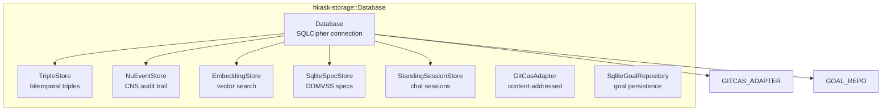
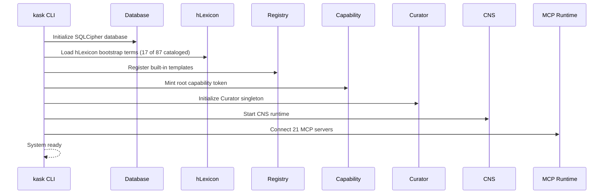
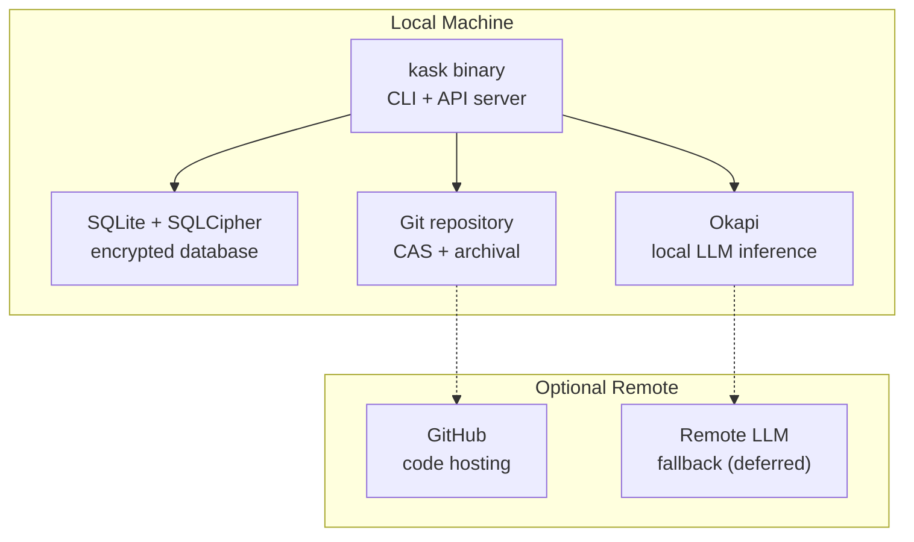

# hKask Persistence & Lifecycle Specification

**Purpose:** Authoritative specification for storage model, bitemporal triples, memory pipelines, bootstrap sequence, evolution rules, and deployment topology. Single source of truth for DDMVSS categories **Persistence** and **Lifecycle**.

**Related:** [`domain-and-capability.md`](domain-and-capability.md), [`interface-and-composition.md`](interface-and-composition.md), [`trust-security-observability.md`](trust-security-observability.md)

**Verification:** `cargo check --workspace && cargo test -p hkask-storage`

---

## Contents

| Section | Description |
|---------|-------------|
| [§1 Storage Engine](#1-storage-engine) | Technology stack, database architecture, encryption |
| [§2 Bitemporal Triple Schema](#2-bitemporal-triple-schema) | Triple store, temporal semantics, memory perspectives |
| [§3 Embedding Vector Storage](#3-embedding-vector-storage) | Embedding store, similarity search, configuration |
| [§4 Content-Addressed Storage](#4-content-addressed-storage) | Git CAS, content-addressed blobs |
| [§5 Specification Storage](#5-specification-storage) | Spec store, categories, persistence |
| [§6 Additional Storage Components](#6-additional-storage-components) | Session store, consent store, goal repository |
| [§7 Bootstrap Sequence](#7-bootstrap-sequence) | Database initialization, migration, seed data |
| [§8 Evolution Rules](#8-evolution-rules) | Versioning, migration, deprecation policy |
| [§9 Deployment Topology](#9-deployment-topology) | Single-process, file layout, build commands |
| [Loop Assignment](#loop-assignment) | Per-server loop assignments |
| [References](#references) | Citations |

---

## 1. Storage Engine

### 1.1 Technology Stack

| Component | Technology | Version | Purpose |
|-----------|-----------|---------|---------|
| **Database** | SQLite | 3.x | Embedded relational store |
| **Encryption** | SQLCipher | vendored | AES-256-CBC at-rest |
| **Vector search** | sqlite-vec | 0.1.x | Embedding similarity |
| **Content store** | Git CAS | gix 0.81 | Content-addressed blobs (`hkask-mcp/src/git_cas/`) |
| **Key derivation** | Argon2id | 0.5.x | Passphrase → key |

**Single storage crate:** `hkask-storage` (~4,010 LOC, measured 2026-06-05) consolidates all persistence.

### 1.2 Database Architecture



<!-- DIAGRAM_ALIGNMENT
id: DIAG-PL-001
verified_date: 2026-06-07
verified_against: crates/hkask-storage/src/database.rs; triples.rs; nu_event_store.rs; embeddings.rs; spec_store.rs; goals.rs
status: VERIFIED
-->

**ERD diagrams:** [`reference/hKask-erd.md`](reference/hKask-erd.md), [`reference/registry-erd.md`](reference/registry-erd.md), [`reference/subsystem-erds.md`](reference/subsystem-erds.md)

### 1.3 Encryption Configuration

| Parameter | Value | Rationale |
|-----------|-------|-----------|
| **Cipher** | AES-256-CBC | SQLCipher default, NIST-approved |
| **KDF** | Argon2id | Memory-hard, GPU-resistant |
| **Key source** | Passphrase-derived | User-provided, never stored |
| **Page size** | 4096 bytes | SQLite default |
| **HMAC** | SHA-512 | Page authentication |
| **No cross-machine sync** | Architecture invariant | User sovereignty |

---

## 2. Bitemporal Triple Schema

### 2.1 Core Schema

hKask stores knowledge as **bitemporal triples** — entity-attribute-value with two time dimensions:[^snodgrass-bitemporal]

```sql
CREATE TABLE IF NOT EXISTS triples (
    id          TEXT PRIMARY KEY,
    entity      TEXT NOT NULL,
    attribute   TEXT NOT NULL,
    value       TEXT NOT NULL,      -- serialized serde_json::Value
    confidence  REAL NOT NULL DEFAULT 1.0,
    -- Valid time: when the fact was true in the domain
    valid_from  TEXT NOT NULL,
    valid_to    TEXT,                -- NULL = still valid
    -- Transaction time: when we recorded the fact
    transaction_at TEXT DEFAULT (datetime('now')),
    -- Observer identity & perspective
    owner_webid TEXT NOT NULL,      -- WebID of the triple owner
    perspective TEXT,              -- Option<WebID>: Some = episodic, None = semantic
    visibility  TEXT NOT NULL DEFAULT 'private'  -- Visibility enum
);
```

**Implementation:** `TripleStore` (`triples.rs:79`), `Triple` (`triples.rs:22`)

[^snodgrass-bitemporal]: Snodgrass, R. T. (1999). *Developing Time-Oriented Database Applications in SQL*. Morgan Kaufmann.

### 2.2 Time Semantics

| Dimension | Meaning | Use Case |
|-----------|---------|----------|
| **Valid time** | When fact was true in domain | "Agent X had capability Y from May 1-15" |
| **Transaction time** | When we recorded the fact | "We learned about Y on May 2" |
| **Confidence** | Bayesian probability [0.0, 1.0] | Combined evidence from observers |
| **Perspective** | Owning agent WebID (Some) or None | Some = episodic (private), None = semantic (public) |
| **Visibility** | Access scope of the triple | Private (episodic) or Public (semantic) |

### 2.3 Memory Perspectives

| Pipeline | Perspective | Visibility | Storage |
|----------|------------|------------|---------|
| **Episodic** | `agent_id` | Private | Triples with agent-scoped valid time |
| **Semantic** | null (global) | Public | Triples without agent scoping |

**Implementation:** `hkask-memory` (~695 LOC, measured 2026-06-05) — semantic/episodic pipeline (memory consolidation: episodic → semantic)

---

## 3. Embedding Vector Storage

### 3.1 sqlite-vec Integration

```sql
CREATE TABLE IF NOT EXISTS embeddings (
    id TEXT PRIMARY KEY,
    entity_ref TEXT NOT NULL,      -- reference to triple entity (no FK constraint)
    vector BLOB NOT NULL,
    dimensions INTEGER NOT NULL,
    model TEXT NOT NULL,
    created_at TEXT DEFAULT (datetime('now'))
);

CREATE INDEX IF NOT EXISTS idx_embeddings_entity_ref ON embeddings(entity_ref);

CREATE VIRTUAL TABLE IF NOT EXISTS vec_embeddings USING vec0(
    id TEXT PRIMARY KEY,
    embedding float[$DIM]        -- model-dependent dimensions
);
```

**Implementation:** `EmbeddingStore` (`embeddings.rs:49`)

**KNN query:**
```rust
// Via EmbeddingPort trait (hkask-types/src/ports.rs)
fn search(&self, query_vector: &[f32], limit: usize) -> Result<Vec<SimilarityResult>, EmbeddingError>;
```

### 3.2 Configuration

| Parameter | Default | Notes |
|-----------|---------|-------|
| **Dimensions** | 384 | Model-dependent (all-MiniLM-L6-v2) |
| **Distance** | Cosine | Standard for text embeddings |
| **Backend** | FastEmbed | Local via sqlite-vec |
| **Contingency** | Qdrant | External vector DB (deferred) |

---

## 4. Content-Addressed Storage

### 4.1 Git CAS

`GitCasAdapter` (`hkask-mcp/src/git_cas/`) provides content-addressed blob storage:
- **Git objects** for immutable storage
- **Provenance tracking** via git history
- **Tamper detection** via content hash verification

**Use cases:** Template source archival, triple snapshots, spec manifests, audit log immutability.

**Port:** `GitCASPort` trait (`hkask-types/src/ports/git_cas.rs`)

---

## 5. Specification Storage

`SqliteSpecStore` (`spec_store.rs:12`) persists DDMVSS specifications:
- Implements `SpecStore` trait (`hkask-types/src/spec.rs:314`)
- CRUD operations for `Spec` entities
- `DefaultSpecCurator` (`hkask-agents/src/curator/spec_curator.rs`) — evaluate, reconcile, cultivate

---

## 6. Additional Storage Components

| Component | Location | Purpose |
|-----------|----------|---------|
| `StandingSessionStore` | `crates/hkask-storage/src/standing_session.rs` | Chat session persistence |
| `MetacognitionLoop` | `crates/hkask-agents/src/curator_agent/metacognition.rs` | Curator health monitoring and metacognition |
| `SqliteGoalRepository` | `crates/hkask-storage/src/goals.rs` | Goal persistence and verification |

---

## 7. Bootstrap Sequence

### 7.1 Startup Order



<!-- DIAGRAM_ALIGNMENT
id: DIAG-PL-002
verified_date: 2026-06-07
verified_against: crates/hkask-cli/src/main.rs; crates/hkask-storage/src/database.rs:59; crates/hkask-agents/src/pod/manager.rs:30
status: VERIFIED
-->

### 7.2 Bootstrap Steps

| Step | Operation | Implementation |
|------|-----------|---------------|
| 1 | Initialize SQLCipher database | `Database::new()` |
| 2 | Load hLexicon bootstrap terms (17 loaded by `Lexicon::bootstrap()`; 87 cataloged) | Bootstrap lexicon |
| 3 | Register built-in templates | `SqliteRegistry` |
| 4 | Mint root capability token | `CapabilityToken` with `hkask-root-authority` WebID |
| 5 | Initialize Curator singleton | `AgentPod` or `Replicant` + system persona |
| 6 | Start CNS runtime | `CnsRuntime` with `UnifiedVarietyTracker` |
| 7 | Connect MCP servers | `McpRuntime` discovers 21 MCP servers |

---

## 8. Evolution Rules

### 8.1 Versioning

- **Git-only versioning** — SHA-based, no SemVer in code
- **Workspace version** — `0.23.0` in `Cargo.toml` for metadata only
- **Documentation versioning** — Semantic versioning in metadata headers

### 8.2 Migration Policy

- **Forward-only** — no rollback support
- **Schema migrations** — SQL migrations in `docs/storage/migrations/`
- **Template evolution** — Jinja2/LLM selection, not Rust branching

### 8.3 Deprecation Policy

Per principle P7: **Prefer deletion over deprecation**

1. Delete code from crate
2. Remove from registry
3. Emit `cns.spec.deprecated` span (if applicable)
4. Git history preserves removed code

**No backward compatibility layers** — zero backward compatibility is explicit design choice.[^lehman-evolution]

[^lehman-evolution]: Lehman, M. M. (1980). *Programs, Life Cycles, and Laws of Software Evolution*. Proceedings of the IEEE.

---

## 9. Deployment Topology

### 9.1 Local-First



<!-- DIAGRAM_ALIGNMENT
id: DIAG-PL-003
verified_date: 2026-06-07
verified_against: Cargo.toml; crates/hkask-storage/src/database.rs
status: VERIFIED
-->

### 9.2 Technology Requirements

| Component | Minimum | Recommended |
|-----------|---------|-------------|
| **Rust** | 2024 edition (1.91) | Latest stable |
| **RAM** | 4 GB | 8 GB+ (for LLM inference) |
| **Disk** | 1 GB | 10 GB+ (models + database) |
| **OS** | Linux, macOS | Linux (primary) |
| **Git** | 2.x | Latest |

### 9.3 Build Commands

```bash
cargo build --release          # Build
cargo check --workspace        # Check
cargo test --workspace         # Test
cargo clippy --workspace -- -D warnings  # Lint
cargo fmt --check              # Format
cargo run --bin kask -- <subcommand>     # Run
```

---

## Loop Assignment

This spec's content maps to the [6-loop authority model](loop-architecture.md) as follows:

| Spec Domain | Loop | Rationale |
|------------|------|-----------|
| SQLite + SQLCipher | Episodic (Loop 2a) + Semantic (Loop 2b) | Storage is split by visibility: private → Episodic, shared → Semantic. Consolidation bridges episodic → semantic. |
| Bitemporal triples | Episodic (Loop 2a) + Semantic (Loop 2b) | Temporal validity spans both memory systems |
| Embeddings | Semantic Memory (Loop 2b) | Vector similarity is shared knowledge retrieval |
| Bootstrap sequence | All loops | System startup initializes all loops in dependency order |
| Evolution rules | Curation (Loop 5) | Schema evolution is a Curation concern — the Curator directs system change |

---

## References

[^snodgrass-bitemporal]: Snodgrass, R. T. (1999). *Developing Time-Oriented Database Applications in SQL*. Morgan Kaufmann.
[^lehman-evolution]: Lehman, M. M. (1980). *Programs, Life Cycles, and Laws of Software Evolution*. IEEE.
[^sqlite]: Hipp, D. R. (2024). *SQLite*. https://www.sqlite.org/.
