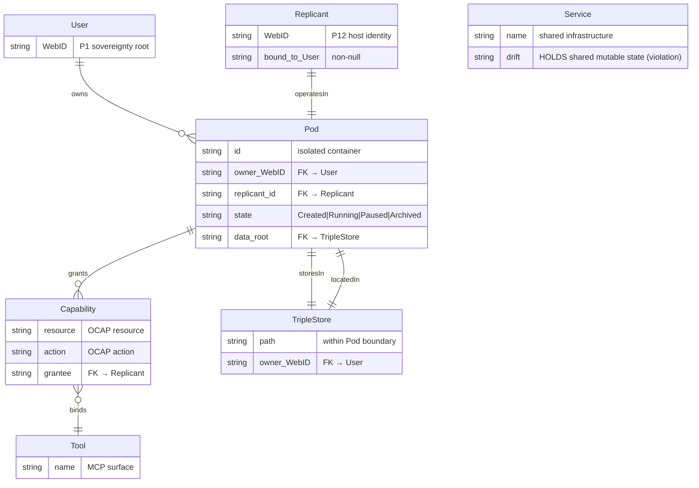

# AgentPod Drift Semantic Map

<!-- RESTORED: semantic map anchored on 7ea248b (pod_lifecycle.mmd), 7aa85d6 (continuation-pod-agent-service.md) -->

## Root-Cause Analysis

**Drift vector:** `:Service` became the mutable data store (shared state) instead of `:Pod` holding its own `:TripleStore` within the sovereignty perimeter.

**First causes, decomposed as lean RDF triples:**

```turtle
@prefix : <hkask:pod#>

# ── Entities ──
:User        a :SovereignOwner  ; :webid "P1" .
:Replicant   a :AgentInstance   ; :bound_to :User .
:Pod         a :IsolatedContainer ; :owned_by :User .
:Tool        a :MCPSurface      ; :requires :Capability .
:Service     a :SharedInfrastructure .
:TripleStore a :DataRoot        ; :located_in :Pod .
:Capability  a :OCAPGrant       .

# ── Correct Model (Target) ──
:User       :owns          :Pod .
:Replicant  :operatesIn    :Pod .
:Pod        :connectsTo    :Tool .
:Pod        :storesIn      :TripleStore .
:TripleStore :locatedIn     :Pod .
:User       :grants        :Capability .
:Capability :delegated_to  :Replicant .

# ── Drift (Current Violation) ──
:Service    :holds         :TripleStore .   # ← DRIFT: shared mutable state
:User       :reads_from    :Service .       # ← DRIFT: bypasses pod boundary
:Replicant  :writes_to     :Service .       # ← DRIFT: anonymous write path

# ── Violated Principles ──
# P12 violation: :Service :holds :TripleStore ⇒ anonymous agency risk
#                   (no authenticated replicant host on shared writes)
# P1  violation: :Service :holds :TripleStore ⇒ blurred sovereignty perimeter
#                   (user data lives outside :Pod boundary)
```

## Mermaid Entity-Relation Diagram



## Correction Map

Every subsequent task (T1–T7) annotates which entity-relation it corrects:

| Task | Corrects | Entity-Relation |
|------|----------|----------------|
| T1 | P1, P12 | Defines `Pod.owner_WebID` and `TripleStore.locatedIn` contract |
| T2 | P8 | Registers `PodLifecycle` CNS span for observability |
| T3 | P1 | Relocates `:TripleStore :locatedIn :Pod` (removes `:Service :holds`) |
| T4 | P1 | Makes pod exportable/importable (sovereignty portability) |
| T5 | P2, P4 | Binds `:Tool` through `:Capability :granted_by :Pod` (not global) |
| T6 | P8 | Restores deleted documentation (provenance) |
| T7 | P1, P12 | Vertical integration test proving zero shared state across pods |
| T8 | P9 | Tracks open questions as CNS Observables |
