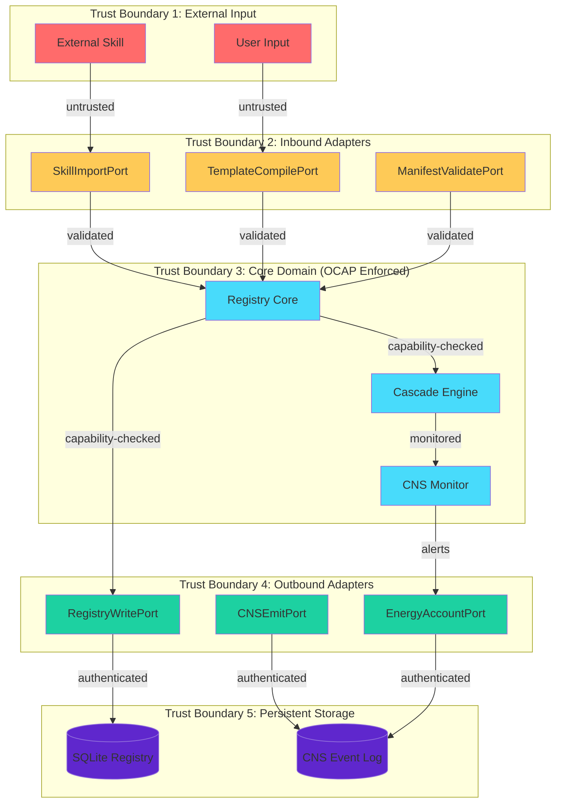

# Pragmatic Composition — Entity Relationship Diagram

## ℏKask v0.21.0

```mermaid
erDiagram
    SKILL ||--o{ TEMPLATE : "translates_to"
    SKILL ||--o{ MANIFEST : "translates_to"
    TEMPLATE ||--o{ LEXICON : "grounded_by"
    MANIFEST ||--|{ STEP : "defines"
    MANIFEST ||--o{ ENERGY_CAP : "enforces"
    TEMPLATE ||--o{ CONTRACT : "declares"
    REGISTRY ||--o{ TEMPLATE : "contains"
    REGISTRY ||--o{ MANIFEST : "contains"
    CNS ||--o{ SPAN : "emits"
    CNS ||--o{ VARIETY_COUNTER : "monitors"
    CNS ||--o{ ALGEDONIC_ALERT : "triggers"
    OCAP ||--o{ CAPABILITY : "grants"
    OCAP ||--o{ DELEGATION : "chains"
    CASCADE ||--o{ STAGE : "composes"
    CASCADE ||--o{ CASCADE : "references"
    
    SKILL {
        string id
        string name
        string source "Claude|Zapier|LangChain"
        json prompts
        json process_logic
        string visibility
    }
    
    TEMPLATE {
        string id
        string template_type "Prompt|Process|Cognition"
        string source_path
        array lexicon_terms
        object contract
        string frontmatter
        u64 energy_cap
        string visibility
    }
    
    MANIFEST {
        string id
        string name
        string description
        array steps
        u64 energy_cap
        string visibility
        string editor
    }
    
    STEP {
        int ordinal
        string action "select|populate|execute"
        string template_ref
        string model_tier
        string mcp
        string renderer
        object output_schema
    }
    
    CONTRACT {
        object input_schema
        object output_schema
        array required_fields
    }
    
    ENERGY_CAP {
        u64 max_budget
        u64 current_cost
        string unit "tokens/4"
        bool exceeded
    }
    
    LEXICON {
        string term
        string domain "WordAct|FlowDef|KnowAct"
        string definition
        bool canonical
    }
    
    REGISTRY {
        string root_path
        string index_method "filesystem|sqlite|git"
        bool cache_valid
    }
    
    CNS {
        string span_namespace "cns.*"
        u64 variety_counter
        u64 threshold
        bool algedonic_active
    }
    
    SPAN {
        string id
        string category "connector|pipeline|tool|prompt|agent_pod|energy"
        string phase "observe|regulate|outcome"
        json observation
        timestamp emitted_at
    }
    
    VARIETY_COUNTER {
        string entity_type
        u64 count
        u64 deficit
        bool alert_triggered
    }
    
    ALGEDONIC_ALERT {
        string id
        string severity "low|medium|high|critical"
        string reason
        timestamp triggered_at
        string escalated_to "Curator|Human"
    }
    
    OCAP {
        string owner_webid
        json capabilities
        json delegations
    }
    
    CAPABILITY {
        string id
        string resource
        string action
        string granted_by
        string granted_to
        object signature
        timestamp expires_at
    }
    
    DELEGATION {
        string id
        capability capability
        string delegator
        string delegate
        object signature
        string parent_id
    }
    
    CASCADE {
        string id
        array pre_stages
        array core_stages
        array post_stages
        u8 max_depth "7"
    }
    
    STAGE {
        string name
        array templates
        string condition
    }
```

## Cardinality Annotations

| Relationship | Cardinality | Description |
|-------------|-------------|-------------|
| SKILL → TEMPLATE | 1:N | One skill translates to multiple templates |
| SKILL → MANIFEST | 1:N | One skill translates to multiple manifests |
| TEMPLATE → LEXICON | N:M | Templates reference multiple lexicon terms |
| MANIFEST → STEP | 1:N | Manifest defines ordered step sequence |
| MANIFEST → ENERGY_CAP | 1:1 | Each manifest has one energy cap |
| TEMPLATE → CONTRACT | 1:1 | Each template has one input/output contract |
| REGISTRY → TEMPLATE | 1:N | Registry contains multiple templates |
| REGISTRY → MANIFEST | 1:N | Registry contains multiple manifests |
| CNS → SPAN | 1:N | CNS emits multiple span types |
| CNS → VARIETY_COUNTER | 1:N | CNS monitors multiple variety counters |
| CNS → ALGEDONIC_ALERT | 1:N | CNS triggers multiple alerts |
| OCAP → CAPABILITY | 1:N | OCAP grants multiple capabilities |
| OCAP → DELEGATION | 1:N | OCAP chains multiple delegations |
| CASCADE → STAGE | 1:N | Cascade composes multiple stages |
| CASCADE → CASCADE | N:N | Cascades can reference other cascades (recursive) |

## Security Boundaries (Bruce Schneier Threat Model)

### Threat Mitigations

| Threat | Mitigation | Implementation |
|--------|------------|----------------|
| **Path Traversal** | Input validation | `Registry::validate_template_path()` |
| **Template Injection** | Sandboxed Jinja2 | `minijinja` with restricted builtins |
| **Capability Forgery** | Cryptographic signatures | Ed25519/SHA256-HMAC |
| **Recursion Overflow** | Depth limiting | `MAX_MATROSHKA_DEPTH = 7` |
| **Energy Exhaustion** | Budget caps | `energy_cap` per manifest |
| **OCAP Bypass** | Runtime checks | `AccessEvaluator::evaluate()` |
| **Variety Deficit** | Algedonic alerts | `VarietyMonitor::check_threshold()` |
| **Data Exfiltration** | Visibility gating | `Visibility::Private|Shared|Public` |

*ℏKask v0.21.0 — Pragmatic Composition ERD*
